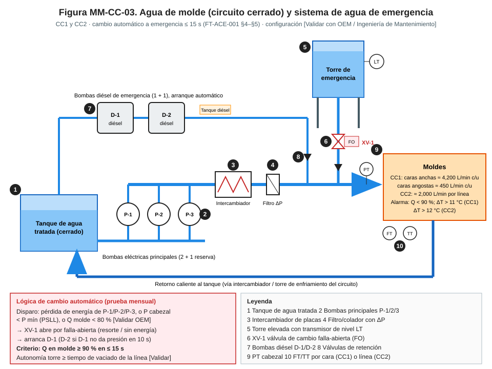
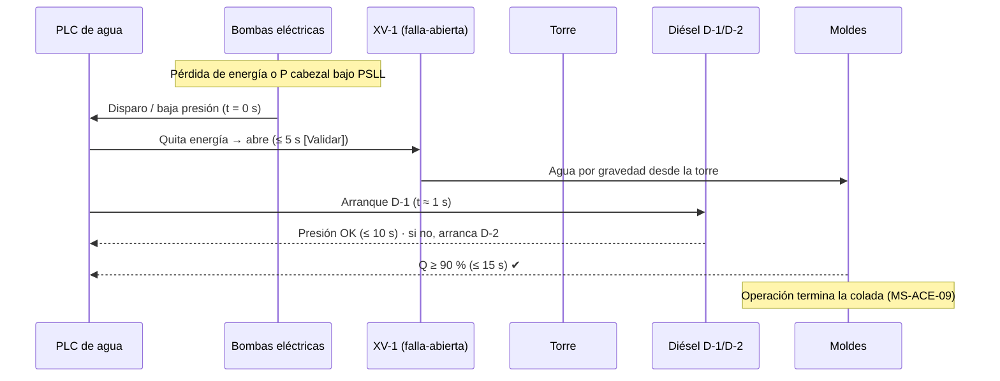

# MM-CC-03 — Sistemas de agua de molde, enfriamiento secundario y agua de emergencia (pruebas de torre y bombas diésel)

| Código | Versión | Estado | Área | Dueño del proceso | Elaboró | Revisión técnica | Revisión de seguridad | Aprobó | Fecha | Próxima revisión |
|---|---|---|---|---|---|---|---|---|---|---|
| MM-CC-03 | 0.2 | Borrador para validación | Acería · casa de bombas CC1 / CC2 | C-12 Supervisor de Mantenimiento Eléctrico e Instrumentación | gerente-personal-sindicalizado (Líder Academia de Mantenimiento y Confiabilidad) | experto-operativo-metalurgia | experto-seguridad-salud — visto bueno con observaciones, 2026-09-25 | Pendiente (Gerente de Acería / Director) | 2026-09-25 | 2027-09-25 |

> ⚠️ Base: FT-ACE-001 §4–§5. CC1 agua de molde: caras anchas ≈ 4,200 L/min c/u, angostas ≈ 450 L/min c/u, ΔT 6–9 °C, **alarma ΔT > 11 °C o caudal < 90 %**; secundaria 10 zonas, 0.8–1.2 L/kg. CC2: ≈ 2,000 L/min por línea, ranura 10–12 m/s, ΔT 6–10 °C, **alarma ΔT > 12 °C o caudal < 90 %**; secundaria 1.5–2.0 L/kg. **Agua de emergencia: torre elevada + bombas diésel, entrada automática en ≤ 15 s.** Presiones, calidad de agua y tiempos internos: **[Validar con OEM / Ingeniería de Mantenimiento]**.

## 1. Objetivo y alcance
Garantizar que el molde **nunca se quede sin agua** mientras haya acero en él, y que el enfriamiento secundario entregue el caudal que pide el modelo.
**Incluye:** bombas principales, intercambiadores, filtros, tratamiento de agua, instrumentación (FT, TT, PT), válvulas de control de secundaria, torre de emergencia, bombas diésel, válvula de cambio automático, UPS de control; pruebas periódicas de cambio a emergencia.
**No incluye:** boquillas en segmentos (MM-CC-02), molde (MM-CC-01).

## 2. Roles y responsabilidades
| Rol | Responsabilidad en este proceso | R/A/C/I |
|---|---|---|
| C-12 Supervisor Eléctrico e Instrumentación | Dueño; programa de pruebas de emergencia, liberación | A |
| S-19 Mecánico de Acería | Bombas, válvulas, intercambiadores, filtros, diésel (mecánica) | R |
| S-21 Instrumentista | FT, TT, PT, LT, lógica de cambio, calibraciones | R |
| S-20 Electricista | Motores, CCM, UPS, baterías y arranque de diésel | R |
| C-06 Supervisor de CC | Autoriza ventana de prueba; firma liberación | A (operación) |
| S-12 Operador de Púlpito de CC | Confirma alarmas y caudales en HMI durante pruebas | R |
| Tratamiento de aguas (interno o proveedor) | Química del agua | R |
| C-14 Ingeniero de Confiabilidad | Vibraciones, tendencia de ΔT e incrustación | C |

## 3. Descripción del proceso
El agua de molde es un **circuito cerrado** de agua tratada: tanque → bombas (2 + 1) → intercambiador → filtro → moldes → retorno. Si falla la energía o la presión cae, la **válvula XV-1 abre por falla-abierta** y la torre alimenta por gravedad mientras arrancan las **bombas diésel**. El criterio de diseño es: **caudal en molde ≥ 90 % en ≤ 15 s**.

## 4. Equipos y maquinaria
| Equipo / componente | Función | Especificación clave | Condición para operar (verificación) |
|---|---|---|---|
| Bombas principales P-1/P-2/P-3 | Circulación de agua de molde | 2 en servicio + 1 reserva con arranque automático | Reserva disponible y en automático |
| Tanque de agua tratada | Reserva del circuito cerrado | Nivel con alarma | Nivel ≥ mínimo |
| Intercambiador de placas | Retirar calor | Aproximación de T según OEM | ΔP y aproximación normales |
| Filtros / coladores | Proteger ranuras del molde | Malla ≤ 200 µm [Validar] | ΔP < 0.5 bar |
| Torre elevada | Agua por gravedad | Volumen para ≥ tiempo de vaciado de la máquina [Validar] | Nivel ≥ 90 % |
| XV-1 válvula de cambio (falla-abierta) | Conectar la torre | Abre sin energía (resorte) | Carrera completa ≤ 5 s [Validar] |
| Bombas diésel D-1/D-2 | Emergencia prolongada | Arranque automático; tanque de diésel | Combustible ≥ 75 %; baterías cargadas |
| FT/TT por cara (CC1) o línea (CC2) | Alarmas de caudal y ΔT | Exactitud FT ±1 %; TT ±0.2 °C | Calibrados |
| Válvulas de control de secundaria | Caudal por zona según modelo | Lazo de control | Error ≤ ±3 % del punto de ajuste |
| UPS de control | Mantener PLC e instrumentos | Autonomía ≥ 30 min [Validar] | Prueba de baterías vigente |

## 5. Especificaciones, tolerancias y frecuencias
| Especificación | Unidad | Objetivo | Rango / tolerancia | Límite (alarma / rechazo) | Acción si está fuera | Instrumento | Frecuencia |
|---|---|---|---|---|---|---|---|
| Caudal cara ancha CC1 | L/min | 4,200 | ±5 % | < 90 % alarma | Revisar filtro, válvula, bomba | FT | Continuo |
| Caudal cara angosta CC1 | L/min | 450 | ±5 % | < 90 % alarma | Ídem | FT | Continuo |
| ΔT molde CC1 | °C | 7.5 | 6–9 | > 11 alarma | Reducir velocidad (MO-CC1-04); revisar | TT ent/sal | Continuo |
| Caudal por línea CC2 | L/min | 2,000 | ±5 % | < 90 % alarma | Revisar | FT | Continuo |
| ΔT molde CC2 | °C | 8 | 6–10 | > 12 alarma | Reducir velocidad (MO-CC2-04) | TT | Continuo |
| Presión de suministro a moldes | bar | OEM (típ. 8–10 [Validar]) | ±0.5 | Baja = alarma y arranque de reserva | Revisar bombas | PT | Continuo |
| Temperatura de entrada | °C | 35 [Validar] | 30–40 | > 42 | Revisar intercambiador | TT | Continuo |
| Conductividad del agua de molde | µS/cm | ≤ 50 [Validar] | ≤ 100 | > 150 | Purgar/reponer con agua desmineralizada | Conductímetro | Diario |
| pH / dureza / cloruros | — / °dH / mg/L | 8.5–9.5 / ≤ 0.5 / ≤ 10 [Validar] | — | Fuera de rango | Ajustar tratamiento | Laboratorio | Semanal |
| ΔP de filtros | bar | ≤ 0.3 | ≤ 0.5 | > 0.5 | Cambiar a filtro de reserva y limpiar | Manómetro diferencial | Diario |
| Agua específica secundaria CC1 / CC2 | L/kg | Según modelo | 0.8–1.2 / 1.5–2.0 | Desviación > ±5 % en zona | Revisar válvula/boquillas | FT por zona | Continuo |
| Presión de aire de atomización | bar | OEM (típ. 2–4 [Validar]) | ±0.3 | Baja | Revisar compresor | PT | Continuo |
| Nivel de torre | % | 100 | ≥ 90 | < 90 alarma | Reponer; investigar fuga | LT + visual | Continuo / diario |
| Tiempo de cambio a emergencia | s | ≤ 10 | — | **> 15 s = 🛑 no colar** | Corregir y repetir prueba | Registro del PLC + cronómetro | Mensual (paro) · anual (apagón real) |
| Caudal en molde en emergencia | % | ≥ 100 | ≥ 90 | < 90 | Corregir | FT | En cada prueba |
| Arranque de diésel | s | ≤ 10 a presión | — | No arranca | Arrancar D-2; reparar D-1 | Registro | Semanal |
| Combustible diésel | % | ≥ 90 | ≥ 75 | < 75 | Recargar | Nivel | Semanal |
| Baterías de arranque (24 V) | V | ≥ 25.5 en flotación [Validar] | — | < 24.5 | Cambiar/cargar | Multímetro + probador de carga | Semanal |
| Vibración de bombas | mm/s RMS | ≤ 2.8 | ≤ 4.5 | > 7.1 | Programar reparación | Analizador (ISO 10816-3) | Mensual |
| Aislamiento de motores | MΩ | ≥ 100 | ≥ OEM | < 10 | No arrancar; secar/reparar | Megger 1,000/2,500 V | Anual |
| Calibración FT / TT / PT | % / °C | ±1 / ±0.2 / ±0.5 % | — | Fuera | Recalibrar | Calibrador | Anual (FT, TT) · semestral (TT de molde) |

### 5.1 Rutina preventiva y predictiva
| Tarea | Frecuencia | Rol | Duración | Ventana |
|---|---|---|---|---|
| Recorrido casa de bombas: fugas, sellos, ruidos, ΔP filtros, niveles | Cada turno | S-19 | 30 min | En operación |
| Conductividad y nivel de torre | Diario | S-21 / aguas | 15 min | En operación |
| Arranque de diésel D-1 y D-2 en recirculación, 30 min con carga | Semanal | S-19, S-20 | 1 h | En operación (no afecta molde) |
| Prueba de arranque automático de bomba de reserva | Mensual | S-21, S-20 | 30 min | En operación con C-06 |
| Prueba de cambio a emergencia (simulación de pérdida de bombas) | Mensual | S-21, S-19, S-20, S-12 | 1–2 h | **Paro programado, sin acero en la máquina** |
| Prueba integral de apagón (black-out) | Anual | C-12 + todos | 1 turno | Paro mayor |
| Vibraciones y termografía de bombas/CCM | Mensual | C-14 / S-20 | 2 h | En operación |
| Análisis químico completo del agua | Semanal | Tratamiento de aguas | — | En operación |
| Limpieza de intercambiador | Semestral o por aproximación > OEM | S-19 | 1 turno | Paro mensual (con intercambiador de reserva) |
| Mantenimiento del motor diésel (aceite, filtros, refrigerante) | Por horas o semestral | S-19 / proveedor | 4 h | Con diésel de reserva disponible |
| Calibración de instrumentos | Anual / semestral | S-21 | 1 turno | Paro mayor |
| Prueba de capacidad de UPS y baterías | Semestral | S-20 | 2 h | Paro mensual |

## 6. Seguridad
### 6.1 Peligros y controles críticos
| Peligro | Consecuencia | Control crítico | Verificación |
|---|---|---|---|
| Falla de agua de molde con acero | Breakout, explosión agua–metal | Bomba de reserva + torre + diésel ≤ 15 s; **🛑 no colar con emergencia fuera de servicio** | Prueba mensual registrada; estado en HMI |
| Arranque automático inesperado de diésel o bomba de reserva | Atrapamiento | LOTO del selector automático, desconexión de batería del diésel | Intento de arranque rechazado |
| Agua a presión y caliente | Golpe, quemadura | Aislar, drenar, ventear | Manómetro 0 bar |
| Energía eléctrica en CCM | Electrocución, arco | LOTO NOM-029 | Detector de tensión |
| Gases de escape del diésel | CO | Ventilación de la casa de diésel; detector personal | CO < 25 ppm; salir a 25 ppm, evacuar a 200 ppm [Verificar NOM-010] (MS-ACE-06) |
| Químicos de tratamiento | Quemadura química | Hoja de seguridad, EPP químico | Regadera de emergencia operativa |
| Trabajo en la torre (altura) | Caída | Arnés y línea de vida NOM-009 | Permiso |
| Tanques y fosas | Espacio confinado | NOM-033 (MS-ACE-05) | Permiso y gases: O₂ 19.5–23.5 %, CO < 25 ppm, < 10 % LEL para entrar; trabajo en caliente con 0 % LEL detectable (≤ 1 % de lectura) |

### 6.2 EPP obligatorio
Casco, lentes, guantes, botas de seguridad, protección auditiva (casa de bombas y diésel > 85 dB(A)), careta y guantes químicos para tratamiento, arnés en torre, EPP eléctrico según categoría en CCM.

### 6.3 Permisos, bloqueos y zonas de exclusión
**Regla:** cualquier trabajo que deje fuera **una** de las barreras (bomba de reserva, torre, XV-1, diésel) requiere autorización escrita de C-03 y C-12 y **la máquina no cuela** si la barrera fuera es la torre o ambos diésel. [Validar con C-03 / C-16]
**Puntos de aislamiento:** E1 CCM de la bomba intervenida y selector "automático" de la reserva; E-D batería del diésel desconectada + selector en "fuera" con candado; E-W válvulas de succión y descarga de la bomba + dren; E-T válvula de la torre (solo con máquina parada); E-XV aire/energía de XV-1 con la válvula bloqueada mecánicamente (solo con máquina parada). **Prueba de energía cero:** intento de arranque local y remoto rechazado; manómetro 0 bar; detector de tensión en bornes del motor.
**Zona de exclusión:** acoplamientos de bombas en prueba; escape del diésel.

## 7. Calidad
| Variable crítica de calidad | Especificación | Método / frecuencia | Registro | Defecto si falla |
|---|---|---|---|---|
| 🔎 Caudal y ΔT de molde | Ficha §4–§5 | Continuo | Historial | Cáscara delgada, grietas longitudinales, depresiones, breakout |
| 🔎 Calidad del agua de molde | Conductividad ≤ 100 µS/cm; dureza ≤ 0.5 °dH | Diario / semanal | Laboratorio | Incrustación en ranuras → molde caliente, grietas, menor vida del Cu |
| 🔎 Agua específica secundaria por zona | Modelo ±5 % | Continuo | Historial del modelo | Grietas superficiales y transversales, abultamiento, grietas internas |
| 🔎 Exactitud de TT de molde | ±0.2 °C | Semestral | Certificado | ΔT falso → alarmas no confiables |

## 8. Procedimiento paso a paso (prueba mensual de cambio a emergencia)
| # | Paso | Cómo hacerlo (detalle y medición) | Criterio de aceptación | ★ | Rol |
|---|---|---|---|---|---|
| 1 | Programa la prueba | Ventana de paro sin acero en CC1 y CC2; aviso a púlpitos | Autorización de C-06 | ★ | C-12 |
| 2 | Verifica condiciones iniciales | Torre ≥ 90 %; diésel ≥ 75 %; baterías ≥ 25.5 V; XV-1 cerrada; moldes con agua a caudal nominal | Todo en rango | | S-21, S-19 |
| 3 | Prepara registro | Tendencia de FT de moldes a 1 s; cronómetro; observador en XV-1 y en diésel | Registro activo | 🔎 | S-21 |
| 4 | Simula la falla | Confirma sin acero en CC1 y CC2 y personal fuera de acoplamientos y del escape del diésel; dispara las bombas principales desde el CCM (o señal de prueba OEM) | t = 0 registrado | ★ | S-20 |
| 5 | Observa XV-1 | Tiempo de apertura completa | ≤ 5 s [Validar] | 🔎 | S-19 |
| 6 | Observa diésel | Arranque de D-1 y presión en cabezal | ≤ 10 s | 🔎 | S-19 |
| 7 | Verifica caudal en moldes | Todas las caras (CC1) y líneas (CC2) | ≥ 90 % en ≤ 15 s | ★ | S-21, S-12 |
| 8 | Sostén | Mantén en emergencia 10 min; vigila nivel de torre y temperatura del diésel | Estable | | S-19 |
| 9 | Prueba D-2 | Repite con D-1 bloqueado | D-2 cumple ≤ 10 s | ★ | S-19, S-20 |
| 10 | Restablece | Arranca bombas principales, cierra XV-1, diésel a automático, repone torre | Estado normal, torre ≥ 90 % | ★ | S-21, S-19 |
| 11 | Verifica selectores | Todos en "automático"; ningún candado de prueba olvidado | Verificado por 2 personas | ★ | S-21, S-12 |
| 12 | Libera | Checklist firmado por C-12 y C-06 | Firmado | ★ | C-12, C-06 |

**Checklist de liberación (Mantenimiento + Operación):** [ ] tiempo a Q ≥ 90 %: ____ s (≤ 15 s) · [ ] D-1 y D-2 arrancan ≤ 10 s · [ ] torre ≥ 90 % · [ ] selectores en automático · [ ] XV-1 cerrada y en automático · [ ] alarmas de caudal y ΔT probadas · Firma C-12/S-21: ____ Firma C-06/S-12: ____ Fecha/hora: ____

## 9. Condiciones anormales y respuesta
| Síntoma / alarma | Causa probable | Acción inmediata | A quién avisar |
|---|---|---|---|
| Caudal de molde < 90 % | Filtro, válvula, bomba | Operación reduce velocidad / termina colada; arrancar reserva | C-06, C-12 |
| ΔT > 11 °C (CC1) / > 12 °C (CC2) con caudal normal | Incrustación, TT dañado, pegado | Operación reduce velocidad; verificar TT | C-08, S-21 |
| Apagón con acero en máquina | Falla eléctrica | Emergencia automática; operación termina colada (MS-ACE-09) | C-04, C-12 |
| Diésel no arranca en prueba | Baterías, combustible, arrancador | 🛑 No colar si el otro diésel no está disponible | C-03, C-12 |
| Nivel de torre bajando sin uso | Fuga, válvula pasando | Revisar XV-1 y tuberías | S-19 |
| Conductividad > 150 µS/cm | Fuga de intercambiador (entrada de agua cruda) | Revisar intercambiador; purgar | Aguas, C-12 |

## 10. Registros
Registro de pruebas mensuales y anuales (tiempos, caudales, firmas) · bitácora semanal de diésel · análisis de agua · calibraciones · vibraciones · autorizaciones de barrera fuera de servicio · checklist de liberación.

## 11. Competencia requerida y certificación
| Rol | Nivel requerido (1–4) | Formación teórica (h) | OJT supervisado (h / eventos) | Evaluación (pasos ★) | Vigencia |
|---|---|---|---|---|---|
| S-21 Instrumentista | 3 | 24 (lazos de agua, lógica de emergencia, calibración) | 3 pruebas mensuales | Pasos 1, 7, 10, 11 | 24 meses (TD-P07) |
| S-19 Mecánico | 3 | 16 (bombas, diésel, XV-1) | 3 pruebas | Pasos 5, 6, 9, 10 | 24 meses (TD-P07); torre (alturas) y tanques (confinados) 12 meses |
| S-20 Electricista | 3 | NOM-029 + 8 (CCM, UPS, arranque diésel) | 3 pruebas | Pasos 4, 9, LOTO | 12 meses (eléctrico, NOM-029) |
| S-12 Operador de Púlpito | 3 | 4 (respuesta a falla de agua) | Simulacro | Pasos 7, 11, respuesta MS-ACE-09 | 12 meses |

**Normas:** NOM-004-STPS, NOM-029-STPS, NOM-009-STPS, NOM-033-STPS, NOM-005-STPS (químicos), NOM-011-STPS (ruido), NOM-020-STPS (recipientes a presión, si aplica), NOM-017-STPS. Verificar con Jurídico Laboral / SSO.
**Verificación ★:** ¿prueba programada sin acero en máquina (paso 1)? · ¿personal fuera de acoplamientos y escape antes de simular la falla (paso 4)? · ¿≤ 15 s con Q ≥ 90 % (paso 7)? · ¿probó ambos diésel (paso 9)? · ¿restableció bombas, XV-1 y torre ≥ 90 % (paso 10)? · ¿selectores en automático al final (doble verificación, paso 11)? · ¿liberación firmada (paso 12)? · ¿sabe que no se cuela con la torre o ambos diésel fuera de servicio?

## 12. Referencias
FT-ACE-001 §4, §5 · MO-CC1-04, MO-CC2-04 · MM-CC-01, MM-CC-02 · MS-ACE-03, -09 · Manual OEM de sistema de agua, diésel y válvulas [por referenciar] · Programa de tratamiento de agua [por referenciar].

## 13. Control de cambios
| Versión | Fecha | Cambio | Autor |
|---|---|---|---|
| 0.1 | 2026-09-25 | Emisión inicial para validación | gerente-personal-sindicalizado |
| 0.2 | 2026-09-25 | Revisión cruzada de seguridad: umbrales de CO y criterio de gases para tanques (MS-ACE-05/06); paso 4 con verificación de personal; vigencias de 12 meses (eléctrico, alturas, confinados); lista ★ completa | experto-seguridad-salud |
