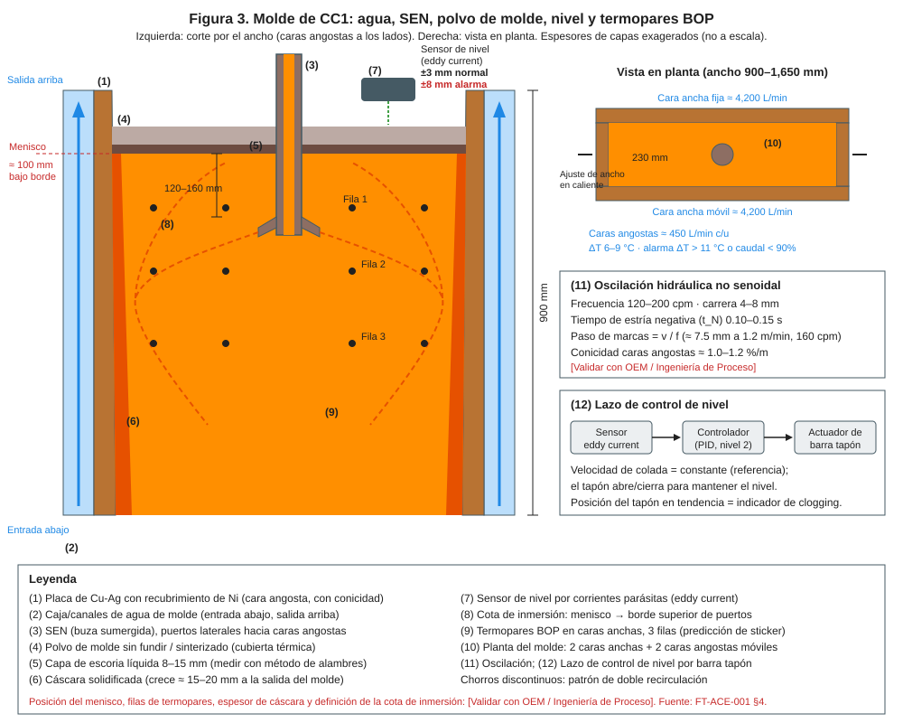
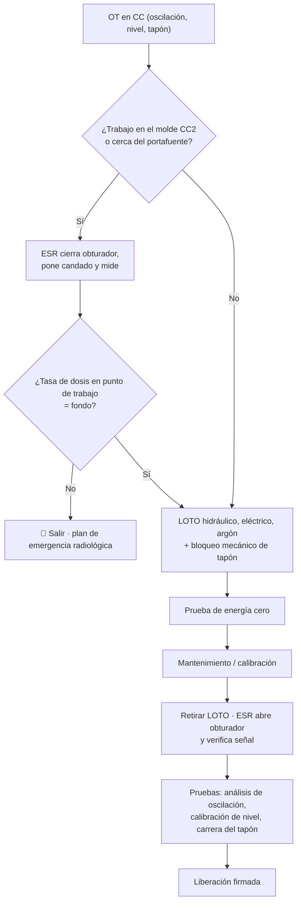

# MM-CC-04 — Sistemas hidráulicos de oscilación, control de nivel y barra tapón (incluye la fuente de Cs-137 de CC2)

| Código | Versión | Estado | Área | Dueño del proceso | Elaboró | Revisión técnica | Revisión de seguridad | Aprobó | Fecha | Próxima revisión |
|---|---|---|---|---|---|---|---|---|---|---|
| MM-CC-04 | 0.1 | Borrador para validación | Acería · CC1 y CC2 | C-12 Supervisor de Mantenimiento Eléctrico e Instrumentación | gerente-personal-sindicalizado (Líder Academia de Mantenimiento y Confiabilidad) | experto-operativo-metalurgia | experto-seguridad-salud | Pendiente (Gerente de Acería / Director) | 2026-09-25 | 2027-09-25 |

> ⚠️ Base: FT-ACE-001 §4 (CC1: oscilación hidráulica 120–200 cpm, carrera 4–8 mm, no senoidal; nivel por corrientes parásitas ±3 mm, alarma ±8 mm; barra tapón con argón 3–8 NL/min) y §5 (CC2: 150–250 cpm, carrera 6–10 mm; **nivel radiométrico con fuente sellada de Cs-137**, ±5 mm). Que la oscilación de CC2 sea hidráulica es **[Supuesto]**. Límites de radiación, periodicidad de pruebas de fuga y actividad de la fuente: **según la licencia CNSNS y el Encargado de Seguridad Radiológica (ESR) [Validar]**.

## 1. Objetivo y alcance
Mantener exactos y confiables los actuadores que controlan la interfaz acero–molde: **oscilación** (evita el pegado de la cáscara), **nivel de molde** (evita atrapamiento de escoria y breakouts) y **barra tapón** (regula el flujo del distribuidor en CC1); y trabajar con la **fuente radiactiva de CC2** sin exposición innecesaria.
**Incluye:** unidades hidráulicas (HPU) de CC, servoválvulas, cilindros y resortes de oscilación, análisis de oscilación, sensor de corrientes parásitas, mecanismo y actuador de barra tapón, sistema radiométrico (portafuente, obturador, detector), pruebas y calibraciones.
**No incluye:** molde (MM-CC-01), agua (MM-CC-03), trabajo con fuentes del pórtico de chatarra (MS-ACE-07).

## 2. Roles y responsabilidades
| Rol | Responsabilidad en este proceso | R/A/C/I |
|---|---|---|
| C-12 Supervisor Eléctrico e Instrumentación | Dueño; OT, liberación | A |
| S-22 Técnico Hidráulico | HPU, servoválvulas, cilindros, acumuladores, análisis de aceite | R |
| S-21 Instrumentista | Transductores, sensor de nivel, detector radiométrico, lazos, análisis de oscilación | R |
| ESR — Encargado de Seguridad Radiológica (titular de la licencia CNSNS) | Único autorizado para operar el obturador, bloquear, medir tasa de dosis, pruebas de fuga, inventario | R / A (radiación) |
| POE — Personal Ocupacionalmente Expuesto (S-21 designados) | Trabajo en el detector con dosímetro personal | R |
| S-19 Mecánico | Resortes y guías de oscilación, mecanismo de barra tapón | R |
| C-08 Ingeniero de Proceso de CC | Parámetros de oscilación y de control de nivel | C |
| C-06 Supervisor de CC | Firma de liberación por operación | A (operación) |
| C-16 Especialista de Seguridad | Plan de protección radiológica, EPP | C |

## 3. Descripción del proceso
La mesa de oscilación mueve el molde con cilindros hidráulicos controlados por servoválvula y un perfil no senoidal. El nivel de molde se mide (CC1: sensor de corrientes parásitas sobre el menisco; CC2: fuente de Cs-137 de un lado del molde y detector de centelleo del otro) y el controlador actúa sobre la barra tapón (CC1) o sobre la velocidad de extracción (CC2).

## 4. Equipos y maquinaria
| Equipo / componente | Función | Especificación clave | Condición para operar (verificación) |
|---|---|---|---|
| HPU de CC (oscilación, tapón, ancho) | Presión hidráulica | Aceite ISO VG 46 o HFC [Validar OEM]; filtración 3 µm | ISO 4406 ≤ 15/13/10 |
| Servoválvulas de oscilación | Perfil de oscilación | Respuesta dinámica según OEM | Error de seguimiento ≤ 2 % |
| Cilindros de oscilación + transductores | Mover la mesa | Carrera 4–8 mm (CC1) / 6–10 mm (CC2) | Carrera medida ±0.1 mm |
| Resortes de lámina / guías de la mesa | Guiar sin juego lateral | Sin grietas | Juego lateral ≤ 0.15 mm |
| Sensor de nivel por corrientes parásitas (CC1) | Nivel ±3 mm | Enfriado | Linealidad ±1 mm en calibración |
| Mecanismo y actuador de barra tapón (CC1) | Regular flujo | Servo hidráulico o eléctrico | Juego mecánico ≤ 0.5 mm |
| Línea de argón al tapón | 3–8 NL/min | Rotámetro / controlador de flujo | Sin fugas; caudal estable |
| Portafuente de Cs-137 con obturador (CC2) | Emitir radiación a través del molde | Fuente sellada, licencia CNSNS | Obturador abre/cierra; señalización; candado |
| Detector de centelleo (CC2) | Medir nivel ±5 mm | Enfriado por agua/aire | Cuentas estables; calibrado |
| Acumuladores | Respaldo de presión | Recipiente a presión | Precarga N₂ en valor OEM (NOM-020) |
| Analizador de oscilación (acelerómetros triaxiales) | Verificar carrera, frecuencia, juego lateral | Portátil | Calibrado |
| Radiámetro (monitor de tasa de dosis) | Verificar ausencia de exposición | Calibrado (laboratorio autorizado) | Certificado vigente |

## 5. Especificaciones, tolerancias y frecuencias
| Especificación | Unidad | Objetivo | Rango / tolerancia | Límite (alarma / rechazo) | Acción si está fuera | Instrumento | Frecuencia |
|---|---|---|---|---|---|---|---|
| Frecuencia de oscilación (vs. punto de ajuste) | cpm | Ajuste del modelo | ±1 | ±3 | Revisar servo/control | Analizador de oscilación / HMI | Mensual |
| Carrera real vs. ajuste | mm | Ajuste (CC1 4–8; CC2 6–10) | ±0.1 | ±0.3 | Calibrar transductor, revisar servo | Analizador / indicador de carátula | Mensual |
| Desviación del perfil no senoidal | % | ≤ 2 | ≤ 3 | > 5 | Revisar servoválvula y aceite | Analizador | Mensual |
| Juego / movimiento lateral de la mesa | mm | ≤ 0.10 | ≤ 0.15 | **> 0.20** | Cambiar resortes/guías | Analizador triaxial / indicadores | Mensual |
| Juego en dirección de colada (cabeceo) | mm | ≤ 0.10 | ≤ 0.15 | > 0.20 | Revisar pivotes y resortes | Analizador | Mensual |
| Limpieza de aceite | ISO 4406 | 15/13/10 | ≤ 16/14/11 | > 17/15/12 | Filtración fuera de línea; cambiar filtros | Contador de partículas | Mensual |
| Agua en aceite (mineral) | ppm | ≤ 200 | ≤ 500 | > 1,000 | Deshidratar | Karl Fischer | Mensual |
| Temperatura del aceite | °C | 45 | 40–50 | > 60 | Revisar enfriador | TT | Continuo |
| Precarga de acumuladores | bar N₂ | OEM | ±5 % | < 80 % | Recargar | Kit de precarga | Mensual |
| Vibración de bombas de HPU | mm/s RMS | ≤ 2.8 | ≤ 4.5 | > 7.1 | Programar reparación | Analizador | Mensual |
| Nivel CC1 (en colada) | mm | 0 | ±3 | ±8 alarma | Operación (MO-CC1-04); revisar lazo | HMI | Continuo |
| Linealidad del sensor de corrientes parásitas | mm | ±0.5 | ±1 | > ±2 | Recalibrar / cambiar sensor | Placa patrón a distancias conocidas | Cada cambio de molde / quincenal |
| Juego del mecanismo de barra tapón | mm | ≤ 0.3 | ≤ 0.5 | > 1.0 | Cambiar bujes/pernos | Indicador de carátula | Cada preparación de distribuidor (MO-CC1-01) y semanal |
| Calibración de posición del tapón (cero = cerrado) | mm | 0 | ±0.5 | > ±1 | Recalibrar | HMI + regla | Cada distribuidor |
| Argón al tapón | NL/min | 5 | 3–8 | Fuga o caudal inestable | Revisar línea y conexiones | Rotámetro / controlador | Cada distribuidor |
| Nivel CC2 (en colada) | mm | 0 | ±5 | Alarma OEM | Operación (MO-CC2-04); revisar detector | HMI | Continuo |
| Calibración del detector radiométrico | cuentas | 2 puntos (vacío / lleno) | ±2 % | > ±5 % | Recalibrar (POE con ESR presente) | Software del sistema | Cada cambio de tubo / mensual |
| Tasa de dosis con obturador cerrado en punto de trabajo | µSv/h | Fondo | — | **> fondo = 🛑** | ESR aplica plan de emergencia | Radiámetro calibrado | Cada intervención |
| Tasa de dosis alrededor del portafuente (abierto) | µSv/h | Según licencia | — | Superior a licencia | Retirar de servicio; avisar CNSNS vía ESR | Radiámetro | Semestral [Validar] |
| Prueba de fuga (frotis) de la fuente | Bq | Según licencia | — | Contaminación detectada | Retirar fuente; ESR | Frotis + laboratorio autorizado | Según licencia (típ. semestral/anual) [Validar] |
| Funcionamiento del obturador e indicador | — | Abre/cierra, indicador correcto | — | Falla | 🛑 Bloquear y avisar al ESR | Visual + radiámetro | Mensual |
| Dosimetría personal del POE | mSv | ALARA | Dentro de límites NOM-012 | Superior a nivel de investigación | Investigación del ESR | Dosímetro personal | Mensual |

### 5.1 Rutina preventiva y predictiva
| Tarea | Frecuencia | Rol | Duración | Ventana |
|---|---|---|---|---|
| Recorrido de HPU: nivel, temperatura, ΔP filtros, fugas | Cada turno | S-22 | 20 min | En operación |
| Juego y calibración del mecanismo de tapón | Cada distribuidor / semanal | S-21, S-19 | 30 min | Preparación de distribuidor |
| Análisis de oscilación (frecuencia, carrera, juego lateral) | Mensual y tras cambio de molde | S-21 | 1 h por línea | Paro entre secuencias |
| Muestra de aceite (ISO 4406, agua) | Mensual | S-22 | 15 min | En operación |
| Precarga de acumuladores | Mensual | S-22 | 1 h | Paro programado |
| Inspección de resortes de lámina (grietas) | Trimestral | S-19 | 1 h por línea | Paro mensual |
| Calibración del sensor de corrientes parásitas | Cada cambio de molde / quincenal | S-21 | 30 min | Paro |
| Calibración del detector radiométrico CC2 | Cada cambio de tubo / mensual | S-21 (POE) + ESR | 30 min por línea | Línea fuera |
| Verificación de obturador y señalización de fuentes | Mensual | ESR | 1 h | Paro |
| Levantamiento de tasa de dosis y prueba de fuga | Según licencia | ESR / proveedor autorizado | 2 h | Paro |
| Cambio de servoválvulas a taller (banco de prueba) | Por condición o 2–3 años [Validar] | S-22 / taller OEM | 2 h | Paro mensual |
| Cambio de aceite / limpieza de tanque | Por análisis | S-22 | 1 turno | Paro mayor |

## 6. Seguridad
### 6.1 Peligros y controles críticos
| Peligro | Consecuencia | Control crítico | Verificación |
|---|---|---|---|
| Radiación ionizante (Cs-137) | Dosis indebida, efectos a la salud | Solo el ESR opera el obturador; candado del ESR; medición antes de trabajar; tiempo–distancia–blindaje | Radiámetro = fondo; registro del ESR |
| Portafuente dañado (golpe, fuego, metal líquido) | Pérdida de control de la fuente | Plan de emergencia radiológica; no manipular | Simulacro anual |
| Energía hidráulica / acumuladores | Movimiento de la mesa, inyección de aceite | HPU fuera, acumuladores 0 bar | Manómetros 0 bar |
| Barra tapón (gravedad) | Golpe, atrapamiento | Perno de bloqueo mecánico | Perno colocado |
| Argón | Asfixia en zonas bajas | Válvula cerrada y bloqueada; ventilación | O₂ ≥ 19.5 % |
| Energía eléctrica (servos, detector) | Electrocución | LOTO NOM-029 | Detector de tensión |
| Metal líquido cercano (trabajo en caliente entre secuencias) | Quemadura | Distribuidor retirado; EPP térmico | Verificación de C-06 |

### 6.2 EPP obligatorio
Casco, lentes, guantes (nitrilo para aceite), botas metatarsales, ropa FR; **dosímetro personal** para POE y para quien trabaje en la zona controlada de la fuente; radiámetro con el ESR.

### 6.3 Permisos, bloqueos y zonas de exclusión
**Permisos:** LOTO grupal; **permiso de trabajo con fuente radiactiva** (emitido por el ESR); altura si aplica.
**Puntos de aislamiento:** E-H HPU de CC (CCM + válvula de bloqueo + descarga de acumuladores); E1 tableros de servos, sensor de nivel y detector; E-Ar válvula manual de argón al tapón; E-M perno mecánico del tapón y carro de distribuidor estacionado y bloqueado; **E-R obturador de Cs-137 cerrado con candado del ESR** (energía radiante); E-W agua de enfriamiento del sensor/detector si se desconecta. **Prueba de energía cero:** intento de oscilar y mover el tapón desde HMI rechazado; manómetros 0 bar; detector de tensión; **radiámetro en el punto de trabajo = fondo**.
**Zona de exclusión:** zona controlada alrededor del portafuente según el plan de protección radiológica; señalización con el símbolo de radiación.

## 7. Calidad
| Variable crítica de calidad | Especificación | Método / frecuencia | Registro | Defecto si falla |
|---|---|---|---|---|
| 🔎 Carrera y frecuencia de oscilación | Ajuste ±0.1 mm / ±1 cpm | Analizador, mensual | Reporte | Marcas de oscilación profundas, grietas transversales, pegado → breakout |
| 🔎 Juego lateral de la mesa | ≤ 0.15 mm | Analizador, mensual | Reporte | Grietas longitudinales, depresiones |
| 🔎 Estabilidad de nivel | CC1 ±3 mm; CC2 ±5 mm | Continuo (HMI) | Historial | Atrapamiento de escoria/polvo, sliver, pinholes, breakout |
| 🔎 Respuesta del tapón | Juego ≤ 0.5 mm | Cada distribuidor | Checklist | Nivel oscilante, turbulencia |
| 🔎 Argón al tapón | 3–8 NL/min estable | Cada distribuidor | Checklist | Clogging de SEN (poco) o pinholes/atrapamiento (mucho) |

## 8. Procedimiento paso a paso (análisis de oscilación y calibración de nivel en CC2)
| # | Paso | Cómo hacerlo (detalle y medición) | Criterio de aceptación | ★ | Rol |
|---|---|---|---|---|---|
| 1 | Programa | OT; línea sin acero; distribuidor retirado o la línea tapada | Autorización C-06 | | C-12 |
| 2 | Cierra la fuente | ESR cierra obturador, coloca su candado y señal | Obturador cerrado | ★ | ESR |
| 3 | Mide tasa de dosis | ESR mide en el punto de trabajo y en el detector | = fondo | ★ | ESR |
| 4 | Aplica LOTO | E-H, E1 (si se interviene el detector), E-Ar, E-M | Candados puestos | ★ | S-22, S-21, S-19 |
| 5 | Prueba energía cero | Intento de oscilar y de mover; 0 bar; 0 V | Sin energía | ★ | C-12 |
| 6 | Inspecciona mesa y resortes | Visual con lámpara; grietas en láminas; pernos marcados | Sin grietas; pernos en torque | 🔎 | S-19 |
| 7 | Mantenimiento del detector | Limpieza, conexiones, enfriamiento | Sin daño | | S-21 (POE) |
| 8 | Retira LOTO hidráulico | Solo el necesario para oscilar (E-H) | Personal fuera de la mesa | ★ | S-22 |
| 9 | Análisis de oscilación | Acelerómetros triaxiales en el molde; oscila a 3 frecuencias del rango | Frecuencia ±1 cpm, carrera ±0.1 mm, lateral ≤ 0.15 mm | 🔎 | S-21 |
| 10 | ESR abre la fuente | ESR retira su candado y abre obturador | Indicador "abierto" y cuentas estables | ★ | ESR |
| 11 | Calibra el nivel | Calibración de 2 puntos según el sistema (vacío / referencia OEM) | ±2 % | 🔎 | S-21 con ESR |
| 12 | Retira LOTO restante | Orden inverso | Candados retirados | ★ | Todos |
| 13 | Libera | Checklist firmado por C-12, ESR (si aplica) y C-06 | Firmado | ★ | C-12, ESR, C-06 |

**Checklist de liberación (Mantenimiento + Operación + ESR):** [ ] análisis de oscilación en criterio (reporte) · [ ] juego lateral ≤ 0.15 mm · [ ] nivel calibrado · [ ] tapón: juego ≤ 0.5 mm y cero calibrado (CC1) · [ ] argón 3–8 NL/min sin fugas (CC1) · [ ] obturador abierto y registro del ESR (CC2) · [ ] candados retirados · Firma C-12/S-21: ____ Firma ESR: ____ Firma C-06/S-12: ____ Fecha/hora: ____

## 9. Condiciones anormales y respuesta
| Síntoma / alarma | Causa probable | Acción inmediata | A quién avisar |
|---|---|---|---|
| Alarma de oscilación (error de seguimiento) | Servoválvula, aceite sucio, transductor | Operación reduce velocidad o termina colada | C-06, S-22 |
| Nivel oscilante ("hunting") | Juego del tapón, ganancia del lazo, clogging | Revisar juego y argón; C-08 revisa lazo | C-06, S-21 |
| Señal radiométrica errática | Detector, agua de enfriamiento, obturador parcialmente cerrado | Nivel manual por operación; revisar con ESR | C-06, ESR |
| Indicador de obturador no coincide | Mecanismo dañado | 🛑 Nadie cerca; ESR mide y bloquea | ESR, C-16 |
| Portafuente expuesto a metal líquido o fuego | Breakout, derrame | Evacuar zona; ESR activa plan de emergencia radiológica y aviso a CNSNS | ESR, C-04, C-16 |
| Grieta en resorte de lámina | Fatiga | Programar cambio; revisar juego lateral | C-12, C-11 |
| Temperatura de aceite > 60 °C | Enfriador, alivio abierto | Revisar | S-22 |

## 10. Registros
Reportes de análisis de oscilación · calibraciones de nivel y tapón · análisis de aceite · precargas · **bitácora del ESR**: inventario de fuentes, aperturas/cierres, tasas de dosis, pruebas de fuga, dosimetría del POE · permisos, LOTO · checklist de liberación.

## 11. Competencia requerida y certificación
| Rol | Nivel requerido (1–4) | Formación teórica (h) | OJT supervisado (h / eventos) | Evaluación (pasos ★) | Vigencia |
|---|---|---|---|---|---|
| S-22 Técnico Hidráulico | 3 | 32 (servohidráulica, limpieza de aceite, acumuladores NOM-020) | 40 h | Pasos 4, 5, 8 | 24 meses |
| S-21 Instrumentista (POE) | 3 | 24 (oscilación, nivel) + protección radiológica para POE (NOM-012, curso reconocido por CNSNS) | 3 calibraciones con ESR | Pasos 7, 9, 11 | 24 meses; POE según licencia |
| ESR | 4 | Acreditación CNSNS | — | Pasos 2, 3, 10 | Según CNSNS |
| S-19 Mecánico | 3 | 8 (mesa de oscilación, tapón) | 2 intervenciones | Paso 6 | 24 meses |
| Personal de CC no POE | 1 | Concientización radiológica (2) | — | Reconoce señalización y zona | 12 meses |

**Normas:** NOM-012-STPS (radiaciones ionizantes), Reglamento General de Seguridad Radiológica y licencia CNSNS, NOM-004-STPS, NOM-020-STPS (acumuladores), NOM-029-STPS, NOM-017-STPS. Verificar con Jurídico Laboral / SSO.
**Verificación ★:** ¿solo el ESR operó el obturador? · ¿midió fondo antes de trabajar? · ¿acumuladores a 0 bar y perno del tapón puesto? · ¿análisis de oscilación registrado? · ¿liberación firmada también por el ESR?

## 12. Referencias
FT-ACE-001 §4, §5 · MO-CC1-01, MO-CC1-04, MO-CC2-04 · MM-CC-01, MM-CC-03 · MS-ACE-02, -07 · Manual OEM de oscilación, control de nivel y sistema radiométrico [por referenciar] · Licencia CNSNS y manual de protección radiológica de GASM [por referenciar].

## 13. Control de cambios
| Versión | Fecha | Cambio | Autor |
|---|---|---|---|
| 0.1 | 2026-09-25 | Emisión inicial para validación | gerente-personal-sindicalizado |
