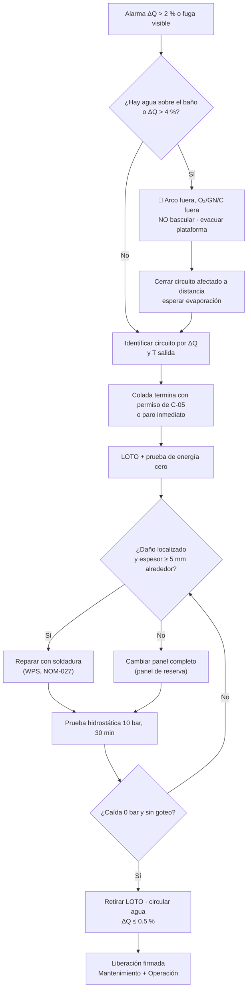

# MM-EAF-01 — Detección y reparación de fugas en paneles y bóveda enfriados por agua

| Código | Versión | Estado | Área | Dueño del proceso | Elaboró | Revisión técnica | Revisión de seguridad | Aprobó | Fecha | Próxima revisión |
|---|---|---|---|---|---|---|---|---|---|---|
| MM-EAF-01 | 0.1 | Borrador para validación | Acería · EAF-1 / EAF-2 | C-11 Supervisor de Mantenimiento Mecánico | gerente-personal-sindicalizado (Líder Academia de Mantenimiento y Confiabilidad) | experto-operativo-metalurgia | experto-seguridad-salud | Pendiente (Gerente de Acería / Director) | 2026-09-25 | 2027-09-25 |

> ⚠️ Los valores vienen de `00-ficha-tecnica-acería.md` (FT-ACE-001 §2). Los dependientes del fabricante están marcados **[Validar con OEM / Ingeniería de Mantenimiento]**. **Agua + acero líquido = explosión de vapor.** Este manual es de riesgo máximo.

## 1. Objetivo y alcance
Detectar a tiempo, aislar y reparar las fugas de agua en los paneles de pared, la bóveda enfriada, el codo del 4.º agujero y las lanzas/quemadores de EAF-1 y EAF-2, sin exponer a nadie al contacto agua–metal líquido y sin contaminar el acero con hidrógeno.
**Incluye:** inspección preventiva, verificación de la lógica de fuga (Δcaudal), respuesta a la alarma, cambio de panel o reparación por soldadura, prueba hidrostática y liberación.
**No incluye:** refractario (MM-EAF-03), sistema eléctrico (MM-EAF-04), respuesta de emergencia de operación (MS-ACE-09).

## 2. Roles y responsabilidades
| Rol | Responsabilidad en este proceso | R/A/C/I |
|---|---|---|
| C-11 Supervisor de Mantenimiento Mecánico | Dueño del proceso; emite OT, coordina LOTO y firma la liberación | A |
| S-19 Mecánico de Acería | Aislamiento hidráulico de agua, cambio de panel, prueba hidrostática | R |
| S-23 Soldador Calificado | Reparación por soldadura de tubos (WPS calificado) | R |
| S-21 Instrumentista | Calibración y verificación de medidores de caudal, TT, PT y lógica de fuga | R |
| S-01 Operador de Púlpito de Horno | Detiene el arco, no bascula, aplica el bloqueo de operación, firma la liberación | R |
| C-05 Supervisor de Hornos | Autoriza el paro, firma la liberación por operación | A (operación) |
| S-04 Operador de Grúa de Carga | Izaje de panel de repuesto / bóveda | R |
| C-16 Especialista de Seguridad | Verifica permisos, zona de exclusión y medición de gases | C |
| C-14 Ingeniero de Confiabilidad | Análisis de fallas repetitivas (RCA) y tendencia de espesores | C |
| C-13 Planeador | Repuestos (paneles de reserva) y ventana de paro | I |

## 3. Descripción del proceso
Cada panel es un serpentín de tubos con su propio circuito. Un medidor de caudal a la entrada y otro a la salida alimentan al PLC, que calcula **ΔQ % = (Q ent − Q sal) / Q ent × 100**. Con **ΔQ > 2 % hay alarma** y con **ΔQ > 4 % se dispara el arco** (FT-ACE-001 §2). Una fuga pequeña que no llega a 2 % se detecta por inspección visual (vapor, escoria "apagada", manchas negras) y por el aumento de H₂ en el humo o en el acero.

## 4. Equipos y maquinaria
| Equipo / componente | Función | Especificación clave | Condición para operar (verificación) |
|---|---|---|---|
| Paneles de pared (tubo) | Enfriar la pared sobre la línea de escoria | Tubo típ. Ø 70 × 10 mm ASTM A106-B [Validar OEM] | Sin fuga, espesor ≥ 5 mm, sin deformación > 20 mm |
| Bóveda enfriada + codo del 4.º agujero | Enfriar bóveda y ducto de humos | Circuitos independientes por sector [Validar OEM] | ΔQ ≤ 0.5 %, T salida ≤ 60 °C |
| Medidores de caudal FT ent/sal | Detectar fuga | Electromagnéticos, exactitud ±0.5 % | Calibrados (etiqueta vigente ≤ 12 meses) |
| Transmisores TT y PT | Temperatura de salida y presión | Pt100; 0–10 bar | Lectura coherente con manómetro local ±0.2 bar |
| Válvulas de aislamiento V1/V2 | Aislar circuito (punto LOTO) | Mariposa/compuerta con candado | Cierre hermético, maneral con porta-candado |
| Bombas y cabezal de agua del horno | Suministro 2,200 m³/h, 4–6 bar | FT-ACE-001 §2 | P ≥ 4 bar en cabezal |
| Bomba de prueba hidrostática | Prueba de presión | 0–25 bar, manómetro clase 0.5, rango 0–16 bar | Manómetro calibrado |

## 5. Especificaciones, tolerancias y frecuencias
| Especificación | Unidad | Objetivo | Rango / tolerancia | Límite (alarma / rechazo) | Acción si está fuera | Instrumento | Frecuencia |
|---|---|---|---|---|---|---|---|
| Presión de suministro | bar | 5 | 4–6 | < 3 bar alarma | Revisar bombas, filtro y fugas mayores | PT / manómetro | Continuo |
| Caudal total | m³/h | 2,200 | ±5 % | < 90 % del nominal | Revisar bombas y válvulas | FT cabezal | Continuo |
| Δcaudal por circuito | % | ≤ 0.5 | 0–1 | **> 2 % alarma; > 4 % disparo** | Sección 9 | FT ent/sal + PLC | Continuo |
| Temperatura de salida de panel | °C | ≤ 45 | 30–55 | > 60 °C alarma | Revisar incrustación, caudal y posición de quemadores | TT | Continuo |
| Espesor de pared del tubo | mm | 10 (nuevo) | ≥ 6 | **< 5 mm: cambiar tubo o panel** | Programar cambio en el siguiente paro | Ultrasonido (UT) de espesores, sonda dual | Semanal en zonas calientes; mensual resto |
| Deformación (pandeo) del panel | mm | 0 | ≤ 10 | > 20 mm | Cambiar panel | Regla de 1 m + flexómetro | Semanal |
| Prueba hidrostática tras reparación | bar / min | 10 bar / 30 min | ≥ 1.5 × 6 bar | Cualquier caída o goteo = rechazo | Repetir reparación | Manómetro clase 0.5 | Cada reparación |
| Verificación de lógica ΔQ | — | Alarma y disparo a 2 % y 4 % | ±0.2 % | No dispara = 🛑 no operar | Corregir PLC/FT | Simulación de señal 4–20 mA | Trimestral y tras cambio de FT |
| Calibración de FT | % | ±0.5 | — | > ±1 % | Recalibrar o cambiar | Calibrador / comparación en seco | Anual |
| Calidad del agua (circuito) | µS/cm; pH | ≤ 500; 7.5–8.5 | [Validar con tratamiento de aguas] | Fuera de rango | Ajustar tratamiento (incrustación) | Laboratorio | Semanal |

### 5.1 Rutina preventiva y predictiva
| Tarea | Frecuencia | Rol | Duración | Ventana |
|---|---|---|---|---|
| Inspección visual de paneles, bóveda y codo (vapor, manchas, deformación) | Cada colada | S-02 / S-03 (MO-EAF-01) | 2 min | Entre coladas |
| Revisión de tendencia ΔQ y T salida por circuito | Diario | S-21 | 20 min | En operación |
| Comparación FT ent/sal con agua circulando y arco apagado | Semanal | S-21 | 30 min | Paro semanal |
| UT de espesores en zonas calientes (línea de escoria, frente a quemadores, lado EBT, codo) | Semanal | S-19 | 2 h | Paro semanal (8–12 h) |
| UT de espesores del resto de paneles y bóveda | Mensual | S-19 | 4 h | Paro semanal |
| Revisión de mangueras, juntas y bridas (fugas externas, grietas) | Semanal | S-19 | 1 h | Paro semanal |
| Prueba de lógica ΔQ (simulación 4–20 mA) | Trimestral | S-21 + C-12 | 2 h | Paro semanal |
| Calibración de FT, TT y PT | Anual | S-21 / laboratorio externo acreditado | 1 turno | Paro mayor |
| Limpieza química / desincrustación de circuitos con T salida alta | Según tendencia (> 55 °C sostenido) | S-19 + proveedor | 1 turno | Paro mensual |
| Prueba hidrostática de panel de reserva antes de almacenarlo | Cada panel nuevo o reparado | S-19 | 1 h | Taller |
| Análisis de fallas repetidas (Pareto por panel) | Mensual | C-14 | 2 h | Oficina |

## 6. Seguridad
### 6.1 Peligros y controles críticos
| Peligro | Consecuencia | Control crítico | Verificación |
|---|---|---|---|
| Agua sobre acero o escoria líquida | Explosión de vapor, proyección de metal, fatalidad | Disparo por ΔQ > 4 %; **no bascular** con agua en el horno; evacuación | Prueba trimestral de lógica; simulacro MS-ACE-09 |
| Energía eléctrica del arco (MT/secundario) | Electrocución, arco eléctrico | LOTO en interruptor del horno (MM-EAF-04) | Candado de S-20 + prueba de energía cero |
| O₂ / gas natural en lanzas y quemadores | Incendio, explosión, enriquecimiento de O₂ | Válvulas manuales cerradas, bloqueadas y purgadas con N₂ | Manómetro en 0 bar; O₂ ambiente 19.5–23.5 % |
| Energía hidráulica (basculamiento, giro de bóveda, electrodos) | Aplastamiento | HPU bloqueada, acumuladores a 0 bar, seguros mecánicos | Manómetro de acumulador 0 bar |
| Gravedad (bóveda, electrodos, panel izado) | Aplastamiento, caída de carga | Bóveda sobre soportes, electrodos con seguro; izaje con plan (MS-ACE-04) | Inspección de aparejos |
| Agua a presión y caliente | Quemadura, inyección | Drenar y ventear antes de abrir | Manómetro 0 bar, dren abierto |
| Trabajo en altura (paredes, bóveda) | Caída | Arnés y línea de vida (NOM-009) | Permiso de altura |
| CO y polvo en el horno | Intoxicación | DES en marcha, detector de 4 gases | CO < 25 ppm |

### 6.2 EPP obligatorio
Casco, lentes, careta facial, ropa FR/aluminizada en zona de horno caliente, guantes para calor, botas metatarsales, protección auditiva, arnés de cuerpo completo (altura), respirador P100 en demolición de escoria; para soldar: careta con filtro DIN 10–13, mangas y peto de cuero (NOM-027).

### 6.3 Permisos, bloqueos y zonas de exclusión
**Permisos:** trabajo en caliente (soldadura/oxicorte), trabajo en altura, izaje crítico si se cambia panel de bóveda, y **espacio confinado** si alguien entra al casco del horno (MS-ACE-05).
**Puntos de aislamiento (LOTO) del EAF:**
| # | Energía | Punto de aislamiento | Quién bloquea | Prueba de energía cero |
|---|---|---|---|---|
| E1 | Eléctrica MT (arco) | Interruptor de vacío del horno abierto + seccionador abierto + cuchillas de tierra cerradas | S-20 (NOM-029) | Indicación de posición + detector de tensión en el lado de carga + intento de "arco ON" rechazado |
| E2 | Hidráulica | CCM de la HPU del horno; descarga de acumuladores | S-22 / S-19 | Manómetros 0 bar; mando de basculamiento sin respuesta |
| E3 | O₂ y gas natural | Válvulas manuales de la estación de lanzas/quemadores; purga con N₂ | S-19 | Manómetros aguas abajo 0 bar; detector LEL 0 % |
| E4 | Neumática (carbono/cal) y DRI | Válvula de aire de inyección; CCM del transportador de DRI | S-19 / S-20 | Arranque local rechazado |
| E5 | Agua del circuito a reparar | V1 y V2 cerradas y bloqueadas; dren y venteo abiertos | S-19 | Manómetro local 0 bar, sin flujo en el dren |
| E6 | Mecánica / gravedad | Horno nivelado sobre topes + perno de bloqueo de basculamiento; bóveda asentada; electrodos arriba con seguro | S-19 + S-01 | Verificación visual de pernos colocados |

**Zona de exclusión:** plataforma del horno y fosa de escoria mientras haya metal líquido en el horno y exista sospecha de agua.

## 7. Calidad
| Variable crítica de calidad | Especificación | Método / frecuencia | Registro | Defecto si falla |
|---|---|---|---|---|
| 🔎 Ingreso de agua al baño | 0 (ΔQ ≤ 0.5 %) | PLC continuo | Historial de alarmas | Hidrógeno alto → sopladuras y pinholes en planchón/palanquilla |
| 🔎 H en acero (grados sensibles) | ≤ 5 ppm en LF [Validar con C-09] | Sonda de H en LF tras colada sospechosa | Reporte de colada | Porosidad subsuperficial, rechazo en laminación |
| 🔎 Estabilidad de la escoria espumosa | Sin "manchas" de escoria enfriada | Visual del S-01 | Bitácora de horno | Arco descubierto, más daño a paneles |
| Temperatura de salida de panel | ≤ 60 °C | TT continuo | Tendencia | Incrustación → fatiga térmica → fuga |

## 8. Procedimiento paso a paso
| # | Paso | Cómo hacerlo (detalle y medición) | Criterio de aceptación | ★ | Rol |
|---|---|---|---|---|---|
| 1 | Recibe la alarma o el reporte | Identifica el circuito con la mayor ΔQ y la T de salida más alta en la HMI | Circuito identificado | | S-01, S-21 |
| 2 | Asegura el horno | Si ΔQ > 4 % o hay agua visible: arco fuera, O₂/GN/C fuera, **no bascules**, evacúa plataforma | Nadie en zona de exclusión | ★ | S-01, C-05 |
| 3 | Espera la evaporación | Con agua sobre el baño, espera que no haya vapor visible (mín. 10 min [Validar]); cierra el circuito a distancia | Sin vapor, sin charco | ★ | C-05 |
| 4 | Vacía el horno cuando sea seguro | Vaciado por EBT solo con autorización de C-05 y sin agua sobre el baño | Horno sin metal o con talón controlado | ★ | S-01, C-05 |
| 5 | Emite la OT y los permisos | OT, permiso en caliente, altura y, si aplica, espacio confinado; análisis de riesgos | Permisos firmados | | C-11, C-16 |
| 6 | Aplica LOTO E1–E6 | Cada ejecutante coloca su candado en la caja grupal | Todos los candados y tarjetas puestos | ★ | S-20, S-19, S-22, S-01 |
| 7 | Prueba energía cero | Intento de arranque desde HMI y botonera; detector de tensión; manómetros 0 bar; gases O₂ 19.5–23.5 %, LEL 0 %, CO < 25 ppm | Ninguna energía presente | ★ | C-11, S-20 |
| 8 | Drena y ventea el circuito | Abre dren y venteo; espera que el manómetro marque 0 bar | 0 bar, sin flujo | ★ | S-19 |
| 9 | Localiza la fuga | Inspección visual; si no se ve, presuriza con aire a 2 bar y usa agua jabonosa [Validar] | Punto de fuga marcado | | S-19 |
| 10 | Mide espesores alrededor | UT en malla de 50 mm × 50 mm, 300 mm alrededor de la fuga | Todos los puntos ≥ 5 mm → reparar; si no → cambiar panel | 🔎 | S-19 |
| 11a | Repara por soldadura | Corta la sección dañada (mín. 150 mm), bisela 37.5°, precalienta si aplica según WPS, raíz GTAW + relleno SMAW E7018 [Validar WPS] | Soldadura sin porosidad ni socavado visible | ★ | S-23 |
| 11b | O cambia el panel | Desconecta mangueras/juntas, iza con S-04 (plan de izaje), coloca panel de reserva; aprieta bridas en cruz al torque OEM (típ. M20 8.8: 350–400 N·m [Validar OEM]) | Panel asentado, juntas nuevas | ★ | S-19, S-04 |
| 12 | Prueba hidrostática | Llena, ventea, sube a **10 bar**, aísla la bomba, sostén **30 min** | Caída 0 bar y sin goteo | ★ | S-19, C-11 |
| 13 | Inspección de soldadura | Visual + líquidos penetrantes en uniones reparadas | Sin indicaciones | 🔎 | S-23 / Calidad |
| 14 | Retira LOTO en orden inverso | Cada quien retira su candado; se verifica personal fuera | Candados retirados, área limpia | ★ | Todos |
| 15 | Circula agua y verifica | Abre V2 y luego V1; circula 10 min; ΔQ ≤ 0.5 %, T salida estable, P 4–6 bar | Valores en rango | ★ | S-21, S-01 |
| 16 | Libera el equipo | Checklist de liberación (abajo), firmado por C-11 y C-05 | Firmado | ★ | C-11, C-05 |

**Checklist de liberación a operación (firma Mantenimiento + Operación)**
- [ ] Prueba hidrostática 10 bar / 30 min aprobada (valor registrado).
- [ ] ΔQ del circuito ≤ 0.5 % y T de salida ≤ 45 °C con agua circulando.
- [ ] Lógica ΔQ probada si se cambió o se tocó un FT (alarma 2 %, disparo 4 %).
- [ ] Todos los candados retirados; herramientas y materiales fuera del horno.
- [ ] Refractario húmedo revisado (si hubo agua en el casco: secado con quemador según MM-EAF-03).
- Firma C-11 / S-19: ________ Firma C-05 / S-01: ________ Fecha y hora: ________

## 9. Condiciones anormales y respuesta
| Síntoma / alarma | Causa probable | Acción inmediata | A quién avisar |
|---|---|---|---|
| ΔQ > 4 % (disparo) | Fuga grande o rotura de tubo | 🛑 Arco fuera, no bascular, evacuar, cerrar circuito | C-05, C-04, C-11 |
| ΔQ entre 2 y 4 % | Fuga pequeña / FT descalibrado | Revisar visualmente con el arco apagado; comparar FT | C-05, S-21 |
| ΔQ oscila sin fuga visible | Aire en el circuito, FT sucio | Ventear, limpiar electrodos del FT | S-21 |
| T salida > 60 °C con caudal normal | Incrustación, arco descubierto, quemador desalineado | Reducir potencia; revisar escoria y quemador | S-01, C-07 |
| P < 3 bar | Falla de bomba, filtro tapado, fuga mayor | Cambiar a bomba de reserva; si no recupera, detener arco | C-12, C-05 |
| Explosión o proyección de metal | Agua bajo metal | Emergencia MS-ACE-09; no reingresar sin autorización | C-04, Brigada |

## 10. Registros
OT en el sistema de mantenimiento (CMMS) · permisos y LOTO · mapa de espesores UT por panel · registro de prueba hidrostática (presión, tiempo, manómetro) · registro de soldadura (WPS, soldador) · checklist de liberación firmado · RCA si hay 2 fugas en el mismo panel en 30 días (C-14).

## 11. Competencia requerida y certificación
| Rol | Nivel requerido (1–4) | Formación teórica (h) | OJT supervisado (h / eventos) | Evaluación (pasos ★) | Vigencia |
|---|---|---|---|---|---|
| S-19 Mecánico | 3 | 16 (circuitos de agua, LOTO, prueba hidrostática) | 40 h / 3 reparaciones | Pasos 6, 7, 8, 11b, 12, 14, 15 | 24 meses (TD-P07) |
| S-23 Soldador | 3 | 8 + calificación de soldador (ASME IX/AWS) | 3 reparaciones | Paso 11a + prueba de doblez vigente | Calificación ≤ 6 meses sin uso → recalificar; TD-P07 24 meses |
| S-21 Instrumentista | 3 | 12 (FT, lógica ΔQ) | 2 pruebas de lógica | Pasos 1, 15 + prueba de lógica | 24 meses |
| S-01 / C-05 | 3 / 4 | 4 (respuesta a fuga) | Simulacro | Pasos 2, 3, 4, 16 | 12 meses (simulacro anual) |

**Normas:** NOM-004-STPS (maquinaria y bloqueo), NOM-027-STPS (soldadura y corte), NOM-009-STPS (altura), NOM-033-STPS (espacio confinado, si aplica), NOM-029-STPS (maniobra eléctrica del paso 6 por S-20), NOM-017-STPS (EPP). Verificar con Jurídico Laboral / SSO.
**Lista corta de verificación ★ (evaluador TD-P07):** ¿no basculó con agua? · ¿LOTO completo E1–E6? · ¿probó energía cero con intento de arranque y medición de gases? · ¿drenó a 0 bar? · ¿prueba hidrostática 10 bar/30 min sin caída? · ¿liberación firmada por ambos?

## 12. Referencias
FT-ACE-001 §2 · CAT-ACE-001 §2.5 · MO-EAF-01 (inspección entre coladas) · MS-ACE-02, -03, -05, -09, -10 · MM-EAF-03 (secado de refractario) · MM-EAF-04 (maniobra de MT) · Manual OEM de paneles y bóveda [por referenciar] · ASME B31.1 / B31.3 (prueba de presión, referencia) · ASME IX / AWS D1.1 (calificación de soldadura).

## 13. Control de cambios
| Versión | Fecha | Cambio | Autor |
|---|---|---|---|
| 0.1 | 2026-09-25 | Emisión inicial para validación | gerente-personal-sindicalizado |
