# MM-EAF-02 — Brazos portaelectrodos, columnas, regulación hidráulica y cambio de bóveda / delta

| Código | Versión | Estado | Área | Dueño del proceso | Elaboró | Revisión técnica | Revisión de seguridad | Aprobó | Fecha | Próxima revisión |
|---|---|---|---|---|---|---|---|---|---|---|
| MM-EAF-02 | 0.1 | Borrador para validación | Acería · EAF-1 / EAF-2 | C-11 Supervisor de Mantenimiento Mecánico | gerente-personal-sindicalizado (Líder Academia de Mantenimiento y Confiabilidad) | experto-operativo-metalurgia | experto-seguridad-salud | Pendiente (Gerente de Acería / Director) | 2026-09-25 | 2027-09-25 |

> ⚠️ Valores base: FT-ACE-001 §2 (electrodos UHP 610 mm, 3 columnas, transformador 140 MVA). Presiones, torques y fuerzas de mordaza dependen del fabricante: **[Validar con OEM / Ingeniería de Mantenimiento]**.

## 1. Objetivo y alcance
Mantener en condición los 3 brazos portaelectrodos (conductores de corriente), sus columnas y guías, las mordazas, los cables flexibles enfriados, el sistema hidráulico de regulación de electrodos y el mecanismo de levante/giro de bóveda; y **cambiar la bóveda o el delta** de forma segura.
**Incluye:** inspección, pruebas funcionales, análisis de aceite, termografía, aislamiento de brazos, torque de uniones, cambio de bóveda/delta con grúa.
**No incluye:** transformador y alta tensión (MM-EAF-04), fugas de paneles de bóveda (MM-EAF-01), empalme de electrodos en operación (MO-EAF-08).

## 2. Roles y responsabilidades
| Rol | Responsabilidad en este proceso | R/A/C/I |
|---|---|---|
| C-11 Supervisor de Mantenimiento Mecánico | Dueño; OT, LOTO grupal, plan de izaje, liberación | A |
| S-19 Mecánico de Acería | Guías, mordazas, uniones, cambio de bóveda/delta | R |
| S-22 Técnico Hidráulico | HPU, válvulas proporcionales/servo, acumuladores, cilindros, muestreo de aceite | R |
| S-04 Operador de Grúa de Carga | Izaje de bóveda (grúa 120/40 t) y delta | R |
| S-20 Electricista | LOTO eléctrico (MT), megger de aislamiento de brazos, termografía | R |
| S-21 Instrumentista | Transductores de posición, prueba de respuesta de la regulación | R |
| S-01 Operador de Púlpito | Posiciona brazos/bóveda para mantenimiento, firma liberación | R |
| C-14 Ingeniero de Confiabilidad | Tendencias (aceite, vibración, termografía), RCA | C |
| C-16 Especialista de Seguridad | Izaje crítico, altura, LOTO | C |

## 3. Descripción del proceso
Cada columna sube y baja con un cilindro hidráulico controlado por una válvula proporcional o servo; el regulador de impedancia manda la posición del electrodo. El brazo lleva la corriente (hasta decenas de kA) hasta la mordaza, que aprieta el electrodo por resortes y lo libera hidráulicamente. Una falla aquí provoca arco inestable, rotura de electrodo, arco entre brazo y bóveda o caída del electrodo.

```mermaid
flowchart LR
    A["Paro programado<br/>OT + permisos"] --> B["Horno vacío, bóveda levantada<br/>y girada a posición de cambio"]
    B --> C["LOTO: MT, HPU, O₂/GN, agua de bóveda<br/>+ seguros mecánicos"]
    C --> D["Prueba de energía cero<br/>0 bar en acumuladores"]
    D --> E["Desconectar mangueras de agua<br/>de la bóveda (drenadas)"]
    E --> F["Izaje de bóveda con balancín<br/>grúa 120/40 t"]
    F --> G["Colocar bóveda de reserva<br/>asentar y centrar agujeros"]
    G --> H["Conectar agua · prueba de fugas"]
    H --> I["Retirar LOTO · pruebas funcionales<br/>levante, giro, regulación"]
    I --> J["Liberación firmada"]
```

## 4. Equipos y maquinaria
| Equipo / componente | Función | Especificación clave | Condición para operar (verificación) |
|---|---|---|---|
| Brazo portaelectrodo (Cu-acero o Al, enfriado) | Conducir corriente y sostener electrodo | Aislado de la columna | Aislamiento ≥ 1 MΩ a 1,000 V DC; sin fuga de agua |
| Mordaza y zapata de contacto (Cu) | Apretar y conducir al electrodo Ø 610 mm | Paquete de resortes; apertura hidráulica | Superficie sin cráteres > 2 mm; fuerza de apriete OEM |
| Columna y rodillos guía | Guiar el movimiento vertical | Holgura de rodillo 0.5–1.0 mm [Validar OEM] | Verticalidad ≤ 1 mm/m; rodillos giran libres |
| Cilindro de regulación | Mover columna | Sellos sin fuga externa | Deriva ≤ 5 mm en 10 min con válvula cerrada [Validar] |
| Válvula proporcional / servo | Control fino de posición | Limpieza de aceite ISO 4406 ≤ 16/14/11 | Respuesta dentro de la curva OEM |
| Unidad hidráulica (HPU) | Presión para regulación, basculamiento y bóveda | Fluido resistente al fuego HFC (agua-glicol); 120–160 bar [Validar OEM] | Temperatura 30–50 °C; filtros sin alarma ΔP |
| Acumuladores de vejiga | Respaldo y respuesta rápida | Precarga N₂ ≈ 0.9 × presión mínima de trabajo | Precarga ±5 % del valor OEM; recipiente registrado (NOM-020) |
| Cables flexibles enfriados | Unir transformador con brazos | Enfriados por agua | Sin hilos rotos > 5 %, sin fuga, ΔT normal |
| Bóveda y delta refractario | Cerrar el horno; aislar electrodos | Bóveda ≈ 50–70 t; delta ≈ 8–12 t [Validar OEM] | Holgura electrodo–delta ≥ 50 mm por lado |
| Mecanismo de levante/giro de bóveda | Abrir el horno para cargar | Cilindros + pivote | Topes y seguros mecánicos funcionales |

## 5. Especificaciones, tolerancias y frecuencias
| Especificación | Unidad | Objetivo | Rango / tolerancia | Límite (alarma / rechazo) | Acción si está fuera | Instrumento | Frecuencia |
|---|---|---|---|---|---|---|---|
| Presión de HPU | bar | OEM (típ. 140) | ±5 % | Alarma baja OEM | Revisar bombas, acumuladores | Manómetro / PT | Diario |
| Temperatura de fluido HFC | °C | 40 | 30–50 | > 55 °C | Revisar enfriador; no operar > 60 °C | TT | Continuo |
| Contenido de agua del HFC | % | 40 | 35–45 | < 35 o > 50 | Ajustar con agua desmineralizada o concentrado | Refractómetro / laboratorio | Mensual |
| Limpieza del aceite | ISO 4406 | 16/14/11 | ≤ 17/15/12 | > 18/16/13 | Filtración fuera de línea; cambiar filtros | Contador de partículas / laboratorio | Mensual |
| Precarga de acumuladores | bar N₂ | 0.9 × P mín | ±5 % | < 80 % | Recargar N₂ (solo N₂ seco) | Kit de precarga | Mensual |
| Vibración de bombas HPU | mm/s RMS | ≤ 2.8 | ≤ 4.5 | > 7.1 | Programar cambio de rodamientos/acople | Analizador de vibraciones (ISO 10816-3) | Mensual |
| Aislamiento brazo–columna y mordaza | MΩ | ≥ 10 | ≥ 1 a 1,000 V DC | < 1 MΩ | 🛑 No energizar; limpiar/cambiar aisladores | Megger 1,000 V | Trimestral y tras cambio de bóveda |
| Termografía de brazos, zapatas y cables | °C | ΔT ≤ 10 vs. fase similar | — | ΔT 10–30 investigar; > 30 urgente | Reapretar, limpiar contacto | Cámara termográfica | Mensual (en operación) |
| Holgura de rodillos guía | mm | 0.5 | 0.5–1.0 | > 1.5 | Ajustar excéntrica / cambiar rodillo | Lainas | Semanal |
| Verticalidad de columna | mm/m | 0 | ≤ 1 | > 2 | Ajustar guías | Nivel de precisión / plomada láser | Trimestral |
| Deriva de cilindro de regulación | mm / 10 min | 0 | ≤ 5 | > 10 | Revisar sellos y válvula | Flexómetro / transductor | Mensual |
| Respuesta de regulación (escalón 100 mm) | s | OEM | ±10 % | Sobreimpulso > 20 % | Ajustar/cambiar válvula; revisar aceite | Registro HMI + transductor | Trimestral |
| Torque de uniones de brazo y zapata | N·m | Tabla OEM (ej. M36 10.9 ≈ 2,500 [Validar]) | ±5 % | Unión caliente en termografía | Reapretar en cruz | Torquímetro calibrado | Tras cada intervención y anual |
| Holgura electrodo–delta | mm | ≥ 75 | ≥ 50 por lado | < 50 | Recentrar bóveda o columna | Flexómetro / plantilla | Cada cambio de bóveda/delta |
| Vida del delta | coladas | 150–300 [Validar] | — | Grietas pasantes, erosión > 50 mm | Cambiar delta | Visual | Cada paro semanal |

### 5.1 Rutina preventiva y predictiva
| Tarea | Frecuencia | Rol | Duración | Ventana |
|---|---|---|---|---|
| Recorrido de HPU: nivel, temperatura, ΔP de filtros, fugas | Diario | S-22 | 20 min | En operación |
| Inspección visual de brazos, mangueras de agua y cables flexibles | Diario | S-19 | 15 min | Entre coladas |
| Holgura de rodillos guía y lubricación de columnas | Semanal | S-19 / S-26 | 1.5 h | Paro semanal |
| Prueba de apertura/cierre de mordazas y estado de zapatas | Semanal | S-19 | 1 h | Paro semanal |
| Inspección del delta y de la bóveda (grietas, erosión, fugas) | Semanal | S-19 / S-24 | 1 h | Paro semanal |
| Muestra de fluido HFC (ISO 4406, % agua, pH) | Mensual | S-22 | 15 min | En operación |
| Precarga de acumuladores | Mensual | S-22 | 1 h | Paro semanal |
| Vibraciones de bombas HPU | Mensual | C-14 / técnico predictivo | 30 min | En operación |
| Termografía de brazos, zapatas, cables flexibles y barras | Mensual | S-20 | 1 h | En operación |
| Megger de aislamiento de brazos | Trimestral y tras cambio de bóveda | S-20 | 1 h | Paro semanal |
| Prueba de respuesta de regulación (escalón) | Trimestral | S-21 / S-22 | 2 h | Paro semanal |
| Cambio de cables flexibles enfriados | Por condición (hilos rotos > 5 %) o 12–24 meses [Validar OEM] | S-20 / S-19 | 1 turno | Paro mensual |
| Reparación de servos/proporcionales y sellos de cilindros | Anual o por condición | S-22 / taller OEM | 2 turnos | Paro mayor |
| Ensayo de partículas magnéticas de orejas de izaje de bóveda y balancín | Anual | Inspector END nivel II | 4 h | Paro mayor |

## 6. Seguridad
### 6.1 Peligros y controles críticos
| Peligro | Consecuencia | Control crítico | Verificación |
|---|---|---|---|
| Energía eléctrica del arco | Electrocución, arco | LOTO E1 (MM-EAF-04) | Detector de tensión + candado de S-20 |
| Energía hidráulica almacenada | Movimiento inesperado de columna/bóveda, inyección de fluido | HPU fuera + acumuladores descargados + **calzas mecánicas** bajo columnas | Manómetro de acumulador 0 bar |
| Gravedad (columna, brazo, electrodo, bóveda) | Aplastamiento | Seguros mecánicos, electrodos retirados o apoyados; nunca bajo carga suspendida | Verificación visual por C-11 |
| Izaje de bóveda 50–70 t | Caída de carga | Plan de izaje crítico (> 75 % capacidad de grúa en carga auxiliar o > 20 t), balancín certificado | Permiso de izaje, aparejos inspeccionados |
| Altura sobre bóveda | Caída | Línea de vida, arnés (NOM-009) | Permiso de altura |
| Fluido HFC | Irritación, resbalón | Guantes nitrilo, lentes; contención | Kit antiderrame |
| Calor residual de bóveda | Quemadura | Esperar T superficie ≤ 60 °C o EPP térmico | Pirómetro |

### 6.2 EPP obligatorio
Casco, lentes, careta, guantes de carnaza y nitrilo (hidráulica), ropa FR, botas metatarsales, arnés (altura), protección auditiva; para termografía en operación: ropa aluminizada y distancia de seguridad.

### 6.3 Permisos, bloqueos y zonas de exclusión
**Permisos:** altura, izaje crítico (bóveda), trabajo en caliente (si se corta o suelda), LOTO grupal.
**Puntos de aislamiento:** E1 interruptor y seccionador MT del horno + tierras; E2 CCM de HPU + válvula de bloqueo de acumuladores + descarga a tanque; E3 O₂/GN de quemadores de bóveda (si existen) y lanza; E5 agua de bóveda y brazos (V1/V2 + dren); E6 calzas bajo cada columna, pernos de bloqueo de giro de bóveda y de basculamiento. **Prueba de energía cero:** intento de mover columna y bóveda desde HMI y mando local (sin respuesta), manómetros 0 bar, detector de tensión.
**Zona de exclusión:** radio de giro de la bóveda y área bajo la carga durante el izaje.

## 7. Calidad
| Variable crítica de calidad | Especificación | Método / frecuencia | Registro | Defecto si falla |
|---|---|---|---|---|
| 🔎 Estabilidad de regulación | Corriente de arco estable, sin oscilación | Tendencia de corriente/impedancia, trimestral | Reporte de prueba | Arco inestable → más kWh/t, temperatura de vaciado fuera de ±15 °C |
| 🔎 Contacto zapata–electrodo | ΔT ≤ 10 °C | Termografía mensual | Reporte termográfico | Arco en zapata, rotura de electrodo, **caída de punta al baño (C alto)** |
| 🔎 Holgura electrodo–delta | ≥ 50 mm | Cada cambio | Checklist | Arco a bóveda, rotura, contaminación con refractario |
| Consumo de electrodo | 1.3–1.6 kg/t | KPI por turno (C-07) | Tablero | Desgaste lateral por mordaza floja |

## 8. Procedimiento paso a paso (cambio de bóveda / delta + revisión de brazos)
| # | Paso | Cómo hacerlo (detalle y medición) | Criterio de aceptación | ★ | Rol |
|---|---|---|---|---|---|
| 1 | Prepara | Bóveda y delta de reserva inspeccionados (fugas, refractario), balancín con certificado vigente | Reserva lista | | C-11, C-13 |
| 2 | Posiciona | Horno vacío; electrodos subidos y retirados o asegurados; bóveda levantada y girada a posición de cambio | Posición confirmada | | S-01 |
| 3 | Aplica LOTO E1–E6 | Candados de cada ejecutante; calzas bajo columnas | Todos los candados | ★ | S-20, S-22, S-19, S-01 |
| 4 | Prueba energía cero | Intento de movimiento desde HMI y mando local; manómetros HPU y acumuladores 0 bar; detector de tensión | Sin movimiento, 0 bar, 0 V | ★ | C-11, S-22, S-20 |
| 5 | Drena agua de bóveda | Cierra V1/V2, abre drenes hasta 0 bar; desconecta mangueras y tapa conexiones | Sin agua | ★ | S-19 |
| 6 | Iza la bóveda | Engancha balancín en 4 orejas; prueba de levante a 100 mm, espera 1 min; traslada a su base | Carga estable, sin personas bajo carga | ★ | S-04, S-19 |
| 7 | Coloca la reserva | Baja sobre el anillo; centra con marcas; verifica asiento uniforme (holgura ≤ 10 mm [Validar]) | Asentada | ★ | S-04, S-19 |
| 8 | Cambia el delta (si aplica) | Retira pernos/cuñas, iza delta con aparejo certificado, coloca nuevo con mortero OEM | Delta asentado sin escalón > 10 mm | | S-19, S-24 |
| 9 | Mide holgura electrodo–delta | Con plantilla de electrodo o flexómetro en 3 agujeros | ≥ 50 mm por lado | 🔎 | S-19 |
| 10 | Revisa brazos y mordazas | Limpia zapatas; mide cráteres (≤ 2 mm); verifica apertura/cierre de mordaza 3 veces | Mordaza abre y cierra, sin fuga | 🔎 | S-19, S-22 |
| 11 | Mide holgura de guías | Lainas en cada rodillo | 0.5–1.0 mm | | S-19 |
| 12 | Aprieta uniones | Torquímetro calibrado en cruz, valor OEM; marca de pintura | Torque registrado | ★ | S-19 |
| 13 | Megger de aislamiento | 1,000 V DC, 1 min, brazo–columna y mordaza–brazo | ≥ 1 MΩ (objetivo ≥ 10 MΩ) | ★ | S-20 |
| 14 | Conecta agua y prueba | Conecta, ventea, presuriza a presión de operación 10 min | Sin fuga; ΔQ ≤ 0.5 % | ★ | S-19, S-21 |
| 15 | Retira LOTO | Orden inverso, verificación de personal fuera | Candados retirados | ★ | Todos |
| 16 | Pruebas funcionales | Levante y giro de bóveda completos; regulación: escalón de 100 mm por columna; deriva 10 min | Movimientos dentro de tiempo OEM; deriva ≤ 5 mm | 🔎 | S-22, S-21, S-01 |
| 17 | Libera | Checklist firmado por C-11 y C-05 | Firmado | ★ | C-11, C-05 |

**Checklist de liberación (Mantenimiento + Operación):** [ ] aislamiento ≥ 1 MΩ · [ ] holgura electrodo–delta ≥ 50 mm · [ ] agua sin fugas, ΔQ ≤ 0.5 % · [ ] torques registrados · [ ] pruebas funcionales OK · [ ] candados retirados · Firma C-11: ____ Firma C-05: ____ Fecha/hora: ____

## 9. Condiciones anormales y respuesta
| Síntoma / alarma | Causa probable | Acción inmediata | A quién avisar |
|---|---|---|---|
| Columna "cae" o deriva con HPU parada | Sello de cilindro, válvula de retención | 🛑 No trabajar bajo la columna; calzar | C-11, S-22 |
| Arco entre brazo y bóveda / columna | Aislamiento dañado, holgura insuficiente | Arco fuera; megger; recentrar | C-05, C-12 |
| Oscilación de corriente sin causa de proceso | Aceite sucio, servo desgastado, transductor | Prueba de respuesta; muestreo de aceite | S-22, C-07 |
| Temperatura de HFC > 55 °C | Enfriador sucio, válvula de alivio abierta | Reducir ciclo; revisar | S-22 |
| Electrodo resbala en mordaza | Resortes fatigados, zapata desgastada | Detener regulación; cambiar paquete/zapata | C-05, C-11 |
| Fuga de fluido a alta presión | Manguera rota | 🛑 Detener HPU; no tocar el chorro (inyección) | C-11, servicio médico |

## 10. Registros
OT y LOTO · reporte de análisis de aceite (ISO 4406, % agua) · precargas de acumuladores · reporte termográfico · megger de brazos · torques · prueba de respuesta de regulación · plan de izaje y checklist de aparejos · checklist de liberación.

## 11. Competencia requerida y certificación
| Rol | Nivel requerido (1–4) | Formación teórica (h) | OJT supervisado (h / eventos) | Evaluación (pasos ★) | Vigencia |
|---|---|---|---|---|---|
| S-19 Mecánico | 3 | 16 (bóveda, mordazas, torque, izaje) | 40 h / 2 cambios de bóveda | Pasos 3–7, 12, 14, 15 | 24 meses |
| S-22 Técnico Hidráulico | 3 | 24 (hidráulica proporcional, HFC, acumuladores, NOM-020) | 40 h | Pasos 3, 4, 10, 16 | 24 meses |
| S-20 Electricista | 3 | NOM-029 + 8 (megger, termografía nivel I) | 16 h | Pasos 3, 4, 13 | 24 meses; termografía nivel I (ISO 18436-7) |
| S-04 Operador de Grúa | 3 | NOM-006 + izaje crítico | 2 izajes de bóveda | Paso 6–7 | 24 meses |

**Normas:** NOM-004-STPS, NOM-006-STPS (izaje), NOM-009-STPS (altura), NOM-020-STPS (acumuladores/recipientes a presión), NOM-029-STPS (eléctrico), NOM-017-STPS. Verificar con Jurídico Laboral / SSO.
**Verificación ★:** ¿calzas y acumuladores a 0 bar antes de abrir líneas? · ¿nadie bajo la bóveda en izaje? · ¿megger ≥ 1 MΩ antes de energizar? · ¿holgura ≥ 50 mm? · ¿torques con torquímetro calibrado?

## 12. Referencias
FT-ACE-001 §2 y §6 · CAT-ACE-001 · MO-EAF-04, MO-EAF-08 · MM-EAF-01, MM-EAF-04 · MS-ACE-02, -04, -10 · ISO 4406, ISO 10816-3, ISO 18436-7 · Manual OEM de brazos, HPU y bóveda [por referenciar].

## 13. Control de cambios
| Versión | Fecha | Cambio | Autor |
|---|---|---|---|
| 0.1 | 2026-09-25 | Emisión inicial para validación | gerente-personal-sindicalizado |
