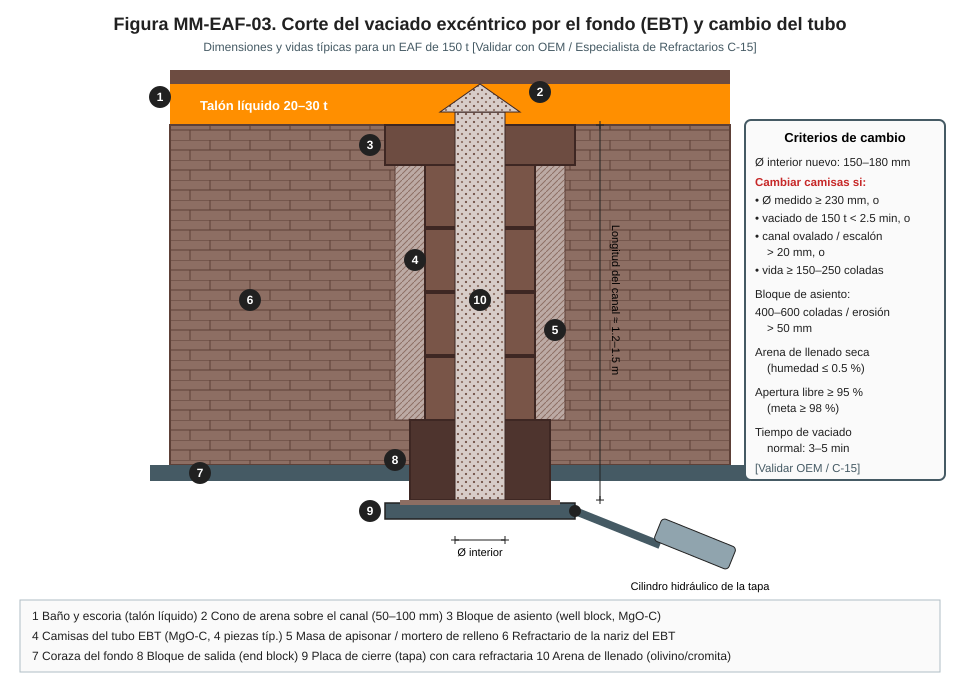
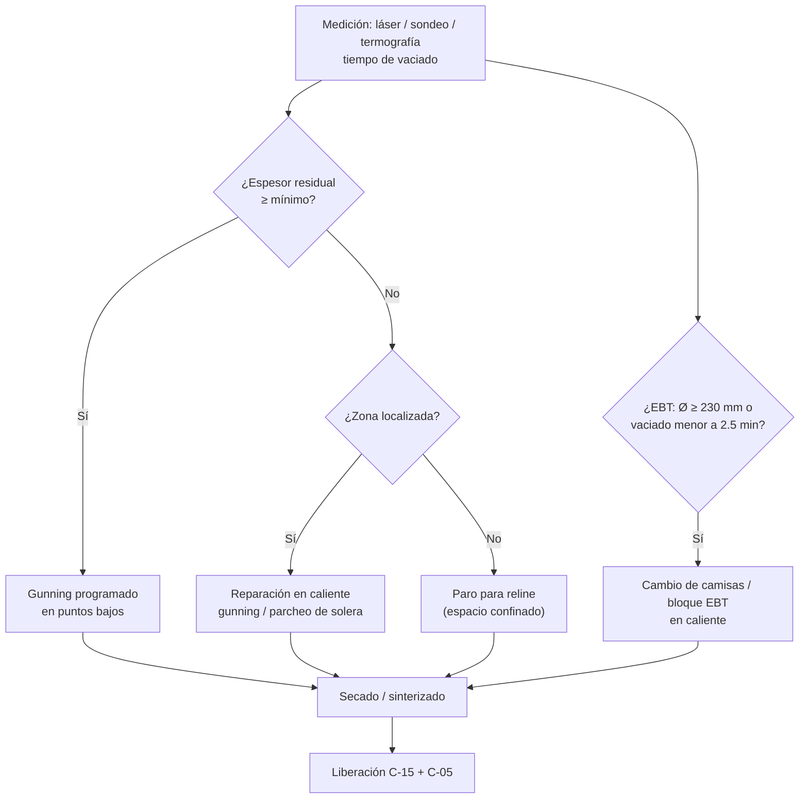
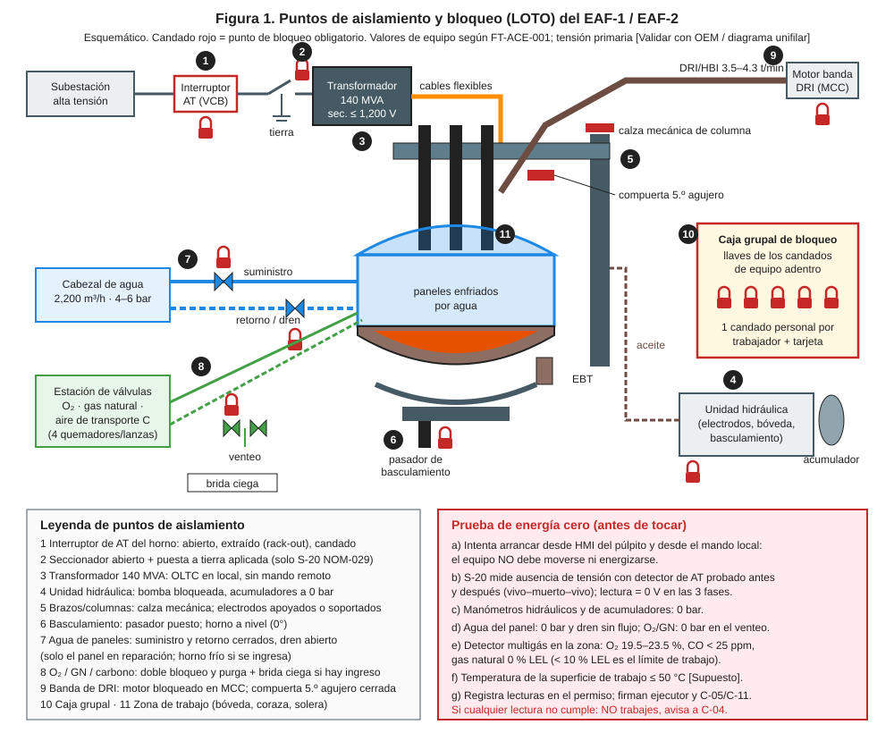

# MM-EAF-03 — Reparación de refractario del EAF: solera, bancos, EBT (cambio de tubo/bloque) y proyección (gunning)

| Código | Versión | Estado | Área | Dueño del proceso | Elaboró | Revisión técnica | Revisión de seguridad | Aprobó | Fecha | Próxima revisión |
|---|---|---|---|---|---|---|---|---|---|---|
| MM-EAF-03 | 0.1 | Borrador para validación | Acería · EAF-1 / EAF-2 | C-15 Especialista de Refractarios | gerente-personal-sindicalizado (Líder Academia de Mantenimiento y Confiabilidad) | experto-operativo-metalurgia | experto-seguridad-salud | Pendiente (Gerente de Acería / Director) | 2026-09-25 | 2027-09-25 |

> ⚠️ Base: FT-ACE-001 §2 (EAF de 150 t, coraza Ø 7.3 m, talón 20–30 t, EBT). Espesores, vidas y materiales dependen del proveedor de refractario y del OEM: **[Validar con OEM / Ingeniería de Mantenimiento / C-15]**.

## 1. Objetivo y alcance
Mantener el revestimiento refractario del EAF con espesor suficiente para evitar la **perforación del horno** (metal o escoria fuera de la coraza, contacto con paneles de agua) y asegurar un vaciado limpio por el EBT, sin arrastre de escoria.
**Incluye:** medición de espesores (láser y sondeo), termografía de coraza, proyección (gunning) de bancos y línea de escoria, reparación de solera, cambio de camisas y bloque del EBT, secado/sinterizado y liberación.
**No incluye:** llenado del EBT entre coladas y gunning rutinario de operación (MO-EAF-01), refractario de ollas (MM-OLL-01).

## 2. Roles y responsabilidades
| Rol | Responsabilidad en este proceso | R/A/C/I |
|---|---|---|
| C-15 Especialista de Refractarios | Dueño; define reparación, materiales y criterio de espesor mínimo; libera refractario | A |
| S-24 Refractarista | Gunning, reparación de solera, cambio de EBT, reline | R |
| S-03 Ayudante de Horno | Apoyo en gunning y llenado de EBT; limpieza | R |
| S-01 Operador de Púlpito | Posiciona y bloquea el horno; programa de sinterizado | R |
| C-05 Supervisor de Hornos | Autoriza paro y reinicio; firma liberación | A (operación) |
| S-04 Operador de Grúa de Carga | Izaje de materiales, camisas y bloques | R |
| C-11 / S-19 | Mecánica de la tapa del EBT y de la máquina de gunning | R |
| C-16 Especialista de Seguridad | Espacio confinado, calor, polvo | C |

## 3. Descripción del proceso
El revestimiento tiene: **capa de seguridad** (ladrillo de magnesia), **solera** de masa seca de magnesia apisonada, **bancos y línea de escoria** de ladrillo MgO-C, y el **EBT** (bloque de asiento, camisas del tubo, bloque de salida y placa de cierre). El desgaste se mide y se repara por proyección entre coladas; cuando el espesor residual cae al mínimo se hace reparación mayor o reline.

## 4. Equipos y maquinaria
| Equipo / componente | Función | Especificación clave | Condición para operar (verificación) |
|---|---|---|---|
| Solera (masa seca MgO) | Contener baño y talón | Espesor de trabajo nuevo ≈ 650 mm [Validar] | Residual ≥ 300 mm sobre capa de seguridad |
| Bancos y línea de escoria (MgO-C) | Resistir escoria FeO 25–35 % | Ladrillo nuevo 450 mm [Validar] | Residual ≥ 150 mm |
| Capa de seguridad (magnesia) | Última barrera | 115–230 mm [Validar] | **Nunca expuesta** |
| Bloque de asiento EBT | Entrada del canal | MgO-C | Erosión ≤ 50 mm |
| Camisas del tubo EBT | Canal de vaciado | Ø interior nuevo 150–180 mm | Ø ≤ 230 mm; vaciado ≥ 2.5 min |
| Bloque de salida y placa de cierre | Cerrar y sellar el EBT | Cara refractaria, cilindro hidráulico | Cierre hermético, placa plana |
| Máquina de gunning (lanza manipulador) | Proyectar masa MgO | Presión de aire 4–6 bar; agua 10–15 % [Validar] | Boquilla sin tapón, dosificación calibrada |
| Escáner láser de refractario | Medir perfil 3D | Exactitud ±10 mm [Validar] | Calibrado; referencias en coraza |
| Cámara termográfica / escáner de coraza | Detectar puntos calientes | Rango 0–500 °C | Calibrada |

## 5. Especificaciones, tolerancias y frecuencias
| Especificación | Unidad | Objetivo | Rango / tolerancia | Límite (alarma / rechazo) | Acción si está fuera | Instrumento | Frecuencia |
|---|---|---|---|---|---|---|---|
| Espesor residual de solera | mm | ≥ 450 | ≥ 300 | **< 300: reparación; < 200: 🛑 no operar** | Parcheo / reline | Láser o sondeo de profundidad del baño | Semanal |
| Espesor residual de bancos / línea de escoria | mm | ≥ 250 | ≥ 150 | **< 150: gunning obligatorio; < 100: 🛑** | Gunning / reline parcial | Láser, visual | Cada colada (visual) · semanal (láser) |
| Temperatura de coraza (fuera de paneles) | °C | ≤ 250 | ≤ 300 | > 300 investigar; **> 400 🛑** | Gunning en la zona; revisar espesor | Termografía | Diario |
| Ø interior del canal EBT | mm | 150–180 | ≤ 210 | **≥ 230: cambiar camisas** | Programar cambio | Plantilla / calibrador | Semanal y tras cada 50 coladas |
| Tiempo de vaciado de 150 t | min | 4 | 3–5 | **< 2.5 min: cambiar**; > 6 min revisar obstrucción | Cambio de camisas | Cronómetro HMI | Cada colada |
| Apertura libre del EBT | % | ≥ 98 | ≥ 95 | < 95 % | Revisar arena y llenado (MO-EAF-01) | Registro de coladas | Cada colada |
| Humedad de arena de llenado | % | ≤ 0.3 | ≤ 0.5 | > 0.5 | 🛑 No usar (explosión de vapor) | Balanza de humedad | Cada lote |
| Rebote de gunning | % | ≤ 10 | ≤ 15 | > 20 | Ajustar agua/distancia (0.8–1.5 m) | Pesaje estimado | Mensual |
| Consumo de gunning | kg/t | 1.5–2.5 [Validar] | — | > 3.5 | Revisar escoria (MgO 8–10 %) con C-07 | Registro de consumo | Semanal |
| Vida de camisas EBT | coladas | 150–250 [Validar] | — | Criterio por Ø/tiempo | — | Registro | Por campaña |
| Vida del bloque de asiento | coladas | 400–600 [Validar] | — | Erosión > 50 mm | Cambio | Visual/plantilla | Por campaña |
| Secado tras reparación húmeda / reline | °C·h | Curva del proveedor | — | Omitir secado = 🛑 | Aplicar curva | Termopar / HMI | Cada reparación |

### 5.1 Rutina preventiva y predictiva
| Tarea | Frecuencia | Rol | Duración | Ventana |
|---|---|---|---|---|
| Inspección visual de bancos y EBT; gunning de puntos | Cada colada | S-02 / S-03 (MO-EAF-01) | 3–5 min | Entre coladas |
| Termografía de coraza y fondo | Diario | S-24 / C-15 | 20 min | En operación |
| Escaneo láser de perfil | Semanal | C-15 / S-24 | 30 min | Paro semanal (horno caliente) |
| Medición de Ø del canal EBT | Semanal | S-24 | 15 min | Paro semanal |
| Gunning programado de reparación | Semanal | S-24 | 1–2 h | Paro semanal |
| Cambio de camisas del EBT | 150–250 coladas o por condición | S-24, S-03, S-19 | 1.5–3 h [Validar] | Paro programado corto |
| Cambio de bloque de asiento | 400–600 coladas | S-24 | 4–6 h | Paro semanal extendido |
| Parcheo de solera | Por condición (< 300 mm local) | S-24 | 2–4 h | Paro semanal |
| Reline completo (bancos/solera) | Por campaña [Validar] | S-24 + contratista REPSE | 3–5 días | Paro mayor |
| Revisión de tapa del EBT, cilindro y bisagra | Semanal | S-19 | 30 min | Paro semanal |

## 6. Seguridad
### 6.1 Peligros y controles críticos
| Peligro | Consecuencia | Control crítico | Verificación |
|---|---|---|---|
| Perforación de horno por espesor bajo | Metal fuera de coraza, fuga en paneles, explosión | Espesores mínimos y 🛑 por temperatura de coraza > 400 °C | Termografía diaria, láser semanal |
| Humedad en refractario o arena | Explosión de vapor | Arena ≤ 0.5 %; secado obligatorio; no gunning sobre metal líquido | Registro de humedad y curva de secado |
| Trabajo bajo el EBT (cambio en caliente) | Salida de metal/escoria, quemadura | Horno basculado hacia la puerta de escoria y bloqueado; talón lejos del EBT; nadie bajo el EBT hasta confirmar | Perno de basculamiento colocado + verificación de C-05 |
| Entrada al horno (reline) | Calor, CO, caída de material, derrumbe de ladrillo | Espacio confinado (NOM-033), enfriamiento, demolición mecánica antes de entrar | Permiso, gases, T aire ≤ 45 °C [Validar], vigía |
| Energías del horno | Electrocución, movimiento | LOTO E1–E6 (ver MM-EAF-01 §6.3) | Prueba de energía cero |
| Polvo de MgO / sílice cristalina (arena) | Enfermedad respiratoria | Extracción, respirador P100, humectación | Monitoreo NOM-010 |
| Calor radiante | Estrés térmico | Rotación, hidratación (NOM-015, MS-ACE-08) | Índice TGBH |

### 6.2 EPP obligatorio
Ropa aluminizada (frente al horno), careta con visor dorado, casco con cubrenuca, guantes largos aluminizados, botas metatarsales con polainas, respirador P100, protección auditiva; en entrada al horno: arnés con línea de rescate y detector de 4 gases.

### 6.3 Permisos, bloqueos y zonas de exclusión
**Permisos:** espacio confinado (reline/entrada), trabajo en caliente (oxicorte de costras), altura (bancos altos), izaje (bloques).
**LOTO:** E1 MT del horno; E2 HPU con horno **basculado y bloqueado mecánicamente** en la posición del trabajo; E3 O₂/GN de lanzas y quemadores cerrados y purgados; E4 DRI y carbono; E6 bóveda girada y asegurada. Agua de paneles **en servicio** (no se aísla, salvo que se trabaje en ellos). **Prueba de energía cero:** intento de arco y de basculamiento rechazados, manómetros de gases en 0 bar, gases en el interior O₂ 19.5–23.5 %, CO < 25 ppm, LEL 0 %.
**Zona de exclusión:** debajo del EBT y en la trayectoria de la escoria durante el cambio en caliente.

## 7. Calidad
| Variable crítica de calidad | Especificación | Método / frecuencia | Registro | Defecto si falla |
|---|---|---|---|---|
| 🔎 Arrastre de escoria al vaciar | Vaciado ≥ 2.5 min, EBT sin vórtice prematuro | Tiempo de vaciado cada colada | HMI / bitácora | Reversión de P (> 0.015 %), mayor consumo de Al y cal, inclusiones |
| 🔎 Apertura libre del EBT | ≥ 95 % (meta 98 %) | Cada colada | Registro | Lanceo con O₂ → reoxidación y N del acero |
| 🔎 Limpieza del canal | Sin costras ni escalones > 20 mm | Semanal | Plantilla | Chorro abierto (spray) → reoxidación, N |
| MgO de escoria | 8–10 % | Análisis de escoria (C-07) | Laboratorio | Desgaste acelerado de MgO-C |

## 8. Procedimiento paso a paso (cambio de camisas del EBT en caliente + gunning)
| # | Paso | Cómo hacerlo (detalle y medición) | Criterio de aceptación | ★ | Rol |
|---|---|---|---|---|---|
| 1 | Prepara materiales | Camisas, bloque, mortero, arena de llenado (humedad ≤ 0.5 %), herramienta de izaje; todo precalentado/seco | Material seco y verificado | ★ | S-24, C-15 |
| 2 | Vacía y posiciona | Tras el vaciado, bascula el horno hacia la puerta de escoria; talón lejos del EBT | Zona EBT sin metal | ★ | S-01, C-05 |
| 3 | LOTO | E1, E2 con perno de basculamiento, E3, E4, E6 | Candados puestos | ★ | S-20, S-19, S-01 |
| 4 | Prueba energía cero | Intento de arco y basculamiento rechazados; gases | Sin energía | ★ | C-05, C-15 |
| 5 | Abre la placa de cierre | Desde el puesto de mando local, con zona despejada | Placa abierta sin salida de metal | ★ | S-24 |
| 6 | Retira camisas y bloque de salida | Con el extractor/empujador OEM; limpia restos con barra y oxicorte si hay costra | Canal limpio, asiento sin escalón > 10 mm | | S-24, S-03 |
| 7 | Mide el bloque de asiento | Plantilla en la boca | Erosión ≤ 50 mm; si no, programar cambio | 🔎 | C-15 |
| 8 | Coloca camisas nuevas | Según método OEM (desde arriba con herramienta o desde abajo); mortero en juntas ≤ 3 mm; relleno con masa apisonada sin huecos | Camisas alineadas (desalineación ≤ 5 mm) | ★ | S-24 |
| 9 | Coloca bloque de salida | Asienta y fija; verifica que la placa cierre plana | Cierre sin luz visible | ★ | S-24, S-19 |
| 10 | Mide el Ø nuevo | Calibrador en 3 alturas | 150–180 mm | 🔎 | S-24 |
| 11 | Cierra y llena el EBT | Cierra placa; llena con arena seca hasta formar cono de 50–100 mm | Canal lleno y cono visible | ★ | S-03 |
| 12 | Gunning de bancos | Con horno caliente (≥ 800 °C en cara), distancia 0.8–1.5 m, capas ≤ 50 mm, sin proyectar sobre metal líquido | Superficie cubierta, rebote ≤ 15 % | | S-24 |
| 13 | Retira LOTO | Orden inverso; personal fuera de zona | Candados retirados | ★ | Todos |
| 14 | Libera | Checklist firmado por C-15 y C-05; primera colada con vigilancia del tiempo de vaciado | Firmado | ★ | C-15, C-05 |

### 8.1 Secado y sinterizado después de reparación [Validar con proveedor de refractario / C-15]
| Tipo de reparación | Condición de secado | Tiempo mínimo | Verificación | Rol |
|---|---|---|---|---|
| Gunning en caliente (cara ≥ 800 °C) | Calor residual del horno | Hasta que no haya vapor visible (≈ 5–10 min) | Visual | S-24 |
| Parcheo de solera con masa seca | Talón líquido o arco a baja potencia | Primera colada con perfil de sinterizado | C-07 define perfil | S-01, C-15 |
| Cambio de camisas del EBT (mortero) | Calor del horno | Según hoja del mortero | Sin vapor en canal | S-24 |
| Reline de bancos con ladrillo | Quemadores a baja potencia | Curva del proveedor (típ. 8–12 h) | Registro de temperatura | C-15 |
| Solera nueva | Programa de sinterizado del proveedor | 1–3 coladas con talón y potencia reducida | Registro de colada | C-07, C-15 |

**Checklist de liberación (Mantenimiento/Refractarios + Operación):** [ ] Ø EBT 150–180 mm · [ ] placa cierra plana · [ ] arena seca (≤ 0.5 %) y cono formado · [ ] espesores ≥ mínimos (registro láser) · [ ] curva de secado cumplida (si hubo reparación húmeda) · [ ] candados retirados · Firma C-15/S-24: ____ Firma C-05/S-01: ____ Fecha/hora: ____

## 9. Condiciones anormales y respuesta
| Síntoma / alarma | Causa probable | Acción inmediata | A quién avisar |
|---|---|---|---|
| Punto caliente de coraza > 400 °C | Espesor crítico, grieta | 🛑 No cargar; vaciar; gunning o paro | C-05, C-15 |
| Metal o escoria saliendo por la coraza | Perforación | Emergencia MS-ACE-09; arco fuera; evacuar | C-04, brigada |
| EBT no abre (apertura libre falla) | Arena húmeda/sinterizada, costra | Lanceo con O₂ solo por personal autorizado y con EPP | C-05, C-15 |
| Vaciado < 2.5 min | Canal erosionado | Programar cambio antes de la siguiente colada crítica | C-15, C-07 |
| Tapa del EBT no cierra plana | Costra, bisagra dañada | No llenar; limpiar/reparar | S-19, C-05 |
| Desprendimiento de gunning | Superficie fría o masa húmeda | Ajustar agua y temperatura | C-15 |
| Solera con "hoyo" o metal infiltrado (sondeo más profundo de lo normal) | Erosión local, sinterizado deficiente | Parcheo con masa seca en el siguiente paro; vigilar termografía del fondo | C-15, C-05 |
| Desgaste acelerado de línea de escoria (> 2× tendencia) | MgO de escoria bajo, FeO alto, arco descubierto | Revisar práctica de escoria con C-07 | C-07, C-15 |

## 10. Registros
Perfil láser por semana · mapa termográfico · registro de EBT (coladas, Ø, tiempo de vaciado, apertura libre) · consumo de gunning · humedad de arena por lote · curva de secado · permisos y LOTO · checklist de liberación.

## 11. Competencia requerida y certificación
| Rol | Nivel requerido (1–4) | Formación teórica (h) | OJT supervisado (h / eventos) | Evaluación (pasos ★) | Vigencia |
|---|---|---|---|---|---|
| S-24 Refractarista | 3 | 24 (materiales, EBT, gunning, secado) | 60 h / 3 cambios de EBT | Pasos 1–5, 8, 9, 11, 13 | 24 meses |
| S-03 Ayudante de Horno | 2 | 8 (llenado EBT, gunning básico) | 20 h | Paso 11 | 24 meses |
| C-15 Especialista | 4 | Proveedor + 16 (criterios de desgaste) | — | Evaluador de pasos 7, 10, 14 | 24 meses |
| Todos los que entran al horno | 3 | NOM-033 (8 h) + NOM-015 | Simulacro de rescate | Permiso y gases | 12 meses |

**Normas:** NOM-033-STPS (espacio confinado), NOM-015-STPS (calor), NOM-010-STPS (polvos), NOM-009-STPS (altura), NOM-004-STPS (bloqueo), NOM-017-STPS, NOM-027-STPS (oxicorte). Verificar con Jurídico Laboral / SSO.
**Verificación ★:** ¿horno basculado y bloqueado antes de trabajar bajo el EBT? · ¿arena ≤ 0.5 % de humedad? · ¿no proyectó sobre metal líquido? · ¿midió Ø y espesores y los registró? · ¿liberación firmada?

## 12. Referencias
FT-ACE-001 §2 · MO-EAF-01, MO-EAF-07 · MM-EAF-01 · MS-ACE-03, -05, -08 · Hojas técnicas del proveedor de refractario [por referenciar] · Manual OEM del EBT [por referenciar].

## 13. Control de cambios
| Versión | Fecha | Cambio | Autor |
|---|---|---|---|
| 0.1 | 2026-09-25 | Emisión inicial para validación | gerente-personal-sindicalizado |
