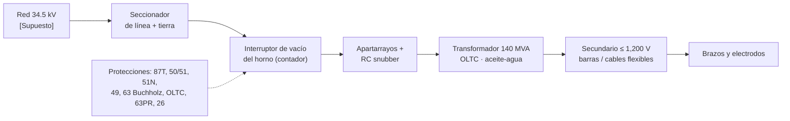
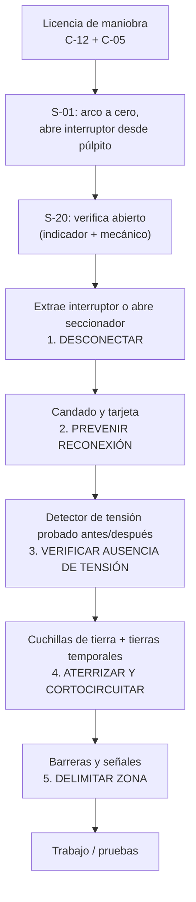

# MM-EAF-04 — Mantenimiento del transformador del horno y maniobras de alta tensión

| Código | Versión | Estado | Área | Dueño del proceso | Elaboró | Revisión técnica | Revisión de seguridad | Aprobó | Fecha | Próxima revisión |
|---|---|---|---|---|---|---|---|---|---|---|
| MM-EAF-04 | 0.1 | Borrador para validación | Acería · subestaciones de EAF-1 / EAF-2 | C-12 Supervisor de Mantenimiento Eléctrico e Instrumentación | gerente-personal-sindicalizado (Líder Academia de Mantenimiento y Confiabilidad) | experto-operativo-metalurgia | experto-seguridad-salud | Pendiente (Gerente de Acería / Director) | 2026-09-25 | 2027-09-25 |

> ⚠️ Base: FT-ACE-001 §2 (transformador de 140 MVA, secundario hasta 1,200 V, OLTC). **La ficha no define el voltaje primario:** aquí se usa **34.5 kV [Supuesto]**. Todo límite de prueba está sujeto a **[Validar con OEM / Ingeniería de Mantenimiento]** y a la línea base de fábrica del transformador.

## 1. Objetivo y alcance
Mantener confiable el transformador del horno (y su reactor serie, si existe), el cambiador de derivaciones bajo carga (OLTC), el interruptor de vacío del horno y sus protecciones; y ejecutar **maniobras de media/alta tensión** con las 5 reglas de oro y licencia de maniobra.
**Incluye:** inspección, termografía, análisis de aceite y cromatografía de gases disueltos (DGA), pruebas eléctricas (megger, Tan δ, relación de transformación, resistencia de devanados), mantenimiento del OLTC y del interruptor, prueba de protecciones, maniobras y puesta a tierra.
**No incluye:** brazos y cables flexibles (MM-EAF-02), subestación principal de la compañía suministradora.

## 2. Roles y responsabilidades
| Rol | Responsabilidad en este proceso | R/A/C/I |
|---|---|---|
| C-12 Supervisor Eléctrico e Instrumentación | Dueño; emite licencia de maniobra; autoriza pruebas; libera | A |
| S-20 Electricista de Acería (MT certificado) | Maniobras, LOTO eléctrico, puestas a tierra, pruebas, mantenimiento | R |
| S-21 Instrumentista | Relés de protección, transmisores de temperatura/nivel, monitor de DGA en línea | R |
| S-01 Operador de Púlpito | Lleva el arco a cero y abre el interruptor desde el púlpito; firma liberación | R |
| C-05 Supervisor de Hornos | Autoriza la indisponibilidad del horno | A (operación) |
| C-14 Ingeniero de Confiabilidad | Tendencias de DGA, Tan δ, termografía; RCA | C |
| C-16 Especialista de Seguridad | Arco eléctrico (arc flash), distancias, EPP | C |
| Laboratorio / proveedor acreditado | DGA, fisicoquímicos, pruebas especiales (SFRA) | R (externo, REPSE) |

## 3. Descripción del proceso
El transformador del horno trabaja con cargas muy variables, cortocircuitos frecuentes del arco y muchas operaciones del OLTC y del interruptor. Por eso su mantenimiento es **predictivo**: se vigila el aceite, los gases disueltos y la temperatura, y se prueban las protecciones. Toda intervención empieza con una maniobra controlada.

## 4. Equipos y maquinaria
| Equipo / componente | Función | Especificación clave | Condición para operar (verificación) |
|---|---|---|---|
| Transformador del horno | Alimentar el arco | 140 MVA; secundario ≤ 1,200 V; enfriamiento aceite–agua | Protecciones en servicio, DGA normal |
| OLTC | Cambiar voltaje secundario bajo carga | Compartimento de aceite separado [Validar] | Contador de operaciones dentro de intervalo OEM |
| Intercambiador aceite–agua | Enfriar aceite | **Presión de aceite > presión de agua**; tubo doble con detector de fuga | Detector de fuga sin alarma |
| Interruptor de vacío del horno | Conectar/desconectar el horno | Muchas operaciones por día; contador | Desgaste de contactos dentro de OEM |
| Seccionador y cuchillas de tierra | Aislamiento visible y puesta a tierra | Enclavamiento mecánico con el interruptor | Enclavamiento probado |
| Apartarrayos y RC snubber | Limitar sobretensiones de maniobra | Clase según estudio | Sin daño, corriente de fuga normal |
| Relé Buchholz / protección del OLTC / válvula de alivio | Detectar falla interna | Alarma y disparo | Probados con aire/botón de prueba |
| Monitor de DGA en línea (H₂ + humedad) | Alerta temprana | Tendencia continua | Comunicación con SCADA |
| Relé de protección multifunción | 87T, 50/51, 51N, 49 | Ajustes del estudio de coordinación | Prueba de inyección secundaria vigente |

## 5. Especificaciones, tolerancias y frecuencias
| Especificación | Unidad | Objetivo | Rango / tolerancia | Límite (alarma / rechazo) | Acción si está fuera | Instrumento | Frecuencia |
|---|---|---|---|---|---|---|---|
| Temperatura de aceite superior | °C | ≤ 70 | ≤ 80 | Alarma 85 · disparo 95 [Validar] | Revisar enfriamiento y carga | Termómetro / RTD | Continuo |
| Temperatura de devanado (imagen térmica) | °C | ≤ 90 | ≤ 100 | Alarma 105 · disparo 115 [Validar] | Reducir potencia | Relé 49 | Continuo |
| Rigidez dieléctrica del aceite | kV (2.5 mm) | ≥ 60 | ≥ 50 | < 40 | Filtrar/secar aceite | Probador de aceite (IEC 60156) | Trimestral |
| Humedad en aceite | ppm | ≤ 10 | ≤ 15 | > 20 alerta; > 30 acción | Secado en línea | Karl Fischer | Trimestral |
| Acidez | mg KOH/g | ≤ 0.05 | ≤ 0.10 | > 0.15 | Regenerar aceite | Laboratorio | Semestral |
| Tensión interfacial | mN/m | ≥ 32 | ≥ 28 | < 25 | Regenerar | Laboratorio | Semestral |
| DGA: H₂ / CH₄ / C₂H₆ / C₂H₄ | ppm | Tendencia estable | ≤ 100 / 120 / 65 / 50 | Superar o crecer > 10 %/mes | Muestreo cada 2 semanas; diagnóstico Duval/Rogers | Cromatografía (laboratorio) + monitor en línea | Mensual (laboratorio) · continuo (en línea) |
| DGA: C₂H₂ (acetileno) en tanque principal | ppm | 0 | ≤ 1 | **> 1 alerta; crecimiento = 🛑 evaluar sacar de servicio** | Revisar fuga OLTC→tanque, arco interno | Cromatografía | Mensual |
| DGA: CO / CO₂ | ppm | Tendencia | ≤ 350 / 2,500 | CO₂/CO < 3 | Revisar degradación de papel | Cromatografía | Mensual |
| Resistencia de aislamiento (megger 5 kV, 1 min, 20 °C) | MΩ | Línea base | ≥ 1,000 [Validar] | Baja > 30 % vs. base | Secado / diagnóstico | Megger 5 kV | Anual |
| Índice de polarización (10/1 min) | — | ≥ 2.0 | ≥ 1.5 | < 1.25 | 🛑 No energizar; secado | Megger 5 kV | Anual |
| Tan δ de devanados (20 °C) | % | ≤ 0.3 | ≤ 0.5 | > 0.7 o +0.2 puntos vs. base | Diagnóstico con OEM | Equipo de Tan δ / capacitancia 10 kV | Anual |
| Tan δ y capacitancia de boquillas | % / pF | Placa | Tan δ ≤ 0.5; C ±5 % | C > ±10 % | Cambiar boquilla | Equipo de Tan δ | Anual |
| Relación de transformación (TTR) | % | Placa | ±0.5 % por derivación | > ±0.5 % | Revisar OLTC/devanado | TTR trifásico | Anual y tras falla |
| Resistencia de devanados | mΩ | Base de fábrica | ±2 % entre fases (corregido a 75 °C) | > 3 % | Revisar contactos OLTC | Micro-ohmímetro | Anual |
| Operaciones del OLTC | ops | Intervalo OEM | — | Alcanza intervalo | Mantenimiento de OLTC | Contador | Semanal (lectura) |
| Rigidez del aceite del OLTC | kV | ≥ 40 | ≥ 30 | < 30 | Cambiar/filtrar aceite del OLTC | Probador de aceite | Trimestral |
| Operaciones del interruptor de vacío | ops | Intervalo OEM | — | Alcanza intervalo | Mantenimiento/cambio de botellas | Contador | Semanal |
| Resistencia de contactos del interruptor | µΩ | OEM | ≤ 1.2 × valor de fábrica | > 1.5 × | Cambio de botella | Micro-ohmímetro 100 A | Semestral |
| Integridad de vacío (hi-pot en contactos abiertos) | kV CA | Valor OEM | Sin ruptura | Ruptura | Cambiar botella | Hi-pot | Semestral |
| Termografía de conexiones MT y secundario | °C | ΔT ≤ 10 vs. fase similar | — | 10–30 programar; > 30 urgente | Reapretar/limpiar | Cámara termográfica | Mensual |
| Prueba de protecciones (inyección secundaria) | — | Disparo según ajustes | ±5 % en tiempo/corriente | No dispara = 🛑 | Corregir antes de energizar | Maleta de pruebas de relés | Anual y tras cambio de ajustes |

### 5.1 Rutina preventiva y predictiva
| Tarea | Frecuencia | Rol | Duración | Ventana |
|---|---|---|---|---|
| Recorrido: niveles, temperaturas, fugas de aceite, silica gel, ruido, detector de fuga aceite–agua | Diario | S-20 | 20 min | En operación |
| Lectura de contadores OLTC e interruptor; revisión del monitor DGA en línea | Semanal | S-20 / S-21 | 15 min | En operación |
| Termografía de celdas MT, boquillas, barras secundarias | Mensual | S-20 (termógrafo nivel I) | 1 h | En operación (distancia segura) |
| Muestra de aceite para DGA | Mensual | S-20 / laboratorio | 30 min | En operación |
| Fisicoquímicos de aceite (tanque y OLTC) | Trimestral | Laboratorio | — | En operación |
| Prueba de Buchholz, alivio de presión, alarmas de temperatura | Semestral | S-21 | 2 h | Paro mensual |
| Mantenimiento del interruptor de vacío | Semestral o por contador | S-20 | 4 h | Paro mensual |
| Mantenimiento del OLTC (contactos, aceite, filtro) | Por contador (intervalo OEM) | S-20 + OEM | 1–2 turnos | Paro mensual / mayor |
| Pruebas eléctricas completas (megger, PI, Tan δ, TTR, resistencia, boquillas) | Anual | S-20 + proveedor acreditado | 1–2 turnos | Paro mayor |
| Prueba de protecciones con inyección secundaria | Anual | S-21 / proveedor | 4 h | Paro mayor |
| SFRA (respuesta en frecuencia) | Tras cortocircuito severo o traslado | Proveedor | 4 h | Paro no programado |

## 6. Seguridad
### 6.1 Peligros y controles críticos
| Peligro | Consecuencia | Control crítico | Verificación |
|---|---|---|---|
| Contacto con MT (34.5 kV [Supuesto]) | Electrocución, fatalidad | 5 reglas de oro, licencia de maniobra, solo personal certificado NOM-029 | Licencia firmada; detector probado; tierras colocadas |
| Arco eléctrico en maniobra | Quemaduras graves | Maniobra remota cuando exista; EPP arc-rated según estudio IEEE 1584 (típ. ≥ 40 cal/cm² en celdas MT [Validar]) | Etiqueta de arc flash en celda |
| Retroalimentación / tensión inducida | Electrocución | Tierras en ambos lados del punto de trabajo | Verificación visual de tierras |
| Energía almacenada (capacitores RC, resortes del interruptor) | Descarga, golpe | Descargar capacitores; descargar resortes | Indicador "resorte descargado" |
| Aceite caliente / incendio | Quemadura, incendio | Sistema contra incendio en servicio; aceite ≤ 40 °C antes de abrir | Termómetro |
| Entrada al tanque (inspección interna) | Asfixia, caída | Espacio confinado NOM-033, aire seco, vigía | Permiso y gases |
| Altura (boquillas, conservador) | Caída | Plataforma o arnés (NOM-009) | Permiso de altura |

### 6.2 EPP obligatorio
Ropa arc-rated de la categoría de la celda, careta/capucha arc-rated, guantes dieléctricos clase según voltaje con protector de cuero (probados cada 6 meses), botas dieléctricas, casco clase E, lentes; pértiga y detector de tensión certificados.

### 6.3 Permisos, bloqueos y zonas de exclusión
**Permisos:** licencia de maniobra (C-12), permiso eléctrico NOM-029, altura, espacio confinado (tanque), trabajo en caliente (si se suelda en tanque vacío y desgasificado).
**Puntos de aislamiento:** E1a interruptor de vacío abierto y extraído (o bloqueado en "abierto"); E1b seccionador de línea abierto con candado; E1c cuchillas de tierra cerradas; E1d tierras temporales en primario y secundario del transformador; E2 servicios auxiliares del transformador (bombas de aceite y agua, OLTC motor) en CCM bloqueado; E5 agua del intercambiador (V1/V2) si se interviene; E-CI sistema contra incendio en "manual" solo durante la prueba y con vigía.
**Prueba de energía cero:** detector de tensión probado en fuente conocida → punto de trabajo (3 fases) → fuente conocida; intento de cierre del interruptor desde púlpito rechazado; OLTC sin respuesta.
**Zona de exclusión:** límite de aproximación restringido de NOM-029 alrededor de partes energizadas adyacentes.

## 7. Calidad
| Variable crítica de calidad | Especificación | Método / frecuencia | Registro | Defecto si falla |
|---|---|---|---|---|
| 🔎 Disponibilidad del perfil de potencia | Todas las derivaciones del OLTC disponibles | Prueba funcional tras mantenimiento | Reporte | Fusión lenta, tap-to-tap > 55 min, temperatura de vaciado fuera de 1,630 ± 15 °C |
| 🔎 Energía específica | 560–620 kWh/t | KPI diario (C-07) | Tablero | Energía alta por derivación bloqueada o reactor dañado |
| Paros no programados del horno | 0 por falla del transformador | Mensual | CMMS | Pérdida de secuencia en CC → cambio de grado o reoxidación |

## 8. Procedimiento paso a paso (maniobra + pruebas anuales)
| # | Paso | Cómo hacerlo (detalle y medición) | Criterio de aceptación | ★ | Rol |
|---|---|---|---|---|---|
| 1 | Planea | Licencia de maniobra con diagrama unifilar actualizado, lista de pasos y responsables | Licencia firmada por C-12 y C-05 | ★ | C-12 |
| 2 | Charla previa | Revisa pasos, EPP, distancias, rescate | Todos entienden su papel | | C-12, S-20 |
| 3 | Lleva el arco a cero | Sube electrodos y abre el interruptor desde el púlpito | Indicación "abierto" | ★ | S-01 |
| 4 | Verifica abierto | Indicador eléctrico + indicador mecánico del interruptor | Ambos "abierto" | ★ | S-20 |
| 5 | Desconecta | Extrae el interruptor o abre el seccionador con EPP arc-rated | Aislamiento visible | ★ | S-20 |
| 6 | Bloquea | Candado y tarjeta personales en interruptor, seccionador y CCM de auxiliares | Candados puestos | ★ | S-20, S-21 |
| 7 | Verifica ausencia de tensión | Detector MT: prueba en fuente conocida → 3 fases → fuente conocida | 0 V en las 3 fases | ★ | S-20 |
| 8 | Aterriza | Cierra cuchillas de tierra; coloca tierras temporales en primario y secundario | Tierras colocadas y visibles | ★ | S-20 |
| 9 | Delimita | Barreras y señales; libera el área de trabajo | Zona delimitada | ★ | S-20 |
| 10 | Toma muestra de aceite | Válvula de muestreo, jeringa de vidrio sin burbujas, etiqueta | Muestra válida | 🔎 | S-20 |
| 11 | Pruebas eléctricas | Retira tierras solo del devanado bajo prueba (con control); megger 5 kV, PI, Tan δ, TTR, resistencia; corrige a 20/75 °C | Valores dentro de la tabla §5 y vs. base | 🔎 | S-20 / proveedor |
| 12 | Mantenimiento de interruptor / OLTC | Según manual OEM y contador | Resistencia de contactos ≤ 1.2 × fábrica | | S-20 |
| 13 | Prueba protecciones | Inyección secundaria de 87T, 50/51, 51N; disparo real de Buchholz y OLTC | Disparo correcto | ★ | S-21 |
| 14 | Restituye | Retira tierras temporales (conteo contra registro), abre cuchillas de tierra, retira candados | Tierras contadas = colocadas | ★ | S-20 |
| 15 | Energiza en vacío | Cierra interruptor sin arco; escucha ruido, revisa corriente de magnetización | Sin alarmas | | S-20, S-01 |
| 16 | Libera | Checklist firmado por C-12 y C-05 | Firmado | ★ | C-12, C-05 |

**Checklist de liberación (Mantenimiento + Operación):** [ ] tierras temporales retiradas (número = número colocado) · [ ] PI ≥ 1.5 y megger ≥ base · [ ] protecciones probadas y en servicio · [ ] OLTC recorre todas las derivaciones · [ ] sin fugas de aceite ni alarma de fuga aceite–agua · [ ] candados retirados · Firma C-12/S-20: ____ Firma C-05/S-01: ____ Fecha/hora: ____

## 9. Condiciones anormales y respuesta
| Síntoma / alarma | Causa probable | Acción inmediata | A quién avisar |
|---|---|---|---|
| Disparo por Buchholz o 87T | Falla interna | 🛑 No re-energizar; DGA urgente y pruebas | C-12, C-10, C-05 |
| Alarma Buchholz (gas acumulado) | Gas por falla incipiente o aire | Tomar muestra de gas del relé y de aceite | C-12 |
| C₂H₂ creciente en tanque | Arco interno o fuga desde OLTC | Evaluar sacar de servicio con OEM | C-12, C-14 |
| Alarma de fuga aceite–agua | Tubo del intercambiador roto | Aislar intercambiador; revisar humedad en aceite | C-12 |
| Temperatura de aceite > 85 °C | Falla de enfriamiento, sobrecarga | Reducir potencia; revisar bombas y agua | S-01, S-20 |
| OLTC no cambia / protección OLTC | Motor, mecanismo, contactos | Bloquear OLTC en derivación segura; revisar | S-20, C-07 |
| Punto caliente > 30 °C ΔT | Conexión floja | Programar paro para reapriete | C-12 |

## 10. Registros
Licencia de maniobra y registro de tierras · reportes de DGA y fisicoquímicos con tendencia · pruebas eléctricas anuales con corrección de temperatura · contadores OLTC/interruptor · prueba de protecciones · termografías · checklist de liberación.

## 11. Competencia requerida y certificación
| Rol | Nivel requerido (1–4) | Formación teórica (h) | OJT supervisado (h / eventos) | Evaluación (pasos ★) | Vigencia |
|---|---|---|---|---|---|
| S-20 Electricista (maniobra MT) | 4 | NOM-029 (16) + maniobras MT (16) + arc flash (8) | 5 maniobras supervisadas | Pasos 3–9, 14 | 24 meses; autorización escrita del patrón (NOM-029) |
| S-20 Electricista (pruebas) | 3 | Pruebas a transformadores (24), termografía nivel I | 2 campañas anuales | Pasos 10, 11 | 24 meses |
| S-21 Instrumentista | 3 | Protecciones y relés (24) | 2 pruebas | Paso 13 | 24 meses |
| C-12 | 4 | Licencias de maniobra, coordinación de protecciones | — | Evaluador | 24 meses |

**Normas:** NOM-029-STPS (mantenimiento de instalaciones eléctricas), NOM-001-SEDE (instalaciones eléctricas), NOM-022-STPS (electricidad estática/tierras, si aplica), NOM-033-STPS (tanque), NOM-009-STPS, NOM-017-STPS; referencias IEEE C57.104 (DGA), IEC 60422 (aceite), IEEE C57.152 (pruebas), NFPA 70E / IEEE 1584 (arc flash). Verificar con Jurídico Laboral / SSO.
**Verificación ★:** ¿licencia antes de tocar? · ¿verificó ausencia de tensión con detector probado antes y después? · ¿tierras en ambos lados? · ¿conteo de tierras al restituir? · ¿protecciones probadas antes de energizar?

## 12. Referencias
FT-ACE-001 §2 · MM-EAF-02 · MS-ACE-02 · Diagrama unifilar de la subestación del EAF [por referenciar] · Manual OEM del transformador, OLTC e interruptor [por referenciar] · Estudio de coordinación de protecciones y de arc flash [por referenciar].

## 13. Control de cambios
| Versión | Fecha | Cambio | Autor |
|---|---|---|---|
| 0.1 | 2026-09-25 | Emisión inicial para validación | gerente-personal-sindicalizado |
