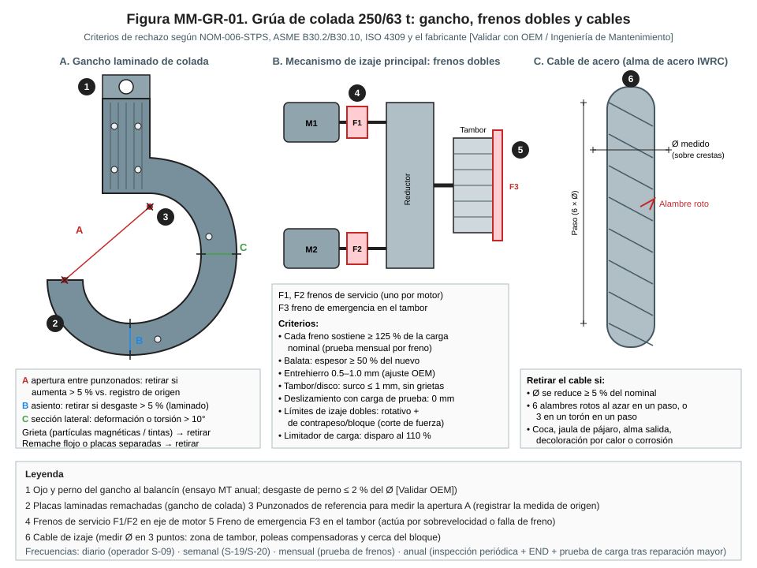
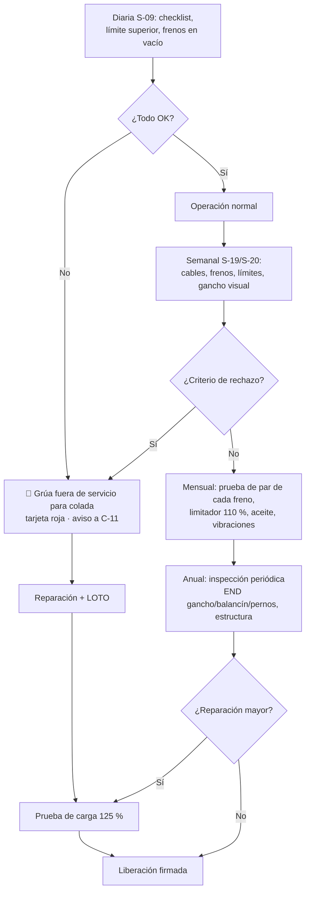

# MM-GR-01 — Inspección y mantenimiento de grúas de colada (ganchos, frenos, cables, límites)

| Código | Versión | Estado | Área | Dueño del proceso | Elaboró | Revisión técnica | Revisión de seguridad | Aprobó | Fecha | Próxima revisión |
|---|---|---|---|---|---|---|---|---|---|---|
| MM-GR-01 | 0.2 | Borrador para validación | Acería · nave de ollas | C-11 Supervisor de Mantenimiento Mecánico | gerente-personal-sindicalizado (Líder Academia de Mantenimiento y Confiabilidad) | experto-operativo-metalurgia | experto-seguridad-salud — visto bueno con observaciones, 2026-09-25 | Pendiente (Gerente de Acería / Director) | 2026-09-25 | 2027-09-25 |

> ⚠️ Base: FT-ACE-001 §6 (**2 grúas de colada de 250/63 t con doble sistema de freno y límites redundantes**). Criterios de rechazo tomados de NOM-006-STPS, ASME B30.2 / B30.10, ISO 4309 y la norma del fabricante; **prevalece el más estricto**. Valores específicos: **[Validar con OEM / Ingeniería de Mantenimiento]**. **Una olla de 150 t de acero líquido suspendida es el riesgo de mayor severidad de la Acería.**

## 1. Objetivo y alcance
Mantener las grúas de colada en condición de **no dejar caer nunca una olla**: gancho y balancín íntegros, cables dentro de criterio, dos frenos independientes que sostienen la carga, límites redundantes y protecciones térmicas contra el calor del acero.
**Incluye:** inspección diaria (operador), frecuente (semanal) y periódica (anual), mediciones de gancho y cable, prueba de frenos, prueba de límites y limitador de carga, END, mantenimiento de reductores, estructura, rieles y sistema eléctrico, prueba de carga y liberación.
**Aplica también (con criterios equivalentes) a:** grúas de carga 120/40 t y grúas de CC 50/25 t (FT-ACE-001 §6), con sus propios manuales OEM.
**No incluye:** operación de izaje (MO-OLL-02, MS-ACE-04).

## 2. Roles y responsabilidades
| Rol | Responsabilidad en este proceso | R/A/C/I |
|---|---|---|
| C-11 Supervisor de Mantenimiento Mecánico | Dueño; programa de inspecciones, liberación, retiro de servicio | A |
| S-19 Mecánico de Acería | Gancho, balancín, cables, frenos, reductores, ruedas, estructura | R |
| S-20 Electricista | Motores, variadores, límites, frenos (bobinas/thrusters), colectores, radio | R |
| S-09 Operador de Grúa de Colada | Inspección diaria antes de usar, prueba de límite superior y frenos en vacío | R |
| S-26 Lubricador | Lubricación de cables, reductores y ruedas | R |
| S-23 Soldador Calificado | Reparaciones estructurales con procedimiento aprobado | R |
| Inspector END nivel II / inspector de grúas | Partículas magnéticas, ultrasonido, inspección periódica | R (externo, REPSE) |
| C-14 Ingeniero de Confiabilidad | Análisis de aceite, vibraciones, tendencias | C |
| C-04 Jefe de Turno | Disponibilidad de grúas; recibe liberación | A (operación) |
| C-16 Especialista de Seguridad | Altura, LOTO, izaje | C |

## 3. Descripción del proceso
La inspección es escalonada: **diaria** por el operador (lista rápida), **frecuente** por mantenimiento (semanal), **periódica** anual con END y medición completa. Cualquier criterio de rechazo = grúa fuera de servicio para colada hasta corregir.

## 4. Equipos y maquinaria
| Equipo / componente | Función | Especificación clave | Condición para operar (verificación) |
|---|---|---|---|
| Ganchos laminados de colada (par) en balancín | Tomar los muñones de la olla | 250 t | Apertura, desgaste y END en criterio |
| Balancín (viga de olla) y pernos | Unir ganchos al bloque | Pernos con seguro | END anual sin indicaciones |
| Gancho auxiliar 63 t (forjado) | Volteo de olla | Con pestillo | Pestillo funcional; criterios B30.10 |
| Cables de izaje (alma de acero IWRC) | Suspender la carga | Ø nominal OEM | Criterios ISO 4309 / B30.2 |
| Poleas y tambor | Guiar el cable | Ranuras sin desgaste excesivo | Calibre de ranura; ≥ 2 vueltas muertas en el tambor |
| Frenos de servicio F1/F2 (uno por motor) | Sostener la carga | Cada uno ≥ 125 % del par de carga nominal [Validar] | Prueba de par mensual |
| Freno de emergencia F3 en tambor | Actúa por sobrevelocidad o falla de cadena cinemática | Disco en tambor | Prueba mensual |
| Límites superiores (1.º rotativo, 2.º por bloque/contrapeso en circuito de potencia) | Evitar golpe del bloque | Redundantes | Probados |
| Limitador de carga | Evitar sobrecarga | Disparo al 110 % [Validar] | Calibrado |
| Detector de sobrevelocidad / falla de cadena | Activar F3 | Encoder en tambor vs. motor | Probado |
| Reductores | Transmisión | Aceite según OEM | Análisis de aceite y vibraciones normales |
| Ruedas, rieles, topes y anticolisión | Traslación | Topes con amortiguador | Desgaste en criterio |
| Protecciones térmicas (pantallas bajo carro y bloque) | Proteger cables y equipo del calor | Íntegras | Sin daño |
| Cabina con aire acondicionado / radio | Operación | — | Funcional |

## 5. Especificaciones, tolerancias y frecuencias
| Especificación | Unidad | Objetivo | Rango / tolerancia | Límite (rechazo) | Acción si está fuera | Instrumento | Frecuencia |
|---|---|---|---|---|---|---|---|
| Apertura de garganta del gancho (entre punzonados) | mm | Medida de origen | ≤ +2 % | **> +5 %** | Retirar gancho | Calibrador vernier / plantilla | Semanal (visual) · mensual (medición) |
| Desgaste en el asiento del gancho laminado | % de la sección | 0 | ≤ 3 % | **> 5 %** | Retirar gancho | Calibrador / plantilla | Mensual |
| Desgaste de gancho forjado (63 t) | % de la sección | 0 | ≤ 5 % | **> 10 %** | Retirar | Calibrador | Mensual |
| Torsión del gancho | ° | 0 | ≤ 5 | **> 10°** | Retirar | Transportador / plantilla | Mensual |
| Grietas en gancho, balancín, pernos | — | Ninguna | — | **Cualquiera** | Retirar | Partículas magnéticas (MT) / UT | Anual y tras sobrecarga o golpe |
| Placas laminadas: remaches y separación | mm | 0 | ≤ 0.5 | **Remache flojo o separación > 1 mm [Validar]** | Retirar | Lainas / martillo de prueba | Mensual |
| Desgaste de pernos del balancín | % Ø | 0 | ≤ 1 | **> 2 % [Validar]** | Cambiar perno | Micrómetro | Anual |
| Diámetro del cable | % del nominal | ≥ 98 | ≥ 96 | **Reducción ≥ 5 %** | Cambiar cable | Calibrador de cable (sobre crestas, 2 direcciones a 90°) | Semanal (3 puntos) |
| Alambres rotos | n.º por paso | 0 | ≤ 2 | **6 al azar en un paso o 3 en un torón en un paso; 1 en terminal** | Cambiar cable | Visual con trapo y lupa | Semanal |
| Daño por calor, coca, jaula de pájaro, alma salida, corrosión | — | Ninguno | — | **Cualquiera** | Cambiar cable | Visual | Diario (operador) · semanal |
| Vueltas muertas en tambor (gancho en posición más baja) | n.º | ≥ 3 | ≥ 2 | < 2 | Ajustar límite inferior | Visual | Semanal |
| Par de cada freno de servicio | % par carga nominal | ≥ 125 | — | **< 125 % o deslizamiento** | Ajustar/cambiar | Prueba de par estática OEM o prueba de retención con carga | Mensual (cada freno por separado) |
| Espesor de balatas | % del nuevo | ≥ 70 | ≥ 50 | < 50 | Cambiar balatas | Calibrador | Semanal |
| Entrehierro del freno | mm | OEM | 0.5–1.0 [Validar] | Fuera | Ajustar | Lainas | Semanal |
| Surco en tambor/disco de freno | mm | 0 | ≤ 0.5 | > 1.0 o grietas | Rectificar/cambiar | Profundímetro | Mensual |
| Freno de emergencia F3 | — | Actúa y sostiene | — | No actúa | 🛑 Fuera de servicio | Prueba funcional (simulación de sobrevelocidad) | Mensual |
| Límite superior 1.º (rotativo) | — | Corta a la cota ajustada | ±50 mm [Validar] | No corta | 🛑 | Prueba a baja velocidad | Diario (operador) |
| Límite superior 2.º (circuito de potencia) | — | Corta si falla el 1.º | — | No corta | 🛑 | Prueba a baja velocidad con 1.º puenteado bajo control de C-11 | Semanal |
| Limitador de carga | % nominal | Disparo 110 | ±5 % | No dispara | Recalibrar | Carga de prueba / celda de carga | Semestral |
| Vibración de reductores y motores | mm/s RMS | ≤ 2.8 | ≤ 4.5 | > 7.1 | Programar reparación | Analizador | Mensual |
| Análisis de aceite de reductores | — | Limpio | Hierro/partículas en tendencia | Aumento anormal | Inspección interna | Laboratorio | Trimestral |
| Termografía de tableros, variadores y colectores | °C | ΔT ≤ 10 | — | > 30 ΔT | Reapretar/cambiar | Cámara termográfica | Mensual |
| Desgaste de pestaña de ruedas | % | ≤ 25 | ≤ 50 | > 50 [Validar] | Cambiar rueda | Plantilla | Trimestral |
| Prueba de carga | % nominal | 125 | — | Deformación, deslizamiento | No liberar | Pesas / olla con peso conocido + celda | Tras reparación mayor (gancho, cable, freno, estructura) y según programa NOM-006 |

### 5.1 Rutina preventiva y predictiva
| Tarea | Frecuencia | Rol | Duración | Ventana |
|---|---|---|---|---|
| Checklist pre-uso: gancho, cables, frenos en vacío, límite superior, radio, paro de emergencia, fugas | Diario / inicio de turno | S-09 | 15 min | Antes del primer izaje |
| Inspección frecuente: cables (3 puntos), frenos, balatas, límites, gancho visual, pantallas térmicas | Semanal | S-19, S-20 | 3–4 h | Paro semanal de grúa (con la otra grúa en servicio) |
| Lubricación de cables, poleas y ruedas | Semanal / quincenal | S-26 | 1–2 h | Paro semanal |
| Medición de gancho (apertura, desgaste, torsión) | Mensual | S-19 | 1 h | Paro semanal |
| Prueba de par de cada freno y de F3 | Mensual | S-19, S-20 | 2 h | Paro semanal |
| Vibraciones, termografía | Mensual | C-14 / S-20 | 2 h | En operación / paro |
| Análisis de aceite de reductores | Trimestral | S-26 / laboratorio | 30 min | En operación |
| Calibración del limitador de carga | Semestral | S-20 | 2 h | Paro programado |
| Inspección periódica completa + END (ganchos, balancín, pernos, soldaduras críticas) | Anual | Inspector certificado + S-19 | 2–3 turnos | Paro mayor de grúa |
| Cambio preventivo de cables | Por criterio o 12–24 meses [Validar OEM] | S-19 | 1–2 turnos | Paro mayor de grúa |
| Prueba de carga 125 % | Tras reparación mayor / programa | C-11 + S-19, S-20 | 1 turno | Paro programado |

## 6. Seguridad
### 6.1 Peligros y controles críticos
| Peligro | Consecuencia | Control crítico | Verificación |
|---|---|---|---|
| Caída de olla por falla de gancho, cable o freno | Derrame de acero, múltiples fatalidades | Criterios de rechazo + frenos dobles + F3 + inspección escalonada | Registros y tarjeta de liberación |
| Golpe del bloque contra el carro (two-blocking) | Rotura de cable, caída de carga | Límites redundantes probados | Prueba diaria/semanal |
| Caída de altura (vigas, carro, pasillos) | Fatalidad | Barandales, arnés con línea de vida NOM-009 | Permiso de altura |
| Energía eléctrica (rieles colectores, tableros) | Electrocución | LOTO en seccionador de alimentación de la vía + interruptor principal de la grúa | Detector de tensión en colectores |
| Colisión con la otra grúa | Atrapamiento del personal en la viga | Grúa vecina bloqueada fuera de la zona o topes móviles en el riel; anticolisión | Topes/candado verificados |
| Energía de resortes de freno | Golpe | Herramienta OEM para desmontar frenos | Procedimiento OEM |
| Gravedad (bloque, balancín) | Aplastamiento | Bloque y balancín apoyados en su base antes de trabajar | Visual |
| Calor de ollas cercanas | Estrés térmico, quemadura | Trabajar con grúa en la bahía de reparación; NOM-015 | Índice TGBH |

### 6.2 EPP obligatorio
Casco con barbiquejo, lentes, guantes, botas metatarsales, arnés de cuerpo completo con línea de vida, ropa FR, protección auditiva; EPP eléctrico según categoría en tableros.

### 6.3 Permisos, bloqueos y zonas de exclusión
**Permisos:** trabajo en altura, LOTO grupal, trabajo en caliente (soldadura estructural), izaje (cambio de cable/gancho con grúa auxiliar).
**Puntos de aislamiento:** E1a seccionador de alimentación de rieles colectores de la vía (sección de la bahía de reparación); E1b interruptor principal de la grúa; E1c control por radio apagado y llave retirada; E-M1 bloque y balancín apoyados en su base (carga cero en cables); E-M2 carro y puente con frenos aplicados y calzas; E-M3 **grúa vecina bloqueada** o topes en riel; E-S resortes de frenos (desmontaje con herramienta). **Prueba de energía cero:** detector de tensión en colectores (3 fases), intento de movimiento desde cabina y radio rechazado, cables sin tensión.
**Zona de exclusión:** debajo de la grúa en mantenimiento (acordonar el piso); nadie bajo cargas durante pruebas de freno y de carga.

## 7. Calidad
| Variable crítica de calidad | Especificación | Método / frecuencia | Registro | Defecto si falla |
|---|---|---|---|---|
| 🔎 Disponibilidad de grúa de colada | ≥ 98 % [Supuesto]; siempre 1 grúa disponible | Mensual | CMMS | Olla esperando → pérdida de temperatura, cráneo en olla, corte de secuencia en CC |
| 🔎 Suavidad de movimientos (variadores, frenos) | Sin tirones | Prueba funcional | Checklist | Oleaje del acero, derrame por el borde, reoxidación |
| Tiempo de traslado de olla | Estable | KPI de operación | Tablero | Sobrecalentamiento fuera de 20–30 °C en CC1 |

## 8. Procedimiento paso a paso (inspección frecuente semanal + prueba de frenos)
| # | Paso | Cómo hacerlo (detalle y medición) | Criterio de aceptación | ★ | Rol |
|---|---|---|---|---|---|
| 1 | Coordina | Grúa a bahía de reparación sin carga; la otra grúa cubre la operación | Autorización C-04 | | C-11 |
| 2 | Apoya bloque y balancín | Balancín en su base; cables sin tensión | Carga cero | ★ | S-09 |
| 3 | Aplica LOTO | E1a, E1b, E1c, E-M2, E-M3 | Candados puestos | ★ | S-20, S-19 |
| 4 | Prueba energía cero | Detector de tensión en colectores; intento de movimiento rechazado | Sin energía | ★ | S-20, C-11 |
| 5 | Accede con protección anticaídas | Línea de vida en pasillos del puente y carro | Siempre anclado | ★ | S-19, S-20 |
| 6 | Inspecciona cables | Ø en 3 puntos (tambor, poleas compensadoras, cerca del bloque), 2 direcciones; alambres rotos; calor | Dentro de §5 | 🔎 ★ | S-19 |
| 7 | Inspecciona gancho y balancín | Visual; mide apertura entre punzonados (mensual); remaches | Dentro de §5 | 🔎 ★ | S-19 |
| 8 | Inspecciona frenos | Balatas, entrehierro, tambor/disco, thruster sin fuga | Dentro de §5 | ★ | S-19, S-20 |
| 9 | Inspecciona límites y pantallas | Mecanismo de límites, cableado; pantallas térmicas | Íntegros | | S-20 |
| 10 | Retira LOTO | Orden inverso; personal fuera de la grúa | Candados retirados | ★ | Todos |
| 11 | Prueba límites superiores | A baja velocidad: 1.º corta; 2.º (con 1.º puenteado bajo control de C-11) corta | Ambos cortan | ★ | S-20, S-09 |
| 12 | Prueba de frenos (mensual) | Con carga de prueba (o prueba de par OEM), aplica un solo freno a la vez: F1, luego F2; luego F3 simulando sobrevelocidad | Cada freno sostiene sin deslizar | ★ | S-19, S-20, S-09 |
| 13 | Prueba funcional | Todos los movimientos, paro de emergencia, radio, anticolisión | Sin anomalías | | S-09 |
| 14 | Libera | Checklist firmado por C-11 y C-04; tarjeta verde en cabina | Firmado | ★ | C-11, C-04 |

**Checklist de liberación (Mantenimiento + Operación):** [ ] cables dentro de criterio (Ø medidos: ____ / ____ / ____ mm) · [ ] gancho: apertura ____ mm (origen ____ mm) · [ ] F1, F2 y F3 probados · [ ] límites 1.º y 2.º cortan · [ ] limitador de carga vigente · [ ] END anual vigente · [ ] candados retirados · Firma C-11/S-19: ____ Firma C-04/S-09: ____ Fecha/hora: ____

## 9. Condiciones anormales y respuesta
| Síntoma / alarma | Causa probable | Acción inmediata | A quién avisar |
|---|---|---|---|
| Carga "resbala" al detener | Freno desgastado o desajustado | 🛑 Bajar la olla a su base si es seguro; grúa fuera de servicio | C-04, C-11 |
| Límite superior no corta en prueba | Límite dañado | 🛑 Fuera de servicio | C-11 |
| Alambres rotos o daño por calor detectados | Fatiga, radiación térmica | Fuera de servicio para colada hasta cambiar cable | C-11 |
| Falla eléctrica con olla suspendida | Pérdida de energía | Frenos sostienen; evacuar debajo; plan de rescate de carga del OEM | C-04, C-12 |
| Ruido o vibración en reductor | Rodamiento o engrane | Terminar maniobra; inspeccionar | C-11, C-14 |
| Grieta en END | Fatiga | 🛑 Retirar componente | C-11, C-10 |
| Golpe del bloque contra el carro | Falla de límites | 🛑 Inspección completa + END antes de volver a usar | C-11, C-16 |

## 10. Registros
Checklist diario del operador · inspección frecuente semanal · mediciones de gancho (con medida de origen) · historial de cables (instalación, mediciones, retiro) · pruebas de frenos y límites · calibración del limitador · reportes END · prueba de carga · permisos, LOTO · checklist de liberación · expediente NOM-006 de cada grúa.

## 11. Competencia requerida y certificación
| Rol | Nivel requerido (1–4) | Formación teórica (h) | OJT supervisado (h / eventos) | Evaluación (pasos ★) | Vigencia |
|---|---|---|---|---|---|
| S-19 Mecánico (grúas) | 3 | 24 (criterios de rechazo de gancho/cable, frenos, NOM-006) | 40 h / 4 inspecciones semanales + 1 anual | Pasos 2–8, 10, 12 | 12 meses (grúas/izaje y alturas) |
| S-20 Electricista (grúas) | 3 | NOM-029 + 16 (límites, variadores, frenos) | 4 inspecciones | Pasos 3, 4, 9, 11, 12 | 12 meses (eléctrico NOM-029, grúas y alturas) |
| S-09 Operador de Grúa de Colada | 3 | NOM-006 (operación) + checklist pre-uso | Evaluación práctica | Checklist diario, pasos 2, 11–13 | 12 meses (grúas/izaje) |
| S-26 Lubricador | 2 | 8 (lubricación de cables, reductores y ruedas; LOTO; NOM-009) | 4 rutas de lubricación en la grúa | Pasos 3–5 (candado personal, energía cero, siempre anclado) y 10 | 12 meses (alturas) |
| Todos los que suben a la grúa | 2 | NOM-009 (8) | — | Paso 5 | 12 meses (alturas) |
| Inspector END | Nivel II ISO 9712 / ASNT | Externo | — | Reporte | Según certificación |

**Normas:** NOM-006-STPS (manejo y almacenamiento de materiales; grúas), NOM-009-STPS (altura), NOM-004-STPS, NOM-029-STPS, NOM-027-STPS (soldadura en estructura), NOM-015-STPS, NOM-017-STPS; referencias ASME B30.2, B30.10, B30.20, ISO 4309, CMAA 70. Verificar con Jurídico Laboral / SSO.
**Verificación ★:** ¿bloque apoyado y grúa vecina bloqueada (pasos 2, 3)? · ¿probó energía cero en colectores con detector (paso 4)? · ¿siempre anclado en altura (paso 5)? · ¿midió Ø de cable en 3 puntos y apertura del gancho contra la medida de origen (pasos 6, 7)? · ¿inspeccionó balatas, entrehierro y thrusters (paso 8)? · ¿retiró candados con personal fuera de la grúa (paso 10)? · ¿probó ambos límites, con el puenteo del 1.º solo bajo control de C-11 (paso 11)? · ¿probó cada freno por separado sin nadie bajo la carga (paso 12)? · ¿liberación firmada y tarjeta verde en cabina (paso 14)?

## 12. Referencias
FT-ACE-001 §6 · MO-OLL-02 · MM-OLL-01 (muñones) · MS-ACE-01, -04, -10 · Manual OEM de las grúas de colada [por referenciar] · Expediente NOM-006 por grúa [por referenciar].

## 13. Control de cambios
| Versión | Fecha | Cambio | Autor |
|---|---|---|---|
| 0.1 | 2026-09-25 | Emisión inicial para validación | gerente-personal-sindicalizado |
| 0.2 | 2026-09-25 | Revisión cruzada de seguridad: S-26 agregado a la sección 11 (catálogo); vigencia de 12 meses para grúas, eléctrico y alturas; lista ★ completa | experto-seguridad-salud |
