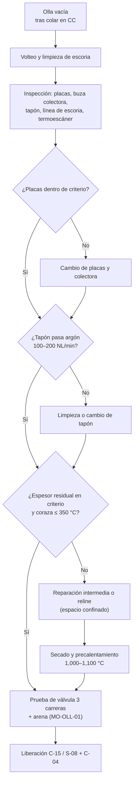

# MM-OLL-01 — Cambio de placas de válvula deslizante y tapón poroso; revestimiento y reparación de ollas

| Código | Versión | Estado | Área | Dueño del proceso | Elaboró | Revisión técnica | Revisión de seguridad | Aprobó | Fecha | Próxima revisión |
|---|---|---|---|---|---|---|---|---|---|---|
| MM-OLL-01 | 0.1 | Borrador para validación | Acería · taller de ollas | C-15 Especialista de Refractarios | gerente-personal-sindicalizado (Líder Academia de Mantenimiento y Confiabilidad) | experto-operativo-metalurgia | experto-seguridad-salud | Pendiente (Gerente de Acería / Director) | 2026-09-25 | 2027-09-25 |

> ⚠️ Base: FT-ACE-001 §3 (flota de 10 ollas de 150 t; MgO-C en línea de escoria; Al₂O₃-MgO-C en barril y fondo; vida 60–80 coladas; válvula de 2 o 3 placas; apertura libre ≥ 98 %; precalentamiento 1,000–1,100 °C). Dimensiones de placas, fuerzas de resortes y caudales del tapón: **[Validar con OEM / Ingeniería de Mantenimiento / C-15]**. **Una olla perforada o una válvula que no cierra = derrame de 150 t de acero.**

## 1. Objetivo y alcance
Asegurar que cada olla que entra al ciclo tiene: válvula deslizante que abre y **cierra** con seguridad, tapón poroso con paso de argón, revestimiento con espesor suficiente y estructura (muñones, coraza) sana.
**Incluye:** inspección posvaciado, cambio de placas y buza colectora, cambio de buza interna y bloque de asiento, cambio y prueba del tapón poroso, reparación intermedia de línea de escoria, reline completo, secado/precalentamiento, inspección estructural de muñones.
**No incluye:** llenado de arena y preparación operativa (MO-OLL-01), traslado con grúa (MO-OLL-02, MM-GR-01).

## 2. Roles y responsabilidades
| Rol | Responsabilidad en este proceso | R/A/C/I |
|---|---|---|
| C-15 Especialista de Refractarios | Dueño; decide reparación/reline; libera olla al ciclo | A |
| S-24 Refractarista | Placas, buzas, tapón, reline, reparación intermedia | R |
| S-08 Preparador de Ollas | Inspección posvaciado, limpieza, prueba de válvula y argón | R |
| S-09 Operador de Grúa de Colada | Traslados al taller, volteo | R |
| S-19 / S-22 | Mecanismo de la válvula, cilindro, volteador, precalentadores | R |
| S-23 Soldador | Reparación de coraza y soportes (no en muñones sin procedimiento aprobado) | R |
| Inspector END nivel II | Partículas magnéticas / ultrasonido de muñones | R |
| C-04 Jefe de Turno | Programa de ollas en ciclo | I |
| C-16 Especialista de Seguridad | Espacio confinado, polvo, calor | C |

## 3. Descripción del proceso
Después de cada colada la olla pasa por la estación de preparación: se inspecciona la válvula y el refractario, se decide si sigue en ciclo, si cambia placas/tapón, o si va a reparación. Con el termoescáner de coraza y la medición de espesor se decide la reparación intermedia o el reline.

## 4. Equipos y maquinaria
| Equipo / componente | Función | Especificación clave | Condición para operar (verificación) |
|---|---|---|---|
| Bloque de asiento y buza interna | Canal de salida del acero | Alta alúmina / MgO | Sin grietas pasantes; buza interna cambiada según vida |
| Placa fija y placa móvil (2 o 3 placas) | Abrir, regular y cerrar el chorro | Barreno nominal según diseño (típ. Ø 60–75 mm [Validar]) | Dentro de criterio de desgaste (§5) |
| Buza colectora | Guiar el chorro al tubo protector | Unida a la placa móvil | Sin erosión > 5 mm en asiento del tubo protector |
| Mecanismo de la válvula (marco, resortes, cilindro) | Apretar placas y deslizar | Fuerza de resortes según OEM | Carrera completa, sin trabarse |
| Tapón poroso (y bloque de tapón) | Inyectar argón | Cambiable desde afuera [Validar] | Caudal 100–200 NL/min a presión de prueba; residual ≥ 150 mm |
| Revestimiento de trabajo | Contener acero y escoria | MgO-C (escoria), Al₂O₃-MgO-C (barril/fondo) | Residual: escoria ≥ 50 mm, barril ≥ 40 mm |
| Revestimiento de seguridad | Respaldo | Ladrillo de alta alúmina [Validar] | Sin exposición |
| Coraza y muñones | Soporte e izaje | Acero estructural | Sin grietas; muñones con END vigente |
| Termoescáner de coraza | Detectar zonas delgadas | En estación de preparación | Calibrado |
| Precalentadores (GN + aire) | Secar y precalentar | 1,000–1,100 °C cara caliente | Termopar y control de flama operando |
| Máquina de demolición / volteador | Reline | Hidráulico | Guardas y paro de emergencia |

## 5. Especificaciones, tolerancias y frecuencias
| Especificación | Unidad | Objetivo | Rango / tolerancia | Límite (alarma / rechazo) | Acción si está fuera | Instrumento | Frecuencia |
|---|---|---|---|---|---|---|---|
| Crecimiento del barreno de placas | mm sobre nominal | ≤ 3 | ≤ 6 | **> 10 mm: cambiar** | Cambio de placas | Calibrador / plantilla pasa-no pasa | Cada colada |
| Surco de erosión en la carrera (cara deslizante) | mm prof. | 0 | ≤ 2 | **> 3 mm o llega al 50 % de la longitud de sello** | Cambio de placas | Profundímetro | Cada colada |
| Longitud de sello remanente (placa cerrada) | mm | ≥ 50 | ≥ 40 | **< 35 mm [Validar]** | Cambio de placas | Regla | Cada colada |
| Grietas en placas | — | Ninguna | Capilares no pasantes | **Grieta radial hasta el borde o pasante** | Cambio | Visual | Cada colada |
| Vida de placas | coladas | 2–5 [Validar] (coherente con MO-OLL-01) | — | Criterio por desgaste | — | Registro | Por juego |
| Junta de mortero placa–buza | mm | ≤ 1 | — | > 1.5 | Rehacer | Lainas | Cada cambio |
| Carrera de la válvula | mm | Carrera OEM | 100 % | Traba o carrera incompleta | 🛑 No liberar | Regla / HMI | Cada cambio y cada olla |
| Fuerza de apriete de resortes | kN | OEM | ±10 % | < 90 % | Cambiar resortes | Dispositivo de medición OEM | Cada cambio de placas |
| Presión del cilindro para deslizar | bar | OEM | ≤ 1.2 × valor normal | > 1.5 × | Revisar placas, lubricación, mecanismo | Manómetro | Cada prueba |
| Caudal del tapón poroso (prueba en frío/caliente) | NL/min a presión de prueba OEM | 150–200 [Supuesto] | 100–200 (MO-OLL-01) | < 100 o sin burbujeo | Limpieza (lanceo) o cambio | Rotámetro / FT + manómetro | Cada colada (en LF) · cada cambio |
| Longitud residual del tapón | mm | ≥ 200 | ≥ 150 | Indicador de desgaste visible | Cambio | Regla / indicador | Cada 5 coladas |
| Espesor residual del revestimiento | mm | ≥ 80 | Línea de escoria ≥ 50; barril ≥ 40 [Supuesto, igual que MO-OLL-01] | **Línea de escoria < 50 o barril < 40: retirar de ciclo** | Reparación / reline | Láser o medición manual | Semanal por olla |
| Temperatura de coraza (termoescáner) | °C | ≤ 300 | ≤ 350 | Alarma > 350; **🛑 > 400** | Retirar de ciclo | Termoescáner | Cada colada |
| Vida de campaña | coladas | 60–80 | — | Criterio por espesor | Reline | Registro | Por olla |
| Precalentamiento antes de recibir acero | °C | 1,050 | 1,000–1,100 | < 1,000 °C | Seguir precalentando; olla fría > 4 h: ≥ 8 h | Termopar / pirómetro | Cada olla |
| END de muñones | — | Sin indicaciones | — | Cualquier grieta = 🛑 retirar olla | Evaluación de ingeniería | Partículas magnéticas + UT | Anual y tras golpe |
| Desgaste de diámetro de muñón | % | 0 | ≤ 2 | > 5 [Validar] | Retirar | Calibrador | Anual |

### 5.1 Rutina preventiva y predictiva
| Tarea | Frecuencia | Rol | Duración | Ventana |
|---|---|---|---|---|
| Inspección posvaciado de placas, colectora, línea de escoria | Cada colada | S-08 | 10 min | Estación de preparación |
| Termoescáner de coraza | Cada colada | Automático / S-08 | 2 min | Tras vaciado |
| Cambio de placas y colectora | 2–5 coladas o por condición | S-24 / S-08 | 30–45 min | Olla fuera de ciclo en caliente |
| Prueba de caudal del tapón | Cada colada | S-06 (LF) / S-08 | 2 min | LF / preparación |
| Cambio de tapón poroso | Por condición | S-24 | 45–60 min | Olla en caliente fuera de ciclo |
| Medición de espesores | Semanal por olla | S-24 / C-15 | 20 min | Taller |
| Reparación intermedia de línea de escoria | ≈ 30–40 coladas [Validar] | S-24 | 1–2 turnos + precalentamiento | Taller de ollas |
| Reline completo | 60–80 coladas | S-24 + contratista REPSE | 2–3 días + secado | Taller de ollas |
| Mantenimiento del mecanismo (resortes, cilindro, marco) | Cada reline o 500 aperturas | S-19 / S-22 | 2 h | Taller |
| END de muñones y orejas | Anual / tras golpe | Inspector nivel II | 2 h | Olla fría (reline) |

## 6. Seguridad
### 6.1 Peligros y controles críticos
| Peligro | Consecuencia | Control crítico | Verificación |
|---|---|---|---|
| Válvula que no cierra | Derrame de acero en torreta o traslado | Criterios de rechazo de placas y prueba de 3 carreras | Firma de S-08 en tarjeta de olla |
| Perforación de olla | Derrame, explosión, fatalidad | Espesor ≥ 50 mm, termoescáner, límite de vida | Registro por olla |
| Falla de muñón | Caída de olla llena | END anual y tras golpe | Certificado END vigente |
| Agua o humedad en refractario nuevo | Explosión de vapor | Curva de secado completa antes del primer acero | Registro de precalentador |
| Entrada a la olla (reline) | Calor, CO del precalentador, polvo, caída de ladrillo | Espacio confinado NOM-033; precalentador bloqueado; gases; T aire ≤ 45 °C [Validar] | Permiso y medición |
| Olla en volteador | Aplastamiento | Volteador bloqueado mecánicamente | Perno colocado |
| Gas natural del precalentador | Explosión | LOTO de GN + purga, prueba de hermeticidad | Detector LEL 0 % |
| Argón en la olla | Asfixia | Manguera de argón desconectada y válvula bloqueada | O₂ ≥ 19.5 % |

### 6.2 EPP obligatorio
Ropa aluminizada en olla caliente, careta con visor dorado, guantes aluminizados, casco, botas metatarsales, respirador P100 (demolición), protección auditiva; entrada a olla: arnés con línea de rescate, detector de 4 gases.

### 6.3 Permisos, bloqueos y zonas de exclusión
**Permisos:** espacio confinado (reline), trabajo en caliente, izaje, altura (bordes de olla > 1.8 m).
**Puntos de aislamiento:** E-GN precalentador (válvula manual + candado + purga); E-Ar argón (válvula y desconexión de acople rápido); E-H cilindro de la válvula (manguera desconectada; cilindro retirado); E-H2 volteador/máquina de demolición (CCM + descarga); E-M olla sobre su base o en volteador con perno mecánico. **Prueba de energía cero:** intento de encendido del precalentador y de movimiento del volteador rechazados; O₂ 19.5–23.5 %, CO < 25 ppm, LEL 0 %.
**Zona de exclusión:** bajo la olla izada; zona de caída de ladrillo durante la demolición.

## 7. Calidad
| Variable crítica de calidad | Especificación | Método / frecuencia | Registro | Defecto si falla |
|---|---|---|---|---|
| 🔎 Apertura libre de la olla | ≥ 98 % | Cada colada en CC | Registro de colada | Lanceo con O₂ → reoxidación, N, clogging de SEN |
| 🔎 Paso de argón por tapón | ≥ caudal mínimo | Cada colada en LF | Registro LF | Mala desulfuración (S > 0.010 %) y flotación de inclusiones |
| 🔎 Sello de la colectora con el tubo protector | Asiento sin erosión > 5 mm | Cada cambio | Tarjeta de olla | Aspiración de aire → reoxidación, Al₂O₃, N |
| 🔎 Estado del revestimiento | Sin desprendimientos | Visual | Tarjeta | Inclusiones exógenas (macro-inclusiones) |
| Temperatura de precalentamiento | 1,000–1,100 °C | Cada olla | Registro | Pérdida de temperatura, congelamiento de buza |

## 8. Procedimiento paso a paso (cambio de placas + tapón + liberación)
| # | Paso | Cómo hacerlo (detalle y medición) | Criterio de aceptación | ★ | Rol |
|---|---|---|---|---|---|
| 1 | Coloca la olla en la estación | Olla vacía, limpia de escoria, sobre base estable o volteador con perno | Olla estable | ★ | S-09, S-08 |
| 2 | Aísla energías | Argón desconectado; cilindro de la válvula retirado; precalentador bloqueado | Candados/tarjetas | ★ | S-08 |
| 3 | Abre el marco | Libera resortes con la herramienta OEM (nunca a golpes) | Resortes descargados | ★ | S-24 |
| 4 | Retira placas y colectora | Limpia asientos del marco; revisa buza interna con lámpara | Asientos limpios, buza interna sin grieta | | S-24 |
| 5 | Inspecciona y mide placas retiradas | Barreno, surco, grietas (tabla §5) | Registro de desgaste | 🔎 | S-24 |
| 6 | Coloca placas nuevas | Verifica lote, planitud visual, mortero ≤ 1 mm; orientación correcta | Placas asentadas | ★ | S-24 |
| 7 | Cierra el marco | Aprieta resortes a la fuerza OEM; verifica con dispositivo | Fuerza ±10 % | ★ | S-24 |
| 8 | Prueba de carrera | Conecta cilindro; abre/cierra 3 veces; presión ≤ 1.2 × normal | Carrera completa, cierre total | ★ | S-08 |
| 9 | Revisa el tapón | Conecta argón; prueba caudal a la presión de prueba OEM | 100–200 NL/min | 🔎 | S-08 |
| 10 | Cambia el tapón (si aplica) | Retira desde afuera con extractor; limpia asiento; coloca nuevo con mortero; prueba caudal | Caudal ≥ mínimo, sin fuga en asiento | ★ | S-24 |
| 11 | Revisa espesor y termoescáner | Registro de la última colada; medición si toca | Escoria ≥ 50 mm, barril ≥ 40 mm; coraza ≤ 350 °C | ★ | S-08, C-15 |
| 12 | Precalienta | 1,000–1,100 °C (olla fría > 4 h: ≥ 8 h) | Temperatura alcanzada | ★ | S-08 |
| 13 | Libera | Tarjeta de olla firmada (placas, tapón, espesor, temperatura) por S-08/C-15 y recibida por C-04 | Firmada | ★ | S-08, C-15, C-04 |

**Reline completo (resumen):** enfriamiento forzado ≥ 24 h → permiso de espacio confinado → demolición mecánica → inspección de seguridad y coraza → END de muñones → colocación de fondo, barril y línea de escoria (juntas ≤ 1.5 mm [Validar]) → bloque de asiento y bloque de tapón con masa apisonada → curva de secado del proveedor → precalentamiento → liberación por C-15.

**Checklist de liberación (Mantenimiento/Refractarios + Operación):** [ ] placas nuevas o dentro de criterio · [ ] prueba de 3 carreras OK · [ ] tapón 100–200 NL/min a presión de prueba · [ ] espesor escoria ≥ 50 mm / barril ≥ 40 mm y coraza ≤ 350 °C · [ ] END de muñones vigente · [ ] precalentada 1,000–1,100 °C · Firma C-15/S-08: ____ Firma C-04: ____ Fecha/hora: ____

## 9. Condiciones anormales y respuesta
| Síntoma / alarma | Causa probable | Acción inmediata | A quién avisar |
|---|---|---|---|
| Válvula no cierra en CC | Placa rota, infiltración de acero | Emergencia: desviar a olla de emergencia/fosa; evacuar plataforma | C-06, C-04 |
| Fuga de acero entre placas | Resortes flojos, placa agrietada | Cerrar si es posible; retirar olla | C-06, C-15 |
| Coraza > 400 °C | Revestimiento delgado | 🛑 Retirar de ciclo (vaciar si está llena) | C-04, C-15 |
| Tapón sin paso de argón | Tapón infiltrado | Lanceo desde adentro (olla vacía y caliente) o cambio | C-07, C-15 |
| Olla no alcanza 1,000 °C | Quemador, GN, termopar | Revisar precalentador; no enviar | S-19, C-04 |
| Indicación en END de muñón | Grieta por fatiga | 🛑 Olla fuera de servicio hasta evaluación de ingeniería | C-10, C-11 |

## 10. Registros
Tarjeta de vida de cada olla (coladas, placas, tapones, reparaciones, espesores, termoescáner) · desgaste de placas por juego · pruebas de argón · curvas de secado/precalentamiento · certificados END de muñones · permisos · checklist de liberación.

## 11. Competencia requerida y certificación
| Rol | Nivel requerido (1–4) | Formación teórica (h) | OJT supervisado (h / eventos) | Evaluación (pasos ★) | Vigencia |
|---|---|---|---|---|---|
| S-24 Refractarista | 3 | 24 (válvula deslizante, tapón, reline, secado) | 40 h / 10 cambios de placas + 1 reline | Pasos 3, 6, 7, 10, 12 | 24 meses |
| S-08 Preparador de Ollas | 3 | 16 (criterios de rechazo, prueba de válvula) | 40 h / 20 ollas | Pasos 1, 2, 8, 11, 12, 13 | 24 meses |
| Personal de reline | 3 | NOM-033 (8) + NOM-015 | Simulacro de rescate | Permiso y gases | 12 meses |
| Inspector END | Nivel II (ASNT/ISO 9712) | Externo | — | Reporte | Según certificación |

**Normas:** NOM-033-STPS, NOM-015-STPS, NOM-010-STPS, NOM-006-STPS (izaje de ollas), NOM-004-STPS, NOM-017-STPS. Verificar con Jurídico Laboral / SSO.
**Verificación ★:** ¿midió las placas contra criterio y las rechazó cuando tocaba? · ¿fuerza de resortes verificada? · ¿3 carreras con cierre total? · ¿espesor/termoescáner revisados? · ¿olla precalentada?

## 12. Referencias
FT-ACE-001 §3 · MO-OLL-01, MO-OLL-02, MO-LF-01 · MM-GR-01 · MS-ACE-01, -03, -05, -06 · Manual OEM de la válvula deslizante [por referenciar] · Hojas técnicas de refractario y curvas de secado [por referenciar].

## 13. Control de cambios
| Versión | Fecha | Cambio | Autor |
|---|---|---|---|
| 0.1 | 2026-09-25 | Emisión inicial para validación | gerente-personal-sindicalizado |
