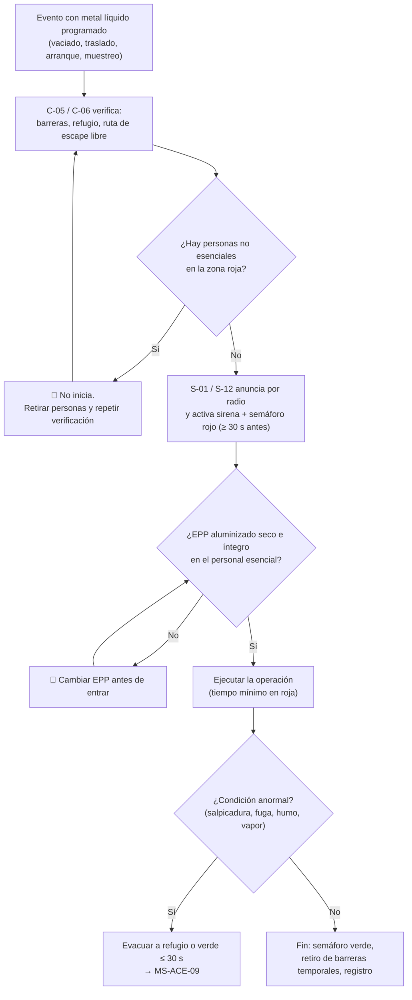

# MS-ACE-01 — Trabajo con metal líquido: zonas de exclusión, EPP aluminizado y distancias

| Código | Versión | Estado | Área | Dueño del proceso | Elaboró | Revisión técnica | Revisión de seguridad | Aprobó | Fecha | Próxima revisión |
|---|---|---|---|---|---|---|---|---|---|---|
| MS-ACE-01 | 0.1 | Borrador para validación | Acería (EAF, LF, ollas, CC1, CC2, patio) | C-16 Especialista de Seguridad e Higiene de Acería | experto-seguridad-salud | experto-operativo-metalurgia | experto-seguridad-salud | Pendiente (Gerente de Acería / Director) | 2026-09-25 | 2027-09-25 |

> ⚠️ **Mensaje clave.** El acero líquido está a ≈ 1,630 °C y una olla llena pesa más de 200 t. **Nadie entra a la zona roja sin autorización, sin EPP aluminizado seco y sin una ruta de escape libre.** Las distancias de este manual son valores de referencia **[Supuesto — Validar con C-16 / SSO mediante un estudio de la nave]**; los datos de proceso salen de `../00-ficha-tecnica-acería.md` (FT-ACE-001).

## 1. Objetivo y alcance

**Objetivo:** evitar quemaduras, fatalidades y lesiones por contacto, salpicadura, derrame o proyección de acero y escoria líquidos, mediante zonas de exclusión, control de acceso y EPP aluminizado.

**Aplica a:** vaciado por EBT del EAF-1/EAF-2; medición de temperatura, oxígeno y muestreo (EAF y LF); desescoriado y manejo de ollas de escoria; traslado de ollas llenas (carro y grúa de colada); torreta, distribuidor y arranque de CC1/CC2; carga de canasta sobre talón líquido. Aplica a todo el personal propio, contratistas y visitantes.

**No cubre:** bloqueo de energías (MS-ACE-02), explosiones agua–metal (MS-ACE-03), izaje (MS-ACE-04) y respuesta a emergencias (MS-ACE-09); este manual los referencia.

## 2. Roles y responsabilidades

| Rol | Responsabilidad en este proceso | R/A/C/I |
|---|---|---|
| C-16 Especialista de Seguridad e Higiene de Acería | Dueño del estándar; define y revisa zonas y distancias; audita (VCC) | A |
| C-04 Jefe de Turno de Acería | Hace cumplir las zonas en su turno; autoriza excepciones por escrito | R |
| C-05 Supervisor de Hornos / C-06 Supervisor de Colada Continua | Verifican barreras, EPP y personal autorizado antes de cada vaciado o arranque | R |
| S-01 Operador de Púlpito de Horno | Anuncia el vaciado, activa sirena y semáforo; no vacía si hay personas en roja | R |
| S-02 / S-03 Operador de Horno de Piso / Ayudante de Horno | Muestreo, temperatura y adiciones dentro de la zona roja, con EPP completo | R |
| S-06 / S-07 Operador y Ayudante de Horno Olla | Muestreo y alambre en LF respetando la zona roja del LF | R |
| S-09 Operador de Grúa de Colada | Traslada ollas solo por la ruta marcada; detiene si hay personas bajo la ruta | R |
| S-10 Operador de Manejo de Escoria | Maneja ollas de escoria respetando su zona roja | R |
| S-12 / S-13 / S-14 Púlpito, Plataforma y Ayudante de Colada | Únicos autorizados en la zona roja de CC durante el arranque | R |
| S-11 Muestrero | Entra a roja solo acompañado y autorizado | R |
| C-07 / C-08 Ingenieros de Proceso | Confirman que los parámetros de proceso no generan riesgo adicional (p. ej., francobordo) | C |
| Todo el personal, contratistas y visitantes | Respetan las zonas; ejercen el derecho a detener el trabajo | I |

## 3. Descripción del proceso

La nave se divide en tres zonas que **cambian según la operación** (Figura 1):

- **Zona ROJA:** alcance posible de una salpicadura, un derrame o la caída de una olla. Solo entra el personal esencial nombrado en la tabla 5, con EPP aluminizado y ruta de escape libre.
- **Zona AMARILLA:** personal autorizado del área, detrás de barreras físicas, con EPP completo de nave.
- **Zona VERDE:** tránsito normal con EPP básico de nave.

## 4. Equipos y maquinaria

| Equipo / componente | Función | Especificación clave | Condición para operar (verificación) |
|---|---|---|---|
| Barreras físicas (cadenas, barandales abatibles, conos rojos) | Delimitan la zona roja | Visibles a 25 m; cierre en cada acceso | Colocadas antes del evento; C-05/C-06 verifica visualmente |
| Semáforo y sirena de vaciado/arranque | Avisan el inicio del evento | Sirena audible sobre el ruido de nave (≥ 10 dB(A) sobre el fondo) [Supuesto] | Prueba al inicio de turno; si falla, 🛑 no hay vaciado |
| Púlpitos (P) | Refugio del operador y mando del evento | Vidrio resistente al calor, puerta hacia ruta segura, aire presurizado | Puerta libre; vidrio sin fisuras; presurización OK |
| Refugios R1–R4 | Protección ante salpicadura o derrame | A ≤ 30 s a pie desde cualquier punto de roja | Libres de materiales; señalizados; iluminados |
| Fosa de emergencia seca | Recibe el acero de una olla perforada | Seca, sin agua estancada, capacidad ≥ 1 olla [Validar con Ingeniería] | Inspección por turno: seca y libre |
| CCTV del vaciado y de la torreta | Vigilancia sin exponer personas | Vista del EBT, del carro de olla y de la torreta | Imagen en púlpito al inicio del turno |
| Arena seca / material de contención | Contener derrames pequeños | Almacenada bajo techo, en contenedor cerrado | Seca (sin grumos); nivel ≥ 50 % |
| EPP aluminizado (ver MS-ACE-08) | Protege contra calor radiante y salpicadura | ISO 11612 (A1, B, C, D3, E3) [Verificar con proveedor] | Seco, sin roturas ni grasa |
| Lanzas de muestreo y temperatura | Medición sin acercarse al baño | Longitud que permita ≥ 1.5 m de la puerta [Supuesto] | Secas y precalentadas (MS-ACE-03) |

## 5. Parámetros de operación

**Distancias de exclusión por operación** (medidas desde la fuente de metal líquido; [Supuesto — Validar con C-16 / SSO]):

| Operación | Zona ROJA | Zona AMARILLA | Personal permitido en ROJA | Dónde se verifica |
|---|---|---|---|---|
| Vaciado por EBT (150 t) | ≤ 10 m de la olla y del EBT; foso de vaciado | 10–25 m | Nadie a pie; mando desde púlpito. S-02 solo para adiciones desde la posición protegida | Marcas de piso + CCTV |
| Carga con canasta sobre talón líquido (20–30 t) | ≤ 15 m del horno; plataforma del horno despejada | 15–30 m | Nadie; señalero en refugio | Visual C-05 + CCTV |
| Muestreo / temperatura en EAF y LF | ≤ 5 m de la puerta o del agujero de muestreo | 5–15 m | Solo el ejecutor (S-02, S-06, S-11) y su acompañante, ≥ 1.5 m de la puerta | Visual C-05 |
| Traslado de olla llena con grúa de colada | Proyección de la ruta ± 5 m | ± 5–15 m | Nadie bajo ni junto a la ruta | Ruta pintada + CCTV |
| Traslado de olla en carro (EAF → LF) | Vía del carro ± 5 m | ± 5–15 m | Nadie; cruce solo por paso autorizado con semáforo | Semáforo de vía |
| Arranque de colada CC1/CC2 | ≤ 10 m de molde, distribuidor y torreta; todo lo que está bajo la máquina | 10–20 m | S-12, S-13, S-14 y C-06 | Lista de arranque |
| Colada estable CC1/CC2 | Plataforma de molde (≤ 3 m del molde) | Plataforma de colada | S-13, S-14 | Visual C-06 |
| Vaciado de olla de escoria | ≤ 15 m del punto de volteo | 15–30 m | Nadie a pie | Visual S-10 |

**Otros límites:**

| Parámetro | Unidad | Objetivo | Rango normal | Alarma / límite | Acción si está fuera de rango | Dónde se mide |
|---|---|---|---|---|---|---|
| Tiempo de aviso antes de vaciado/arranque | s | 60 | ≥ 30 | < 30 s | 🛑 No iniciar; repetir aviso | Púlpito |
| Tiempo para llegar a refugio o verde | s | ≤ 20 | ≤ 30 | > 30 s | Reubicar refugio o cambiar método; avisar a C-16 | Prueba cronometrada en simulacro |
| Temperatura de vaciado | °C | 1,630 | ± 15 | > 1,660 | Avisar a C-07; mayor riesgo de perforación de olla | Sonda (EAF) |
| Precalentamiento de olla (cara caliente) | °C | 1,000–1,100 | ≥ 1,000 | < 1,000 °C | 🛑 No recibe acero (humedad, choque térmico) | Pirómetro de la estación |
| Francobordo de la olla (del nivel de escoria al borde) | mm | ≥ 400 [Supuesto] | ≥ 300 | < 300 mm | No trasladar a velocidad normal; C-04 decide | Visual + pesaje |
| Permanencia continua en zona roja por intervención | min | ≤ 2 | ≤ 2 | > 2 min | Salir, recuperar, relevo (ver MS-ACE-08) | Supervisor |
| Estado del EPP aluminizado | — | Seco e íntegro | — | Húmedo, roto o con grasa | 🛑 No entra a roja | Inspección previa |

## 6. Seguridad

### 6.1 Peligros y controles críticos

| Peligro | Consecuencia | Control crítico | Verificación |
|---|---|---|---|
| Salpicadura o proyección durante el vaciado | Quemadura grave, fatalidad | Zona roja sin personas; mando remoto desde púlpito | CCTV + lista de vaciado firmada |
| Perforación de olla (fuga por coraza o válvula) | Derrame, incendio, fatalidad | Ruta de olla sin personas; fosa de emergencia seca; control de refractario (vida 60–80 coladas) | Registro de vida de olla; inspección visual de coraza |
| Caída o volteo de olla | Derrame masivo | Grúa de colada con doble freno (MS-ACE-04); nadie bajo la carga | Prueba de frenos por turno |
| Contacto de agua con metal (vapor explosivo) | Explosión | MS-ACE-03 | Ver MS-ACE-03 |
| Calor radiante | Quemadura, golpe de calor | EPP aluminizado; tiempo limitado; relevo | MS-ACE-08 |
| Salpicadura en arranque o breakout de CC | Quemadura, fatalidad | Zona roja en arranque; nadie bajo la máquina | Lista de arranque |
| Escoria líquida en olla de escoria | Explosión si hay humedad; quemadura | Olla de escoria seca; zona roja en volteo | Inspección por turno |

### 6.2 EPP obligatorio

Ver la Figura 1 de MS-ACE-08 (`../../img/ms-epp-acería.svg`). En **zona roja**: casco con careta de visor dorado, capucha aluminizada, chaquetón aluminizado, ropa FR o 100 % algodón, guantes aluminizados, polainas, botas metatarsales de liberación rápida, protección auditiva y detector personal de CO/O₂. **Prohibida** la ropa sintética (se funde sobre la piel).

### 6.3 Permisos, bloqueos y zonas de exclusión

- La zona roja de cada operación es **automática**: se activa con la sirena y el semáforo. No requiere permiso adicional para el personal esencial nombrado en la tabla 5.
- Cualquier otra persona (mantenimiento, contratista, visitante) necesita **autorización escrita de C-04** y acompañamiento de un operador certificado.
- Trabajos de mantenimiento en zona roja fuera de operación: con **permiso de trabajo y LOTO** (MS-ACE-02).
- **Derecho a detener el trabajo:** cualquier trabajador detiene un vaciado, traslado o arranque si ve a una persona en roja. Nadie es sancionado por detener.

## 7. Calidad

| Variable crítica de calidad | Especificación | Método / frecuencia | Registro | Defecto si falla |
|---|---|---|---|---|
| Temperatura de vaciado | 1,630 °C ± 15 °C | Sonda antes de cada vaciado | Hoja de colada | Olla fría (congelamiento) o sobrecalentamiento (erosión refractaria, riesgo de perforación) |
| Escoria arrastrada al vaciar (carryover) | Mínima; corte del EBT a tiempo | Visual + CCTV cada colada | Hoja de colada | Reversión de P, más escoria en olla (menos francobordo) |
| Muestra representativa | Muestra sin escoria ni sopladuras | Por colada (EAF, LF) | LIMS | Química errónea; ajustes mal hechos |
| Integridad del refractario de olla | Vida 60–80 coladas; sin puntos calientes | Termografía/visual cada ciclo [Supuesto] | Registro de ollas (C-15) | Perforación de olla |

## 8. Procedimiento paso a paso

| # | Paso | Cómo hacerlo (detalle y medición) | Criterio de aceptación | ★ | Rol |
|---|---|---|---|---|---|
| 1 | Revisa las zonas al inicio del turno | Recorre la nave con la Figura 1: marcas de piso visibles, barreras completas, refugios R1–R4 libres, fosa de emergencia seca | Lista de inicio de turno firmada | ★ | C-05 / C-06 |
| 2 | Prueba sirena, semáforo y CCTV | Activa sirena y semáforo 5 s; confirma imagen del EBT y de la torreta en púlpito | Sirena audible en toda la zona amarilla | ★ | S-01 / S-12 |
| 3 | Inspecciona tu EPP aluminizado | Revisa costuras, capa aluminizada, visor y cierres; confirma que está **seco** | Sin roturas, sin humedad, sin grasa | ★ | Personal esencial |
| 4 | Confirma el personal esencial | Nombra por radio quién estará en roja (máximo el de la tabla 5) | Lista de nombres registrada | | C-05 / C-06 |
| 5 | Coloca barreras temporales | Cierra accesos con cadena y letrero "ZONA ROJA — METAL LÍQUIDO" | Todos los accesos cerrados | ★ | S-03 / S-14 |
| 6 | Verifica que no hay personas en roja | Visual directa + CCTV. Si alguien está: 🛑 no inicies | Zona roja vacía (salvo esenciales) | ★ | S-01 / S-12 / S-09 |
| 7 | Anuncia y espera | Radio: "Vaciado (o arranque, o traslado) EAF-1 en 60 segundos". Activa sirena y semáforo rojo; espera ≥ 30 s | Aviso ≥ 30 s | ★ | S-01 / S-12 |
| 8 | Ejecuta la operación desde la posición protegida | Púlpito o posición marcada; mantén la ruta de escape a la espalda y libre | Operador protegido | ★ | S-01, S-02, S-09, S-12, S-13 |
| 9 | Muestreo o temperatura | Colócate de lado a la puerta, a ≥ 1.5 m; lanza seca y precalentada; máximo 2 min en roja | Medición sin exposición prolongada | ★ | S-02, S-06, S-11 |
| 10 | Traslado de olla | Solo por la ruta pintada, a la altura mínima que libre obstáculos con ≥ 1 m de holgura (MS-ACE-04); detén si alguien cruza | Traslado sin personas bajo la ruta | ★ | S-09 |
| 11 | Arranque de CC | Solo S-12, S-13, S-14 y C-06 en roja; nadie bajo la máquina hasta que la hebra salga de los extractores y C-06 lo libere | Arranque sin personal no esencial | ★ | C-06 |
| 12 | Vigila condiciones anormales | Punto rojo en coraza, humo en válvula, vapor, chispeo anormal, ruido de ebullición → sección 9 | Respuesta ≤ 30 s | ★ | Todos |
| 13 | Cierra el evento | Semáforo a verde, retira barreras temporales, registra hora y anomalías | Registro completo | | S-01 / S-12 |

## 9. Condiciones anormales y respuesta

| Síntoma / alarma | Causa probable | Acción inmediata | A quién avisar |
|---|---|---|---|
| Persona no autorizada en zona roja | Barrera abierta, desconocimiento | 🛑 Detén o no inicies; retírala; repite verificación | C-05 / C-06 |
| Punto rojo o humo en la coraza de la olla | Desgaste refractario, perforación inminente | Evacúa ruta y zona ≥ 25 m; grúa lleva la olla a la fosa (MS-ACE-09) | C-04, C-15 |
| Fuga por la válvula deslizante | Placas dañadas, arena de sello | No te acerques; olla a la fosa o a posición segura | C-04, S-08 |
| Ebullición violenta o salpicadura en el vaciado | Humedad, reacción de escoria (FeO + C) | Detén el vaciado si es posible desde el púlpito; evacúa | C-05, C-07 |
| Sirena o semáforo sin funcionar | Falla eléctrica | 🛑 No vacíes ni arranques; aviso de viva voz + radio solo con autorización de C-04 | C-04, C-12 |
| EPP húmedo o dañado | Lluvia, sudor, desgaste | 🛑 No entres a roja; cámbialo | C-05 / C-06 |
| Refugio bloqueado | Material almacenado | Despeja antes del evento | C-04 |

## 10. Registros

- Lista de inicio de turno de zonas y refugios (firma C-05/C-06).
- Hoja de colada con hora de aviso, personal en roja y anomalías.
- Registro de inspección de EPP aluminizado (por turno).
- Autorizaciones escritas de ingreso a roja (C-04).
- Resultados de verificación de controles críticos (VCC) de C-16, mensual.

## 11. Competencia requerida y certificación

| Rol | Nivel requerido (1–4) | Formación teórica (h) | OJT supervisado (h / eventos) | Evaluación (pasos ★) | Vigencia |
|---|---|---|---|---|---|
| S-02, S-03, S-06, S-07, S-11 | 3 | 8 (CRS-08 metal fundido) | 40 h + 20 muestreos | Pasos 3, 6, 9, 12 | 24 meses (TD-P07) |
| S-01, S-12 | 4 | 8 | 40 h + 20 vaciados/arranques | Pasos 2, 6, 7, 8, 12 | 24 meses |
| S-09 | 4 | 8 + CRS-05 | 80 h + 30 traslados | Pasos 6, 10, 12 | 12 meses (grúa, NOM-006) |
| S-13, S-14 | 3 | 8 | 40 h + 10 arranques | Pasos 3, 8, 11, 12 | 24 meses |
| C-04, C-05, C-06 | 4 | 12 | 20 eventos supervisados | Pasos 1, 4, 6, 11 + simulacro | 24 meses |
| Contratistas y visitantes | 1 | 2 (inducción de Acería, TD-P08) | — | Reconocer zonas y sirena | 12 meses |

**Lista corta de verificación de pasos ★ (evaluador certificado TD-P07):**
1. ¿Inspecciona el EPP aluminizado y rechaza el húmedo o dañado?
2. ¿Verifica que la zona roja está vacía antes de iniciar (visual + CCTV)?
3. ¿Anuncia y espera ≥ 30 s con sirena y semáforo?
4. ¿Trabaja desde la posición protegida con la ruta de escape libre?
5. ¿Limita la permanencia en roja a ≤ 2 min por intervención?
6. ¿Reconoce las señales de perforación de olla y reacciona en ≤ 30 s?

## 12. Referencias

- NOM-017-STPS-2008 (EPP), NOM-015-STPS-2001 (condiciones térmicas), NOM-006-STPS-2014 (manejo de materiales), NOM-026-STPS-2008 (señales y colores), NOM-002-STPS-2010 (incendios), NOM-019-STPS-2011 y NOM-030-STPS-2009 [Verificar con la NOM vigente / SSO].
- FT-ACE-001 Ficha técnica de la Acería; CAT-ACE-001 Catálogo de procesos y roles.
- MS-ACE-02, 03, 04, 08 y 09; estándar corporativo CRS-08 Metal fundido y manejo de ollas.
- Manuales OEM del EAF, del carro de olla y de las máquinas de colada [por referenciar].
- worldsteel, *Safety and health principles* (referencia sectorial).

## 13. Control de cambios

| Versión | Fecha | Cambio | Autor |
|---|---|---|---|
| 0.1 | 2026-09-25 | Creación del borrador para validación | experto-seguridad-salud (con criterio técnico de experto-operativo-metalurgia) |
