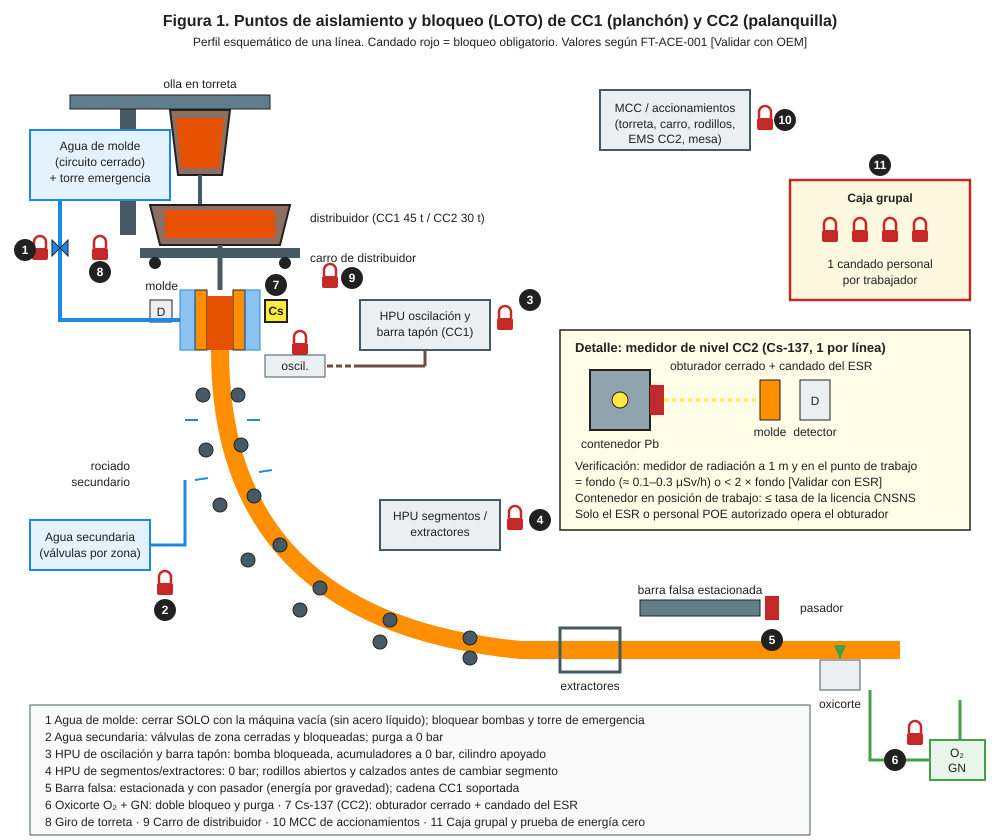
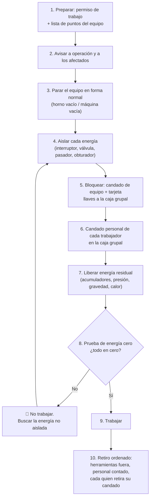

# MS-ACE-02 — Aislamiento y bloqueo (LOTO) para ingresar al EAF, al LF, a la CC y a sus equipos

| Código | Versión | Estado | Área | Dueño del proceso | Elaboró | Revisión técnica | Revisión de seguridad | Aprobó | Fecha | Próxima revisión |
|---|---|---|---|---|---|---|---|---|---|---|
| MS-ACE-02 | 0.2 | Borrador para validación | Acería (EAF, LF, ollas, CC1, CC2, grúas, patio) | C-16 Especialista de Seguridad e Higiene de Acería | experto-seguridad-salud | experto-operativo-metalurgia | experto-seguridad-salud — visto bueno con observaciones, 2026-09-25 | Pendiente (Gerente de Acería / Director) | 2026-09-25 | 2027-09-25 |

> ⚠️ **Mensaje clave.** **Un candado, una persona, una llave.** Nadie mete el cuerpo en un equipo hasta que TODAS sus energías (eléctrica, hidráulica, neumática, agua, gases, gravedad, térmica y radiación) están aisladas, bloqueadas y **probadas en cero**. Estándar corporativo **CRS-01 LOTO** (`templates/critical-task-certification-checklist.md`).

## 1. Objetivo y alcance

**Objetivo:** controlar la liberación inesperada de energía durante inspección, mantenimiento, limpieza, cambio de refractario o destrabe en los equipos de la Acería.

**Aplica a:** EAF-1/EAF-2 (transformador de 140 MVA, brazos y columnas, bóveda, basculamiento, paneles de agua, quemadores de O₂/gas natural, inyección de carbono, banda de DRI), LF-1/LF-2 (transformador de 25 MVA, argón, alimentador de alambre), ollas (válvula deslizante, tapón poroso), CC1/CC2 (agua de molde y secundaria, oscilación, segmentos y extractores, barra falsa, torreta, carro de distribuidor, oxicorte, fuente de Cs-137 de CC2), grúas y equipos del patio de chatarra.

**Excepción:** ajustes que por diseño requieren energía (p. ej., calibración con equipo energizado) solo con **método alterno aprobado por C-16 y C-12** y análisis de riesgo escrito.

## 2. Roles y responsabilidades

| Rol | Responsabilidad en este proceso | R/A/C/I |
|---|---|---|
| C-16 Especialista de Seguridad e Higiene | Dueño del estándar; audita bloqueos (VCC); aprueba métodos alternos | A |
| C-04 Jefe de Turno | Autoriza la liberación del equipo de operación a mantenimiento; custodia la caja grupal del turno | R |
| C-05 / C-06 Supervisores de operación | Entregan el equipo en condición segura (vacío, frío, estacionado) | R |
| C-11 / C-12 Supervisores de Mantenimiento | Emiten el permiso de trabajo, identifican energías con la lista de puntos | R |
| S-20 Electricista de Acería | Único que opera interruptores y seccionadores de media y alta tensión y aplica tierras (NOM-029) | R |
| S-22 Técnico Hidráulico | Descarga acumuladores y verifica 0 bar | R |
| S-19, S-21, S-23, S-24, S-25 y contratistas | Colocan su candado personal; verifican energía cero antes de tocar | R |
| S-01 / S-12 Operadores de púlpito | Hacen la prueba de arranque desde la HMI; no reenergizan sin autorización | R |
| C-16 en función de ESR (Encargado de Seguridad Radiológica, con licencia de la CNSNS) | Cierra el obturador de Cs-137, pone su candado y mide < 2 × fondo (MS-ACE-07) | R |
| S-02, S-03, S-06, S-07 (usuarios de llave cautiva) | Usan la llave cautiva solo para el acceso de rutina de la sección 6.4; nunca para intervenir el equipo | R |
| C-07 / C-08 Ingenieros de Proceso | Confirman el estado de proceso (horno vacío, máquina vacía) | C |

## 3. Descripción del proceso

El LOTO de la Acería sigue **10 pasos** (sección 8). Cada equipo tiene una **lista de puntos de aislamiento** numerada que coincide con las figuras 1 y 2 y con las etiquetas pintadas en campo.

## 4. Equipos y maquinaria

| Equipo / componente | Función | Especificación clave | Condición para operar (verificación) |
|---|---|---|---|
| Candado personal | Identifica a cada trabajador bloqueado | Rojo, llave única, foto y nombre | Uno por persona; nunca prestado |
| Candado de equipo (de departamento) | Bloquea cada punto de aislamiento | Azul/amarillo [Supuesto], llaves a la caja grupal | Numerado según la lista de puntos |
| Caja grupal de bloqueo | Guarda las llaves de los candados de equipo | Admite ≥ 20 candados personales | Custodia de C-04 o del supervisor emisor |
| Tarjeta de peligro "NO OPERAR" | Informa quién, por qué y cuándo | Nombre, fecha, teléfono/radio | Una por candado |
| Detector de tensión de AT (pértiga) | Prueba de ausencia de tensión | Clase de tensión del sistema [Validar con diagrama unifilar] | Probado antes y después (vivo–muerto–vivo) |
| Multímetro CAT III/IV | Ausencia de tensión en BT (≤ 1,000 V) | CAT III 1,000 V / CAT IV 600 V | Probado en fuente conocida |
| Juego de tierras temporales | Protege contra reenergización y tensión inducida | Calibre y clase según corriente de falla [Validar con C-12] | Inspección visual y registro |
| Manómetros de hidráulica y gases | Verificar 0 bar | Rango adecuado, calibración vigente | Etiqueta de calibración |
| Bridas ciegas / carretes | Aislamiento positivo de O₂, gas natural y argón para ingreso | Clase de presión de la línea | Numeradas y registradas |
| Calzas y pasadores mecánicos | Bloqueo de gravedad (brazos, bóveda, basculamiento, barra falsa, segmentos) | Diseño OEM [Validar con OEM] | Pintados en rojo; inspección visual |
| Detector multigás | Verificar atmósfera antes del ingreso | O₂, CO, LEL (y H₂S si aplica) | Bump test diario (MS-ACE-06) |
| Medidor de radiación | Verificar obturador cerrado de Cs-137 | Tasa de dosis en μSv/h | Calibración vigente (MS-ACE-07) |

## 5. Parámetros de operación

| Parámetro | Unidad | Objetivo | Rango normal | Alarma / límite | Acción si está fuera de rango | Dónde se mide |
|---|---|---|---|---|---|---|
| Tensión en el punto de trabajo | V | 0 | 0 | > 0 V (cualquier lectura) | 🛑 No tocar; C-12 revisa aislamiento | Detector AT / multímetro |
| Presión hidráulica (sistema y acumuladores) | bar | 0 | 0 | > 0 bar | Descargar de nuevo; revisar válvula de purga | Manómetro local |
| Presión de agua del panel o del molde aislado | bar | 0 | 0 | > 0 bar o flujo en el dren | Revisar válvula; doble bloqueo | Manómetro + dren |
| Presión de O₂ / gas natural / argón en el venteo | bar | 0 | 0 | > 0 bar | Revisar doble bloqueo y purga | Manómetro del venteo |
| Atmósfera en zona de trabajo | % / ppm | O₂ 20.9 %, CO 0 ppm, 0 % LEL | Entrada: O₂ 19.5–23.5 %; CO < 25 ppm; < 10 % LEL. Trabajo en caliente: 0 % LEL detectable (≤ 1 % de lectura del equipo) | CO ≥ 25 ppm, O₂ fuera de 19.5–23.5 % o ≥ 10 % LEL: salir · CO ≥ 200 ppm o ≥ 20 % LEL: evacuar el sector | 🛑 No ingresar / salir (MS-ACE-05, MS-ACE-06) | Detector multigás |
| Temperatura de la superficie de trabajo | °C | ≤ 40 | ≤ 50 [Supuesto] | > 50 °C | Esperar enfriamiento o EPP térmico según C-16 | Pirómetro/termómetro de contacto |
| Tasa de dosis en el molde de CC2 con obturador cerrado | μSv/h | Fondo (≈ 0.1–0.3) | < 2 × fondo [Validar con ESR] | ≥ 2 × fondo | 🛑 No trabajar; alejarse ≥ 3 m; avisar al ESR (C-16) | Medidor de radiación |
| Horno eléctrico: posición de basculamiento | ° | 0 (nivel) | 0 | ≠ 0 sin pasador | Colocar pasador antes de ingresar | Indicador HMI + visual |

## 6. Seguridad

### 6.1 Peligros y controles críticos

| Peligro | Consecuencia | Control crítico | Verificación |
|---|---|---|---|
| Reenergización del transformador del EAF/LF | Electrocución, arco eléctrico, fatalidad | Interruptor extraído y bloqueado + seccionador abierto + tierras; solo S-20 | Detector AT vivo–muerto–vivo; registro |
| Movimiento de brazos, columnas o bóveda | Aplastamiento | Acumuladores a 0 bar + calzas mecánicas | Manómetro + calza visible |
| Basculamiento del horno | Aplastamiento, caída | Pasador de basculamiento + bloqueo de la HPU | Visual + HMI a 0° |
| Agua a presión (paneles, molde) | Quemadura con vapor, golpe | Doble bloqueo, dren abierto | Manómetro 0 bar |
| O₂ / gas natural / argón | Incendio, explosión, asfixia | Doble bloqueo y purga; brida ciega si hay ingreso | Manómetro de venteo 0 bar + multigás |
| Caída de barra falsa, segmento o bóveda (gravedad) | Aplastamiento | Pasador o soporte mecánico | Visual antes del ingreso |
| Giro de torreta o avance de carro de distribuidor | Golpe, aplastamiento | Bloqueo en MCC + pasador mecánico | Prueba de arranque |
| Fuente de Cs-137 abierta | Exposición a radiación | Obturador cerrado + candado del ESR | Medición en μSv/h |
| Energía térmica (refractario caliente, escoria) | Quemaduras | Enfriamiento; medición de temperatura | ≤ 50 °C en contacto [Supuesto] |
| Agua de molde cerrada con acero en la máquina | Explosión de vapor, breakout | **Prohibido** cerrar el agua de molde con acero líquido o hebra sin solidificar | C-06 confirma máquina vacía |

### 6.2 EPP obligatorio

Básico de nave (casco, lentes, botas metatarsales, ropa FR o algodón, guantes, protección auditiva). Para maniobras eléctricas de S-20: **EPP para arco eléctrico** de la categoría del estudio de arco del tablero (NOM-029, NFPA 70E) [Validar con C-12].

### 6.3 Permisos, bloqueos y zonas de exclusión

- **Permiso de trabajo** obligatorio. Si hay ingreso: agregar permiso de espacio confinado (MS-ACE-05), de altura (MS-ACE-10) o de trabajo en caliente (NOM-027) según aplique.
- Cada punto de aislamiento está **identificado en campo** con el número de la Figura 1 o 2.
- **Cambio de turno con LOTO activo:** el trabajador entrante coloca su candado **antes** de que el saliente retire el suyo; C-04 registra la transferencia en la bitácora.
- **Retiro de un candado ajeno (persona ausente):** solo con el procedimiento de retiro forzado: C-04 + C-16 localizan a la persona (llamada y búsqueda ≥ 30 min [Supuesto]), verifican que no está en el equipo, registran y notifican a la persona antes de su regreso.

### 6.4 Llave cautiva frente a LOTO completo (criterio único de la Acería)

La **llave cautiva** (enclavamiento por llave atrapada) es un control de **acceso**, no de mantenimiento. Los manuales de operación (MO-EAF-01, MO-EAF-04, MO-EAF-08, MO-LF-01) se remiten a esta sección.

**Basta la llave cautiva** (acceso de rutina a una zona con enclavamiento) solo si se cumplen **todas** estas condiciones:

| # | Condición | Verificación |
|---|---|---|
| 1 | La zona tiene un sistema de llave cautiva validado: al retirar la llave se abre el interruptor del horno (EAF o LF) y quedan inhibidos la inclinación, el giro y la elevación de la bóveda y el movimiento de los electrodos que alcanzan esa zona [Validar con OEM / C-12] | Prueba funcional mensual (C-12) con registro; VCC de C-16 |
| 2 | La tarea es **operativa y de rutina**, y está en esta lista: inspección y llenado del EBT desde su plataforma (MO-EAF-01); adición y empalme de electrodos por el método A desde la plataforma con barandal (MO-EAF-08; el método B exige LOTO completo); inspección visual desde las plataformas de bóveda y electrodos del EAF o del LF | Tarea en la lista |
| 3 | **Una llave por persona**: cada persona que sube retira y lleva su propia llave de la caja de intercambio; si hay más personas que llaves, se aplica LOTO | Conteo de llaves = conteo de personas |
| 4 | Antes de subir, S-01 (o S-06) confirma en la HMI el interruptor abierto y los movimientos inhibidos, y un intento de mando es rechazado | Anotado en la bitácora del horno |
| 5 | No se retiran guardas; no se abre ningún circuito de agua, hidráulica o gases; nadie entra al recipiente, bajo el horno o a la fosa; nadie pone el cuerpo en un punto de atrapamiento que el enclavamiento no cubre | Observación del supervisor |

**Se requiere el LOTO completo** (sección 8, pasos 1–11, con candado personal) cuando ocurre **cualquiera** de estos casos:
- Intervención en el equipo: mantenimiento, reparación, ajuste, destrabe, cambio de componentes o limpieza dentro de mecanismos (todo trabajo de 03-mantenimiento).
- Entrada al horno, a la bóveda, bajo el horno o a la fosa de vaciado, o trabajo en espacio confinado (MS-ACE-05).
- Apertura de circuitos de agua, hidráulica o gases, o necesidad de liberar energía residual (acumuladores, gravedad).
- El sistema de llave cautiva está en falla, puenteado o con su prueba mensual vencida.
- La tarea no está en la lista de la condición 2, o se interrumpe por un cambio de turno (se baja, se devuelve la llave y se repite el acceso).

**Retiro:** todos bajan, cada persona devuelve su llave al tablero y se cuenta al personal antes de reenergizar. Nadie devuelve la llave de otra persona.

## 7. Calidad

| Variable crítica de calidad | Especificación | Método / frecuencia | Registro | Defecto si falla |
|---|---|---|---|---|
| Restablecimiento correcto del agua de paneles y de molde | Caudal y ΔT en rango de FT-ACE-001 antes de energizar | Prueba de flujo al retirar el LOTO | Lista de devolución del equipo | Panel sobrecalentado; en CC, grietas o breakout |
| Alineación y gap de segmentos tras el trabajo | ± 0.5 mm (CC1) | Medición al terminar (MM-CC-02) | Registro de gap | Grietas, abultamiento (bulging) |
| Obturador de Cs-137 reabierto y medición verificada | Señal de nivel normal (± 5 mm) | Prueba del ESR antes de colar | Registro del ESR | Control de nivel falso → desbordes o breakout |
| Posición de electrodos y OLTC | Según OEM | Prueba en vacío | Bitácora del horno | Arco inestable |

## 8. Procedimiento paso a paso

| # | Paso | Cómo hacerlo (detalle y medición) | Criterio de aceptación | ★ | Rol |
|---|---|---|---|---|---|
| 1 | Prepara | Emite permiso de trabajo; saca la lista de puntos del equipo (Figura 1 o 2); identifica TODAS las energías: eléctrica, hidráulica, agua, gases, gravedad, térmica, radiación | Lista completa, firmada | ★ | C-11 / C-12 |
| 2 | Avisa | Informa a C-04, al púlpito y a los afectados: equipo, hora y duración | Aviso en bitácora | | C-11 / C-12 |
| 3 | Para el equipo | Operación deja el equipo en condición segura: EAF vacío y a nivel; CC con máquina vacía (sin acero, hebra fuera); olla vacía | C-05 / C-06 firma la entrega | ★ | C-05 / C-06, S-01 / S-12 |
| 4 | Aísla la energía eléctrica | S-20 abre y extrae el interruptor (rack-out), abre el seccionador y aplica tierras en AT; en BT abre el interruptor del MCC | Posición visible de "abierto" | ★ | S-20 |
| 5 | Aísla fluidos | Cierra suministro y retorno de agua del panel/circuito; cierra O₂, gas natural, argón y aire con doble bloqueo y abre el venteo; brida ciega si hay ingreso | Válvulas cerradas y rotuladas | ★ | S-19 / S-22 |
| 6 | Bloquea y etiqueta | Candado de equipo + tarjeta en cada punto; llaves a la caja grupal | Todos los puntos de la lista con candado | ★ | Emisor del permiso |
| 7 | Candado personal | Cada trabajador pone SU candado en la caja grupal antes de entrar | 1 candado por persona | ★ | Todos los ejecutores |
| 8 | Libera energía residual | Descarga acumuladores hasta 0 bar; coloca calzas en brazos/columnas, pasador de basculamiento, pasador de barra falsa; drena agua; purga gases; deja enfriar a ≤ 50 °C | 0 bar; calzas puestas | ★ | S-22, S-19 |
| 9 | Prueba energía cero | (a) Intento de arranque desde HMI y mando local: nada se mueve; (b) S-20 mide 0 V vivo–muerto–vivo; (c) manómetros 0 bar; (d) multigás en rango; (e) Cs-137: tasa < 2 × fondo; regresa los mandos a "apagado" | Todas las pruebas en cero, anotadas en el permiso | ★ | S-20, S-01/S-12, ejecutor |
| 10 | Trabaja | Si el trabajo se interrumpe > 2 h o cambia el alcance, repite la prueba del paso 9 | Trabajo sin cambios de condición | | Ejecutores |
| 11 | Retira ordenadamente | Retira herramientas y calzas; cuenta al personal; cada quien quita su candado; S-20 retira tierras; operación prueba el equipo (agua primero, luego hidráulica, luego eléctrica) | Personal completo fuera; caudales de agua normales antes de energizar | ★ | Emisor + C-05 / C-06 |

## 9. Condiciones anormales y respuesta

| Síntoma / alarma | Causa probable | Acción inmediata | A quién avisar |
|---|---|---|---|
| El equipo se mueve o energiza en la prueba de arranque | Punto de aislamiento omitido o puenteado | 🛑 Detén todo; revisa la lista de puntos; no trabajes | C-12, C-16 |
| Presión que no baja de 0 bar | Válvula con paso, acumulador no descargado | Descarga de nuevo; si persiste, aislamiento aguas arriba | S-22, C-11 |
| Lectura de tensión inducida en AT | Acoplamiento con otra línea | Aplicar tierras en ambos lados del trabajo | S-20, C-12 |
| Candado de una persona que no aparece | Olvido al terminar el turno | Procedimiento de retiro forzado (6.3) | C-04, C-16 |
| Detector multigás en alarma | Paso de gas por válvula, CO residual | Sal; ventila; aislamiento positivo (brida ciega) | C-16 |
| Lectura de radiación > 2 × fondo con obturador "cerrado" | Obturador trabado o fuente desplazada | Aléjate ≥ 3 m [Supuesto]; delimita; llama al ESR | ESR, C-16 |
| Se pide trabajar con agua de molde cerrada y acero en la máquina | Presión de producción | 🛑 Prohibido. Escala a C-04 y C-03 | C-04, C-03 |

## 10. Registros

- Permiso de trabajo con la lista de puntos, lecturas de energía cero y firmas.
- Bitácora de la caja grupal (candados colocados y retirados, transferencias de turno).
- Registro de retiros forzados de candado (con investigación).
- Registro de tierras temporales aplicadas y retiradas (S-20).
- Auditorías VCC de LOTO de C-16 (mínimo 4 al mes por área [Supuesto]).

## 11. Competencia requerida y certificación

| Rol | Nivel requerido (1–4) | Formación teórica (h) | OJT supervisado (h / eventos) | Evaluación (pasos ★) | Vigencia |
|---|---|---|---|---|---|
| S-19, S-21, S-22, S-23, S-24, S-25, S-26 | 3 | 8 (CRS-01 LOTO) | 5 bloqueos supervisados | Pasos 5, 6, 7, 8, 9, 11 | 24 meses (TD-P07) |
| S-20 Electricista | 4 | 8 + 16 (CRS-11 eléctrico, NOM-029, arco eléctrico) | 10 maniobras de AT supervisadas | Pasos 4, 9 (vivo–muerto–vivo) | 12 meses (NOM-029) |
| S-01, S-12 | 3 | 4 | 3 entregas de equipo | Pasos 3, 9(a); confirmación de enclavamiento de la sección 6.4 | 24 meses (TD-P07) |
| S-02, S-03, S-06, S-07 (usuarios de llave cautiva) | 2 | 2 (sección 6.4) | 3 accesos supervisados | Condiciones 1–5 de la sección 6.4 | 24 meses (TD-P07) |
| C-04, C-05, C-06, C-11, C-12 | 4 | 12 (emisor de permisos) | 10 permisos emitidos con tutor | Pasos 1, 3, 6, 11 + retiro forzado | 24 meses (TD-P07) |
| Contratistas | 3 | 8 (TD-P08 + CRS-01) | 2 bloqueos supervisados | Pasos 7, 9 | 12 meses |

**Lista corta de verificación de pasos ★:**
1. ¿Identifica todas las energías del equipo usando la Figura 1 o 2?
2. ¿Coloca su candado personal y NO usa el de otro?
3. ¿Descarga acumuladores y coloca calzas/pasadores antes de entrar?
4. ¿Hace la prueba de energía cero completa y la anota?
5. ¿Sabe que el agua de molde nunca se cierra con acero en la máquina?
6. ¿Aplica el orden de reenergización (agua → hidráulica → eléctrica)?
7. ¿Distingue cuándo basta la llave cautiva (acceso de rutina, sección 6.4) y cuándo se requiere el LOTO completo (intervención en el equipo)?
8. ¿Aísla fluidos con doble bloqueo y venteo, y brida ciega si hay ingreso (paso 5)?
9. ¿Cierra el obturador de Cs-137 con candado del ESR (C-16) y confirma < 2 × fondo antes de trabajar en el molde de CC2 (paso 9e)?

## 12. Referencias

- NOM-004-STPS-1999 (maquinaria), NOM-029-STPS-2011 (mantenimiento eléctrico), NOM-033-STPS-2015, NOM-009-STPS-2011, NOM-012-STPS-2012, NOM-017-STPS-2008 [Verificar con la NOM vigente / SSO]. NFPA 70E como referencia de arco eléctrico.
- CRS-01 LOTO y `templates/critical-task-certification-checklist.md`; CRS-11 Trabajo eléctrico.
- FT-ACE-001 (sección 2 EAF, 3 LF, 4 CC1, 5 CC2); MM-EAF-04, MM-CC-03, MM-CC-04; MS-ACE-05, 06, 07.
- Diagramas unifilares y manuales OEM de EAF, LF y CC [por referenciar].

## 13. Control de cambios

| Versión | Fecha | Cambio | Autor |
|---|---|---|---|
| 0.1 | 2026-09-25 | Creación del borrador para validación | experto-seguridad-salud (con criterio técnico de experto-operativo-metalurgia) |
| 0.2 | 2026-09-25 | Revisión cruzada de seguridad: nueva sección 6.4 (llave cautiva frente a LOTO completo); criterio LEL de entrada, trabajo en caliente y evacuación; C-16 como ESR; roles de usuario de llave cautiva en las secciones 2 y 11 | experto-seguridad-salud |
