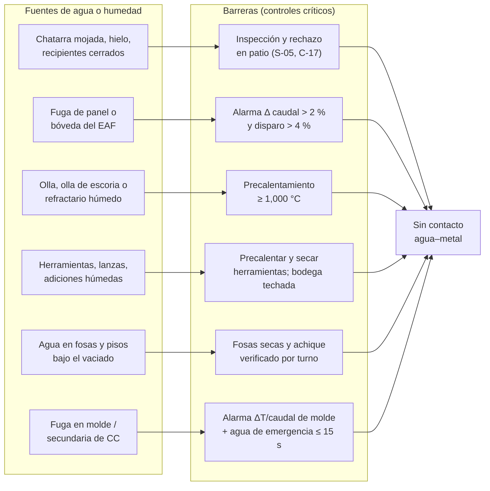

# MS-ACE-03 — Prevención de explosiones por contacto agua–metal líquido

| Código | Versión | Estado | Área | Dueño del proceso | Elaboró | Revisión técnica | Revisión de seguridad | Aprobó | Fecha | Próxima revisión |
|---|---|---|---|---|---|---|---|---|---|---|
| MS-ACE-03 | 0.2 | Borrador para validación | EAF, ollas, LF, CC1, CC2, patio de chatarra | C-07 Ingeniero de Proceso EAF/LF y C-16 Especialista de Seguridad e Higiene | experto-seguridad-salud | experto-operativo-metalurgia | experto-seguridad-salud — visto bueno con observaciones, 2026-09-25 | Pendiente (Gerente de Acería / Director) | 2026-09-25 | 2027-09-25 |

> ⚠️ **Mensaje clave.** **1 L de agua atrapada bajo el acero se convierte en ≈ 1,700 L de vapor a 100 °C y en más de 8,000 L a la temperatura del acero (≈ 1,630 °C).** Si ese vapor está confinado (bajo el baño, dentro de un recipiente cerrado, en una fosa), **explota** y proyecta metal líquido a decenas de metros. **Nada húmedo, nada cerrado y nada frío toca el metal líquido.**

## 1. Objetivo y alcance

**Objetivo:** eliminar las fuentes de agua y humedad que pueden entrar en contacto con acero o escoria líquidos, y definir la respuesta cuando se sospecha agua en el horno, la olla o la máquina de colada.

**Aplica a:** recepción y preparación de chatarra (patio), DRI/HBI, canastas, fugas de paneles y bóveda del EAF, ollas de acero y de escoria, herramientas y lanzas, adiciones (cal, dolomita, ferroaleaciones, alambre), fosas y pisos bajo el vaciado, molde y enfriamiento secundario de CC1/CC2, y refractarios nuevos o reparados.

## 2. Roles y responsabilidades

| Rol | Responsabilidad en este proceso | R/A/C/I |
|---|---|---|
| C-07 Ingeniero de Proceso EAF/LF | Co-dueño: límites de humedad de materiales; criterio de reanudación tras fuga | A |
| C-16 Especialista de Seguridad e Higiene | Co-dueño: auditoría de controles, investigación de eventos | A |
| C-17 Supervisor de Patio de Chatarra | Rechazo de chatarra húmeda, contenedores cerrados y materiales prohibidos | R |
| S-05 Operador de Patio de Chatarra | Inspección de cada camión y canasta; separación de prohibidos | R |
| S-01 Operador de Púlpito de Horno | Vigila la alarma de fuga (Δ caudal) y corta el arco | R |
| S-02 / S-03 Hornero de piso y ayudante | Herramientas secas y precalentadas; inspección visual de agua en el horno | R |
| S-08 Preparador de Ollas / C-15 Especialista de Refractarios | Ollas y refractarios secos y precalentados | R |
| S-10 Operador de Manejo de Escoria | Ollas de escoria secas; volteo en área seca | R |
| S-12 / S-13 / S-14 Colada | Vigilan ΔT y caudal de agua de molde; respuesta a fugas en el molde | R |
| S-19 / S-23 Mecánico y soldador | Reparan fugas de paneles con LOTO (MM-EAF-01) | R |
| C-08 Ingeniero de Proceso de CC | Criterio técnico en fugas de molde y secundaria | C |

## 3. Descripción del proceso

Las explosiones ocurren cuando el agua queda **atrapada bajo o dentro** del metal. Las fuentes y sus barreras se muestran en el diagrama. La respuesta a una fuga en el EAF está en la Figura 1 (rama A).

## 4. Equipos y maquinaria

| Equipo / componente | Función | Especificación clave | Condición para operar (verificación) |
|---|---|---|---|
| Sistema de detección de fugas del EAF | Compara caudal de entrada y salida de paneles y bóveda | Alarma Δ > 2 %; disparo del arco Δ > 4 % (FT-ACE-001) | Prueba del enclavamiento cada mes [Supuesto] |
| Termopares de salida de panel | Detectan panel sin flujo o con escoria pegada | Alarma > 60 °C | Lecturas en HMI de todos los paneles |
| Presostato de agua del EAF | Detecta pérdida de presión | Presión normal 4–6 bar; alarma < 3 bar | Prueba por turno en HMI |
| Analizador de gases de salida (si existe) | H₂ alto indica agua en el horno | Tendencia de H₂ [Validar con OEM] | Calibración según OEM |
| Precalentadores de olla | Secan y calientan el refractario | 1,000–1,100 °C cara caliente; olla fuera de ciclo > 4 h: ≥ 8 h de precalentamiento | Pirómetro de estación |
| Hornos/bandejas de secado de herramientas y lanzas | Eliminan humedad | ≥ 150 °C [Supuesto] | Termómetro de la bandeja |
| Bodega techada de adiciones y ferroaleaciones | Evita absorción de humedad | Piso seco, techo sin goteras | Inspección semanal |
| Bombas de achique de fosas | Mantienen fosas sin agua | Arranque automático por nivel | Prueba por turno |
| Instrumentación de agua de molde CC | Caudal y ΔT | CC1 alarma ΔT > 11 °C o caudal < 90 %; CC2 ΔT > 12 °C o caudal < 90 % | HMI del púlpito |
| Agua de emergencia (torre + diésel) | Evita molde seco ante apagón | Entrada automática ≤ 15 s | Prueba mensual (MM-CC-03) |

## 5. Parámetros de operación

| Parámetro | Unidad | Objetivo | Rango normal | Alarma / límite | Acción si está fuera de rango | Dónde se mide |
|---|---|---|---|---|---|---|
| Δ caudal entrada–salida de agua del EAF | % | < 1 | ≤ 2 | Alarma > 2 %; disparo > 4 % | > 2 %: reduce potencia, busca la fuga; > 4 %: arco fuera, sección 9 | HMI del horno |
| Temperatura de salida de panel | °C | < 50 | ≤ 60 | > 60 °C | Revisa caudal del panel; si hay fuga, LOTO del panel | HMI |
| Presión de agua del EAF | bar | 5 | 4–6 | < 3 bar | Reduce potencia; revisa bombas | HMI |
| Precalentamiento de olla | °C | 1,050 | 1,000–1,100 | < 1,000 °C | 🛑 La olla no recibe acero | Pirómetro |
| Tiempo de precalentamiento de olla fría (> 4 h fuera) | h | ≥ 8 | ≥ 8 | < 8 h | 🛑 No usar | Registro de ollas |
| Secado de refractario nuevo (olla, EBT, distribuidor) | — | Curva OEM | Según curva | Curva no cumplida | 🛑 No usar; C-15 decide | Registro de secado [Validar con OEM] |
| Humedad del DRI/HBI | % | ≤ 0.5 [Supuesto] | ≤ 1 [Supuesto] | > 1 % o DRI mojado | Detén la alimentación de ese lote; avisa a C-07 | Laboratorio / certificado de lote |
| Temperatura de herramientas y lanzas antes de usar | °C | ≥ 150 [Supuesto] | Secas y calientes | Frías o húmedas | 🛑 No introducir al baño | Bandeja de secado |
| Agua en fosas bajo vaciado y en foso de escoria | cm | 0 | 0 | Cualquier agua estancada | 🛑 No vaciar; achique y secado | Visual por turno |
| ΔT de agua de molde CC1 / CC2 | °C | 7.5 / 8 | 6–9 / 6–10 | > 11 °C (CC1) / > 12 °C (CC2); caudal < 90 % | Reduce velocidad; si no se recupera, cierra la línea (MS-ACE-09) | HMI del púlpito de CC |

## 6. Seguridad

### 6.1 Peligros y controles críticos

| Peligro | Consecuencia | Control crítico | Verificación |
|---|---|---|---|
| Recipiente cerrado en la chatarra (tanque, cilindro, tubo sellado, amortiguador, extintor) | Explosión en el horno | Inspección en patio; corte y apertura obligatoria; rechazo del lote | Registro de rechazo del patio |
| Chatarra con agua, hielo, lodo o nieve | Explosión al cargar sobre el talón (20–30 t) | 🛑 No cargar canasta que gotea; escurrir; C-17 libera | Inspección visual de canasta |
| Fuga de panel o bóveda | Agua sobre el baño, explosión | Alarma Δ caudal; disparo del arco; no bascular | Prueba mensual del enclavamiento |
| Olla o refractario húmedo | Explosión al vaciar | Precalentamiento ≥ 1,000 °C; secado según curva | Registro de ollas |
| Herramientas o adiciones húmedas | Proyección de metal | Precalentar; bodega techada | Inspección previa |
| Agua en fosas o pisos | Explosión por derrame | Fosas secas; achique | Inspección por turno |
| Fuga de agua en molde o secundaria | Explosión en el molde, breakout | Alarma ΔT/caudal; agua de emergencia | HMI y prueba mensual |
| Fluido hidráulico base agua cerca de metal líquido | Explosión o incendio | Usar fluido resistente al fuego aprobado; reparar fugas | Inspección de mangueras |

### 6.2 EPP obligatorio

EPP de zona roja en toda tarea frente a metal líquido (MS-ACE-01 y MS-ACE-08). **El EPP también debe estar seco:** un guante mojado sobre metal caliente produce una quemadura por vapor.

### 6.3 Permisos, bloqueos y zonas de exclusión

- **Materiales prohibidos en canasta** (lista mínima): recipientes cerrados o con tapa; cilindros de gas; extintores; amortiguadores; tubos con extremos cerrados; hielo, nieve, lodo; chatarra con agua visible; baterías; materiales radiactivos (MS-ACE-07); explosivos o municiones.
- La reparación de fugas de panel requiere LOTO (MS-ACE-02) y procedimiento MM-EAF-01.
- Tras una fuga con agua en el baño, la zona roja se amplía a **25 m** alrededor del horno (nadie a menos de 25 m) hasta que C-05 y C-07 autoricen. Este criterio y los de humedad de esta sección son los únicos válidos para todos los manuales MO y MM.

## 7. Calidad

| Variable crítica de calidad | Especificación | Método / frecuencia | Registro | Defecto si falla |
|---|---|---|---|---|
| Hidrógeno en el acero | Bajo; sin fuentes de humedad | Control de humedad de materiales; medición de H si se requiere [Validar con C-09] | LIMS | Pinholes, sopladuras, porosidad en planchón y palanquilla |
| Humedad de cal y ferroaleaciones | Seco, bodega techada | Inspección semanal | Registro de bodega | Hidrógeno alto, rendimiento bajo de aleación |
| Integridad del molde (sin fugas) | ΔT y caudal en rango | Continuo | HMI | Grietas longitudinales, breakout |
| Olla bien precalentada | 1,000–1,100 °C | Cada ciclo | Registro de ollas | Pérdida de temperatura, cráneos (skulls), congelamiento en la buza |

## 8. Procedimiento paso a paso

| # | Paso | Cómo hacerlo (detalle y medición) | Criterio de aceptación | ★ | Rol |
|---|---|---|---|---|---|
| 1 | Inspecciona cada camión de chatarra | Desde la plataforma de inspección: busca recipientes cerrados, agua, hielo, lodo, cilindros. Pórtico de radiación sin alarma | Lote libre de prohibidos | ★ | S-05 |
| 2 | Separa y abre recipientes | Todo tubo o recipiente cerrado se aparta, se corta o perfora y se escurre antes de reintegrarlo | Ningún recipiente cerrado en canasta | ★ | S-05, C-17 |
| 3 | Revisa la canasta antes de cargar | La canasta no gotea agua; si gotea, espera y escurre; C-17 libera | Sin goteo visible | ★ | S-04, C-17 |
| 4 | Verifica el agua del EAF antes de energizar | En HMI: Δ caudal ≤ 2 %, presión 4–6 bar, paneles ≤ 60 °C; inspección visual por la puerta: sin agua ni vapor | Todos en rango | ★ | S-01, S-02 |
| 5 | Vigila la fuga durante la fusión | Atiende la alarma Δ > 2 %: reduce potencia y busca vapor, llama amarilla o chisporroteo | Respuesta ≤ 1 min | ★ | S-01 |
| 6 | Precalienta la olla | Verifica 1,000–1,100 °C en cara caliente; si estuvo > 4 h fuera, ≥ 8 h de precalentamiento | Registro en rango | ★ | S-08 |
| 7 | Revisa pisos y fosas | Foso de vaciado, pista del carro de olla y foso de escoria sin agua; bombas de achique probadas | Cero agua estancada | ★ | S-03, S-10 |
| 8 | Prepara herramientas y adiciones | Lanzas, cucharas y barras en bandeja de secado; adiciones de bodega techada; alambre sin humedad | Herramientas secas y calientes | ★ | S-02, S-07 |
| 9 | Revisa ollas de escoria | Secas, sin agua de lluvia; si tienen agua, se voltean y se secan antes de usar | Olla seca | ★ | S-10 |
| 10 | Vigila el agua de molde en CC | ΔT y caudal por línea en HMI; en alarma reduce velocidad y sigue la sección 9 | Parámetros en rango | ★ | S-12 |
| 11 | Registra | Anota rechazos de chatarra, alarmas de fuga y acciones | Registro completo | | S-05, S-01, S-12 |

## 9. Condiciones anormales y respuesta

| Síntoma / alarma | Causa probable | Acción inmediata | A quién avisar |
|---|---|---|---|
| Δ caudal > 4 % (disparo), vapor, llama amarilla, chisporroteo en el EAF | Fuga de panel o bóveda | Arco fuera; **NO bascules el horno ni muevas electrodos**; evacúa a ≥ 25 m del horno; cierra el agua del panel por mando remoto si está identificado; espera a que evapore (sin vapor visible ≥ 30 min [Supuesto]) | C-05, C-07, C-04 |
| Agua visible sobre el baño o la escoria | Fuga mayor | Igual que arriba; nadie frente a la puerta ni al EBT; reanudación solo con C-05 + C-07 | C-04, C-16 |
| Explosión o proyección durante la carga de canasta | Recipiente cerrado o agua en chatarra | Evacúa; atiende lesionados; retiene el lote para investigación | C-04, C-17, C-16 |
| Olla con humedad detectada o precalentamiento incompleto | Falla del precalentador | 🛑 Olla fuera de ciclo | C-15, C-05 |
| ΔT de molde > límite o caudal < 90 % | Obstrucción, fuga, falla de bomba | Reduce velocidad; si no se recupera en ≤ 1 min, cierra la línea; verifica agua de emergencia | C-06, C-08 |
| Agua en la fosa bajo el vaciado | Lluvia, fuga, bomba fallida | 🛑 No vacíes; achique; seca con material absorbente seco | C-05 |

## 10. Registros

- Registro de inspección y rechazo de chatarra (patio).
- Tendencias y alarmas de agua del EAF y de CC (historiador de proceso).
- Registro de precalentamiento y secado de ollas y refractarios.
- Bitácora de fugas y reparaciones de paneles (MM-EAF-01).
- Reportes de incidentes por contacto agua–metal (con análisis ICAM).

## 11. Competencia requerida y certificación

| Rol | Nivel requerido (1–4) | Formación teórica (h) | OJT supervisado (h / eventos) | Evaluación (pasos ★) | Vigencia |
|---|---|---|---|---|---|
| S-05, C-17 | 3 | 8 (materiales prohibidos, radiación) | 40 h + 30 camiones | Pasos 1, 2, 3 | 24 meses (TD-P07) |
| S-01 | 4 | 8 (CRS-08 + CRS-09) | 20 coladas + simulador EAF | Pasos 4, 5 + escenario de fuga | 24 meses (TD-P07) |
| S-02, S-03, S-07, S-10 | 3 | 6 | 20 h | Pasos 7, 8, 9 | 24 meses (TD-P07) |
| S-08, S-24, C-15 | 3 | 6 | 10 ollas | Paso 6 | 24 meses (TD-P07) |
| S-12, S-13, S-14 | 3 | 6 | 10 coladas | Paso 10 + escenario de pérdida de agua | 24 meses (TD-P07) |
| S-04 | 3 | 4 | 10 canastas | Paso 3 | 24 meses (TD-P07) |

**Lista corta de verificación de pasos ★:**
1. ¿Reconoce y rechaza recipientes cerrados y chatarra con agua?
2. ¿Explica por qué NO se bascula el horno con agua sobre el baño?
3. ¿Verifica el agua del EAF (Δ caudal, presión, temperatura) antes de energizar?
4. ¿Confirma olla ≥ 1,000 °C y herramientas secas y calientes?
5. ¿Revisa fosas y pisos sin agua antes del vaciado?
6. ¿No carga una canasta que gotea y espera la liberación de C-17 (paso 3)?
7. ¿Atiende la alarma Δ caudal > 2 % en ≤ 1 min: reduce potencia y busca la fuga (paso 5)?
8. ¿Revisa que las ollas de escoria estén secas (paso 9)?
9. ¿Vigila ΔT y caudal de agua de molde y reduce velocidad o cierra la línea en alarma (paso 10)?

## 12. Referencias

- NOM-002-STPS-2010 (prevención de incendios), NOM-005-STPS-1998 (sustancias peligrosas), NOM-017-STPS-2008 (EPP), NOM-004-STPS-1999 [Verificar con la NOM vigente / SSO].
- FT-ACE-001 secciones 2 (alarmas de agua del EAF), 3 (precalentamiento de olla), 4 y 5 (agua de molde y de emergencia).
- MO-EAF-01, MO-EAF-02, MO-OLL-01, MM-EAF-01, MM-CC-03; MS-ACE-01, 02, 09; CRS-08.
- Guías sectoriales sobre explosiones por agua–metal (worldsteel, AIST) [por referenciar].

## 13. Control de cambios

| Versión | Fecha | Cambio | Autor |
|---|---|---|---|
| 0.1 | 2026-09-25 | Creación del borrador para validación | experto-seguridad-salud (con criterio técnico de experto-operativo-metalurgia) |
| 0.2 | 2026-09-25 | Revisión cruzada: distancia de evacuación por fuga expresada como ≥ 25 m; pasos ★ 3, 5, 9 y 10 en la lista de verificación; S-04 en la sección 11 | experto-seguridad-salud |
