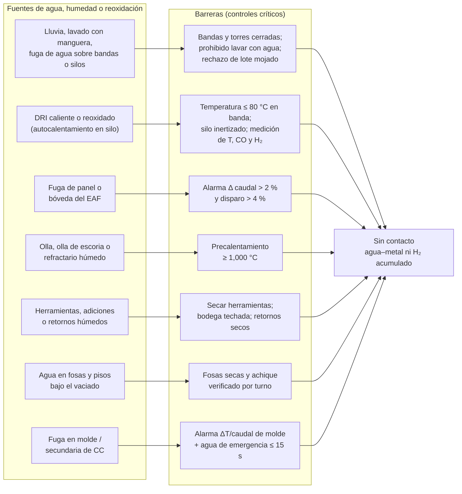
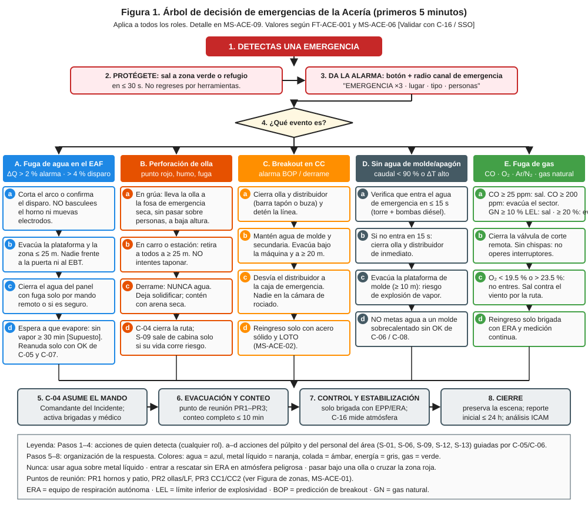

# MS-ACE-03 — Explosiones por agua y humedad: DRI húmedo, agua y metal líquido

| Código | Versión | Estado | Área | Dueño del proceso | Elaboró | Revisión técnica | Revisión de seguridad | Aprobó | Fecha | Próxima revisión |
|---|---|---|---|---|---|---|---|---|---|---|
| MS-ACE-03 | 0.3 | Borrador para validación | Recepción de DRI (bandas, torres de transferencia, silos de día, 5.º agujero), EAF, ollas, LF, CC1, CC2, patio de retornos internos | C-07 Ingeniero de Proceso EAF/LF y C-16 Especialista de Seguridad e Higiene | experto-seguridad-salud | experto-operativo-metalurgia | experto-seguridad-salud — visto bueno con observaciones, 2026-09-28 | Pendiente (Gerente de Acería / Director) | 2026-09-28 | 2027-09-28 |

> ⚠️ **Mensaje clave.** GASM carga el EAF con **≈ 95–100 % de DRI de pelet propio** (decisión D-010, `../../00-cadena-de-valor/CV-GASM-001-cadena-de-valor.md`). El DRI es hierro metálico poroso y **reacciona con el agua**: **Fe + H₂O → FeO + H₂**, con desprendimiento de calor. De ahí salen tres formas de explosión:
> 1. **Vapor bajo el metal:** 1 L de agua atrapada bajo el acero se convierte en ≈ 1,700 L de vapor a 100 °C y en más de 8,000 L a ≈ 1,630 °C. Confinado, **explota** y proyecta metal a decenas de metros.
> 2. **Hidrógeno en silos, chutes y bandas cerradas:** 1 kg de agua que reacciona por completo con el DRI puede liberar hasta ≈ 1.2 m³ de H₂ (máximo teórico), suficiente para llevar ≈ 30 m³ de aire al límite inferior de explosividad (LEL del H₂ = 4 % vol).
> 3. **DRI húmedo que entra al baño:** vapor + H₂ dentro del horno; ebullición violenta y proyección por la puerta y el 5.º agujero.
>
> **El DRI nunca se moja. Nada húmedo, nada cerrado y nada frío toca el metal líquido.**

## 1. Objetivo y alcance

**Objetivo:** eliminar las fuentes de agua y humedad que pueden llegar al DRI o al acero y la escoria líquidos, controlar la reoxidación y el autocalentamiento del DRI, y definir la respuesta cuando se sospecha DRI mojado o agua en el horno, la olla o la máquina de colada.

**Aplica a:**
- **Cadena del DRI dentro de la Acería:** bandas transportadoras cerradas desde el punto de frontera con HYL y Midrex, torres de transferencia y chutes, silos de día, alimentadores y conducto del 5.º agujero, manejo separado de finos.
- **Retornos internos (≤ 5 % de la carga):** despuntes, rechazos y derrames solidificados; canasta ocasional.
- **Horno y metal líquido:** fugas de paneles y bóveda del EAF, ollas de acero y de escoria, herramientas y lanzas, adiciones (cal, dolomita, ferroaleaciones, alambre), fosas y pisos bajo el vaciado, molde y secundaria de CC1/CC2, refractarios nuevos o reparados.

**Fuera de alcance:** el DRI dentro de las plantas HYL y Midrex hasta el punto de frontera (manuales de seguridad de `10-plantas/03-reduccion-directa/`). **Ya no aplica** (D-010): chatarra comprada, patio de chatarra externo, recipientes cerrados y explosivos en chatarra comprada, y carga de canasta en cada colada.

## 2. Roles y responsabilidades

| Rol | Responsabilidad en este proceso | R/A/C/I |
|---|---|---|
| C-07 Ingeniero de Proceso EAF/LF | Co-dueño: límites de humedad, metalización, temperatura y finos del DRI; criterio de reanudación tras una fuga o un lote mojado | A |
| C-16 Especialista de Seguridad e Higiene | Co-dueño: auditoría de controles (VCC), investigación de eventos, criterios de H₂/CO/O₂ en silos (MS-ACE-05 y 06) | A |
| C-17 Supervisor de Manejo de Materiales (DRI, fundentes y retornos) (antes Supervisor de Patio de Chatarra y Materiales; CAT-ACE-001) | Libera o rechaza lotes de DRI; controla silos, bandas y retornos; coordina con el púlpito de HYL/Midrex | R |
| S-05 Operador de Manejo de DRI y Retornos (antes Operador de Patio de Chatarra; CAT-ACE-001) | Recorre bandas, torres y silos; vigila temperatura, humedad y gases; prepara la canasta ocasional de retornos | R |
| Púlpito de HYL / Midrex [código de rol según `10-plantas/03-reduccion-directa/`] | Envía DRI dentro de especificación; detiene o desvía el envío a pedido de C-17 o del púlpito del EAF | R (interfaz) |
| S-01 Operador de Púlpito de Horno | Vigila la alarma de fuga (Δ caudal) y la alimentación de DRI; corta el arco y la alimentación | R |
| S-02 / S-03 Hornero de piso y ayudante | Herramientas secas y precalentadas; inspección visual de agua en el horno | R |
| S-08 Preparador de Ollas / C-15 Especialista de Refractarios | Ollas y refractarios secos y precalentados | R |
| S-10 Operador de Manejo de Escoria | Ollas de escoria secas; volteo en área seca | R |
| S-12 / S-13 / S-14 Colada | Vigilan ΔT y caudal de agua de molde; respuesta a fugas en el molde | R |
| S-19 / S-23 Mecánico y soldador | Reparan fugas de paneles y de sistemas de agua cercanos a bandas y silos con LOTO | R |
| C-08 Ingeniero de Proceso de CC | Criterio técnico en fugas de molde y secundaria | C |

## 3. Descripción del proceso

Las explosiones ocurren cuando el agua queda **atrapada bajo o dentro** del metal, o cuando el DRI mojado genera **H₂ en un espacio cerrado**. Las fuentes y sus barreras se muestran en el diagrama. La respuesta a una fuga en el EAF está en la Figura 1 (rama A).

```mermaid
flowchart LR
    subgraph Fuentes["Fuentes de agua, humedad o reoxidación"]
        F1["Lluvia, lavado con manguera,<br/>fuga de agua sobre bandas o silos"]
        F2["DRI caliente o reoxidado<br/>(autocalentamiento en silo)"]
        F3["Fuga de panel o<br/>bóveda del EAF"]
        F4["Olla, olla de escoria o<br/>refractario húmedo"]
        F5["Herramientas, adiciones<br/>o retornos húmedos"]
        F6["Agua en fosas y pisos<br/>bajo el vaciado"]
        F7["Fuga en molde /<br/>secundaria de CC"]
    end
    subgraph Barreras["Barreras (controles críticos)"]
        B1["Bandas y torres cerradas;<br/>prohibido lavar con agua;<br/>rechazo de lote mojado"]
        B2["Temperatura ≤ 80 °C en banda;<br/>silo inertizado; medición<br/>de T, CO y H₂"]
        B3["Alarma Δ caudal > 2 %<br/>y disparo > 4 %"]
        B4["Precalentamiento<br/>≥ 1,000 °C"]
        B5["Secar herramientas;<br/>bodega techada; retornos secos"]
        B6["Fosas secas y achique<br/>verificado por turno"]
        B7["Alarma ΔT/caudal de molde<br/>+ agua de emergencia ≤ 15 s"]
    end
    F1 --> B1
    F2 --> B2
    F3 --> B3
    F4 --> B4
    F5 --> B5
    F6 --> B6
    F7 --> B7
    B1 & B2 & B3 & B4 & B5 & B6 & B7 --> R["Sin contacto<br/>agua–metal ni H₂ acumulado"]
```

**Cómo se mueve el DRI (CV-GASM-001 §4.2–4.3; FT-ACE-001 §2.1):** HYL y Midrex → 2 bandas cerradas directas → **torre de transferencia a la entrada de la nave de silos** (límite de batería RD / Acería) → criba de finos → 4 silos de día inertizados con N₂ → alimentador y báscula dosificadora → banda del 5.º agujero → tolva de compensación → EAF, en continuo. Los finos < 3 mm (≤ 5 %) van a su tolva y **no** entran por el 5.º agujero.

## 4. Equipos y maquinaria

| Equipo / componente | Función | Especificación clave | Condición para operar (verificación) |
|---|---|---|---|
| Bandas transportadoras cerradas y torres de transferencia de DRI | Llevan el DRI sin exposición a lluvia ni agua | Cubierta y sellos completos; sin boquillas de agua ni rociadores de agua sobre el DRI [Validar con C-16 y el diseño contra incendio] | Recorrido por turno: cubiertas cerradas, sin goteras ni charcos |
| Termómetros o escáner de temperatura en banda | Detectan DRI caliente o reoxidándose | ≤ 80 °C en banda (CV-GASM-001) [Supuesto] | Lectura en HMI; prueba según OEM |
| Silos de día de DRI (4, 2 por EAF, ≈ 1,000 t c/u; ≈ 12 h de autonomía) | Almacenamiento de horas antes del EAF | Cerrados y secos; inertización con N₂; termopares a varios niveles; CO, H₂ y O₂ en el domo; nivel por radar (FT-ACE-001 §2.1) [Validar con OEM] | Inertización en línea; temperaturas y gases en HMI |
| Sistema de inertización con N₂ | Evita la reoxidación del DRI en silo | Caudal y presión según OEM [Validar con OEM] | Alarma de bajo caudal en HMI |
| Medición de humedad y metalización del DRI | Verifica la especificación del lote | Certificado de lote de RD + muestra de la Acería [Validar con C-07] | Resultado antes de liberar a silo |
| Área techada de rechazo de DRI [Supuesto — por definir con C-07 y RD] | Recibe el DRI mojado o fuera de especificación | Techada, seca, piso sin encharcamiento, en capa delgada | Libre y señalizada |
| Sistema de detección de fugas del EAF | Compara el caudal de entrada y salida de paneles y bóveda | Alarma Δ > 2 %; disparo del arco Δ > 4 % (FT-ACE-001) | Prueba del enclavamiento cada mes [Supuesto] |
| Termopares de salida de panel | Detectan un panel sin flujo o con escoria pegada | Alarma > 60 °C | Lecturas en HMI de todos los paneles |
| Presostato de agua del EAF | Detecta pérdida de presión | Presión normal 4–6 bar; alarma < 3 bar | Prueba por turno en HMI |
| Analizador de gases de salida (si existe) | H₂ alto indica agua o DRI húmedo en el horno | Tendencia de H₂ [Validar con OEM] | Calibración según OEM |
| Precalentadores de olla | Secan y calientan el refractario | 1,000–1,100 °C cara caliente; olla fuera de ciclo > 4 h: ≥ 8 h de precalentamiento | Pirómetro de estación |
| Hornos o bandejas de secado de herramientas y lanzas | Eliminan humedad | ≥ 150 °C [Supuesto] | Termómetro de la bandeja |
| Bodega techada de adiciones y ferroaleaciones | Evita absorción de humedad | Piso seco, techo sin goteras | Inspección semanal |
| Bombas de achique de fosas | Mantienen las fosas sin agua | Arranque automático por nivel | Prueba por turno |
| Instrumentación de agua de molde CC | Caudal y ΔT | CC1 alarma ΔT > 11 °C o caudal < 90 %; CC2 ΔT > 12 °C o caudal < 90 % | HMI del púlpito |
| Agua de emergencia (torre + diésel) | Evita molde seco ante apagón | Entrada automática ≤ 15 s | Prueba mensual (MM-CC-03) |

## 5. Parámetros de operación

| Parámetro | Unidad | Objetivo | Rango normal | Alarma / límite | Acción si está fuera de rango | Dónde se mide |
|---|---|---|---|---|---|---|
| Humedad del DRI | % | ≤ 0.5 [Supuesto] | ≤ 1 [Supuesto] | > 1 % o DRI visiblemente mojado | 🛑 El lote no entra al silo ni al horno; desvío al área de rechazo; avisa a C-07 y al púlpito de RD | Laboratorio / certificado de lote |
| Temperatura del DRI en banda | °C | ≤ 60 [Supuesto] | ≤ 80 (CV-GASM-001) [Supuesto] | > 80 °C | Avisa a RD; detén el envío si sigue subiendo; no llenes el silo con DRI caliente sin autorización de C-07 | Escáner o termómetro de banda |
| Temperatura del DRI dentro del silo de día | °C | Estable | ≤ 80 | **> 90 °C o subida > 5 °C/h** en cualquier nivel (FT-ACE-001 §2.1) [Validar con OEM] | Inertiza con N₂; no cargues más a ese silo; vacíalo al EAF con prioridad (o al área de rechazo si C-07 lo decide); **nunca agua** (sección 6.4) | Termopares del silo |
| H₂ en el espacio superior del silo y en torres cerradas | % LEL | 0 | < 10 % LEL | A1 10 % LEL · A2 20 % LEL (criterio único de MS-ACE-05) | 10 %: sin ignición, busca la fuente de agua, aumenta la inertización; 20 %: evacuación del sector (MS-ACE-06) | Detector fijo [Validar con OEM] |
| CO en el espacio superior del silo | ppm | 0 | < 25 | Tendencia en aumento = autocalentamiento; A1 25 ppm · A2 200 ppm en zonas ocupadas (MS-ACE-06) [Verificar NOM-010] | Trata como autocalentamiento: sección 9 | Detector fijo |
| Metalización del DRI | % | ≥ 93 | ≥ 92 (CV-GASM-001) | < 92 % | Avisa a C-07: más FeO, más reacción en el baño y riesgo de ebullición de escoria (MS-ACE-01) | Certificado de lote |
| Finos < 3 mm en el DRI | % | ≤ 3 [Supuesto] | ≤ 5 (CV-GASM-001) | > 5 % | Desvía los finos a manejo separado; no al 5.º agujero | Laboratorio |
| Δ caudal entrada–salida de agua del EAF | % | < 1 | ≤ 2 | Alarma > 2 %; disparo > 4 % | > 2 %: reduce potencia, busca la fuga; > 4 %: arco fuera y alimentación de DRI detenida, sección 9 | HMI del horno |
| Temperatura de salida de panel | °C | < 50 | ≤ 60 | > 60 °C | Revisa el caudal del panel; si hay fuga, LOTO del panel | HMI |
| Presión de agua del EAF | bar | 5 | 4–6 | < 3 bar | Reduce potencia; revisa bombas | HMI |
| Precalentamiento de olla | °C | 1,050 | 1,000–1,100 | < 1,000 °C | 🛑 La olla no recibe acero | Pirómetro |
| Tiempo de precalentamiento de olla fría (> 4 h fuera) | h | ≥ 8 | ≥ 8 | < 8 h | 🛑 No usar | Registro de ollas |
| Secado de refractario nuevo (olla, EBT, distribuidor) | — | Curva OEM | Según curva | Curva no cumplida | 🛑 No usar; C-15 decide | Registro de secado [Validar con OEM] |
| Retornos internos en canasta | % de la carga | ≤ 5 | ≤ 5 (CV-GASM-001) | Retorno mojado, con escoria húmeda o con cavidades | 🛑 No cargar; escurre y seca bajo techo; C-17 libera | Inspección visual |
| Temperatura de herramientas y lanzas antes de usar | °C | ≥ 150 [Supuesto] | Secas y calientes | Frías o húmedas | 🛑 No introducir al baño | Bandeja de secado |
| Agua en fosas bajo el vaciado y en el foso de escoria | cm | 0 | 0 | Cualquier agua estancada | 🛑 No vaciar; achique y secado | Visual por turno |
| ΔT de agua de molde CC1 / CC2 | °C | 7.5 / 8 | 6–9 / 6–10 | > 11 °C (CC1) / > 12 °C (CC2); caudal < 90 % | Reduce velocidad; si no se recupera, cierra la línea (MS-ACE-09) | HMI del púlpito de CC |

## 6. Seguridad

### 6.1 Peligros y controles críticos

| Peligro | Consecuencia | Control crítico | Verificación |
|---|---|---|---|
| **DRI mojado** en banda, torre o silo (lluvia, goteras, lavado con manguera, fuga de agua de enfriamiento o de servicios) | Generación de H₂ y calor; explosión en silo o chute; explosión de vapor en el horno | Bandas y torres cerradas; **prohibido lavar con agua** en el circuito del DRI (limpieza en seco o por aspiración); reparar goteras y fugas; lote mojado desviado al área de rechazo | Recorrido por turno de S-05; VCC mensual de C-16 |
| **Reoxidación y autocalentamiento** del DRI en silo o en una banda detenida | Incendio del DRI, CO y H₂, daño del silo | Inertización con N₂; DRI ≤ 80 °C al entrar; medición de temperatura, CO y H₂; rotación del inventario (sin DRI "viejo" en silo) [Validar con OEM] | Tendencias en HMI; registro de inertización |
| **H₂ acumulado** en el espacio superior del silo, en torres y chutes cerrados | Explosión | Detección de H₂ (LEL); venteo o inertización; control de fuentes de ignición (equipo clasificado, permiso de trabajo en caliente) [Validar con C-16 / OEM] | Detector fijo; permiso NOM-027 |
| **DRI húmedo o reoxidado que entra al horno** | Ebullición violenta, proyección por la puerta y el 5.º agujero, explosión de vapor | Lote liberado por C-17 con humedad ≤ 1 % [Supuesto]; S-01 detiene la alimentación ante señales (chisporroteo, llama anormal, H₂ en gases) | Registro de liberación del lote |
| Finos de DRI al 5.º agujero | Arrastre al sistema de humos, reacción violenta, polvo | Finos a manejo separado; cribado según OEM | Análisis de finos por lote |
| Retornos internos húmedos o con escoria húmeda (derrames solidificados, cráneos de olla) | Explosión al cargar sobre el talón | Solo retornos secos; escurrir y secar bajo techo; C-17 libera la canasta ocasional | Inspección visual de la canasta |
| Chatarra de mantenimiento de la planta con cavidades (tubos, cilindros, amortiguadores, recipientes) | Explosión en el horno | **No es retorno interno: no se carga al EAF** [Validar con C-07 / C-01]; se envía a venta o disposición | Registro de C-17 |
| Fuga de panel o bóveda | Agua sobre el baño, explosión | Alarma Δ caudal; disparo del arco; alimentación de DRI detenida; no bascular | Prueba mensual del enclavamiento |
| Olla o refractario húmedo | Explosión al vaciar | Precalentamiento ≥ 1,000 °C; secado según curva | Registro de ollas |
| Herramientas o adiciones húmedas | Proyección de metal | Precalentar; bodega techada | Inspección previa |
| Agua en fosas o pisos | Explosión por derrame | Fosas secas; achique | Inspección por turno |
| Fuga de agua en molde o secundaria | Explosión en el molde, breakout | Alarma ΔT/caudal; agua de emergencia | HMI y prueba mensual |
| Fluido hidráulico base agua cerca de metal líquido | Explosión o incendio | Usar fluido resistente al fuego aprobado; reparar fugas | Inspección de mangueras |

### 6.2 EPP obligatorio

EPP de zona roja en toda tarea frente a metal líquido (MS-ACE-01 y MS-ACE-08). **El EPP también debe estar seco:** un guante mojado sobre metal caliente produce una quemadura por vapor. En bandas, torres y silos: EPP de la fila "Bandas y silos de DRI" de MS-ACE-08 (respirador para polvo, detector multigás con H₂ en el LEL, ropa ajustada).

### 6.3 Permisos, bloqueos y zonas de exclusión

- **Prohibido en el circuito del DRI:** lavar con manguera o hidrolavadora; dejar abiertas cubiertas o puertas de inspección bajo la lluvia; almacenar DRI a la intemperie; apagar un DRI caliente o en combustión con agua o espuma.
- **Materiales prohibidos en la canasta de retornos** (lista mínima): cualquier retorno mojado, con hielo, lodo o escoria húmeda; chatarra de mantenimiento (tubos, cilindros, extintores, amortiguadores, recipientes, baterías); equipos con fuente radiactiva o dados de baja sin liberación del ESR (MS-ACE-07); materiales ajenos a la Acería.
- La reparación de fugas de panel requiere LOTO (MS-ACE-02) y el procedimiento MM-EAF-01. La reparación de una gotera o fuga de agua sobre bandas o silos requiere LOTO de la banda (MS-ACE-02 §6.5).
- Tras una fuga con agua en el baño, la zona roja se amplía a **25 m** alrededor del horno (nadie a menos de 25 m) hasta que C-05 y C-07 autoricen. Este criterio y los de humedad de esta sección son los únicos válidos para todos los manuales MO y MM.

### 6.4 Agente de extinción y control de incendios de DRI (criterio único de la Acería)

FT-ACE-001 §2.1 deja a este manual la definición del agente de extinción. Criterio [Validar con el OEM de los silos, los licenciantes HYL/Midrex y la brigada]:

| Situación | Qué se hace | Qué está prohibido |
|---|---|---|
| Autocalentamiento en silo (> 90 °C o > 5 °C/h; CO en aumento) | Inertización con N₂ (caudal de emergencia); no cargar más a ese silo; vaciarlo al EAF con prioridad o al área de rechazo si C-07 lo decide; vigilar H₂ y CO | Agua, espuma o vapor; abrir escotillas para "ventilar"; entrar al silo |
| DRI encendido o humeante en una banda o un derrame | Detener y bloquear la banda (MS-ACE-02 §6.5); pedir a RD detener el envío si la banda viene de la frontera; retirar el DRI caliente y extenderlo en capa delgada sobre piso seco, o cubrirlo con arena seca o agente para metales (clase D) | Agua o espuma; apilar DRI caliente; barrer con aire comprimido |
| Incendio de la banda (hule) o de equipo eléctrico, sin DRI caliente | Polvo químico seco o CO₂ de extintor según la clase de fuego; brigada contra incendio | Chorro de agua sobre DRI cercano |
| H₂ ≥ 20 % LEL en silo o torre | Evacuación del sector; sin ignición; inertización; MS-ACE-09 escenario I | Operar interruptores en la zona; entrar sin ERA |

> Cualquier sistema fijo de rociadores de agua sobre bandas o silos de DRI debe revisarse con C-16 y el área de protección contra incendio (NOM-002) antes de la operación con 100 % DRI [Verificar con la NOM vigente / SSO].

## 7. Calidad

| Variable crítica de calidad | Especificación | Método / frecuencia | Registro | Defecto si falla |
|---|---|---|---|---|
| Hidrógeno en el acero | Bajo; sin fuentes de humedad | Control de humedad del DRI y de los materiales; medición de H si se requiere [Validar con C-09] | LIMS | Pinholes, sopladuras, porosidad en planchón y palanquilla |
| Metalización y carbono del DRI | Metalización ≥ 92 %; carbono de la mezcla HYL/Midrex según C-07 (CV-GASM-001 §4.2) | Certificado por lote | LIMS / registro de lotes | Más consumo de energía y de carbono; escoria con FeO alto |
| Humedad de cal y ferroaleaciones | Seco, bodega techada | Inspección semanal | Registro de bodega | Hidrógeno alto, rendimiento bajo de aleación |
| Integridad del molde (sin fugas) | ΔT y caudal en rango | Continuo | HMI | Grietas longitudinales, breakout |
| Olla bien precalentada | 1,000–1,100 °C | Cada ciclo | Registro de ollas | Pérdida de temperatura, cráneos (skulls), congelamiento en la buza |

## 8. Procedimiento paso a paso

| # | Paso | Cómo hacerlo (detalle y medición) | Criterio de aceptación | ★ | Rol |
|---|---|---|---|---|---|
| 1 | Verifica el lote de DRI antes de mandarlo al silo | Revisa el certificado de RD (humedad, metalización, finos) y la temperatura en banda; si el DRI se ve mojado o la temperatura pasa de 80 °C, pide a RD detener o desviar el envío | Lote dentro de especificación; liberación de C-17 registrada | ★ | S-05, C-17 |
| 2 | Recorre bandas, torres y silos | Cubiertas y sellos cerrados; sin goteras, charcos ni fugas de agua; sin DRI derramado mojado; nadie lava con agua | Recorrido sin hallazgos o hallazgo atendido | ★ | S-05 |
| 3 | Vigila el silo de día | En HMI: inertización con N₂ en línea, temperaturas estables ≤ 80 °C, CO y H₂ sin tendencia al alza | Todos en rango | ★ | S-05, S-01 |
| 4 | Revisa la canasta ocasional de retornos | Solo retornos internos secos; sin chatarra de mantenimiento ni cavidades; si gotea, espera y escurre; C-17 libera | Sin goteo ni prohibidos | ★ | S-04, S-05, C-17 |
| 5 | Verifica el agua del EAF antes de energizar | En HMI: Δ caudal ≤ 2 %, presión 4–6 bar, paneles ≤ 60 °C; inspección visual por la puerta: sin agua ni vapor | Todos en rango | ★ | S-01, S-02 |
| 6 | Vigila la fuga y la alimentación de DRI durante la fusión | Atiende la alarma Δ > 2 %: reduce potencia y busca vapor, llama amarilla o chisporroteo; ante señales de DRI húmedo, detén la alimentación por el 5.º agujero | Respuesta ≤ 1 min | ★ | S-01 |
| 7 | Precalienta la olla | Verifica 1,000–1,100 °C en la cara caliente; si estuvo > 4 h fuera, ≥ 8 h de precalentamiento | Registro en rango | ★ | S-08 |
| 8 | Revisa pisos y fosas | Foso de vaciado, pista del carro de olla y foso de escoria sin agua; bombas de achique probadas | Cero agua estancada | ★ | S-03, S-10 |
| 9 | Prepara herramientas y adiciones | Lanzas, cucharas y barras en la bandeja de secado; adiciones de la bodega techada; alambre sin humedad | Herramientas secas y calientes | ★ | S-02, S-07 |
| 10 | Revisa las ollas de escoria | Secas, sin agua de lluvia; si tienen agua, se voltean y se secan antes de usar | Olla seca | ★ | S-10 |
| 11 | Vigila el agua de molde en CC | ΔT y caudal por línea en HMI; en alarma reduce velocidad y sigue la sección 9 | Parámetros en rango | ★ | S-12 |
| 12 | Registra | Anota lotes rechazados, alarmas de silo, alarmas de fuga y acciones | Registro completo | | S-05, S-01, S-12 |

## 9. Condiciones anormales y respuesta

| Síntoma / alarma | Causa probable | Acción inmediata | A quién avisar |
|---|---|---|---|
| DRI mojado en banda o torre; charco o goteo sobre la banda | Lluvia, gotera, fuga, lavado | Detén la banda hacia el silo; pide a RD detener el envío; desvía el DRI mojado al área de rechazo (capa delgada, techada); **no lo mandes al silo ni al horno**; repara la fuente con LOTO | C-17, púlpito de RD, C-07 |
| Temperatura del silo en aumento, CO en aumento o humo | Reoxidación y autocalentamiento | Aumenta la inertización con N₂; aleja al personal del techo del silo; vacía el silo según OEM (al EAF si C-07 lo autoriza, o al área de rechazo); **nunca agua ni espuma**; nadie entra al silo | C-17, C-07, C-16, C-04 |
| H₂ ≥ 10 % LEL en silo o torre | DRI mojado, agua en el silo | Sin fuentes de ignición; aumenta la inertización; busca la fuente de agua; ≥ 20 % LEL: evacuación del sector (MS-ACE-06, MS-ACE-09 escenario I) | C-04, C-16 |
| Chisporroteo, llama anormal o H₂ alto en los gases del horno durante la alimentación de DRI | DRI húmedo o reoxidado | Detén la alimentación por el 5.º agujero; reduce potencia; aleja al personal de la puerta; C-07 revisa el lote | C-05, C-07 |
| Δ caudal > 4 % (disparo), vapor, llama amarilla, chisporroteo en el EAF | Fuga de panel o bóveda | Arco fuera y alimentación de DRI detenida; **NO bascules el horno ni muevas electrodos**; evacúa a ≥ 25 m del horno; cierra el agua del panel por mando remoto si está identificado; espera a que evapore (sin vapor visible ≥ 30 min [Supuesto]) | C-05, C-07, C-04 |
| Agua visible sobre el baño o la escoria | Fuga mayor | Igual que arriba; nadie frente a la puerta ni al EBT; reanudación solo con C-05 + C-07 | C-04, C-16 |
| Explosión o proyección al cargar la canasta de retornos | Retorno húmedo o con cavidad | Evacúa; atiende lesionados; retiene el material para investigación | C-04, C-17, C-16 |
| Olla con humedad detectada o precalentamiento incompleto | Falla del precalentador | 🛑 Olla fuera de ciclo | C-15, C-05 |
| ΔT de molde > límite o caudal < 90 % | Obstrucción, fuga, falla de bomba | Reduce velocidad; si no se recupera en ≤ 1 min, cierra la línea; verifica el agua de emergencia | C-06, C-08 |
| Agua en la fosa bajo el vaciado | Lluvia, fuga, bomba fallida | 🛑 No vacíes; achique; seca con material absorbente seco | C-05 |

## 10. Registros

- Certificados de lote de DRI (RD) y registro de liberación o rechazo (C-17).
- Tendencias de temperatura, inertización, CO y H₂ de los silos de día (historiador de proceso).
- Recorridos de bandas, torres y silos (S-05) y reparación de goteras o fugas.
- Tendencias y alarmas de agua del EAF y de CC (historiador de proceso).
- Registro de precalentamiento y secado de ollas y refractarios.
- Bitácora de fugas y reparaciones de paneles (MM-EAF-01).
- Reportes de incidentes por contacto agua–metal o DRI húmedo (con análisis ICAM).

## 11. Competencia requerida y certificación

| Rol | Nivel requerido (1–4) | Formación teórica (h) | OJT supervisado (h / eventos) | Evaluación (pasos ★) | Vigencia |
|---|---|---|---|---|---|
| S-05, C-17 (DRI, silos y retornos) | 3 | 8 (química del DRI: humedad, reoxidación, H₂; silos inertizados; interfaz con RD) [Supuesto] | 40 h + 20 recorridos + 1 simulacro de silo | Pasos 1, 2, 3, 4 | 24 meses (TD-P07) |
| S-01 | 4 | 8 (CRS-08 + CRS-09 + alimentación de DRI) | 20 coladas + simulador EAF | Pasos 5, 6 + escenario de fuga y de DRI húmedo | 24 meses (TD-P07) |
| S-02, S-03, S-07, S-10 | 3 | 6 | 20 h | Pasos 8, 9, 10 | 24 meses (TD-P07) |
| S-08, S-24, C-15 | 3 | 6 | 10 ollas | Paso 7 | 24 meses (TD-P07) |
| S-12, S-13, S-14 | 3 | 6 | 10 coladas | Paso 11 + escenario de pérdida de agua | 24 meses (TD-P07) |
| S-04 | 3 | 4 | 5 canastas de retornos | Paso 4 | 24 meses (TD-P07) |

**Lista corta de verificación de pasos ★:**
1. ¿Explica por qué el DRI mojado genera H₂ y calor, y por qué nunca se apaga con agua?
2. ¿Rechaza un lote mojado o > 80 °C y pide a RD detener o desviar el envío (paso 1)?
3. ¿Detecta goteras, charcos y cubiertas abiertas en el recorrido, y sabe que está prohibido lavar con agua (paso 2)?
4. ¿Interpreta la tendencia de temperatura, CO y H₂ del silo y sabe qué hacer ante un autocalentamiento (paso 3)?
5. ¿Carga solo retornos internos secos y rechaza la chatarra de mantenimiento (paso 4)?
6. ¿Explica por qué NO se bascula el horno con agua sobre el baño?
7. ¿Verifica el agua del EAF (Δ caudal, presión, temperatura) antes de energizar y atiende la alarma > 2 % en ≤ 1 min (pasos 5 y 6)?
8. ¿Confirma olla ≥ 1,000 °C, herramientas secas y calientes y fosas sin agua (pasos 7, 8 y 9)?
9. ¿Revisa que las ollas de escoria estén secas (paso 10)?
10. ¿Vigila ΔT y caudal de agua de molde y reduce velocidad o cierra la línea en alarma (paso 11)?

## 12. Referencias

- NOM-002-STPS-2010 (prevención de incendios), NOM-005-STPS-1998 (sustancias peligrosas), NOM-010-STPS-2014 (agentes químicos), NOM-033-STPS-2015 (espacios confinados), NOM-027-STPS-2008 (trabajo en caliente), NOM-017-STPS-2008 (EPP), NOM-004-STPS-1999 [Verificar con la NOM vigente / SSO — verificar con Jurídico Laboral / SSO].
- CV-GASM-001 §4.2 (especificación del DRI), §4.3 (carga del EAF) y §5 (riesgos que cambian).
- FT-ACE-001 secciones 2 (alarmas de agua del EAF, alimentación de DRI), 3 (precalentamiento de olla), 4 y 5 (agua de molde y de emergencia) [en actualización por D-010].
- MO-EAF-01, MO-EAF-02, MO-EAF-03, MO-OLL-01, MM-EAF-01, MM-CC-03; MS-ACE-01, 02, 05, 06, 09; CRS-08, CRS-09, CRS-10.
- Código IMO IMSBC (DRI tipos A, B y C: reacción con agua, H₂ y autocalentamiento) y guías de los licenciantes HYL/Midrex sobre almacenamiento y manejo del DRI, como referencias técnicas [por referenciar; Validar con OEM].
- Guías sectoriales sobre explosiones por agua–metal (worldsteel, AIST) [por referenciar].

## 13. Control de cambios

| Versión | Fecha | Cambio | Autor |
|---|---|---|---|
| 0.1 | 2026-09-25 | Creación del borrador para validación | experto-seguridad-salud (con criterio técnico de experto-operativo-metalurgia) |
| 0.2 | 2026-09-25 | Revisión cruzada: distancia de evacuación por fuga expresada como ≥ 25 m; pasos ★ 3, 5, 9 y 10 en la lista de verificación; S-04 en la sección 11 | experto-seguridad-salud |
| 0.3 | 2026-09-28 | **Reescritura por D-010 (carga ≈ 95–100 % DRI por banda):** nuevo título; salen la chatarra comprada, los recipientes cerrados de chatarra, el pórtico y la canasta en cada colada; entran DRI húmedo, reoxidación y autocalentamiento, H₂ en silos y torres, finos, retornos internos, prohibición de lavar con agua e interfaz con RD; pasos ★ 1–4 nuevos | experto-seguridad-salud |
