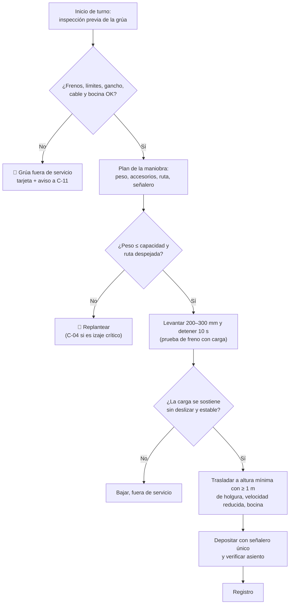

# MS-ACE-04 — Izaje con grúas de colada y de carga; cargas suspendidas

| Código | Versión | Estado | Área | Dueño del proceso | Elaboró | Revisión técnica | Revisión de seguridad | Aprobó | Fecha | Próxima revisión |
|---|---|---|---|---|---|---|---|---|---|---|
| MS-ACE-04 | 0.1 | Borrador para validación | Nave de hornos, nave de ollas, CC1, CC2, patio de chatarra | C-16 Especialista de Seguridad e Higiene de Acería | experto-seguridad-salud | experto-operativo-metalurgia | experto-seguridad-salud | Pendiente (Gerente de Acería / Director) | 2026-09-25 | 2027-09-25 |

> ⚠️ **Mensaje clave.** **Nadie bajo una carga suspendida. Nunca.** Una olla llena de 150 t de acero a 1,630 °C, una canasta de 55–70 t de chatarra o un segmento de colada matan si caen o se balancean. La grúa de colada solo opera con **doble freno probado**, **límites probados**, **un solo señalero** y **ruta despejada**. Estándares corporativos **CRS-04** (cargas suspendidas) y **CRS-05** (grúa viajera).

## 1. Objetivo y alcance

**Objetivo:** prevenir la caída, el golpe o el balanceo de cargas y la exposición de personas bajo cargas suspendidas en la Acería.

**Aplica a:** grúas de colada 2 × 250/63 t (ollas llenas y vacías), grúas de carga 2 × 120/40 t (canastas, bóveda, electrodos), grúas de CC y de producto 2 × 50 t + 2 × 25 t (distribuidores, segmentos, planchón, palanquilla, electroimán y tenaza) y grúa/electroimán del patio de chatarra. Incluye inspección previa al uso, maniobras con accesorios (eslingas, estrobos, grilletes, vigas de izaje) y señalización.

**Relación:** mantenimiento de grúas en MM-GR-01; trabajo en la grúa (pasillos, puente) en MS-ACE-10; bloqueo en MS-ACE-02.

## 2. Roles y responsabilidades

| Rol | Responsabilidad en este proceso | R/A/C/I |
|---|---|---|
| C-16 Especialista de Seguridad e Higiene | Dueño del estándar; audita (VCC); autoriza maniobras especiales | A |
| C-04 Jefe de Turno | Autoriza izajes críticos (> 75 % de capacidad o sobre áreas ocupadas) [Supuesto] | R |
| S-09 Operador de Grúa de Colada | Inspección previa, prueba de frenos y límites, traslado de ollas | R |
| S-04 Operador de Grúa de Carga | Canastas, bóveda, electrodos | R |
| S-05 Operador de Patio | Electroimán y carga de canastas | R |
| S-13 Operador de Plataforma de Colada | Señalero en la torreta (colocación de olla) | R |
| S-03 / S-08 / S-14 / S-15 | Enganche y señalero en su área (solo si están certificados como maniobristas) | R |
| C-11 Supervisor de Mantenimiento Mecánico / S-19, S-20 | Inspección periódica, frenos, cables, ganchos, límites (MM-GR-01) | R |
| C-05 / C-06 | Verifican que la ruta y la zona bajo carga están despejadas | R |

## 3. Descripción del proceso

Toda maniobra sigue el ciclo **inspeccionar → planear → despejar → levantar a prueba → trasladar → depositar → registrar**. Las rutas de ollas llenas y sus zonas están en la Figura 1 (MS-ACE-01).

## 4. Equipos y maquinaria

| Equipo / componente | Función | Especificación clave | Condición para operar (verificación) |
|---|---|---|---|
| Grúas de colada (2) | Ollas llenas de acero | 250/63 t; **doble sistema de freno** en elevación principal; límites redundantes (FT-ACE-001) | Prueba de ambos frenos y de límites superior/inferior cada turno |
| Grúas de carga (2) | Canastas de chatarra, bóveda, electrodos | 120/40 t | Inspección previa por turno |
| Grúas de CC y producto (4) | Distribuidores (30–45 t), segmentos, planchón, palanquilla | 2 × 50 t + 2 × 25 t, electroimán o tenaza | Inspección previa; prueba de retención del electroimán |
| Gancho de olla (viga de izaje con 2 ganchos) | Toma los muñones de la olla | Sin fisuras; apertura de garganta sin aumento > 5 %; torsión < 10° [Verificar ASME B30.10 / OEM] | Visual por turno; END según MM-GR-01 |
| Cable de acero de elevación | Sostiene la carga | Criterio de retiro: 12 alambres rotos en un paso o 4 en un torón, reducción de diámetro > 5 %, deformación, calor [Verificar ASME B30.2 / OEM] | Visual por turno; inspección detallada mensual |
| Muñones de la olla | Punto de izaje de la olla | Sin fisuras ni desgaste [Validar con OEM] | END anual [Supuesto]; visual por ciclo |
| Límites de carrera (superior e inferior) y limitador de carga | Evitan dos bloques y sobrecarga | Redundantes en grúas de colada | Prueba sin carga al inicio de turno |
| Bocina, luces de advertencia y radio | Avisar el movimiento | Audible en la nave | Prueba por turno |
| Accesorios (eslingas, estrobos, grilletes) | Enganche de cargas | Capacidad (WLL) marcada; código de color de inspección vigente | Inspección antes de cada uso |
| Báscula de olla (torreta o grúa) | Verifica el peso | Pesaje en torreta CC (FT-ACE-001) | Lectura antes del izaje |

## 5. Parámetros de operación

| Parámetro | Unidad | Objetivo | Rango normal | Alarma / límite | Acción si está fuera de rango | Dónde se mide |
|---|---|---|---|---|---|---|
| Peso de olla llena (150 t acero + escoria + olla con refractario) | t | ≤ 235 [Supuesto: tara de olla 65–70 t, escoria 15–20 t] | ≤ 240 | > 250 t (capacidad de la grúa) | 🛑 No izar; C-04 y C-07 revisan | Báscula / celda de carga |
| Carga respecto a capacidad | % | < 90 | ≤ 95 | > 100 % | 🛑 No izar | Limitador de carga |
| Prueba de freno con carga | mm / s | Levantar 200–300 mm, detener 10 s | Sin deslizamiento | Cualquier deslizamiento | Bajar la carga; fuera de servicio | Visual del operador |
| Holgura del fondo de la carga sobre el obstáculo más alto de la ruta | m | 1.0 | 1.0–2.0 | < 0.5 m o innecesariamente alta (> 3 m) | Ajusta altura; la carga viaja lo más baja posible | Visual + marcas |
| Distancia horizontal de personas a la carga en traslado | m | > 15 | Zona amarilla ≥ 5 m de la proyección | < 5 m (zona roja) | 🛑 Detén el traslado | Visual + CCTV |
| Velocidad de traslado con olla llena | — | Lenta (1.ª–2.ª velocidad) [Validar con OEM] | Sin balanceo | Balanceo visible | Detén y estabiliza | Operador |
| Velocidad del viento (grúas a la intemperie en patio) | km/h | < 30 | < 40 [Supuesto] | ≥ 50 km/h [Validar con OEM] | Suspender maniobras | Anemómetro |
| Inclinación del gancho (tiro lateral) | ° | 0 | ≤ 2 [Supuesto] | > 5° | 🛑 No arrastrar ni tirar en diagonal | Visual |

## 6. Seguridad

### 6.1 Peligros y controles críticos

| Peligro | Consecuencia | Control crítico | Verificación |
|---|---|---|---|
| Falla de freno de elevación con olla llena | Caída de olla, derrame masivo, fatalidades | Doble freno independiente; prueba por turno; mantenimiento MM-GR-01 | Registro de prueba de frenos |
| Dos bloques (gancho contra el carro) | Rotura de cable, caída de carga | Límite superior redundante probado por turno | Registro de inicio de turno |
| Persona bajo la carga o en la ruta | Aplastamiento o quemadura | Zona roja bajo la ruta; bocina; CCTV; señalero | VCC de C-16 |
| Enganche incompleto de muñones | Olla ladeada o caída | Verificación visual de ambos ganchos asentados + señalero | Señal "asentado" del señalero |
| Rotura de cable o accesorio | Caída de carga | Criterios de retiro; inspección | Registro de inspección |
| Balanceo de canasta o segmento | Golpe | Velocidad reducida; cuerdas guía (vientos) de ≥ 3 m | Visual |
| Calor radiante sobre la grúa (ganchos, cables) | Pérdida de resistencia | Blindajes térmicos; tiempo sobre olla limitado [Validar con OEM] | Inspección mensual |
| Caída del electroimán o pérdida de imán | Caída de chatarra | Respaldo de batería del electroimán; nadie bajo el imán | Prueba por turno |

### 6.2 EPP obligatorio

Operador de grúa: casco, lentes, protección auditiva, ropa FR o algodón; cabina con aire acondicionado y filtro. Señaleros y maniobristas en zona de ollas: EPP de zona amarilla o roja según la Figura 1 de MS-ACE-08; chaleco o brazalete de **señalero** de color visible.

### 6.3 Permisos, bloqueos y zonas de exclusión

- **Izaje crítico** (con permiso escrito de C-04 y plan de izaje): carga > 75 % de la capacidad, dos grúas en tándem, izaje sobre equipos energizados o personal, o accesorios no estándar [Supuesto — Validar con C-16].
- **Un solo señalero** por maniobra, identificado, con radio en canal dedicado; señales de mano según NOM-006-STPS-2014. La señal de **PARO de emergencia** la puede dar cualquier persona.
- Mantenimiento en la grúa: LOTO de la alimentación (barras colectoras) y del carro (MS-ACE-02) + trabajo en altura (MS-ACE-10).

## 7. Calidad

| Variable crítica de calidad | Especificación | Método / frecuencia | Registro | Defecto si falla |
|---|---|---|---|---|
| Tiempo de traslado EAF → LF → CC | Según el programa de colada; sin esperas innecesarias | Registro de tiempos por colada | Nivel 2 / bitácora | Pérdida de temperatura (sobrecalentamiento bajo en distribuidor); cierre de buza |
| Posición de la olla en la torreta | Centrada; tubo protector alineado | Señalero + CCTV | Hoja de colada | Reoxidación por mal sello de argón; inclusiones |
| Manejo de planchón/palanquilla sin golpes | Sin marcas de tenaza/imán | Inspección S-18 | Registro de calidad | Defectos superficiales |

## 8. Procedimiento paso a paso

| # | Paso | Cómo hacerlo (detalle y medición) | Criterio de aceptación | ★ | Rol |
|---|---|---|---|---|---|
| 1 | Inspecciona la grúa antes de usarla | Lista de inicio de turno: ganchos (fisuras, pestillo, apertura), cable (alambres rotos, aplastamiento), bocina, luces, radio, fugas de aceite, mandos | Lista firmada sin hallazgos críticos | ★ | S-09 / S-04 |
| 2 | Prueba límites sin carga | Sube el gancho lentamente hasta que actúe el límite superior; repite con el redundante; prueba el inferior | Ambos límites detienen el gancho | ★ | S-09 |
| 3 | Prueba frenos | Grúa de colada: prueba cada freno por separado según OEM [Validar con OEM]; luego, con la primera carga, prueba con carga (paso 7) | Freno retiene sin deslizamiento | ★ | S-09 |
| 4 | Planea la maniobra | Confirma peso (báscula), accesorios y su capacidad, ruta, punto de depósito y señalero | Peso ≤ capacidad; accesorios marcados | ★ | S-09 + señalero |
| 5 | Despeja la ruta | Verifica con CCTV y visual que no hay personas bajo la ruta ni en ± 5 m; activa bocina | Ruta despejada | ★ | S-09, C-05/C-06 |
| 6 | Engancha | Olla: ambos ganchos asentados en los muñones; señalero confirma "asentado" con la mano y por radio. Canasta: gancho principal y auxiliar correctos | Enganche verificado por señalero | ★ | Señalero (S-03/S-08/S-13) |
| 7 | Levanta a prueba | Eleva 200–300 mm, detén 10 s, verifica que no desliza y que la carga está nivelada | Sin deslizamiento; olla nivelada | ★ | S-09 |
| 8 | Traslada | Eleva a la altura mínima con ≥ 1 m sobre el obstáculo más alto; velocidad lenta; bocina continua; sin pasar sobre púlpitos, refugios o personas | Traslado sin balanceo ni personas bajo carga | ★ | S-09 |
| 9 | Deposita | Baja lento en los últimos 500 mm; señalero único guía; verifica asiento en torreta, carro o estación | Carga asentada y estable | ★ | S-09 + señalero |
| 10 | Desengancha | Solo cuando el señalero confirma asiento; retira ganchos sin arrastrar | Gancho libre | | S-09 |
| 11 | Estaciona y registra | Gancho arriba, grúa en posición de estacionamiento fuera de la ruta de ollas; registra hallazgos | Registro completo | | S-09 |

## 9. Condiciones anormales y respuesta

| Síntoma / alarma | Causa probable | Acción inmediata | A quién avisar |
|---|---|---|---|
| Deslizamiento del freno en la prueba | Desgaste, ajuste | Baja la carga en posición segura; grúa fuera de servicio | C-11, C-04 |
| Falla de energía con olla suspendida | Apagón, disparo | Frenos aplicados por falla segura; evacúa la zona bajo la olla; no intentes bajar manualmente sin procedimiento OEM | C-04, C-12 |
| Olla con fuga o punto rojo durante el traslado | Perforación | Lleva la olla a la fosa de emergencia por la ruta más corta sin pasar sobre personas (MS-ACE-09) | C-04 |
| Persona entra a la ruta | Distracción, barrera abierta | Detén el traslado; bocina; espera | C-05/C-06 |
| Límite superior no actúa | Falla del interruptor | 🛑 Grúa fuera de servicio | C-11 |
| Ruido anormal en el carro o en el tambor | Rodamiento, cable fuera de ranura | Detén; baja la carga; inspección | C-11 |
| Balanceo excesivo de la olla | Arranque o frenado brusco | Detén el traslado hasta estabilizar | — |

## 10. Registros

- Lista de inspección previa y prueba de frenos y límites (por turno y por grúa).
- Bitácora de fallas y retiros de servicio.
- Planes de izaje crítico firmados.
- Registros de inspección periódica, END de ganchos y muñones y pruebas de carga (MM-GR-01).
- Inspecciones de accesorios de izaje (código de color).

## 11. Competencia requerida y certificación

| Rol | Nivel requerido (1–4) | Formación teórica (h) | OJT supervisado (h / eventos) | Evaluación (pasos ★) | Vigencia |
|---|---|---|---|---|---|
| S-09 Grúa de colada | 4 | 24 (CRS-05, NOM-006) + simulador de grúa ≥ 16 h | 120 h + 50 traslados de olla llena | Pasos 1, 2, 3, 5, 7, 8, 9 | 12 meses [Verificar calendario regulatorio] |
| S-04 Grúa de carga | 4 | 24 + simulador ≥ 12 h | 80 h + 40 cargas de canasta | Pasos 1, 2, 5, 7, 8 | 12 meses |
| S-05 Patio (electroimán) | 3 | 16 | 40 h | Pasos 1, 5, 8 | 12 meses |
| Señaleros y maniobristas (S-03, S-08, S-13, S-14, S-15, S-19) | 3 | 16 (CRS-04, señales NOM-006) | 20 maniobras | Pasos 4, 6, 9 | 24 meses (TD-P07) |
| C-04, C-05, C-06 | 3 | 8 (planeación de izaje crítico) | 5 planes de izaje | Paso 4 + plan de izaje | 24 meses |

**Lista corta de verificación de pasos ★:**
1. ¿Realiza la inspección previa completa y retira la grúa si hay hallazgo crítico?
2. ¿Prueba el límite superior (y el redundante) y los frenos?
3. ¿Hace la prueba de 200–300 mm y 10 s antes de trasladar?
4. ¿Traslada a la altura mínima con ≥ 1 m de holgura y sin personas bajo la ruta?
5. ¿Obedece a un solo señalero y a cualquier señal de paro?

## 12. Referencias

- NOM-006-STPS-2014 (manejo y almacenamiento de materiales), NOM-004-STPS-1999, NOM-009-STPS-2011, NOM-017-STPS-2008, NOM-026-STPS-2008 [Verificar con la NOM vigente / SSO].
- ASME B30.2 (grúas puente), ASME B30.9 (eslingas), ASME B30.10 (ganchos), ASME B30.20 (dispositivos bajo el gancho), CMAA 70 y AIST TR-6 (grúas para metal líquido) como referencias técnicas.
- FT-ACE-001 sección 6; MO-OLL-02, MO-CC1-05, MO-CC2-05, MO-EAF-02, MO-EAF-08, MM-GR-01; MS-ACE-01, 02, 09, 10.

## 13. Control de cambios

| Versión | Fecha | Cambio | Autor |
|---|---|---|---|
| 0.1 | 2026-09-25 | Creación del borrador para validación | experto-seguridad-salud (con criterio técnico de experto-operativo-metalurgia) |
