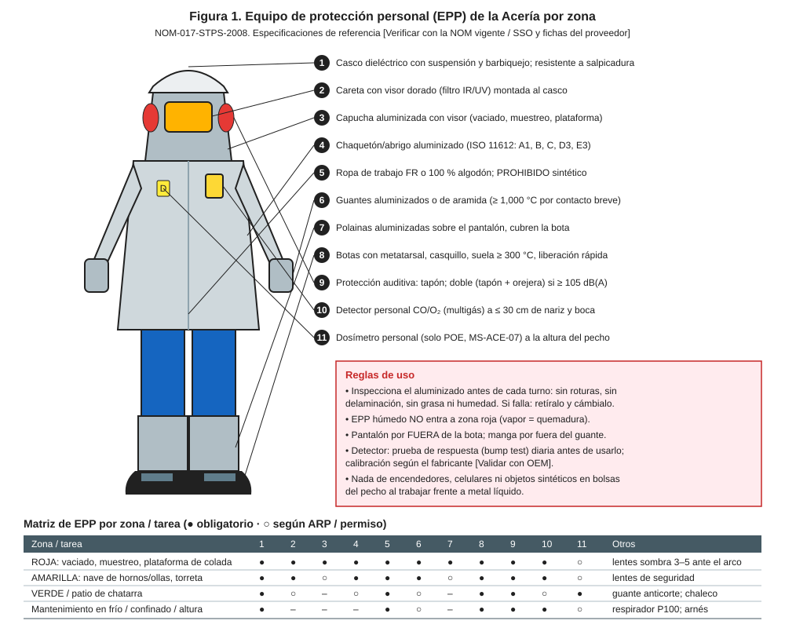
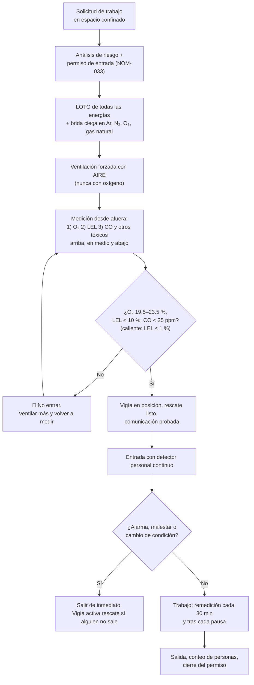

# MS-ACE-05 — Espacios confinados (ollas, distribuidores, fosas, ductos de humos, casa de bolsas)

| Código | Versión | Estado | Área | Dueño del proceso | Elaboró | Revisión técnica | Revisión de seguridad | Aprobó | Fecha | Próxima revisión |
|---|---|---|---|---|---|---|---|---|---|---|
| MS-ACE-05 | 0.2 | Borrador para validación | Acería: ollas, distribuidores, EAF, fosas, ductos, casa de bolsas, silos y tolvas | C-16 Especialista de Seguridad e Higiene de Acería | experto-seguridad-salud | experto-operativo-metalurgia | experto-seguridad-salud — visto bueno con observaciones, 2026-09-25 | Pendiente (Gerente de Acería / Director) | 2026-09-25 | 2027-09-25 |

> ⚠️ **Mensaje clave.** En la Acería los espacios confinados matan por **atmósfera invisible**: argón o nitrógeno que desplazan el oxígeno (tapón poroso de olla), CO en ductos y casa de bolsas, DRI que consume O₂ en silos. **Nadie entra sin permiso, sin medición en el orden O₂ → LEL → tóxicos, sin vigía afuera y sin rescate listo.** Más de la mitad de las víctimas en espacios confinados son **rescatistas improvisados**: el vigía **nunca** entra. Estándar corporativo **CRS-02**.

## 1. Objetivo y alcance

**Objetivo:** controlar el ingreso y el trabajo en espacios confinados conforme a la NOM-033-STPS-2015.

**Espacio confinado:** lugar con acceso o salida restringidos, no diseñado para ocupación continua, donde puede existir una atmósfera peligrosa, atrapamiento o hundimiento.

**Inventario de la Acería** (C-16 mantiene el inventario completo y señalizado):

| Espacio | Peligros principales |
|---|---|
| Olla de acero (reparación de refractario) | Argón del tapón poroso (asfixia), calor residual, caída de ladrillos, polvo de sílice/MgO |
| Olla de escoria | Calor, gases, caída |
| Distribuidor (demolición y preparación) | Calor, polvo, caída de material |
| EAF con bóveda colocada (reparación de solera y bancos) | CO residual, calor, agua de paneles, energía eléctrica (LOTO) |
| Fosas de vaciado, de escoria, de cascarilla (scale pit) de CC | Deficiencia de O₂, agua, lodo, H₂S por descomposición [Supuesto], CO |
| Ductos de humos, cámara de combustión, 4.º agujero | **CO**, calor, polvo, caída de incrustaciones |
| Casa de bolsas (compartimentos y tolvas) | CO, polvo, O₂ bajo, atrapamiento en tolva |
| Silos de DRI/HBI, cal y tolvas de ferroaleaciones | **O₂ bajo por oxidación del DRI**, H₂/CO, sepultamiento |
| Tanques y pozos de agua, torres de enfriamiento | Ahogamiento, químicos de tratamiento, O₂ bajo |
| Cámara de rociado de CC (con máquina parada) | Vapor, calor, lodo, energía (LOTO) |

## 2. Roles y responsabilidades

| Rol | Responsabilidad en este proceso | R/A/C/I |
|---|---|---|
| C-16 Especialista de Seguridad e Higiene | Dueño; inventario; aprueba el análisis de riesgo; audita | A |
| C-04 / C-11 / C-15 (emisor del permiso) | Emite el permiso de entrada; verifica LOTO, mediciones, vigía y rescate | R |
| Medidor autorizado (S-21 Instrumentista o C-16) | Mide la atmósfera en el orden y las alturas definidas | R |
| Vigía (persona certificada) | Permanece afuera todo el tiempo; controla entradas; comunica; activa rescate | R |
| Entrantes (S-08, S-15, S-24, S-19, S-23, contratistas) | Usan detector personal; salen al primer aviso | R |
| Brigada de rescate de espacios confinados (programa de formación S-05 Brigadas; no confundir con el rol S-05 Operador de Patio) | Rescate con equipo en ≤ 10 min [Supuesto] | R |
| C-15 Especialista de Refractarios | Criterios de enfriamiento y estabilidad del refractario en ollas y distribuidores | C |

## 3. Descripción del proceso

## 4. Equipos y maquinaria

| Equipo / componente | Función | Especificación clave | Condición para operar (verificación) |
|---|---|---|---|
| Detector multigás con bomba | Medición previa desde afuera | O₂, LEL (catalítico o IR), CO, H₂S; bomba y manguera de ≥ 3 m | Bump test el mismo día; calibración vigente según fabricante [Validar con OEM] |
| Detector personal (4 gases) | Monitoreo continuo del entrante | Alarma audible, visual y vibración; A1 y A2 configuradas (tabla 5) | Bump test diario; batería ≥ 12 h |
| Ventilador/extractor con manga | Renueva la atmósfera | Aire limpio; ≥ 20 renovaciones por hora [Supuesto]; toma lejos de escapes | Probado; manga sin roturas |
| Trípode con malacate y línea de vida retráctil con rescate | Rescate vertical sin entrar | Para accesos verticales > 1.5 m [Supuesto]; capacidad según NOM-009 | Inspección antes de uso |
| Arnés de cuerpo completo con argollas dorsales/hombros | Extracción del entrante | NOM-009 | Inspección visual |
| Radio o sistema de comunicación | Contacto entrante–vigía | Probado antes de entrar | Prueba al inicio |
| Equipo de respiración autónomo (ERA) | Rescate | ≥ 30 min de autonomía | Presión de cilindro ≥ 90 % |
| Bridas ciegas y carretes | Aislamiento positivo de gases | Clase de presión de la línea | Registradas en el permiso |
| Iluminación de baja tensión | Iluminar sin riesgo eléctrico | ≤ 24 V o a prueba de explosión [Verificar NOM-033] | Inspección |

## 5. Parámetros de operación

**Criterios de atmósfera** (NOM-033-STPS-2015 y NOM-010-STPS-2014) [Verificar con la NOM vigente / SSO]:

| Parámetro | Unidad | Objetivo | Rango para entrar | Alarma / límite | Acción si está fuera de rango | Dónde se mide |
|---|---|---|---|---|---|---|
| Oxígeno | % vol | 20.9 | 19.5–23.5 | A1 < 19.5 % · A2 > 23.5 % | 🛑 No entrar / salir. Buscar fuga de Ar/N₂ (bajo) o de O₂ (alto) | Detector con bomba y personal |
| Inflamables (gas natural, H₂, CO como inflamable) | % LEL | 0 | < 10 % LEL | A1 10 % LEL (no entrar / salir) · A2 20 % LEL (evacuar el sector) | 🛑 No entrar / salir; eliminar fuente; ventilar. ≥ 20 % LEL: evacuación y corte general del gas (MS-ACE-06) | Detector |
| Inflamables para trabajo en caliente dentro del espacio | % LEL | 0 | 0 % LEL detectable (≤ 1 % de lectura del equipo, sostenida) [Supuesto conservador] | > 1 % de lectura | No iniciar o detener el trabajo en caliente; ventilar y volver a medir | Detector continuo |
| Monóxido de carbono (CO) | ppm | 0 | < 25 (VLE-PPT NOM-010) | A1 25 ppm (salir) · A2 200 ppm (evacuar el sector) [Verificar NOM-010] | 🛑 Salir; ventilar; buscar la fuente | Detector |
| H₂S (fosas, tanques) | ppm | 0 | < 1 [Verificar NOM-010] | A1 1 ppm · A2 5 ppm [Verificar] | Salir; ventilar | Detector |
| Temperatura interior (olla, distribuidor, EAF) | °C / WBGT | ≤ 40 °C en superficies | WBGT según MS-ACE-08 | > 50 °C en contacto [Supuesto] | Esperar enfriamiento; régimen trabajo/descanso | Pirómetro + medidor WBGT |
| Tiempo máximo sin remedición documentada | min | 30 | ≤ 30 (monitoreo continuo siempre) | > 30 min o tras pausa > 15 min | Volver a medir antes de reingresar | Registro del vigía |
| Comunicación vigía–entrante | min | cada 5 | ≤ 5 | Sin respuesta | Ordenar salida; si no sale, activar rescate | Radio / voz |
| Tiempo de llegada del rescate | min | ≤ 5 | ≤ 10 [Supuesto] | > 10 min | 🛑 No se emite el permiso | Simulacro |

> **Criterio único de LEL de la Acería** (lo citan todos los manuales MO, MM y MS): **entrada permitida con < 10 % LEL**; **trabajo en caliente solo con 0 % LEL detectable (≤ 1 % de lectura del equipo)**; **salir a ≥ 10 % LEL y evacuar el sector a ≥ 20 % LEL**. No se exige 0 % LEL para entrar: esa exigencia se reserva al trabajo en caliente.

**Orden y forma de medir (obligatorio):**
1. **O₂ primero** (un O₂ bajo invalida la lectura del sensor catalítico de LEL y es el peligro más rápido).
2. **LEL segundo** (inflamables).
3. **Tóxicos tercero** (CO, H₂S).
4. Mide **desde afuera** con bomba y manguera, en **tres alturas: arriba, en medio y abajo**, y cada 1.2 m de profundidad en fosas y silos: el argón, el CO₂ y el H₂S se acumulan abajo; el gas natural y el H₂ arriba; el CO se mezcla.
5. Espera en cada punto el tiempo de respuesta del detector (≈ 2 s por cada 30 cm de manguera + tiempo de respuesta del sensor) [Validar con OEM del detector].
6. Registra cada lectura en el permiso con hora y altura.

## 6. Seguridad

### 6.1 Peligros y controles críticos

| Peligro | Consecuencia | Control crítico | Verificación |
|---|---|---|---|
| Argón del tapón poroso de la olla | Asfixia sin aviso (1–2 respiraciones en O₂ < 10 %) | Desconexión y brida ciega o tapón en la línea de argón + LOTO; detector de O₂ continuo | Firma en el permiso; lectura de O₂ |
| CO en ductos, cámara de combustión, casa de bolsas | Intoxicación, muerte | LOTO del ventilador y de compuertas; ventilación; medición | Lectura CO < 25 ppm |
| O₂ bajo en silo de DRI | Asfixia | Purga, ventilación, medición a varias alturas; arnés con línea de rescate | Lecturas registradas |
| Sepultamiento en silo o tolva (material colgado) | Asfixia mecánica | Silo vacío; material colgado se derriba desde afuera; nunca pararse sobre material | Visual + permiso |
| Enriquecimiento de O₂ (fuga de lanza/quemador) | Incendio violento de ropa | Brida ciega en O₂; O₂ ≤ 23.5 % | Lectura de O₂ |
| Calor residual del refractario | Golpe de calor, quemadura | Enfriamiento; WBGT; relevos | MS-ACE-08 |
| Caída de ladrillos o incrustaciones | Golpe | Demolición de arriba hacia abajo; nadie debajo | Supervisión |
| Energías (eléctrica, hidráulica, agua) | Electrocución, aplastamiento | LOTO (MS-ACE-02) | Prueba de energía cero |
| Rescate improvisado | Víctimas múltiples | El vigía nunca entra; rescate solo con ERA y equipo | Simulacro |

### 6.2 EPP obligatorio

Casco con barbiquejo, lentes, botas, guantes, ropa FR o algodón, protección auditiva, **arnés de cuerpo completo** (si hay acceso vertical o riesgo de caída), **detector personal de 4 gases** a ≤ 30 cm de la nariz y boca, respirador con filtro P100 para polvo de refractario o de casa de bolsas. Para rescate: ERA.

### 6.3 Permisos, bloqueos y zonas de exclusión

- **Permiso de entrada** (vigencia máxima: 1 turno de 12 h; se renueva al cambio de turno con nueva medición).
- LOTO completo con **aislamiento positivo** (brida ciega, desconexión física o doble bloqueo y purga) de argón, N₂, O₂, gas natural, agua y vapor.
- Acceso señalizado: "ESPACIO CONFINADO — ENTRADA SOLO CON PERMISO".
- Trabajo en caliente dentro: permiso adicional NOM-027 y 0 % LEL detectable sostenido (≤ 1 % de lectura del equipo), con monitoreo continuo.

## 7. Calidad

| Variable crítica de calidad | Especificación | Método / frecuencia | Registro | Defecto si falla |
|---|---|---|---|---|
| Reconexión del argón del tapón poroso al terminar | Flujo de prueba en rango (FT-ACE-001: suave 50–150 NL/min) | Prueba de flujo antes del ciclo | Registro de olla | Sin agitación: inclusiones, S alto |
| Limpieza de la olla o distribuidor (sin restos de ladrillo o herramientas) | Cero objetos extraños | Inspección final | Permiso cerrado | Inclusiones exógenas; obstrucción de buza |
| Secado del refractario reparado | Curva OEM | Registro de secado | Registro de C-15 | Explosión por humedad (MS-ACE-03) |

## 8. Procedimiento paso a paso

| # | Paso | Cómo hacerlo (detalle y medición) | Criterio de aceptación | ★ | Rol |
|---|---|---|---|---|---|
| 1 | Identifica el espacio y sus peligros | Consulta el inventario; llena el análisis de riesgo con peligros específicos (Ar, CO, O₂ bajo, calor, sepultamiento) | Análisis firmado por C-16 | ★ | Emisor |
| 2 | Aísla todas las energías y gases | LOTO (MS-ACE-02) + brida ciega o desconexión de Ar/N₂/O₂/GN; en ollas, desconecta la manguera del tapón poroso y tapa | Aislamiento positivo anotado | ★ | S-19, S-22, S-20 |
| 3 | Ventila | Ventilación forzada con aire limpio ≥ 15 min antes de medir [Supuesto]; nunca con oxígeno | Ventilador operando | | S-19 |
| 4 | Prueba el detector | Bump test con gas de prueba; verifica fecha de calibración | Detector responde en las 4 celdas | ★ | Medidor |
| 5 | Mide desde afuera | Orden O₂ → LEL → CO/H₂S; arriba, en medio y abajo; espera el tiempo de respuesta en cada punto | Lecturas dentro del rango de la tabla 5 | ★ | Medidor |
| 6 | Prepara el rescate | Trípode y malacate montados (acceso vertical); ERA disponible; brigada avisada y tiempo de llegada ≤ 10 min | Rescate listo antes de entrar | ★ | Emisor, brigada |
| 7 | Posiciona al vigía | Vigía en el acceso, con lista de entrantes, radio y detector; no tiene otra tarea | Vigía dedicado | ★ | Vigía |
| 8 | Firma y entra | Emisor firma; cada entrante firma entrada y lleva detector personal encendido en la zona respiratoria | Registro de entradas | ★ | Entrantes |
| 9 | Monitorea | Detector continuo; vigía confirma comunicación cada 5 min; remedición documentada cada 30 min y tras pausas > 15 min | Sin alarmas | ★ | Vigía, entrantes |
| 10 | Sal al primer aviso | Alarma del detector, malestar (mareo, dolor de cabeza), orden del vigía o cambio de condición: sal sin terminar la tarea | Salida inmediata | ★ | Entrantes |
| 11 | Rescate (si alguien no sale o no responde) | Vigía activa la alarma y la brigada; intenta extracción con malacate desde afuera; **no entra** | Rescate sin víctimas adicionales | ★ | Vigía, brigada |
| 12 | Cierra | Cuenta a las personas; retira herramientas; cierra el permiso; retira LOTO (MS-ACE-02) | Permiso cerrado | | Emisor |

## 9. Condiciones anormales y respuesta

| Síntoma / alarma | Causa probable | Acción inmediata | A quién avisar |
|---|---|---|---|
| O₂ < 19.5 % | Fuga de argón o N₂; DRI oxidándose | Salir; revisar aislamiento; ventilar | C-16, emisor |
| O₂ > 23.5 % | Fuga de O₂ de lanzas o cortes | Salir; nada de chispas; aislar O₂; ventilar | C-16 |
| CO ≥ 25 ppm | Ductos, escoria caliente, combustión | Salir; ventilar; no reingresar hasta < 25 ppm | C-16 |
| CO ≥ 200 ppm | Fuente activa | Evacuar el sector; solo brigada con ERA | C-04, C-16 |
| ≥ 10 % LEL | Gas natural, H₂ | Salir; eliminar ignición; aislar | C-04, C-16 |
| ≥ 20 % LEL | Fuga activa de gas natural o H₂ | Evacuar el sector; corte general del gas por ESD (MS-ACE-06); reingreso solo con < 10 % LEL medido por C-16 | C-04, C-16 |
| > 1 % de lectura de LEL durante trabajo en caliente | Paso de gas, purga incompleta | Detener el trabajo en caliente; ventilar; volver a medir | Emisor, C-16 |
| Entrante no responde | Asfixia, golpe de calor, lesión | Alarma; malacate desde afuera; brigada con ERA | C-04, servicio médico |
| Detector falla o batería baja | Mantenimiento | Salir; sustituir detector | Emisor |
| Material colgado en silo | Puente de material | Salir; derribar desde afuera con método aprobado | C-16 |

## 10. Registros

- Inventario de espacios confinados de la Acería (C-16).
- Permiso de entrada con análisis de riesgo, mediciones (hora, altura, valores), entradas/salidas y cierre.
- Registros de bump test y calibración de detectores.
- Registros de simulacros de rescate en espacio confinado (≥ 1 por cuadrilla al año [Supuesto]).

## 11. Competencia requerida y certificación

| Rol | Nivel requerido (1–4) | Formación teórica (h) | OJT supervisado (h / eventos) | Evaluación (pasos ★) | Vigencia |
|---|---|---|---|---|---|
| Entrante (S-03, S-08, S-15, S-19, S-23, S-24, contratistas) | 3 | 8 (CRS-02, NOM-033) | 3 entradas supervisadas | Pasos 8, 9, 10 | 12 meses [Verificar calendario regulatorio] |
| Vigía | 3 | 8 + 4 (funciones del vigía, rescate sin entrada) | 3 vigilancias supervisadas | Pasos 7, 9, 11 | 12 meses |
| Medidor autorizado | 4 | 8 (detección de gases) | 10 mediciones | Pasos 4, 5 | 12 meses |
| Emisor del permiso (C-04, C-11, C-15) | 4 | 12 | 5 permisos con tutor | Pasos 1, 2, 6 | 12 meses (espacios confinados) |
| Brigada de rescate | 4 | 24 (S-05 Brigadas) + ERA | 2 simulacros al año | Rescate en ≤ 10 min | 12 meses |

**Lista corta de verificación de pasos ★:**
1. ¿Aísla el argón del tapón poroso antes de entrar a una olla?
2. ¿Mide en el orden O₂ → LEL → tóxicos y en tres alturas?
3. ¿Conoce los límites: O₂ 19.5–23.5 %; < 10 % LEL para entrar, 0 % LEL detectable (≤ 1 % de lectura) para trabajo en caliente, evacuar a ≥ 20 % LEL; CO < 25 ppm (salir a 25, evacuar a 200)?
4. ¿El vigía permanece afuera y sabe activar el rescate sin entrar?
5. ¿Sale al primer aviso sin terminar la tarea?
6. ¿Confirma el rescate listo (≤ 10 min), el aislamiento positivo y el vigía dedicado antes de firmar la entrada?

## 12. Referencias

- NOM-033-STPS-2015 (espacios confinados), NOM-010-STPS-2014 (agentes químicos), NOM-005-STPS-1998, NOM-009-STPS-2011, NOM-017-STPS-2008, NOM-027-STPS-2008, NOM-015-STPS-2001 [Verificar con la NOM vigente / SSO].
- CRS-02 Entrada a espacios confinados; S-05 Brigadas (rescate).
- FT-ACE-001 (argón, humos, DRI); MM-OLL-01, MM-EAF-03; MS-ACE-02, 06, 08, 09, 10.

## 13. Control de cambios

| Versión | Fecha | Cambio | Autor |
|---|---|---|---|
| 0.1 | 2026-09-25 | Creación del borrador para validación | experto-seguridad-salud (con criterio técnico de experto-operativo-metalurgia) |
| 0.2 | 2026-09-25 | Revisión cruzada: criterio único de LEL (entrada < 10 %, caliente ≤ 1 % de lectura, evacuación ≥ 20 %); emisor a 12 meses; S-03 como entrante (MM-EAF-03); aclaración del programa S-05 Brigadas | experto-seguridad-salud |
