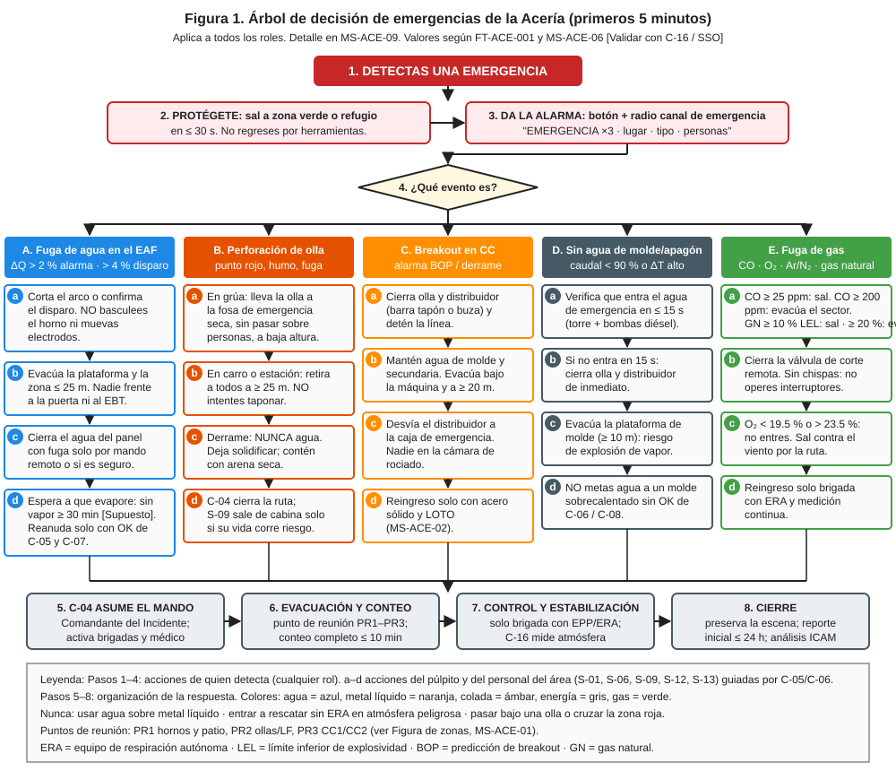
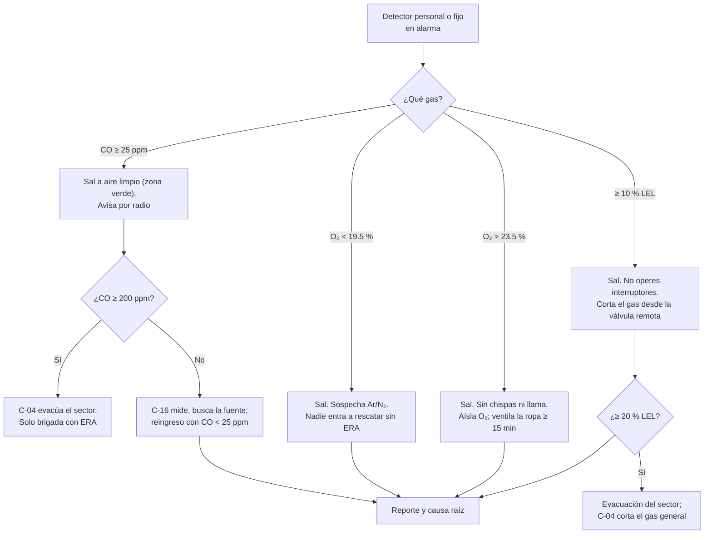

# MS-ACE-06 — Gases: CO, enriquecimiento de O₂, argón y N₂ (asfixia) y gas natural

| Código | Versión | Estado | Área | Dueño del proceso | Elaboró | Revisión técnica | Revisión de seguridad | Aprobó | Fecha | Próxima revisión |
|---|---|---|---|---|---|---|---|---|---|---|
| MS-ACE-06 | 0.1 | Borrador para validación | Toda la Acería | C-16 Especialista de Seguridad e Higiene de Acería | experto-seguridad-salud | experto-operativo-metalurgia | experto-seguridad-salud | Pendiente (Gerente de Acería / Director) | 2026-09-25 | 2027-09-25 |

> ⚠️ **Mensaje clave.** Ninguno de estos gases se ve y casi ninguno se huele. **Tu detector es tu nariz.** Lleva el detector personal encendido y probado, y obedece sus alarmas: **CO 25 ppm → sal del área; CO 200 ppm → evacuación del sector; O₂ < 19.5 % o > 23.5 % → sal; gas natural ≥ 10 % LEL → sal y sin chispas.** [Verificar con la NOM vigente / SSO — ver justificación en 5.1]

## 1. Objetivo y alcance

**Objetivo:** prevenir intoxicación por CO, asfixia por argón o nitrógeno, incendios por enriquecimiento de oxígeno e incendios o explosiones por gas natural, mediante detección, aislamiento, ventilación y respuesta.

**Aplica a:** EAF (lanzas y quemadores de O₂ y gas natural, humos con CO, 4.º agujero, cámara de combustión y casa de bolsas), LF (argón 50–600 NL/min), ollas (tapón poroso, precalentadores de gas natural), CC1/CC2 (argón del tubo protector, de la barra tapón y de la SEN; oxicorte con O₂ + gas natural; precalentadores de distribuidor), redes y estaciones de válvulas, cilindros y cuartos de gases, y patio (cortes con oxígeno).

## 2. Roles y responsabilidades

| Rol | Responsabilidad en este proceso | R/A/C/I |
|---|---|---|
| C-16 Especialista de Seguridad e Higiene | Dueño; mapa de detectores fijos; límites de alarma; evaluación NOM-010 | A |
| C-04 Jefe de Turno | Ordena evacuaciones de sector; coordina respuesta | R |
| C-12 / S-21 Instrumentista | Mantenimiento y calibración de detectores fijos y portátiles | R |
| S-01, S-06, S-12 (púlpitos) | Vigilan alarmas de detectores fijos y cortan el suministro de gas | R |
| Todo el personal de nave | Porta detector personal probado; obedece alarmas | R |
| S-16 Operador de Corte | Mantiene sin fugas el oxicorte; revisa mangueras | R |
| C-07 / C-08 Ingenieros de Proceso | Ajustes de proceso que reducen emisiones (presión del horno −5 a −15 Pa) | C |

## 3. Descripción del proceso

| Gas | Dónde aparece en la Acería | Densidad relativa al aire | Peligro | Cómo se detecta |
|---|---|---|---|---|
| **CO** (monóxido de carbono) | Humos del EAF y del LF, fugas en ductos, cámara de combustión, casa de bolsas, ollas de escoria, fosas, oxicorte | 0.97 (se mezcla) | Tóxico: se une a la hemoglobina | Sensor electroquímico de CO |
| **O₂** (oxígeno, enriquecimiento) | Lanzas y quemadores (4 × 2,500 Nm³/h por horno), oxicorte, cilindros | 1.1 | Hace que la ropa y la grasa ardan con violencia | Sensor de O₂ (> 23.5 %) |
| **Ar / N₂** (argón, nitrógeno) | LF (400–600 NL/min en agitación fuerte), tapón poroso, tubo protector, SEN (3–8 NL/min), purgas | Ar 1.38 (se acumula abajo) / N₂ 0.97 | Asfixia sin aviso: desplazan el O₂ | Sensor de O₂ (< 19.5 %) |
| **Gas natural** (CH₄) | Quemadores del EAF, precalentadores de olla y distribuidor, oxicorte | 0.55 (sube) | Incendio y explosión; LEL = 5 % vol | Sensor LEL |
| **H₂** (hidrógeno) | Agua en contacto con metal o DRI caliente | 0.07 (sube rápido) | Explosión; LEL = 4 % vol | Sensor LEL (catalítico) |

## 4. Equipos y maquinaria

| Equipo / componente | Función | Especificación clave | Condición para operar (verificación) |
|---|---|---|---|
| Detector personal multigás (O₂, CO, LEL, H₂S) | Protección individual | Alarmas A1/A2 de la tabla 5.1; registro de datos | Bump test diario antes del turno; calibración según fabricante (típico 30–180 días) [Validar con OEM] |
| Detectores fijos de CO | Plataformas del EAF y LF, torreta, casa de bolsas, fosas, cuartos de control | Alarma local (sirena y luz) y en púlpito | Prueba con gas cada mes [Supuesto] |
| Detectores fijos de O₂ | Estaciones de válvulas de Ar/N₂/O₂, fosas, cuartos de gases, zona del LF | Alarma < 19.5 % y > 23.5 % | Prueba mensual [Supuesto] |
| Detectores fijos de LEL | Estación de gas natural, precalentadores, oxicorte | Alarma 10 % y 20 % LEL; corte automático a 20 % [Supuesto] | Prueba mensual |
| Válvulas de corte remoto (ESD) de gas natural y O₂ | Cortan el suministro desde el púlpito o un botón | Cierre ≤ 5 s [Validar con OEM] | Prueba trimestral [Supuesto] |
| Sistema de extracción (DES, campana) | Mantiene el horno en depresión | Presión del horno −5 a −15 Pa (FT-ACE-001) | Indicador en HMI |
| Arrestaflamas y válvulas antirretorno | Oxicorte y precalentadores | En cada línea | Inspección mensual |
| ERA | Rescate y reingreso | ≥ 30 min | Presión ≥ 90 % |

## 5. Parámetros de operación

### 5.1 Límites de exposición y alarmas

| Gas | Unidad | Referencia normativa | Alarma A1 (acción individual) | Alarma A2 (acción de sector) | Justificación |
|---|---|---|---|---|---|
| CO | ppm | VLE-PPT 25 ppm (NOM-010-STPS-2014) [Verificar con la NOM vigente / SSO]; IDLH 1,200 ppm (NIOSH) | **25 ppm: sal a zona verde**, avisa; no reingreses hasta < 25 ppm | **200 ppm: evacuación del sector** por C-04; solo brigada con ERA | A1 = VLE-PPT para no acumular dosis; A2 = valor techo de NIOSH (200 ppm) que no debe superarse ni un instante |
| O₂ bajo | % vol | 19.5 % (NOM-033-STPS-2015) | **< 19.5 %: sal** | < 19.5 % en detector fijo: evacuación del área | Por debajo de 16 % el juicio se altera; < 10 % inconsciencia |
| O₂ alto | % vol | 23.5 % (NOM-033-STPS-2015) | **> 23.5 %: sal, sin chispas** | > 23.5 % en fijo: aislar O₂ y evacuar | La ropa enriquecida arde con violencia |
| Gas natural / H₂ | % LEL | 10 % LEL como límite de trabajo (NOM-033) | **10 % LEL: sal, sin chispas, corta el gas** | **20 % LEL: evacuación del sector y corte general** | 10 % LEL de CH₄ = 0.5 % vol; margen amplio antes de la mezcla explosiva |
| Humos metálicos (Mn, Fe₂O₃) | mg/m³ | VLE de NOM-010-STPS-2014 [Verificar] | Evaluación de higiene (C-16) | — | Exposición crónica; control por extracción y respirador |

**Efectos del CO (referencia de capacitación):** 25 ppm = límite de 8 h; 200 ppm = dolor de cabeza en 2–3 h; 400 ppm = dolor intenso en 1–2 h; 800 ppm = mareo y náusea en 45 min, inconsciencia en 2 h; 1,600 ppm = muerte en < 2 h.

### 5.2 Parámetros de equipos

| Parámetro | Unidad | Objetivo | Rango normal | Alarma / límite | Acción si está fuera de rango | Dónde se mide |
|---|---|---|---|---|---|---|
| Presión del horno | Pa | −10 | −5 a −15 | > 0 Pa (positiva) | Reduce O₂/potencia; revisa el DES; aleja al personal de la puerta | HMI del EAF |
| Bump test del detector personal | — | Diario | Pasa | Falla | 🛑 No uses el detector; cámbialo | Estación de prueba |
| Calibración del detector | días | Según fabricante | Vigente | Vencida | Fuera de uso | Etiqueta |
| Argón en agitación fuerte (LF) | NL/min | Según receta | 400–600 | Fuga en conexiones | Aísla y repara; mide O₂ en la zona | HMI del LF |
| Presión de gas natural en la estación | bar | Según OEM | [Validar con OEM] | Baja o alta | Corte por ESD | HMI |

## 6. Seguridad

### 6.1 Peligros y controles críticos

| Peligro | Consecuencia | Control crítico | Verificación |
|---|---|---|---|
| CO por presión positiva del horno o fugas de ductos | Intoxicación | DES en operación; detectores fijos y personales | Presión del horno en HMI; bump test |
| Argón acumulado en fosas, bajo la plataforma del LF o dentro de la olla | Asfixia | Detector de O₂; espacio confinado (MS-ACE-05) | Lectura de O₂ |
| Enriquecimiento de O₂ en ropa (lanzas, fugas) | Quemadura grave | Aislamiento de O₂; prohibido "soplar" ropa con O₂; ropa sin grasa | Inspección de mangueras |
| Fuga de gas natural | Incendio, explosión | Detectores LEL; ESD; arrestaflamas | Prueba mensual |
| Retroceso de llama en oxicorte o precalentador | Explosión en la línea | Arrestaflamas y antirretorno; secuencia de encendido OEM | Inspección |
| Rescate sin ERA | Víctimas múltiples | Solo la brigada con ERA | Simulacro |

### 6.2 EPP obligatorio

Detector personal multigás encendido y en la **zona respiratoria (≤ 30 cm de la nariz y boca)** para todo el personal de nave de hornos, LF, torreta, fosas y casa de bolsas. Ropa **sin grasa ni aceite** cerca de O₂. Respirador P100 para humos metálicos según la evaluación de higiene.

### 6.3 Permisos, bloqueos y zonas de exclusión

- Trabajos en líneas de gas: LOTO con doble bloqueo y purga (MS-ACE-02) y permiso de trabajo en caliente (NOM-027) si aplica.
- Área de estación de válvulas y cuartos de gases: **acceso restringido** y señalizado; prohibido fumar y llamas.
- Zonas bajas donde se acumula argón (fosas, sótanos del LF y de CC): tratadas como espacio confinado cuando no tienen ventilación permanente.

## 7. Calidad

| Variable crítica de calidad | Especificación | Método / frecuencia | Registro | Defecto si falla |
|---|---|---|---|---|
| Sello de argón del tubo protector y SEN | Argón en rango; sin entrada de aire | Continuo | HMI de CC | Reoxidación, nitrógeno alto, obstrucción (clogging) |
| Agitación de argón en el LF | Suave 50–150 NL/min ≥ 8 min antes del envío | Por colada | Hoja del LF | Inclusiones |
| Pureza de gases (O₂, Ar) | Especificación de proveedor | Certificado por lote | Almacén | N₂ alto, oxidación |

## 8. Procedimiento paso a paso

| # | Paso | Cómo hacerlo (detalle y medición) | Criterio de aceptación | ★ | Rol |
|---|---|---|---|---|---|
| 1 | Recoge y prueba tu detector | Bump test en la estación; revisa batería (≥ 12 h) y fecha de calibración | Pasa la prueba | ★ | Todo el personal |
| 2 | Pórtalo bien | Enciéndelo en aire limpio (autocero); colócalo a ≤ 30 cm de la nariz y boca, sin cubrirlo con ropa | Detector visible y encendido | ★ | Todo el personal |
| 3 | Revisa los detectores fijos en HMI | Al inicio del turno: sin fallas ni alarmas activas | Todos en línea | | S-01, S-06, S-12 |
| 4 | Vigila la presión del horno | −5 a −15 Pa; si es positiva, aleja al personal de la puerta y de la bóveda | Presión negativa | ★ | S-01 |
| 5 | Responde a A1 | CO 25 ppm / O₂ fuera de 19.5–23.5 % / 10 % LEL: sal a zona verde por la ruta de escape, avisa por radio con lugar y lectura | Salida inmediata | ★ | Todos |
| 6 | Responde a A2 | CO 200 ppm / 20 % LEL / alarma de fijo: C-04 evacúa el sector y corta el gas por ESD | Sector evacuado | ★ | C-04, púlpitos |
| 7 | No rescates sin ERA | Si alguien cae en una zona con gas: alarma, no entres; espera a la brigada | Sin víctimas adicionales | ★ | Todos |
| 8 | Reingreso | C-16 o brigada mide con ERA; reingreso solo con CO < 25 ppm, O₂ 19.5–23.5 %, 0 % LEL | Lecturas registradas | ★ | C-16 |
| 9 | Oxicorte y precalentadores | Revisa mangueras, arrestaflamas y antirretorno antes de encender; secuencia OEM | Sin fugas (prueba con agua jabonosa solo en frío) | ★ | S-16, S-15, S-08 |
| 10 | Entrega del detector | Descarga los datos (picos de exposición) y ponlo a cargar | Datos registrados | | Todo el personal |

## 9. Condiciones anormales y respuesta

| Síntoma / alarma | Causa probable | Acción inmediata | A quién avisar |
|---|---|---|---|
| Dolor de cabeza, mareo, náusea sin alarma | CO; detector apagado o mal ubicado | Sal a aire limpio; servicio médico; revisa el detector | C-04, servicio médico |
| Persona inconsciente cerca del LF o de una fosa | Argón / O₂ bajo o CO | Alarma; no entres sin ERA; brigada | C-04 |
| Llama o chispas anormales en ropa u objetos | Enriquecimiento de O₂ | Aléjate; sin fuentes de ignición; aísla O₂ | C-04 |
| Olor a gas (mercaptano) o sonido de fuga | Fuga de gas natural | Sal; no operes interruptores; ESD | C-04 |
| Detector fijo en falla | Sensor dañado | Detector portátil en la zona hasta su reparación | S-21 |
| Presión positiva del horno sostenida | Falla del DES, ventilador | Reduce O₂ y potencia; evacúa plataforma | C-05, C-12 |

## 10. Registros

- Registro diario de bump test y calibraciones (portátiles y fijos).
- Descargas de datos de detectores personales (picos > 25 ppm CO investigados).
- Mapa de detectores fijos y pruebas mensuales.
- Evaluación de agentes químicos NOM-010 (C-16) y exámenes médicos del personal expuesto.
- Pruebas de las válvulas ESD.

## 11. Competencia requerida y certificación

| Rol | Nivel requerido (1–4) | Formación teórica (h) | OJT supervisado (h / eventos) | Evaluación (pasos ★) | Vigencia |
|---|---|---|---|---|---|
| Todo el personal de nave | 2 | 4 (gases de la Acería, uso de detector) | Demostración | Pasos 1, 2, 5, 7 | 12 meses |
| S-01, S-06, S-12 | 3 | 6 | 5 eventos o simulador | Pasos 4, 6 | 24 meses (TD-P07) |
| S-16, S-15, S-08 | 3 | 6 (oxicorte y gas natural, CRS-10, NOM-027) | 10 encendidos | Paso 9 | 24 meses |
| S-21 (detectores) | 4 | 16 (calibración) | 10 calibraciones | Mantenimiento de detectores | 24 meses |
| C-04, C-16 | 4 | 8 | Simulacro | Pasos 6, 8 | 24 meses |

**Lista corta de verificación de pasos ★:**
1. ¿Hace el bump test y porta el detector en la zona respiratoria?
2. ¿Conoce las alarmas CO 25/200 ppm, O₂ 19.5/23.5 %, 10/20 % LEL y su acción?
3. ¿Sabe que el argón no se huele y se acumula abajo?
4. ¿Se niega a rescatar sin ERA y activa la alarma?

## 12. Referencias

- NOM-010-STPS-2014 (agentes químicos contaminantes), NOM-005-STPS-1998, NOM-018-STPS-2015 (comunicación de peligros, SGA), NOM-033-STPS-2015, NOM-027-STPS-2008, NOM-020-STPS-2011, NOM-017-STPS-2008 [Verificar con la NOM vigente / SSO]. NIOSH Pocket Guide (CO: techo 200 ppm, IDLH 1,200 ppm) como referencia.
- CRS-10 Sistemas de gas e hidrógeno; hojas de datos de seguridad (HDS) de O₂, Ar, N₂, gas natural y CO.
- FT-ACE-001 (O₂, gas natural, argón, humos); MS-ACE-05, 09.

## 13. Control de cambios

| Versión | Fecha | Cambio | Autor |
|---|---|---|---|
| 0.1 | 2026-09-25 | Creación del borrador para validación | experto-seguridad-salud (con criterio técnico de experto-operativo-metalurgia) |
