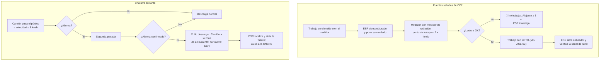

# MS-ACE-07 — Fuentes radiactivas (nivel de molde de CC2 y detección de chatarra)

| Código | Versión | Estado | Área | Dueño del proceso | Elaboró | Revisión técnica | Revisión de seguridad | Aprobó | Fecha | Próxima revisión |
|---|---|---|---|---|---|---|---|---|---|---|
| MS-ACE-07 | 0.1 | Borrador para validación | CC2 (medidores de nivel de Cs-137), patio de chatarra (pórtico), casa de bolsas | C-16 Especialista de Seguridad e Higiene de Acería (con el Encargado de Seguridad Radiológica) | experto-seguridad-salud | experto-operativo-metalurgia | experto-seguridad-salud | Pendiente (Gerente de Acería / Director) | 2026-09-25 | 2027-09-25 |

> ⚠️ **Mensaje clave.** La Acería tiene **dos riesgos radiológicos distintos**: (1) las **fuentes selladas de Cs-137** que miden el nivel del molde en las 6 líneas de CC2, y (2) las **fuentes huérfanas** que pueden llegar escondidas en la chatarra. Si una fuente se funde en el horno, contamina el acero, el polvo de la casa de bolsas y a las personas (caso real en México: Ciudad Juárez, 1983–84, una fuente de Co-60 terminó en varilla corrugada). **Solo el Encargado de Seguridad Radiológica (ESR) manipula el obturador. Nadie descarga un camión que hizo sonar el pórtico.**

## 1. Objetivo y alcance

**Objetivo:** mantener la exposición del personal tan baja como sea razonablemente posible (principio ALARA) y por debajo de los límites de la NOM-012-STPS-2012 y del Reglamento General de Seguridad Radiológica (CNSNS), y evitar la fusión de fuentes radiactivas.

**Aplica a:**
- 6 medidores de nivel de molde de CC2 con **fuente sellada de Cs-137** (FT-ACE-001 §5) — actividad por fuente según la licencia [Validar con ESR / OEM].
- **Pórtico detector de radiación** en la entrada de camiones del patio de chatarra y detectores del electroimán o de la báscula (si existen).
- Monitoreo del polvo de la casa de bolsas y de muestras de acero [Supuesto — Validar con C-16].
- CC1 usa sensor de corrientes parásitas (sin fuente radiactiva).

## 2. Roles y responsabilidades

| Rol | Responsabilidad en este proceso | R/A/C/I |
|---|---|---|
| **ESR Encargado de Seguridad Radiológica** (autorizado por la CNSNS) | Custodia de fuentes y llaves del obturador; pruebas de fuga; inventario; dosimetría; reportes a la CNSNS; respuesta a alarmas del pórtico | A (técnico) |
| C-16 Especialista de Seguridad e Higiene | Dueño del manual; integra el tema al sistema de SSO; auditoría | A |
| C-12 / S-21 Instrumentista (POE) | Mantenimiento de los medidores con el obturador cerrado y con el ESR | R |
| S-12 / S-14 Púlpito y Ayudante de Colada (CC2) | Respetan la señalización; avisan al ESR de daños al contenedor | R |
| S-25 Taller de moldes | Cambio de molde CC2 solo con obturador cerrado y verificado | R |
| S-05 Operador de Patio / C-17 Supervisor de Patio | Operan el pórtico; detienen y aíslan el camión en alarma | R |
| C-04 Jefe de Turno | Comandante del incidente en un evento radiológico (MS-ACE-09) | R |
| C-01 Gerente de Acería | Titular de la licencia ante la CNSNS [Supuesto] | A (legal) |

## 3. Descripción del proceso

**Protección básica: TIEMPO (menos tiempo cerca), DISTANCIA (la dosis baja con el cuadrado de la distancia: al doble de distancia, ¼ de la dosis) y BLINDAJE (el contenedor de plomo y el obturador).**

## 4. Equipos y maquinaria

| Equipo / componente | Función | Especificación clave | Condición para operar (verificación) |
|---|---|---|---|
| Medidor de nivel radiométrico (6, CC2) | Mide el nivel del acero en el molde | Fuente sellada de Cs-137 en contenedor de plomo con obturador; nivel ± 5 mm | Contenedor íntegro, señalizado, con placa de la fuente |
| Obturador con candado | Bloquea el haz para trabajos | Posiciones "abierto/cerrado" visibles | Candado del ESR cuando está cerrado por trabajo |
| Medidor de radiación portátil (tasa de dosis) | Verifica obturador, fugas y fuentes huérfanas | Lectura en μSv/h; calibración vigente (anual [Verificar]) | Prueba de funcionamiento con fuente de verificación |
| Dosímetros personales (TLD/OSL) | Dosis acumulada del POE | Lectura periódica por laboratorio acreditado | Portado a la altura del pecho |
| Dosímetro electrónico de lectura directa | Dosis durante tareas con fuente | Alarma de tasa y de dosis | Para ESR y S-21 en tareas con fuente |
| Pórtico detector de radiación | Detecta fuentes en camiones | Umbral de alarma sobre el fondo según fabricante [Validar con OEM / ESR] | Prueba diaria con fuente de verificación [Supuesto] |
| Zona de aislamiento de camiones | Estacionar camiones con alarma | Alejada ≥ 50 m de áreas ocupadas [Supuesto]; señalizada | Libre y delimitada |
| Contenedor blindado para fuentes huérfanas | Resguardo temporal | Aprobado por la CNSNS | Bajo custodia del ESR |

## 5. Parámetros de operación

| Parámetro | Unidad | Objetivo | Rango normal | Alarma / límite | Acción si está fuera de rango | Dónde se mide |
|---|---|---|---|---|---|---|
| Límite de dosis anual del POE | mSv/año | ALARA | Restricción interna ≤ 6 [Supuesto] | Límite legal según RGSR/CNSNS (el RGSR fija 50 mSv/año; ICRP 103 recomienda 20 mSv/año promedio) [Verificar con la NOM vigente / SSO] | Nivel de investigación: > 0.5 mSv en un periodo de lectura [Supuesto] → ESR investiga | Dosímetro |
| Dosis para personal no POE | mSv/año | ≈ 0 | < 1 (referencia de público) [Verificar con RGSR/CNSNS] | ≥ 1 | Revisar señalización y blindaje | Estudio de áreas |
| Tasa de dosis en el punto de trabajo con obturador cerrado | μSv/h | Fondo (≈ 0.1–0.3) | < 2 × fondo [Validar con ESR] | ≥ 2 × fondo | 🛑 No trabajar; alejarse ≥ 3 m; ESR | Medidor portátil |
| Tasa de dosis a 1 m del contenedor (obturador abierto) | μSv/h | Según licencia | ≤ valor de la licencia CNSNS [Validar con ESR] | > valor de la licencia | Delimitar; ESR revisa blindaje | Medidor portátil (levantamiento periódico) |
| Prueba de fuga (frotis) de la fuente sellada | Bq | < límite | Según licencia | ≥ límite de la licencia [Verificar] | Fuente fuera de servicio; aviso a la CNSNS | Laboratorio autorizado, periodicidad según licencia (típico 6–12 meses) [Verificar] |
| Velocidad del camión en el pórtico | km/h | 5 | ≤ 8 [Validar con OEM] | > 8 | Repetir pasada | Señal/radar |
| Perímetro inicial por alarma de pórtico | m | 10 | ≥ 10, ajustado por el ESR a la línea de 1 μSv/h [Supuesto] | Lectura > 1 μSv/h fuera del perímetro | Ampliar perímetro | Medidor portátil |

## 6. Seguridad

### 6.1 Peligros y controles críticos

| Peligro | Consecuencia | Control crítico | Verificación |
|---|---|---|---|
| Exposición al haz del medidor de CC2 durante trabajos en el molde | Dosis innecesaria | Obturador cerrado + candado del ESR + medición | Registro del ESR en el permiso |
| Contenedor dañado por salpicadura o breakout | Fuga de radiación | Inspección del ESR tras breakout o salpicadura en el molde | Levantamiento de tasa de dosis |
| Fuente huérfana en la chatarra | Fusión: acero, polvo y personal contaminados | Pórtico, segunda pasada, aislamiento del camión | Registro del pórtico |
| Fuente que evade el pórtico (blindada) | Fusión | Detector en electroimán o báscula [Supuesto]; monitoreo del polvo y del acero | Registros del ESR |
| Manipulación por personal no autorizado | Exposición, robo | Solo el ESR; llaves bajo custodia | Inventario |
| Pérdida o robo de la fuente | Exposición del público | Inventario mensual [Supuesto]; aviso inmediato a la CNSNS | Registro de inventario |

### 6.2 EPP obligatorio

El EPP convencional **no protege contra la radiación gamma**. La protección es tiempo, distancia y blindaje. El POE porta su **dosímetro personal** a la altura del pecho, por fuera de la ropa y **por dentro del aluminizado** si lo usa (ver la Figura 1 de MS-ACE-08). En eventos con posible contaminación (polvo): overol desechable, guantes y respirador P100 bajo instrucciones del ESR.

### 6.3 Permisos, bloqueos y zonas de exclusión

- Contenedores y áreas con el **símbolo internacional de radiación (trébol)** y leyenda "PRECAUCIÓN — MATERIAL RADIACTIVO", conforme a la NOM-012-STPS-2012 y la NOM-026-STPS-2008.
- **Zona controlada** alrededor de cada medidor, delimitada por el ESR según el levantamiento [Validar con ESR]; solo POE en tareas con la fuente.
- Todo trabajo en el molde de CC2 (cambio de molde, destrabe tras breakout, mantenimiento del medidor): **permiso de trabajo con firma del ESR** + LOTO (MS-ACE-02, punto 7 de la Figura 1).

## 7. Calidad

| Variable crítica de calidad | Especificación | Método / frecuencia | Registro | Defecto si falla |
|---|---|---|---|---|
| Señal de nivel de molde de CC2 | Nivel ± 5 mm | Verificación tras cada apertura del obturador | Registro del ESR / HMI | Nivel falso: desbordes, marcas de oscilación profundas, breakout |
| Acero libre de contaminación radiactiva | Sin actividad sobre el fondo | Monitoreo de muestras o del polvo [Supuesto] | Registro del ESR | Producto contaminado: retiro del mercado, aviso a la CNSNS |
| Chatarra sin fuentes | Cero fuentes cargadas | Pórtico en cada camión | Registro del pórtico | Fusión de fuente |

## 8. Procedimiento paso a paso

**A. Trabajo en el molde o en el medidor de CC2**

| # | Paso | Cómo hacerlo (detalle y medición) | Criterio de aceptación | ★ | Rol |
|---|---|---|---|---|---|
| 1 | Solicita al ESR | Incluye en el permiso de trabajo el punto 7 (Cs-137) | ESR confirma horario | ★ | C-11 / C-06 |
| 2 | Cierra y bloquea el obturador | El ESR cierra el obturador de la línea (o de las 6 si aplica), coloca su candado y tarjeta | Obturador en "cerrado" con candado | ★ | ESR |
| 3 | Mide | El ESR mide en el punto de trabajo y a 1 m: < 2 × fondo | Lecturas anotadas en el permiso | ★ | ESR |
| 4 | Aplica LOTO del resto de energías | MS-ACE-02 | Energía cero | ★ | Ejecutores |
| 5 | Trabaja sin tocar el contenedor | No desmontes ni golpees el contenedor; si se daña, detente y aléjate ≥ 3 m | Contenedor íntegro | ★ | S-25, S-21 |
| 6 | Devuelve y verifica | El ESR retira su candado, abre el obturador y verifica la señal de nivel con el púlpito | Señal ± 5 mm | ★ | ESR, S-12 |

**B. Alarma del pórtico de chatarra**

| # | Paso | Cómo hacerlo (detalle y medición) | Criterio de aceptación | ★ | Rol |
|---|---|---|---|---|---|
| 7 | Detén el camión | No permitas que descargue; repite la pasada a ≤ 8 km/h | Segunda lectura registrada | ★ | S-05 |
| 8 | Aísla | Si confirma: camión a la zona de aislamiento; perímetro inicial de 10 m; chofer fuera de la cabina y registrado | Perímetro colocado | ★ | S-05, C-17 |
| 9 | Llama al ESR y a C-04 | Radio: "Alarma radiológica en pórtico, camión placas …" | Aviso ≤ 5 min | ★ | C-17 |
| 10 | El ESR localiza | Levantamiento con medidor portátil; ajusta el perímetro a la línea de 1 μSv/h [Supuesto]; resguarda la fuente | Fuente resguardada o camión retenido | ★ | ESR |
| 11 | Reporta | ESR notifica a la CNSNS en el plazo que marca la regulación [Verificar]; el camión no sale sin autorización | Reporte emitido | | ESR, C-01 |

## 9. Condiciones anormales y respuesta

| Síntoma / alarma | Causa probable | Acción inmediata | A quién avisar |
|---|---|---|---|
| Obturador no cierra o lectura alta con obturador "cerrado" | Obturador trabado | Aléjate ≥ 3 m; delimita; no trabajes | ESR, C-16 |
| Contenedor golpeado, con metal encima o quemado | Breakout, salpicadura | Aléjate; delimita; ESR hace levantamiento | ESR, C-06 |
| Alarma del pórtico | Fuente huérfana, NORM, o falsa | Paso B completo | ESR, C-17 |
| Alarma de radiación en polvo de casa de bolsas o en acero | Fuente fundida | Paro de la extracción según ESR; aislamiento del polvo y del acero; plan de emergencia radiológica | ESR, C-04, C-01 |
| Dosímetro perdido o dañado | — | Reporte al ESR; estimación de dosis | ESR |
| Lectura del dosímetro sobre el nivel de investigación | Exposición no planeada | Investigación; retirar temporalmente de tareas con fuente | ESR, servicio médico |

## 10. Registros

- Licencia de la CNSNS, inventario de fuentes y registro de movimientos (ESR).
- Pruebas de fuga, levantamientos de tasa de dosis y verificación de medidores.
- Historial de dosis de cada POE (se conserva según la regulación [Verificar]).
- Registro de alarmas del pórtico y de su resolución.
- Permisos de trabajo con firma del ESR.

## 11. Competencia requerida y certificación

| Rol | Nivel requerido (1–4) | Formación teórica (h) | OJT supervisado (h / eventos) | Evaluación (pasos ★) | Vigencia |
|---|---|---|---|---|---|
| ESR | 4 | Curso reconocido por la CNSNS [Verificar] | Según CNSNS | Autorización de la CNSNS | Según CNSNS |
| POE (S-21, S-25 de CC2) | 3 | 16 (protección radiológica, NOM-012) | 3 tareas con ESR | Pasos 4, 5 + uso del dosímetro | 12 meses |
| S-12, S-14 de CC2 | 2 | 4 (conciencia radiológica) | — | Reconocer el trébol y el obturador | 12 meses |
| S-05, C-17 | 3 | 8 (pórtico y fuentes huérfanas) | 5 simulacros de alarma | Pasos 7, 8, 9 | 12 meses |
| Resto del personal | 1 | 1 (inducción) | — | Reconocer el símbolo | 12 meses |

**Lista corta de verificación de pasos ★:**
1. ¿Sabe que solo el ESR opera el obturador?
2. ¿Verifica la medición < 2 × fondo antes de trabajar en el molde de CC2?
3. ¿Aplica tiempo, distancia y blindaje?
4. ¿Detiene y aísla un camión con alarma sin descargarlo?

## 12. Referencias

- NOM-012-STPS-2012 (radiaciones ionizantes), Reglamento General de Seguridad Radiológica y requisitos de licencia de la **CNSNS**, NOM-026-STPS-2008 (señalización), NOM-017-STPS-2008 [Verificar con la NOM vigente / SSO].
- OIEA, guías sobre fuentes huérfanas y control radiológico de chatarra (referencia).
- FT-ACE-001 §5 (CC2); MM-CC-04; MS-ACE-02, 09.

## 13. Control de cambios

| Versión | Fecha | Cambio | Autor |
|---|---|---|---|
| 0.1 | 2026-09-25 | Creación del borrador para validación | experto-seguridad-salud (con criterio técnico de experto-operativo-metalurgia) |
