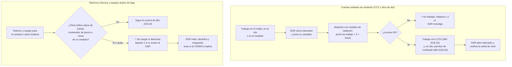

# MS-ACE-07 — Fuentes radiactivas selladas de medición (nivel de molde de CC2 y nivel de silos de día) y control de retornos internos

| Código | Versión | Estado | Área | Dueño del proceso | Elaboró | Revisión técnica | Revisión de seguridad | Aprobó | Fecha | Próxima revisión |
|---|---|---|---|---|---|---|---|---|---|---|
| MS-ACE-07 | 0.3 | Borrador para validación | CC2 (medidores de nivel de molde con Cs-137), silos de día de DRI (medidores de nivel radiométricos, si existen), patio de retornos internos, casa de bolsas | C-16 Especialista de Seguridad e Higiene de Acería (con el Encargado de Seguridad Radiológica) | experto-seguridad-salud | experto-operativo-metalurgia | experto-seguridad-salud — visto bueno con observaciones, 2026-09-28 | Pendiente (Gerente de Acería / Director) | 2026-09-28 | 2027-09-28 |

> ⚠️ **Mensaje clave.** Con la decisión D-010, GASM **ya no compra chatarra**: el EAF se carga con DRI de pelet propio y ≤ 5 % de retornos internos (`../../00-cadena-de-valor/CV-GASM-001-cadena-de-valor.md` §4.3). **Deja de aplicar el riesgo de fuentes huérfanas en chatarra comprada y el pórtico de chatarra.** El riesgo radiológico que **queda** son las **fuentes selladas de medición** de la propia Acería: el Cs-137 de nivel de molde en las 6 líneas de CC2 y, si existen, los medidores de nivel de los silos de día [Validar inventario con el ESR y la licencia CNSNS]. El escenario que ahora debemos evitar es que **una fuente de la planta**, dañada o dada de baja, **termine en los retornos y se funda** (caso real en México: Ciudad Juárez, 1983–84, una fuente de Co-60 terminó en varilla corrugada). **Solo el Encargado de Seguridad Radiológica (ESR) manipula el obturador. Ningún equipo con fuente va a retornos ni a chatarra.**

## 1. Objetivo y alcance

**Objetivo:** mantener la exposición del personal tan baja como sea razonablemente posible (principio ALARA) y por debajo de los límites de la NOM-012-STPS-2012 y del Reglamento General de Seguridad Radiológica (CNSNS), y evitar que una fuente sellada de la planta se dañe, se pierda o se funda.

**Qué queda (aplica):**
- 6 medidores de nivel de molde de CC2 con **fuente sellada de Cs-137** (FT-ACE-001 §5); actividad por fuente según la licencia [Validar con ESR / OEM].
- **Silos de día de DRI:** FT-ACE-001 v0.4 §2.1 indica **nivel por radar (sin fuente radiactiva)** [Validar con OEM]. Si el OEM o el ESR confirman algún medidor radiométrico (nivel, densidad o flujo) en silos, tolvas o básculas, se agrega al inventario y se le aplica el procedimiento A; mientras tanto, esta parte **no aplica**.
- **Control de retornos internos** (despuntes, rechazos, derrames ≤ 5 %): que ningún contenedor de fuente, medidor dado de baja o material contaminado entre a la canasta.
- Monitoreo del polvo de la casa de bolsas y de muestras de acero como detección tardía de una fuente fundida [Supuesto — Validar con C-16 / ESR].
- CC1 usa sensor de corrientes parásitas (sin fuente radiactiva).

**Qué sale (ya no aplica por D-010):** pórtico detector de radiación de camiones de chatarra, alarma y aislamiento de camiones, segunda pasada, zona de aislamiento de camiones, fuentes huérfanas en chatarra comprada y el entrenamiento de S-05/C-17 en pórtico. El destino del pórtico existente (retiro, reubicación o uso en retornos) es una **decisión pendiente del Director** (ver `README.md` §5).

**Fuera de alcance:** fuentes selladas de las plantas HYL y Midrex (medidores de nivel o densidad de reactores y tolvas, si existen): son de la licencia y del ESR de RD (`10-plantas/03-reduccion-directa/`). En la frontera de bandas no hay fuentes de la Acería [Supuesto — Validar con el ESR].

## 2. Roles y responsabilidades

| Rol | Responsabilidad en este proceso | R/A/C/I |
|---|---|---|
| **ESR Encargado de Seguridad Radiológica** (función que cumple **C-16**, autorizado por la CNSNS; en su ausencia, un suplente con licencia vigente [Validar con la licencia]) | Custodia de fuentes y llaves del obturador; pruebas de fuga; inventario; dosimetría; reportes a la CNSNS; libera los equipos dados de baja y los retornos sospechosos | A (técnico) |
| C-16 Especialista de Seguridad e Higiene | Dueño del manual; integra el tema al sistema de SSO; auditoría | A |
| C-12 / S-21 Instrumentista (POE) | Mantenimiento de los medidores de CC2 y de silos con el obturador cerrado y con el ESR | R |
| S-12 / S-13 / S-14 Púlpito, Plataforma y Ayudante de Colada (CC2) | Respetan la señalización; no intervienen el molde sin la liberación del ESR; avisan al ESR de daños al contenedor | R |
| S-25 Taller de moldes | Cambio de molde de CC2 solo con el obturador cerrado y verificado | R |
| S-05 Operador de Manejo de DRI y Retornos / C-17 Supervisor de Manejo de Materiales (DRI, fundentes y retornos) | Respetan la zona controlada de los medidores de silo; no entran ni trabajan en el techo o la pared del silo junto al medidor sin liberación del ESR; revisan que la canasta de retornos no lleve equipos ni contenedores con trébol | R |
| C-11 / C-13 Mantenimiento y planeación | Ningún medidor, contenedor o componente con trébol se desmonta, se desecha ni se manda a chatarra sin el ESR | R |
| C-04 Jefe de Turno | Comandante del incidente en un evento radiológico (MS-ACE-09) | R |
| C-01 Gerente de Acería | Titular de la licencia ante la CNSNS [Supuesto] | A (legal) |

## 3. Descripción del proceso

**Protección básica: TIEMPO (menos tiempo cerca), DISTANCIA (la dosis baja con el cuadrado de la distancia: al doble de distancia, ¼ de la dosis) y BLINDAJE (el contenedor de plomo y el obturador).**

> Figura del medidor de nivel de silo: **pendiente** (se agregará a `../img/` cuando el ESR confirme el inventario). La Figura 2 anterior (pórtico del patio de chatarra) queda retirada.

```mermaid
flowchart TD
    subgraph MED["Fuentes selladas de medición (CC2 y silos de día)"]
        A1["Trabajo en el molde, en el silo<br/>o en el medidor"] --> A2["ESR cierra obturador<br/>y pone su candado"]
        A2 --> A3["Medición con medidor de radiación:<br/>punto de trabajo < 2 × fondo"]
        A3 --> A4{"¿Lectura OK?"}
        A4 -- "No" --> A5["🛑 No trabajar. Alejarse ≥ 3 m.<br/>ESR investiga"]
        A4 -- "Sí" --> A6["Trabajo con LOTO (MS-ACE-02)<br/>y, en silo, permiso de confinado (MS-ACE-05)"]
        A6 --> A7["ESR abre obturador y<br/>verifica la señal de nivel"]
    end
    subgraph RET["Retornos internos y equipos dados de baja"]
        B1["Retorno o equipo para<br/>la canasta o para chatarra"] --> B2{"¿Tiene trébol, placa de fuente,<br/>contenedor de plomo o viene<br/>de un medidor?"}
        B2 -- "No" --> B3["Sigue el control de MS-ACE-03"]
        B2 -- "Sí o duda" --> B4["🛑 No cargar ni desechar.<br/>Apartar ≥ 3 m; avisar al ESR"]
        B4 --> B5["ESR mide, identifica y resguarda;<br/>aviso a la CNSNS si aplica"]
    end
```

## 4. Equipos y maquinaria

| Equipo / componente | Función | Especificación clave | Condición para operar (verificación) |
|---|---|---|---|
| Medidor de nivel radiométrico (6, CC2) | Mide el nivel del acero en el molde | Fuente sellada de Cs-137 en contenedor de plomo con obturador; nivel ± 5 mm | Contenedor íntegro, señalizado, con placa de la fuente |
| Medidor de nivel radiométrico de silo de día (si existe) | Mide el nivel de DRI en el silo | Fuente sellada en contenedor con obturador, montada en la pared del silo; detector en la pared opuesta [Validar con OEM / ESR] | Contenedor íntegro, señalizado, zona controlada delimitada |
| Obturador con candado | Bloquea el haz para trabajos | Posiciones "abierto/cerrado" visibles | Candado del ESR cuando está cerrado por trabajo |
| Medidor de radiación portátil (tasa de dosis) | Verifica obturador, fugas, retornos sospechosos y equipos dados de baja | Lectura en μSv/h; calibración vigente (anual [Verificar]) | Prueba de funcionamiento con fuente de verificación |
| Dosímetros personales (TLD/OSL) | Dosis acumulada del POE | Lectura periódica por laboratorio acreditado | Portado a la altura del pecho |
| Dosímetro electrónico de lectura directa | Dosis durante tareas con fuente | Alarma de tasa y de dosis | Para ESR y S-21 en tareas con fuente |
| Contenedor blindado de resguardo | Resguardo temporal de una fuente dañada o encontrada | Aprobado por la CNSNS | Bajo custodia del ESR |

## 5. Parámetros de operación

| Parámetro | Unidad | Objetivo | Rango normal | Alarma / límite | Acción si está fuera de rango | Dónde se mide |
|---|---|---|---|---|---|---|
| Límite de dosis anual del POE | mSv/año | ALARA | Restricción interna ≤ 6 [Supuesto] | Límite legal según RGSR/CNSNS (el RGSR fija 50 mSv/año; ICRP 103 recomienda 20 mSv/año promedio) [Verificar con la NOM vigente / SSO] | Nivel de investigación: > 0.5 mSv en un periodo de lectura [Supuesto] → ESR investiga | Dosímetro |
| Dosis para personal no POE | mSv/año | ≈ 0 | < 1 (referencia de público) [Verificar con RGSR/CNSNS] | ≥ 1 | Revisar señalización y blindaje | Estudio de áreas |
| Tasa de dosis en el punto de trabajo con obturador cerrado (molde de CC2 o silo) | μSv/h | Fondo (≈ 0.1–0.3) | < 2 × fondo [Validar con ESR] | ≥ 2 × fondo | 🛑 No trabajar; alejarse ≥ 3 m; ESR | Medidor portátil |
| Tasa de dosis a 1 m del contenedor (obturador abierto) | μSv/h | Según licencia | ≤ valor de la licencia CNSNS [Validar con ESR] | > valor de la licencia | Delimitar; ESR revisa blindaje | Medidor portátil (levantamiento periódico) |
| Prueba de fuga (frotis) de la fuente sellada | Bq | < límite | Según licencia | ≥ límite de la licencia [Verificar] | Fuente fuera de servicio; aviso a la CNSNS | Laboratorio autorizado, periodicidad según licencia (típico 6–12 meses) [Verificar] |
| Inventario físico de fuentes (CC2 + silos) | — | 100 % localizado | Mensual [Supuesto] | Fuente o contenedor no localizado | Aviso inmediato al ESR, a C-01 y a la CNSNS | Registro del ESR |
| Retorno o equipo sospechoso (trébol, plomo, placa de fuente) | μSv/h | Fondo | Fondo | Cualquier lectura > 2 × fondo o sin medir | 🛑 No cargar ni desechar; apartar ≥ 3 m; ESR | Medidor portátil |

## 6. Seguridad

### 6.1 Peligros y controles críticos

| Peligro | Consecuencia | Control crítico | Verificación |
|---|---|---|---|
| Exposición al haz del medidor de CC2 durante trabajos en el molde | Dosis innecesaria | Obturador cerrado + candado del ESR + medición | Registro del ESR en el permiso |
| Exposición al haz del medidor de silo durante inspección, limpieza, desatasque o entrada al silo | Dosis innecesaria (el haz cruza el silo) | Obturador cerrado + candado del ESR + medición **antes** de cualquier trabajo en la pared, el techo o dentro del silo; punto de aislamiento incluido en el permiso de espacio confinado (MS-ACE-05) [Validar con ESR] | Firma del ESR en el permiso |
| Contenedor dañado por salpicadura o breakout (CC2), por golpe del material o por calor del DRI (silo) | Fuga de radiación | Inspección del ESR tras breakout, salpicadura, autocalentamiento del silo o golpe | Levantamiento de tasa de dosis |
| **Fuente de la planta que termina en retornos o en chatarra** (medidor dado de baja, contenedor desmontado, molde con el contenedor pegado) | Fusión: acero, polvo y personal contaminados | Ningún componente con trébol sale del inventario sin el ESR; revisión visual de la canasta de retornos; medición del ESR a todo equipo sospechoso; monitoreo del polvo y del acero | Inventario; registro de bajas; registros del ESR |
| Manipulación por personal no autorizado | Exposición, robo | Solo el ESR; llaves bajo custodia | Inventario |
| Pérdida o robo de la fuente | Exposición del público | Inventario mensual [Supuesto]; aviso inmediato a la CNSNS | Registro de inventario |

### 6.2 EPP obligatorio

El EPP convencional **no protege contra la radiación gamma**. La protección es tiempo, distancia y blindaje. El POE porta su **dosímetro personal** a la altura del pecho, por fuera de la ropa y **por dentro del aluminizado** si lo usa (ver la Figura 1 de MS-ACE-08). En eventos con posible contaminación (polvo): overol desechable, guantes y respirador P100 bajo instrucciones del ESR.

### 6.3 Permisos, bloqueos y zonas de exclusión

- Contenedores y áreas con el **símbolo internacional de radiación (trébol)** y leyenda "PRECAUCIÓN — MATERIAL RADIACTIVO", conforme a la NOM-012-STPS-2012 y la NOM-026-STPS-2008.
- **Zona controlada** alrededor de cada medidor (CC2 y silos), delimitada por el ESR según el levantamiento [Validar con ESR]; solo POE en tareas con la fuente.
- Todo trabajo en el molde de CC2 (cambio de molde, destrabe tras breakout, mantenimiento del medidor): **permiso de trabajo con firma del ESR** + LOTO (MS-ACE-02, punto 7 de la Figura 1).
- Todo trabajo en la pared o el techo del silo junto al medidor, o dentro del silo: **permiso con firma del ESR** + LOTO de bandas y silo (MS-ACE-02 §6.5) + permiso de espacio confinado si hay entrada (MS-ACE-05).
- **Baja de equipos con fuente:** solo el ESR, con registro y aviso a la CNSNS según la licencia [Verificar]. Nunca a chatarra, a retornos ni a venta.

## 7. Calidad

| Variable crítica de calidad | Especificación | Método / frecuencia | Registro | Defecto si falla |
|---|---|---|---|---|
| Señal de nivel de molde de CC2 | Nivel ± 5 mm | Verificación tras cada apertura del obturador | Registro del ESR / HMI | Nivel falso: desbordes, marcas de oscilación profundas, breakout |
| Señal de nivel del silo de día (si es radiométrica) | Según OEM [Validar con OEM] | Verificación tras cada apertura del obturador | Registro del ESR / HMI | Nivel falso: silo sobrellenado o vacío; alimentación de DRI interrumpida |
| Acero libre de contaminación radiactiva | Sin actividad sobre el fondo | Monitoreo de muestras o del polvo [Supuesto] | Registro del ESR | Producto contaminado: retiro del mercado, aviso a la CNSNS |
| Retornos sin fuentes | Cero fuentes o contenedores cargados | Revisión de la canasta; control de bajas | Registro de C-17 y del ESR | Fusión de fuente |

## 8. Procedimiento paso a paso

**A. Trabajo en el molde o en el medidor de CC2, o en el silo de día o su medidor**

| # | Paso | Cómo hacerlo (detalle y medición) | Criterio de aceptación | ★ | Rol |
|---|---|---|---|---|---|
| 1 | Solicita al ESR | Incluye en el permiso de trabajo el punto de la fuente (CC2: punto 7; silo: punto del medidor [figura pendiente]) | ESR confirma horario | ★ | C-11 / C-06 / C-17 |
| 2 | Cierra y bloquea el obturador | El ESR cierra el obturador de la línea o del silo (o de todos si aplica), coloca su candado y tarjeta | Obturador en "cerrado" con candado | ★ | ESR |
| 3 | Mide | El ESR mide en el punto de trabajo y a 1 m: < 2 × fondo | Lecturas anotadas en el permiso | ★ | ESR |
| 4 | Aplica LOTO del resto de energías | MS-ACE-02 (en silo: §6.5, bandas, alimentadores e inertización con N₂) | Energía cero | ★ | Ejecutores |
| 5 | Trabaja sin tocar el contenedor | No desmontes ni golpees el contenedor; si se daña, detente y aléjate ≥ 3 m | Contenedor íntegro | ★ | S-25, S-21, ejecutores |
| 6 | Devuelve y verifica | El ESR retira su candado, abre el obturador y verifica la señal de nivel con el púlpito | Señal en rango (CC2 ± 5 mm) | ★ | ESR, S-12 / S-05 |

**B. Control de retornos internos y de equipos dados de baja**

| # | Paso | Cómo hacerlo (detalle y medición) | Criterio de aceptación | ★ | Rol |
|---|---|---|---|---|---|
| 7 | Revisa la canasta de retornos | Busca trébol, placas de fuente, contenedores de plomo, piezas de medidores o de moldes con el contenedor | Canasta sin objetos sospechosos | ★ | S-05, C-17 |
| 8 | Aparta y avisa | Si hay un objeto sospechoso o duda: no lo cargues ni lo muevas; aléjate ≥ 3 m; delimita; radio al ESR y a C-04 | Aviso ≤ 5 min | ★ | S-05, C-17 |
| 9 | El ESR identifica | Levantamiento con medidor portátil; resguarda en contenedor blindado si es fuente | Objeto identificado y resguardado | ★ | ESR |
| 10 | Baja controlada de equipos con fuente | Ningún medidor o contenedor sale del inventario sin el ESR; registro y aviso a la CNSNS según la licencia [Verificar] | Inventario actualizado | ★ | ESR, C-13 |
| 11 | Reporta | Registro del evento; análisis de causa si una pieza con fuente llegó a retornos | Reporte emitido | | ESR, C-01 |

## 9. Condiciones anormales y respuesta

| Síntoma / alarma | Causa probable | Acción inmediata | A quién avisar |
|---|---|---|---|
| Obturador no cierra o lectura alta con obturador "cerrado" | Obturador trabado | Aléjate ≥ 3 m; delimita; no trabajes | ESR, C-16 |
| Contenedor golpeado, con metal encima o quemado (CC2) | Breakout, salpicadura | Aléjate; delimita; ESR hace levantamiento | ESR, C-06 |
| Contenedor del silo golpeado, caliente o con DRI encima | Autocalentamiento del silo, golpe | Aléjate; delimita; ESR hace levantamiento cuando el silo esté controlado (MS-ACE-03 §9) | ESR, C-17 |
| Objeto con trébol o contenedor en retornos o en chatarra | Baja sin control | Paso B completo | ESR, C-04 |
| Fuente o contenedor no localizado en el inventario | Robo, pérdida, baja sin control | Aviso inmediato; búsqueda dirigida por el ESR; aviso a la CNSNS | ESR, C-01 |
| Alarma de radiación en polvo de casa de bolsas o en acero | Fuente fundida | Paro de la extracción según ESR; aislamiento del polvo y del acero; plan de emergencia radiológica | ESR, C-04, C-01 |
| Dosímetro perdido o dañado | — | Reporte al ESR; estimación de dosis | ESR |
| Lectura del dosímetro sobre el nivel de investigación | Exposición no planeada | Investigación; retirar temporalmente de tareas con fuente | ESR, servicio médico |

## 10. Registros

- Licencia de la CNSNS, inventario de fuentes (CC2 y silos) y registro de movimientos y bajas (ESR).
- Pruebas de fuga, levantamientos de tasa de dosis y verificación de medidores.
- Historial de dosis de cada POE (se conserva según la regulación [Verificar]).
- Registro de objetos sospechosos en retornos y su resolución.
- Permisos de trabajo con firma del ESR.

## 11. Competencia requerida y certificación

| Rol | Nivel requerido (1–4) | Formación teórica (h) | OJT supervisado (h / eventos) | Evaluación (pasos ★) | Vigencia |
|---|---|---|---|---|---|
| C-16 en función de ESR | 4 | Curso reconocido por la CNSNS [Verificar] | Según CNSNS | Autorización de la CNSNS + pasos 2, 3, 6, 9 y 10 | Según la licencia CNSNS; evaluación interna 12 meses |
| C-06, C-11, C-17 (solicitantes del trabajo en el molde o en el silo) | 3 | 2 (MS-ACE-07) | 2 solicitudes con el ESR | Paso 1 (punto de la fuente en el permiso) | 12 meses (fuentes radiactivas) |
| POE (S-21, S-25 de CC2) | 3 | 16 (protección radiológica, NOM-012) | 3 tareas con ESR | Pasos 4, 5 + uso del dosímetro | 12 meses (fuentes radiactivas) |
| S-12, S-13, S-14 de CC2 | 2 | 4 (conciencia radiológica) | — | Reconocer el trébol y el obturador; no intervenir el molde sin la liberación del ESR | 12 meses (fuentes radiactivas) |
| S-05, C-17 (silos y retornos) | 2 | 4 (conciencia radiológica: medidores de silo y control de retornos) | 1 simulacro de objeto sospechoso | Pasos 7, 8; no trabajar junto al medidor del silo sin liberación del ESR | 12 meses (fuentes radiactivas) |
| C-13 Planeador (bajas de equipo) | 2 | 1 | — | Paso 10 | 12 meses |
| Resto del personal | 1 | 1 (inducción) | — | Reconocer el símbolo | 12 meses |

**Lista corta de verificación de pasos ★:**
1. ¿Sabe que solo el ESR opera el obturador (CC2 y silos)?
2. ¿Verifica la medición < 2 × fondo antes de trabajar en el molde de CC2 o en el silo?
3. ¿Aplica tiempo, distancia y blindaje?
4. ¿Trabaja sin tocar ni golpear el contenedor y se aleja ≥ 3 m si se daña (paso 5)?
5. ¿El ESR (C-16) retira su candado, abre el obturador y verifica la señal de nivel con el púlpito (paso 6)?
6. ¿Reconoce en la canasta de retornos un objeto con trébol, placa o plomo, lo aparta sin moverlo y avisa en ≤ 5 min (pasos 7 y 8)?
7. ¿Sabe que ningún equipo con fuente se da de baja, se desecha ni va a retornos sin el ESR (paso 10)?

## 12. Referencias

- NOM-012-STPS-2012 (radiaciones ionizantes), Reglamento General de Seguridad Radiológica y requisitos de licencia de la **CNSNS**, NOM-026-STPS-2008 (señalización), NOM-017-STPS-2008 [Verificar con la NOM vigente / SSO — verificar con Jurídico Laboral / SSO].
- OIEA, guías sobre control de fuentes selladas y prevención de fuentes huérfanas (referencia).
- CV-GASM-001 §4.3 (sin compra de chatarra; control radiológico solo para retornos internos y fuentes selladas de medición).
- FT-ACE-001 §5 (CC2); MM-CC-04; MS-ACE-02, 03, 05, 09.

## 13. Control de cambios

| Versión | Fecha | Cambio | Autor |
|---|---|---|---|
| 0.1 | 2026-09-25 | Creación del borrador para validación | experto-seguridad-salud (con criterio técnico de experto-operativo-metalurgia) |
| 0.2 | 2026-09-25 | Revisión cruzada: C-16 cumple la función de ESR; S-13 agregado como ejecutor (catálogo); vigencias de 12 meses; pasos ★ 5, 6, 9 y 10 en la lista de verificación | experto-seguridad-salud |
| 0.3 | 2026-09-28 | **Redefinición por D-010:** sale el pórtico de chatarra y el procedimiento de alarma de camiones (fuentes huérfanas en chatarra comprada); quedan las fuentes selladas de CC2; entran los medidores de nivel de silos de día (si existen) y el control de retornos internos y de bajas de equipos con fuente; nuevo procedimiento B y competencias de S-05, C-17 y C-13 | experto-seguridad-salud |
