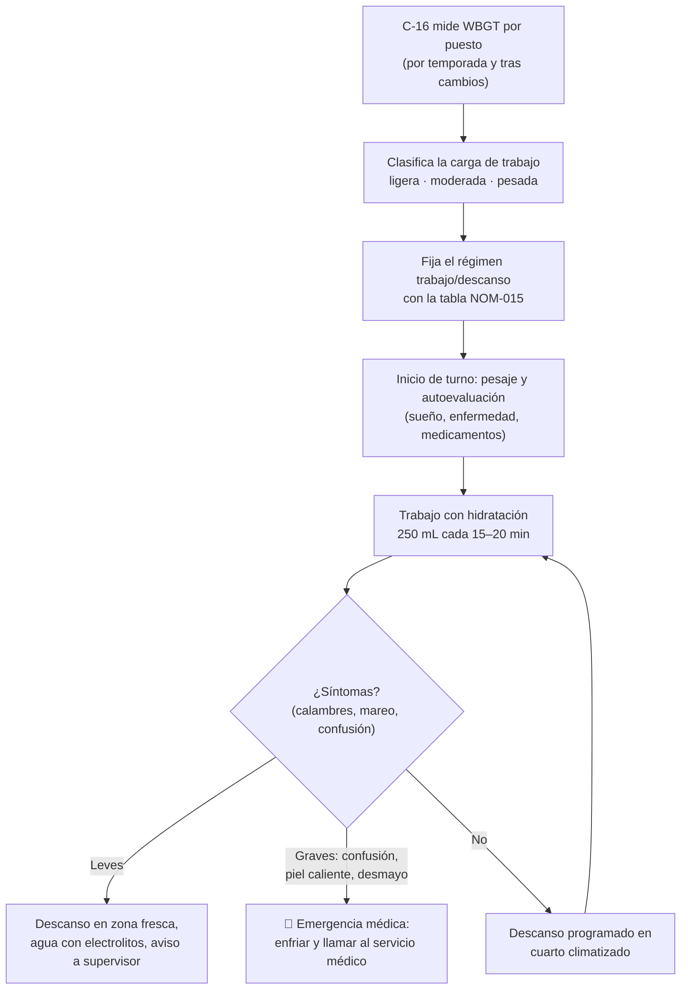

# MS-ACE-08 — Estrés térmico, hidratación y EPP

| Código | Versión | Estado | Área | Dueño del proceso | Elaboró | Revisión técnica | Revisión de seguridad | Aprobó | Fecha | Próxima revisión |
|---|---|---|---|---|---|---|---|---|---|---|
| MS-ACE-08 | 0.1 | Borrador para validación | Toda la Acería | C-16 Especialista de Seguridad e Higiene de Acería | experto-seguridad-salud | experto-operativo-metalurgia | experto-seguridad-salud | Pendiente (Gerente de Acería / Director) | 2026-09-25 | 2027-09-25 |

> ⚠️ **Mensaje clave.** En la plataforma del horno y en la de colada el calor radiante del acero (≈ 1,630 °C) se suma al calor del verano y al EPP aluminizado, que no deja salir el sudor. El **golpe de calor mata en horas** y antes provoca errores en tareas críticas. **Toma 250 mL de agua cada 15–20 minutos aunque no tengas sed, respeta el régimen trabajo/descanso por índice WBGT y usa el EPP completo y seco.**

## 1. Objetivo y alcance

**Objetivo:** prevenir enfermedades por calor (calambres, agotamiento, golpe de calor) y quemaduras, mediante la evaluación del índice WBGT, el régimen trabajo/descanso de la NOM-015-STPS-2001, la hidratación, la aclimatación, la vigilancia médica y el uso correcto del EPP (NOM-017-STPS-2008).

**Aplica a:** todo el personal propio y contratista de la Acería, con énfasis en: muestreo y temperatura (S-02, S-06, S-11), preparación de horno y reparación de refractario (S-03, S-24), preparación de ollas y distribuidores (S-08, S-15), plataforma de colada (S-13, S-14), mantenimiento en caliente (S-19, S-23) y trabajo dentro de ollas o del EAF recién enfriados (MS-ACE-05).

## 2. Roles y responsabilidades

| Rol | Responsabilidad en este proceso | R/A/C/I |
|---|---|---|
| C-16 Especialista de Seguridad e Higiene | Dueño; mide el WBGT por puesto; fija el régimen; selecciona EPP; capacita | A |
| Servicio médico de planta | Exámenes médicos de ingreso y periódicos (NOM-015); atención de casos | R |
| C-04, C-05, C-06 | Aplican el régimen y los relevos en el turno; detienen a quien muestre síntomas | R |
| Todo el personal expuesto | Se hidrata, respeta descansos, reporta síntomas propios y de compañeros; cuida su EPP | R |
| Almacén / Compras | Surte EPP especificado y agua/electrolitos en puntos de hidratación | R |
| Relaciones Laborales / CMCAP | Validan el régimen de descansos con el sindicato | C |

## 3. Descripción del proceso

## 4. Equipos y maquinaria

| Equipo / componente | Función | Especificación clave | Condición para operar (verificación) |
|---|---|---|---|
| Medidor de estrés térmico (WBGT) | Mide bulbo húmedo natural, globo y bulbo seco | Conforme al método de la NOM-015 | Calibración vigente |
| Cuartos de descanso climatizados | Recuperación | 22–26 °C [Supuesto]; a ≤ 3 min a pie del puesto | Aire acondicionado funcionando; limpios |
| Estaciones de hidratación | Agua fresca y electrolitos | Agua a 10–15 °C [Supuesto]; vasos o termos personales | Surtidas cada turno |
| Báscula en vestidor | Control de pérdida de peso | Precisión 0.1 kg | Calibrada |
| Pantallas de calor / cortinas de aire en púlpitos | Reducen calor radiante | Según diseño | Integras |
| EPP aluminizado y FR | Protección contra calor radiante y salpicadura | Ver tabla 6.2 | Seco e íntegro |

## 5. Parámetros de operación

### 5.1 Régimen trabajo/descanso por WBGT (NOM-015-STPS-2001, Tabla A1) [Verificar con la NOM vigente / SSO]

Límite máximo de exposición en **°C WBGT** (índice de temperatura de globo y bulbo húmedo) según el régimen por hora y la carga de trabajo:

| Régimen de trabajo por hora | Carga ligera (≤ 200 kcal/h) | Carga moderada (200–350 kcal/h) | Carga pesada (> 350 kcal/h) |
|---|---|---|---|
| 100 % trabajo (continuo) | 30.0 | 26.7 | 25.0 |
| 75 % trabajo – 25 % descanso (45/15 min) | 30.6 | 28.0 | 25.9 |
| 50 % trabajo – 50 % descanso (30/30 min) | 31.4 | 29.4 | 27.9 |
| 25 % trabajo – 75 % descanso (15/45 min) | 32.2 | 31.1 | 30.0 |
| Sobre los valores de 25/75 | 🛑 **No se permite trabajar** sin controles adicionales aprobados por C-16 | | |

**Ejemplos de clasificación en la Acería [Supuesto — Validar con C-16 por estudio]:** operador de púlpito = ligera; operador de grúa en cabina = ligera; plataforma de colada en estado estable = moderada; muestreo y temperatura, preparación de distribuidor, demolición y reparación de refractario, cambio de SEN o de buza = **pesada**.

**Cómo se calcula:** en interiores sin sol, WBGT = 0.7 × temperatura de bulbo húmedo natural + 0.3 × temperatura de globo. Para personal de pie se mide a la altura de tobillos (0.1 m), abdomen (1.1 m) y cabeza (1.7 m) y se pondera: (cabeza + 2 × abdomen + tobillos) ÷ 4 [Verificar método NOM-015].

### 5.2 Otros parámetros

| Parámetro | Unidad | Objetivo | Rango normal | Alarma / límite | Acción si está fuera de rango | Dónde se mide |
|---|---|---|---|---|---|---|
| Hidratación durante el trabajo en calor | mL | 250 cada 15–20 min | 750–1,000 mL/h | < 500 mL/h; > 1,500 mL/h [Supuesto: riesgo de hiponatremia] | Ajustar; electrolitos si el turno de calor pasa de 2 h | Autocontrol; supervisor |
| Pérdida de peso en el turno | % del peso inicial | < 1 | < 1.5 | ≥ 2 % [Supuesto] | Retirar del calor; rehidratar; servicio médico | Báscula del vestidor |
| Aclimatación de personal nuevo o que regresa (> 7 días fuera) | % del tiempo de exposición | Día 1: 20 %; +20 % por día | 5 días para llegar al 100 % | Exposición plena el día 1 | 🛑 No asignar tareas pesadas en calor | Plan del supervisor |
| Permanencia continua en zona roja por intervención | min | ≤ 2 | ≤ 2 | > 2 min | Salir y recuperar (MS-ACE-01) | Supervisor |
| Temperatura del cuarto de descanso | °C | 24 | 22–26 | > 28 °C | Reparar A/C; descanso en otro cuarto | Termómetro |
| Frecuencia de medición de WBGT | — | Por temporada (verano e invierno) y tras cambios de proceso | ≥ 2 veces al año [Supuesto] | Sin medición vigente | C-16 mide antes de la siguiente temporada | Registro de C-16 |
| Nivel de ruido en plataforma del EAF | dB(A) | — | 100–115 típico [Supuesto] | ≥ 85 dB(A) protección obligatoria; ≥ 105 dB(A) doble protección | Protección auditiva (NOM-011) | Sonómetro/dosímetro |

## 6. Seguridad

### 6.1 Peligros y controles críticos

| Peligro | Consecuencia | Control crítico | Verificación |
|---|---|---|---|
| Golpe de calor | Muerte, daño orgánico | Régimen WBGT; hidratación; aclimatación; compañero vigila | Registro de régimen y de hidratación |
| Agotamiento por calor | Error en tareas críticas (★) | Descansos; relevo en tareas pesadas | Supervisor |
| Quemadura por salpicadura | Lesión grave | EPP aluminizado; zonas de exclusión | Inspección de EPP |
| Quemadura por vapor (EPP húmedo) | Lesión | EPP seco; cambiar el que se moja | Inspección previa |
| Ropa sintética | Se funde sobre la piel | Solo FR o 100 % algodón | Inspección de ingreso a nave |
| Ruido | Pérdida auditiva | Protección auditiva; conservación auditiva NOM-011 | Audiometrías |

### 6.2 EPP obligatorio (ver Figura 1)

| # | EPP | Especificación de referencia [Verificar con proveedor y NOM-017] | Dónde es obligatorio |
|---|---|---|---|
| 1 | Casco con barbiquejo | Resistente a salpicadura; dieléctrico | Toda la nave |
| 2 | Careta con visor dorado (filtro IR/UV) | Montada al casco | Zona roja y amarilla con metal a la vista |
| 3 | Capucha aluminizada | Con visor | Vaciado, muestreo, plataforma de colada |
| 4 | Chaquetón/abrigo aluminizado | ISO 11612 (A1, B, C, D3, E3) | Zona roja |
| 5 | Ropa FR o 100 % algodón | Sin sintéticos, sin grasa | Toda la nave |
| 6 | Guantes aluminizados o de aramida | Contacto breve con superficies calientes | Zona roja |
| 7 | Polainas aluminizadas | Sobre el pantalón y la bota | Zona roja |
| 8 | Botas metatarsales | Casquillo, metatarsal, suela resistente al calor (≥ 300 °C [Supuesto]), liberación rápida | Toda la nave |
| 9 | Protección auditiva | Tapón; doble (tapón + orejera) si ≥ 105 dB(A) | Toda la nave |
| 10 | Detector personal CO/O₂ | ≤ 30 cm de nariz y boca (MS-ACE-06) | Hornos, LF, torreta, fosas |
| 11 | Dosímetro personal | Solo POE (MS-ACE-07) | CC2 |
| — | Lentes de seguridad; sombra 3–5 ante el arco | Para ver el arco o el baño | Púlpitos y puerta del horno |

### 6.3 Permisos, bloqueos y zonas de exclusión

- Cuando el WBGT supere el valor del régimen 25/75 para la carga del puesto, C-04 suspende la tarea o aprueba controles adicionales con C-16 (enfriamiento local, chaleco refrigerante, más relevos).
- Trabajos dentro de ollas o del EAF: medición de WBGT como parte del permiso de espacio confinado (MS-ACE-05).

## 7. Calidad

| Variable crítica de calidad | Especificación | Método / frecuencia | Registro | Defecto si falla |
|---|---|---|---|---|
| Ejecución correcta de pasos ★ bajo calor | Sin omisiones | Observación de tareas críticas por el supervisor | VCC | Errores de muestreo, de arranque de CC o de lectura de alarmas |
| Mediciones de proceso tomadas a tiempo | Según los manuales MO | Por colada | Hoja de colada | Temperaturas o químicas fuera de especificación |
| Estado del EPP | Seco e íntegro | Cada turno | Registro de EPP | Exposición y lesiones |

## 8. Procedimiento paso a paso

| # | Paso | Cómo hacerlo (detalle y medición) | Criterio de aceptación | ★ | Rol |
|---|---|---|---|---|---|
| 1 | Llega en condiciones | Duerme, come e hidrátate antes del turno; avisa si tienes fiebre, diarrea o tomas medicamentos (antihistamínicos, diuréticos) | Autoevaluación sin riesgos | ★ | Personal |
| 2 | Pésate | Registra el peso al inicio (opcional pero recomendado en verano) | Peso anotado | | Personal |
| 3 | Revisa el régimen del día | Consulta el cartel del WBGT del puesto y la carga de trabajo | Régimen conocido | ★ | C-05 / C-06 |
| 4 | Inspecciona el EPP | Seco, sin roturas, sin grasa; ropa sin sintéticos | EPP aprobado | ★ | Personal |
| 5 | Hidrátate | 250 mL cada 15–20 min; si el trabajo en calor pasa de 2 h, alterna con electrolitos | ≈ 750–1,000 mL por hora | ★ | Personal |
| 6 | Respeta los descansos | Descansa en el cuarto climatizado el tiempo del régimen; quítate capucha y chaquetón al descansar | Descansos cumplidos | ★ | Personal, C-05/C-06 |
| 7 | Vigila al compañero | Busca confusión, tambaleo, habla arrastrada, piel roja y seca | Aviso inmediato | ★ | Todos |
| 8 | Actúa ante síntomas | Leves: descanso, agua, aviso. Graves: 🛑 emergencia médica, retira EPP, enfría con agua fresca (lejos del metal líquido) y llama al servicio médico | Atención ≤ 5 min | ★ | Todos |
| 9 | Aclimata al personal nuevo | 20 % del tiempo en calor el día 1 y +20 % diario | Plan de 5 días firmado | ★ | C-05 / C-06 |
| 10 | Al terminar | Pésate; si bajaste ≥ 2 %, avisa y rehidrátate; guarda el EPP seco | Registro | | Personal |

## 9. Condiciones anormales y respuesta

| Síntoma / alarma | Causa probable | Acción inmediata | A quién avisar |
|---|---|---|---|
| Calambres musculares | Pérdida de sales | Descanso en fresco; electrolitos | Supervisor |
| Sudor abundante, debilidad, náusea, dolor de cabeza | Agotamiento por calor | Retirar del calor; acostar; hidratar; vigilar 30 min | Supervisor, servicio médico |
| Confusión, piel caliente y seca o sudorosa, desmayo, temperatura > 40 °C | **Golpe de calor** | 🛑 Emergencia: enfriar de inmediato (agua fresca, hielo en cuello, axilas e ingle), no dar líquidos si está inconsciente | Servicio médico, C-04 |
| WBGT sobre el límite del régimen | Ola de calor, proceso | Cambiar a un régimen con más descanso o suspender | C-04, C-16 |
| Cuarto de descanso sin A/C | Falla | Habilitar otro cuarto; reportar | C-04 |
| EPP húmedo o roto | Sudor, lluvia, desgaste | Cambiarlo antes de volver a zona roja | Almacén |

## 10. Registros

- Estudio de condiciones térmicas por puesto (NOM-015) y mediciones de WBGT de temporada.
- Régimen trabajo/descanso publicado por puesto.
- Exámenes médicos de ingreso y periódicos del personal expuesto (NOM-015).
- Planes de aclimatación firmados.
- Registro de casos de enfermedad por calor y su análisis.
- Registro de entrega e inspección de EPP (NOM-017).

## 11. Competencia requerida y certificación

| Rol | Nivel requerido (1–4) | Formación teórica (h) | OJT supervisado (h / eventos) | Evaluación (pasos ★) | Vigencia |
|---|---|---|---|---|---|
| Todo el personal expuesto | 2 | 2 (S-06 Salud: estrés térmico) + 2 (EPP) | Demostración de uso de EPP | Pasos 4, 5, 6, 7, 8 | 12 meses |
| C-04, C-05, C-06 | 3 | 4 (aplicación del régimen, primeros auxilios por calor) | — | Pasos 3, 9 + caso práctico | 24 meses (TD-P07) |
| C-16 | 4 | 8 (medición WBGT, NOM-015) | 3 estudios | Estudio completo | 24 meses |
| Brigada de primeros auxilios | 3 | 4 (golpe de calor) | Simulacro | Paso 8 | 12 meses |

**Lista corta de verificación de pasos ★:**
1. ¿Inspecciona el EPP y rechaza el húmedo o dañado?
2. ¿Conoce el régimen de su puesto y la regla de 250 mL cada 15–20 min?
3. ¿Reconoce los signos del golpe de calor y actúa como emergencia?
4. ¿El supervisor aplica la aclimatación de 5 días al personal nuevo?

## 12. Referencias

- NOM-015-STPS-2001 (condiciones térmicas elevadas o abatidas), NOM-017-STPS-2008 (EPP), NOM-011-STPS-2001 (ruido), NOM-030-STPS-2009 (servicios preventivos) [Verificar con la NOM vigente / SSO].
- ISO 11612 (ropa de protección contra calor y llama), ISO 7243 (WBGT), ACGIH TLV de estrés térmico (referencias).
- S-06 Salud del programa Escuela de Seguridad (`05-programs/program-portfolio.md`); MS-ACE-01, 05, 06, 07.

## 13. Control de cambios

| Versión | Fecha | Cambio | Autor |
|---|---|---|---|
| 0.1 | 2026-09-25 | Creación del borrador para validación | experto-seguridad-salud (con criterio técnico de experto-operativo-metalurgia) |
