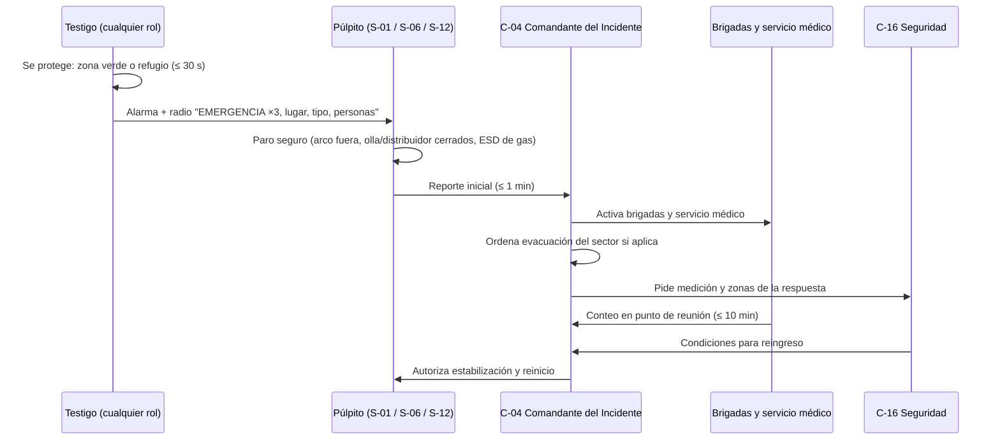

# MS-ACE-09 — Respuesta a emergencias: fuga de agua en el horno, perforación de olla, breakout, falla de agua de molde o apagón, fuga de gas y derrame

| Código | Versión | Estado | Área | Dueño del proceso | Elaboró | Revisión técnica | Revisión de seguridad | Aprobó | Fecha | Próxima revisión |
|---|---|---|---|---|---|---|---|---|---|---|
| MS-ACE-09 | 0.2 | Borrador para validación | Toda la Acería | C-04 Jefe de Turno de Acería | experto-seguridad-salud | experto-operativo-metalurgia | experto-seguridad-salud — visto bueno con observaciones, 2026-09-25 | Pendiente (Gerente de Acería / Director) | 2026-09-25 | 2027-09-25 |

> ⚠️ **Mensaje clave.** En los primeros 30 segundos, **protégete** (zona verde o refugio) y **da la alarma**; en los primeros 5 minutos, el púlpito **pone el proceso en estado seguro** (arco fuera, olla y distribuidor cerrados, gas cortado) y **C-04 asume el mando como Comandante del Incidente**. Nadie actúa como héroe: **nunca agua sobre metal líquido, nunca rescate sin ERA, nunca bajo una olla.**

## 1. Objetivo y alcance

**Objetivo:** responder de forma rápida y ordenada a las emergencias mayores de la Acería para proteger a las personas, contener el evento y recuperar la operación con seguridad.

**Escenarios cubiertos:** (A) fuga de agua en el EAF; (B) perforación de olla o fuga por la válvula; (C) breakout en CC1/CC2; (D) pérdida de agua de molde o apagón general; (E) fuga de gas (CO, O₂, Ar/N₂, gas natural); (F) derrame de metal o escoria e incendio asociado; (G) evento radiológico (MS-ACE-07); (H) lesionado grave, golpe de calor o persona atrapada. Complementa el Plan de Atención a Emergencias del centro de trabajo (NOM-002-STPS-2010) [por referenciar].

## 2. Roles y responsabilidades

| Rol | Responsabilidad en este proceso | R/A/C/I |
|---|---|---|
| **C-04 Jefe de Turno de Acería = Comandante del Incidente (CI)** | Asume el mando; decide evacuaciones; activa brigadas y servicio médico; autoriza el reingreso | A |
| C-05 Supervisor de Hornos / C-06 Supervisor de CC | Líder de sector: estabiliza el proceso de su área; cuenta a su personal | R |
| S-01, S-06, S-12 (púlpitos) | Acciones inmediatas de paro seguro; anuncio por radio; activación de alarma | R |
| S-09 / S-04 Operadores de grúa | Ponen la carga en posición segura (olla a la fosa de emergencia); evacúan si su vida corre riesgo | R |
| C-16 Especialista de Seguridad e Higiene | Oficial de seguridad del CI: mide atmósferas, define zonas y EPP de la respuesta | R |
| Brigadas (incendio, primeros auxilios, evacuación, comunicación, rescate) | Actúan por orden del CI, con EPP y ERA | R |
| Servicio médico | Atención y traslado de lesionados | R |
| C-12 / S-20 | Energía: aislamientos eléctricos y arranque de respaldos | R |
| ESR | Evento radiológico | R |
| Vigilancia / control de acceso | Controla la entrada; guía a bomberos y ambulancias externas; entrega listas de personal y contratistas | R |
| C-01 Gerente de Acería | Enlace con la dirección; comunicación externa (solo por los canales autorizados) | C |
| C-07 / C-08 Ingenieros de Proceso | Asesoran al CI en la estabilización y en el reinicio | C |

## 3. Descripción del proceso

## 4. Equipos y maquinaria

| Equipo / componente | Función | Especificación clave | Condición para operar (verificación) |
|---|---|---|---|
| Botones de alarma y sirena de nave | Alerta general | Tono intermitente = alerta; tono continuo = evacuación [Supuesto] | Prueba semanal |
| Radio con canal de emergencia | Comunicación prioritaria | Canal dedicado exclusivo para emergencias [Supuesto: canal 1] | Prueba al inicio del turno |
| Fosa de emergencia seca | Recibe olla perforada | Seca, libre, capacidad ≥ 1 olla | Inspección por turno |
| Caja/olla de emergencia del distribuidor (CC) | Recibe acero en breakout o cierre | Seca, en posición | Inspección antes de cada secuencia |
| Agua de emergencia de CC (torre + bombas diésel) | Enfría el molde ante apagón | Entrada automática ≤ 15 s | Prueba mensual (MM-CC-03) |
| Válvulas de corte remoto (ESD) de gas natural y O₂ | Cortan el gas | Cierre ≤ 5 s [Validar con OEM] | Prueba trimestral |
| Refugios R1–R4 y púlpitos | Protección inmediata | A ≤ 30 s de cualquier punto de zona roja | Libres |
| ERA | Rescate e ingreso a atmósferas peligrosas | ≥ 30 min | Presión ≥ 90 % |
| Botiquines, camilla, DEA, estación de quemados | Primeros auxilios | Según servicio médico | Revisión mensual |
| Arena seca, polvo químico seco, agentes para metal | Control de derrames e incendios | Sin agua | Revisión mensual |

## 5. Parámetros de operación

| Parámetro | Unidad | Objetivo | Rango normal | Alarma / límite | Acción si está fuera de rango | Dónde se mide |
|---|---|---|---|---|---|---|
| Tiempo para llegar a refugio o zona verde | s | ≤ 20 | ≤ 30 | > 30 s en simulacro | Revisar rutas o refugios | Simulacro |
| Tiempo de reporte inicial del púlpito al CI | min | ≤ 1 | ≤ 2 | > 2 min | Reforzar entrenamiento | Registro de radio |
| Tiempo de conteo completo en punto de reunión | min | ≤ 7 | ≤ 10 [Supuesto] | > 10 min | Búsqueda dirigida por brigada | Lista de conteo |
| Llegada de la brigada al punto | min | ≤ 3 | ≤ 5 [Supuesto] | > 5 min | Revisar ubicación y turnos de brigada | Simulacro |
| Entrada del agua de emergencia de CC | s | ≤ 10 | ≤ 15 | > 15 s | Cierre inmediato de olla y distribuidor | HMI de CC |
| Umbrales de gas para evacuar | ppm / % | — | — | CO ≥ 200 ppm [Verificar NOM-010]; ≥ 20 % LEL; O₂ < 19.5 % o > 23.5 % en detector fijo (MS-ACE-06). Umbral individual de salida: CO 25 ppm, 10 % LEL, O₂ fuera de 19.5–23.5 % | Evacuación del sector | Detectores |
| Radio de evacuación inicial | m | — | — | Fuga EAF ≥ 25 m; perforación de olla ≥ 25 m; breakout: bajo la máquina y ≥ 20 m; gas: sector completo | Ajuste por C-16 | CI |
| Frecuencia de simulacros | — | Ver 6.3 | — | Simulacro no realizado | Reprogramar en ≤ 30 días | Programa anual |

## 6. Seguridad

### 6.1 Peligros y controles críticos (por escenario)

| Escenario | Señales | Acciones inmediatas (púlpito y área) | Prohibido |
|---|---|---|---|
| **A. Fuga de agua en el EAF** | Δ caudal > 2 % alarma, > 4 % disparo; vapor; llama amarilla; chisporroteo | Arco fuera; evacuación a ≥ 25 m del horno; cerrar el agua del panel por mando remoto si está identificado; esperar evaporación (sin vapor ≥ 30 min [Supuesto]); reinicio con C-05 + C-07 | Bascular el horno; mover electrodos; acercarse a la puerta o al EBT |
| **B. Perforación de olla** | Punto rojo o chispa en la coraza; humo; fuga por la válvula | En grúa: olla a la fosa de emergencia seca por la ruta más corta sin pasar sobre personas; en carro o estación: evacuación ≥ 25 m | Intentar taponar; usar agua; pasar la olla sobre personas |
| **C. Breakout en CC** | Alarma BOP (sticker); caída de nivel de molde; metal bajo el molde | Cierre de olla y distribuidor (barra tapón o buza); desvío a la caja de emergencia; mantener agua de molde y secundaria; evacuación bajo la máquina y ≥ 20 m | Cortar el agua de molde; entrar a la cámara de rociado; reingresar sin LOTO |
| **D. Pérdida de agua de molde / apagón** | Caudal < 90 %; ΔT alto; disparo de bombas; apagón | Verificar agua de emergencia ≤ 15 s; si no entra: cierre inmediato de olla y distribuidor; evacuar plataforma de molde ≥ 10 m | Reintroducir agua a un molde sobrecalentado sin autorización de C-06/C-08 |
| **E. Fuga de gas** | Alarma de detector; olor a gas; sonido; persona inconsciente | A1: salir; A2: evacuar sector; ESD de gas; sin chispas | Rescatar sin ERA; operar interruptores en la zona |
| **F. Derrame de metal o escoria / incendio** | Metal fuera de la olla, del canal o del molde; fuego en hidráulica o cables | Evacuar; dejar solidificar; contener con arena seca; aislar hidráulica y energía por el púlpito; brigada contra incendio | Agua sobre metal; pisar escoria "fría" (puede estar líquida por dentro) |
| **G. Radiológico** | Alarma de pórtico o de polvo; contenedor dañado | MS-ACE-07 sección 8B | Tocar o mover objetos sospechosos |
| **H. Lesionado, golpe de calor, atrapado** | Persona caída; quemadura; confusión | Proteger la escena; primeros auxilios; servicio médico; rescate técnico | Mover al lesionado en zona roja sin protección |

### 6.2 EPP obligatorio

Para la respuesta: EPP de la zona donde se interviene (MS-ACE-08) y **ERA** en atmósferas peligrosas. La brigada contra incendio usa equipo de bombero estructural o aluminizado de aproximación según el evento [Validar con C-16].

### 6.3 Comunicación, puntos de reunión y simulacros

**Mensaje de alarma por radio (formato único):** "**EMERGENCIA, EMERGENCIA, EMERGENCIA** — [lugar] — [tipo: fuga de agua / olla / breakout / agua de molde / gas / derrame / radiológico / lesionado] — [personas afectadas] — [quién llama]". Mientras dure la emergencia, **el canal es solo para el CI y los líderes de sector**.

**Puntos de reunión (Figura 2):** PR1 nave de hornos y patio; PR2 nave de ollas y LF; PR3 CC1 y CC2. Cada líder de sector cuenta a su gente con la lista del turno; vigilancia entrega la lista de contratistas y visitantes del control de acceso.

**Programa de simulacros** [Verificar frecuencia mínima con NOM-002-STPS-2010 vigente / SSO]:

| Tipo | Frecuencia | Participantes | Evidencia |
|---|---|---|---|
| Evacuación general de la nave | ≥ 2 al año (una sin aviso) | Todo el turno + contratistas | Acta, tiempos, conteo |
| Simulacro de escenario crítico (A, B, C, D, E) en campo | ≥ 1 por cuadrilla por trimestre (4 al año), rotando escenarios | Cuadrilla + brigada | Acta, lista de verificación, tiempos |
| Ejercicio de mesa (tabletop) del CI | Mensual por cuadrilla | C-04, C-05, C-06, C-16 | Acta |
| Rescate en espacio confinado y en altura | ≥ 2 al año por brigada | Brigada de rescate | Tiempo de rescate (altura < 15 min) |
| Prueba real del agua de emergencia de CC | Mensual | Mantenimiento + CC | Registro MM-CC-03 |
| Simulacro radiológico (pórtico) | ≥ 1 al año | S-05, C-17, ESR | Acta |

## 7. Calidad

| Variable crítica de calidad | Especificación | Método / frecuencia | Registro | Defecto si falla |
|---|---|---|---|---|
| Disposición del acero y del producto afectado | Retener y evaluar antes de liberar | Tras cada evento | Registro de calidad (C-09) | Producto no conforme al cliente (p. ej., planchón con agua o contaminado) |
| Reinicio con equipo verificado | Lista de reinicio firmada (agua, refractario, sensores) | Tras cada evento | Lista de reinicio | Repetición del evento |
| Lecciones aprendidas | Análisis ICAM y alerta de seguridad ≤ 7 días [Supuesto] | Por evento | Informe | Reincidencia |

## 8. Procedimiento paso a paso

| # | Paso | Cómo hacerlo (detalle y medición) | Criterio de aceptación | ★ | Rol |
|---|---|---|---|---|---|
| 1 | Protégete | Aléjate de la fuente hacia la zona verde o el refugio más cercano (≤ 30 s), por la ruta de escape; no regreses por herramientas | A salvo | ★ | Testigo / todos |
| 2 | Da la alarma | Botón de alarma + radio con el formato único | Mensaje completo | ★ | Testigo |
| 3 | Pon el proceso en estado seguro | Según escenario (6.1): arco fuera, olla/distribuidor cerrados, ESD de gas, olla a la fosa | Estado seguro ≤ 2 min | ★ | S-01, S-06, S-09, S-12 |
| 4 | Reporta al CI | Púlpito informa a C-04: qué, dónde, personas, acciones hechas | Reporte ≤ 1 min | ★ | Púlpito |
| 5 | Asume el mando | C-04 se identifica por radio como CI, fija puesto de mando en zona segura, activa brigadas y servicio médico | CI identificado | ★ | C-04 |
| 6 | Evacúa y cuenta | Líderes de sector llevan a su gente al punto de reunión y cuentan; reportan faltantes al CI | Conteo completo ≤ 10 min | ★ | C-05, C-06 |
| 7 | Controla | Brigada interviene solo por orden del CI, con EPP y ERA; C-16 mide y delimita | Evento contenido | ★ | Brigadas, C-16 |
| 8 | Atiende lesionados | Primeros auxilios y traslado; quemaduras: enfriar con agua limpia lejos del metal líquido | Atención ≤ 5 min | ★ | Brigada, servicio médico |
| 9 | Autoriza reingreso | CI con C-16: atmósfera en rango, metal solidificado, LOTO aplicado para trabajos | Reingreso autorizado por escrito | ★ | C-04, C-16 |
| 10 | Reinicia | Lista de reinicio del área con C-07/C-08 | Lista firmada | | C-05, C-06 |
| 11 | Preserva y reporta | Conserva la escena; reporte inicial ≤ 24 h; análisis ICAM; alerta de seguridad | Reporte emitido | | C-04, C-16 |

## 9. Condiciones anormales y respuesta

| Síntoma / alarma | Causa probable | Acción inmediata | A quién avisar |
|---|---|---|---|
| Falta una persona en el conteo | En zona afectada, en otra área o sin registro | Búsqueda dirigida por brigada con EPP/ERA; nunca búsqueda individual | CI |
| Radio saturado o sin comunicación | Tráfico, falla | Mensajeros designados; teléfonos de emergencia | CI |
| C-04 no disponible | Ausencia, lesión | Asume el CI el supervisor de mayor jerarquía presente (C-05 o C-06) | C-01 |
| Evento escala (incendio mayor, múltiples lesionados) | — | Solicitar apoyo externo por los canales autorizados; vigilancia guía a los servicios externos | C-01 |
| Segundo evento durante la respuesta (p. ej., fuga de gas tras derrame) | Evento en cascada | CI reevalúa zonas y evacúa más amplio | C-16 |

## 10. Registros

- Plan de Atención a Emergencias (NOM-002) y análisis de riesgos por escenario.
- Bitácora del CI (horas, decisiones, personas).
- Listas de conteo en puntos de reunión.
- Actas de simulacros con tiempos y hallazgos.
- Reportes de incidente, análisis ICAM y alertas de seguridad.
- Registro de brigadistas y su capacitación.

## 11. Competencia requerida y certificación

| Rol | Nivel requerido (1–4) | Formación teórica (h) | OJT supervisado (h / eventos) | Evaluación (pasos ★) | Vigencia |
|---|---|---|---|---|---|
| C-04 (CI) | 4 | 16 (sistema de comando de incidentes, escenarios A–H) | 4 tabletop + 2 simulacros como CI | Pasos 5, 6, 9 | 24 meses (TD-P07) |
| C-05, C-06 | 4 | 12 | 2 simulacros como líder de sector | Pasos 3, 6 | 24 meses |
| S-01, S-06, S-12 | 4 | 8 + simulador EAF/colada (escenarios de emergencia) | 4 simulacros | Pasos 2, 3, 4 | 24 meses |
| S-09 | 4 | 4 (olla perforada) + simulador de grúa | 2 simulacros | Paso 3 (olla a la fosa) | 12 meses |
| Todo el personal | 2 | 2 (inducción + árbol de decisión) | 2 simulacros al año | Pasos 1, 2 | 12 meses |
| Brigadistas | 3–4 | 24–80 (S-05 Brigadas, NOM-002) | Prácticas mensuales [Supuesto] | Pasos 7, 8 | 12 meses |

**Lista corta de verificación de pasos ★:**
1. ¿Se protege primero y da la alarma con el formato único?
2. ¿El púlpito conoce la acción inmediata de su escenario (A–E)?
3. ¿Sabe lo prohibido (agua sobre metal, bascular con agua, rescate sin ERA)?
4. ¿C-04 asume el mando y logra el conteo en ≤ 10 min?
5. ¿El púlpito reporta al CI en ≤ 1 min (paso 4)?
6. ¿La brigada interviene solo por orden del CI, con EPP y ERA, y atiende quemaduras con agua lejos del metal líquido (pasos 7 y 8)?
7. ¿El reingreso se autoriza por escrito con atmósfera en rango (< 10 % LEL, CO < 25 ppm, O₂ 19.5–23.5 %), metal solidificado y LOTO (paso 9)?

## 12. Referencias

- NOM-002-STPS-2010 (prevención y protección contra incendios; brigadas y simulacros), NOM-019-STPS-2011, NOM-030-STPS-2009, NOM-005-STPS-1998, NOM-033-STPS-2015, NOM-009-STPS-2011, NOM-012-STPS-2012 [Verificar con la NOM vigente / SSO]. Ley General de Protección Civil (referencia).
- FT-ACE-001 (alarmas de agua del EAF, BOP, agua de emergencia ≤ 15 s); MS-ACE-01 a 08 y 10; MO-EAF-07, MO-CC1-04, MO-CC2-04, MM-CC-03.
- S-05 Brigadas del programa Escuela de Seguridad.

## 13. Control de cambios

| Versión | Fecha | Cambio | Autor |
|---|---|---|---|
| 0.1 | 2026-09-25 | Creación del borrador para validación | experto-seguridad-salud (con criterio técnico de experto-operativo-metalurgia) |
| 0.2 | 2026-09-25 | Revisión cruzada: radio de evacuación de fuga del EAF expresado como ≥ 25 m; umbrales de gas alineados con MS-ACE-05/06; pasos ★ 4, 7, 8 y 9 en la lista | experto-seguridad-salud |
