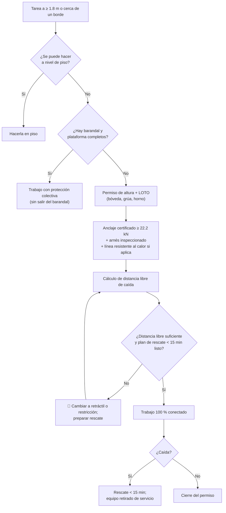

# MS-ACE-10 — Trabajo en altura (bóveda, plataformas, grúas)

| Código | Versión | Estado | Área | Dueño del proceso | Elaboró | Revisión técnica | Revisión de seguridad | Aprobó | Fecha | Próxima revisión |
|---|---|---|---|---|---|---|---|---|---|---|
| MS-ACE-10 | 0.1 | Borrador para validación | Toda la Acería | C-16 Especialista de Seguridad e Higiene de Acería | experto-seguridad-salud | experto-operativo-metalurgia | experto-seguridad-salud | Pendiente (Gerente de Acería / Director) | 2026-09-25 | 2027-09-25 |

> ⚠️ **Mensaje clave.** Desde **1.8 m** de altura se requiere protección contra caídas (NOM-009-STPS-2011). **Anclaje de 22.2 kN (5,000 lb) por persona, arnés de cuerpo completo inspeccionado, línea resistente al calor cerca del horno, y un plan de rescate que baje a la persona en menos de 15 minutos** (el trauma por suspensión puede matar en ese tiempo). Estándar corporativo **CRS-03**, ligado al caso de fatalidad en el laminador.

## 1. Objetivo y alcance

**Objetivo:** prevenir caídas de personas y de objetos al trabajar a 1.8 m o más, o cerca de bordes, aberturas o fosas.

**Aplica a:** bóveda y plataforma de electrodos del EAF (adición y empalme de electrodos, cambio de delta, 5.º agujero), plataforma del LF, torreta y plataforma de colada, distribuidores sobre carro, puentes y pasillos de grúas (mantenimiento, cambio de cable), casa de bolsas y ductos, silos y tolvas, andamios, escaleras marinas y portátiles, plataformas de elevación móviles, bordes de fosas.

## 2. Roles y responsabilidades

| Rol | Responsabilidad en este proceso | R/A/C/I |
|---|---|---|
| C-16 Especialista de Seguridad e Higiene | Dueño; inventario de puntos de anclaje certificados; aprueba el plan de rescate | A |
| C-11 / C-12 / C-05 / C-06 (emisor) | Emite el permiso de trabajo en altura; verifica anclaje, equipo y rescate | R |
| Trabajador autorizado (S-19, S-20, S-22, S-23, S-24, S-02, S-03, contratistas) | Inspecciona su equipo; se mantiene 100 % conectado | R |
| Supervisor de la tarea / observador | Vigila; activa el rescate | R |
| Brigada de rescate en altura | Rescata en < 15 min | R |
| Ingeniería / C-14 | Certifica puntos de anclaje y líneas de vida fijas | R |
| Almacén | Controla vida útil, inspección y retiro de arneses | R |

## 3. Descripción del proceso

**Jerarquía de controles:** (1) eliminar el trabajo en altura (hacerlo a nivel de piso); (2) protección colectiva (barandales, plataformas, redes); (3) sistema de restricción (no permite llegar al borde); (4) sistema de detención de caídas (arnés + absorbedor o retráctil + anclaje); (5) rescate.

## 4. Equipos y maquinaria

| Equipo / componente | Función | Especificación clave | Condición para operar (verificación) |
|---|---|---|---|
| Punto de anclaje | Soporta la fuerza de la caída | **≥ 22.2 kN (5,000 lb) por persona conectada**, o sistema diseñado por ingeniero con factor de seguridad 2 [Verificar NOM-009] | Certificado, identificado con placa; inspección anual [Supuesto] |
| Arnés de cuerpo completo | Distribuye la fuerza de detención | Anillo D dorsal; argollas de rescate en hombros; talla correcta | Inspección antes de cada uso; formal cada 6 meses [Supuesto]; retirar tras una caída |
| Línea de conexión con absorbedor | Limita la fuerza | Longitud ≤ 1.8 m; fuerza de detención ≤ 6 kN [Verificar norma del equipo] | Indicador de impacto intacto |
| Línea de conexión resistente al calor | Cerca del horno, olla, distribuidor | Cable de acero o aramida; **no nylon ni poliéster en zona de calor radiante** | Sin quemaduras ni fibras fundidas |
| Retráctil (bloque de detención) | Reduce la caída libre | Para bordes o poca distancia libre; con función de rescate si aplica | Prueba de bloqueo antes de usar |
| Línea de vida horizontal (fija o temporal) | Movilidad en pasillos de grúa y techos | Diseñada por ingeniero | Certificada; tensión correcta |
| Barandal | Protección colectiva | Pasamanos, barra intermedia y rodapié; altura según NOM-009 (≈ 0.90–1.10 m) [Verificar NOM-009] | Completo y firme |
| Andamio | Plataforma temporal | Armado por personal competente; tarjeta verde "apto" | Tarjeta verde vigente |
| Equipo de rescate | Bajar al trabajador suspendido | Kit de rescate por descenso controlado; trípode; plataforma de elevación | En el sitio antes de iniciar |
| Plataforma de elevación móvil (PEMP) | Acceso a altura | Inspección previa; arnés anclado a la canasta | Lista de inspección diaria |

## 5. Parámetros de operación

| Parámetro | Unidad | Objetivo | Rango normal | Alarma / límite | Acción si está fuera de rango | Dónde se mide |
|---|---|---|---|---|---|---|
| Altura que exige protección | m | — | — | ≥ 1.8 m (NOM-009) o cualquier altura sobre metal líquido, fosas o maquinaria | Aplicar este manual | Medición |
| Resistencia del anclaje por persona | kN | ≥ 22.2 | ≥ 22.2 (5,000 lb) | < 22.2 kN o sin certificar | 🛑 No usar; otro anclaje | Placa / certificado |
| Caída libre máxima | m | ≤ 0.6 (anclaje sobre la cabeza) | ≤ 1.8 | > 1.8 m | Reubicar anclaje; usar retráctil | Estimación en el permiso |
| Distancia libre de caída requerida (línea de 1.8 m con absorbedor) | m | Calcular | ≈ 6 [Supuesto: 1.8 línea + 1.75 absorbedor + 1.5 trabajador + 1 margen] | Distancia disponible menor | Usar retráctil o restricción | Cálculo en el permiso |
| Tiempo de rescate de una persona suspendida | min | ≤ 10 | < 15 | ≥ 15 min | 🛑 No iniciar sin plan de rescate que cumpla | Simulacro |
| Temperatura en la zona de trabajo cercana al horno | °C | Horno sin arco, sin metal a la vista | Según MS-ACE-08 | Superficie > 50 °C al contacto [Supuesto] | Línea resistente al calor; esperar | Pirómetro |
| Viento (trabajo a la intemperie: techos, casa de bolsas) | km/h | < 30 | < 40 [Supuesto] | ≥ 40 km/h o tormenta eléctrica | Suspender | Anemómetro / aviso meteorológico |
| Herramientas en altura | — | Amarradas | Todas | Herramienta suelta | Amarrar; delimitar abajo | Supervisor |
| Zona de caída de objetos bajo el trabajo | m | Delimitada | Radio ≥ 1/3 de la altura, mínimo 3 m [Supuesto] | Personas dentro | Detener; despejar | Visual |

## 6. Seguridad

### 6.1 Peligros y controles críticos

| Peligro | Consecuencia | Control crítico | Verificación |
|---|---|---|---|
| Caída desde la bóveda o plataforma de electrodos | Fatalidad | Sobre la bóveda o fuera de barandal: LOTO del horno (arco fuera, interruptor abierto) + anclaje + línea resistente al calor. Plataforma de electrodos con barandal completo en tarea de rutina: llave cautiva según MS-ACE-02 §6.4 | Permiso firmado / conteo de llaves |
| Caída desde pasillos de grúa | Fatalidad | LOTO de barras colectoras y de la grúa; topes/bloqueo de la otra grúa en la misma vía; línea de vida | Permiso + LOTO |
| Golpe de grúa en movimiento a persona en la vía | Fatalidad | Bloqueo de la vía (topes y LOTO de las grúas vecinas) | C-04 confirma |
| Línea de conexión quemada por calor | Falla de la detención | Cable de acero o aramida; no nylon | Inspección |
| Trauma por suspensión | Pérdida de conciencia, muerte | Rescate < 15 min; correas de alivio en el arnés | Simulacro |
| Caída de objetos | Golpe a personas abajo | Herramientas amarradas; delimitación | Visual |
| Caída en aberturas o fosas | Lesión grave | Tapas y barandales; señalización | Recorrido por turno |
| Andamio mal armado | Colapso | Tarjeta verde por persona competente | Tarjeta |

### 6.2 EPP obligatorio

Casco **con barbiquejo**, lentes, guantes, botas, ropa FR o algodón, arnés de cuerpo completo con línea adecuada; cerca del horno o de metal líquido, además el EPP de la zona (MS-ACE-08).

### 6.3 Permisos, bloqueos y zonas de exclusión

- **Permiso de trabajo en altura** con: tarea, altura, anclaje identificado, cálculo de distancia libre, equipo inspeccionado, plan de rescate y firma del emisor.
- LOTO cuando el trabajo está en o sobre equipos (bóveda, grúas, torreta, segmentos): MS-ACE-02.
- Zona delimitada abajo con cinta y letrero "TRABAJO EN ALTURA — NO PASAR".

## 7. Calidad

| Variable crítica de calidad | Especificación | Método / frecuencia | Registro | Defecto si falla |
|---|---|---|---|---|
| Empalme de electrodos (trabajo en la plataforma de electrodos) | Par de apriete y limpieza de niples según OEM (MO-EAF-08) | Cada empalme | Registro de electrodos | Rotura de electrodo, arco inestable |
| Integridad de equipos tras trabajos en altura | Sin herramientas u objetos olvidados en bóveda, grúa o torreta | Recorrido de cierre | Permiso cerrado | Objetos al baño; daño a la grúa |

## 8. Procedimiento paso a paso

| # | Paso | Cómo hacerlo (detalle y medición) | Criterio de aceptación | ★ | Rol |
|---|---|---|---|---|---|
| 1 | Evalúa la tarea | ¿Puede hacerse en piso? ¿Hay barandal completo? Elige: colectiva → restricción → detención | Método definido | ★ | Emisor |
| 2 | Emite el permiso y el LOTO | Permiso de altura + LOTO del horno, la grúa o el equipo (MS-ACE-02); la llave cautiva solo vale para el acceso de rutina de MS-ACE-02 §6.4 | Permiso firmado; LOTO verificado | ★ | Emisor |
| 3 | Identifica el anclaje | Usa solo anclajes con placa de ≥ 22.2 kN o líneas de vida certificadas; nunca tuberías, barandales, charolas de cable ni la propia grúa sin certificar | Anclaje certificado | ★ | Trabajador |
| 4 | Inspecciona tu equipo | Arnés (costuras, hebillas, anillo D, etiqueta), línea (absorbedor sin activar, ganchos con doble seguro), retráctil (bloqueo) | Sin defectos | ★ | Trabajador |
| 5 | Calcula la distancia libre | Longitud de línea + elongación del absorbedor + altura del trabajador + 1 m; compárala con la distancia al piso u obstáculo | Distancia disponible ≥ requerida | ★ | Emisor |
| 6 | Prepara el rescate | Kit de rescate en sitio; rescatista designado; tiempo estimado < 15 min | Rescate listo | ★ | Emisor, brigada |
| 7 | Delimita abajo | Cinta y letrero; radio ≥ 3 m | Zona libre | | Observador |
| 8 | Sube con 3 puntos de apoyo | En escaleras, 3 puntos de contacto; herramientas en bolsa o amarradas | Ascenso seguro | | Trabajador |
| 9 | Trabaja 100 % conectado | En desplazamientos usa doble línea (una siempre conectada) | Nunca desconectado | ★ | Trabajador |
| 10 | Si hay caída | Observador activa el rescate de inmediato; el suspendido mueve las piernas y usa las correas de alivio | Persona abajo < 15 min | ★ | Observador, brigada |
| 11 | Cierra | Retira herramientas y materiales; revisa que no queden objetos en la bóveda o la grúa; cierra el permiso y el LOTO | Área limpia | | Emisor |

## 9. Condiciones anormales y respuesta

| Síntoma / alarma | Causa probable | Acción inmediata | A quién avisar |
|---|---|---|---|
| Persona suspendida tras una caída | Caída detenida | Rescate inmediato; no dejar suspendida > 15 min; atención médica aunque se vea bien | Brigada, servicio médico |
| Equipo con indicador de impacto activado | Caída previa | Retirar de servicio | Almacén, C-16 |
| Anclaje sin placa o dañado | Falta de certificación | No usar; reportar | C-16, C-14 |
| Grúa se mueve con persona en la vía | LOTO incompleto | Alarma y paro de emergencia; revisión del bloqueo | C-04, C-16 |
| Calor radiante inesperado (horno energizado, olla cerca) | Falta de coordinación | Bajar; revisar LOTO y programa de ollas | C-04 |
| Viento fuerte o tormenta | Clima | Suspender y bajar | Emisor |

## 10. Registros

- Permisos de trabajo en altura con cálculo de distancia libre y plan de rescate.
- Inventario y certificación de puntos de anclaje y líneas de vida.
- Registro de inspección formal de arneses y líneas (y retiros).
- Tarjetas de andamios.
- Simulacros de rescate en altura (tiempos).

## 11. Competencia requerida y certificación

| Rol | Nivel requerido (1–4) | Formación teórica (h) | OJT supervisado (h / eventos) | Evaluación (pasos ★) | Vigencia |
|---|---|---|---|---|---|
| Trabajador autorizado en altura | 3 | 8 (CRS-03, NOM-009) + práctica en torre | 3 tareas supervisadas | Pasos 3, 4, 9 | 12 meses [Verificar calendario regulatorio] |
| Emisor del permiso | 4 | 12 (incluye cálculo de distancia libre y rescate) | 5 permisos con tutor | Pasos 1, 2, 5, 6 | 12 meses (alturas) |
| Rescatista en altura (brigada) | 4 | 16–24 (rescate técnico) | 2 simulacros al año | Rescate < 15 min | 12 meses |
| Armador de andamios | 4 | 16 | 5 armados | Armado e inspección | 12 meses (alturas) |
| Contratistas | 3 | 8 (TD-P08 + CRS-03) | 1 tarea supervisada | Pasos 3, 4, 9 | 12 meses |

**Lista corta de verificación de pasos ★:**
1. ¿Usa solo anclajes certificados de ≥ 22.2 kN (5,000 lb)?
2. ¿Inspecciona arnés y línea, y usa línea resistente al calor cerca del horno?
3. ¿Calcula la distancia libre de caída?
4. ¿Hay plan de rescate < 15 min antes de iniciar?
5. ¿Permanece 100 % conectado con doble línea al desplazarse?
6. ¿Elige el método (colectiva → restricción → detención) y emite el permiso con LOTO o, solo en acceso de rutina, con llave cautiva (pasos 1 y 2)?
7. ¿El observador activa el rescate de inmediato si hay una caída (paso 10)?

## 12. Referencias

- NOM-009-STPS-2011 (trabajos en altura), NOM-017-STPS-2008, NOM-006-STPS-2014, NOM-004-STPS-1999, NOM-029-STPS-2011 [Verificar con la NOM vigente / SSO]. ANSI/ASSP Z359 y EN 361/EN 355 como referencias de equipo.
- CRS-03 Trabajo en alturas; S-05 Brigadas (rescate).
- MO-EAF-08, MM-EAF-02, MM-GR-01; MS-ACE-02, 04, 08, 09.

## 13. Control de cambios

| Versión | Fecha | Cambio | Autor |
|---|---|---|---|
| 0.1 | 2026-09-25 | Creación del borrador para validación | experto-seguridad-salud (con criterio técnico de experto-operativo-metalurgia) |
| 0.2 | 2026-09-25 | Revisión cruzada: vigencia de 12 meses para emisor y armador de andamios; criterio de llave cautiva frente a LOTO (MS-ACE-02 §6.4); pasos ★ 1, 2 y 10 en la lista | experto-seguridad-salud |
