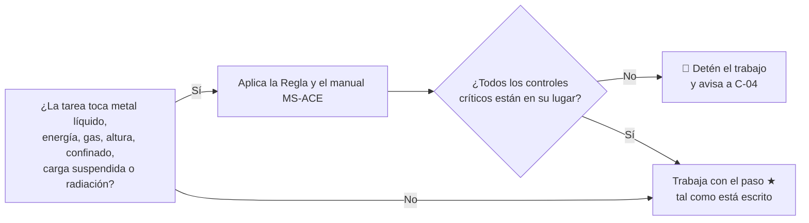

# Manuales de Seguridad de la Acería (MS-ACE) — Índice

| Código | Versión | Estado | Custodio | Elaboró | Revisión técnica | Fecha |
|---|---|---|---|---|---|---|
| MS-ACE (serie 01–10) | 0.1 | **Borrador para validación** | C-16 Especialista de Seguridad e Higiene de Acería (MS-ACE-09: C-04) | experto-seguridad-salud | experto-operativo-metalurgia | 2026-09-25 |

> **Mensaje clave.** Estos 10 manuales cubren los riesgos que pueden matar en la Acería (metal líquido, energía, agua–metal, cargas suspendidas, espacios confinados, gases, radiación, calor, emergencias y altura). Cada manual sigue la plantilla de 13 secciones de `../00-guia-de-estilo-y-plantillas.md`. Sus pasos ★ son la base de la certificación en campo (**TD-P07**). Los datos de proceso salen de `../00-ficha-tecnica-acería.md` (FT-ACE-001). Los valores normativos están marcados **[Verificar con la NOM vigente / SSO]** y los que dependen de la planta o del fabricante, **[Supuesto]** o **[Validar con OEM]**. **Ningún manual se usa en planta sin la validación de C-16, Ingeniería de Proceso y el Gerente de Acería.**

## 1. Índice de manuales

| Código | Manual | Dueño | Aplica a | CRS | NOMs principales | Figuras |
|---|---|---|---|---|---|---|
| [MS-ACE-01](MS-ACE-01-metal-liquido-zonas-exclusion.md) | Metal líquido: zonas de exclusión, EPP aluminizado, distancias | C-16 | Todos los roles de planta | CRS-08 | 017, 015, 006, 026, 002 | Zonas de la nave |
| [MS-ACE-02](MS-ACE-02-loto-aislamiento-bloqueo.md) | Aislamiento y bloqueo (LOTO) de EAF, LF, CC y equipos | C-16 | Operación y mantenimiento | CRS-01, CRS-11 | 004, 029, 033, 012 | Puntos LOTO del EAF y de CC |
| [MS-ACE-03](MS-ACE-03-explosiones-agua-metal-liquido.md) | Prevención de explosiones agua–metal líquido | C-07 / C-16 | EAF, ollas, CC, patio | CRS-08, CRS-09 | 002, 005, 017 | Árbol de emergencias (rama A) |
| [MS-ACE-04](MS-ACE-04-izaje-gruas-colada-cargas-suspendidas.md) | Izaje con grúas de colada y de carga; cargas suspendidas | C-16 | S-04, S-09, S-13, mantenimiento | CRS-04, CRS-05 | 006, 004, 009 | Rutas de ollas |
| [MS-ACE-05](MS-ACE-05-espacios-confinados.md) | Espacios confinados (ollas, distribuidores, fosas, ductos, casa de bolsas) | C-16 | S-08, S-15, S-24, mantenimiento | CRS-02 | 033, 010, 009, 027 | EPP por zona |
| [MS-ACE-06](MS-ACE-06-gases-co-o2-argon-gas-natural.md) | Gases: CO, O₂, argón y N₂, gas natural | C-16 | Todos | CRS-10 | 010, 005, 018, 033, 020 | Árbol de emergencias (rama E) |
| [MS-ACE-07](MS-ACE-07-fuentes-radiactivas.md) | Fuentes radiactivas (Cs-137 de CC2, pórtico de chatarra) | C-16 + ESR | S-05, S-12, S-14, S-21 | — | 012 + CNSNS, 026 | Detalle Cs-137; pórtico |
| [MS-ACE-08](MS-ACE-08-estres-termico-epp.md) | Estrés térmico, hidratación y EPP | C-16 | Todos | — | 015, 017, 011 | EPP por zona |
| [MS-ACE-09](MS-ACE-09-respuesta-emergencias.md) | Respuesta a emergencias | **C-04** | Todos | Todos | 002, 019, 030 | Árbol de emergencias; zonas |
| [MS-ACE-10](MS-ACE-10-trabajo-en-altura.md) | Trabajo en altura (bóveda, plataformas, grúas) | C-16 | Operación y mantenimiento | CRS-03 | 009, 017, 006 | Puntos LOTO del EAF |

**Figuras SVG de la serie** (`../img/`): `ms-zonas-exclusion-nave.svg`, `ms-loto-puntos-eaf.svg`, `ms-loto-puntos-cc.svg`, `ms-epp-acería.svg`, `ms-emergencia-arbol-decision.svg`.

## 2. Reglas que Salvan Vidas de la Acería

> Una página para el tablero de cada área, la inducción y la plática de inicio de turno. Romper una de estas reglas es una **falta grave**; detener el trabajo para cumplirlas **nunca** se sanciona. [La consecuencia disciplinaria requiere revisión de Relaciones Laborales y del CCT.]

| # | Regla | Números que debes saber | Manual |
|---|---|---|---|
| 1 | **Nunca te pongas bajo una carga suspendida ni en la ruta de una olla llena.** | Ruta de olla: roja ± 5 m, amarilla ± 15 m | 04 |
| 2 | **Respeta la zona roja.** Entras solo si eres personal esencial, con EPP aluminizado **seco**, y con la ruta de escape libre. | Vaciado: roja ≤ 10 m, amarilla 10–25 m · refugio en ≤ 30 s | 01 |
| 3 | **Nada húmedo, nada cerrado, nada frío toca el metal líquido.** | Olla ≥ 1,000 °C · 1 L de agua → > 1,700 L de vapor | 03 |
| 4 | **Con agua en el horno: arco fuera, NO bascules, aléjate.** | Δ caudal > 2 % alarma, > 4 % disparo · evacuación ≤ 25 m | 03, 09 |
| 5 | **Un candado, una persona, una llave.** Prueba energía cero antes de tocar. | 0 V · 0 bar · calzas y pasadores puestos | 02 |
| 6 | **Nunca cierres el agua de molde con acero en la máquina.** | Agua de emergencia en ≤ 15 s | 02, 09 |
| 7 | **Porta tu detector y obedécelo.** | CO 25 ppm → sal · CO 200 ppm → evacúa · O₂ < 19.5 % o > 23.5 % → sal · gas natural ≥ 10 % LEL → sal | 06 |
| 8 | **No entres a un espacio confinado sin permiso, medición, vigía y rescate. El vigía nunca entra.** | Mide O₂ → LEL → tóxicos, arriba–medio–abajo · desconecta el argón de la olla | 05 |
| 9 | **Desde 1.8 m, 100 % conectado.** | Anclaje ≥ 22.2 kN (5,000 lb) · rescate < 15 min · línea resistente al calor cerca del horno | 10 |
| 10 | **Solo el ESR toca la fuente radiactiva. El camión que suena en el pórtico no se descarga.** | Obturador cerrado + candado · < 2 × fondo para trabajar | 07 |
| 11 | **Hidrátate y respeta el descanso por calor.** | 250 mL cada 15–20 min · régimen WBGT NOM-015 · aclimatación 5 días | 08 |
| 12 | **En una emergencia: protégete, da la alarma, C-04 manda.** Nunca agua sobre metal; nunca rescate sin ERA. | "EMERGENCIA ×3 · lugar · tipo" · conteo ≤ 10 min | 09 |
| 13 | **Si algo no está bien, detén el trabajo.** | Derecho y obligación de todos | Todos |

## 3. Valores clave consolidados (para la capacitación)

| Tema | Valor | Fuente / estado |
|---|---|---|
| CO | Alarma 25 ppm (VLE-PPT) · evacuación 200 ppm (techo NIOSH) · IDLH 1,200 ppm | NOM-010-STPS-2014 [Verificar con la NOM vigente / SSO] |
| Oxígeno | 19.5–23.5 % | NOM-033-STPS-2015 [Verificar] |
| Gas natural / H₂ | 10 % LEL trabajo y alarma; 20 % LEL evacuación; trabajo en caliente en confinado solo con 0 % | NOM-033 [Verificar]; 0 % [Supuesto conservador] |
| Estrés térmico | Régimen por WBGT y carga (Tabla A1 NOM-015); 250 mL cada 15–20 min | NOM-015-STPS-2001 [Verificar] |
| Altura | ≥ 1.8 m; anclaje ≥ 22.2 kN; caída libre ≤ 1.8 m; rescate < 15 min | NOM-009-STPS-2011 [Verificar] |
| Radiación | POE con dosímetro; restricción interna ≤ 6 mSv/año [Supuesto]; límite legal según RGSR/CNSNS | NOM-012-STPS-2012 + CNSNS [Verificar] |
| Agua del EAF | Δ caudal > 2 % alarma, > 4 % disparo; panel > 60 °C; presión < 3 bar | FT-ACE-001 |
| Agua de molde | CC1 ΔT > 11 °C, CC2 ΔT > 12 °C o caudal < 90 %; emergencia ≤ 15 s | FT-ACE-001 |
| Zonas de exclusión | Vaciado ≤ 10 / 25 m; canasta ≤ 15 m; ruta de olla ± 5 / ± 15 m; arranque de CC ≤ 10 / 20 m | [Supuesto — Validar con C-16 / estudio de la nave] |
| Grúa de colada | 250 t, doble freno, prueba 200–300 mm × 10 s, holgura ≥ 1 m | FT-ACE-001 + [Supuesto] |

## 4. Revisión cruzada requerida

- **experto-operativo-metalurgia:** visto bueno técnico de los parámetros de proceso usados (hecho en la redacción; pendiente la firma formal).
- **Relaciones Laborales:** régimen de descansos por calor, consecuencias disciplinarias de las Reglas que Salvan Vidas y horas de capacitación del personal sindicalizado (CMCAP, DC-3).
- **Documentación y Mejora:** alta de la serie MS-ACE en el control documental.
- **Jurídico / SSO de GASM:** verificación de todas las referencias normativas marcadas.

## 5. Decisión requerida del Director

| Opción | Descripción | Riesgo | Costo | 
|---|---|---|---|
| **A (recomendada)** | Aprobar la serie como **borrador de capacitación** y ordenar su validación en 60 días por C-16, Ingeniería de Proceso y el ESR (estudio de zonas de exclusión de la nave, mediciones WBGT por puesto, verificación de NOMs); usar las 13 Reglas en inducción desde ya | Bajo: las reglas son conservadoras | Horas de C-16 / ingeniería; estudio de la nave [Supuesto: servicio externo de higiene si no hay capacidad interna] |
| B | Esperar a validar todos los valores antes de usar cualquier contenido | Se retrasa la capacitación en riesgos críticos | Sin costo adicional inmediato |
| C | Usar los manuales en planta sin validación | **Alto**: valores [Supuesto] podrían no corresponder a la planta real | — |

**Decisiones puntuales a confirmar:** (1) umbrales de CO 25/200 ppm (alternativa más conservadora: evacuación de sector a 50 ppm); (2) frecuencia de simulacros (4 de campo por cuadrilla al año + tabletop mensual); (3) restricción interna de dosis (≤ 6 mSv/año) con el ESR; (4) vigencia de 12 meses para alturas, confinados, grúas y eléctrico frente a los 24 meses de TD-P07.

**Fecha límite sugerida para decidir:** 2026-10-15 [Supuesto].
