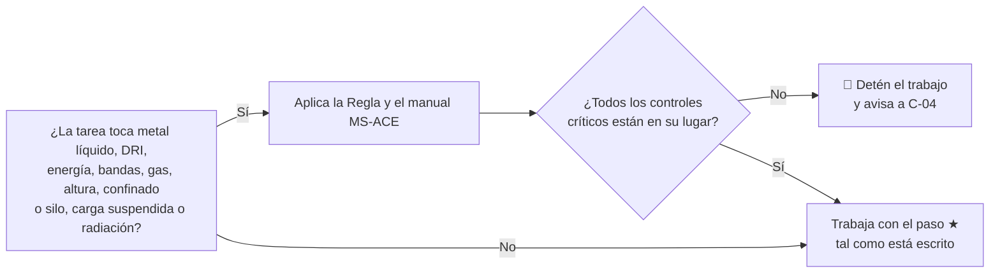

# Manuales de Seguridad de la Acería (MS-ACE) — Índice

| Código | Versión | Estado | Custodio | Elaboró | Revisión técnica | Fecha |
|---|---|---|---|---|---|---|
| MS-ACE (serie 01–10) | 0.3 | **Borrador para validación** | C-16 Especialista de Seguridad e Higiene de Acería (MS-ACE-09: C-04) | experto-seguridad-salud | experto-operativo-metalurgia | 2026-09-28 |

> **Actualización por la decisión D-010 (2026-09-28).** GASM **no fabrica acero con chatarra comprada**: el EAF se carga con **≈ 95–100 % DRI de pelet propio**, que llega por **bandas transportadoras directas** desde HYL y Midrex a los **silos de día** y entra en continuo por el **5.º agujero**; los retornos internos son ≤ 5 % (`../../00-cadena-de-valor/CV-GASM-001-cadena-de-valor.md`). **Salen** de la serie: explosivos y recipientes cerrados en chatarra comprada, pórtico de radiación de camiones y canasta en cada colada. **Entran:** humedad y reoxidación del DRI (autocalentamiento, H₂ con agua, explosión al contacto con metal líquido), polvo y finos de DRI, bandas transportadoras (atrapamiento, guardas, paro por cable, LOTO), silos de día (espacio confinado, N₂ de inertización, CO/H₂, puenteo) y la interfaz con HYL/Midrex (quién bloquea qué). El detalle por manual está en la sección 13 (control de cambios) de cada uno.

> **Mensaje clave.** Estos 10 manuales cubren los riesgos que pueden matar en la Acería (metal líquido, energía y bandas, agua y humedad del DRI, cargas suspendidas, espacios confinados y silos, gases y polvo, radiación de fuentes de medición, calor, emergencias y altura). Cada manual sigue la plantilla de 13 secciones de `../00-guia-de-estilo-y-plantillas.md`. Sus pasos ★ son la base de la certificación en campo (**TD-P07**). Los datos de proceso salen de `../00-ficha-tecnica-acería.md` (FT-ACE-001). Los valores normativos están marcados **[Verificar con la NOM vigente / SSO]** y los que dependen de la planta o del fabricante, **[Supuesto]** o **[Validar con OEM]**. **Ningún manual se usa en planta sin la validación de C-16, Ingeniería de Proceso y el Gerente de Acería.**

## 1. Índice de manuales

| Código | Manual | Dueño | Aplica a | CRS | NOMs principales | Figuras |
|---|---|---|---|---|---|---|
| [MS-ACE-01](MS-ACE-01-metal-liquido-zonas-exclusion.md) | Metal líquido: zonas de exclusión, EPP aluminizado, distancias (incluye la puerta de escoria durante la alimentación de DRI) | C-16 | Todos los roles de planta | CRS-08 | 017, 015, 006, 026, 002 | Zonas de la nave |
| [MS-ACE-02](MS-ACE-02-loto-aislamiento-bloqueo.md) | Aislamiento y bloqueo (LOTO) de EAF, LF, CC, bandas y silos de DRI; interfaz con HYL/Midrex (§6.5) | C-16 | Operación y mantenimiento | CRS-01, CRS-11, CRS-15 | 004, 029, 033, 012 | Puntos LOTO del EAF y de CC (bandas: pendiente) |
| [MS-ACE-03](MS-ACE-03-explosiones-agua-metal-liquido.md) | **Explosiones por agua y humedad: DRI húmedo, agua y metal líquido** | C-07 / C-16 | Bandas y silos de DRI, EAF, ollas, CC, retornos | CRS-08, CRS-09, CRS-10 | 002, 005, 010, 017, 027, 033 | Árbol de emergencias (rama A) |
| [MS-ACE-04](MS-ACE-04-izaje-gruas-colada-cargas-suspendidas.md) | Izaje con grúas de colada y de carga; cargas suspendidas (canasta solo ocasional; polipastos de bandas) | C-16 | S-04, S-09, S-13, mantenimiento | CRS-04, CRS-05 | 006, 004, 009 | Rutas de ollas |
| [MS-ACE-05](MS-ACE-05-espacios-confinados.md) | Espacios confinados (ollas, distribuidores, fosas, ductos, casa de bolsas, **silos de día y torres de DRI**) | C-16 | S-05, S-08, S-15, S-24, mantenimiento | CRS-02 | 033, 010, 009, 027 | EPP por zona |
| [MS-ACE-06](MS-ACE-06-gases-co-o2-argon-gas-natural.md) | Gases y polvo: CO, O₂, argón y N₂ (incluida la inertización de silos), gas natural, H₂, polvo de DRI | C-16 | Todos | CRS-10 | 010, 005, 018, 033, 020 | Árbol de emergencias (rama E) |
| [MS-ACE-07](MS-ACE-07-fuentes-radiactivas.md) | Fuentes radiactivas selladas de medición (Cs-137 de CC2; nivel de silos de día si existe) y control de retornos internos. **Sin pórtico de chatarra** | C-16 + ESR | S-05, S-12, S-14, S-21, S-25, C-17 | — | 012 + CNSNS, 026 | Detalle Cs-137 (silo: pendiente) |
| [MS-ACE-08](MS-ACE-08-estres-termico-epp.md) | Estrés térmico, hidratación y EPP (incluye polvo de DRI y ropa en bandas) | C-16 | Todos | — | 015, 017, 011 | EPP por zona |
| [MS-ACE-09](MS-ACE-09-respuesta-emergencias.md) | Respuesta a emergencias (nuevos escenarios I: evento de DRI en silo o banda; J: atrapamiento en banda) | **C-04** | Todos | Todos | 002, 019, 030 | Árbol de emergencias; zonas |
| [MS-ACE-10](MS-ACE-10-trabajo-en-altura.md) | Trabajo en altura (bóveda, plataformas, grúas, galerías de bandas y techos de silos) | C-16 | Operación y mantenimiento | CRS-03 | 009, 017, 006 | Puntos LOTO del EAF |

**Figuras SVG de la serie** (`../img/`): `ms-zonas-exclusion-nave.svg`, `ms-loto-puntos-eaf.svg`, `ms-loto-puntos-cc.svg`, `ms-epp-acería.svg`, `ms-emergencia-arbol-decision.svg`.

**Figuras pendientes por D-010** (fuera de esta carpeta; no se modificaron): `ms-zonas-exclusion-nave.svg` todavía muestra el patio de chatarra y el pórtico, y no muestra silos, bandas ni la zona de la puerta de escoria; `ms-emergencia-arbol-decision.svg` no tiene las ramas I y J; `ms-epp-acería.svg` no tiene la fila de bandas y silos. Faltan dos figuras nuevas: puntos LOTO de bandas y silos con la frontera de RD, y medidor de nivel del silo (si existe).

## 2. Reglas que Salvan Vidas de la Acería

> Una página para el tablero de cada área, la inducción y la plática de inicio de turno. Romper una de estas reglas es una **falta grave**; detener el trabajo para cumplirlas **nunca** se sanciona. [La consecuencia disciplinaria requiere revisión de Relaciones Laborales y del CCT.]

| # | Regla | Números que debes saber | Manual |
|---|---|---|---|
| 1 | **Nunca te pongas bajo una carga suspendida ni en la ruta de una olla llena.** | Ruta de olla: roja ± 5 m, amarilla ± 15 m | 04 |
| 2 | **Respeta la zona roja.** Entras solo si eres personal esencial, con EPP aluminizado **seco**, y con la ruta de escape libre. | Vaciado: roja ≤ 10 m, amarilla 10–25 m · refugio en ≤ 30 s | 01 |
| 3 | **El DRI nunca se moja. Nada húmedo, nada cerrado, nada frío toca el metal líquido.** Nunca laves con agua bandas ni silos; nunca apagues DRI con agua. | DRI ≤ 1 % de humedad [Supuesto] y ≤ 80 °C en banda · olla ≥ 1,000 °C · 1 L de agua → > 1,700 L de vapor · 1 kg de agua con DRI → hasta ≈ 1.2 m³ de H₂ | 03 |
| 4 | **Con agua en el horno: arco fuera, NO bascules, aléjate.** | Δ caudal > 2 % alarma, > 4 % disparo · evacuación a ≥ 25 m del horno | 03, 09 |
| 5 | **Un candado, una persona, una llave.** Prueba energía cero antes de tocar. En la frontera con HYL/Midrex, **candado de las dos plantas**. | 0 V · 0 bar · calzas, pasadores y contrapeso asegurados · llave cautiva solo para acceso de rutina; para intervenir el equipo, LOTO completo (MS-ACE-02 §6.4 y §6.5) | 02 |
| 6 | **Nunca cierres el agua de molde con acero en la máquina.** | Agua de emergencia en ≤ 15 s | 02, 09 |
| 7 | **Porta tu detector y obedécelo.** | CO 25 ppm → sal · CO 200 ppm → evacúa · O₂ < 19.5 % o > 23.5 % → sal · gas natural ≥ 10 % LEL → sal · ≥ 20 % LEL → evacúa | 06 |
| 8 | **No entres a un espacio confinado sin permiso, medición, vigía y rescate. El vigía nunca entra. Nadie se para sobre el DRI de un silo.** | Mide O₂ → LEL → tóxicos, arriba–medio–abajo · entra con < 10 % LEL; trabajo en caliente solo con 0 % LEL detectable (≤ 1 %) · desconecta el argón de la olla · brida ciega en el N₂ del silo · silo vacío; el puenteo se derriba desde afuera | 05 |
| 9 | **Desde 1.8 m, 100 % conectado.** | Anclaje ≥ 22.2 kN (5,000 lb) · rescate < 15 min · línea resistente al calor cerca del horno | 10 |
| 10 | **Solo el ESR (C-16) toca una fuente radiactiva (Cs-137 de CC2). Ningún equipo con trébol va a retornos ni a chatarra.** | Obturador cerrado + candado · < 2 × fondo para trabajar · objeto sospechoso: aléjate ≥ 3 m y avisa en ≤ 5 min | 07 |
| 11 | **Hidrátate y respeta el descanso por calor.** | 250 mL cada 15–20 min · régimen WBGT NOM-015 · aclimatación 5 días | 08 |
| 12 | **En una emergencia: protégete, da la alarma, C-04 manda.** Nunca agua sobre metal; nunca rescate sin ERA. | "EMERGENCIA ×3 · lugar · tipo" · conteo ≤ 10 min | 09 |
| 13 | **Si algo no está bien, detén el trabajo.** | Derecho y obligación de todos | Todos |
| 14 | **Nunca toques, limpies ni cruces una banda en movimiento. El cable de paro no es un bloqueo.** | Guardas puestas o la banda no arranca · LOTO para meter la mano o el cuerpo · ropa ajustada | 02, 08 |

```mermaid
flowchart LR
    A["¿La tarea toca metal líquido, DRI,<br/>energía, bandas, gas, altura, confinado<br/>o silo, carga suspendida o radiación?"] -- "Sí" --> B["Aplica la Regla y el manual MS-ACE"]
    B --> C{"¿Todos los controles<br/>críticos están en su lugar?"}
    C -- "No" --> D["🛑 Detén el trabajo<br/>y avisa a C-04"]
    C -- "Sí" --> E["Trabaja con el paso ★<br/>tal como está escrito"]
    A -- "No" --> E
```

## 3. Valores clave consolidados (para la capacitación)

| Tema | Valor | Fuente / estado |
|---|---|---|
| CO | Alarma 25 ppm (VLE-PPT, salir) · evacuación 200 ppm (techo NIOSH) [Verificar NOM-010] · IDLH 1,200 ppm | NOM-010-STPS-2014 [Verificar con la NOM vigente / SSO] |
| Oxígeno | 19.5–23.5 % | NOM-033-STPS-2015 [Verificar] |
| Gas natural / H₂ | Entrada a confinado < 10 % LEL; 10 % LEL alarma (salir); 20 % LEL evacuación; trabajo en caliente solo con 0 % LEL detectable (≤ 1 % de lectura del equipo). En silos y torres de DRI el detector debe leer H₂ (sensor corregido o específico) | NOM-033 [Verificar]; ≤ 1 % [Supuesto conservador]; criterio único en MS-ACE-05; sensor de H₂ [Validar con OEM del detector] |
| DRI | Humedad ≤ 0.5 % objetivo, > 1 % rechazo [Supuesto]; ≤ 80 °C en banda [Supuesto]; metalización ≥ 92 %; finos < 3 mm ≤ 5 % y fuera del 5.º agujero | CV-GASM-001 §4.2; MS-ACE-03 |
| Silos de día de DRI (4, ≈ 1,000 t c/u [Supuesto]) | Inertización con N₂; DRI ≤ 80 °C; **alarma > 90 °C o subida > 5 °C/h** (autocalentamiento); CO y H₂ sin tendencia al alza; entrada solo con silo vacío y brida ciega en el N₂; extinción con N₂, nunca agua | FT-ACE-001 v0.4 §2.1 [Validar con OEM]; MS-ACE-03 §6.4, 05, 06 |
| Polvo de DRI | VLE de NOM-010 para partículas y óxido de hierro; respirador P100 según evaluación | NOM-010-STPS-2014 [Verificar con la NOM vigente / SSO] |
| Estrés térmico | Régimen por WBGT y carga (Tabla A1 NOM-015); 250 mL cada 15–20 min | NOM-015-STPS-2001 [Verificar] |
| Altura | ≥ 1.8 m; anclaje ≥ 22.2 kN; caída libre ≤ 1.8 m; rescate < 15 min | NOM-009-STPS-2011 [Verificar] |
| Radiación | POE con dosímetro; restricción interna ≤ 6 mSv/año [Supuesto]; límite legal según RGSR/CNSNS | NOM-012-STPS-2012 + CNSNS [Verificar] |
| Agua del EAF | Δ caudal > 2 % alarma, > 4 % disparo; panel > 60 °C; presión < 3 bar | FT-ACE-001 |
| Agua de molde | CC1 ΔT > 11 °C, CC2 ΔT > 12 °C o caudal < 90 %; emergencia ≤ 15 s | FT-ACE-001 |
| Zonas de exclusión | Vaciado ≤ 10 / 25 m; canasta ocasional de retornos ≤ 15 m; puerta de escoria con alimentación de DRI ≤ 10 / 25 m; ruta de olla ± 5 / ± 15 m; arranque de CC ≤ 10 / 20 m | [Supuesto — Validar con C-16 / estudio de la nave] |
| Grúa de colada | 250 t, doble freno, prueba 200–300 mm × 10 s, holgura ≥ 1 m | FT-ACE-001 + [Supuesto] |
| Vigencia de certificaciones | 12 meses: alturas, espacios confinados, grúas/izaje, eléctrico (NOM-029) y fuentes radiactivas · 24 meses como máximo: demás tareas críticas (TD-P07) | Criterio unificado en la revisión cruzada 2026-09-25 (ver `REVISION-SEGURIDAD.md`) |

## 4. Revisión cruzada requerida

- **experto-operativo-metalurgia:** visto bueno técnico de los parámetros de proceso usados (hecho en la redacción; pendiente la firma formal). Con D-010: confirmar humedad, temperatura en banda, metalización y finos del DRI, tasa de alimentación y la inertización de los silos contra FT-ACE-001 v0.4.
- **Relaciones Laborales (D-010):** alcance de S-05 *Operador de Manejo de DRI y Retornos* y C-17 *Supervisor de Manejo de Materiales (DRI, fundentes y retornos)* (nombres tomados de CAT-ACE-001 actualizado; la plantilla de S-05 baja de ≈ 97 a ≈ 30 [Supuesto]); horas nuevas de formación (DRI, bandas, silos) y la falta grave de la Regla 14.
- **Gerencia de RD (HYL/Midrex):** acuerdo de interfaz Acería–RD (MS-ACE-02 §6.5): frontera física, lista de puntos y caja grupal compartida.
- **Relaciones Laborales:** régimen de descansos por calor, consecuencias disciplinarias de las Reglas que Salvan Vidas y horas de capacitación del personal sindicalizado (CMCAP, DC-3).
- **Documentación y Mejora:** alta de la serie MS-ACE en el control documental.
- **Jurídico / SSO de GASM:** verificación de todas las referencias normativas marcadas.

## 5. Decisión requerida del Director

| Opción | Descripción | Riesgo | Costo | 
|---|---|---|---|
| **A (recomendada)** | Aprobar la serie como **borrador de capacitación** y ordenar su validación en 60 días por C-16, Ingeniería de Proceso y el ESR (estudio de zonas de exclusión de la nave, mediciones WBGT por puesto, verificación de NOMs); usar las 14 Reglas en inducción desde ya | Bajo: las reglas son conservadoras | Horas de C-16 / ingeniería; estudio de la nave [Supuesto: servicio externo de higiene si no hay capacidad interna] |
| B | Esperar a validar todos los valores antes de usar cualquier contenido | Se retrasa la capacitación en riesgos críticos | Sin costo adicional inmediato |
| C | Usar los manuales en planta sin validación | **Alto**: valores [Supuesto] podrían no corresponder a la planta real | — |

**Decisiones puntuales a confirmar:** (1) umbrales de CO 25/200 ppm (alternativa más conservadora: evacuación de sector a 50 ppm); (2) frecuencia de simulacros (4 de campo por cuadrilla al año + tabletop mensual); (3) restricción interna de dosis (≤ 6 mSv/año) con el ESR; (4) vigencia de 12 meses para alturas, confinados, grúas/izaje, eléctrico y fuentes radiactivas frente a los 24 meses de TD-P07 (ya aplicada en todos los manuales; ver `REVISION-SEGURIDAD.md`).

**Decisiones nuevas por D-010 (2026-09-28):**

| # | Decisión | A (recomendada) | B | Riesgo | Costo | Fecha límite |
|---|---|---|---|---|---|---|
| D-010-S1 | Acuerdo de interfaz Acería–RD para bloquear bandas en la frontera | Instruir que Acería y RD firmen el acuerdo (frontera, lista de puntos, doble candado) en ≤ 30 días y **prohibir intervenir el punto de frontera hasta que exista** | Que cada planta bloquee "lo suyo" sin acuerdo escrito | B: una banda de RD arranca con una persona de la Acería en el chute (atrapamiento o sepultamiento) | A: horas de C-16, C-17 y RD; sin inversión [Supuesto] | 2026-10-15 [Supuesto] |
| D-010-S2 | Pórtico detector de radiación existente | Retirar su uso para camiones; **conservar un medidor portátil** en retornos y el control de bajas de equipos con fuente; pedir al ESR la opción de reubicar el pórtico en la entrada de retornos si el costo es bajo | Mantener el pórtico operando con la misma rutina | A: bajo si el control de bajas funciona. B: costo de calibración y entrenamiento sin riesgo que controlar | A: medidor portátil (probablemente ya existe) [Supuesto]; B: mantenimiento anual del pórtico [Supuesto] | 2026-10-31 [Supuesto] |
| D-010-S3 | Alcance del puesto S-05/C-17 y recertificación | Recalificar a S-05 y C-17 en DRI, bandas y silos (MS-ACE-02, 03, 05, 06, 07, 09) **antes** de operar con 100 % DRI; retirar de su plan las competencias de pórtico y chatarra | Mantener el plan anterior y capacitar después del arranque | B: personal sin competencia en los nuevos riesgos críticos (silo, H₂, bandas) | A: ≈ 40 h de formación + OJT por persona [Supuesto]; validar horas con Relaciones Laborales y la CMCAP | 2026-10-31 [Supuesto] |
| D-010-S4 | Detectores fijos en silos y torres | Pedir a Ingeniería confirmar e instalar, si faltan, detectores de O₂, CO y H₂ en techos de silo y torres cerradas, y detectores personales con H₂ para S-05/C-17 | Solo detectores personales | B: sin alarma temprana de H₂ o de N₂ en zonas de tránsito | A: por cotizar [Supuesto] | 2026-10-31 [Supuesto] |

**Fecha límite sugerida para decidir:** 2026-10-15 [Supuesto].

## 6. Control de cambios del índice

| Versión | Fecha | Cambio | Autor |
|---|---|---|---|
| 0.1 | 2026-09-25 | Creación del índice, Reglas que Salvan Vidas y valores consolidados | experto-seguridad-salud |
| 0.3 | 2026-09-28 | D-010: índice con los nuevos títulos de MS-ACE-03 y MS-ACE-07; Reglas 3, 5, 8 y 10 actualizadas y Regla 14 nueva (bandas); valores de DRI, silos, H₂ y polvo; decisiones D-010-S1 a S4; figuras pendientes | experto-seguridad-salud |
