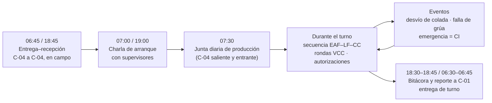
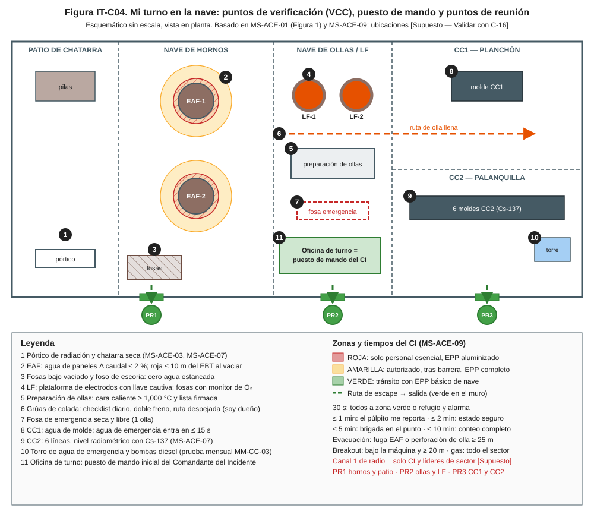
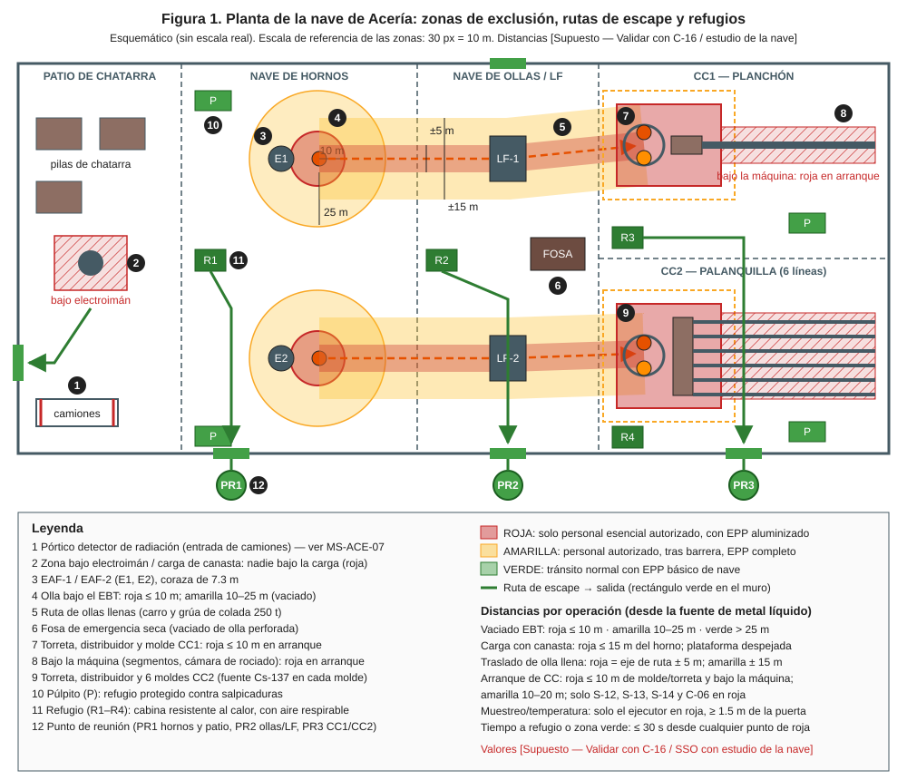
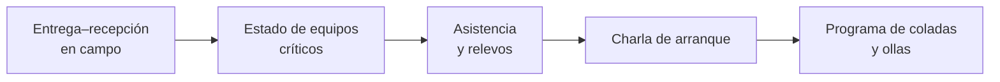
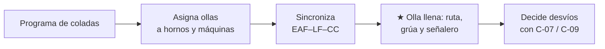
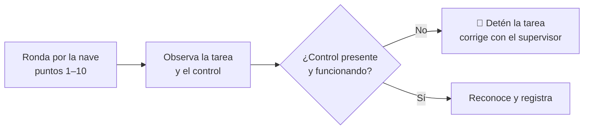
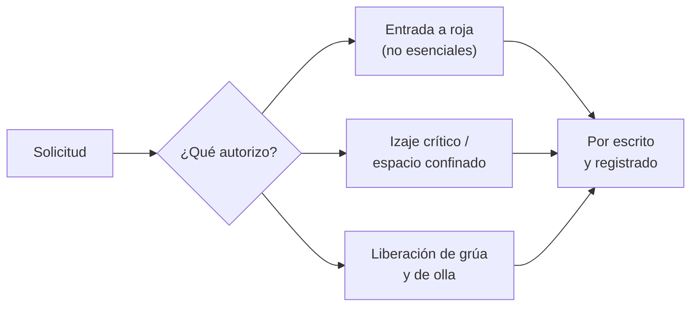
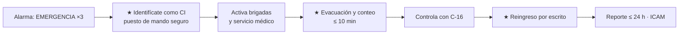
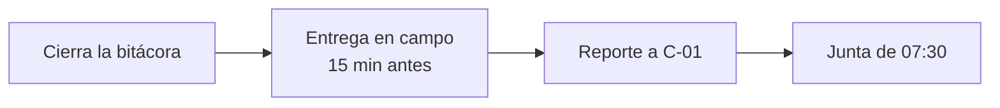

# IT-ACE-C04 — Instrucción de Trabajo: Jefe de Turno de Acería (incluye Comandante del Incidente)

## 1. Encabezado de control

| Campo | Valor |
|---|---|
| Código | IT-ACE-C04 |
| Versión | 0.1 |
| Estado | Borrador para validación |
| Rol | C-04 Jefe de Turno de Acería (confianza, banda A3) |
| Área | Toda la Acería en el turno: hornos, LF, ollas, patio, CC1, CC2 y mantenimiento de turno |
| Turno | 4x4 de 12 h, día y noche (relevo 07:00 / 19:00; entrega–recepción 15 min antes, en campo) |
| Reporta a | C-01 Gerente de Acería (lineamientos técnicos de C-02, C-03 y C-10) |
| Manuales de referencia | MS-ACE-09 (dueño) · MO-OLL-02 (dueño) · MS-ACE-01, 02, 03, 04, 05, 06, 08 · MO-EAF-01, 02, 07 · MO-CC1-03/05 · MO-CC2-03/05 · MM-EAF-01 · MM-CC-03 · MM-GR-01 · MM-OLL-01 · FT-ACE-001 |
| Elaboró | experto-operativo-metalurgia (con diseño instruccional) |
| Revisión técnica | experto-operativo-metalurgia — visto bueno, 2026-09-25 |
| Revisión de seguridad | Pendiente — experto-seguridad-salud |
| Revisión laboral | Pendiente — experto-relaciones-laborales |
| Aprobó | Pendiente — Director |

> Esta IT **resume** tus rutinas de supervisión. **No reemplaza a los manuales.** Lo marcado **[Validar con OEM / Ingeniería de Proceso]** o **[Supuesto]** no se usa hasta que el dueño del proceso lo valide.

## 2. Mi puesto en 30 segundos

Soy la **máxima autoridad de la Acería en el turno**: 6 supervisores y 159 sindicalizados. Coordino la secuencia horno → olla → colada, decido ante desviaciones y **mando en emergencias como Comandante del Incidente (CI)**. Soy dueño del traslado de ollas llenas (MO-OLL-02) y de la respuesta a emergencias (MS-ACE-09). Entrego el turno seguro, con el programa cumplido y el equipo en condiciones.

> ★ **Mis 3 reglas de oro**
> 1. **Ninguna olla llena se mueve** sin ruta despejada, grúa liberada (doble freno y límites) y señalero asignado.
> 2. **Nunca autorices puentear un enclavamiento.** Una condición anormal se autoriza con el supervisor del área y por escrito.
> 3. **En emergencia: primero las personas.** Asume el mando, cuenta a todos en ≤ 10 min y autoriza el reingreso solo por escrito.

## 3. Mi turno de 12 horas

## 4. Mi área de trabajo

Figuras de apoyo:

## 5. Mi EPP

| EPP | Cuándo lo uso |
|---|---|
| Casco con barbiquejo, lentes y protección auditiva | Siempre en la nave |
| Ropa ignífuga (FR) y botas metatarsales | Siempre en la nave |
| Detector personal multigás | Siempre; CO 25 ppm → salir; 200 ppm → evacuar el sector |
| EPP aluminizado completo | Si entras a zona roja durante una VCC o una emergencia |
| Radio con canal de emergencia | Siempre; prueba al inicio del turno |

## 6. Mis tareas (rutinas de supervisión)

### Tarea 1 — Arranque de turno (DP C-04; MS-ACE-09 §4)

| Paso | Qué hago | Cómo verifico (medición) | ★ |
|---|---|---|---|
| 1 | Recibe el turno del C-04 saliente en campo, 15 min antes del relevo. | Bitácora leída: pendientes, equipos fuera, permisos abiertos. | |
| 2 | Confirma grúas de colada liberadas. | Checklist pre-uso de S-09 y tarjeta verde en cabina. | ★ |
| 3 | Confirma fosa de emergencia seca y libre. | Inspección por turno registrada. | ★ |
| 4 | Confirma el agua de emergencia de CC. | Última prueba mensual vigente (MM-CC-03); entrada ≤ 15 s. | ★ |
| 5 | Prueba el radio y el canal de emergencia. | Canal 1 [Supuesto] funcionando. | |
| 6 | Revisa asistencia y relevos; asigna personal certificado. | Cada puesto con certificación TD-P07 vigente. | ★ |
| 7 | Da la charla de arranque con los supervisores. | Riesgos del turno, trabajos especiales y programa. | |

> 🛑 **ALTO — no arranques la secuencia si…**
> - Una grúa de colada no tiene checklist o tarjeta verde.
> - La fosa de emergencia tiene agua o no está libre.
> - Un puesto crítico no tiene persona certificada.

### Tarea 2 — Coordinar la secuencia y los traslados de ollas (MO-OLL-02, dueño)

| Paso | Qué hago | Cómo verifico (medición) | ★ |
|---|---|---|---|
| 1 | Asigna ollas a coladas según secuencia y disponibilidad. | 7 ollas en ciclo; lista de entrega de S-08. | |
| 2 | Sincroniza EAF, LF y CC para no cortar secuencias. | Tap-to-tap ≤ 55 min; olla en torreta ≥ 10 min antes del final. | |
| 3 | Prioriza las grúas de colada entre movimientos. | Retrasos por grúa ≤ 1 % de coladas. | |
| 4 | Verifica que cada olla llena tenga ruta despejada, grúa liberada y señalero. | Nadie bajo la ruta (roja ± 5 m). | ★ |
| 5 | Decide si una olla con peso > 240 t [Supuesto] o bordo libre < 300 mm se mueve. | Decisión registrada; con C-07 si aplica. | ★ |
| 6 | Olla que no llega a 1,000 °C o "sin Ar": decide con C-07 / C-15. | Decisión en bitácora. | |
| 7 | Colada fuera de T o química: decide reajuste en LF, cambio de grado o retorno. | Criterio de C-07 / C-09; producto sospechoso retenido. | 🔎 |
| 8 | Olla siguiente retrasada: coordina con C-06 bajar velocidad o cerrar secuencia. | CC1 mínimo 0.8 m/min (MO-CC1-05). | |

> 🛑 **ALTO — detén el traslado si…**
> - Hay una persona bajo la ruta o la grúa tiene un freno o límite en falla.
> - La olla tiene punto rojo o fuga: ruta de emergencia y MS-ACE-09.

### Tarea 3 — Verificación de controles críticos (VCC) en campo

| Paso | Qué hago | Cómo verifico (medición) | ★ |
|---|---|---|---|
| 1 | Patio: pórtico sin alarma, chatarra sin recipientes cerrados ni agua. | MS-ACE-03 pasos 1–3; MS-ACE-07. | ★ |
| 2 | EAF: agua de paneles y zona del EBT. | Δ caudal ≤ 2 %, presión 4–6 bar, paneles ≤ 60 °C; roja ≤ 10 m al vaciar. | ★ |
| 3 | Fosas bajo vaciado y foso de escoria. | Cero agua estancada; bombas de achique probadas. | ★ |
| 4 | LF: plataforma de electrodos y fosas de argón. | Tablero de llaves completo; monitor de O₂ sin alarma. | ★ |
| 5 | Preparación de ollas: temperatura y lista. | Cara caliente ≥ 1,000 °C; regla de olla fría (> 4 h → ≥ 8 h). | ★ |
| 6 | CC1 y CC2: agua de molde y arranques. | ΔT y caudal en rango; lista de arranque firmada; roja ≤ 10 m. | ★ |
| 7 | LOTO y permisos abiertos en el turno. | Candados personales; energía cero probada. | ★ |
| 8 | Estrés térmico e hidratación. | Régimen por WBGT; 250 mL cada 15–20 min. | |
| 9 | Registra cada VCC y cierra hallazgos con el supervisor. | VCC realizadas vs. programadas ≥ 95 % [Supuesto]. | |

> 🛑 **ALTO — detén la tarea si…** falta o falla un control crítico. Reanuda solo después de corregirlo con el supervisor del área.

### Tarea 4 — Autorizaciones y firmas del turno

| Paso | Qué hago | Cómo verifico (medición) | ★ |
|---|---|---|---|
| 1 | Autoriza por escrito la entrada a zona roja de personal no esencial. | Acompañado por operador certificado (MS-ACE-01). | ★ |
| 2 | Emite el permiso de izaje crítico con plan de izaje. | Carga > 75 % de capacidad, tándem o accesorios no estándar (MS-ACE-04). | ★ |
| 3 | Emite el permiso de espacio confinado. | O₂ 19.5–23.5 %; < 10 % LEL; CO < 25 ppm; vigía; rescate ≤ 10 min (MS-ACE-05). | ★ |
| 4 | Firma la liberación de la grúa tras la inspección semanal. | Checklist de MM-GR-01 firmado con C-11. | ★ |
| 5 | Recibe la tarjeta de olla tras cambio de placas o tapón. | Tarjeta firmada por S-08 / C-15 (MM-OLL-01). | |
| 6 | Autoriza con el supervisor la operación en condición anormal. | Registro en bitácora; **nunca** puentear enclavamientos. | ★ |

> 🛑 **ALTO — no firmes si…** falta una lectura, un candado, el vigía o el plan de izaje.

### Tarea 5 — Comandante del Incidente (MS-ACE-09, pasos 5, 6, 9 y 11)

| Paso | Qué hago | Cómo verifico (medición) | ★ |
|---|---|---|---|
| 1 | Recibe el reporte inicial del púlpito. | ≤ 1 min: qué, dónde, personas, acciones. | |
| 2 | Identifícate por radio como CI y fija el puesto de mando en zona segura. | Canal 1 solo para CI y líderes de sector [Supuesto]. | ★ |
| 3 | Confirma que el púlpito puso el proceso en estado seguro. | ≤ 2 min: arco fuera, olla/distribuidor cerrados, ESD de gas, olla a la fosa. | ★ |
| 4 | Activa brigadas y servicio médico; ordena la evacuación del sector. | Fuga EAF o perforación de olla ≥ 25 m; breakout bajo la máquina y ≥ 20 m; gas: sector completo. | ★ |
| 5 | Recibe el conteo de los líderes de sector en PR1, PR2 y PR3. | Conteo completo ≤ 10 min; faltante = búsqueda dirigida por brigada con ERA. | ★ |
| 6 | Pide a C-16 medición y zonas; la brigada actúa solo por tu orden. | Brigada en el punto ≤ 5 min [Supuesto]. | ★ |
| 7 | Avisa a C-01, a la guardia y a Seguridad del Complejo. | Comunicación externa solo por C-01 y canales autorizados. | |
| 8 | Autoriza el reingreso por escrito con C-16. | Atmósfera en rango (< 10 % LEL, CO < 25 ppm, O₂ 19.5–23.5 %), metal solidificado, LOTO. | ★ |
| 9 | Preserva la escena y reporta. | Reporte inicial ≤ 24 h; ICAM; alerta de seguridad. | |

> 🛑 **Prohibido en cualquier escenario:** agua sobre metal líquido, rescate sin ERA, pasar personas u ollas bajo una carga, reintroducir agua a un molde sobrecalentado sin C-06/C-08.

**Escenarios y acción inmediata (resumen de MS-ACE-09 §6.1):**

| Escenario | Acción inmediata que verificas |
|---|---|
| A. Fuga de agua en el EAF | Arco fuera; evacuación ≥ 25 m; no bascular; reinicio con C-05 + C-07 |
| B. Perforación de olla | Olla a la fosa de emergencia seca; evacuación ≥ 25 m |
| C. Breakout en CC | Cierre de olla y distribuidor; agua de molde y secundaria se mantienen; ≥ 20 m |
| D. Agua de molde / apagón | Agua de emergencia ≤ 15 s; si no entra, cierre inmediato; plataforma ≥ 10 m |
| E. Fuga de gas | ESD de gas; evacuación del sector; sin chispas |
| F. Derrame / incendio | Dejar solidificar; arena seca; aislar hidráulica y energía |
| G. Radiológico | MS-ACE-07 §8B con el ESR |
| H. Lesionado | Proteger la escena; primeros auxilios; servicio médico |

### Tarea 6 — Entrega de turno y reporte

| Paso | Qué hago | Cómo verifico (medición) | ★ |
|---|---|---|---|
| 1 | Cierra la bitácora: coladas, secuencias, desvíos, fallas, permisos abiertos. | Bitácora electrónica completa. | |
| 2 | Entrega al C-04 entrante en campo, 15 min antes del relevo. | Pendientes y equipos fuera explicados. | |
| 3 | Reporta a C-01 y participa en la junta de 07:30 (turno de noche). | Indicadores del turno reportados. | |

> 🛑 **ALTO — no entregues el turno** sin explicar en campo los permisos abiertos, los equipos fuera de servicio y los hallazgos de VCC sin cerrar.

## 7. Mis controles críticos (★)

- ☐ Grúas de colada con checklist y tarjeta verde.
- ☐ Fosa de emergencia seca y libre.
- ☐ Agua de emergencia de CC con prueba mensual vigente.
- ☐ Personal certificado en cada puesto crítico.
- ☐ Olla llena: ruta despejada, grúa liberada, señalero asignado.
- ☐ Permisos (izaje crítico, espacio confinado, zona roja) completos y por escrito.
- ☐ Ningún enclavamiento puenteado.
- ☐ Canal de emergencia probado; puntos de reunión conocidos por todos.

## 8. Si algo sale mal

| Síntoma | Qué hago | A quién aviso |
|---|---|---|
| Cualquier emergencia A–H | Asume el CI (Tarea 5). | C-01, C-16, brigadas — canal 1 [Supuesto] |
| C-04 no disponible en emergencia | Asume el CI el supervisor de mayor jerarquía presente (C-05 o C-06). | C-01 |
| Falta una persona en el conteo | Búsqueda dirigida por brigada con EPP/ERA; nunca individual. | C-16 — canal 1 |
| Radio saturado | Mensajeros designados; teléfonos de emergencia. | Líderes de sector |
| Evento escala (incendio mayor, varios lesionados) | Solicita apoyo externo por canales autorizados. | C-01 |
| Grúa de colada fuera de servicio | Reasigna movimientos a la otra grúa; revisa secuencia. | C-11, C-06 — ext. 4200 [Supuesto] |
| Colada fuera de química | Decide destino con criterio de C-07 / C-09. | C-09 — ext. 4300 [Supuesto] |

## 9. Registros que lleno

| Registro | Cuándo | Dónde |
|---|---|---|
| Bitácora de turno (secuencia, desvíos, fallas, decisiones) | Todo el turno | Bitácora electrónica de turno |
| VCC realizadas y hallazgos | Cada ronda | Sistema de SSO / scorecard |
| Permisos emitidos (izaje crítico, espacio confinado, entrada a roja) | Cada permiso | Sistema de permisos de trabajo |
| Bitácora del CI (horas, decisiones, personas) | En cada emergencia | Bitácora del CI (MS-ACE-09) |
| Reporte inicial de incidente | ≤ 24 h | Sistema de SSO |
| Actas de simulacro | ≥ 1 por cuadrilla por trimestre | Programa de simulacros |

## 10. Mi certificación

| Manual | Nivel ILUO | Teoría | OJT | Pasos ★ que me evalúan | Vigencia |
|---|---|---|---|---|---|
| MS-ACE-09 (CI) | **O** (4) | 16 h (comando de incidentes, escenarios A–H) | 4 tabletop + 2 simulacros como CI | 5, 6, 9 | 24 meses (TD-P07) |
| MO-OLL-02 (dueño) | **O** (4) | 16 h + evaluador | — | Decisión en emergencia de olla | 24 meses (TD-P07) |
| MS-ACE-04 (izaje crítico) | **U** (3) | 8 h (planeación de izaje crítico) | 5 planes de izaje | Paso 4 + plan de izaje | **12 meses** |
| MS-ACE-05 (emisor del permiso) | **O** (4) | 12 h | 5 permisos con tutor | 1, 2, 6 | **12 meses** |
| MS-ACE-01 | **O** (4) | 12 h | 20 eventos supervisados | 1, 4, 6, 11 + simulacro | 24 meses (TD-P07) |

Plan del puesto (DP-ACE-C): inducción 40 h (ERC y mando de incidentes), L-1 "Líder de Turno" 96 h, rotación técnica 160 h, seguridad 40 h, gente 16 h. La DP marca **12 meses** para grúas/izaje (MS-ACE-04, MO-OLL-02); MO-OLL-02 §11 dice 24 meses para C-04: pendiente de homologar. Simulacros con su cuadrilla: ≥ 1 por trimestre; tabletop mensual.

## 11. Glosario rápido

| Término | Qué significa |
|---|---|
| CI | Comandante del Incidente: quien manda en la emergencia |
| VCC | Verificación de controles críticos en campo |
| PR1, PR2, PR3 | Puntos de reunión: hornos y patio; ollas y LF; CC1 y CC2 |
| ESD | Corte remoto de gas natural y O₂ |
| ERA | Equipo de respiración autónoma |
| ICAM | Método de análisis de incidentes |
| Izaje crítico | Izaje con permiso escrito y plan (MS-ACE-04 §6.3) |
| Tabletop | Ejercicio de mesa del CI con los supervisores |
| Tarjeta verde | Liberación de la grúa tras la inspección de mantenimiento |

## 12. Control de cambios

| Versión | Fecha | Cambio | Autor |
|---|---|---|---|
| 0.1 | 2026-09-25 | Emisión inicial para validación, desde MS-ACE-09, MO-OLL-02, MS-ACE-01/04/05, MM-GR-01, MM-OLL-01 y DP-ACE-C (C-04) | experto-operativo-metalurgia |
