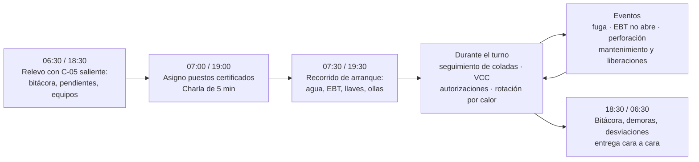
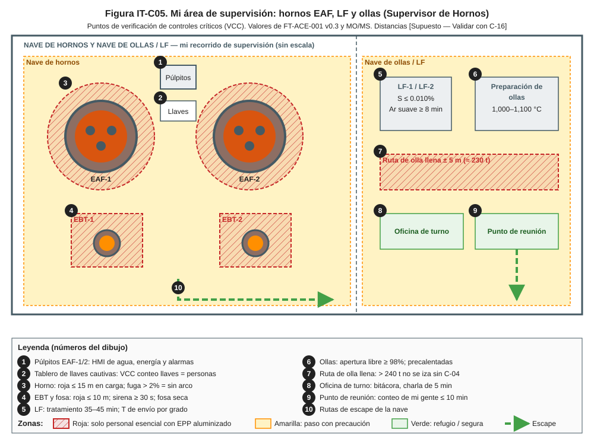
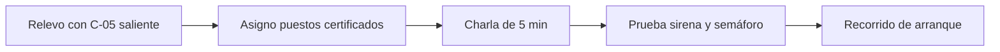
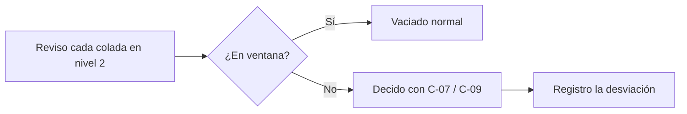
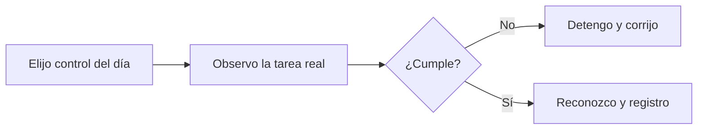
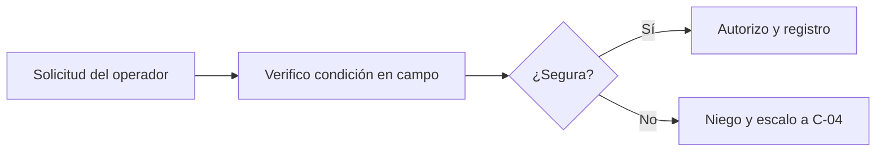
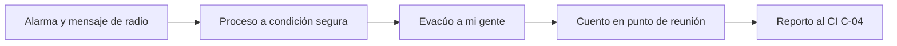
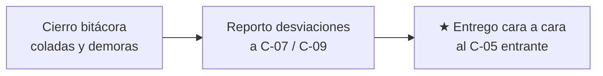

# IT-ACE-C05 — Instrucción de Trabajo: Supervisor de Hornos (EAF / LF)

## 1. Encabezado de control

| Campo | Valor |
|---|---|
| Código | IT-ACE-C05 |
| Versión | 0.1 |
| Estado | Borrador para validación |
| Rol | C-05 Supervisor de Hornos (EAF / LF) · confianza, banda A4 |
| Área | Hornos — modalidad EAF (EAF-1 y EAF-2) o modalidad LF/ollas (LF-1, LF-2, preparación de ollas, grúas de colada) |
| Turno | 4x4 de 12 h (relevo 07:00 / 19:00); 2 por cuadrilla (1 EAF + 1 LF/ollas) |
| Reporta a | C-02 Superintendente de Hornos (línea sólida); C-04 Jefe de Turno (mando operativo en turno) |
| Manuales de referencia | Dueño (A): MO-EAF-01, 02, 06, 07, 08. Supervisa (R): MO-EAF-03, 04, 05, MO-OLL-01, 02, MO-LF-01, MS-ACE-01 a 06, 08, 09, 10. FT-ACE-001 v0.3 |
| Elaboró | experto-operativo-metalurgia (con enfoque de diseño de capacitación) |
| Revisión técnica | experto-operativo-metalurgia — visto bueno, 2026-09-25 |
| Revisión de seguridad | experto-seguridad-salud — visto bueno (con observaciones), 2026-09-26 |
| Revisión laboral | experto-relaciones-laborales — visto bueno (con observaciones), 2026-09-26 |
| Aprobó | Pendiente — Director |

> Esta IT **no reemplaza** a los manuales: resume tus rutinas de supervisión. Si hay duda, manda el manual. Los valores salen de FT-ACE-001 v0.3 y conservan sus marcas [Validar con OEM / Ingeniería de Proceso] y [Supuesto].

## 2. Mi puesto en 30 segundos
Dirijo en el turno la operación segura de los hornos (o del LF y las ollas). Superviso a 31 sindicalizados por turno en EAF (S-01, S-02, S-03, S-04, S-10) o 21 en LF/ollas (S-06, S-07, S-08, S-09). Hago cumplir los manuales, verifico los controles críticos en campo y autorizo lo que los operadores no pueden decidir solos. Cuido el tap-to-tap de 55 min y la química y temperatura que pide la colada continua. En una emergencia soy **líder de sector**: estabilizo mi área y cuento a mi gente.

> **★ Mis 3 reglas de oro**
> 1. ★ **Fuga = sin arco:** Δ caudal > 2%, T de panel > 60 °C o presión < 3 bar → arco detenido y personal fuera hasta confirmar la causa. Tras un disparo (> 4%) **nunca se reenciende sin localizar la fuga**.
> 2. ★ **Veo con mis ojos:** zona de exclusión, llaves cautivas y LOTO se verifican en campo, no por radio.
> 3. ★ **Solo personal certificado** en tareas críticas (TD-P07 vigente); si no hay, cubro con el relevo, nunca con alguien sin certificar.

## 3. Mi turno de 12 horas

> **Jornada de mi cuadrilla (nota laboral).** El relevo y la entrega–recepción antes de las 07:00 / 19:00 son tiempo de trabajo, también para mí (LFT art. 58). Programo relevos, charlas y capacitación dentro de la jornada. Lo que exceda se paga según el CCT o la política de confianza. La jornada de 12 h y la reforma de 40 h están en revisión (arts. 59–61 y 66–68) — verificar con Jurídico Laboral.

## 4. Mi área de trabajo

Figuras de apoyo: [zonas de exclusión de la nave](../img/ms-zonas-exclusion-nave.svg) · [puntos de bloqueo del EAF](../img/ms-loto-puntos-eaf.svg).

## 5. Mi EPP

| EPP (pictograma en texto) | Cuándo lo uso |
|---|---|
| [Casco con barbiquejo + careta dorada] | Todo el recorrido por la nave |
| [Chaquetón, capucha, guantes y polainas aluminizados] | Al verificar en zona roja (vaciado, puerta, LF) |
| [Ropa FR o 100 % algodón] | Todo el turno |
| [Botas metatarsales] | Todo el turno |
| [Protección auditiva doble] | Piso del horno (≥ 105 dB(A)) |
| [Detector personal CO/O₂] | Hornos, LF, fosas y plataformas |
| [Arnés] | Plataformas de bóveda y columnas (MS-ACE-10) |

Verifico también el EPP de mi gente: aluminizado seco, sin ropa sintética.

## 6. Mis tareas (rutinas de supervisión)

### Tarea 1 — Arranque de turno

| Paso | Qué hago | Cómo verifico (medición) | ★ |
|---|---|---|---|
| 1 | Recibo el turno cara a cara y leo la bitácora. | Pendientes, fugas, electrodos, ollas y equipos fuera de servicio | |
| 2 | Asigno puestos solo a personal con certificación vigente. | Matriz TD-P07 del turno; suplencia con la categoría inferior certificada | ★ |
| 3 | Doy la charla de 5 min: riesgos del día y tareas no rutinarias. | Asistencia registrada; análisis de riesgo si hay tarea no rutinaria | |
| 4 | Confirmo la prueba de sirena, semáforo y CCTV. | Sirena audible en la zona amarilla; si falla, 🛑 no hay vaciado | ★ |
| 5 | Reviso el agua de ambos hornos en la HMI. | Δ caudal ≤ 2% · T de panel ≤ 60 °C · presión 4–6 bar | ★ |
| 6 | Reviso el plan de rotación por calor y la aclimatación. | Rotación cada 1–2 h en piso; nuevos al 20% el día 1 | |
| 7 | Modalidad LF/ollas: reviso ollas en ciclo y precalentamiento. | Cara caliente 1,000–1,100 °C; olla fría > 4 h → ≥ 8 h | 🔎 |

> **🛑 ALTO — detén y avisa si…**
> - Falta personal certificado para una tarea crítica.
> - Sirena o semáforo no funcionan: no hay vaciado.
> - El agua está fuera de límite al recibir el turno.

### Tarea 2 — Seguimiento de coladas y decisiones de proceso (MO-EAF-06, MO-EAF-07, MO-LF-01)

| Paso | Qué hago | Cómo verifico (medición) | ★ |
|---|---|---|---|
| 1 | Sigo energía, O₂, carbono y tiempos de cada colada. | 560 kWh/t (520–600) · O₂ 30–40 Nm³/t · C 8–12 kg/t · arco 42–44 min | 🔎 |
| 2 | Confirmo la ventana de vaciado del grado. | T 1,630 ± 15 °C · O 500–900 ppm · C 0.04–0.08% · P ≤ 0.015% | 🔎 |
| 3 | Decido con C-09 si P > 0.015%: no se vacía sin decisión. | Decisión registrada | ★ |
| 4 | Autorizo vaciar fuera de T solo con criterio del grado. | < 1,610 o > 1,650 °C requiere mi autorización | |
| 5 | Si el laboratorio tarda > 6 min, autorizo vaciar solo si el grado lo permite. | S-01 decide con T y O; consulto a C-09 | |
| 6 | Coordino con C-06 los tiempos de envío y con C-17 las canastas. | Tap-to-tap ≤ 55 min; canastas a tiempo | |
| 7 | Modalidad LF: vigilo el tratamiento. | 35–45 min · S ≤ 0.010% · Al soluble 0.020–0.045% (CC1) · argón suave ≥ 8 min · primera olla + 10–15 °C | 🔎 |

> **🛑 ALTO — detén y avisa si…**
> - P > 0.015% o residuales fuera de grado: no se vacía sin decisión de C-09.
> - La olla pesa > 240 t: no se iza sin C-04.
> - Se piden más de 4.3 t/min de DRI sin validación de C-07.

### Tarea 3 — Verificación de controles críticos en campo (VCC)

| Paso | Qué hago | Cómo verifico (medición) | ★ |
|---|---|---|---|
| 1 | Observo una preparación entre coladas. | S-01 registra agua; S-02 revisa visual; arena ≤ 0.5% humedad | ★ |
| 2 | Verifico la zona de exclusión en un vaciado y en una carga. | Nadie a ≤ 10 m del EBT / ≤ 15 m en carga; sirena ≥ 30 s | ★ |
| 3 | Verifico llaves cautivas en un acceso a plataforma. | Conteo de llaves = conteo de personas; confirmación de S-01 en HMI | ★ |
| 4 | Verifico un LOTO antes de entrar al horno, bóveda o LF. | Candado de cada ejecutante; energía cero probada (MS-ACE-02) | ★ |
| 5 | Verifico que sondas, adiciones, ollas y fosas estén secas. | Sin humedad visible | ★ |
| 6 | Observo un paso ★ con calor y retroalimento en el momento. | Pasos ★ sin omisión; ≤ 2 min continuos en zona roja | |
| 7 | Registro la VCC. | VCC realizadas ≥ 95% de las programadas [Supuesto] | |

La VCC **no es sanción**: sirve para formar y corregir. Solo un acto inseguro deliberado en tarea crítica sigue la vía del Reglamento Interior y el CCT.

> **🛑 ALTO — detén y avisa si…**
> - Un control crítico falta o falla: detén la tarea en ese momento.
> - Alguien está en la zona roja sin ser personal esencial.

### Tarea 4 — Autorizaciones y liberaciones

| Paso | Qué autorizo | Condición que verifico | ★ |
|---|---|---|---|
| 1 | Lanceo con O₂ del EBT que no abre (MO-EAF-07). | Horno a 0°/−3°; posición protegida [Validar con OEM]; máx. 2 intentos | ★ |
| 2 | Medición manual de T/O si falla el robot (MO-EAF-06). | Arco apagado; EPP completo; un intento; segundo trabajador observando | ★ |
| 3 | Reanudar tras sospecha de fuga (MO-EAF-01). | Causa confirmada con C-07 / mantenimiento; sin vapor ≥ 30 min [Supuesto] | ★ |
| 4 | Fase de regulación en manual por desbalance > 10% (MO-EAF-04). | Longitudes de electrodo revisadas; S-21 avisado | |
| 5 | Método de empalme y bloqueo (MO-EAF-08). | Método A: llave cautiva por persona. Método B: LOTO + permiso de altura | ★ |
| 6 | Liberación tras cambio de bóveda o delta (MM-EAF-02). | Megger ≥ 1 MΩ · holgura ≥ 50 mm · agua sin fuga ΔQ ≤ 0.5% · candados retirados; firmo con C-11 | ★ |
| 7 | Liberación tras refractario o EBT (MM-EAF-03). | Ø EBT 150–180 mm · placa cierra plana · arena seca · curva de secado; firmo con C-15 | ★ |

> **🛑 ALTO — detén y avisa si…**
> - Se pide rearmar tras un disparo por fuga (> 4%) sin localizarla.
> - Un checklist de liberación no está completo.

### Tarea 5 — Respuesta a emergencias como líder de sector (MS-ACE-09)

| Paso | Qué hago | Cómo verifico (medición) | ★ |
|---|---|---|---|
| 1 | Confirmo que el púlpito dio la alarma con el formato único. | "EMERGENCIA ×3 — lugar — tipo — personas — quién llama" | ★ |
| 2 | Estabilizo el proceso de mi área con S-01 / S-06. | Arco fuera; horno quieto (no se inclina con fuga); DRI detenido | ★ |
| 3 | Evacúo según el escenario. | Fuga EAF o perforación de olla: ≥ 25 m; gas: sector completo | ★ |
| 4 | Pido a S-04 / S-09 poner la carga en posición segura. | Olla a la fosa de emergencia; canasta fuera de la ruta | |
| 5 | Cuento a mi gente en el punto de reunión. | Conteo completo ≤ 10 min (objetivo 7); faltantes al CI | ★ |
| 6 | Asesoro al CI y no reingreso sin su autorización. | Reingreso autorizado por C-04 | |

> **🛑 ALTO — detén y avisa si…**
> - Alguien quiere usar agua sobre metal líquido o pisar escoria "fría".
> - Falta una persona en el conteo: búsqueda dirigida por brigada, no individual.

### Tarea 6 — Entrega de turno

| Paso | Qué hago | Cómo verifico (medición) | ★ |
|---|---|---|---|
| 1 | Cierro la bitácora: coladas, demoras y causas. | Registro completo en MES | |
| 2 | Reporto desviaciones (T, P, fugas, roturas, EBT). | Reporte de desviaciones enviado a C-07 / C-09 | 🔎 |
| 3 | Entrego cara a cara al C-05 entrante. | Pendientes, bloqueos activos y equipos fuera de servicio | ★ |

> **🛑 ALTO — detén y avisa si…**
> - Hay un LOTO, una llave cautiva o un permiso abierto sin dueño identificado: no entregues hasta aclararlo.
> - Queda una sospecha de fuga de agua sin causa confirmada: el horno sigue sin arco hasta que C-05 entrante y C-07 lo liberen.
> - Un equipo crítico fuera de servicio (sirena, semáforo, CCTV, grúa) no está señalizado ni comunicado.

## 7. Mis controles críticos (★)

En cada recorrido marco:
- ☐ Agua de paneles y bóveda en límite (2% / 4% / 60 °C / 3 bar) en ambos hornos.
- ☐ Sirena, semáforo y CCTV probados; si fallan, no hay vaciado.
- ☐ Zona de exclusión respetada en carga y vaciado.
- ☐ Tablero de llaves completo; LOTO con candado de cada ejecutante.
- ☐ Ollas precalentadas; sondas, adiciones, fosas y ollas de escoria secas.
- ☐ Nadie bajo cargas suspendidas (grúas de carga y de colada).
- ☐ Personal en tareas críticas con certificación vigente.
- ☐ Rotación por calor e hidratación cumplidas.

## 8. Si algo sale mal

| Síntoma | Qué hago | A quién aviso |
|---|---|---|
| Alarma de fuga > 2% o disparo > 4% | Arco fuera, horno quieto, personal fuera a ≥ 25 m | C-04, C-07, mantenimiento ext. 2300 [Supuesto] · canal 1 [Supuesto] |
| Perforación de olla o derrame | Evacúo ≥ 25 m; nunca agua | C-04 (CI), C-16 · canal 1 |
| Boiling en horno u olla | Corte de C y O₂; personal fuera del frente | C-04, C-07 · canal 2 Hornos [Supuesto] |
| Punto caliente de coraza > 300 °C | No cargo; evalúo con C-15 | C-15, C-02 · canal 2 |
| Lesionado o golpe de calor | Retiro del calor; primeros auxilios | Servicio médico ext. 2222 [Supuesto]; C-04 |
| Falla de grúa de colada con olla llena | Olla a posición segura; área despejada | C-04, C-11 · canal 3 Grúas [Supuesto] |

## 9. Registros que lleno

| Registro | Cuándo | Dónde |
|---|---|---|
| Bitácora de turno (coladas, demoras, causas) | Todo el turno | MES / bitácora |
| Asignación de puestos y suplencias | Inicio de turno | Bitácora / LMS (certificaciones) |
| Charla de 5 min y análisis de riesgo | Inicio de turno / tarea no rutinaria | Sistema de SSO |
| VCC realizadas y hallazgos | Cada VCC | Sistema de SSO |
| Autorizaciones (lanceo, medición manual, reanudación) | Cada autorización | Bitácora del horno |
| Checklists de liberación firmados | Cada mantenimiento | CMMS / archivo del área |
| Evaluaciones TD-P07 de pasos ★ | Al evaluar | LMS |
| Reporte de desviaciones e incidentes | Al ocurrir | Sistema de SSO / MES |

## 10. Mi certificación

| Concepto | Requisito |
|---|---|
| Nivel ILUO requerido | **O (nivel 4, evaluador)** en MO-EAF-01, 02, 04, 06, 07, 08 |
| Teoría | Ruta EAF y horno olla 80 h (simulador de EAF, VR de emergencias, refractarios, grúas de colada) + Escuela de Supervisores L-1 "Líder de Turno" 96 h |
| OJT | 120 h |
| Evaluador | Evaluador de pasos ★ TD-P07 de MO-EAF, MO-OLL y MO-LF (16 h) |
| Pasos ★ que me evalúan | Respuesta a fuga de agua (MO-EAF-01) · perfiles y anormalidades (MO-EAF-04) · verificación de LOTO y llave cautiva (MO-EAF-08) · conteo y mando de sector (MS-ACE-09) |
| Vigencia | **12 meses** alturas, espacios confinados y grúas/izaje; **24 meses** ERC, evaluador TD-P07 y demás |

> **Evaluación y certificación** (nota laboral — verificar con Jurídico Laboral)
> - Mi evaluación TD-P07 no es una sanción. Si aún no demuestro un paso ★, recibo refuerzo y me reevalúo. Puedo acreditar lo que ya sé con el examen de suficiencia (LFT art. 153-U).
> - Cuando evalúo a sindicalizados, la evaluación sirve para formar y certificar, no para sancionar (DP-ACE-S §4). El dictamen lo emite el comité TD-P07.
> - Solo un acto inseguro deliberado en tarea crítica puede llevar a una medida disciplinaria. Se aplica por el Reglamento Interior y el CCT, con audiencia y representación sindical.
> - Asigno puestos y suplencias solo a personal certificado, respetando el escalafón y el CCT [CCT: pedir texto]. Si no hay certificado, uso el relevo.
> - La suspensión preventiva de una certificación es una medida de seguridad: el trabajador pasa a tarea no crítica sin perder salario ni antigüedad.
> - Programo la capacitación de mi cuadrilla en jornada. Si cae en día de descanso, se paga según el CCT.

## 11. Glosario rápido

| Término | Qué significa |
|---|---|
| VCC | Verificación de controles críticos en campo |
| CI | Comandante del Incidente (C-04) |
| Líder de sector | Mando de un área en la emergencia (C-05 / C-06) |
| TD-P07 | Proceso de certificación interna de pasos ★ |
| ILUO | Niveles de competencia: I aprende, L con apoyo, U autónomo, O enseña y evalúa |
| Tap-to-tap | Tiempo de colada a colada: 55 min |
| Apertura libre | La olla o el EBT abren sin lancear |
| Llave cautiva | Control de acceso por llave atrapada (MS-ACE-02 §6.4) |
| WBGT | Índice de calor para el régimen trabajo/descanso (NOM-015) |
| Ventana de vaciado | T, O, C y P que debe cumplir la colada para vaciar |

## 12. Control de cambios

| Versión | Fecha | Cambio | Autor |
|---|---|---|---|
| 0.1 | 2026-09-25 | Primera versión: rutinas de supervisión de C-05 (arranque, decisiones, VCC, autorizaciones, emergencias, entrega); figura IT-C05 | experto-operativo-metalurgia |
