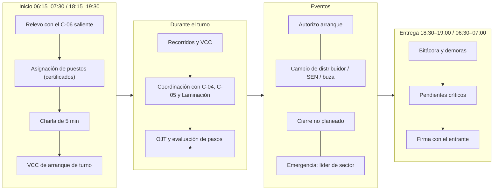
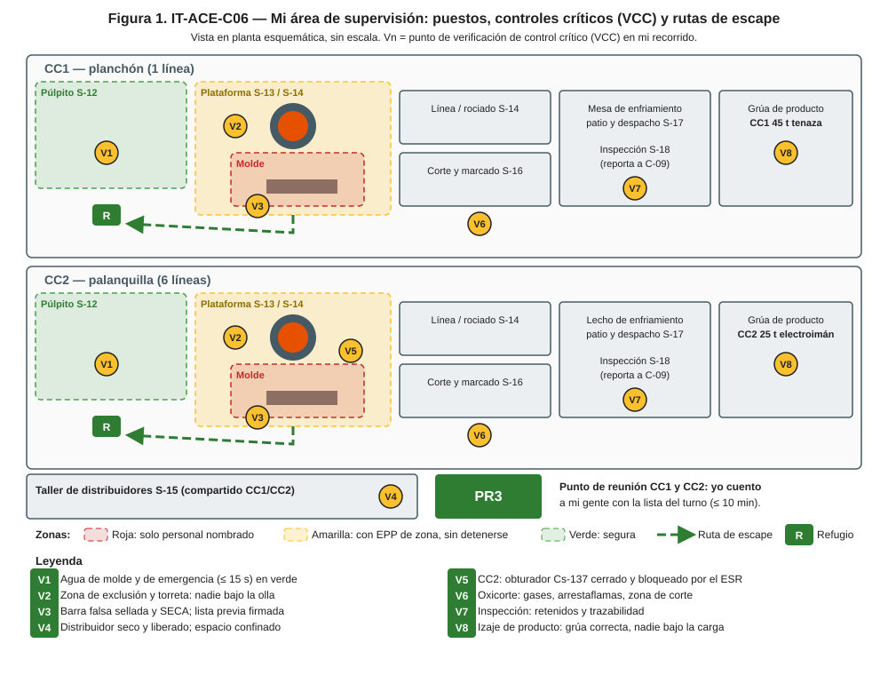
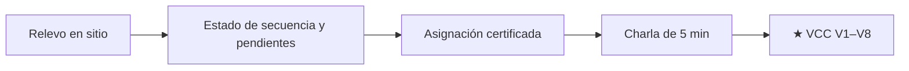
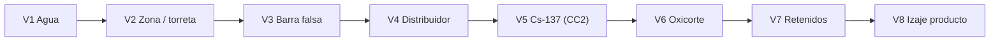
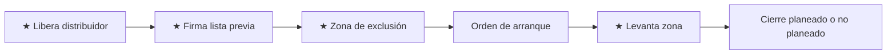
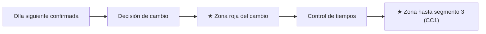
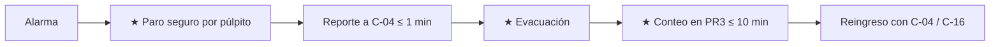
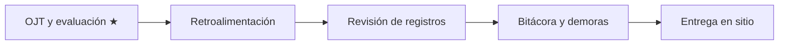

# IT-ACE-C06 — Instrucción de Trabajo: Supervisor de Colada Continua (CC1 o CC2)

## 1. Encabezado de control
| Campo | Valor |
|---|---|
| Código | IT-ACE-C06 |
| Versión | 0.1 |
| Estado | Borrador para validación |
| Rol | C-06 Supervisor de Colada Continua (confianza, banda A4). Modalidad **CC1** o **CC2** |
| Área | Plataforma, púlpito, molde y línea, distribuidores, corte, mesa/lecho, patio y despacho de su máquina |
| Turno | 4x4 de 12 h; relevo 07:00 / 19:00 |
| Reporta a | C-03 Superintendente de Colada Continua (línea); C-04 Jefe de Turno (mando operativo en el turno) |
| Manuales de referencia | Dueño de MO-CC1-01/02/03/05/06/07/08 y MO-CC2-01/02/03/05/06/07/08; hace cumplir MO-CCx-04, MO-CCx-09, MO-OLL-02 y MS-ACE-01 a -10; FT-ACE-001 v0.3 §4–§6 |
| Elaboró | experto-operativo-metalurgia (con criterio de diseño instruccional de C&D) |
| Revisión técnica | experto-operativo-metalurgia — visto bueno, 2026-09-25 |
| Revisión de seguridad | Pendiente — experto-seguridad-salud |
| Revisión laboral | Pendiente — experto-relaciones-laborales |
| Aprobó | Pendiente — Director de C&D |

> Esta IT **no reemplaza** a los manuales. Tus tareas son **rutinas de supervisión**: verificar controles críticos (VCC), autorizar, coordinar y responder. La operación paso a paso está en las IT de S-12 a S-18.

## 2. Mi puesto en 30 segundos
Diriges en el turno la colada segura de tu máquina: arranques sin fallas, secuencias sin cortes, cero breakouts y producto sano y trazable. Tú autorizas lo crítico: la máquina lista, el distribuidor liberado, el arranque, la zona de exclusión y el cierre no planeado. Asignas puestos solo a personal certificado. Eres el líder del sector CC en una emergencia y cuentas a tu gente en PR3.

> **★ Mis 3 reglas de oro**
> 1. ★ No autorizo el arranque sin: agua de molde normal, agua de emergencia (≤ 15 s), barra falsa sellada y seca, distribuidor precalentado y zona despejada.
> 2. ★ Nadie hace una tarea crítica sin certificación TD-P07 vigente.
> 3. ★ Si un control crítico falla, **detengo**. La producción espera; la gente no.

## 3. Mi turno de 12 horas

## 4. Mi área de trabajo

## 5. Mi EPP
| Pictograma | EPP | Cuándo lo uso |
|---|---|---|
| [CASCO] | Casco con barbiquejo + careta de visor dorado | Siempre en la plataforma |
| [ALUMINIZADO] | Chaquetón, guantes y polainas aluminizados | Zona roja: arranque, eventos, cambios en caliente |
| [FR] | Ropa FR o 100% algodón | Todo el turno |
| [BOTAS] | Botas metatarsales | Todo el turno |
| [CO/O₂] | Detector personal CO/O₂ | Torreta y fosas |
| [OÍDO] | Protección auditiva | Toda la nave |
| [DOSÍMETRO] | Dosímetro (si es POE, CC2) | Recorridos junto a los moldes de CC2 |
| [RADIO] | Radio con canal 1 de emergencia | Todo el turno |

## 6. Mis tareas (rutinas de supervisión)

### Tarea 1 — Arranque de turno

| Paso | Qué hago | Cómo verifico (medición) | ★ |
|---|---|---|---|
| 1 | Recibe el turno en la plataforma y el púlpito | Secuencia, coladas, vida de distribuidor y SEN/buzas, alarmas activas | |
| 2 | Revisa permisos y LOTO abiertos | Sin permisos abiertos en la máquina que no conozca | |
| 3 | Asigna puestos | Cada persona con certificación TD-P07 vigente del puesto; suplencias solo con certificado | ★ |
| 4 | Da la charla de 5 min | Riesgo del día, WBGT y rotación por calor (1–2 h), eventos planeados | |
| 5 | Confirma radios y canal 1 | Prueba de radio al inicio del turno | |
| 6 | Revisa aclimatación de personal nuevo o que regresa | Día 1: 20%; +20% por día (MS-ACE-08) | |

> **🛑 ALTO:** falta un certificado para un puesto crítico = el puesto se cubre con el relevo, **nunca** con no certificados.

### Tarea 2 — Verificación de controles críticos (VCC) en el recorrido

| Punto | Qué verifico | Criterio (medición) | ★ |
|---|---|---|---|
| V1 | Agua de molde y de emergencia | CC1: caudal ≥ 95%, ΔT 6–9 °C (alarma > 11 °C) · CC2: ≥ 1,800 L/min, ΔT 6–10 °C (alarma > 12 °C); emergencia ≤ 15 s, prueba ≤ 7 días | ★ |
| V2 | Zona de exclusión y torreta | Colada estable: solo S-13 y S-14 a ≤ 3 m del molde; nadie bajo la olla | ★ |
| V3 | Barra falsa (antes del arranque) | Sellada, sin holguras, chatarra seca (CC1 15–25 kg · CC2 1.5–3 kg/línea) | ★ |
| V4 | Distribuidor | Sin vapor; cara 1,100 ± 50 °C; CC1 SEN ≥ 1,000 °C · CC2 buzas ≥ 900 °C; permiso de espacio confinado si hay ingreso | ★ |
| V5 | CC2: fuente de Cs-137 | Obturador cerrado y bloqueado por el ESR antes de intervenir en el molde; lectura < 2 × fondo | ★ |
| V6 | Oxicorte | Prueba de fugas y arrestaflamas del turno; zona de corte delimitada | ★ |
| V7 | Inspección | Retenidos separados; nada retenido en la lista de despacho | 🔎 |
| V8 | Izaje de producto | CC1 grúa 45 t con tenaza · CC2 electroimán ≤ 600 °C; nadie bajo la carga; pilas ≤ 2.5 m | ★ |

> **🛑 ALTO — detén y corrige si…**
> - Un VCC falla: detén la tarea, corrige y registra.
> - Alguien está en zona roja sin ser personal nombrado.

### Tarea 3 — Autorizaciones críticas (MO-CCx-01, -02, -03, -07)

| Paso | Qué autorizo | Cómo verifico (medición) | ★ |
|---|---|---|---|
| 1 | Distribuidor "listo para colar" | Hoja de S-15 completa; tarjeta de secado; CC2 Ø de buza = orden | ★ |
| 2 | Lista previa al arranque | CC1: 21 puntos · CC2: 6 líneas en "listo para colar" | ★ |
| 3 | Zona de exclusión del arranque | Nadie a ≤ 10 m salvo S-12, S-13, S-14 y yo; sirena ≥ 30 s; nadie bajo la máquina | ★ |
| 4 | Orden de arranque | CC1: distribuidor ≥ 500 mm, T líquidus + 25 a + 35 °C · CC2: ≥ 400 mm, SH 25–40 °C | |
| 5 | Levanto la zona | CC1: 10 min después de velocidad nominal sin alarmas · CC2: 6 líneas estables | ★ |
| 6 | Reconfirmo la zona antes de sacar la cola | Nadie bajo el molde ni en segmentos 1–3 (CC1) | ★ |
| 7 | Decido el cierre no planeado | Inmediato: breakout, fuga de agua en el molde, rebose, agua de molde sin emergencia, oscilación > 60 s. Controlado: olla no llega o no abre, clogging sin cambio, SH < 10 °C | ★ |

> **🛑 ALTO — no autorizo si…**
> - Falta agua de emergencia o su prueba está vencida.
> - Hay humedad en molde, cabeza, chatarra o distribuidor.
> - CC2: el nivel no marca "molde vacío" con el obturador abierto.

### Tarea 4 — Coordinar cambios en secuencia (MO-CCx-05, -06)

| Paso | Qué hago | Cómo verifico (medición) | ★ |
|---|---|---|---|
| 1 | Confirmo la olla siguiente con C-04 / C-05 | Llega ≥ 10 min antes; T según hoja del LF | |
| 2 | Decido el cambio de SEN (CC1) o autorizo el de buza (CC2) | CC1: sin recuperación en 15 min o ΔT entre anchas > 2 °C · CC2: velocidad < 2.3 o > 3.5 m/min | |
| 3 | Establezco la zona roja del cambio | Solo S-13 y S-14 al frente; nadie bajo el molde | ★ |
| 4 | Controlo tiempos | CC1 cambio de distribuidor ≤ 3 min (> 5 min: cierre) · Cambio de olla ≤ 3 min | |
| 5 | Mantengo la zona hasta que la unión pase el segmento 3 (CC1) | ≈ 5 m | ★ |

> **🛑 ALTO:** distribuidor nuevo con vapor o SEN fría = no se usa.

### Tarea 5 — Respuesta a emergencias como líder de sector CC (MS-ACE-09)

| Escenario | Qué hago | Criterio (medición) | ★ |
|---|---|---|---|
| Breakout | Confirmo tapón/línea cerrados, extracción detenida, agua de molde y secundaria **encendidas**; evacúo bajo la máquina y ≥ 20 m | Nadie entra a la cámara de rociado sin LOTO; CC2: ESR inspecciona el contenedor | ★ |
| Falla de agua de molde / apagón | Confirmo entrada del agua de emergencia | ≤ 15 s; si no entra: cierre de olla y distribuidor, evacúo ≥ 10 m | ★ |
| Fuga de agua en el molde | Cierre inmediato; evacúo la plataforma | No se reanuda | ★ |
| Perforación de olla | Evacúo ≥ 25 m; olla sobre pote seco | Nunca agua | ★ |
| Conteo | Cuento a mi gente con la lista del turno en PR3 | ≤ 10 min; faltante = búsqueda dirigida por la brigada | ★ |

> **🛑 ALTO:** nadie reingresa sin autorización de C-04 (Comandante del Incidente). No se reintroduce agua a un molde sobrecalentado sin C-06/C-08.

### Tarea 6 — Gente, OJT y entrega de turno

| Paso | Qué hago | Cómo verifico (medición) | ★ |
|---|---|---|---|
| 1 | Acompaño OJT y evalúo pasos ★ como evaluador TD-P07 | Evaluación formativa; **no se usa como sanción** (salvo acto inseguro deliberado, vía Reglamento Interior y CCT) | |
| 2 | Doy retroalimentación el mismo turno | Registro en LMS | |
| 3 | Reviso registros del turno | Hoja de colada, alarmas BOP (CC1), rastreo, retenidos | |
| 4 | Llenado de bitácora y demoras | Causa, minutos, acción | |
| 5 | Entrego el turno en sitio | Pendientes críticos, permisos abiertos, equipo fuera de servicio | |

## 7. Mis controles críticos (★)
- ☐ V1 agua de molde y emergencia · ☐ V2 zona y torreta · ☐ V3 barra falsa seca y sellada · ☐ V4 distribuidor seco y liberado.
- ☐ V5 obturador de Cs-137 (CC2) · ☐ V6 oxicorte · ☐ V7 retenidos · ☐ V8 izaje de producto.
- ☐ 100% del personal en tareas críticas con certificación vigente.
- ☐ Simulacro del trimestre (breakout / agua de molde) programado con C-04.

## 8. Si algo sale mal
| Síntoma | Qué hago | A quién aviso |
|---|---|---|
| Breakout o fuga de agua en el molde | Tarea 5; activo MS-ACE-09 | C-04 por canal 1 "EMERGENCIA ×3" [Supuesto]; C-16 |
| ≥ 2 alarmas BOP en una colada (CC1) | Reviso polvo, nivel y velocidad | C-08 ext. 4700 [Supuesto] |
| Clogging repetido / taponamientos en varias líneas | Muestra Ca/Al o química; ajuste del LF | C-08; C-07 vía C-05 |
| Defecto repetido reportado por S-18 | Acción en línea con S-12; marca de piezas | C-08; C-09 ext. 4302 [Supuesto] |
| Olla siguiente retrasada | Bajo velocidad o cierro líneas; decido cierre | C-04; C-05 |
| Falla de equipo crítico | Paro seguro y permiso de mantenimiento | Mantenimiento de turno ext. 4401 [Supuesto] |

## 9. Registros que lleno
| Registro | Cuándo | Dónde |
|---|---|---|
| Firma de liberación de distribuidor y lista previa al arranque | Cada arranque | Papel + MES |
| Registro de zona de exclusión (colocación y levantamiento) | Arranque, cambios y cola | Bitácora de colada |
| VCC realizadas vs. programadas (meta ≥ 95% [Supuesto]) | Cada recorrido | LMS / sistema SSO |
| Bitácora de colada, demoras y defectos | Todo el turno | MES |
| Evaluaciones TD-P07 de pasos ★ | Cada evaluación | LMS |
| Reporte de incidente | Cada evento MS-ACE-09 | Sistema SSO |

## 10. Mi certificación
| Concepto | Detalle |
|---|---|
| Nivel ILUO requerido | **O** (nivel 4): evaluador de pasos ★ de su máquina |
| Teoría | Ruta de colada continua 80 h (simulador, defectos, prevención de breakouts) + Escuela de Supervisores L-1 "Líder de Turno" 96 h + evaluador TD-P07 16 h; ERC 40 h |
| OJT | 120 h; 10 arranques dirigidos (CC1) o 5 arranques y 10 turnos acompañados (CC2) |
| Pasos ★ que me evalúan | MO-CC1-03 pasos 2, 19; MO-CC1-07 paso 9 y decisión de cierre no planeado; MO-CC2-03 pasos 1, 2 y decisión de cierre; dirección de simulacros (MO-CC2-04); todas las respuestas ★ de MO-CC1-04 §9 |
| Vigencia | **12 meses:** alturas, espacios confinados, grúas/izaje, fuentes radiactivas (CC2). **24 meses:** ERC, evaluador TD-P07 y demás |

## 11. Glosario rápido
| Término | Qué es |
|---|---|
| VCC | Verificación en campo de un control crítico |
| Zona de exclusión | Área roja donde solo entra personal nombrado |
| Lista previa al arranque | Verificación firmada de máquina lista (21 puntos en CC1) |
| Cierre no planeado | Fin de secuencia por condición anormal |
| Comandante del Incidente | C-04, dirige la emergencia |
| PR3 | Punto de reunión de CC1 y CC2 |
| ESR | Encargado de Seguridad Radiológica (C-16) |
| TD-P07 | Proceso de certificación de competencias |
| ILUO | Niveles de dominio: I aprende, L con ayuda, U solo, O enseña y evalúa |

## 12. Control de cambios
| Versión | Fecha | Cambio | Elaboró |
|---|---|---|---|
| 0.1 | 2026-09-25 | Emisión inicial desde DP-ACE-C (C-06), MO-CC1/CC2, MS-ACE-01/-09 y FT-ACE-001 v0.3. Figura nueva `it-C06-puesto.svg` | experto-operativo-metalurgia |
