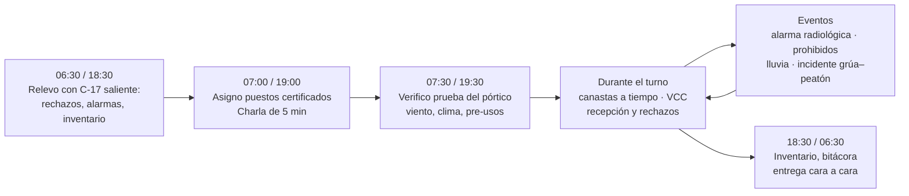
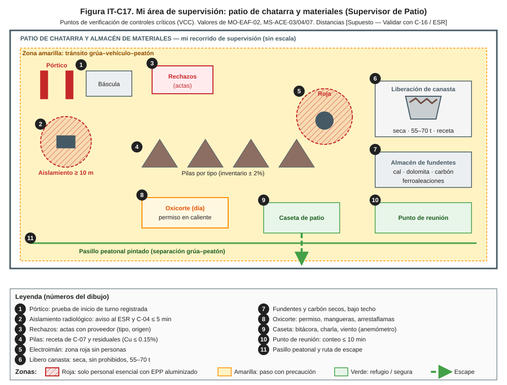
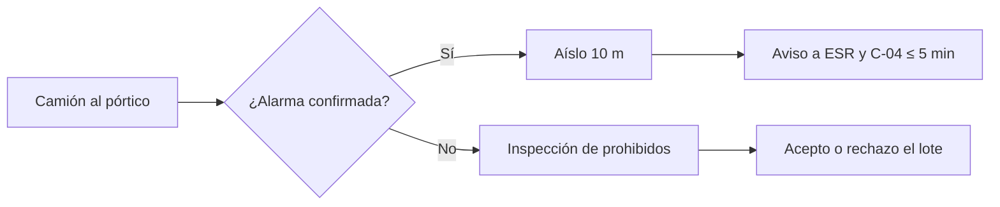
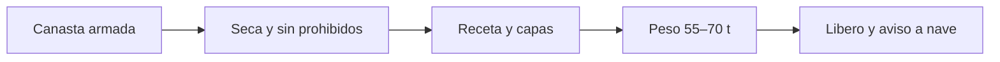
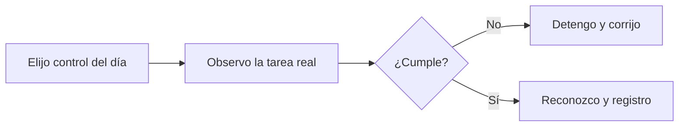
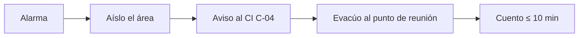
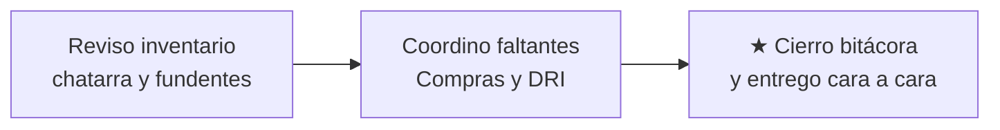

# IT-ACE-C17 — Instrucción de Trabajo: Supervisor de Patio de Chatarra y Materiales

## 1. Encabezado de control

| Campo | Valor |
|---|---|
| Código | IT-ACE-C17 |
| Versión | 0.1 |
| Estado | Borrador para validación |
| Rol | C-17 Supervisor de Patio de Chatarra y Materiales · confianza, banda A4 |
| Área | Hornos — patio de chatarra (recepción, pórtico, clasificación, canastas), almacén de fundentes, carbón de inyección y ferroaleaciones |
| Turno | 4x4 de 12 h (relevo 07:00 / 19:00); 1 por cuadrilla |
| Reporta a | C-02 Superintendente de Hornos (línea sólida); C-04 Jefe de Turno (mando operativo en turno) |
| Manuales de referencia | Supervisa (R): MO-EAF-02, MS-ACE-01, 02, 03, 04, 06, 07, 08, 09, 10. Informado: MO-EAF-03. FT-ACE-001 v0.3 |
| Elaboró | experto-operativo-metalurgia (con enfoque de diseño de capacitación) |
| Revisión técnica | experto-operativo-metalurgia — visto bueno, 2026-09-25 |
| Revisión de seguridad | Pendiente — experto-seguridad-salud |
| Revisión laboral | Pendiente — experto-relaciones-laborales |
| Aprobó | Pendiente — Director |

> Esta IT **no reemplaza** a los manuales: resume tus rutinas de supervisión. Si hay duda, manda el manual. Los valores salen de FT-ACE-001 v0.3 y conservan sus marcas [Validar con OEM / Ingeniería de Proceso] y [Supuesto].

## 2. Mi puesto en 30 segundos
Entrego a los hornos canastas **seguras**: sin humedad, sin recipientes cerrados y sin fuentes radiactivas. Llegan con la mezcla y la densidad programadas, a tiempo para el tap-to-tap de 55 min. Superviso a 16 S-05 por turno, además de transportistas y contratistas de preparación. Controlo la interacción grúa–vehículo–peatón, el pórtico de radiación, el oxicorte y el inventario de chatarra y fundentes.

> **★ Mis 3 reglas de oro**
> 1. ★ **Ninguna carga pasa a canasta sin liberación del pórtico.** Ante alarma: aíslo y aviso al ESR (C-16) y a C-04.
> 2. ★ **Rechazo** chatarra con agua, hielo, recipientes cerrados o explosivos; yo libero la canasta que goteó.
> 3. ★ **Grúa y peatón separados:** nadie bajo el electroimán; pasillos respetados.

## 3. Mi turno de 12 horas

## 4. Mi área de trabajo

Figura de apoyo: [zonas de exclusión de la nave y del patio](../img/ms-zonas-exclusion-nave.svg).

## 5. Mi EPP

| EPP (pictograma en texto) | Cuándo lo uso |
|---|---|
| [Casco con barbiquejo] | Todo el recorrido |
| [Lentes de seguridad] | Todo el turno |
| [Chaleco reflejante] | A pie en el patio [Supuesto] |
| [Ropa FR o 100 % algodón] | Todo el turno |
| [Botas metatarsales] | Todo el turno |
| [Protección auditiva] | Cerca de electroimán, oxicorte y descarga |
| [Detector personal CO/O₂] | Almacén de carbón y zonas cerradas |
| [Arnés] | Acceso a cabinas de grúas de patio (MS-ACE-10) |

Verifico también el EPP de mi gente y la hidratación en la intemperie.

## 6. Mis tareas (rutinas de supervisión)

### Tarea 1 — Arranque de turno

| Paso | Qué hago | Cómo verifico (medición) | ★ |
|---|---|---|---|
| 1 | Recibo el turno cara a cara y leo la bitácora. | Rechazos abiertos, alarmas, canastas listas, inventario | |
| 2 | Asigno puestos solo a personal con certificación vigente. | Pórtico, grúas y oxicorte: certificación de 12 meses vigente | ★ |
| 3 | Doy la charla de 5 min. | Riesgos del día: clima, tránsito, contratistas | |
| 4 | Verifico que el S-05 probó el pórtico con la fuente de verificación. | Registro de la prueba; si no responde, 🛑 no se recibe chatarra | ★ |
| 5 | Reviso viento y lluvia. | Viento < 40 km/h [Supuesto]; ≥ 50 km/h suspendo maniobras [Validar con OEM] | ★ |
| 6 | Reviso los check-list pre-uso de grúas y manipuladores. | 100% firmados sin hallazgos críticos | ★ |
| 7 | Confirmo con C-05 el plan de coladas y la receta de C-07. | Canastas necesarias por hora | |

> **🛑 ALTO — detén y avisa si…**
> - El pórtico no responde: no se recibe chatarra; aviso al ESR.
> - Viento ≥ 50 km/h: suspendo maniobras con grúa en patio.
> - Falta personal certificado para pórtico o grúa.

### Tarea 2 — Recepción, pórtico y rechazos (MO-EAF-02 / MS-ACE-07 / MS-ACE-03)

| Paso | Qué hago | Cómo verifico (medición) | ★ |
|---|---|---|---|
| 1 | Verifico en campo que cada camión pasa por el pórtico. | ≤ 8 km/h [Validar con OEM]; "libre" antes de descargar | ★ |
| 2 | Ante alarma confirmada, aseguro el aislamiento. | Camión en la zona de aislamiento; perímetro ≥ 10 m; chofer fuera | ★ |
| 3 | Llamo al ESR (C-16) y a C-04 por radio. | "Alarma radiológica en pórtico, camión placas…" en ≤ 5 min | ★ |
| 4 | Resguardo el área hasta que el ESR localiza la fuente. | Nadie toca la pieza; camión no sale sin autorización del ESR | ★ |
| 5 | Reviso en campo la inspección de prohibidos. | Sin cerrados, líquidos, explosivos, baterías, hielo ni lodo | ★ |
| 6 | Rechazo el lote que no cumple y levanto el acta. | Tipo, origen, proveedor, fotos; aviso a Compras | |

> **🛑 ALTO — detén y avisa si…**
> - Alguien intenta manipular la pieza sospechosa o mover el camión.
> - Aparece un posible explosivo o munición: alejo a todos y aviso a C-04.

### Tarea 3 — Liberación de canastas (MO-EAF-02)

| Paso | Qué hago | Cómo verifico (medición) | ★ |
|---|---|---|---|
| 1 | Reviso la canasta por muestreo en cada turno. | Seca, sin goteo; concha cerrada; nada sobre el borde | ★ |
| 2 | Confirmo la receta de C-07 y las capas. | Ligera al fondo 10–15%; pesada al centro ≤ 20% | 🔎 |
| 3 | Confirmo el peso. | 55–70 t (objetivo 65 t); densidad 0.6–0.8 t/m³ [Supuesto] | 🔎 |
| 4 | Vigilo los residuales de la mezcla calculada. | Cu ≤ 0.15% [Supuesto]; > 0.20% ajusto la receta con C-07 | 🔎 |
| 5 | Libero la canasta que goteó solo después de escurrirla y secarla bajo techo. | Sin agua en el fondo | ★ |
| 6 | Si la densidad es < 0.55 t/m³, aviso a C-05: se requiere 2.ª canasta. | Canastas por colada ≤ 2 | |
| 7 | Sigo la entrega a tiempo al horno. | Canastas a tiempo ≥ 98% [Supuesto] | |

> **🛑 ALTO — detén y avisa si…**
> - La canasta gotea o tiene nieve, hielo o lodo.
> - Pesa > 70 t o tiene material sobre el borde.
> - Hubo una explosión o proyección en el horno atribuible a la carga: detengo el armado y reviso con C-05 y C-16.

### Tarea 4 — Verificación de controles críticos en campo (VCC)

| Paso | Qué verifico | Cómo verifico (medición) | ★ |
|---|---|---|---|
| 1 | Interacción grúa–vehículo–peatón. | Nadie en el radio del electroimán; pasillos pintados libres; bocina | ★ |
| 2 | Operación del pórtico. | Prueba registrada; segunda pasada ante alarma | ★ |
| 3 | Oxicorte de chatarra pesada. | Permiso en caliente, mangueras, arrestaflamas y vigía de fuego (NOM-027) | ★ |
| 4 | Humedad en pilas, canastas, fundentes y carbón. | Material seco y bajo techo | ★ |
| 5 | Acceso a cabinas de grúa. | Arnés y tres puntos de apoyo (MS-ACE-10) | |
| 6 | Calor e hidratación en la intemperie. | 250 mL cada 15–20 min; aclimatación del personal nuevo | |
| 7 | Registro la VCC y retroalimento en el momento. | VCC realizadas ≥ 95% de las programadas [Supuesto] | |

La VCC **no es sanción**: sirve para formar y corregir. Solo un acto inseguro deliberado en tarea crítica sigue la vía del Reglamento Interior y el CCT.

> **🛑 ALTO — detén y avisa si…**
> - Un control crítico falta o falla: detén la tarea en ese momento.
> - Un contratista trabaja sin permiso o sin inducción.

### Tarea 5 — Respuesta a emergencias del patio (MS-ACE-09 / MS-ACE-07)

| Paso | Qué hago | Cómo verifico (medición) | ★ |
|---|---|---|---|
| 1 | Doy o confirmo la alarma con el formato único. | "EMERGENCIA ×3 — lugar — tipo — personas — quién llama" | ★ |
| 2 | Evento radiológico: aplico la Tarea 2 y apoyo al ESR. | Perímetro ajustado por el ESR a 1 μSv/h [Supuesto] | ★ |
| 3 | Detengo grúas, camiones y oxicorte del sector. | Equipos detenidos en posición segura | ★ |
| 4 | Llevo a mi gente al punto de reunión y cuento. | Conteo completo ≤ 10 min, incluidos choferes y contratistas | ★ |
| 5 | Reporto faltantes al CI y no reingreso sin su autorización. | Reingreso autorizado por C-04 | |

### Tarea 6 — Inventario y entrega de turno

| Paso | Qué hago | Cómo verifico (medición) | ★ |
|---|---|---|---|
| 1 | Reviso el inventario de chatarra por tipo, fundentes y ferroaleaciones. | Exactitud ± 2% [Supuesto] | 🔎 |
| 2 | Coordino con Compras y con la planta DRI los faltantes. | Pedido o aviso registrado | |
| 3 | Cierro la bitácora y entrego cara a cara. | Rechazos abiertos, alarmas, canastas listas, equipos fuera de servicio | ★ |

## 7. Mis controles críticos (★)

En cada recorrido marco:
- ☐ Pórtico probado y en servicio; cada camión con "libre".
- ☐ Sin prohibidos ni humedad en pilas y canastas.
- ☐ Nadie en el radio del electroimán; pasillos peatonales libres.
- ☐ Pre-uso de grúas y manipuladores firmado.
- ☐ Viento < 50 km/h para maniobras en patio [Validar con OEM].
- ☐ Oxicorte con permiso en caliente y vigía.
- ☐ Personal en pórtico, grúa y oxicorte con certificación vigente.

## 8. Si algo sale mal

| Síntoma | Qué hago | A quién aviso |
|---|---|---|
| Alarma confirmada del pórtico | Aíslo 10 m; camión retenido; nadie toca | ESR (C-16) ext. 2400 [Supuesto]; C-04 · canal 1 [Supuesto] |
| Explosión o proyección en el horno por la carga | Detengo el armado; reviso canastas pendientes | C-05, C-04, C-16 · canal 1 |
| Posible explosivo o munición | Alejo a todos; no se mueve | C-04 · canal 1 |
| Persona golpeada o atrapada por grúa o vehículo | Detengo equipos; primeros auxilios | Servicio médico ext. 2222 [Supuesto]; C-04 · canal 1 |
| Lluvia fuerte | Priorizo chatarra seca; ninguna canasta mojada | C-05 · canal 4 Patio [Supuesto] |
| Canastas atrasadas | Reorganizo puestos; aviso del retraso | C-05 · canal 2 Hornos [Supuesto] |
| Incendio por oxicorte | Brigada; aíslo gas y O₂ | C-04 · canal 1 |

## 9. Registros que lleno

| Registro | Cuándo | Dónde |
|---|---|---|
| Bitácora de turno | Todo el turno | Bitácora del patio |
| Asignación de puestos y certificaciones | Inicio de turno | Bitácora / LMS |
| Prueba del pórtico y actas de alarma con el ESR | Diario y cada alarma | Registro del pórtico |
| Rechazos de chatarra (tipo, origen, proveedor) | Cada rechazo | Registro de inspección |
| Liberación de canastas que gotearon | Cada caso | Bitácora del patio |
| VCC y hallazgos | Cada VCC | Sistema de SSO |
| Inventario de chatarra, fundentes y ferroaleaciones | Fin de turno | Sistema de inventario |
| Evaluaciones TD-P07 de S-05 | Al evaluar | LMS |

## 10. Mi certificación

| Concepto | Requisito |
|---|---|
| Nivel ILUO requerido | **O (nivel 4, evaluador)** en MO-EAF-02 (armado de canasta y pórtico) |
| Teoría | ERC de izaje, vehículo–peatón, radiación y trabajos en caliente 32 h · Ruta Chatarra y materias primas 40 h · Escuela de Supervisores L-1 96 h |
| Grúas | Grúas y electroimán en simulador, para supervisar: 16 h |
| Evaluador | Evaluador TD-P07: 16 h |
| Pasos ★ que me evalúan | Respuesta a alarma del pórtico (MO-EAF-02 / MS-ACE-07) · liberación de canasta · VCC grúa–peatón |
| Vigencia | **12 meses** fuentes radiactivas (MS-ACE-07), grúas/izaje (MS-ACE-04) y alturas (MS-ACE-10); **24 meses** ERC, evaluador TD-P07 y demás |

## 11. Glosario rápido

| Término | Qué significa |
|---|---|
| ESR | Encargado de Seguridad Radiológica (función de C-16, licencia CNSNS) |
| VCC | Verificación de controles críticos en campo |
| CI | Comandante del Incidente (C-04) |
| Receta de carga | Mezcla de chatarra por colada que define C-07 |
| Densidad aparente | Toneladas por m³ de la canasta: 0.6–0.8 t/m³ [Supuesto] |
| Residuales | Cu, Sn, Ni, Cr que llegan al acero con la chatarra |
| Rendimiento metálico | Toneladas de acero líquido por tonelada de carga |
| ILUO | Niveles de competencia: I aprende, L con apoyo, U autónomo, O enseña y evalúa |
| Trabajo en caliente | Oxicorte o soldadura que requiere permiso (NOM-027) |

## 12. Control de cambios

| Versión | Fecha | Cambio | Autor |
|---|---|---|---|
| 0.1 | 2026-09-25 | Primera versión: rutinas de supervisión de C-17 (arranque, pórtico y rechazos, liberación de canastas, VCC, emergencias, inventario); figura IT-C17 | experto-operativo-metalurgia |
