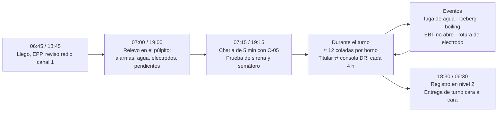
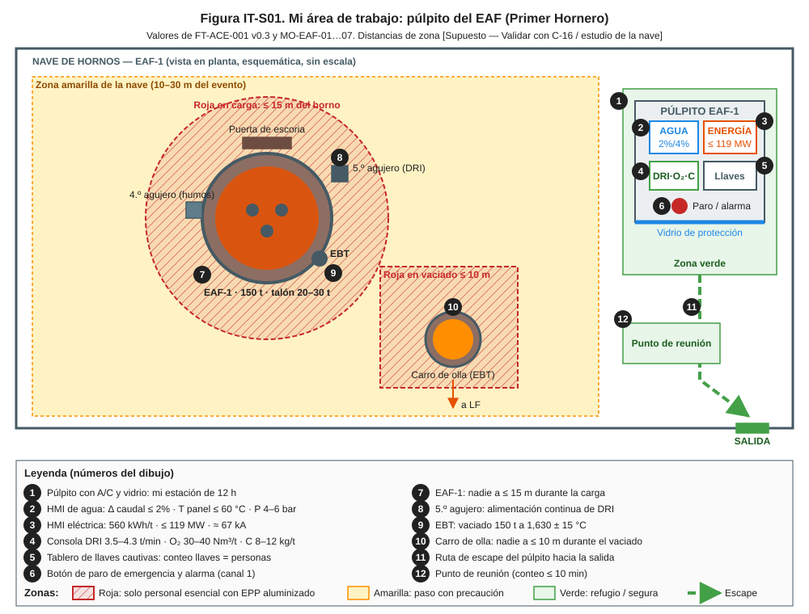
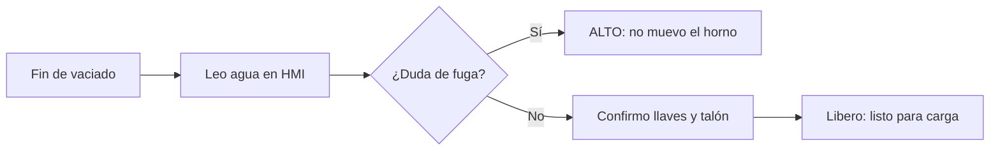
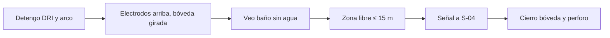
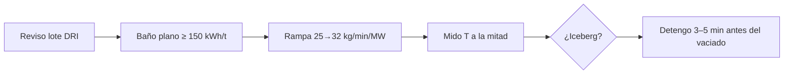
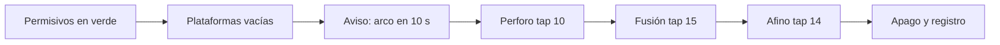
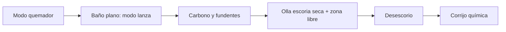
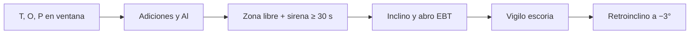

# IT-ACE-S01 — Instrucción de Trabajo: Primer Hornero (Operador de Púlpito de Horno)

## 1. Encabezado de control

| Campo | Valor |
|---|---|
| Código | IT-ACE-S01 |
| Versión | 0.1 |
| Estado | Borrador para validación |
| Rol | S-01 Operador de Púlpito de Horno (Primer Hornero) · sindicalizado N-8 |
| Área | Hornos — púlpito del EAF-1 o EAF-2 |
| Turno | 4x4 de 12 h (relevo 07:00 / 19:00); alterna cada 4 h entre titular y consola de DRI y adiciones · jornada según el CCT [CCT: pedir texto] |
| Reporta a | C-05 Supervisor de Hornos; en turno, C-04 Jefe de Turno de Acería |
| Manuales de referencia | MO-EAF-01, 02, 03, 04, 05, 07 (R); MO-EAF-06 y 08 (C); MS-ACE-01, 02, 03, 06, 08, 09; FT-ACE-001 v0.3 |
| Elaboró | experto-operativo-metalurgia (con enfoque de diseño de capacitación) |
| Revisión técnica | experto-operativo-metalurgia — visto bueno, 2026-09-25 |
| Revisión de seguridad | experto-seguridad-salud — visto bueno, 2026-09-26 |
| Revisión laboral | experto-relaciones-laborales — visto bueno (con observaciones), 2026-09-26 |
| Aprobó | Pendiente — Director |

> Esta IT **no reemplaza** a los manuales: los resume para tu puesto. Si hay duda, manda el manual. Los valores salen de FT-ACE-001 v0.3 y conservan sus marcas [Validar con OEM / Ingeniería de Proceso] y [Supuesto].

## 2. Mi puesto en 30 segundos
Conduzco la fusión del horno de colada a colada: 150 t en un tap-to-tap de 55 min. Manejo la energía, el DRI, el oxígeno, el carbono y el vaciado desde el púlpito. Vigilo el agua de paneles y bóveda: una fuga que llega al metal líquido puede causar una explosión. Doy la secuencia técnica y las señales de proceso a S-02, S-03, S-04, S-09 y S-10; no tengo funciones de mando (LFT art. 9).

> **★ Mis 3 reglas de oro**
> 1. ★ **Agua primero:** Δ caudal > 2% = sin arco, no inclino, no cargo. > 4% dispara: **nunca rearmo sin localizar la fuga**.
> 2. ★ **Nadie en la roja:** no energizo, no cargo y no vacío si hay una persona en la zona de exclusión.
> 3. ★ **Horno seguro para cargar:** interruptor abierto, electrodos arriba, bóveda girada y sin agua a la vista.

## 3. Mi turno de 12 horas

> **Mi jornada (nota laboral).** Mi turno está pactado en el CCT [CCT: pedir texto]. El relevo y la entrega–recepción antes de las 07:00 / 19:00 son tiempo de trabajo (LFT art. 58). Se cuentan en la jornada o se pagan según el CCT. La jornada de 12 h y la reforma de 40 h están en revisión (arts. 59–61 y 66–68) — verificar con Jurídico Laboral.

## 4. Mi área de trabajo

Figuras de apoyo: [corte del EAF](../img/eaf-corte-horno.svg) · [perfil de potencia](../img/eaf-perfil-potencia.svg).

## 5. Mi EPP

| EPP (pictograma en texto) | Cuándo lo uso |
|---|---|
| [Casco con barbiquejo] | Siempre en la nave; al salir del púlpito |
| [Lentes + filtro sombra 3–5] | Para ver el arco o el baño |
| [Ropa FR o 100 % algodón] | Todo el turno; nunca sintética |
| [Botas metatarsales] | Todo el turno |
| [Protección auditiva] | Al salir al piso (> 100 dB(A) en fusión); doble si ≥ 105 dB(A) |
| [Detector personal CO/O₂] | Al salir al piso del horno |
| [Careta dorada + capucha y chaquetón aluminizados, polainas, guantes] | Si entro a zona roja (solo con autorización de C-05) |

## 6. Mis tareas paso a paso

### Tarea 1 — Preparación del horno entre coladas (MO-EAF-01)

| Paso | Qué hago | Cómo verifico (medición) | ★ |
|---|---|---|---|
| 1 | Confirmo el fin del vaciado. | EBT cerrado, horno a −3°, carro fuera de la fosa | |
| 2 | Leo el agua en la HMI y la registro. | Δ caudal ≤ 2% · T de panel ≤ 60 °C · presión 4–6 bar | ★ |
| 3 | Si hay duda, no inclino ni giro la bóveda. Aviso a C-05. | Sin vapor, manchas húmedas ni llama anormal (S-02) | ★ |
| 4 | Estimo el talón en nivel 2. | 20–30 t (objetivo 25 t) | 🔎 |
| 5 | Antes de que suban al EBT, confirmo en la HMI el interruptor abierto y los movimientos inhibidos. | Un intento de mando es rechazado; una llave por persona | ★ |
| 6 | Reviso electrodos, quemadores y humos. | Longitud suficiente; presión del horno −5 a −15 Pa | 🔎 |
| 7 | Verifico que todos bajaron. | Conteo de llaves en el tablero = conteo de personas | ★ |
| 8 | Registro la lista y aviso por radio: "EAF-x listo para carga". | Lista completa en nivel 2; tiempo 4–6 min | |

> **🛑 ALTO — detén y avisa si…**
> - Δ caudal > 2%, vapor o escoria húmeda: arco bloqueado, **no inclines**, evacúa a ≥ 25 m.
> - Presión de agua < 3 bar o presión del horno positiva.
> - Coraza inferior > 300 °C [Supuesto] en la termografía.
> - Falta una llave en el tablero.

### Tarea 2 — Carga de chatarra con canasta (MO-EAF-02)

| Paso | Qué hago | Cómo verifico (medición) | ★ |
|---|---|---|---|
| 1 | Detengo el DRI, apago el arco y abro el interruptor. | HMI: interruptor abierto | ★ |
| 2 | Subo electrodos al tope; levanto y giro la bóveda. | HMI: electrodos arriba, bóveda girada | ★ |
| 3 | Observo el horno abierto. | Sin chorros de agua ni vapor; talón cubierto de escoria | ★ |
| 4 | Toco la bocina y confirmo por radio y CCTV la zona libre. | Nadie a ≤ 15 m del horno ni a ± 5 m de la ruta | ★ |
| 5 | Doy la señal de descarga a S-04. | Canasta centrada, 0.5–1.0 m sobre la coraza [Validar con OEM] | |
| 6 | Cierro la bóveda y verifico el asiento. | Enclavamiento OK; sin chatarra en el borde | |
| 7 | Perforo con tap bajo (paso a Tarea 4). | Arco estable; carga en 2–4 min (alarma > 5 min) | |
| 8 | 2.ª canasta: repito los pasos 1–7. | 1.ª canasta fundida ≥ 70% [Validar con Ingeniería de Proceso] | ★ |

> **🛑 ALTO — detén y avisa si…**
> - Ves agua, vapor o una canasta que gotea.
> - Hay una persona en la zona de exclusión.
> - La bóveda no cierra: no energices; nunca se retira chatarra a mano.

### Tarea 3 — Alimentación continua de DRI/HBI (MO-EAF-03)

| Paso | Qué hago | Cómo verifico (medición) | ★ |
|---|---|---|---|
| 1 | Reviso la calidad del lote en nivel 2. | Metalización ≥ 93% [Supuesto]; finos ≤ 3%; sin reporte de humedad | ★ |
| 2 | Arranco solo con el baño plano. | Energía ≥ 150 kWh/t; canasta ≥ 70% fundida | |
| 3 | Subo la tasa en rampa. | 25 → 32 kg/min/MW en 2–3 min; tasa 3.5–4.3 t/min (objetivo 3.8) | |
| 4 | Arranco cal y dolomita con el DRI. | Relación cal/DRI según C-07 | 🔎 |
| 5 | Pido a S-02 la temperatura a la mitad (min 24–26 de arco). | 1,570–1,610 °C | 🔎 |
| 6 | Ajusto la consigna. | < 1,560 °C: baja 10–20%; > 1,630 °C: sube 5–10%, máx. 35 kg/min/MW | |
| 7 | Vigilo señales de iceberg y lo corrijo: detengo DRI, O₂ a la zona, potencia plena. | Caída de T, arco inestable en una fase, montón bajo el 5.º agujero; reanudo con T ≥ 1,580 °C | ★ |
| 8 | Detengo el DRI 3–5 min antes del vaciado y registro. | Total ≈ 100 t ± 5 t | 🔎 |

> **🛑 ALTO — detén y avisa si…**
> - Hay reporte o evidencia de humedad en el DRI: no se alimenta.
> - La T cae > 20 °C en 5 min o baja de 1,560 °C.
> - Hay ebullición violenta (boiling): todos fuera del frente de la puerta.
> - Más de 4.3 t/min solo con DRI caliente validado por C-07.

### Tarea 4 — Fusión: perfil de potencia y regulación de electrodos (MO-EAF-04)

| Paso | Qué hago | Cómo verifico (medición) | ★ |
|---|---|---|---|
| 1 | Reviso los permisivos. | Bóveda, 0°, agua, hidráulica, presión y llaves cautivas: todo en verde | ★ |
| 2 | Confirmo plataformas vacías; aviso por radio "arco en 10 s"; cierro el interruptor. | CCTV y radio; todas las llaves en el tablero | ★ |
| 3 | Perforo con tap 10 en regulación automática. | Penetración en ≈ 2 min; cortocircuitos ≤ 2/min | |
| 4 | Paso a fusión con tap 15 y arco cubierto. | ≈ 66 kA; ≈ 117 MW; límite ≈ 119 MW y 67 kA | |
| 5 | Ante un colapso: subo electrodos, bajo tap y reviso. | Corriente estable; sin rotura | ★ |
| 6 | Uso tap 15 solo si la espuma cubre el arco. | T de panel ≤ 60 °C; desbalance ≤ 10% | ★ |
| 7 | En afino uso tap 14 y pido T y O (MO-EAF-06). | T y O en ventana del grado | 🔎 |
| 8 | Apago el arco, subo electrodos y registro. | 560 kWh/t (520–600); arco 42–44 min (alarma > 47) | 🔎 |

> **🛑 ALTO — detén y avisa si…**
> - Dispara por fuga (> 4%): **no rearmes**, no inclines, evacúa a ≥ 25 m.
> - Un electrodo baja solo: abre el interruptor; LOTO completo.
> - Alarma del transformador (temperatura, Buchholz): S-20 y C-12.
> - Desbalance > 10% por > 30 s: fase a manual solo con C-05.

### Tarea 5 — Escoria espumosa: O₂, carbono y desescoriado (MO-EAF-05)

| Paso | Qué hago | Cómo verifico (medición) | ★ |
|---|---|---|---|
| 1 | Reviso agua de bloques, presiones de O₂, gas y aire, y silos. | Sin alarmas | |
| 2 | Fundo la canasta en modo quemador. | O₂:gas ≈ 2:1; 1,500–2,500 Nm³/h por quemador | |
| 3 | Con baño plano paso a modo lanza e inyecto carbono. | 40–60 kg/min; espuma visible en puerta o cámara | |
| 4 | Dosifico fundentes. | B2 1.8–2.2 · MgO 8–10% · cal 30–45 kg/t · dolomita 10–15 kg/t | 🔎 |
| 5 | Espero "olla seca" y "zona libre" de S-02 / S-10. | Confirmación por radio | ★ |
| 6 | Inclino hacia la puerta con flujo continuo. | −3 a −8° [Validar con OEM]; sin arrastre de metal | |
| 7 | Corrijo con el análisis de escoria. | FeO 25–35%: si > 38% más C y menos O₂; B2 < 1.8 más cal | 🔎 |
| 8 | Vigilo la ebullición. | Sin subida súbita de espuma, llama larga ni CO alto | ★ |

> **🛑 ALTO — detén y avisa si…**
> - Boiling: corta C, reduce O₂, detén DRI; no inclines más.
> - Olla de escoria húmeda o fosa con agua: no desescories.
> - P > 0.015% antes de vaciar: C-05 decide.

### Tarea 6 — Vaciado por EBT y adiciones en olla (MO-EAF-07)

| Paso | Qué hago | Cómo verifico (medición) | ★ |
|---|---|---|---|
| 1 | Decido el vaciado con los resultados de M3. | T 1,630 ± 15 °C · O 500–900 ppm · C 0.04–0.08% · P ≤ 0.015% | 🔎 |
| 2 | Calculo el Al con el O activo (CC1) o confirmo "sin Al" (CC2). | CC1 ≈ 2.2 kg/t con O = 700 ppm; CC2 Al soluble ≤ 0.005% | ★ |
| 3 | Espero "zona libre" de S-02; activo sirena y semáforo. | Nadie a ≤ 10 m de la olla y del EBT; aviso ≥ 30 s | ★ |
| 4 | Apago el arco; detengo DRI, O₂ y C; subo electrodos. | Interruptor abierto en HMI | |
| 5 | Inclino a 3–5° y abro el EBT; subo la inclinación poco a poco. | Chorro compacto; máx. 12–15° [Validar con OEM] | |
| 6 | Vigilo la cámara, el detector de escoria y el peso. | Tiempo 3–5 min; sin escoria | 🔎 |
| 7 | A 150 t o al primer indicio de escoria: retroinclino de inmediato a −3°. | Talón 20–30 t; escoria dentro del horno | ★ |
| 8 | Registro peso, tiempo, apertura libre y adiciones. | Peso 145–152 t; cierre inmediato si > 153 t | |

> **🛑 ALTO — detén y avisa si…**
> - El EBT no abre: regresa a 0°/−3°; nadie se asoma; C-05 autoriza el lanceo.
> - Hay perforación de olla: retroinclina, evacúa a ≥ 25 m, **nunca agua**.
> - Ebullición en la olla: detén adiciones y vaciado; refugio en ≤ 30 s.

## 7. Mis controles críticos (★)

Antes de cada tarea crítica marco:
- ☐ Agua en HMI: Δ caudal ≤ 2%, T de panel ≤ 60 °C, presión 4–6 bar.
- ☐ Sin vapor, manchas húmedas ni llama anormal en el horno.
- ☐ Tablero de llaves completo; conteo de llaves = conteo de personas.
- ☐ Zona de exclusión libre (≤ 15 m en carga; ≤ 10 m en vaciado), confirmada por radio y CCTV.
- ☐ Sirena y semáforo probados al inicio del turno (si fallan, 🛑 no hay vaciado).
- ☐ DRI, olla de escoria, fosa y adiciones secos.
- ☐ Presión del horno −5 a −15 Pa; sin alarma de CO en el púlpito.

## 8. Si algo sale mal

| Síntoma | Qué hago | A quién aviso |
|---|---|---|
| Δ caudal > 2%, vapor o escoria húmeda | Bloqueo el arco, no inclino, cierro el agua del circuito, evacúo a ≥ 25 m | C-05, C-04 · canal 1 [Supuesto]; mantenimiento ext. 2300 [Supuesto] |
| Disparo por fuga > 4% | No rearmo; activo el plan de fuga (MS-ACE-09 escenario A) | C-04 (Comandante del Incidente) · canal 1 |
| Iceberg o T < 1,560 °C | Detengo DRI, potencia plena, O₂ a la zona | C-07 · canal 2 Hornos [Supuesto] |
| Boiling (escoria sale en masa) | Corto C, reduzco O₂, detengo DRI; despejo la puerta | C-05, C-04 · canal 1 |
| Rotura de electrodo | Abro el interruptor; columna corta → MO-EAF-08 | C-05 · canal 2 |
| EBT no abre | Horno a 0°/−3°; espero autorización de lanceo | C-05 · canal 2 |
| Perforación de olla o derrame | Retroinclino, evacúo, nunca agua sobre el metal | C-04 · canal 1; servicio médico ext. 2222 [Supuesto] |
| Presión del horno positiva o alarma de CO | Reduzco O₂; no cargo hasta restablecer | C-05, C-16 · canal 2 |

Mensaje de emergencia por radio: **"EMERGENCIA, EMERGENCIA, EMERGENCIA — lugar — tipo — personas — quién llama"**.

## 9. Registros que lleno

| Registro | Cuándo | Dónde |
|---|---|---|
| Lista de preparación entre coladas (Δ caudal, T de panel, presión, talón) | Cada colada | Nivel 2 |
| Reporte de colada (kWh/t, O₂ Nm³/t, carbón, cal, electrodo, tiempos) | Cada colada | Nivel 2 / MES |
| DRI total, tasa promedio, kg/min/MW, T medidas | Cada colada | Nivel 2 |
| Vaciado (peso, tiempo, apertura libre, adiciones, argón) | Cada colada | Nivel 2 |
| Confirmación de enclavamiento (llave cautiva) | Cada acceso a plataforma | Bitácora del horno |
| Demoras y eventos (fugas, iceberg, EBT, roturas) | Al ocurrir | Bitácora del horno |
| Entrega de turno | 07:00 / 19:00 | Bitácora del horno |

## 10. Mi certificación

| Concepto | Requisito |
|---|---|
| Nivel ILUO requerido | **U (nivel 3)**: opero solo y con criterio en MO-EAF-01, 02, 03, 04, 05 y 07 |
| Teoría | Ruta técnica 80 h (metalurgia del EAF, energía, escoria, agua, humos) + simulador de EAF 40 h |
| OJT | 360 h con S-01 certificado y C-05; ≥ 60 coladas como titular |
| Pasos ★ que me evalúan | EAF-01 pasos 2, 4, 17 · EAF-02 pasos 8, 9, 10, 17 · EAF-03 pasos 1, 8, 9 · EAF-04 pasos 1, 3, 6, 8 · EAF-05 pasos 10, 11 · EAF-07 pasos 3, 11 · escenarios de fuga y de arco inestable |
| Vigencia | **24 meses** TD-P07 del puesto; **12 meses** alturas (NOM-009) y grúas/izaje o señalero (NOM-006) |
| Refresco | 16 h/año: simulacro de fuga de agua y lecciones aprendidas |

> **Mi evaluación no es una sanción** (nota laboral — verificar con Jurídico Laboral)
> - La evaluación TD-P07 sirve para formarme, certificarme y acreditar mi aptitud. No se usa para sancionarme (DP-ACE-S §4).
> - Si aún no demuestro un paso ★, conservo mi categoría, mi salario y mi antigüedad. Recibo retroalimentación, OJT de refuerzo y otra oportunidad [Supuesto: 2 en ≤ 60 días, a validar con la CMCAP].
> - Si ya sé hacer el trabajo, puedo pedir el **examen de suficiencia** (LFT art. 153-U). Si lo apruebo, recibo mi DC-3 sin cursar toda la ruta.
> - La certificación prueba mi aptitud para ascender. Entre los aptos, asciende el de mayor antigüedad (LFT arts. 154–159 y CCT).
> - Si mi certificación se suspende tras un incidente grave, es una medida de seguridad, no una sanción. Paso a tarea no crítica sin perder salario ni antigüedad y me reevalúan en ≤ 15 días [Supuesto].
> - Mi capacitación y mis recertificaciones son en jornada y sin costo para mí. Si caen en mi descanso, se pagan según el CCT [CCT: pedir texto].

## 11. Glosario rápido

| Término | Qué significa |
|---|---|
| EBT | Vaciado excéntrico por el fondo: agujero por donde sale el acero a la olla |
| Talón (hot heel) | Acero líquido que se deja en el horno: 20–30 t |
| Tap / OLTC | Posición del cambiador de derivaciones del transformador (voltaje) |
| Baño plano | Chatarra fundida; el arco ya no está cubierto por la carga |
| Escoria espumosa | Escoria inflada con CO que cubre el arco y protege los paneles |
| Iceberg | Montón de DRI sin fundir bajo el 5.º agujero |
| Boiling | Ebullición violenta de escoria por FeO + carbono |
| B2 | Basicidad CaO/SiO₂ de la escoria (1.8–2.2) |
| Δ caudal | Diferencia de agua entrada–salida: indica fuga |
| Llave cautiva | Llave que bloquea el arco y los movimientos mientras alguien está en la plataforma |
| M1 / M3 | Mediciones de T y O: a la mitad (min 24–26 de arco) y antes del vaciado |

## 12. Control de cambios

| Versión | Fecha | Cambio | Autor |
|---|---|---|---|
| 0.1 | 2026-09-25 | Primera versión: resumen por rol de MO-EAF-01 a 07 y MS-ACE; figura IT-S01 | experto-operativo-metalurgia |
