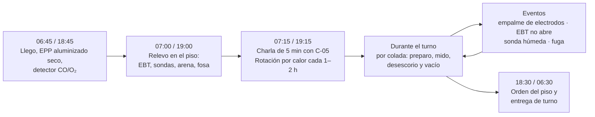
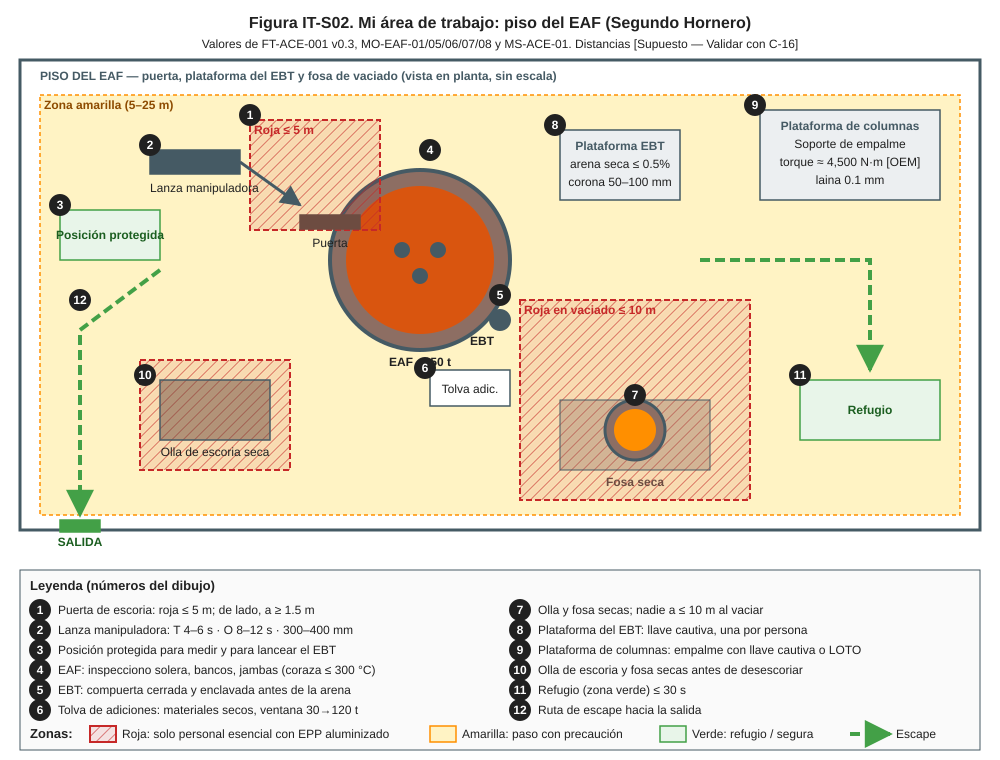
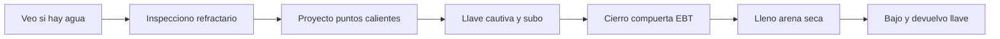
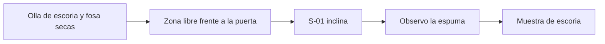
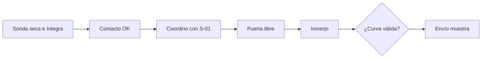
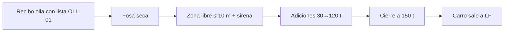
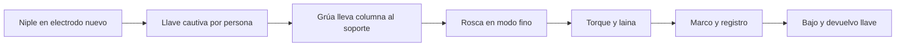

# IT-ACE-S02 — Instrucción de Trabajo: Segundo Hornero (Operador de Horno de Piso)

## 1. Encabezado de control

| Campo | Valor |
|---|---|
| Código | IT-ACE-S02 |
| Versión | 0.1 |
| Estado | Borrador para validación |
| Rol | S-02 Operador de Horno de Piso (Segundo Hornero) · sindicalizado N-6 |
| Área | Hornos — piso del EAF-1 o EAF-2 (puerta, plataforma del EBT, fosa de vaciado) |
| Turno | 4x4 de 12 h (relevo 07:00 / 19:00) · jornada según el CCT [CCT: pedir texto] |
| Reporta a | C-05 Supervisor de Hornos (en turno, C-04). Recibe la secuencia técnica del S-01 de su horno, sin relación de mando (LFT art. 9) |
| Manuales de referencia | MO-EAF-01, 05, 06, 07, 08 (R); MM-EAF-01 y 03 (C); MS-ACE-01, 02, 03, 06, 08, 09, 10; FT-ACE-001 v0.3 |
| Elaboró | experto-operativo-metalurgia (con enfoque de diseño de capacitación) |
| Revisión técnica | experto-operativo-metalurgia — visto bueno, 2026-09-25 |
| Revisión de seguridad | experto-seguridad-salud — visto bueno, 2026-09-26 |
| Revisión laboral | experto-relaciones-laborales — visto bueno (con observaciones), 2026-09-26 |
| Aprobó | Pendiente — Director |

> Esta IT **no reemplaza** a los manuales: los resume para tu puesto. Si hay duda, manda el manual. Los valores salen de FT-ACE-001 v0.3 y conservan sus marcas [Validar con OEM / Ingeniería de Proceso] y [Supuesto].

## 2. Mi puesto en 30 segundos
Soy los ojos del horno en el piso. Dejo el horno listo entre coladas, mido temperatura y oxígeno y tomo muestras. Controlo el desescoriado y ejecuto el vaciado por el EBT. Empalmo electrodos con S-03 y S-04. Trabajo junto al metal líquido: mi EPP, mis herramientas secas y la zona libre me protegen a mí y a mi cuadrilla. Doy guía técnica en campo a S-03; no tengo funciones de mando (LFT art. 9).

> **★ Mis 3 reglas de oro**
> 1. ★ **Nada húmedo toca el metal:** sondas, lanzas, arena, adiciones, ollas y fosas secas.
> 2. ★ **Zona libre antes de abrir:** nadie a ≤ 10 m de la olla y del EBT; sirena ≥ 30 s.
> 3. ★ **Una llave por persona:** subo a la plataforma solo con mi propia llave cautiva (o LOTO completo).

## 3. Mi turno de 12 horas

> **Mi jornada (nota laboral).** Mi turno está pactado en el CCT [CCT: pedir texto]. El relevo y la entrega–recepción antes de las 07:00 / 19:00 son tiempo de trabajo (LFT art. 58). Se cuentan en la jornada o se pagan según el CCT. La jornada de 12 h y la reforma de 40 h están en revisión (arts. 59–61 y 66–68) — verificar con Jurídico Laboral.

## 4. Mi área de trabajo

Figuras de apoyo: [secuencia de vaciado EBT](../img/eaf-vaciado-ebt.svg) · [empalme de electrodo](../img/eaf-empalme-electrodo.svg).

## 5. Mi EPP

| EPP (pictograma en texto) | Cuándo lo uso |
|---|---|
| [Casco con barbiquejo + careta dorada] | Todo el turno en el piso; careta abajo con metal a la vista |
| [Capucha + chaquetón aluminizados] | Medición, muestreo, desescoriado y vaciado (zona roja) |
| [Guantes y polainas aluminizados] | Zona roja |
| [Ropa FR o 100 % algodón] | Todo el turno; si se moja, la cambio |
| [Botas metatarsales de liberación rápida] | Todo el turno |
| [Protección auditiva doble] | Piso del horno (≥ 105 dB(A)) |
| [Detector personal CO/O₂] | Todo el turno, a ≤ 30 cm de nariz y boca |
| [Arnés 100 % conectado] | Plataforma de columnas en el método B de empalme |

Máximo **2 min** continuos en zona roja por intervención; hidrátate 250 mL cada 15–20 min.

## 6. Mis tareas paso a paso

### Tarea 1 — Preparación del horno entre coladas (MO-EAF-01)

| Paso | Qué hago | Cómo verifico (medición) | ★ |
|---|---|---|---|
| 1 | Desde posición protegida, observo por la cámara y la puerta. | Sin vapor, manchas húmedas ni llama anormal | ★ |
| 2 | Inspecciono solera, bancos, línea de escoria, jambas y zona del EBT. | Sin cavidades; coraza inferior ≤ 300 °C [Supuesto] | 🔎 |
| 3 | Proyecto MgO sobre puntos desgastados, desde la puerta. | 150–300 kg [Supuesto]; nunca sobre el baño ni formando charcos | ★ |
| 4 | Tomo mi propia llave cautiva y espero la confirmación de S-01. | Interruptor abierto; movimientos inhibidos en HMI | ★ |
| 5 | Limpio el agujero del EBT; si hay costra, lanceo con O₂ desde arriba. | Agujero libre; registro coladas del tubo | |
| 6 | Cierro la compuerta inferior del EBT. | Indicador "cerrado y enclavado" | ★ |
| 7 | Lleno el EBT con arena seca de la tolva cerrada. | Corona de 50–100 mm; arena ≤ 0.5% de humedad, sin grumos | ★ |
| 8 | Bajo de la plataforma y devuelvo mi llave. | Conteo de llaves = conteo de personas | ★ |

> **🛑 ALTO — detén y avisa si…**
> - Ves agua, vapor o escoria húmeda: avisa al S-01; nadie carga.
> - La compuerta del EBT no cierra o no enclava: no llenes ni cargues.
> - La arena está húmeda o apelmazada: cambia el lote.

### Tarea 2 — Desescoriado y control de escoria espumosa (MO-EAF-05)

| Paso | Qué hago | Cómo verifico (medición) | ★ |
|---|---|---|---|
| 1 | Reviso la olla de escoria que colocó S-10 y la fosa. | Olla seca; fosa sin agua. Confirmo "olla seca" por radio | ★ |
| 2 | Despejo el frente y la parte baja de la puerta; toco la bocina. | Nadie en la zona; "zona libre" por radio | ★ |
| 3 | Observo la salida de escoria mientras S-01 inclina. | Flujo continuo, en "pan" esponjoso; sin gotas de metal | |
| 4 | Opero la lanza o el manipulador de puerta según la etapa. | Espuma cubre el arco; arco silencioso | |
| 5 | Tomo muestra de escoria desde posición protegida en el afino. | Muestra enviada al laboratorio | 🔎 |
| 6 | Vigilo señales de ebullición y aviso al S-01. | Sin subida súbita de espuma ni llama larga | ★ |

> **🛑 ALTO — detén y avisa si…**
> - La olla de escoria está húmeda o la fosa tiene agua.
> - La espuma sube de golpe con llama larga (boiling): todos fuera del frente de la puerta.
> - Hay alguien frente o bajo la puerta.

### Tarea 3 — Medición de temperatura, O activo y muestreo (MO-EAF-06)

| Paso | Qué hago | Cómo verifico (medición) | ★ |
|---|---|---|---|
| 1 | Tomo la sonda del almacén seco y la reviso. | Cartón sin humedad, roturas ni golpes | ★ |
| 2 | La monto en el portasondas hasta el tope. | "Contacto OK" en la HMI | |
| 3 | Pido al S-01 bajar potencia o apagar el arco; DRI detenido. | Confirmación por radio | |
| 4 | Despejo la puerta y la trayectoria de la lanza. | Nadie en la zona; yo de lado, a ≥ 1.5 m | ★ |
| 5 | Ejecuto el ciclo automático. | 300–400 mm bajo la escoria [Validar con OEM]; T 4–6 s; O 8–12 s | |
| 6 | Valido la curva; si no es válida, repito con otra sonda (máx. 2). | Meseta ≤ 2 °C por ≥ 1.5 s [Supuesto] | 🔎 |
| 7 | Retiro la paleta, la dejo enfriar en posición protegida y la envío por tubo neumático. | Muestra identificada; resultado en ≤ 4 min [Supuesto] | 🔎 |
| 8 | Medición manual solo si falla el robot. | Autorización de C-05, arco apagado, un intento, un compañero observando | ★ |

**Ventana de vaciado (la decide S-01):** T 1,630 ± 15 °C · O activo 500–900 ppm · C 0.04–0.08% · P ≤ 0.015%. M1 se toma en el min 24–26 de arco (1,570–1,610 °C).

> **🛑 ALTO — detén y avisa si…**
> - Hay proyección al inmergir: retira la lanza, aléjate y aparta el lote de sondas.
> - La sonda está húmeda, rota o golpeada.
> - Te piden medición manual sin autorización de C-05.

### Tarea 4 — Vaciado por EBT y adiciones en olla (MO-EAF-07)

| Paso | Qué hago | Cómo verifico (medición) | ★ |
|---|---|---|---|
| 1 | Recibo la olla con la lista de MO-OLL-01. | Cara caliente ≥ 1,000 °C; válvula cerrada; arena; tapón probado; lista firmada | ★ |
| 2 | Inspecciono la fosa de vaciado. | Seca, sin agua ni metal suelto | ★ |
| 3 | Coloco barreras, cuento personas y reviso CCTV. | Nadie a ≤ 10 m de la olla y del EBT | ★ |
| 4 | Doy "zona libre" por radio; S-01 activa sirena y semáforo. | Aviso ≥ 30 s antes de abrir | ★ |
| 5 | Agrego las adiciones desde la posición protegida. | Inicio a ≈ 30 t y termino antes de 120 t; argón 200–400 NL/min | 🔎 |
| 6 | Vigilo el chorro y el llenado; aviso al S-01 al primer indicio de escoria. | Chorro compacto; tiempo 3–5 min | 🔎 |
| 7 | Con el EBT cerrado y el carro fuera, levanto la exclusión. | Semáforo verde; carro hacia LF | |

> **🛑 ALTO — detén y avisa si…**
> - La lista de la olla está incompleta o la olla está fría.
> - La fosa tiene agua o hay una persona en la zona roja.
> - El EBT no abre: nadie se asoma; lanceo con O₂ solo con autorización de C-05, desde la posición protegida, máx. 2 intentos.
> - Hay perforación de olla o ebullición: refugio en ≤ 30 s.

### Tarea 5 — Adición y empalme de electrodos, método A (MO-EAF-08)

| Paso | Qué hago | Cómo verifico (medición) | ★ |
|---|---|---|---|
| 1 | Rosco el niple a mano en la caja superior del electrodo nuevo. | Niple asentado hasta el tope | |
| 2 | Con arco apagado e interruptor abierto, tomo mi llave cautiva. | Confirmación de S-01 en HMI; una llave por persona | ★ |
| 3 | Guío a S-04 para llevar la columna al soporte. | Columna en soporte; mordaza del soporte cerrada; nadie bajo la carga | ★ |
| 4 | Verifico que S-03 roscó el tapón de izaje al 100%. | Todas las roscas enganchadas | ★ |
| 5 | Guío la bajada y rosco sin forzar. | Grúa en modo fino ≤ 50 mm/s [Validar con OEM]; sin golpe | |
| 6 | Aprieto con la llave de torque calibrada. | ≈ 4,500 N·m ± 10% [Validar con OEM / Ingeniería de Proceso] | ★ |
| 7 | Paso la laina alrededor de la junta. | Laina de 0.1 mm no entra en ningún punto | ★ |
| 8 | Marco el deslizamiento y registro serie, torque y hora. | Junta ≥ 300 mm bajo la mordaza [Validar con OEM] | 🔎 |
| 9 | Bajo de la plataforma y devuelvo mi llave. | Conteo de llaves = conteo de personas | ★ |

**Método B** (electrodo bajado sobre la columna en el horno): **LOTO completo**, permiso de altura y arnés 100 % conectado.

> **🛑 ALTO — detén y avisa si…**
> - El tapón de izaje no rosca completo: no se iza.
> - La laina entra después de re-apretar: cambia niple o electrodo.
> - La llave de torque falla: nunca aprietes "a estimación".

## 7. Mis controles críticos (★)

Antes de cada tarea crítica marco:
- ☐ Sondas, lanzas, arena y adiciones secas; EPP aluminizado seco.
- ☐ Olla de escoria, fosa de vaciado y olla de acero secas.
- ☐ Zona libre (≤ 5 m en la puerta; ≤ 10 m en el vaciado) confirmada por radio y CCTV.
- ☐ Sirena y semáforo activos ≥ 30 s antes de abrir el EBT.
- ☐ Mi propia llave cautiva (o mi candado de LOTO) en mi poder antes de subir.
- ☐ Compuerta del EBT cerrada y enclavada antes de la arena.
- ☐ Ruta a refugio libre (≤ 30 s).

## 8. Si algo sale mal

| Síntoma | Qué hago | A quién aviso |
|---|---|---|
| Vapor, agua o escoria húmeda en el horno | Me retiro de la puerta; aviso de inmediato; evacúo a ≥ 25 m | S-01 y C-05 · canal 2 Hornos [Supuesto] |
| Proyección al inmergir la sonda | Retiro la lanza, me alejo, aparto el lote | C-05, C-16 · canal 2 |
| EBT no abre | Nadie se asoma; espero autorización | C-05 · canal 2 |
| Escoria en el chorro antes de 150 t | Aviso para cierre inmediato | S-01; S-06 del LF · canal 2 |
| Perforación de olla o derrame | Evacúo a ≥ 25 m; nunca agua; mensaje de emergencia | C-04 · canal 1 [Supuesto] |
| Junta al rojo o chispas en la junta | Pido abrir el interruptor; reviso en frío | C-05 · canal 2 |
| Compañero con síntomas de golpe de calor | Lo retiro del calor; lo acompaño | C-05; servicio médico ext. 2222 [Supuesto] |

Mensaje de emergencia por radio: **"EMERGENCIA, EMERGENCIA, EMERGENCIA — lugar — tipo — personas — quién llama"**.

## 9. Registros que lleno

| Registro | Cuándo | Dónde |
|---|---|---|
| Lista de preparación: estado del EBT, coladas del tubo, proyección (kg) | Cada colada | Nivel 2 |
| Lecturas M1/M2/M3: T, O, lote de sonda, válida / no válida | Cada medición | Nivel 2 |
| Lista de verificación de la olla recibida (MO-OLL-01) | Cada vaciado | Nivel 2 |
| Registro de empalme: horno, fase, serie, torque, laina | Cada empalme | Nivel 2 / bitácora |
| Uso de llaves cautivas / LOTO | Cada acceso | Bitácora del horno |
| Eventos: EBT que no abre, lanceo autorizado, proyecciones | Al ocurrir | Bitácora del horno |

## 10. Mi certificación

| Concepto | Requisito |
|---|---|
| Nivel ILUO requerido | **U (nivel 3)** en MO-EAF-01, 05, 06, 07 y 08 |
| Teoría | Ruta técnica 48 h (refractario, medición y muestreo, EBT, electrodos) |
| OJT | 240 h; ≥ 80 coladas con S-02 certificado |
| Pasos ★ que me evalúan | EAF-01 pasos 3, 8, 11, 13, 14, 17 · EAF-05 pasos 6, 7, 9, 11 · EAF-06 pasos 1, 4, 11 + 5 curvas · EAF-07 pasos 1, 4, 5 + lanceo simulado · EAF-08 pasos 3, 6, 8, 9, 12, 13, 14 |
| Vigencia | **24 meses** TD-P07; **12 meses** alturas (MS-ACE-10, NOM-009) y grúas/izaje o señalero (NOM-006) |
| Refresco | 12 h/año: simulacro de fuga de agua y de perforación |

> **Mi evaluación no es una sanción** (nota laboral — verificar con Jurídico Laboral)
> - La evaluación TD-P07 sirve para formarme, certificarme y acreditar mi aptitud. No se usa para sancionarme (DP-ACE-S §4).
> - Si aún no demuestro un paso ★, conservo mi categoría, mi salario y mi antigüedad. Recibo retroalimentación, OJT de refuerzo y otra oportunidad [Supuesto: 2 en ≤ 60 días, a validar con la CMCAP].
> - Si ya sé hacer el trabajo, puedo pedir el **examen de suficiencia** (LFT art. 153-U). Si lo apruebo, recibo mi DC-3 sin cursar toda la ruta.
> - La certificación prueba mi aptitud para ascender. Entre los aptos, asciende el de mayor antigüedad (LFT arts. 154–159 y CCT).
> - Si mi certificación se suspende tras un incidente grave, es una medida de seguridad, no una sanción. Paso a tarea no crítica sin perder salario ni antigüedad y me reevalúan en ≤ 15 días [Supuesto].
> - Mi capacitación y mis recertificaciones son en jornada y sin costo para mí. Si caen en mi descanso, se pagan según el CCT [CCT: pedir texto].

## 11. Glosario rápido

| Término | Qué significa |
|---|---|
| EBT | Agujero de vaciado por el fondo del horno |
| Corona de arena | Montículo de arena seca de 50–100 mm sobre el EBT |
| Apertura libre | El EBT abre solo, sin lancear |
| Sonda / cartucho | Pieza desechable que mide T y O activo |
| Meseta | Tramo plano de la curva de T: lectura válida |
| Gunning | Proyección de masa refractaria sobre zonas desgastadas |
| Niple 4TPI | Pieza cónica roscada que une dos electrodos |
| Laina | Hoja de 0.1 mm para revisar holgura en la junta |
| Llave cautiva | Llave que bloquea arco y movimientos mientras estás arriba |
| Zona roja | Zona donde solo entra el personal esencial con EPP aluminizado |

## 12. Control de cambios

| Versión | Fecha | Cambio | Autor |
|---|---|---|---|
| 0.1 | 2026-09-25 | Primera versión: resumen por rol de MO-EAF-01, 05, 06, 07, 08 y MS-ACE; figura IT-S02 | experto-operativo-metalurgia |
