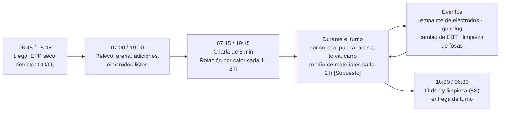
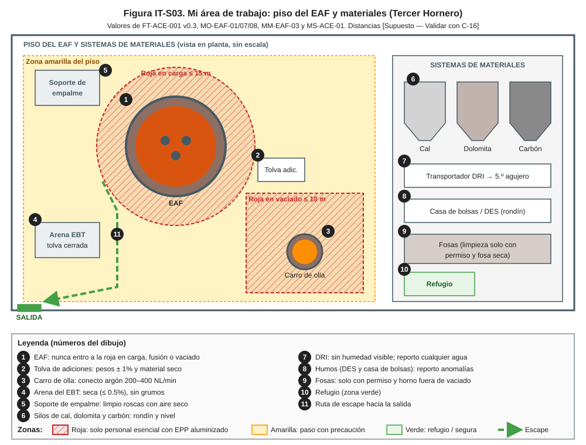
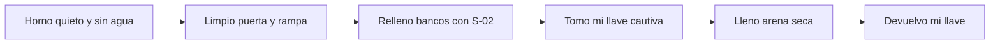
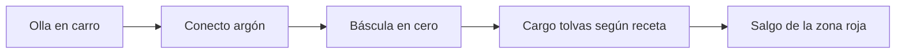
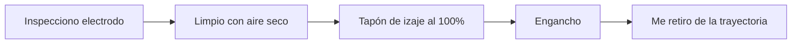
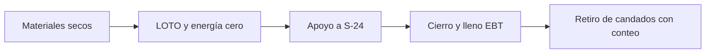

# IT-ACE-S03 — Instrucción de Trabajo: Tercer Hornero (Ayudante de Horno)

## 1. Encabezado de control

| Campo | Valor |
|---|---|
| Código | IT-ACE-S03 |
| Versión | 0.1 |
| Estado | Borrador para validación |
| Rol | S-03 Ayudante de Horno (Tercer Hornero) · sindicalizado N-3 (entrada) |
| Área | Hornos — piso del EAF-1/EAF-2, sistemas de materiales y cuadrilla de día |
| Turno | 4x4 de 12 h (piso y materiales; relevo 07:00 / 19:00) o administrativo (cuadrilla de día) · jornada según el CCT [CCT: pedir texto] |
| Reporta a | C-05 Supervisor de Hornos. Recibe guía técnica de campo del S-02, sin relación de mando (LFT art. 9) |
| Manuales de referencia | MO-EAF-01, 07, 08 y MM-EAF-03 (R); MS-ACE-01, 02, 03, 04, 06, 08, 09, 10; FT-ACE-001 v0.3 |
| Elaboró | experto-operativo-metalurgia (con enfoque de diseño de capacitación) |
| Revisión técnica | experto-operativo-metalurgia — visto bueno, 2026-09-25 |
| Revisión de seguridad | Pendiente — experto-seguridad-salud |
| Revisión laboral | experto-relaciones-laborales — visto bueno (con observaciones), 2026-09-26 |
| Aprobó | Pendiente — Director |

> Esta IT **no reemplaza** a los manuales: los resume para tu puesto. Si hay duda, manda el manual. Los valores salen de FT-ACE-001 v0.3 y conservan sus marcas [Validar con OEM / Ingeniería de Proceso] y [Supuesto].

## 2. Mi puesto en 30 segundos
Apoyo la preparación, el vaciado y el mantenimiento operativo del horno. Preparo la arena del EBT, las adiciones de la olla y los electrodos. Hago el rondín de silos, DRI y casa de bolsas, y mantengo el piso limpio y seguro. Mi trabajo evita la causa n.º 1 de explosiones en la acería: **agua o humedad que toca el metal líquido**. Sigo la guía técnica del S-02 y las instrucciones de C-05. Sin funciones de mando (LFT art. 9): si algo no está bien, **aviso, detengo y escalo** a C-05.

> **★ Mis 3 reglas de oro**
> 1. ★ **Nunca entro a la zona roja** del horno, del carro de olla o de la canasta durante carga, fusión o vaciado.
> 2. ★ **Todo seco:** arena, lanzas, adiciones y herramientas que tocan el metal.
> 3. ★ **Si veo algo, detengo y aviso** al S-02: humedad, fuga, metal en fosas o personas en la zona.

## 3. Mi turno de 12 horas

> **Mi jornada (nota laboral).** Mi turno está pactado en el CCT [CCT: pedir texto]. El relevo y la entrega–recepción antes de las 07:00 / 19:00 son tiempo de trabajo (LFT art. 58). Se cuentan en la jornada o se pagan según el CCT. La jornada de 12 h y la reforma de 40 h están en revisión (arts. 59–61 y 66–68) — verificar con Jurídico Laboral.

## 4. Mi área de trabajo

Figuras de apoyo: [zonas de exclusión de la nave](../img/ms-zonas-exclusion-nave.svg) · [cambio del EBT](../img/mm-ebt-cambio.svg).

## 5. Mi EPP

| EPP (pictograma en texto) | Cuándo lo uso |
|---|---|
| [Casco con barbiquejo + careta dorada] | Todo el turno en el piso |
| [Chaquetón, capucha, guantes y polainas aluminizados] | Cerca de la puerta, del EBT o del carro de olla con metal a la vista |
| [Ropa FR o 100 % algodón] | Todo el turno; si se moja, la cambio |
| [Botas metatarsales] | Todo el turno |
| [Protección auditiva doble] | Piso del horno (≥ 105 dB(A)) |
| [Detector personal CO/O₂] | Piso, fosas, silos y casa de bolsas |
| [Respirador] | Polvo de gunning, cal y casa de bolsas (NOM-010), según análisis de riesgo |
| [Arnés 100 % conectado] | Plataforma de columnas y bóveda (MS-ACE-10) |

Hidrátate 250 mL cada 15–20 min. Si eres nuevo o regresas de > 7 días fuera: aclimatación de 5 días.

## 6. Mis tareas paso a paso

### Tarea 1 — Apoyo en la preparación entre coladas (MO-EAF-01)

| Paso | Qué hago | Cómo verifico (medición) | ★ |
|---|---|---|---|
| 1 | Espero la señal del S-02 de que no hay agua en el horno. | Confirmación por radio | ★ |
| 2 | Limpio costras de la puerta con la máquina de limpieza. | Umbral de puerta libre; nadie en la trayectoria de caída | |
| 3 | Agrego dolomita o MgO a los bancos con el S-02. | 0.5–1 t [Supuesto]; banco con pendiente continua | |
| 4 | Reviso la arena del EBT antes de subirla. | Seca (≤ 0.5% de humedad), sin grumos, tolva cerrada | ★ |
| 5 | Tomo mi propia llave cautiva antes de subir a la plataforma del EBT. | Una llave por persona; S-01 confirmó en HMI | ★ |
| 6 | Lleno el EBT con el S-02. | Corona de 50–100 mm | ★ |
| 7 | Bajo y devuelvo mi llave al tablero. | Conteo de llaves = conteo de personas | ★ |

> **🛑 ALTO — detén y avisa si…**
> - Ves vapor, agua o escoria húmeda en el horno.
> - La arena está húmeda o apelmazada.
> - Alguien sube sin su propia llave.

### Tarea 2 — Tolva de adiciones y carro de olla para el vaciado (MO-EAF-07)

| Paso | Qué hago | Cómo verifico (medición) | ★ |
|---|---|---|---|
| 1 | Posiciono el carro en vaciado y conecto el argón. | Flujo presente; 200–400 NL/min [Supuesto] en el vaciado | |
| 2 | Pongo en cero la báscula con la olla vacía. | Lectura 0 t | |
| 3 | Cargo las tolvas con la tabla del grado y el Al que calculó el S-01. | Pesos correctos ± 1% | ★ |
| 4 | Reviso que todos los materiales estén secos. | Sin humedad, hielo ni lodo | ★ |
| 5 | Salgo de la zona roja antes de la sirena. | Fuera de ≤ 10 m de la olla y del EBT | ★ |
| 6 | Espero en el refugio hasta que el EBT cierre y el carro salga. | Semáforo verde | |

🔎 CC2 (varilla y barras): **sin Al** en la tolva (Al soluble ≤ 0.005%). CC1: Al según el cálculo con el O activo.

> **🛑 ALTO — detén y avisa si…**
> - Un material está húmedo o no coincide con la receta del grado.
> - No hay flujo de argón.
> - La sirena suena y todavía hay alguien en la zona roja.

### Tarea 3 — Preparación de electrodos para el empalme (MO-EAF-08)

| Paso | Qué hago | Cómo verifico (medición) | ★ |
|---|---|---|---|
| 1 | Inspecciono el electrodo nuevo en el soporte. | Sin grietas, despostillados ni roscas dañadas | 🔎 |
| 2 | Limpio la caja de rosca con aire seco sin aceite. | Rosca limpia, sin polvo | |
| 3 | Limpio la caja superior de la columna cuando llega al soporte. | Rosca limpia | |
| 4 | Rosco el tapón de izaje al electrodo nuevo. | 100% de las roscas enganchadas | ★ |
| 5 | Engancho con el dispositivo de izaje certificado. | Dispositivo marcado y vigente | ★ |
| 6 | Me retiro de la trayectoria de la carga. | Nadie bajo la carga | ★ |
| 7 | En la plataforma: mi propia llave cautiva (método A) o LOTO completo y arnés (método B). | Conteo de llaves = personas | ★ |

> **🛑 ALTO — detén y avisa si…**
> - El tapón no rosca completo: no se iza.
> - El electrodo tiene grieta visible: se separa y no se usa.
> - Alguien está bajo la carga suspendida.

### Tarea 4 — Apoyo en refractario del EAF: gunning y cambio del EBT (MM-EAF-03)

| Paso | Qué hago | Cómo verifico (medición) | ★ |
|---|---|---|---|
| 1 | Preparo camisas, bloque, mortero y arena. | Todo seco; arena ≤ 0.5% de humedad | ★ |
| 2 | Pongo mi candado en el LOTO que coordina S-20 / S-19 / S-01. | Mi candado puesto; energía cero probada por C-05 / C-15 | ★ |
| 3 | Espero la medición de gases antes de acercarme. | O₂ 19.5–23.5% · CO < 25 ppm · < 10% LEL | ★ |
| 4 | Retiro restos del canal con barra, junto con el S-24. | Canal limpio | |
| 5 | Cierro la placa y lleno el EBT con arena seca. | Cono de 50–100 mm; placa cierra plana | ★ |
| 6 | Durante el gunning me mantengo fuera del chorro. | Distancia 0.8–1.5 m del S-24; nunca sobre metal líquido | |
| 7 | Retiro mi candado cuando todos están fuera. | Conteo de personas completo | ★ |

> **🛑 ALTO — detén y avisa si…**
> - El detector alarma (CO ≥ 25 ppm, ≥ 10% LEL u O₂ fuera de rango): sal de inmediato.
> - Sale metal o escoria por la coraza: emergencia, evacúa a ≥ 25 m.
> - La placa del EBT no cierra plana: no llenes.

## 7. Mis controles críticos (★)

Antes de cada tarea crítica marco:
- ☐ Estoy fuera de la zona roja durante carga, fusión y vaciado.
- ☐ Arena, adiciones, herramientas y lanzas secas.
- ☐ Mi propia llave cautiva o mi candado antes de subir o intervenir.
- ☐ Arnés conectado en plataformas y bóveda.
- ☐ Tapón de izaje al 100% y nadie bajo la carga.
- ☐ Fosa seca y permiso vigente antes de limpiarla; horno fuera de vaciado.
- ☐ Detector de CO/O₂ encendido.

## 8. Si algo sale mal

| Síntoma | Qué hago | A quién aviso |
|---|---|---|
| Veo agua, vapor, humedad o metal en fosas | Me alejo y aviso | S-02, C-05 · canal 2 Hornos [Supuesto] |
| Sirena de vaciado y estoy en la roja | Voy al refugio o a zona verde en ≤ 30 s | S-02 · canal 2 |
| DRI húmedo o silo con alarma de O₂/T alta | No entro; aviso | S-01, C-05 · canal 2 |
| Anomalía en casa de bolsas o humos | Aviso; no abro compuertas | C-05, mantenimiento ext. 2300 [Supuesto] |
| Alarma de mi detector de gas | Salgo al aire fresco | C-16, C-05 · canal 1 [Supuesto] |
| Fuga de agua, perforación o derrame | Evacúo a ≥ 25 m y voy al punto de reunión | C-04 · canal 1 |
| Compañero con golpe de calor | Lo retiro del calor y pido ayuda | Servicio médico ext. 2222 [Supuesto] |

Mensaje de emergencia por radio: **"EMERGENCIA, EMERGENCIA, EMERGENCIA — lugar — tipo — personas — quién llama"**.

## 9. Registros que lleno

| Registro | Cuándo | Dónde |
|---|---|---|
| Check-list de preparación (mi parte: puerta, arena) | Cada colada | Bitácora del horno |
| Pesos de adiciones cargadas en la tolva | Cada vaciado | Nivel 2 |
| Rondín de silos, DRI y casa de bolsas | Cada rondín | Bitácora de materiales |
| Condiciones inseguras reportadas | Al detectarlas | Sistema de SSO |
| Candado / llave cautiva usada | Cada acceso | Bitácora del horno |

## 10. Mi certificación

| Concepto | Requisito |
|---|---|
| Nivel ILUO requerido | **L (nivel 2)** en MO-EAF-01 y MM-EAF-03 (**U** para suplir a S-02); **U (nivel 3)** en los pasos de MO-EAF-07 y MO-EAF-08 |
| Teoría | Ruta técnica 24 h (conociendo el EAF, EPP aluminizado, izaje de electrodos, 5S) |
| OJT | 360 h (30 turnos) con S-02 |
| Pasos ★ que me evalúan | EAF-01 pasos 11, 14, 17 · EAF-07 paso 3 · EAF-08 pasos 1, 6, 14 · MM-EAF-03 paso 11 · pasos básicos de metal líquido y agua–metal |
| Vigencia | **24 meses** TD-P07; **12 meses** alturas (NOM-009), grúas/izaje (NOM-006) y espacios confinados como vigía (NOM-033) |
| Refresco | 8 h/año: simulacro de emergencia |

> **Mi evaluación no es una sanción** (nota laboral — verificar con Jurídico Laboral)
> - La evaluación TD-P07 sirve para formarme, certificarme y acreditar mi aptitud. No se usa para sancionarme (DP-ACE-S §4).
> - Si aún no demuestro un paso ★, conservo mi categoría, mi salario y mi antigüedad. Recibo retroalimentación, OJT de refuerzo y otra oportunidad [Supuesto: 2 en ≤ 60 días, a validar con la CMCAP].
> - Si ya sé hacer el trabajo, puedo pedir el **examen de suficiencia** (LFT art. 153-U). Si lo apruebo, recibo mi DC-3 sin cursar toda la ruta.
> - La certificación prueba mi aptitud para ascender. Entre los aptos, asciende el de mayor antigüedad (LFT arts. 154–159 y CCT).
> - Si mi certificación se suspende tras un incidente grave, es una medida de seguridad, no una sanción. Paso a tarea no crítica sin perder salario ni antigüedad y me reevalúan en ≤ 15 días [Supuesto].
> - Mi capacitación y mis recertificaciones son en jornada y sin costo para mí. Si caen en mi descanso, se pagan según el CCT [CCT: pedir texto].

## 11. Glosario rápido

| Término | Qué significa |
|---|---|
| EBT | Agujero de vaciado por el fondo del horno |
| Arena del EBT | Arena seca que tapa el agujero hasta el vaciado |
| Tolva de adiciones | Depósito de ferroaleaciones, Al y cal que caen a la olla |
| Tapón de izaje | Pieza que se rosca al electrodo para izarlo |
| Gunning | Proyección de masa refractaria |
| Camisa / bloque | Piezas refractarias del canal del EBT |
| LOTO | Bloqueo con candado y tarjeta de todas las energías |
| LEL | Límite inferior de explosividad de un gas |
| Zona roja | Solo personal esencial con EPP aluminizado |
| 5S | Orden y limpieza del puesto |

## 12. Control de cambios

| Versión | Fecha | Cambio | Autor |
|---|---|---|---|
| 0.1 | 2026-09-25 | Primera versión: resumen por rol de MO-EAF-01, 07, 08, MM-EAF-03 y MS-ACE; figura IT-S03 | experto-operativo-metalurgia |
