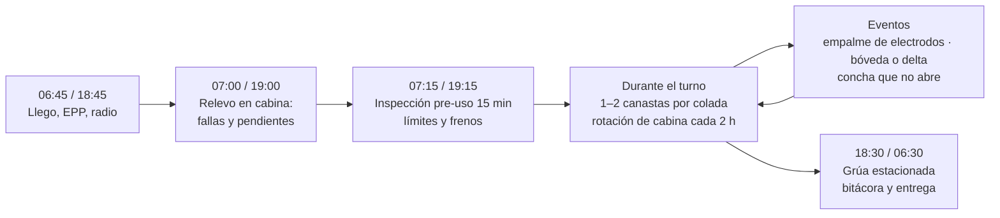
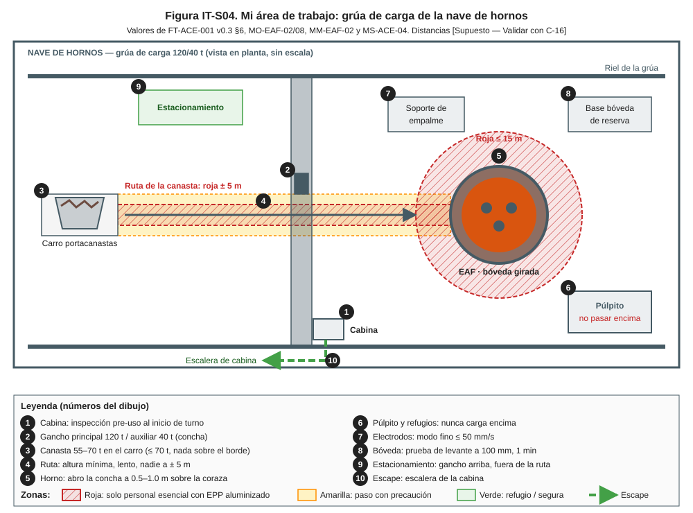
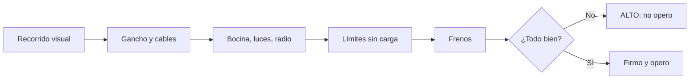
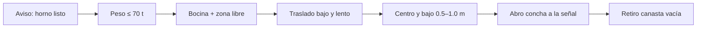
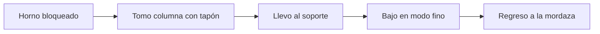
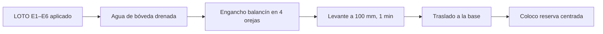

# IT-ACE-S04 — Instrucción de Trabajo: Operador de Grúa de Carga (nave de hornos)

## 1. Encabezado de control

| Campo | Valor |
|---|---|
| Código | IT-ACE-S04 |
| Versión | 0.1 |
| Estado | Borrador para validación |
| Rol | S-04 Operador de Grúa de Carga (nave de hornos) · sindicalizado N-5 |
| Área | Hornos — nave de hornos, 2 grúas viajeras de 120/40 t |
| Turno | 4x4 de 12 h (relevo 07:00 / 19:00); rotación de cabina cada 2 h · jornada según el CCT [CCT: pedir texto] |
| Reporta a | C-05 Supervisor de Hornos |
| Manuales de referencia | MO-EAF-02, MO-EAF-08, MM-EAF-02 (R); MM-GR-01 (C, criterios equivalentes para la grúa de carga); MM-EAF-03; MS-ACE-01, 03, 04, 09, 10; FT-ACE-001 v0.3 §6 |
| Elaboró | experto-operativo-metalurgia (con enfoque de diseño de capacitación) |
| Revisión técnica | experto-operativo-metalurgia — visto bueno, 2026-09-25 |
| Revisión de seguridad | Pendiente — experto-seguridad-salud |
| Revisión laboral | experto-relaciones-laborales — visto bueno (con observaciones), 2026-09-26 |
| Aprobó | Pendiente — Director |

> Esta IT **no reemplaza** a los manuales: los resume para tu puesto. Si hay duda, manda el manual. Los valores salen de FT-ACE-001 v0.3 y conservan sus marcas [Validar con OEM / Ingeniería de Proceso] y [Supuesto]. MM-GR-01 cubre las grúas de colada; para la grúa de carga se aplican criterios equivalentes con el manual OEM de la grúa [Validar con OEM].

## 2. Mi puesto en 30 segundos
Cargo el horno con canastas de chatarra de 55–70 t y muevo electrodos, bóveda y componentes. Cada carga cae sobre un talón de 20–30 t de acero líquido: la precisión y la señal correcta evitan proyecciones, daños y lesiones. Mi carga **nunca** pasa sobre personas ni sobre el púlpito. Si la grúa, el enganche o la señal no están bien, rechazo el izaje y aviso. Sin funciones de mando (LFT art. 9): si algo no está bien, **aviso, detengo y escalo** a C-05.

> **★ Mis 3 reglas de oro**
> 1. ★ **Inspección pre-uso** cada turno: si algo falla, 🛑 no opero.
> 2. ★ **Nadie bajo la carga:** bocina antes de cada movimiento; ruta libre ± 5 m.
> 3. ★ **Descargo solo con la señal del S-01** y el horno sin potencia.

## 3. Mi turno de 12 horas

> **Mi jornada (nota laboral).** Mi turno está pactado en el CCT [CCT: pedir texto]. El relevo y la entrega–recepción antes de las 07:00 / 19:00 son tiempo de trabajo (LFT art. 58). Se cuentan en la jornada o se pagan según el CCT. La jornada de 12 h y la reforma de 40 h están en revisión (arts. 59–61 y 66–68) — verificar con Jurídico Laboral.

## 4. Mi área de trabajo

Figuras de apoyo: [inspección de gancho de grúa](../img/mm-gancho-grua-inspeccion.svg) · [zonas de exclusión de la nave](../img/ms-zonas-exclusion-nave.svg).

## 5. Mi EPP

| EPP (pictograma en texto) | Cuándo lo uso |
|---|---|
| [Casco con barbiquejo] | Acceso a la cabina y en la nave |
| [Lentes de seguridad] | Todo el turno |
| [Ropa FR o 100 % algodón] | Todo el turno |
| [Botas metatarsales] | Todo el turno |
| [Protección auditiva] | En la nave y en la cabina durante la carga |
| [Arnés o línea de vida] | Pasarelas del puente y del carro (MS-ACE-10) |
| [Detector personal CO/O₂] | Cabina y pasarelas sobre los hornos (humos de carga) |

Cabina en altura con calor y polvo: hidrátate 250 mL cada 15–20 min y respeta la rotación de 2 h.

## 6. Mis tareas paso a paso

### Tarea 1 — Inspección pre-uso de la grúa (MS-ACE-04 / MM-GR-01)

| Paso | Qué hago | Cómo verifico (medición) | ★ |
|---|---|---|---|
| 1 | Reviso gancho principal y auxiliar. | Sin fisuras; pestillo o seguro funcional; sin apertura visible | ★ |
| 2 | Reviso los cables. | Sin alambres rotos, aplastamiento, coca, jaula de pájaro ni daño por calor | ★ |
| 3 | Pruebo bocina, luces, radio, mandos y paro de emergencia. | Todo responde | ★ |
| 4 | Subo el gancho lento hasta el límite superior; pruebo el inferior. | Ambos límites detienen el gancho | ★ |
| 5 | Pruebo los frenos; con la primera carga, levanto a prueba. | 200–300 mm, detengo 10 s, sin deslizamiento | ★ |
| 6 | Reviso fugas de aceite y ruidos anormales. | Sin fugas | |
| 7 | Firmo la lista de inicio de turno. | Check-list digital sin hallazgos críticos | |

> **🛑 ALTO — detén y avisa si…**
> - Un límite no corta, un freno desliza o el paro de emergencia no actúa.
> - El cable o el gancho tienen daño visible.
> - La radio o la bocina no funcionan.

### Tarea 2 — Carga de chatarra con canasta (MO-EAF-02)

| Paso | Qué hago | Cómo verifico (medición) | ★ |
|---|---|---|---|
| 1 | Espero el aviso del S-01: "EAF-x listo para carga". | Aviso por radio recibido | |
| 2 | Confirmo el peso de la canasta. | 55–70 t; nada sobre el borde; canasta seca, sin goteo | ★ |
| 3 | Engancho con gancho principal y auxiliar correctos. | Señalero confirma el enganche | ★ |
| 4 | Toco la bocina y confirmo la zona libre con el S-01. | Nadie a ≤ 15 m del horno ni a ± 5 m de la ruta (CCTV y radio) | ★ |
| 5 | Traslado a la altura mínima segura, lento y por la ruta. | Holgura ≈ 1 m sobre el obstáculo más alto; sin pasar sobre el púlpito | ★ |
| 6 | Centro la canasta sobre el horno y la bajo. | Fondo a 0.5–1.0 m sobre la coraza [Validar con OEM]; nunca > 1.5 m | |
| 7 | Abro la concha con el gancho auxiliar solo a la señal del S-01. | Horno sin potencia, electrodos arriba, bóveda girada | ★ |
| 8 | Subo y retiro por la ruta. | Canasta vacía; sin material colgado | |
| 9 | 2.ª canasta: repito con la misma señal. | 1.ª canasta fundida ≥ 70% [Validar con Ingeniería de Proceso] | ★ |

> **🛑 ALTO — detén y avisa si…**
> - La canasta gotea o pesa > 70 t: no la traslades.
> - Hay una persona en la ruta o en la zona del horno.
> - La concha no abre o abre parcial: lleva la canasta a zona segura; LOTO de la grúa.
> - Hay explosión o proyección fuerte: no se abre otra canasta.

### Tarea 3 — Izaje de columnas de electrodos (MO-EAF-08, método A)

| Paso | Qué hago | Cómo verifico (medición) | ★ |
|---|---|---|---|
| 1 | Espero que el S-01 confirme arco apagado y bloqueo. | Llaves cautivas en poder de cada persona en la plataforma | ★ |
| 2 | Tomo la columna con el tapón de izaje; el S-01 abre la mordaza. | Tapón roscado al 100% (lo confirma S-03 / S-02) | ★ |
| 3 | Llevo la columna al soporte de empalme. | Nadie bajo la carga ni en la trayectoria | ★ |
| 4 | Bajo el electrodo nuevo en modo fino para roscar. | ≤ 50 mm/s [Validar con OEM]; sin golpe entre electrodos | ★ |
| 5 | Regreso la columna a la mordaza; el S-01 la cierra. | Columna sujeta | |
| 6 | Registro la maniobra. | Bitácora de la grúa | |

> **🛑 ALTO — detén y avisa si…**
> - El tapón de izaje no rosca completo.
> - Hay golpe entre electrodos: detén e inspecciona roscas.
> - Hay una persona bajo la columna.

### Tarea 4 — Izajes de mantenimiento: bóveda, delta, camisas y bloques (MM-EAF-02 / MM-EAF-03)

| Paso | Qué hago | Cómo verifico (medición) | ★ |
|---|---|---|---|
| 1 | Confirmo con C-11 el LOTO y la energía cero. | Candados E1–E6 puestos; prueba sin movimiento, 0 bar, 0 V | ★ |
| 2 | Confirmo que el agua de la bóveda se drenó. | 0 bar; mangueras desconectadas y tapadas | ★ |
| 3 | Engancho el balancín en las 4 orejas. | Balancín con certificado vigente | ★ |
| 4 | Levanto a prueba. | 100 mm; espero 1 min; carga estable | ★ |
| 5 | Traslado la bóveda a su base. | Nadie bajo la carga | ★ |
| 6 | Coloco la bóveda de reserva sobre el anillo y la centro con las marcas. | Asiento uniforme; holgura ≤ 10 mm [Validar] | ★ |
| 7 | Para camisas y bloques del EBT, sigo al S-24. | Nadie bajo la carga (MS-ACE-04) | |

> **🛑 ALTO — detén y avisa si…**
> - La bóveda no asienta o se atora: no fuerces.
> - La carga desliza en la prueba de levante.
> - Te piden tirar en diagonal: inclinación del gancho > 5° = no se iza.

## 7. Mis controles críticos (★)

Antes de cada tarea crítica marco:
- ☐ Inspección pre-uso firmada sin hallazgos críticos.
- ☐ Peso conocido y ≤ capacidad (120 t principal / 40 t auxiliar); canasta 55–70 t.
- ☐ Enganche confirmado por el señalero; tapón de izaje al 100%.
- ☐ Bocina activada; ruta libre ± 5 m; nada sobre el púlpito ni refugios.
- ☐ Señal del S-01 y horno sin potencia antes de abrir la concha.
- ☐ Prueba de levante de 200–300 mm y 10 s con la primera carga.
- ☐ Canasta seca, sin goteo.

## 8. Si algo sale mal

| Síntoma | Qué hago | A quién aviso |
|---|---|---|
| Freno desliza o límite no corta | Bajo la carga a zona segura; grúa fuera de servicio | C-05, mantenimiento ext. 2300 [Supuesto] · canal 3 Grúas [Supuesto] |
| Persona en la ruta | Detengo el traslado; bocina | Señalero, C-05 · canal 3 |
| Concha no abre | Llevo la canasta sobre zona segura; nadie se acerca | C-05, mantenimiento · canal 3 |
| Explosión o proyección al abrir | Retiro la canasta; no abro otra | C-05, C-04, C-16 · canal 1 [Supuesto] |
| Emergencia en el horno (fuga, perforación) | Pongo la carga en posición segura; evacúo si mi vida corre riesgo | C-04 · canal 1 |
| Humo en la cabina o mareo | Salgo por la escalera de la cabina | C-05; servicio médico ext. 2222 [Supuesto] |

Mensaje de emergencia por radio: **"EMERGENCIA, EMERGENCIA, EMERGENCIA — lugar — tipo — personas — quién llama"**.

## 9. Registros que lleno

| Registro | Cuándo | Dónde |
|---|---|---|
| Inspección pre-uso de la grúa | Inicio de cada turno | Check-list digital / bitácora de la grúa |
| Tiempos de carga de canasta | Cada canasta | MES / nivel 2 |
| Maniobras de electrodo y de mantenimiento | Cada maniobra | Bitácora de la grúa |
| Fallas y golpes a paneles, bóveda o estructura | Al ocurrir | Reporte de turno |

## 10. Mi certificación

| Concepto | Requisito |
|---|---|
| Nivel ILUO requerido | **U (nivel 3)** en MO-EAF-02, MO-EAF-08 (izaje) y MM-EAF-02 (izaje) |
| Teoría | Ruta técnica 40 h (grúa viajera, señales, eslingado, inspección) + 24 h de NOM-006 y grúa |
| Simulador | ≥ 24 h (carga de canasta y movimientos de precisión) |
| OJT | 240 h (20 turnos) con operador certificado; 40 cargas; 10 maniobras de electrodo; 2 izajes de bóveda |
| Pasos ★ que me evalúan | Inspección pre-uso · EAF-02 pasos 10, 11, 17 · EAF-08 pasos 4, 7 · MM-EAF-02 pasos 6, 7 · izaje sin personas bajo la carga |
| Vigencia | **12 meses** grúas/izaje (MS-ACE-04, NOM-006) y alturas (NOM-009); **24 meses** demás TD-P07 |
| Refresco | 8 h/año: simulador + inspección |

> **Mi evaluación no es una sanción** (nota laboral — verificar con Jurídico Laboral)
> - La evaluación TD-P07 sirve para formarme, certificarme y acreditar mi aptitud. No se usa para sancionarme (DP-ACE-S §4).
> - Si aún no demuestro un paso ★, conservo mi categoría, mi salario y mi antigüedad. Recibo retroalimentación, OJT de refuerzo y otra oportunidad [Supuesto: 2 en ≤ 60 días, a validar con la CMCAP].
> - Si ya sé hacer el trabajo, puedo pedir el **examen de suficiencia** (LFT art. 153-U). Si lo apruebo, recibo mi DC-3 sin cursar toda la ruta.
> - La certificación prueba mi aptitud para ascender. Entre los aptos, asciende el de mayor antigüedad (LFT arts. 154–159 y CCT).
> - Si mi certificación se suspende tras un incidente grave, es una medida de seguridad, no una sanción. Paso a tarea no crítica sin perder salario ni antigüedad y me reevalúan en ≤ 15 días [Supuesto].
> - Mi capacitación y mis recertificaciones son en jornada y sin costo para mí. Si caen en mi descanso, se pagan según el CCT [CCT: pedir texto].

## 11. Glosario rápido

| Término | Qué significa |
|---|---|
| Canasta (90 m³) | Recipiente de chatarra con fondo de concha que se abre sobre el horno |
| Concha | Fondo de la canasta; se abre con el gancho auxiliar |
| Gancho auxiliar (40 t) | Segundo gancho: abre la concha y hace maniobras finas |
| Balancín | Viga de izaje que reparte la carga |
| Límite superior | Dispositivo que corta la subida del gancho |
| Señalero | Única persona que da señales a la grúa |
| Modo fino | Velocidad lenta para maniobras de precisión |
| Bóveda / delta | Techo del horno / pieza central por donde pasan los electrodos |
| Zona de exclusión | Área donde nadie puede estar durante la maniobra |

## 12. Control de cambios

| Versión | Fecha | Cambio | Autor |
|---|---|---|---|
| 0.1 | 2026-09-25 | Primera versión: resumen por rol de MO-EAF-02, 08, MM-EAF-02 y MS-ACE-04; figura IT-S04 | experto-operativo-metalurgia |
