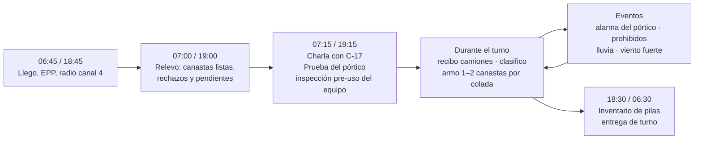
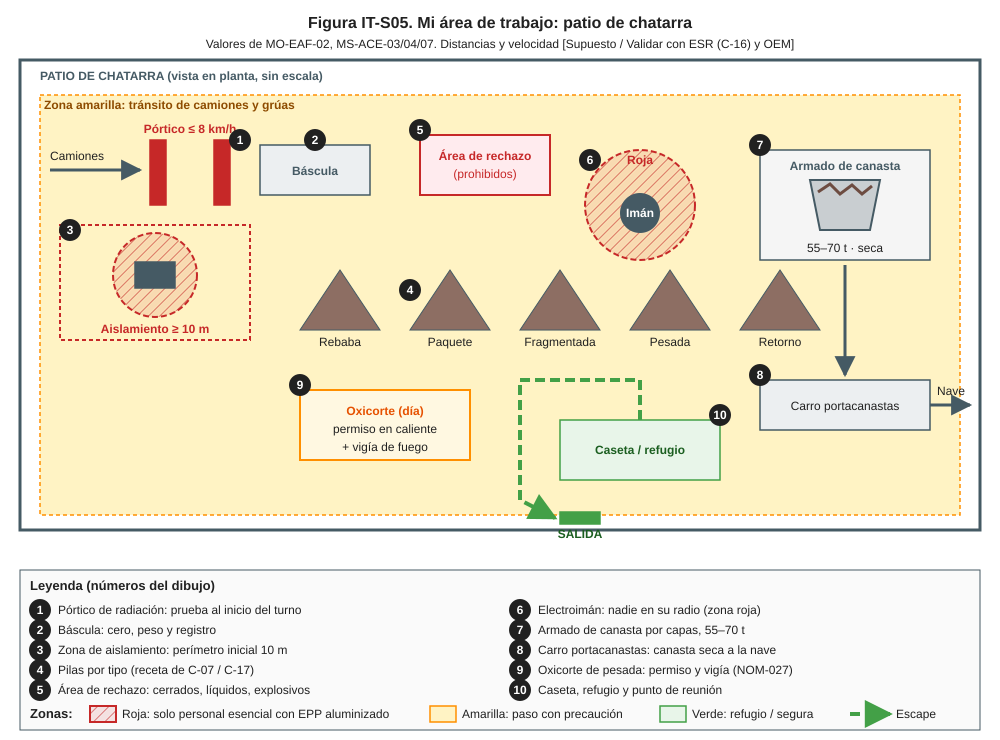
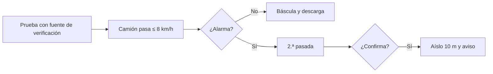
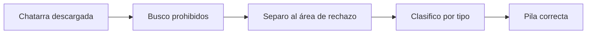
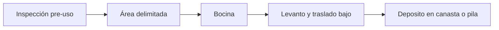

# IT-ACE-S05 — Instrucción de Trabajo: Operador de Patio de Chatarra

| Campo | Valor |
|---|---|
| Código | IT-ACE-S05 |
| Versión | 0.1 |
| Estado | Borrador para validación |
| Rol | S-05 Operador de Patio de Chatarra (canastas, electroimán, pórtico de radiación) · sindicalizado N-3 |
| Área | Hornos — patio de chatarra: recepción y pórtico, grúas y manipuladores con electroimán, carros portacanastas, preparación y oxicorte |
| Turno | 4x4 de 12 h (relevo 07:00 / 19:00) o administrativo (preparación y oxicorte de chatarra pesada) |
| Reporta a | C-17 Supervisor de Patio de Chatarra y Materiales |
| Manuales de referencia | MO-EAF-02 (R, armado de canasta); MS-ACE-03, 04, 07 (R); MS-ACE-01, 06, 08, 09, 10; FT-ACE-001 v0.3 |
| Elaboró | experto-operativo-metalurgia (con enfoque de diseño de capacitación) |
| Revisión técnica | experto-operativo-metalurgia — visto bueno, 2026-09-25 |
| Revisión de seguridad | Pendiente — experto-seguridad-salud |
| Revisión laboral | Pendiente — experto-relaciones-laborales |
| Aprobó | Pendiente — Director |

> Esta IT **no reemplaza** a los manuales: los resume para tu puesto. Si hay duda, manda el manual. Los valores salen de FT-ACE-001 v0.3 y conservan sus marcas [Validar con OEM / Ingeniería de Proceso] y [Supuesto].

## 1. Mi puesto en 30 segundos
Recibo, reviso, clasifico y cargo la chatarra en canastas según la receta. Lo que yo dejo pasar cae sobre acero líquido en el horno: un tanque cerrado, agua o hielo pueden causar una explosión, y una fuente radiactiva contamina la planta. Por eso paso cada camión por el pórtico, retiro los prohibidos y entrego canastas secas de 55–70 t a tiempo para el tap-to-tap de 55 min.

> **★ Mis 3 reglas de oro**
> 1. ★ **Alarma del pórtico = detengo, aíslo y aviso.** Nunca toco la pieza sospechosa.
> 2. ★ **Nada prohibido ni húmedo en la canasta:** si lo veo, lo retiro o 🛑 no entrego la canasta.
> 3. ★ **Nadie en el radio del electroimán.**

## 2. Mi turno de 12 horas

## 3. Mi área de trabajo

Figura de apoyo: [flujo general de la acería](../img/eaf-flujo-acería.svg).

## 4. Mi EPP

| EPP (pictograma en texto) | Cuándo lo uso |
|---|---|
| [Casco con barbiquejo] | Todo el turno en el patio |
| [Lentes de seguridad] | Todo el turno; gafas para oxicorte |
| [Chaleco reflejante] | A pie en el patio (tránsito de camiones y grúas) [Supuesto] |
| [Ropa FR o 100 % algodón] | Todo el turno |
| [Guantes de cuero / anticorte] | Clasificación manual y oxicorte |
| [Botas metatarsales] | Todo el turno |
| [Protección auditiva] | Cerca del electroimán y del oxicorte |
| [Careta de oxicorte con filtro] | Corte de chatarra pesada (NOM-027) |
| [Arnés] | Acceso a cabina de grúa de patio (MS-ACE-10) |

Trabajo a la intemperie: hidrátate 250 mL cada 15–20 min y usa la sombra en los descansos.

## 5. Mis tareas paso a paso

### Tarea 1 — Pórtico de radiación: prueba y recepción de camiones (MO-EAF-02 / MS-ACE-07)

| Paso | Qué hago | Cómo verifico (medición) | ★ |
|---|---|---|---|
| 1 | Al inicio del turno pruebo el pórtico con la fuente de verificación. | El pórtico responde; lo registro | ★ |
| 2 | Paso cada camión o góndola por el pórtico. | Velocidad ≤ 8 km/h (objetivo 5) [Validar con OEM]; espero el "libre" | ★ |
| 3 | Si hay alarma, pido una segunda pasada. | Segunda lectura registrada | ★ |
| 4 | Si confirma: detengo el camión y no lo dejo descargar. | Camión en la zona de aislamiento | ★ |
| 5 | Coloco el perímetro y saco al chofer de la cabina. | Perímetro inicial ≥ 10 m [Validar con el ESR]; placas registradas | ★ |
| 6 | Aviso a C-17 para que llame al ESR (C-16) y a C-04. | Aviso en ≤ 5 min | ★ |
| 7 | Sin alarma: peso en báscula y dirijo la descarga. | Báscula en cero; peso registrado | 🔎 |

> **🛑 ALTO — detén y avisa si…**
> - El pórtico no responde a la prueba: no se recibe chatarra.
> - La alarma se confirma: nadie toca ni mueve la pieza sospechosa.
> - El camión intenta salir sin autorización del ESR.

### Tarea 2 — Inspección y clasificación de la chatarra (MO-EAF-02 / MS-ACE-03)

| Paso | Qué hago | Cómo verifico (medición) | ★ |
|---|---|---|---|
| 1 | Reviso la chatarra descargada desde posición segura. | Nadie bajo el electroimán | |
| 2 | Busco los 6 grupos de prohibidos (ver cuadro). | Sin contenedores cerrados, líquidos, explosivos, radiactivos, baterías ni hielo | ★ |
| 3 | Separo lo prohibido en el área de rechazo. | Material marcado y registrado | ★ |
| 4 | Reviso la humedad. | Sin agua visible, escurrimiento, hielo, lodo ni nieve | ★ |
| 5 | Corto con oxicorte las piezas sobredimensionadas (cuadrilla de día). | Pieza ≤ 1.5 × 0.6 m y ≤ 1.5 t [Supuesto] | |
| 6 | Clasifico por tipo y lo llevo a su pila. | Rebaba, paquete, fragmentada, pesada, retorno | 🔎 |

**Prohibido en la canasta (rechazo obligatorio):** tanques, tambores, cilindros, tubos tapados y amortiguadores · aceite, agua, combustible o refrigerante · explosivos, municiones o artefactos sin detonar · fuentes radiactivas o cualquier rechazo del pórtico · baterías y materiales con plomo o cobre en exceso · hielo, nieve, lodo, llantas y plásticos en exceso.

> **🛑 ALTO — detén y avisa si…**
> - Encuentras un posible explosivo o munición: no lo muevas; aleja a todos.
> - Encuentras un cilindro o tanque cerrado: sepáralo; no lo cortes.
> - Hay chatarra mojada por lluvia: no se carga hasta escurrir y secar bajo techo.

### Tarea 3 — Operación de grúa o manipulador con electroimán (MS-ACE-04)

| Paso | Qué hago | Cómo verifico (medición) | ★ |
|---|---|---|---|
| 1 | Hago la inspección pre-uso. | Gancho o pulpo, electroimán, cables, bocina, luces, radio, frenos, límites | ★ |
| 2 | Reviso el viento en patio. | < 40 km/h [Supuesto]; ≥ 50 km/h suspendo [Validar con OEM] | ★ |
| 3 | Confirmo que la zona del electroimán está delimitada y vacía. | Nadie en el radio de trabajo (zona roja) | ★ |
| 4 | Toco la bocina antes de cada movimiento. | Bocina audible | |
| 5 | Traslado a baja altura, sin pasar sobre personas, cabinas ni vehículos. | Carga lo más baja posible | ★ |
| 6 | Deposito despacio en la canasta o en la pila. | Sin golpes a la canasta ni al carro | |

> **🛑 ALTO — detén y avisa si…**
> - Una persona o un vehículo entra al radio del electroimán.
> - Falla un freno, un límite o el electroimán pierde fuerza.
> - El viento llega a 50 km/h.

### Tarea 4 — Armado, pesaje y entrega de la canasta (MO-EAF-02)

| Paso | Qué hago | Cómo verifico (medición) | ★ |
|---|---|---|---|
| 1 | Reviso la canasta vacía. | Concha cerrada, seguros y orejas bien; sin agua en el fondo | ★ |
| 2 | Pongo la carga ligera al fondo. | Rebaba o paquete ligero 10–15% | 🔎 |
| 3 | Pongo la pesada al centro, lejos de las paredes, nunca arriba. | Pesada ≤ 20%; pieza ≤ 1.5 t [Supuesto] | 🔎 |
| 4 | Completo con media y termino con ligera arriba. | Nada sobre el borde (≤ 90 m³) | 🔎 |
| 5 | Peso la canasta con la báscula en cero. | 55–70 t (objetivo 65 t); densidad 0.6–0.8 t/m³ [Supuesto] | 🔎 |
| 6 | Registro número de canasta, peso y mezcla. | Registro en nivel 2 | |
| 7 | Entrego la canasta seca en el carro portacanastas. | Sin goteo; aviso por radio a S-04 | ★ |

> **🛑 ALTO — detén y avisa si…**
> - La canasta gotea: no se traslada; se escurre y C-17 la libera.
> - Pesa > 70 t: retira material. < 50 t: completa o avisa a C-17.
> - Ves un prohibido dentro de la canasta armada.

## 6. Mis controles críticos (★)

Antes de cada tarea crítica marco:
- ☐ Pórtico probado al inicio del turno y registrado.
- ☐ Cada camión pasó por el pórtico con "libre".
- ☐ Sin prohibidos ni humedad en la chatarra.
- ☐ Nadie en el radio del electroimán; área delimitada.
- ☐ Inspección pre-uso de la grúa o manipulador sin fallas.
- ☐ Canasta seca, sin goteo, 55–70 t, nada sobre el borde.
- ☐ Oxicorte: permiso de trabajo en caliente, mangueras y arrestaflamas revisados, vigía de fuego (NOM-027).

## 7. Si algo sale mal

| Síntoma | Qué hago | A quién aviso |
|---|---|---|
| Alarma confirmada del pórtico | Detengo, aíslo 10 m, chofer fuera, no descargo | C-17 · canal 4 Patio [Supuesto]; ESR (C-16) ext. 2400 [Supuesto] |
| Posible explosivo o munición | Alejo a todos; no lo muevo | C-17, C-04 · canal 1 [Supuesto] |
| Cilindro o tanque cerrado | Lo separo al área de rechazo | C-17 · canal 4 |
| Lluvia sobre pilas o canastas | Priorizo chatarra seca; no entrego canasta mojada | C-17 · canal 4 |
| Persona bajo el electroimán | Detengo el movimiento; bocina | C-17 · canal 4 |
| Canasta que gotea | No la traslado; la escurro | C-17 · canal 4 |
| Fuego por oxicorte | Uso el extintor si es seguro; aviso | C-17 · canal 1 |
| Compañero con golpe de calor | Lo llevo a la sombra y pido ayuda | Servicio médico ext. 2222 [Supuesto] |

Mensaje de emergencia por radio: **"EMERGENCIA, EMERGENCIA, EMERGENCIA — lugar — tipo — personas — quién llama"**.

## 8. Registros que lleno

| Registro | Cuándo | Dónde |
|---|---|---|
| Prueba diaria del pórtico y alarmas | Inicio de turno y cada alarma | Registro del pórtico |
| Rechazos de chatarra (tipo, origen, proveedor) | Cada rechazo | Registro de inspección |
| Canasta: número, peso, mezcla, hora | Cada canasta | Nivel 2 |
| Inspección pre-uso de grúa o manipulador | Inicio de turno | Check-list digital |
| Permiso de trabajo en caliente | Cada oxicorte | Permiso firmado |
| Inventario de pilas por tipo | Fin de turno | Sistema de inventario |

## 9. Mi certificación

| Concepto | Requisito |
|---|---|
| Nivel ILUO requerido | **U (nivel 3)** en MO-EAF-02 (armado de canasta y pórtico) |
| Teoría | Ruta técnica 40 h (clasificación y prohibidos, receta, radiación como usuario, electroimán, oxicorte); incluye 4 h de radiación con el ESR |
| OJT | 240 h (20 turnos por puesto: recepción, grúa, carro); 40 canastas |
| Pasos ★ que me evalúan | EAF-02 pasos 1, 2, 3, 4 · MS-ACE-07 pasos 7, 8 · identificación de material prohibido con muestras |
| Vigencia | **12 meses** fuentes radiactivas (MS-ACE-07, NOM-012), grúas/izaje (NOM-006) y alturas (NOM-009); **24 meses** demás TD-P07 |
| Refresco | 8 h/año: simulacro de alarma radiológica |

## 10. Glosario rápido

| Término | Qué significa |
|---|---|
| Pórtico de radiación | Detector por el que pasa cada camión |
| ESR | Encargado de Seguridad Radiológica (función de C-16, licencia CNSNS) |
| Fuente de verificación | Fuente de prueba para comprobar el pórtico |
| Prohibidos | Material que nunca entra a la canasta |
| Receta de carga | Mezcla y capas de chatarra que define C-07 / C-17 |
| Densidad aparente | Toneladas por m³ de la canasta cargada |
| Residuales | Cu, Sn, Ni, Cr que la chatarra deja en el acero |
| Retorno interno | Despuntes, colas y costras de la propia planta |
| Electroimán / pulpo | Aditamentos de la grúa para levantar chatarra |

## 11. Control de cambios

| Versión | Fecha | Cambio | Autor |
|---|---|---|---|
| 0.1 | 2026-09-25 | Primera versión: resumen por rol de MO-EAF-02, MS-ACE-03, 04, 07; figura IT-S05 | experto-operativo-metalurgia |
