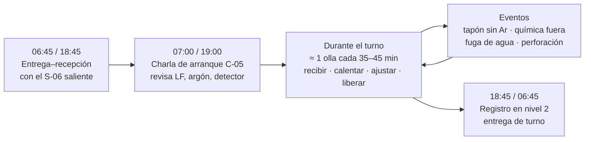
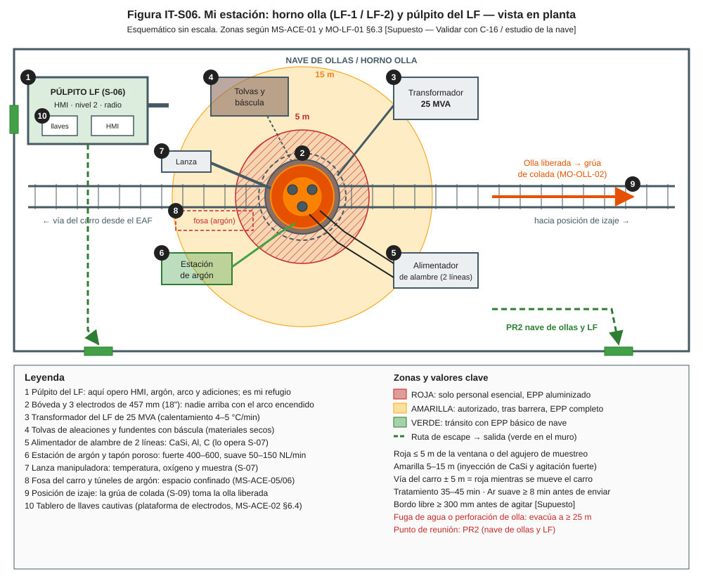
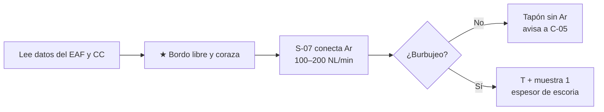
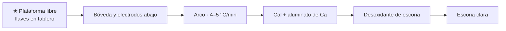
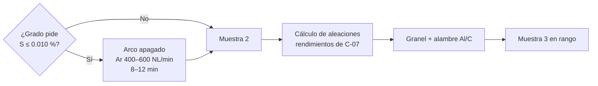
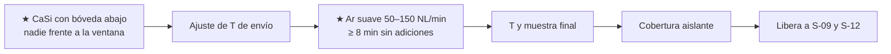
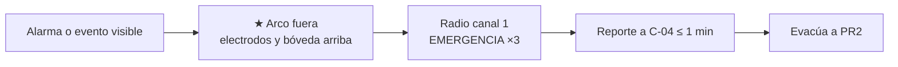

# IT-ACE-S06 — Instrucción de Trabajo: Operador de Horno Olla

## 1. Encabezado de control

| Campo | Valor |
|---|---|
| Código | IT-ACE-S06 |
| Versión | 0.1 |
| Estado | Borrador para validación |
| Rol | S-06 Operador de Horno Olla (sindicalizado, N-7) |
| Área | Metalurgia secundaria — LF-1 / LF-2 |
| Turno | 4x4 de 12 h (relevo 07:00 / 19:00) · jornada según el CCT [CCT: pedir texto] |
| Reporta a | C-05 Supervisor de Hornos (línea técnica: C-07 Ingeniero de Proceso EAF/LF) |
| Manuales de referencia | MO-LF-01 · MO-OLL-02 · MO-CC1-05 / MO-CC2-05 · MS-ACE-01, 02, 03, 06, 08, 09 · FT-ACE-001 §3 y §7 |
| Elaboró | experto-operativo-metalurgia (con diseño instruccional) |
| Revisión técnica | experto-operativo-metalurgia — visto bueno, 2026-09-25 |
| Revisión de seguridad | Pendiente — experto-seguridad-salud |
| Revisión laboral | experto-relaciones-laborales — visto bueno (con observaciones), 2026-09-26 |
| Aprobó | Pendiente — Director |

> Esta IT **resume** MO-LF-01 para tu turno. **No reemplaza al manual.** Lo marcado **[Validar con OEM / Ingeniería de Proceso]** o **[Supuesto]** no se usa en planta hasta que C-07 lo valide.

## 2. Mi puesto en 30 segundos

Llevo cada olla a la **química y temperatura de envío** en **35–45 min**. Caliento con el arco, desulfuro con argón fuerte, ajusto aleaciones y dejo el acero limpio con argón suave. Si la olla sale mal, la colada se corta o el cliente recibe acero con defectos. Mi estación tiene arco eléctrico, agua en la bóveda, argón y metal líquido: aquí un error puede matar. Sin funciones de mando (LFT art. 9): si algo no está bien, **aviso, detengo y escalo** a C-05.

> ★ **Mis 3 reglas de oro**
> 1. **Nadie** en la bóveda ni en la plataforma de electrodos con el interruptor cerrado (llave cautiva o LOTO).
> 2. **No liberes** una olla sin **≥ 8 min de argón suave** y química y temperatura en rango.
> 3. Fuga de agua, punto rojo en la coraza o perforación: **arco fuera, evacúa a ≥ 25 m y avisa**. Nunca agua sobre metal.

## 3. Mi turno de 12 horas

> **Mi jornada (nota laboral).** Mi turno está pactado en el CCT [CCT: pedir texto]. El relevo y la entrega–recepción antes de las 07:00 / 19:00 son tiempo de trabajo (LFT art. 58). Se cuentan en la jornada o se pagan según el CCT. La jornada de 12 h y la reforma de 40 h están en revisión (arts. 59–61 y 66–68) — verificar con Jurídico Laboral.

## 4. Mi área de trabajo

Figuras de apoyo del manual:

## 5. Mi EPP

| EPP | Cuándo lo uso |
|---|---|
| Casco con barbiquejo y lentes | Siempre en la nave |
| Careta con visor dorado | En plataforma, frente a la ventana o durante medición |
| Chaqueta y guantes aluminizados | Al acercarme a la olla (medición, muestreo, revisión de coraza) |
| Ropa ignífuga (FR) | Siempre; nunca ropa sintética |
| Botas metatarsales | Siempre en la nave |
| Protección auditiva | Siempre en la nave de ollas |
| Detector personal de CO y O₂ | Siempre; CO 25 ppm → sal; 200 ppm → evacuación del sector |

Ver la Figura 1 de MS-ACE-08 (`../img/ms-epp-acería.svg`).

## 6. Mis tareas paso a paso

### Tarea 1 — Recibir la olla y arrancar el argón (MO-LF-01, pasos 1–4)

| Paso | Qué hago | Cómo verifico (medición) | ★ |
|---|---|---|---|
| 1 | Lee los datos del EAF: T y O de vaciado, adiciones, arrastre, número de olla. | Datos completos en nivel 2. | |
| 2 | Lee de CC la hora requerida y la T objetivo. | Hora y T visibles en HMI. | |
| 3 | Revisa el bordo libre y coraza de la olla en el carro. | Bordo libre ≥ 300 mm [Supuesto]; sin fuga ni punto caliente. | ★ |
| 4 | Confirma con S-07 la conexión de argón. | 100–200 NL/min; burbujeo visible. | |
| 5 | Pide a S-07 medición y muestra 1 tras 2–3 min de argón. | T, O (si aplica), muestra y espesor de escoria válidos. | 🔎 |
| 6 | Revisa el espesor de escoria. | Objetivo 60 mm [Supuesto]; rango 40–100 mm. Si > 100 mm: arrastre del EAF, avisa a C-05. | 🔎 |

> 🛑 **ALTO — detén y avisa si…**
> - La coraza tiene punto rojo o fuga, o el bordo libre es < 300 mm.
> - No hay burbujeo de argón (sin agitación no hay desulfuración).
> - Hay agua sobre la escoria o alarma de fuga en la bóveda.

### Tarea 2 — Calentar y formar escoria reductora (MO-LF-01, pasos 5–6)

| Paso | Qué hago | Cómo verifico (medición) | ★ |
|---|---|---|---|
| 1 | Verifica que nadie esté en la bóveda ni en la plataforma de electrodos. | Tablero de llaves cautivas completo; confirmación en HMI. | ★ |
| 2 | Baja bóveda y electrodos; enciende el arco con el tap de la práctica. | Argón 100–200 NL/min durante el calentamiento. | |
| 3 | Agrega cal y aluminato de calcio para cubrir el arco. | Arco cubierto y estable. | |
| 4 | Vigila la velocidad de calentamiento. | 4–5 °C/min (objetivo 4.5). Si < 3 °C/min: revisa escoria, tap y argón. | |
| 5 | Agrega desoxidante de escoria según la práctica. | Escoria clara; FeO + MnO ≤ 1.0 % [Validar con Ingeniería de Proceso]. | 🔎 |
| 6 | Si el arco suena inestable, agrega cal o aluminato y baja el tap. | Arco estable. | |

> 🛑 **ALTO — detén y avisa si…**
> - Suena la alarma de fuga de agua en la bóveda: arco fuera, no muevas la olla, evacúa a ≥ 25 m.
> - La escoria espuma fuera de la olla: reduce argón, detén adiciones, arco fuera.
> - Se rompe un electrodo: arco fuera y aplica la práctica de MO-EAF-08.

### Tarea 3 — Desulfurar y ajustar la química (MO-LF-01, pasos 7–8)

| Paso | Qué hago | Cómo verifico (medición) | ★ |
|---|---|---|---|
| 1 | Apaga el arco y sube el argón a agitación fuerte. | 400–600 NL/min (objetivo 500) por 8–12 min. | |
| 2 | Vigila salpicaduras y bordo libre durante la agitación. | Sin derrame; si salpica o el "ojo" se abre mucho, reduce. | ★ |
| 3 | Pide muestra 2 a S-07. | Resultado en ≤ 4 min [Supuesto]. | 🔎 |
| 4 | Calcula aleaciones (FeMn, FeSi, SiMn, FeNb, C) con los rendimientos de C-07. | Cálculo registrado en nivel 2. | |
| 5 | Agrega a granel y ajusta el Al con alambre (S-07 lo alimenta). | Al soluble CC1: 0.020–0.045 % (objetivo 0.035). | 🔎 |
| 6 | Revisa la muestra 3. | S ≤ 0.010 % (objetivo ≤ 0.008); química en rango del grado. | 🔎 |
| 7 | Si el S no baja, desoxida escoria, agrega cal y repite agitación fuerte. | Avisa a C-07 y C-09. | |

> 🛑 **ALTO — detén y avisa si…**
> - El Al queda > 0.045 %: no se corrige hacia abajo; C-09 decide.
> - El Al en grados de CC2 supera 0.005 % [Validar]: riesgo de tapar buzas; C-09/C-08 deciden.
> - El tratamiento pasa de 50 min: avisa a S-12 y C-04 (secuencia).

### Tarea 4 — CaSi, agitación suave y liberación (MO-LF-01, pasos 9–14)

| Paso | Qué hago | Cómo verifico (medición) | ★ |
|---|---|---|---|
| 1 | Con el Al final listo, confirma con S-07 la inyección de CaSi (grados CC1 al Al). | 0.3–0.5 kg/t [Supuesto], 150–250 m/min; bóveda abajo; nadie frente a la ventana. | ★ |
| 2 | Calienta hasta la T de envío más el margen de la agitación suave. | T de envío de la tabla de MO-LF-01 §5 (p. ej. bajo C al Al ≈ 1,585–1,600 °C). | |
| 3 | Primera olla de la secuencia: suma el margen del distribuidor. | T de la familia **+ 10–15 °C** [Validar con C-08]. | 🔎 |
| 4 | Apaga el arco y deja argón suave sin adiciones. | 50–150 NL/min, "ojo" ≤ 200 mm, **≥ 8 min** (objetivo 10). | ★ |
| 5 | Pide T y muestra final a S-07. | T ± 5 °C del objetivo; química en rango. | 🔎 |
| 6 | Confirma la cobertura aislante. | Superficie cubierta. | |
| 7 | Desconecta argón y sube la bóveda. | Bóveda y electrodos arriba (enclavamiento del carro). | |
| 8 | Libera por radio a S-09 y S-12: olla, colada, T y destino. | Liberación registrada en nivel 2. | |

> 🛑 **ALTO — detén y avisa si…**
> - No se cumplen 8 min de argón suave: **no liberes**.
> - La T final está fuera de ± 10 °C del objetivo.
> - La torreta no está lista: mantén la olla con argón suave y avisa a C-04 y S-12.

### Tarea 5 — Emergencia en el LF: paro seguro desde el púlpito (MS-ACE-09, pasos 2–4)

| Paso | Qué hago | Cómo verifico (medición) | ★ |
|---|---|---|---|
| 1 | Pon el LF en estado seguro: arco fuera, electrodos y bóveda arriba. | Estado seguro en ≤ 2 min. | ★ |
| 2 | Perforación con fuga por el fondo: corta el argón. | Sin flujo en HMI. | ★ |
| 3 | Da la alarma: "EMERGENCIA ×3 — lugar — tipo — personas — quién llama". | Mensaje completo en canal 1 [Supuesto]. | ★ |
| 4 | Reporta a C-04 qué pasó, dónde, personas y acciones hechas. | Reporte en ≤ 1 min. | ★ |
| 5 | Sal a zona verde o refugio y ve a PR2. | ≤ 30 s a zona verde; conteo con C-05. | ★ |

> 🛑 **ALTO — nunca:** uses agua sobre metal, muevas una olla con agua sobre la escoria ni reanudes sin C-05 + C-07.

## 7. Mis controles críticos (★)

Antes de cada olla:
- ☐ Bordo libre ≥ 300 mm [Supuesto] y coraza sin punto rojo ni fuga.
- ☐ Tablero de llaves cautivas completo: nadie en bóveda ni plataforma.
- ☐ Sin alarma de caudal en la bóveda del LF.
- ☐ Adiciones y alambre secos (tolvas cerradas, bobinas bajo techo).
- ☐ Detector personal encendido (bump test del día).

Antes de liberar:
- ☐ CaSi inyectado con la zona despejada (si el grado lo pide).
- ☐ Argón suave ≥ 8 min, sin adiciones.
- ☐ T ± 5 °C y química en rango en la muestra final.

## 8. Si algo sale mal

| Síntoma | Qué hago | A quién aviso |
|---|---|---|
| Tapón sin argón (no burbujea) | Revisa la conexión; presión de respaldo [Validar con OEM]; si falla, usa la lanza de argón superior. | C-05, C-07 — canal 3 [Supuesto] |
| Alarma de fuga de agua en bóveda | 🛑 Arco fuera; no muevas la olla si hay agua sobre la escoria; evacúa a ≥ 25 m. | C-05, mantenimiento — canal 1 [Supuesto] |
| Perforación o fuga de olla | 🛑 Arco fuera, bóveda arriba, corta Ar si es por el fondo; evacúa a ≥ 25 m; nunca agua. | C-04, C-16 — canal 1 [Supuesto] |
| Escoria espumando fuera de la olla | Reduce argón, detén adiciones, arco fuera. | C-05 — canal 3 |
| S no baja de 0.010 % | Desoxida escoria, agrega cal, repite agitación fuerte. | C-07, C-09 — ext. 4300 [Supuesto] |
| Al > 0.045 % | No lo corrijas; espera decisión de reasignación. | C-09 — ext. 4300 [Supuesto] |
| Tratamiento > 50 min | Avisa para ajustar la secuencia. | S-12, C-04 — canal 5 / ext. 4000 [Supuesto] |
| Electrodo roto | Arco fuera; práctica de MO-EAF-08. | C-05 — canal 3 |

## 9. Registros que lleno

| Registro | Cuándo | Dónde |
|---|---|---|
| Registro de tratamiento: T y química por muestra, adiciones (kg), metros de alambre, argón (NL/min y min), kWh, tiempo, T de envío | Cada olla | Nivel 2 |
| Eventos: tapón sin Ar, fugas, desviaciones y decisiones de C-09 | Al ocurrir | Nivel 2 / bitácora de turno |
| Liberación de la olla a S-09 y S-12 | Cada olla | Nivel 2 |
| Entrega de turno | 06:45 / 18:45 | Bitácora electrónica de turno |

## 10. Mi certificación

| Concepto | MO-LF-01 (como A) | MS-ACE-09 (paro seguro) |
|---|---|---|
| Nivel ILUO | **U** (nivel 3) | **O** (nivel 4) |
| Teoría | 40 h (metalurgia secundaria, T de envío) | 8 h + simulador de emergencias |
| OJT | 160 h / 60 tratamientos | 4 simulacros |
| Pasos ★ que me evalúan | 2, 7, 9, 11 + cálculo de aleaciones y T de envío | 2, 3, 4 |
| Vigencia | 24 meses (TD-P07) | 24 meses |

Plan del puesto (DP-ACE-S): ruta técnica 60 h, simulador LF 24 h, OJT 240 h (≥ 80 tratamientos), refresco 12 h/año. Alturas (MS-ACE-10): **12 meses**. Diferencia de horas OJT entre manual y DP: pendiente de homologar con C&D.

> **Mi evaluación no es una sanción** (nota laboral — verificar con Jurídico Laboral)
> - La evaluación TD-P07 sirve para formarme, certificarme y acreditar mi aptitud. No se usa para sancionarme (DP-ACE-S §4).
> - Si aún no demuestro un paso ★, conservo mi categoría, mi salario y mi antigüedad. Recibo retroalimentación, OJT de refuerzo y otra oportunidad [Supuesto: 2 en ≤ 60 días, a validar con la CMCAP].
> - Si ya sé hacer el trabajo, puedo pedir el **examen de suficiencia** (LFT art. 153-U). Si lo apruebo, recibo mi DC-3 sin cursar toda la ruta.
> - La certificación prueba mi aptitud para ascender. Entre los aptos, asciende el de mayor antigüedad (LFT arts. 154–159 y CCT).
> - Si mi certificación se suspende tras un incidente grave, es una medida de seguridad, no una sanción. Paso a tarea no crítica sin perder salario ni antigüedad y me reevalúan en ≤ 15 días [Supuesto].
> - Mi capacitación y mis recertificaciones son en jornada y sin costo para mí. Si caen en mi descanso, se pagan según el CCT [CCT: pedir texto].

## 11. Glosario rápido

| Término | Qué significa |
|---|---|
| LF | Horno olla: calienta y afina el acero en la olla |
| Bordo libre | Distancia del nivel de escoria al borde de la olla |
| Tapón poroso | Pieza del fondo por donde entra el argón |
| Escoria reductora | Escoria con poco FeO que permite quitar azufre |
| Desulfuración | Pasar el azufre del acero a la escoria con argón fuerte |
| CaSi | Alambre de calcio-silicio que modifica las inclusiones de alúmina |
| "Ojo" | Zona de acero descubierta por el burbujeo de argón |
| Líquidus | Temperatura a la que el acero empieza a solidificar |
| Sobrecalentamiento | Grados por encima del líquidus en el distribuidor |
| Llave cautiva | Llave personal que impide cerrar el interruptor mientras estás arriba |

## 12. Control de cambios

| Versión | Fecha | Cambio | Autor |
|---|---|---|---|
| 0.1 | 2026-09-25 | Emisión inicial para validación, desde MO-LF-01, MS-ACE-09 y DP-ACE-S (S-06) | experto-operativo-metalurgia |
