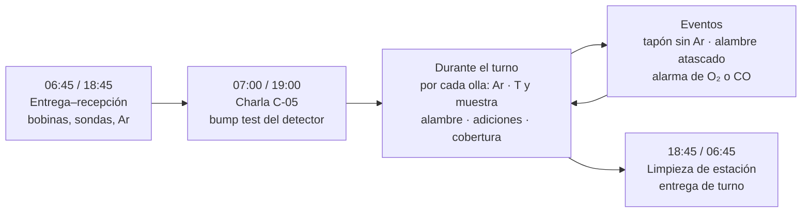
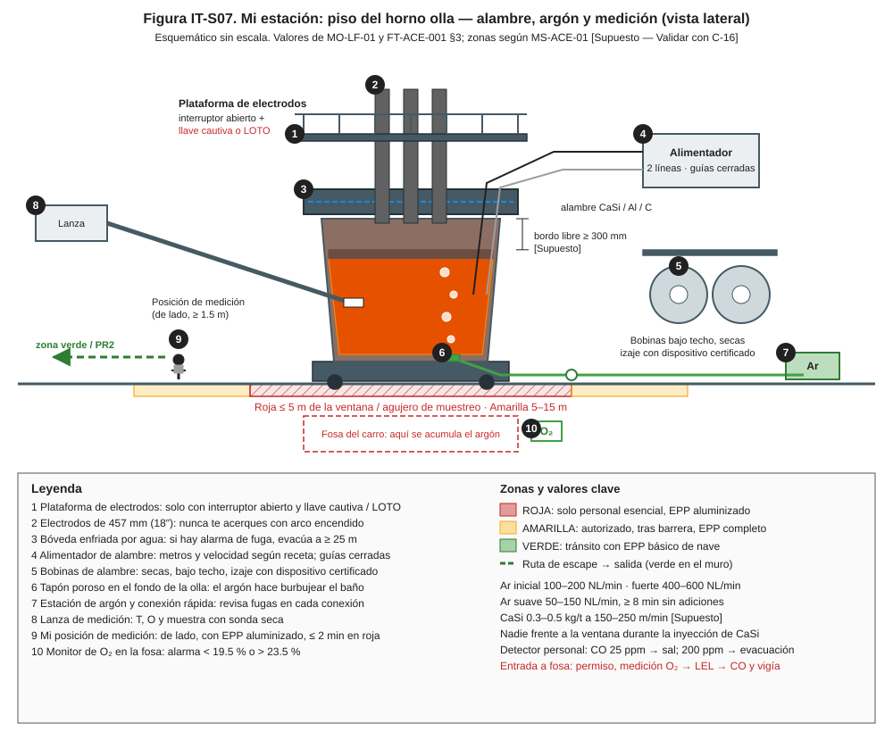
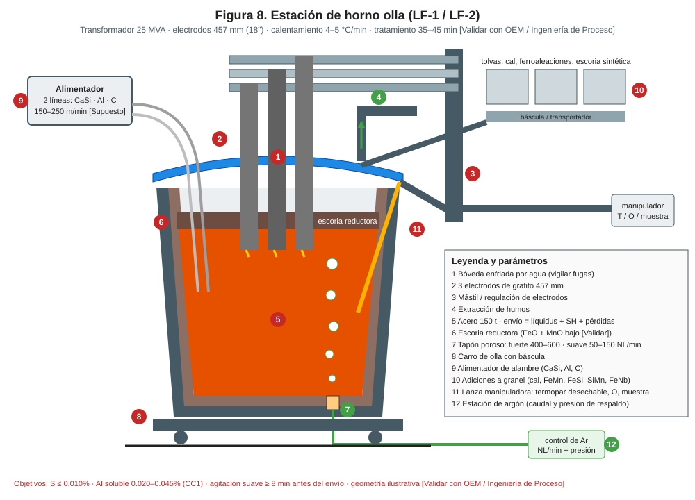
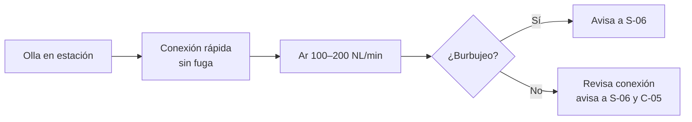
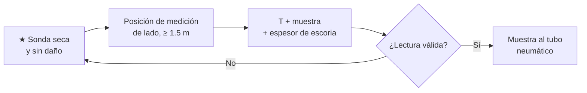
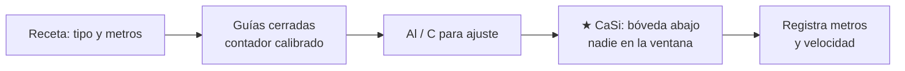
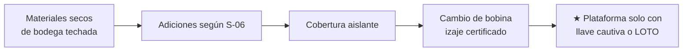

# IT-ACE-S07 — Instrucción de Trabajo: Ayudante de Horno Olla / Alimentación de Alambre

## 1. Encabezado de control

| Campo | Valor |
|---|---|
| Código | IT-ACE-S07 |
| Versión | 0.1 |
| Estado | Borrador para validación |
| Rol | S-07 Ayudante de Horno Olla / Alimentación de Alambre (sindicalizado, N-4) |
| Área | Metalurgia secundaria — piso de LF-1 / LF-2 |
| Turno | 4x4 de 12 h (relevo 07:00 / 19:00) |
| Reporta a | C-05 Supervisor de Hornos (guía técnica del S-06) |
| Manuales de referencia | MO-LF-01 · MS-ACE-01, 02, 03, 05, 06, 08, 09 · FT-ACE-001 §3 |
| Elaboró | experto-operativo-metalurgia (con diseño instruccional) |
| Revisión técnica | experto-operativo-metalurgia — visto bueno, 2026-09-25 |
| Revisión de seguridad | Pendiente — experto-seguridad-salud |
| Revisión laboral | Pendiente — experto-relaciones-laborales |
| Aprobó | Pendiente — Director |

> Esta IT **resume** tu parte de MO-LF-01. **No reemplaza al manual.** Lo marcado **[Validar con OEM / Ingeniería de Proceso]** o **[Supuesto]** no se usa en planta hasta que C-07 lo valide.

## 2. Mi puesto en 30 segundos

Soy las manos del horno olla en el piso. Conecto el argón, mido temperatura, tomo muestras y alimento el alambre de CaSi, Al y C. Si el argón no burbujea o la muestra sale mala, la olla no se puede ajustar y la colada espera. Trabajo junto a metal líquido, arco eléctrico y argón, que asfixia sin avisar.

> ★ **Mis 3 reglas de oro**
> 1. **Sondas, muestreadores, adiciones y alambre siempre secos.** Húmedo = proyección de metal.
> 2. **Nunca bajes a la fosa ni a un túnel de argón** sin permiso, medición de O₂ y vigía.
> 3. **Durante el CaSi, nadie frente a la ventana**; y para desatascar el alambre, **LOTO primero**.

## 3. Mi turno de 12 horas

## 4. Mi área de trabajo

Figura de apoyo del manual:

## 5. Mi EPP

| EPP | Cuándo lo uso |
|---|---|
| Casco con barbiquejo y lentes | Siempre en la nave |
| Careta con visor dorado | Medición, muestreo y adiciones junto a la olla |
| Chaqueta y guantes aluminizados | Medición y muestreo (zona roja ≤ 5 m) |
| Guantes de carnaza y protección facial | Alimentador de alambre y cambio de bobina |
| Ropa ignífuga (FR) y botas metatarsales | Siempre en la nave |
| Protección auditiva | Siempre en la nave de ollas |
| Detector personal de CO y O₂ | Siempre; CO 25 ppm → sal; O₂ < 19.5 % → sal |

Ver la Figura 1 de MS-ACE-08 (`../img/ms-epp-acería.svg`).

## 6. Mis tareas paso a paso

### Tarea 1 — Conectar y vigilar el argón (MO-LF-01, paso 3 y §9)

| Paso | Qué hago | Cómo verifico (medición) | ★ |
|---|---|---|---|
| 1 | Revisa manguera y conexión rápida antes de conectar. | Sin daño, sin fuga audible. | |
| 2 | Conecta el argón a la olla. | Conexión asegurada. | |
| 3 | Abre a caudal inicial y confirma el burbujeo. | 100–200 NL/min (objetivo 150); burbujeo visible. | 🔎 |
| 4 | Si no burbujea, revisa la conexión y avisa a S-06. | S-06 aplica presión de respaldo o lanza superior. | |
| 5 | Durante la agitación fuerte, vigila salpicaduras desde fuera de la roja. | 400–600 NL/min; sin derrame. | |
| 6 | Al liberar, desconecta el argón cuando S-06 lo indique. | Flujo en cero; manguera recogida. | |

> 🛑 **ALTO — detén y avisa si…**
> - Suena el monitor de O₂ de la fosa (< 19.5 % o > 23.5 %): sal y no entres.
> - Hay fuga de argón en conexión o manguera.
> - Ves punto rojo o fuga en la coraza de la olla.

### Tarea 2 — Medir temperatura y tomar muestras (MO-LF-01, pasos 4 y 12)

| Paso | Qué hago | Cómo verifico (medición) | ★ |
|---|---|---|---|
| 1 | Toma sondas y muestreadores del almacén seco. | Cartón íntegro, seco, sin golpes. | ★ |
| 2 | Espera 2–3 min de argón antes de la primera medición. | Tiempo en HMI. | |
| 3 | Colócate en la posición de medición con EPP aluminizado. | De lado, ≥ 1.5 m de la abertura; ≤ 2 min en roja. | ★ |
| 4 | Mide T, O (si aplica), muestra y espesor de escoria. | Lecturas válidas; escoria 40–100 mm. | 🔎 |
| 5 | Identifica la muestra con número de colada y envíala. | Muestra sin escoria; llega al laboratorio. | 🔎 |
| 6 | En la medición final, repite T y muestra. | T ± 5 °C del objetivo; química en rango (lo decide S-06). | 🔎 |

> 🛑 **ALTO — detén y avisa si…**
> - La sonda o el cartón están húmedos: desecha y avisa a S-06.
> - Hay proyección al inmergir: retírate, aparta el lote y avisa a C-05.
> - El arco está encendido y tendrías que salir de la posición de medición.

### Tarea 3 — Alimentar alambre de Al, C y CaSi (MO-LF-01, pasos 8 y 9)

| Paso | Qué hago | Cómo verifico (medición) | ★ |
|---|---|---|---|
| 1 | Confirma con S-06 el tipo de alambre y los metros de la receta. | Dato escrito en HMI / nivel 2. | |
| 2 | Revisa guías cerradas, guardas puestas y contador de metros. | Guardas colocadas (NOM-004); contador calibrado. | |
| 3 | Alimenta Al o C para el ajuste químico. | Metros según cálculo; error ≤ 2 %. | 🔎 |
| 4 | Para CaSi, confirma bóveda abajo y la zona frente a la ventana libre. | Nadie en roja (≤ 5 m) ni en amarilla (5–15 m). | ★ |
| 5 | Inyecta CaSi con argón suave. | 0.3–0.5 kg/t [Supuesto] a 150–250 m/min [Supuesto]. | ★ |
| 6 | Observa que el alambre entre bajo la escoria. | Sin alambre que salga o flote. | |
| 7 | Registra metros y velocidad por tipo de alambre. | Registro en nivel 2. | |

> 🛑 **ALTO — detén y avisa si…**
> - El alambre se atasca o se rompe: detén el alimentador; **LOTO** antes de desatascar.
> - Hay proyecciones o llamarada fuera de lo normal.
> - Alguien está en la trayectoria del alambre o frente a la ventana.

### Tarea 4 — Adiciones, cobertura, bobinas y apoyo en electrodos (MO-LF-01, paso 13; MS-ACE-02)

| Paso | Qué hago | Cómo verifico (medición) | ★ |
|---|---|---|---|
| 1 | Prepara ferroaleaciones y fundentes secos. | Tolvas cerradas; bodega techada. | ★ |
| 2 | Agrega la cobertura aislante al final. | Superficie cubierta. | |
| 3 | Cambia la bobina con el dispositivo de izaje certificado. | Nadie bajo la bobina; guardas de nuevo en su lugar. | ★ |
| 4 | Para apoyar la adición de electrodos, confirma interruptor abierto. | Llave cautiva en tu mano (una por persona) o LOTO completo. | ★ |
| 5 | Limpia la estación y deja herramientas en la bandeja de secado. | Estación ordenada; herramientas secas. | |

> 🛑 **ALTO — detén y avisa si…**
> - Falta una llave en el tablero o el interruptor no está abierto.
> - La bobina está mojada o dañada.
> - El dispositivo de izaje no tiene etiqueta de inspección vigente.

## 7. Mis controles críticos (★)

- ☐ Sondas, muestreadores, adiciones y alambre secos.
- ☐ Detector personal con bump test del día.
- ☐ Monitor de O₂ de la fosa sin alarma.
- ☐ Posición de medición de lado, ≥ 1.5 m, ≤ 2 min en roja.
- ☐ CaSi: bóveda abajo y nadie frente a la ventana.
- ☐ Guardas del alimentador colocadas; LOTO para desatascar.
- ☐ Plataforma de electrodos solo con llave cautiva o LOTO.

## 8. Si algo sale mal

| Síntoma | Qué hago | A quién aviso |
|---|---|---|
| Tapón sin argón | Revisa conexión y manguera. | S-06, C-05 — canal 3 [Supuesto] |
| Alarma del monitor de O₂ o del detector personal | Sal a zona ventilada; no rescates sin ERA. | S-06, C-05 — canal 1 [Supuesto] |
| Proyección al medir | Retírate, aparta el lote de sondas. | S-06, C-05 — canal 3 |
| Alambre atascado o roto | Detén el alimentador; LOTO para desatascar. | S-06, C-05 — canal 3 |
| Muestra con porosidad o escoria | Toma otra muestra. | S-11 — ext. 4100 [Supuesto] |
| Alarma de fuga de agua en la bóveda | 🛑 Evacúa a ≥ 25 m. | S-06, C-05 — canal 1 |
| Perforación o fuga de olla | 🛑 Evacúa a ≥ 25 m; nunca agua; ve a PR2. | C-04 — canal 1 |

## 9. Registros que lleno

| Registro | Cuándo | Dónde |
|---|---|---|
| Metros y velocidad de alambre por tipo | Cada olla | Nivel 2 |
| Identificación de muestras (colada y momento) | Cada muestra | Tubo neumático / LIMS |
| Lotes de sondas con lecturas fallidas | Al ocurrir | Bitácora del LF |
| Cambio de bobina (tipo, lote) | Al cambiar | Bitácora del LF |
| Entrega de turno (bobinas, sondas, Ar) | 06:45 / 18:45 | Bitácora de turno |

## 10. Mi certificación

| Concepto | MO-LF-01 (pasos de ayudante) | MS-ACE-03 (agua–metal) |
|---|---|---|
| Nivel ILUO | **U** (nivel 3) | **U** (nivel 3) |
| Teoría | 24 h | 6 h |
| OJT | 80 h / 40 tratamientos | 20 h |
| Pasos ★ que me evalúan | 3, 4, 9, 12; manejo seguro del alimentador; llave cautiva / LOTO | 7, 8, 9 (herramientas y adiciones secas) |
| Vigencia | 24 meses (TD-P07) | 24 meses (TD-P07) |

Plan del puesto (DP-ACE-S): ruta técnica 32 h, OJT 240 h (20 turnos), refresco de gases y asfixia 8 h/año. Alturas (MS-ACE-10, NOM-009): **12 meses**. MS-ACE-06 (gases): 24 meses.

## 11. Glosario rápido

| Término | Qué significa |
|---|---|
| Alimentador de alambre | Máquina que mete alambre en el acero a velocidad fija |
| CaSi | Alambre de calcio-silicio para tratar inclusiones |
| Tapón poroso | Pieza del fondo de la olla por donde entra el argón |
| Sonda / muestreador | Cartucho desechable para medir T o sacar muestra |
| Asfixia por argón | El argón desplaza el oxígeno sin olor ni aviso |
| Llave cautiva | Llave personal que impide cerrar el interruptor mientras estás arriba |
| LOTO | Bloqueo y etiquetado de energías antes de intervenir |
| Cobertura aislante | Polvo que tapa el acero para que no pierda calor |

## 12. Control de cambios

| Versión | Fecha | Cambio | Autor |
|---|---|---|---|
| 0.1 | 2026-09-25 | Emisión inicial para validación, desde MO-LF-01, MS-ACE-03 y DP-ACE-S (S-07) | experto-operativo-metalurgia |
