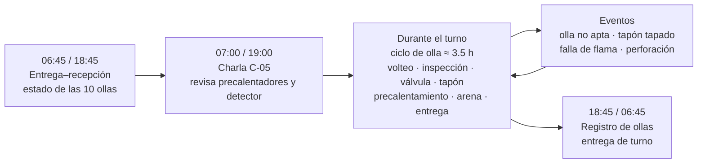
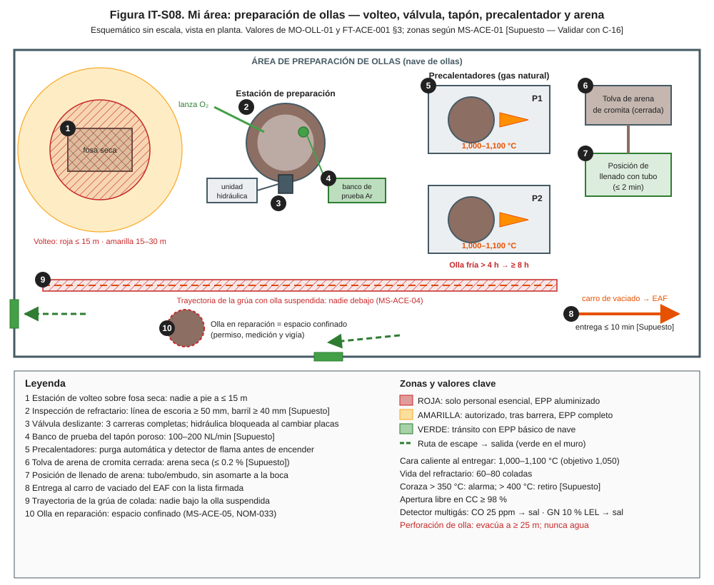
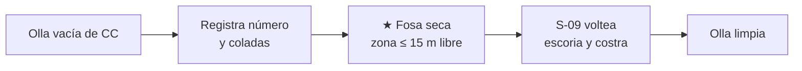
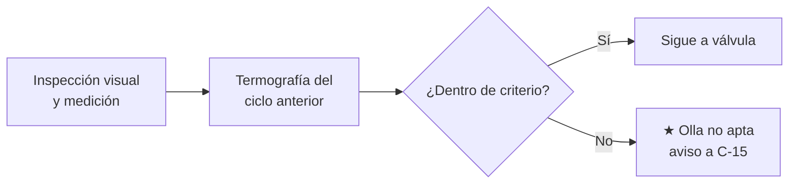
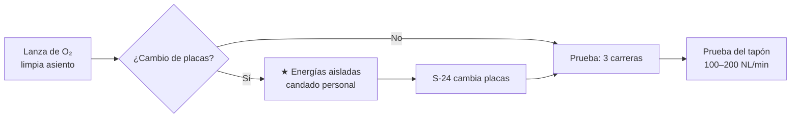
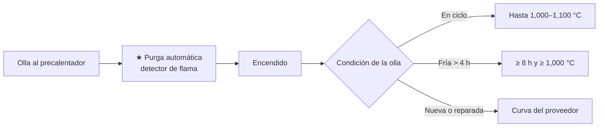
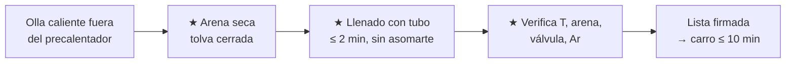

# IT-ACE-S08 — Instrucción de Trabajo: Preparador de Ollas (Ollero)

## 1. Encabezado de control

| Campo | Valor |
|---|---|
| Código | IT-ACE-S08 |
| Versión | 0.1 |
| Estado | Borrador para validación |
| Rol | S-08 Preparador de Ollas (Ollero) (sindicalizado, N-3) |
| Área | Área de preparación de ollas — flota de 10 ollas de 150 t (7 en ciclo) |
| Turno | 4x4 de 12 h (relevo 07:00 / 19:00) y administrativo (ollas fuera de ciclo) |
| Reporta a | C-05 Supervisor de Hornos (línea técnica: C-15 Especialista de Refractarios) |
| Manuales de referencia | MO-OLL-01 · MM-OLL-01 · MO-EAF-07 (lista de olla) · MS-ACE-01, 02, 03, 05, 06, 08, 09 · FT-ACE-001 §3 |
| Elaboró | experto-operativo-metalurgia (con diseño instruccional) |
| Revisión técnica | experto-operativo-metalurgia — visto bueno, 2026-09-25 |
| Revisión de seguridad | Pendiente — experto-seguridad-salud |
| Revisión laboral | Pendiente — experto-relaciones-laborales |
| Aprobó | Pendiente — Director |

> Esta IT **resume** MO-OLL-01 y tu parte de MM-OLL-01. **No reemplaza al manual.** Lo marcado **[Validar con OEM / Ingeniería de Proceso]** o **[Supuesto]** no se usa en planta hasta que C-15 / C-07 lo validen.

## 2. Mi puesto en 30 segundos

Entrego cada olla **seca, caliente, con refractario vigente, válvula probada, tapón con argón y arena de sello**. Una olla fría o húmeda puede **explotar o perforarse** con 150 t de acero dentro. Una arena mal puesta hace que la olla no abra en la colada. Mi trabajo es la primera barrera contra la perforación de olla.

> ★ **Mis 3 reglas de oro**
> 1. **Nunca entregues una olla bajo 1,000 °C** en la cara caliente. Olla fría (> 4 h fuera): **≥ 8 h** de precalentamiento.
> 2. **Arena seca, con la olla caliente y desde la posición protegida**, justo antes de entregar.
> 3. **Nadie bajo una olla suspendida** y **nadie dentro de una olla** sin permiso de espacio confinado.

## 3. Mi turno de 12 horas

## 4. Mi área de trabajo

Figura de apoyo del manual:

## 5. Mi EPP

| EPP | Cuándo lo uso |
|---|---|
| Casco, lentes y protección auditiva | Siempre en la nave |
| Careta con visor dorado | Junto a una olla caliente y en el llenado de arena |
| Chaqueta, polainas y guantes aluminizados | Junto a una olla caliente (> 1,000 °C) |
| Ropa ignífuga (FR) y botas metatarsales | Siempre |
| Mascarilla para polvo | Polvo de cromita y refractario (según NOM-010) |
| Detector multigás | Zona del precalentador: CO 25 ppm → sal; GN 10 % LEL → sal; 20 % LEL → evacuar |
| Arnés y línea de vida | Trabajo en altura (MS-ACE-10) |

## 6. Mis tareas paso a paso

### Tarea 1 — Recibir la olla vacía y voltear escoria (MO-OLL-01, pasos 1–2)

| Paso | Qué hago | Cómo verifico (medición) | ★ |
|---|---|---|---|
| 1 | Registra número de olla, coladas acumuladas y notas de la CC. | Apertura libre y flujo anotados. | |
| 2 | Revisa que la fosa de volteo esté seca. | Cero agua estancada. | ★ |
| 3 | Despeja la zona de volteo. | Nadie a pie a ≤ 15 m (roja); 15–30 m amarilla. | ★ |
| 4 | Da la señal a S-09 desde posición segura; nadie bajo la olla. | Olla volteada; costra fuera. | ★ |
| 5 | Revisa la olla limpia al regresar a la estación. | Sin costra en fondo y asiento. | 🔎 |

> 🛑 **ALTO — detén y avisa si…**
> - Hay agua o humedad en la fosa de volteo.
> - Hay una persona en la zona roja o bajo la olla.
> - La coraza muestra punto caliente > 350 °C [Supuesto].

### Tarea 2 — Inspeccionar el refractario y declarar olla no apta (MO-OLL-01, pasos 3–4)

| Paso | Qué hago | Cómo verifico (medición) | ★ |
|---|---|---|---|
| 1 | Revisa línea de escoria, barril, fondo, zona de impacto, asiento de buza y tapón. | Visual y medición con S-24. | 🔎 |
| 2 | Compara el espesor residual. | Línea de escoria ≥ 50 mm; barril ≥ 40 mm [Supuesto]. | 🔎 |
| 3 | Revisa las coladas del refractario. | Vida 60–80 coladas; ≥ 80 = retiro. | ★ |
| 4 | Revisa la termografía de coraza del ciclo anterior. | ≤ 300 °C objetivo; > 350 °C alarma; > 400 °C retiro [Supuesto]. | ★ |
| 5 | Si algo falla, declara "olla no apta", sácala de ciclo y avisa. | C-15 decide el retiro a MM-OLL-01. | ★ |

> 🛑 **ALTO — detén y avisa si…**
> - La olla llegó al límite de vida o tiene desgaste fuera de criterio.
> - Hay grietas en muñones o END vencido (MM-OLL-01).
> - Hay refractario recién reparado sin su curva de secado.

### Tarea 3 — Limpiar asiento, probar válvula y tapón (MO-OLL-01, pasos 5, 8, 9; MM-OLL-01, pasos 1–2, 8, 9)

| Paso | Qué hago | Cómo verifico (medición) | ★ |
|---|---|---|---|
| 1 | Limpia el asiento de la buza con la lanza de O₂ desde arriba. | Asiento limpio; ropa sin grasa. | |
| 2 | Si S-24 cambia placas: olla asentada y energías aisladas. | Argón desconectado, cilindro retirado, precalentador bloqueado; tu candado puesto. | ★ |
| 3 | Prueba que no haya energía antes de meter las manos. | Intento de encendido y movimiento rechazados. | ★ |
| 4 | Con S-24, reconecta y prueba la válvula. | 3 carreras completas; presión ≤ 1.2 × normal; queda cerrada. | ★ |
| 5 | Conecta argón y prueba el tapón poroso. | 100–200 NL/min a la presión de prueba [Supuesto]. | 🔎 |
| 6 | Si el tapón está tapado, avisa para limpieza con O₂ o cambio. | C-15 / C-04 deciden olla "sin Ar". | |

> 🛑 **ALTO — detén y avisa si…**
> - La válvula tiene carrera incompleta o lenta: no entregues.
> - Falta un candado o la energía no está en cero.
> - Alguien golpea los resortes en vez de usar la herramienta OEM.

### Tarea 4 — Precalentar la olla (MO-OLL-01, paso 10)

| Paso | Qué hago | Cómo verifico (medición) | ★ |
|---|---|---|---|
| 1 | Coloca la olla en el precalentador (con S-09). | Olla asentada; nadie bajo la carga. | |
| 2 | Deja que la purga automática termine antes de encender. | Detector de flama en servicio. | ★ |
| 3 | Olla en ciclo (≤ 4 h fuera): calienta hasta rango. | Cara caliente 1,000–1,100 °C (objetivo 1,050); típico 30–60 min [Supuesto]. | ★ |
| 4 | Olla fría (> 4 h fuera): cumple el tiempo. | ≥ 8 h (8–12 h) y ≥ 1,000 °C. | ★ |
| 5 | Olla nueva, revestida o con reparación de línea de escoria: sigue la curva. | Curva completa firmada por C-15 (típico 24–48 h [Validar]). | ★ |
| 6 | Registra temperatura y horas de precalentamiento. | Registro de olla completo. | |

> 🛑 **ALTO — detén y avisa si…**
> - Falla la flama: el sistema corta; **nunca reenciendas a mano sin purga**.
> - La olla no llega a 1,000 °C: no la entregues; C-04 decide con C-07.
> - El detector multigás marca GN ≥ 10 % LEL o CO ≥ 25 ppm.

### Tarea 5 — Llenar la arena, verificar y entregar (MO-OLL-01, pasos 11–13)

| Paso | Qué hago | Cómo verifico (medición) | ★ |
|---|---|---|---|
| 1 | Verifica que la arena de cromita esté seca. | ≤ 0.2 % de humedad [Supuesto]; > 0.5 % no se usa. | ★ |
| 2 | Colócate en la posición designada con EPP aluminizado. | Tubo/embudo listo; sin asomarte a la boca. | ★ |
| 3 | Llena la buza superior y forma el cono. | Cono completo, sin huecos; exposición ≤ 2 min. | ★ |
| 4 | Mide la cara caliente antes de entregar. | ≥ 1,000 °C. | ★ |
| 5 | Revisa arena sin remover, válvula cerrada y conexión de Ar. | Todo conforme. | ★ |
| 6 | Firma la lista de entrega y envía la olla al carro del EAF. | Entrega ≤ 10 min [Supuesto]. | |

> 🛑 **ALTO — detén y avisa si…**
> - La arena está húmeda o la tolva estaba abierta: cambia el lote.
> - La olla bajó de 1,000 °C antes de salir.
> - Tienes que asomarte a la boca para llenar: detén y pide apoyo a C-05.

## 7. Mis controles críticos (★)

- ☐ Fosa de volteo seca y zona ≤ 15 m libre.
- ☐ Criterios de retiro revisados (coladas, espesor, coraza).
- ☐ Energías aisladas y mi candado puesto antes de meter las manos.
- ☐ Purga automática antes de encender el precalentador.
- ☐ Regla de olla fría: > 4 h fuera → ≥ 8 h.
- ☐ Arena seca, llenado desde la posición protegida, ≤ 2 min.
- ☐ Cara caliente ≥ 1,000 °C al entregar; lista firmada.
- ☐ Permiso de espacio confinado para entrar a una olla (O₂ 19.5–23.5 %, CO < 25 ppm, < 10 % LEL).

## 8. Si algo sale mal

| Síntoma | Qué hago | A quién aviso |
|---|---|---|
| Coraza > 350 °C | Saca la olla de ciclo. | C-15, C-04 — canal 3 / ext. 4000 [Supuesto] |
| Perforación de olla | 🛑 Evacúa a ≥ 25 m; nunca agua; ve a PR2. | C-04, C-16 — canal 1 [Supuesto] |
| Tapón sin paso de argón | Avisa para limpieza con O₂ o cambio. | C-15, C-04 — canal 3 |
| Válvula con carrera incompleta | No entregues; S-24 corrige. | C-15 — canal 3 |
| Olla no alcanza 1,000 °C | Sigue calentando; no entregues. | C-04, C-07 — ext. 4000 |
| Falla de flama del precalentador | Espera el corte automático y la purga. | Mantenimiento — ext. 4200 [Supuesto] |
| Arena húmeda | Cambia el lote; revisa almacenamiento. | C-15, C-17 — canal 3 |

## 9. Registros que lleno

| Registro | Cuándo | Dónde |
|---|---|---|
| Registro de olla: número, coladas, inspección, placas, buza, tapón, lote de arena, T, horas de precalentamiento | Cada ciclo | Registro de ollas (MES) |
| Lista de entrega firmada | Cada entrega | Registro de ollas / carro del EAF |
| Tarjeta de liberación tras cambio de placas o tapón (con C-15 y C-04) | Cada cambio | Registro de ollas (MM-OLL-01) |
| Permiso de espacio confinado | Cada entrada | Sistema de permisos |
| Olla no apta / retiros | Al ocurrir | Registro de ollas y bitácora de turno |

## 10. Mi certificación

| Concepto | MO-OLL-01 (como A) | MS-ACE-05 (entrante a espacio confinado) | MS-ACE-04 (señalero / maniobrista) |
|---|---|---|---|
| Nivel ILUO | **U** (nivel 3) | **U** (nivel 3) | **U** (nivel 3) |
| Teoría | 24 h (refractarios, válvula, tapón, precalentador, agua–metal) | 8 h (CRS-02, NOM-033) | 16 h (CRS-04, señales NOM-006) |
| OJT | 120 h / 40 ollas | 3 entradas supervisadas | 20 maniobras |
| Pasos ★ que me evalúan | 2, 10, 11, 12 + criterio de retiro | 8, 9, 10 | 4, 6, 9 |
| Vigencia | 24 meses (TD-P07) | **12 meses** | **12 meses** |

Plan del puesto (DP-ACE-S): ruta técnica 32 h, OJT 240 h (20 turnos), refresco 8 h/año. **12 meses:** alturas (NOM-009), espacios confinados (NOM-033) y señalero/enganche (DC-3 NOM-006). MS-ACE-03: 24 meses.

## 11. Glosario rápido

| Término | Qué significa |
|---|---|
| Cara caliente | Superficie interior del refractario que toca el acero |
| Válvula deslizante | Placas que abren y cierran la salida del acero en la CC |
| Arena de sello (cromita) | Arena que evita que el acero se congele en la buza |
| Apertura libre | La olla abre sola, sin lanceo, en la colada |
| Tapón poroso | Pieza del fondo por donde entra el argón |
| Olla fría | Olla que estuvo fuera de ciclo más de 4 h |
| Línea de escoria | Franja del refractario que más se desgasta |
| Volteo | Vaciar escoria y costra de la olla vacía |
| Muñones | Los dos puntos de izaje de la olla |

## 12. Control de cambios

| Versión | Fecha | Cambio | Autor |
|---|---|---|---|
| 0.1 | 2026-09-25 | Emisión inicial para validación, desde MO-OLL-01, MM-OLL-01, MS-ACE-03/05 y DP-ACE-S (S-08) | experto-operativo-metalurgia |
