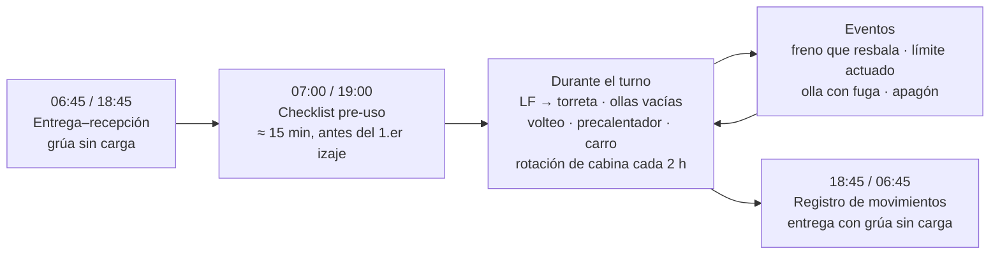
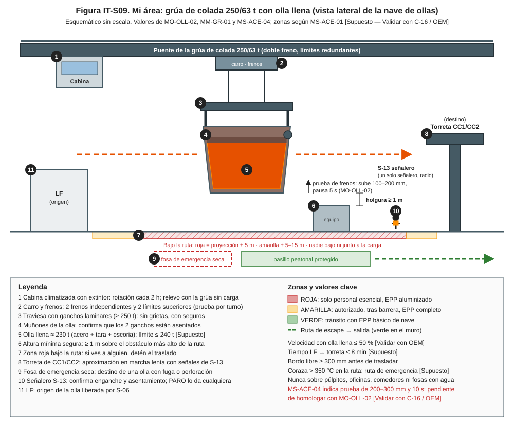
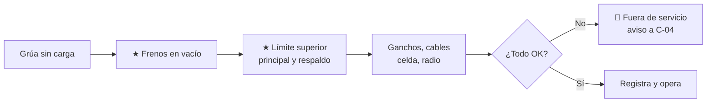
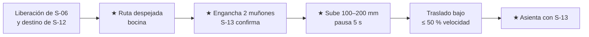
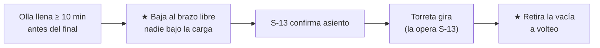
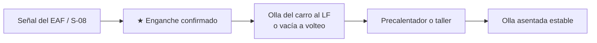
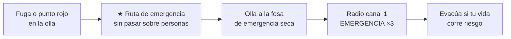

# IT-ACE-S09 — Instrucción de Trabajo: Operador de Grúa de Colada (nave de ollas)

## 1. Encabezado de control

| Campo | Valor |
|---|---|
| Código | IT-ACE-S09 |
| Versión | 0.1 |
| Estado | Borrador para validación |
| Rol | S-09 Operador de Grúa de Colada (sindicalizado, N-6) |
| Área | Nave de ollas — 2 grúas de colada de 250/63 t (doble freno, límites redundantes) |
| Turno | 4x4 de 12 h (relevo 07:00 / 19:00); rotación de cabina cada 2 h |
| Reporta a | C-04 Jefe de Turno de Acería (dueño de MO-OLL-02), vía C-05 |
| Manuales de referencia | MO-OLL-02 · MM-GR-01 · MO-EAF-07 · MO-CC1-05 / MO-CC2-05 · MO-OLL-01 · MS-ACE-01, 03, 04, 08, 09 · FT-ACE-001 §3 y §6 |
| Elaboró | experto-operativo-metalurgia (con diseño instruccional) |
| Revisión técnica | experto-operativo-metalurgia — visto bueno, 2026-09-25 |
| Revisión de seguridad | Pendiente — experto-seguridad-salud |
| Revisión laboral | Pendiente — experto-relaciones-laborales |
| Aprobó | Pendiente — Director |

> Esta IT **resume** MO-OLL-02 y tu checklist de MM-GR-01. **No reemplaza al manual.** Lo marcado **[Validar con OEM / Ingeniería de Proceso]** o **[Supuesto]** no se usa en planta hasta que C-04 / Mantenimiento lo validen.

## 2. Mi puesto en 30 segundos

Muevo ollas con **≈ 150 t de acero líquido** (≈ 230 t en el gancho [Supuesto]) del LF a la torreta de colada y regreso las vacías. Si la olla cae, se ladea o se perfora en el aire, la consecuencia es **catastrófica**. Por eso pruebo la grúa cada turno, uso solo la ruta autorizada y **no muevo una olla insegura**. Tengo autoridad para detener cualquier traslado.

> ★ **Mis 3 reglas de oro**
> 1. **Frenos y límites probados** al inicio del turno. Si falla uno, la grúa **no mueve metal líquido**.
> 2. **Nadie bajo la carga ni en la ruta.** Si veo a alguien, detengo.
> 3. **Ambos muñones asentados** (confirmado por el señalero) y **prueba de frenos con carga** antes de trasladar.

## 3. Mi turno de 12 horas

## 4. Mi área de trabajo

Figuras de apoyo:

## 5. Mi EPP

| EPP | Cuándo lo uso |
|---|---|
| Casco, lentes y protección auditiva | Siempre en la nave y en el acceso a la grúa |
| Ropa ignífuga (FR) o algodón | Siempre; nunca ropa sintética |
| Botas de seguridad | Siempre |
| Cabina climatizada con filtro y extintor | Durante toda la operación (revisa A/C y extintor en el checklist) |
| Arnés y línea de vida | Pasillos del puente y del carro (MS-ACE-10) |
| EPP aluminizado | Solo si debes salir cerca de metal líquido (MS-ACE-08) |

## 6. Mis tareas paso a paso

### Tarea 1 — Checklist diario pre-uso de la grúa (MO-OLL-02, paso 1; MM-GR-01 diario)

| Paso | Qué hago | Cómo verifico (medición) | ★ |
|---|---|---|---|
| 1 | Prueba los 2 frenos de izaje sin carga. | Detienen y retienen sin deslizamiento. | ★ |
| 2 | Acerca el bloque despacio al límite superior. | Actúan el principal y el de respaldo. | ★ |
| 3 | Prueba límites de traslación y anticolisión. | Actúan y reducen velocidad. | |
| 4 | Revisa ganchos, seguros y traviesa. | Sin grietas, deformación ni desgaste visible. | ★ |
| 5 | Revisa cables en los tramos visibles. | Sin alambres rotos, aplastamiento ni "jaula de pájaro". | ★ |
| 6 | Revisa celda de carga sin carga. | Cero coherente. | |
| 7 | Prueba radio, bocina, luces y paro de emergencia. | Funcionan. | |
| 8 | Revisa cabina: aire acondicionado, extintor, visibilidad. | En condición. | |
| 9 | Registra el checklist antes del primer izaje. | Check-list digital firmado (≈ 15 min). | |

> 🛑 **ALTO — detén y avisa si…**
> - Un freno resbala o un límite superior no corta.
> - Hay alambres rotos, daño por calor o grieta en gancho o traviesa.
> - Falta la tarjeta verde de liberación de mantenimiento en cabina.

### Tarea 2 — Trasladar la olla llena del LF a la torreta (MO-OLL-02, pasos 2–11 y 13)

| Paso | Qué hago | Cómo verifico (medición) | ★ |
|---|---|---|---|
| 1 | Recibe la liberación de S-06 por radio. | Colada, T, química, argón suave cumplido, bordo libre ≥ 300 mm, sin fuga. | |
| 2 | Confirma con S-12 la torreta y el brazo libre. | Destino confirmado. | |
| 3 | Toca la bocina y revisa la ruta y el área bajo la trayectoria. | Nadie en roja (proyección ± 5 m). | ★ |
| 4 | Baja la traviesa y engancha ambos muñones. | Los 2 ganchos enganchados. | ★ |
| 5 | Espera la señal "enganche OK" de S-13. | Confirmación visual de ambos lados. | ★ |
| 6 | Levanta y prueba frenos con carga. | Sube 100–200 mm y pausa 5 s (MO-OLL-02); sin deslizamiento; peso ≤ 240 t [Supuesto]. | ★ |
| 7 | Traslada a la altura mínima segura. | ≥ 1 m sobre el obstáculo más alto; ≤ 50 % de velocidad [Validar con OEM]; sin balanceo. | |
| 8 | Aproxima a la torreta en marcha lenta con señales de S-13. | Muñones alineados con el brazo. | |
| 9 | Baja suave hasta asentar. | "Asentada OK" de S-13. | ★ |
| 10 | Desengancha, sube y retira la traviesa. Registra el movimiento. | Tiempo LF → torreta ≤ 8 min [Supuesto]. | |

> ⚠️ **Pendiente de homologar:** MS-ACE-04 pide la prueba de frenos a **200–300 mm y 10 s**; MO-OLL-02 dice **100–200 mm y 5 s**. Aplica lo que confirme C-04 hasta que C-16 y el OEM homologuen el valor [Validar con C-16 / OEM].

> 🛑 **ALTO — detén y avisa si…**
> - Peso > 240 t en la celda de carga [Supuesto]: asienta y avisa a C-04.
> - La carga resbala en la prueba de frenos: baja, asienta y deja la grúa fuera de servicio.
> - Ves punto rojo en la coraza, sobrellenado (bordo libre < 300 mm) o personas en la ruta.

### Tarea 3 — Cambio de olla en la torreta: colocar la llena y retirar la vacía (MO-CC1-05 / MO-CC2-05, pasos 2 y 15)

| Paso | Qué hago | Cómo verifico (medición) | ★ |
|---|---|---|---|
| 1 | Llega con la olla siguiente a tiempo. | ≥ 10 min antes del final de la olla en colada. | |
| 2 | Baja la olla al brazo libre con señales de S-13. | Nadie bajo la carga; olla asentada; gancho libre. | ★ |
| 3 | Mantén la grúa fuera del área de giro de la torreta. | S-13 gira solo con el área despejada. | |
| 4 | Cuando la CC libere la olla vacía, engánchala con confirmación de S-13. | Los 2 muñones asentados. | ★ |
| 5 | Llévala a volteo y preparación (MO-OLL-01). | Nadie bajo la carga; fosa de volteo seca. | ★ |

> 🛑 **ALTO — detén y avisa si…**
> - La olla en la torreta tiene fuga por la válvula o perforación: evacúa y avisa (la CC la gira a emergencia).
> - La torreta no está disponible: deja la olla en el LF con argón suave y avisa a C-04 y S-12.

### Tarea 4 — Movimientos de ollas en el EAF, volteo y taller (MO-EAF-07; MO-OLL-01 paso 2; MM-OLL-01 paso 1)

| Paso | Qué hago | Cómo verifico (medición) | ★ |
|---|---|---|---|
| 1 | Retira la olla del carro de vaciado solo con la señal del EAF. | Zona de exclusión respetada (roja ≤ 10 m del EBT al vaciar). | ★ |
| 2 | Posiciona la olla en la estación del LF y retírala al terminar. | Carro y estación libres. | |
| 3 | Voltea la olla vacía sobre la fosa seca con la señal de S-08. | Nadie a pie a ≤ 15 m del volteo. | ★ |
| 4 | Lleva la olla al precalentador o al taller de reparación. | Olla asentada en base estable o volteador con perno. | ★ |

> 🛑 **ALTO — detén y avisa si…**
> - Hay agua en la fosa de volteo o en el área bajo la ruta.
> - No tienes un solo señalero identificado con radio.

### Tarea 5 — Emergencia con olla suspendida (MS-ACE-09, paso 3; MO-OLL-02 §9)

| Paso | Qué hago | Cómo verifico (medición) | ★ |
|---|---|---|---|
| 1 | Si es seguro, lleva la olla a la fosa de emergencia seca más cercana. | Por la ruta de emergencia; nunca sobre personas. | ★ |
| 2 | Si no es seguro, bájala en el área segura más cercana. | Olla asentada. | ★ |
| 3 | Da la alarma: "EMERGENCIA ×3 — lugar — tipo — personas — quién llama". | Canal 1 [Supuesto]; C-04 informado. | ★ |
| 4 | Apagón con olla suspendida: los frenos la retienen; pide evacuar debajo. | No intentes bajar sin el procedimiento OEM. | ★ |
| 5 | Un límite superior actuó: detente. | No rearmes el límite de respaldo sin mantenimiento. | ★ |

> 🛑 **ALTO — nunca:** uses agua, pases la olla sobre personas ni intentes taponar una fuga.

## 7. Mis controles críticos (★)

- ☐ Checklist pre-uso firmado; tarjeta verde de mantenimiento vigente.
- ☐ 2 frenos y 2 límites superiores probados.
- ☐ Ruta despejada y bocina antes de cada traslado.
- ☐ "Enganche OK" de S-13 en ambos muñones.
- ☐ Prueba de frenos con carga y peso ≤ 240 t [Supuesto].
- ☐ Altura mínima con ≥ 1 m de holgura; nunca sobre púlpitos, oficinas, comedores ni fosas con agua.
- ☐ "Asentada OK" de S-13 antes de desenganchar.
- ☐ Fosa de emergencia seca y libre.

## 8. Si algo sale mal

| Síntoma | Qué hago | A quién aviso |
|---|---|---|
| Carga resbala al detener | 🛑 Baja y asienta si es seguro; grúa fuera de servicio. | C-04, C-11 — canal 4 / ext. 4000 [Supuesto] |
| Perforación o fuga de olla en traslado | 🛑 Olla a la fosa de emergencia; evacúa a ≥ 25 m; nunca agua. | C-04, C-16 — canal 1 [Supuesto] |
| Pérdida de energía con olla suspendida | Frenos retienen; pide evacuar debajo. | C-04, S-20 — canal 1 |
| Actuación de un límite superior | Detén; no rearmes el respaldo. | C-04, S-20 — canal 4 |
| Choque o balanceo fuerte | Detén, estabiliza, revisa derrame y daños. | C-04 — canal 4 |
| Bordo libre < 300 mm | No traslades. | C-04 — canal 4 |
| Punto caliente en coraza en la ruta | Trátalo como fuga: ruta de emergencia. | C-04, C-15 — canal 1 |
| Torreta no disponible | Deja la olla en el LF (argón suave). | C-04, S-12 — canal 5 [Supuesto] |

## 9. Registros que lleno

| Registro | Cuándo | Dónde |
|---|---|---|
| Checklist pre-uso de la grúa | Cada turno, antes del 1.er izaje | Check-list digital |
| Movimientos: olla, colada, origen, destino, hora, peso | Cada movimiento | Nivel 2 |
| Fallas y eventos de la grúa | Al ocurrir | Bitácora de la grúa / CMMS |
| Checklist de liberación (con mantenimiento) | Tras la inspección semanal | MM-GR-01 (firma C-04/S-09) |

## 10. Mi certificación

| Manual | Nivel ILUO | Teoría | OJT | Pasos ★ que me evalúan | Vigencia |
|---|---|---|---|---|---|
| MO-OLL-02 | **U** (3) | 40 h (NOM-006, metal líquido, emergencias) | 160 h / 60 movimientos con olla llena | 1, 4, 5, 7, 10 + simulacro de fuga y apagón | **12 meses** |
| MS-ACE-04 | **O** (4) | 24 h + simulador ≥ 16 h | 120 h + 50 traslados | 1, 2, 3, 4, 5, 7, 8, 9 | **12 meses** |
| MM-GR-01 (checklist diario) | **U** (3) | NOM-006 + checklist | Evaluación práctica | Checklist diario, pasos 2, 11–13 | **12 meses** |
| MS-ACE-09 | **O** (4) | 4 h (olla perforada) + simulador | 2 simulacros | Paso 3 (olla a la fosa) | **12 meses** |

Plan del puesto (DP-ACE-S): ruta técnica 32 h, simulador 24 h, OJT 240 h (20 turnos), refresco 12 h/año. Alturas (NOM-009): 12 meses. Las horas de teoría y OJT difieren entre manuales: pendiente de homologar con C&D.

## 11. Glosario rápido

| Término | Qué significa |
|---|---|
| Muñones | Los 2 puntos de izaje de la olla |
| Traviesa | Barra con los ganchos laminares que toma la olla |
| Doble freno | Dos frenos de izaje independientes |
| Límite superior redundante | Dos interruptores que evitan que el gancho choque con el carro |
| Celda de carga | Sensor que indica el peso en el gancho |
| Torreta | Brazos giratorios que sostienen las ollas sobre el distribuidor |
| Señalero | La única persona que da señales en una maniobra (S-13) |
| Fosa de emergencia | Fosa seca que recibe una olla con fuga |
| Bordo libre | Distancia del nivel de escoria al borde de la olla |

## 12. Control de cambios

| Versión | Fecha | Cambio | Autor |
|---|---|---|---|
| 0.1 | 2026-09-25 | Emisión inicial para validación, desde MO-OLL-02, MM-GR-01, MS-ACE-04/09 y DP-ACE-S (S-09). Se señala la diferencia de la prueba de frenos entre MO-OLL-02 y MS-ACE-04 | experto-operativo-metalurgia |
