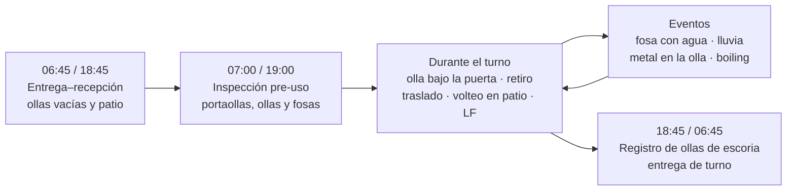
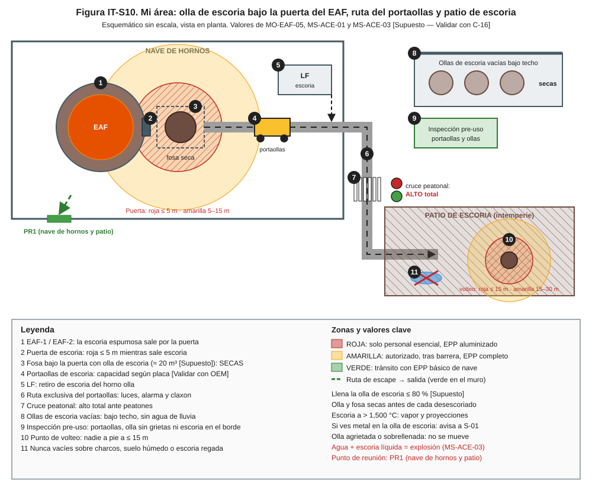
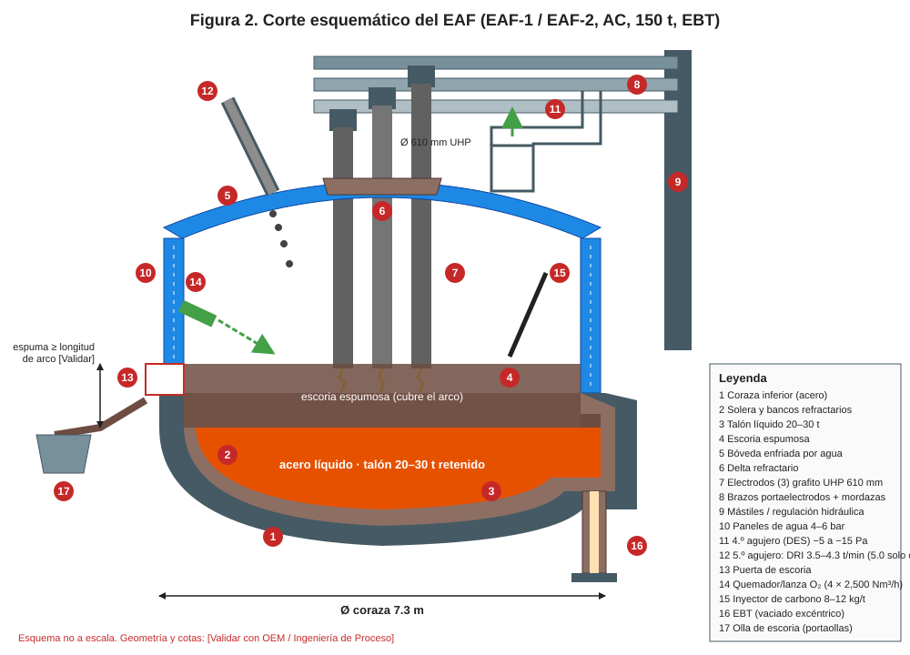
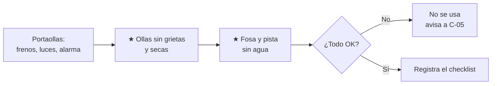
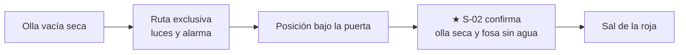
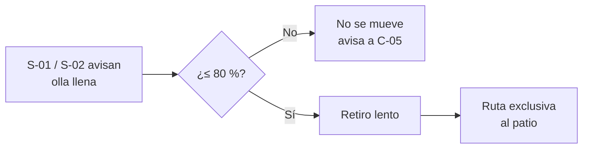
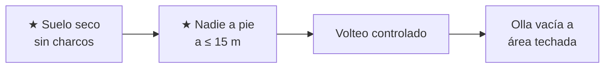

# IT-ACE-S10 — Instrucción de Trabajo: Operador de Manejo de Escoria (portaollas de escoria)

## 1. Encabezado de control

| Campo | Valor |
|---|---|
| Código | IT-ACE-S10 |
| Versión | 0.1 |
| Estado | Borrador para validación |
| Rol | S-10 Operador de Manejo de Escoria (sindicalizado, N-4) |
| Área | Portaollas de escoria de EAF-1, EAF-2 y LF; patio de escoria |
| Turno | 4x4 de 12 h (relevo 07:00 / 19:00) |
| Reporta a | C-05 Supervisor de Hornos |
| Manuales de referencia | MO-EAF-05 · MS-ACE-01, 03, 06, 08, 09 · FT-ACE-001 §2 |
| Elaboró | experto-operativo-metalurgia (con diseño instruccional) |
| Revisión técnica | experto-operativo-metalurgia — visto bueno, 2026-09-25 |
| Revisión de seguridad | Pendiente — experto-seguridad-salud |
| Revisión laboral | Pendiente — experto-relaciones-laborales |
| Aprobó | Pendiente — Director |

> Esta IT **resume** tu parte de MO-EAF-05 y MS-ACE-03. **No reemplaza al manual.** Lo marcado **[Validar con OEM / Ingeniería de Proceso]** o **[Supuesto]** no se usa en planta hasta que C-07 / C-16 lo validen.

## 2. Mi puesto en 30 segundos

Coloco la olla de escoria (pote) bajo la puerta del EAF, la retiro llena y la vacío en el patio de escoria. También retiro la escoria del LF. La escoria sale a **más de 1,500 °C**: si toca **agua**, explota. Si no hay olla lista, el horno no puede desescoriar y se retrasa la colada.

> ★ **Mis 3 reglas de oro**
> 1. **Olla, fosa y suelo secos.** Nunca coloques ni vacíes escoria sobre agua, charcos o suelo húmedo.
> 2. **Olla agrietada, con escoria sobre el borde o sobrellenada: no se mueve.**
> 3. **Ruta exclusiva con luces y alarma; alto total ante peatones.**

## 3. Mi turno de 12 horas

## 4. Mi área de trabajo

Figura de apoyo del manual:

## 5. Mi EPP

| EPP | Cuándo lo uso |
|---|---|
| Cabina del portaollas cerrada | Siempre que opero el portaollas |
| Casco, lentes y protección auditiva | Siempre fuera de la cabina |
| Careta con visor dorado, capucha y chaqueta aluminizadas | Fuera de la cabina cerca de la puerta o de escoria líquida |
| Polainas y guantes aluminizados | Fuera de la cabina cerca de escoria líquida |
| Ropa ignífuga (FR) y botas metatarsales | Siempre |
| Detector personal multigás | Siempre; CO 25 ppm → sal |
| Hidratación | 250 mL cada 15–20 min en calor (MS-ACE-08) |

## 6. Mis tareas paso a paso

### Tarea 1 — Inspección pre-uso: portaollas, ollas de escoria y fosas (MS-ACE-03, pasos 7 y 9)

| Paso | Qué hago | Cómo verifico (medición) | ★ |
|---|---|---|---|
| 1 | Revisa el portaollas: frenos, luces, alarma, claxon, cabina. | Todo funciona; capacidad según placa [Validar con OEM]. | |
| 2 | Revisa cada olla de escoria vacía. | Sin grietas ni deformación; sin escoria en el borde. | ★ |
| 3 | Revisa que las ollas estén secas. | Sin agua de lluvia; si tienen agua, voltéalas y sécalas antes de usar. | ★ |
| 4 | Revisa el foso de escoria bajo la puerta y la pista. | Cero agua estancada; bombas de achique probadas. | ★ |
| 5 | Registra la inspección. | Check-list del turno al 100 %. | |

> 🛑 **ALTO — detén y avisa si…**
> - Hay agua en la fosa, en la pista o en una olla.
> - Una olla tiene grietas o deformación.
> - El portaollas tiene falla de frenos, luces o alarma.

### Tarea 2 — Colocar la olla de escoria bajo la puerta del EAF (MO-EAF-05, paso 6)

| Paso | Qué hago | Cómo verifico (medición) | ★ |
|---|---|---|---|
| 1 | Toma una olla vacía y seca del área techada. | Olla revisada en la Tarea 1. | |
| 2 | Circula por la ruta exclusiva con luces y alarma encendidas. | Alto total ante peatones. | ★ |
| 3 | Coloca la olla en la fosa bajo la puerta. | Olla centrada en su posición. | |
| 4 | Confirma por radio con S-02: "olla seca". | S-02 confirma olla seca y fosa sin agua. | ★ |
| 5 | Retira el portaollas fuera de la zona roja. | Fuera de ≤ 5 m de la puerta. | |

> 🛑 **ALTO — detén y avisa si…**
> - Hay agua o hielo en la olla o en la fosa: **no se desescoria** (MS-ACE-03).
> - Hay escoria saliendo en masa (ebullición): aléjate del frente de la puerta.

### Tarea 3 — Retirar la olla llena y trasladarla (MO-EAF-05, paso 12)

| Paso | Qué hago | Cómo verifico (medición) | ★ |
|---|---|---|---|
| 1 | Espera la señal de S-01 / S-02 de que la olla está llena. | Llenado ≤ 80 % [Supuesto]. | |
| 2 | Revisa el borde antes de mover. | Sin escoria sobre el borde; sin grieta. | ★ |
| 3 | Si ves metal en la olla de escoria, avisa a S-01. | Aviso por canal 2 [Supuesto]. | 🔎 |
| 4 | Retira la olla despacio, sin sacudidas. | Sin derrame. | |
| 5 | Traslada por la ruta exclusiva al patio de escoria. | Luces y alarma encendidas; alto total ante peatones. | ★ |
| 6 | Para el LF, retira la escoria con la misma disciplina. | Olla seca, sin sobrellenado. | |

> 🛑 **ALTO — detén y avisa si…**
> - La olla está sobrellenada o con escoria sobre el borde.
> - Hay peatones en la ruta o en el cruce.

### Tarea 4 — Vaciar la olla en el patio de escoria (MS-ACE-01 y MS-ACE-03)

| Paso | Qué hago | Cómo verifico (medición) | ★ |
|---|---|---|---|
| 1 | Revisa el punto de volteo. | Suelo seco; sin charcos ni escoria regada recientemente. | ★ |
| 2 | Revisa la zona de volteo. | Nadie a pie a ≤ 15 m (roja); 15–30 m amarilla. | ★ |
| 3 | Voltea la olla despacio desde la cabina. | Sin proyecciones. | |
| 4 | Regresa la olla vacía al área techada. | Olla seca y lista. | |
| 5 | Registra la olla (número, estado seco, llenado). | Registro de ollas de escoria. | |

> 🛑 **ALTO — detén y avisa si…**
> - Llueve sobre el punto de volteo o hay agua estancada.
> - Hay vapor o proyecciones fuera de lo normal: aléjate y avisa.
> - Alguien entra a la zona roja.

## 7. Mis controles críticos (★)

- ☐ Ollas de escoria secas, sin grietas ni escoria en el borde.
- ☐ Fosa bajo la puerta y pista sin agua.
- ☐ "Olla seca" confirmada con S-02 antes de cada desescoriado.
- ☐ Llenado ≤ 80 % [Supuesto]; sobrellenada no se mueve.
- ☐ Ruta exclusiva con luces y alarma; alto total ante peatones.
- ☐ Punto de volteo seco y nadie a pie a ≤ 15 m.

## 8. Si algo sale mal

| Síntoma | Qué hago | A quién aviso |
|---|---|---|
| Olla o fosa con agua | 🛑 No se desescoria; cambia la olla. | C-05, S-02 — canal 2 [Supuesto] |
| Ebullición violenta, escoria saliendo en masa | Sal del frente de la puerta; no te acerques. | C-05, C-04 — canal 1 [Supuesto] |
| Metal en la olla de escoria | Avisa. | S-01 — canal 2 |
| Olla agrietada o sobrellenada | No la muevas. | C-05 — canal 2 |
| Explosión o proyección en el patio | Aléjate; zona verde; no uses agua. | C-04, C-16 — canal 1 |
| Derrame de escoria en la ruta | Detén; deja solidificar; no pises escoria "fría". | C-04 — canal 1 |
| Falla del portaollas con olla llena | Detén en lugar seguro; señaliza. | C-05, mantenimiento — ext. 4200 [Supuesto] |

## 9. Registros que lleno

| Registro | Cuándo | Dónde |
|---|---|---|
| Check-list pre-uso del portaollas y ollas | Cada turno | Check-list |
| Registro de ollas de escoria (número, estado seco, llenado) | Cada olla | Registro de ollas de escoria (nivel 2) |
| Eventos: agua en fosa, metal en escoria, proyecciones | Al ocurrir | Bitácora de turno |

## 10. Mi certificación

| Manual | Nivel ILUO | Teoría | OJT | Pasos ★ que me evalúan | Vigencia |
|---|---|---|---|---|---|
| MO-EAF-05 (portaollas) | **U** (3) | 16 h (portaollas, rutas, escoria–agua) | 60 h / 40 ollas | Paso 6 (olla y fosa secas) y rutas | 24 meses (TD-P07) |
| MS-ACE-03 | **U** (3) | 6 h | 20 h | 7, 8, 9 | 24 meses (TD-P07) |

Plan del puesto (DP-ACE-S): ruta técnica 24 h, OJT 180 h (15 turnos), refresco de manejo defensivo y escoria–agua 8 h/año. Licencia interna de equipo móvil pesado. Sin certificaciones de 12 meses en este puesto.

## 11. Glosario rápido

| Término | Qué significa |
|---|---|
| Olla de escoria (pote) | Recipiente de acero que recibe la escoria del horno |
| Portaollas | Vehículo que carga y voltea la olla de escoria |
| Desescoriado | Sacar escoria por la puerta inclinando el horno |
| Escoria espumosa | Escoria con burbujas de CO que cubre el arco |
| Ebullición (boiling) | Reacción violenta que expulsa escoria y metal |
| Volteo | Vaciar la olla de escoria en el patio |
| Escoria "fría" | Costra que puede estar líquida por dentro |

## 12. Control de cambios

| Versión | Fecha | Cambio | Autor |
|---|---|---|---|
| 0.1 | 2026-09-25 | Emisión inicial para validación, desde MO-EAF-05, MS-ACE-01/03 y DP-ACE-S (S-10) | experto-operativo-metalurgia |
