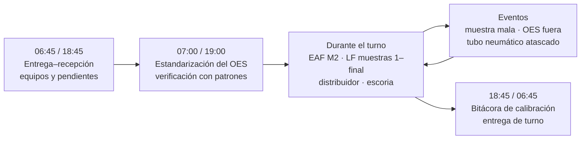
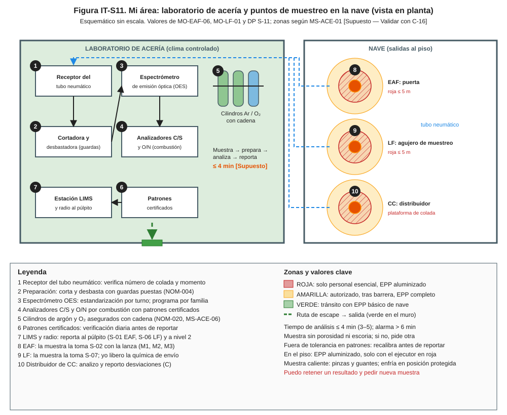
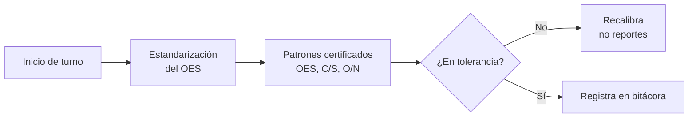
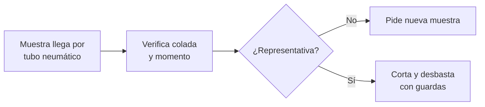
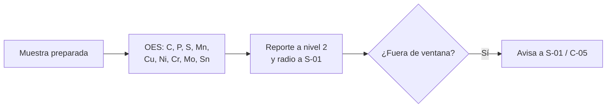
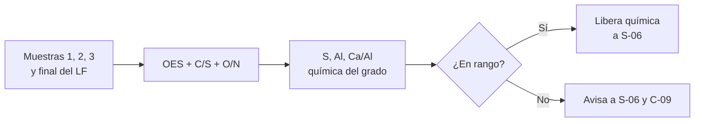
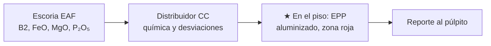

# IT-ACE-S11 — Instrucción de Trabajo: Muestrero / Analista de Laboratorio de Acería

## 1. Encabezado de control

| Campo | Valor |
|---|---|
| Código | IT-ACE-S11 |
| Versión | 0.1 |
| Estado | Borrador para validación |
| Rol | S-11 Muestrero / Analista de Laboratorio de Acería (sindicalizado, N-4) |
| Área | Laboratorio de acería (OES, C/S, O/N) y muestreo neumático |
| Turno | 4x4 de 12 h (relevo 07:00 / 19:00) y administrativo (patrones y calibración) · jornada según el CCT [CCT: pedir texto] |
| Reporta a | C-09 Metalurgista de Producto / Ingeniero de Calidad; en turno, C-04 |
| Manuales de referencia | MO-EAF-06 · MO-LF-01 · MO-EAF-05 (escoria) · MO-CC1-04 / MO-CC2-04 (distribuidor) · MS-ACE-01, 03, 06, 08, 09 · FT-ACE-001 §2, §3 y §7 |
| Elaboró | experto-operativo-metalurgia (con diseño instruccional) |
| Revisión técnica | experto-operativo-metalurgia — visto bueno, 2026-09-25 |
| Revisión de seguridad | experto-seguridad-salud — visto bueno, 2026-09-26 |
| Revisión laboral | experto-relaciones-laborales — visto bueno (con observaciones), 2026-09-26 |
| Aprobó | Pendiente — Director |

> Esta IT **resume** tu parte de MO-EAF-06 y MO-LF-01. **No reemplaza al manual ni al procedimiento de laboratorio** [por referenciar]. Lo marcado **[Validar con OEM / Ingeniería de Proceso]** o **[Supuesto]** no se usa hasta que C-09 / C-07 lo validen.

## 2. Mi puesto en 30 segundos

Analizo las muestras del EAF, del LF y del distribuidor y reporto la química **en ≤ 4 min** [Supuesto]. Con mi resultado, el púlpito decide vaciar, ajustar o liberar la olla. Un resultado equivocado manda acero fuera de grado al cliente; uno tardío detiene la secuencia. Si no confío en un análisis, **lo retengo y pido otra muestra**. Sin funciones de mando (LFT art. 9): si algo no está bien, **aviso, detengo y escalo** a C-09 (en turno, C-04).

> ★ **Mis 3 reglas de oro**
> 1. **Verifica con patrones antes de reportar.** Fuera de tolerancia = recalibra primero.
> 2. **Trazabilidad siempre:** colada, momento y hora en cada muestra y resultado.
> 3. **En el piso, EPP aluminizado y zona de exclusión**; en el laboratorio, guardas puestas y cilindros con cadena.

## 3. Mi turno de 12 horas

> **Mi jornada (nota laboral).** Mi turno está pactado en el CCT [CCT: pedir texto]. El relevo y la entrega–recepción antes de las 07:00 / 19:00 son tiempo de trabajo (LFT art. 58). Se cuentan en la jornada o se pagan según el CCT. La jornada de 12 h y la reforma de 40 h están en revisión (arts. 59–61 y 66–68) — verificar con Jurídico Laboral.

## 4. Mi área de trabajo

Figura de apoyo:

## 5. Mi EPP

| EPP | Cuándo lo uso |
|---|---|
| Lentes de seguridad | Siempre en laboratorio y nave |
| Guantes para muestra caliente y pinzas | Al recibir y preparar muestras |
| Protección auditiva | Cortadora, desbastadora y nave |
| Careta, chaqueta y guantes aluminizados | Al tomar o recoger muestras en el piso (zona roja ≤ 5 m) |
| Ropa ignífuga (FR), casco y botas metatarsales | Siempre que salgo a la nave |
| Detector personal de CO y O₂ | En la nave y cerca de cilindros de argón |

## 6. Mis tareas paso a paso

### Tarea 1 — Verificar los equipos con patrones (DP S-11; MO-EAF-06 §4)

| Paso | Qué hago | Cómo verifico (medición) | ★ |
|---|---|---|---|
| 1 | Estandariza el espectrómetro OES. | Estandarización del turno completa. | 🔎 |
| 2 | Analiza los patrones certificados en OES y en C/S y O/N. | Resultados dentro de la tolerancia del patrón [Validar con OEM]. | 🔎 |
| 3 | Si algo sale fuera de tolerancia, recalibra antes de reportar. | Patrón en tolerancia tras recalibrar. | ★ |
| 4 | Revisa argón del OES y cilindros asegurados con cadena. | Presión suficiente; cadena puesta. | |
| 5 | Registra la verificación. | Bitácora de calibración al 100 %. | |

> 🛑 **ALTO — detén y avisa si…**
> - El equipo no entra en tolerancia después de recalibrar: avisa a C-09 y al púlpito.
> - Un cilindro está suelto o con fuga.

### Tarea 2 — Recibir y preparar la muestra (MO-EAF-06, paso 8)

| Paso | Qué hago | Cómo verifico (medición) | ★ |
|---|---|---|---|
| 1 | Toma la muestra del receptor con pinzas y guantes. | Sin contacto directo con la muestra caliente. | |
| 2 | Verifica número de colada, estación y momento (M1, M2, M3 o muestra del LF). | Etiqueta coincide con nivel 2. | 🔎 |
| 3 | Revisa la paleta. | Sin porosidad ni escoria; si no, pide otra muestra. | 🔎 |
| 4 | Corta y desbasta la superficie con guardas puestas. | Superficie plana y limpia (NOM-004). | |

> 🛑 **ALTO — detén y avisa si…**
> - La muestra no tiene identificación o no coincide con la colada.
> - La desbastadora no tiene guarda.

### Tarea 3 — Analizar y reportar la muestra del EAF (MO-EAF-06, paso 8)

| Paso | Qué hago | Cómo verifico (medición) | ★ |
|---|---|---|---|
| 1 | Analiza con el programa de la familia de acero. | Programa correcto en OES [Validar con OEM]. | 🔎 |
| 2 | Revisa C y P contra la ventana de vaciado. | C 0.04–0.08 %; P ≤ 0.015 %. | 🔎 |
| 3 | Revisa residuales (Cu, Sn, Ni, Cr). | Según el grado (C-09). | 🔎 |
| 4 | Reporta al púlpito y a nivel 2. | Tiempo ≤ 4 min [Supuesto] (3–5 min); alarma > 6 min. | 🔎 |
| 5 | Si P > 0.015 % o hay residuales fuera, avísalo de inmediato. | S-01 y C-05 informados. | |

> 🛑 **ALTO — detén y avisa si…**
> - No puedes dar resultado en 6 min: avisa a S-01; él decide con T y O.
> - El resultado no es confiable: **retén el resultado** y pide nueva muestra.

### Tarea 4 — Analizar el LF y liberar la química de envío (MO-LF-01)

| Paso | Qué hago | Cómo verifico (medición) | ★ |
|---|---|---|---|
| 1 | Analiza cada muestra del LF. | Resultado en ≤ 4 min [Supuesto]. | 🔎 |
| 2 | Revisa el azufre. | S ≤ 0.010 % (CC1 bajo C y HSLA). | 🔎 |
| 3 | Revisa el aluminio soluble. | CC1: 0.020–0.045 %; CC2: ≤ 0.005 % [Validar]. | 🔎 |
| 4 | Si hubo CaSi, revisa la relación Ca/Al. | 0.08–0.14 [Validar con Ingeniería de Proceso]. | 🔎 |
| 5 | Revisa la química completa del grado. | Rango del grado (FT-ACE-001 §7; C-09). | 🔎 |
| 6 | Libera la química de envío de la muestra final a S-06 y nivel 2. | Liberación registrada en LIMS. | ★ |

> 🛑 **ALTO — detén y avisa si…**
> - La química final está fuera del grado: no liberes; avisa a S-06 y C-09.
> - N captado > 15 ppm [Supuesto]: avisa a S-06.

### Tarea 5 — Muestras de escoria y del distribuidor; salidas al piso (MO-EAF-05; MO-CC1-04 / MO-CC2-04; MS-ACE-01)

| Paso | Qué hago | Cómo verifico (medición) | ★ |
|---|---|---|---|
| 1 | Analiza la escoria del EAF y reporta. | B2 1.8–2.2; FeO 25–35 %; MgO 8–10 %. | 🔎 |
| 2 | Analiza la muestra del distribuidor y reporta desviaciones. | Química del grado; avisa a S-12 y C-09. | 🔎 |
| 3 | Si sales al piso, ponte el EPP aluminizado antes de entrar a roja. | Roja ≤ 5 m de la puerta o agujero; solo el ejecutor y su acompañante. | ★ |
| 4 | Mantente ≥ 1.5 m de la puerta y ≤ 2 min en roja. | Tiempo controlado. | ★ |

> 🛑 **ALTO — detén y avisa si…**
> - Tu EPP aluminizado está húmedo, roto o con grasa: no entres a roja.
> - Suena sirena o semáforo rojo de vaciado o arranque: sal a zona verde.

## 7. Mis controles críticos (★)

- ☐ Estandarización y patrones en tolerancia antes de reportar.
- ☐ Muestra identificada: colada, estación, momento.
- ☐ Muestra representativa (sin porosidad ni escoria).
- ☐ Guardas de cortadora y desbastadora colocadas.
- ☐ Cilindros de argón y O₂ con cadena.
- ☐ En el piso: EPP aluminizado seco e íntegro; ≤ 2 min en roja.

## 8. Si algo sale mal

| Síntoma | Qué hago | A quién aviso |
|---|---|---|
| Patrón fuera de tolerancia | Recalibra; retén resultados. | C-09 — ext. 4300 [Supuesto] |
| Muestra con porosidad o escoria | Pide nueva muestra. | S-02 (EAF) / S-07 (LF) — canal 2 / 3 [Supuesto] |
| Sin resultado en > 6 min | Avisa; S-01 decide con T y O. | S-01, C-05 — canal 2 |
| Tubo neumático atascado | Reporta la falla; S-01 / S-06 deciden con T y O. | C-05, mantenimiento — ext. 4200 [Supuesto] |
| Química del LF fuera del grado | No liberes. | S-06, C-09 — canal 3 / ext. 4300 |
| Fuga de gas de laboratorio | Cierra el cilindro si es seguro; ventila; sal. | C-04 — canal 1 [Supuesto] |
| Alarma de emergencia en la nave | Sal a zona verde; reporta en tu punto de reunión. | Líder de sector — canal 1 |

## 9. Registros que lleno

| Registro | Cuándo | Dónde |
|---|---|---|
| Resultados con número de colada, estación y hora | Cada muestra | LIMS / nivel 2 |
| Verificación diaria con patrones y estandarización | Cada turno | Bitácora de calibración |
| Resultados retenidos y muestras repetidas (con causa) | Al ocurrir | LIMS |
| Análisis de escoria | Cada colada que lo pida | LIMS |
| Entrega de turno | 06:45 / 18:45 | Bitácora de turno |

## 10. Mi certificación

| Manual | Nivel ILUO | Teoría | OJT | Pasos ★ que me evalúan | Vigencia |
|---|---|---|---|---|---|
| MO-EAF-06 | **U** (3) | 24 h (OES, preparación, trazabilidad) | 80 h / 100 análisis | Preparación y reporte; muestra no representativa | 24 meses (TD-P07) |
| MO-LF-01 | **U** (3) | 24 h | 80 h / 100 análisis | Preparación y reporte | 24 meses |
| MS-ACE-01 | **U** (3) | 8 h (metal fundido) | 40 h + 20 muestreos | 3, 6, 9, 12 | 24 meses (TD-P07) |

Plan del puesto (DP-ACE-S): ruta técnica 40 h, OJT 300 h (25 turnos), refresco con ensayo de aptitud interlaboratorio 8 h/año. Sin certificaciones de 12 meses en este puesto. Tiempo de análisis homologado con MO-EAF-06 y MO-LF-01: **≤ 4 min** [Supuesto] (rango 3–5 min; alarma > 6 min). La DP-ACE-S de S-11 aún dice ≤ 3 min: se corrige en la DP; la meta final la valida C-09 (experto-operativo-metalurgia, 2026-09-26).

> **Mi evaluación no es una sanción** (nota laboral — verificar con Jurídico Laboral)
> - La evaluación TD-P07 sirve para formarme, certificarme y acreditar mi aptitud. No se usa para sancionarme (DP-ACE-S §4).
> - Si aún no demuestro un paso ★, conservo mi categoría, mi salario y mi antigüedad. Recibo retroalimentación, OJT de refuerzo y otra oportunidad [Supuesto: 2 en ≤ 60 días, a validar con la CMCAP].
> - Si ya sé hacer el trabajo, puedo pedir el **examen de suficiencia** (LFT art. 153-U). Si lo apruebo, recibo mi DC-3 sin cursar toda la ruta.
> - La certificación prueba mi aptitud para ascender. Entre los aptos, asciende el de mayor antigüedad (LFT arts. 154–159 y CCT).
> - Si mi certificación se suspende tras un incidente grave, es una medida de seguridad, no una sanción. Paso a tarea no crítica sin perder salario ni antigüedad y me reevalúan en ≤ 15 días [Supuesto].
> - Mi capacitación y mis recertificaciones son en jornada y sin costo para mí. Si caen en mi descanso, se pagan según el CCT [CCT: pedir texto].

## 11. Glosario rápido

| Término | Qué significa |
|---|---|
| OES | Espectrómetro de emisión óptica: mide la química del acero |
| C/S y O/N | Analizadores por combustión de carbono, azufre, oxígeno y nitrógeno |
| Patrón certificado | Muestra de química conocida para verificar el equipo |
| Estandarización | Ajuste del OES al inicio del turno |
| LIMS | Sistema de información del laboratorio |
| M1, M2, M3 | Momentos de medición en el EAF |
| Muestra representativa | Paleta sin porosidad ni escoria |
| Ca/Al | Relación que indica si el tratamiento con CaSi fue correcto |
| B2 | Basicidad de la escoria: CaO / SiO₂ |

## 12. Control de cambios

| Versión | Fecha | Cambio | Autor |
|---|---|---|---|
| 0.1 | 2026-09-25 | Emisión inicial para validación, desde MO-EAF-06, MO-LF-01, MO-EAF-05, MS-ACE-01 y DP-ACE-S (S-11) | experto-operativo-metalurgia |
