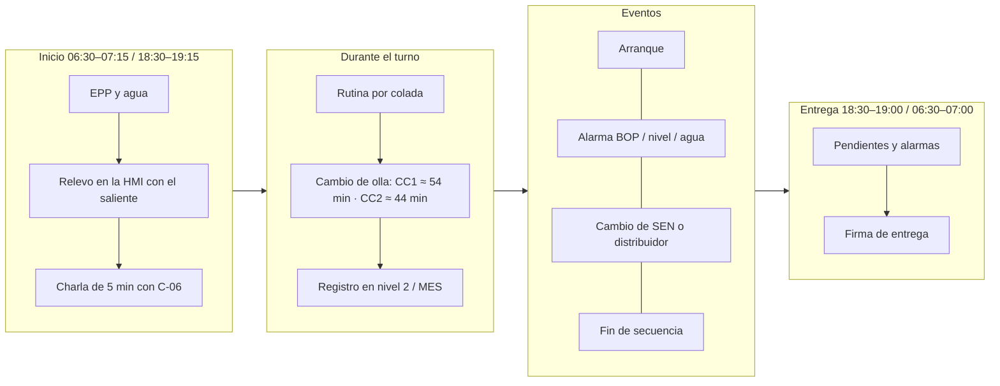
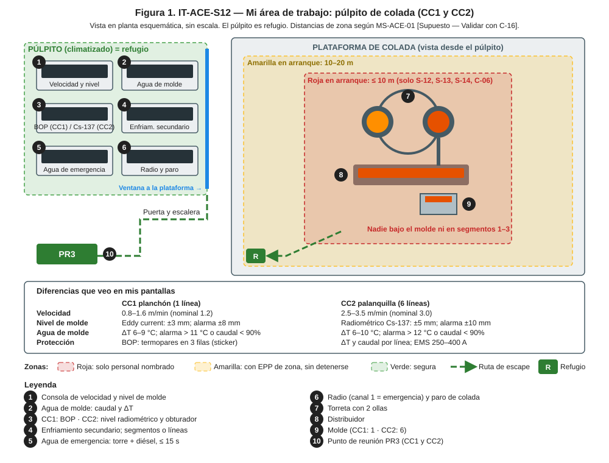
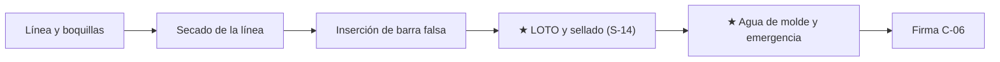
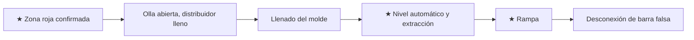
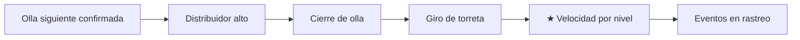
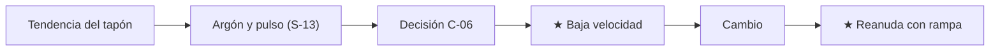
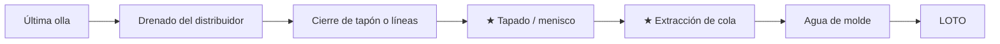

# IT-ACE-S12 — Instrucción de Trabajo: Operador de Púlpito de Colada (CC1 / CC2)

## 1. Encabezado de control
| Campo | Valor |
|---|---|
| Código | IT-ACE-S12 |
| Versión | 0.1 |
| Estado | Borrador para validación |
| Rol | S-12 Operador de Púlpito de Colada (sindicalizado, nivel N-8). Se certifica **por máquina**: CC1 o CC2 |
| Área | Colada Continua: CC1 planchón (1 línea) y CC2 palanquilla (6 líneas) |
| Turno | 4x4 de 12 h; relevo 07:00 / 19:00. Titular (velocidad, molde, BOP) y segundo operador (enfriamiento, líneas, corte) se alternan · jornada según el CCT [CCT: pedir texto] |
| Reporta a | C-06 Supervisor de Colada Continua (técnica: C-08 Ingeniero de Proceso de CC) |
| Manuales de referencia | MO-CC1-02 a -07; MO-CC2-02 a -07; MM-CC-03, MM-CC-04; MS-ACE-01, -02, -03, -06, -07, -08, -09; FT-ACE-001 v0.3 §4–§5 |
| Elaboró | experto-operativo-metalurgia (con criterio de diseño instruccional de C&D) |
| Revisión técnica | experto-operativo-metalurgia — visto bueno, 2026-09-25 |
| Revisión de seguridad | Pendiente — experto-seguridad-salud |
| Revisión laboral | experto-relaciones-laborales — visto bueno (con observaciones), 2026-09-26 |
| Aprobó | Pendiente — Director de C&D |

> Esta IT **no reemplaza** a los manuales. Resume lo que tú haces en el turno. Si hay duda, manda el manual. Los valores son de referencia de FT-ACE-001. Deben validarse con OEM / Ingeniería de Proceso antes de usarse en planta.

## 2. Mi puesto en 30 segundos
Conduces la máquina desde el púlpito: velocidad, nivel de molde, agua de molde, enfriamiento y alarmas. Arrancas, sostienes y cierras la secuencia. Si el molde pierde agua o nivel, tú eres el primero en verlo. Un breakout puede matar: tu reacción en segundos lo evita. Sin funciones de mando (LFT art. 9): si algo no está bien, **avisas, detienes y escalas** a C-06.

> **★ Mis 3 reglas de oro**
> 1. ★ Sin agua de molde normal y sin agua de emergencia lista (≤ 15 s), **no arranco**.
> 2. ★ Nunca anulo una alarma de BOP (CC1) ni de nivel sin C-06.
> 3. ★ Ante breakout, fuga de agua en el molde o rebose: **cierro, detengo, evacúo y aviso**.

## 3. Mi turno de 12 horas

> **Mi jornada (nota laboral).** Mi turno está pactado en el CCT [CCT: pedir texto]. El relevo y la entrega–recepción antes de las 07:00 / 19:00 son tiempo de trabajo (LFT art. 58). Se cuentan en la jornada o se pagan según el CCT. La jornada de 12 h y la reforma de 40 h están en revisión (arts. 59–61 y 66–68) — verificar con Jurídico Laboral.

## 4. Mi área de trabajo

## 5. Mi EPP
| Pictograma | EPP | Cuándo lo uso |
|---|---|---|
| [CASCO] | Casco con barbiquejo | Siempre que salgo del púlpito |
| [LENTES] | Lentes de seguridad | Toda la nave |
| [FR] | Ropa FR o 100% algodón, sin sintéticos | Todo el turno |
| [BOTAS] | Botas metatarsales | Todo el turno |
| [OÍDO] | Protección auditiva | Fuera del púlpito |
| [CARETA] | Careta con visor dorado + chaquetón aluminizado | Si entro a la plataforma en arranque o evento (zona roja) |
| [DOSÍMETRO] | Dosímetro personal (solo POE, CC2) | Todo el turno en CC2 |

## 6. Mis tareas paso a paso

### Tarea 1 — Preparar la máquina y liberar la barra falsa (MO-CC1-02 / MO-CC2-02)

| Paso | Qué hago | Cómo verifico (medición) | ★ |
|---|---|---|---|
| 1 | Prueba las boquillas con nadie en la cámara de rociado | CC1: ≤ 2% tapadas por zona (10 zonas). CC2: ≥ 95% abiertas, esquinas cubiertas | 🔎 |
| 2 | Seca la línea (CC1): corta rociadores, sopla aire 10–15 min | Sin agua en molde ni segmentos 1–3 | ★ |
| 3 | CC1: carga ancho y conicidad del programa | Ancho ± 1 mm; conicidad 1.0–1.2 %/m | 🔎 |
| 4 | Inserta la barra falsa | CC1: 3–5 m/min, a 2 m del molde 0.3 m/min; cabeza a ≈ 650 ± 10 mm. CC2: ≤ 3 m/min, últimos 2 m ≤ 0.5; cabeza a 700 ± 20 mm | |
| 5 | Participa en el LOTO del sellado | Candados puestos; prueba de arranque sin movimiento | ★ |
| 6 | Prueba el agua de molde | CC1: ≥ 95% nominal (4,200 L/min anchas; 450 angostas). CC2: 1,800–2,200 L/min por línea ≥ 5 min | ★ |
| 7 | Verifica agua de emergencia | Torre con nivel; diésel en automático; última prueba ≤ 7 días | ★ |
| 8 | Prueba oscilación, nivel y BOP / EMS | CC1: frecuencia ± 2%, carrera ± 0.5 mm; termopares con lectura. CC2: 200 cpm en vacío, EMS 1 min | |
| 9 | CC2: pide al ESR abrir el obturador al final | HMI marca "molde vacío" sin alarma | ★ |

> **🛑 ALTO — detén y avisa si…**
> - Ves gotas o humedad en el molde o caudal < 90%.
> - La prueba de agua de emergencia está vencida o falló.
> - El sensor de nivel está inestable (sin nivel automático no se arranca).
> - CC2: el nivel no marca "molde vacío" con el obturador abierto.

### Tarea 2 — Arrancar la colada (MO-CC1-03 / MO-CC2-03)

| Paso | Qué hago | Cómo verifico (medición) | ★ |
|---|---|---|---|
| 1 | Confirma la zona de exclusión por radio | Nadie a ≤ 10 m salvo S-12, S-13, S-14 y C-06; nadie bajo la máquina | ★ |
| 2 | Revisa datos de la olla | Peso 145–155 t; química y T de envío del LF | |
| 3 | Confirma oscilación, agua y extracción en espera | Orden verbal de C-06 | |
| 4 | Vigila el llenado | CC1: 40–60 s hasta menisco −60 mm. CC2: 25–40 s por línea | |
| 5 | Pasa a nivel automático y arranca la extracción | CC1: 0.3 m/min; ± 8 mm al 1.er min, ± 3 mm en ≤ 2 min. CC2: a ≈ 150 mm bajo el borde, 0.5 m/min; ± 5 mm en ≤ 60 s | ★ |
| 6 | Aplica la rampa | CC1: ≤ 0.2 m/min por minuto hasta 1.2 m/min. CC2: 1.5 m/min en 60 s, luego ≥ 2.5 m/min en 60 s | ★ |
| 7 | CC2: enciende el EMS y abre las líneas en orden | EMS al pasar 1.5 m/min, 250–400 A; L3-L4 → L2-L5 → L1-L6 en ≤ 3 min | ★ |
| 8 | Vigila la desconexión de la barra falsa | Desconexión sin golpe; barra a estacionamiento | |
| 9 | Registra el arranque | Tiempos, temperaturas, pesos, eventos en MES | |

> **🛑 ALTO — detén y avisa si…**
> - Ves acero bajo el molde (fuga por la cabeza): cierra y nadie se acerca.
> - El molde rebosa o el nivel sube sin control (CC2: 60 mm bajo el borde → cierra la línea).
> - El agua de molde falla y la de emergencia no entra en ≤ 15 s.

### Tarea 3 — Controlar la colada en estado estable (MO-CC1-04 / MO-CC2-04)

| Paso | Qué hago | Cómo verifico (medición) | ★ |
|---|---|---|---|
| 1 | Revisa todo en verde al recibir | Nivel, velocidad, agua, secundario, oscilación, BOP/EMS, emergencia "lista" | ★ |
| 2 | Ajusta la velocidad | CC1: 0.8–1.6 m/min con tabla velocidad–SH–ancho; cambios ≤ 0.1 m/min por minuto. CC2: 2.5–3.5 m/min (nominal 3.0) | 🔎 |
| 3 | Vigila el nivel de molde | CC1: ± 3 mm, alarma ± 8 mm. CC2: ± 5 mm, alarma ± 10 mm | ★ |
| 4 | Vigila el agua de molde | CC1: caudal ≥ 95%, ΔT 6–9 °C, diferencia entre anchas ≤ 1.5 °C. CC2: ≥ 1,800 L/min, ΔT 6–10 °C | ★ |
| 5 | Vigila el enfriamiento secundario | CC1: 1.0–1.2 L/kg (bajo C) o 0.8–0.9 L/kg (HSLA). CC2: 1.5–2.0 L/kg | 🔎 |
| 6 | Vigila temperatura de enderezado | CC1 HSLA: ≥ 900 °C. CC2: ≥ 950 °C, nunca < 900 °C | 🔎 |
| 7 | CC1: vigila la posición del tapón | Estable ± 5%; subida > 10% en 15 min = clogging | |
| 8 | CC2: compara velocidades entre líneas | Diferencia > 0.4 m/min = buza tapada o erosionada | |
| 9 | CC1: atiende la alarma BOP | El sistema baja a 0.3–0.5 m/min; mantén ≥ 30 s; recupera ≤ 0.2 m/min por minuto | ★ |
| 10 | Marca eventos para S-18 | Cambio de olla, alarma de nivel, EMS apagado ("E" en CC2) | 🔎 |

> **🛑 ALTO — detén y avisa si…**
> - Breakout: cierra tapón/línea, detén extracción, mantén agua de molde y secundaria, evacúa a ≥ 20 m.
> - Fuga de agua en el molde (vapor, reventones): cierra y evacúa la plataforma.
> - Pérdida de nivel que no recuperas en 5 min: cierre de colada o de línea.
> - CC2: nunca toques ni mandes tocar el portafuente de Cs-137: llama al ESR.

### Tarea 4 — Cambio de olla en secuencia (MO-CC1-05 / MO-CC2-05)

| Paso | Qué hago | Cómo verifico (medición) | ★ |
|---|---|---|---|
| 1 | Confirma la olla siguiente con S-13 | Llega ≥ 10 min antes; grado, peso y T en HMI | |
| 2 | Vigila el nivel del distribuidor en el cambio | CC1: ≥ 800 mm (mín. 700). CC2: ≥ 600 mm (mín. 500) | ★ |
| 3 | CC1: aplica la tabla nivel–velocidad | 800 mm → 0.9; 700 → 0.6; 600 → 0.4 m/min; 400 → cierra el tapón | ★ |
| 4 | CC2: cierra líneas extremas si baja el nivel | < 450 mm: L1 y L6; < 350 mm: L2 y L5 | ★ |
| 5 | Recupera la velocidad por tabla SH | CC1 SH 20–30 °C; CC2 SH 20–35 °C | |
| 6 | Marca el cambio de colada | Evento en rastreo; zona de transición por línea (CC2) | 🔎 |

> **🛑 ALTO — detén y avisa si…**
> - La olla siguiente no llega o no abre: baja velocidad (CC1 mín. 0.8 m/min) y prepara cierre.
> - Punto rojo o fuga en la olla: evacúa a ≥ 25 m; nunca agua.
> - La torreta no gira: cierre de secuencia.

### Tarea 5 — Cambio de SEN o de distribuidor (MO-CC1-06, solo CC1)

| Paso | Qué hago | Cómo verifico (medición) | ★ |
|---|---|---|---|
| 1 | Detecta clogging | Tapón sube > 10% en 15 min o > 80% de apertura | 🔎 |
| 2 | Baja la velocidad si el tapón pasa 80% | −0.1 m/min por paso; nivel ± 3 mm | |
| 3 | Cambio de SEN: baja a 0.5 m/min | Nivel en manual o modo "cambio de SEN"; sin flujo ≤ 10 s | ★ |
| 4 | Cambio de distribuidor: vacía y detén a 400 mm | 800 → 0.9; 700 → 0.6; 600 → 0.4 m/min; velocidad 0 con oscilación y agua | ★ |
| 5 | Reanuda | 0.3 m/min, nivel automático, rampa ≤ 0.2 m/min por minuto | ★ |
| 6 | Marca el planchón de cambio o de unión | Evento en tracking | 🔎 |

**CC2 (MO-CC2-06):** soy consultado. Fijo la velocidad de la línea antes del cambio de buza y regreso a automático a ± 10 mm. Controlo la línea cerrada (detengo la extracción si hay breakout o atoramiento).

> **🛑 ALTO — detén y avisa si…**
> - Línea detenida > 5 min en el cambio de distribuidor: cierre de secuencia.
> - El distribuidor nuevo tiene vapor o la SEN está fría (< 1,000 °C).
> - Breakout en la unión: respuesta de breakout.

### Tarea 6 — Fin de colada y cierre de secuencia (MO-CC1-07 / MO-CC2-07)

| Paso | Qué hago | Cómo verifico (medición) | ★ |
|---|---|---|---|
| 1 | Drena el distribuidor bajando velocidad | CC1: 800 → 0.9; 700 → 0.6; 600 → 0.4 m/min | |
| 2 | Detén la línea al cerrar el tapón (CC1) | Tapón cerrado a 400 mm; oscilación y agua activas | |
| 3 | CC1: respeta el tapado de cola | 3–5 min detenida; nunca agua sobre acero líquido | ★ |
| 4 | Extrae la cola | CC1: 0.3 m/min hasta ≈ 1 m, luego rampa ≤ 0.2 a ≈ 1.0 m/min. CC2: menisco baja 80–150 mm, cola a 0.5–1.0 m/min | ★ |
| 5 | CC2: apaga oscilación y EMS | Cuando la cola sale del molde y pasa el EMS | |
| 6 | Mantén el agua de molde | CC1: ≥ 10 min tras la cola. CC2: ≥ 15 min | ★ |
| 7 | Registra la secuencia | Coladas, t, causa del cierre, vida de distribuidor y SEN/buzas | |

> **🛑 ALTO — detén y avisa si…**
> - Breakout de cola: detén la línea y evacúa.
> - La cola no se mueve: no uses O₂ en el molde sin autorización.
> - CC2: el obturador no cierra al final: nadie en el molde, aléjate ≥ 3 m.

## 7. Mis controles críticos (★)
- ☐ Agua de molde en caudal y ΔT normales (CC1 ΔT 6–9 °C; CC2 6–10 °C).
- ☐ Agua de emergencia "lista": torre, diésel en automático, prueba ≤ 7 días.
- ☐ Zona de exclusión confirmada por radio antes de arrancar o extraer la cola.
- ☐ Nivel automático calibrado; CC1 termopares BOP con lectura.
- ☐ CC2: obturador de Cs-137 en el estado correcto y registro del ESR firmado.
- ☐ LOTO de oscilación, barra falsa y extractores antes de que alguien meta manos.

## 8. Si algo sale mal
| Síntoma | Qué hago | A quién aviso |
|---|---|---|
| Alarma BOP (sticker) en CC1 | Deja que baje a 0.3–0.5 m/min; mantén ≥ 30 s; recupera en rampa | C-06 por canal de la máquina (CC1: canal 3 [Supuesto]) |
| Breakout | Cierra, detén, mantén agua, evacúa ≥ 20 m | Canal 1 "EMERGENCIA ×3" (MS-ACE-09 [Supuesto]); C-04 y C-06 |
| Caudal < 90% o ΔT alto | CC1: baja a 0.8 m/min. CC2: revisa; < 80% o ΔT > 15 °C cierra la línea | C-06; mantenimiento de turno ext. 4401 [Supuesto] |
| Apagón | Confirma agua de emergencia ≤ 15 s; si no entra, cierra olla y distribuidor | Canal 1; C-04 |
| Falla de oscilación | Enclavamiento; si vuelve en ≤ 60 s C-06 decide reanudar a 0.3 m/min | C-06; S-22 |
| CC2: EMS disparado | Sigue colando; marca "E" desde la hora del disparo | C-06; S-20; C-09 ext. 4302 [Supuesto] |
| CC2: pérdida de nivel radiométrico | Velocidad fija solo si C-06 autoriza; 5 min sin recuperar: cierra la línea | C-06; S-21; ESR (C-16) ext. 4501 [Supuesto] |

## 9. Registros que lleno
| Registro | Cuándo | Dónde |
|---|---|---|
| Hoja de colada (T, SH, velocidad, nivel, agua, polvo/aceite, eventos) | Cada colada | Nivel 2 / MES |
| Lista previa al arranque (21 puntos CC1 / por línea CC2) | Cada preparación | Papel firmado por C-06 + MES |
| Registro de alarmas BOP (hora, fila, acción) — CC1 | Cada alarma | Nivel 2 |
| Eventos en tracking (cambio de olla, SEN, unión, "A", "E", "C") | Al ocurrir | MES / rastreo |
| Hoja de secuencia | Fin de secuencia | MES |
| Entrega de turno | 07:00 / 19:00 | Bitácora del púlpito |

## 10. Mi certificación
| Concepto | Detalle |
|---|---|
| Nivel ILUO requerido | **U** (nivel 3: ejecuta solo y sin error) en su máquina; guía OJT de S-13 |
| Teoría | Ruta técnica 80 h (solidificación, molde, enfriamiento, defectos, BOP; protección radiológica en CC2) + simulador 40 h |
| OJT | ≥ 30 secuencias como titular con S-12 certificado (360 h) |
| Pasos ★ que me evalúan | MO-CC1-02 pasos 3, 8, 16, 17 · MO-CC1-03 pasos 2, 15 · MO-CC1-04 pasos 1, 15 y respuestas del simulador · MO-CC1-07 pasos 11, 12. CC2: MO-CC2-02 pasos 2, 11, 20 · MO-CC2-03 pasos 1, 11, 13, 15 · MO-CC2-04 pasos 2, 3, 4, 13 · MO-CC2-07 pasos 8, 14 |
| Vigencia | **12 meses:** fuentes radiactivas (MS-ACE-07, NOM-012, CC2) y alturas (NOM-009). **24 meses:** demás TD-P07. Refresco anual: simulacro de breakout y apagón (16 h) |

> **Mi evaluación no es una sanción** (nota laboral — verificar con Jurídico Laboral)
> - La evaluación TD-P07 sirve para formarme, certificarme y acreditar mi aptitud. No se usa para sancionarme (DP-ACE-S §4).
> - Si aún no demuestro un paso ★, conservo mi categoría, mi salario y mi antigüedad. Recibo retroalimentación, OJT de refuerzo y otra oportunidad [Supuesto: 2 en ≤ 60 días, a validar con la CMCAP].
> - Si ya sé hacer el trabajo, puedo pedir el **examen de suficiencia** (LFT art. 153-U). Si lo apruebo, recibo mi DC-3 sin cursar toda la ruta.
> - La certificación prueba mi aptitud para ascender. Entre los aptos, asciende el de mayor antigüedad (LFT arts. 154–159 y CCT).
> - Si mi certificación se suspende tras un incidente grave, es una medida de seguridad, no una sanción. Paso a tarea no crítica sin perder salario ni antigüedad y me reevalúan en ≤ 15 días [Supuesto].
> - Mi capacitación y mis recertificaciones son en jornada y sin costo para mí. Si caen en mi descanso, se pagan según el CCT [CCT: pedir texto].

## 11. Glosario rápido
| Término | Qué es |
|---|---|
| Menisco | Superficie del acero líquido en el molde |
| SH (sobrecalentamiento) | Grados arriba del líquidus en el distribuidor |
| BOP | Sistema que predice el breakout con termopares del molde (CC1) |
| Sticker | Cáscara pegada al molde; origen del breakout |
| Breakout | Acero líquido que rompe la cáscara bajo el molde |
| Clogging | Tapado de la SEN por alúmina |
| EMS | Agitador electromagnético del molde (CC2) |
| Obturador | Tapa del haz de la fuente de Cs-137 (CC2); solo la opera el ESR |
| Rampa | Subida gradual de velocidad |
| Agua específica | Litros de agua de rociado por kilo de acero |

## 12. Control de cambios
| Versión | Fecha | Cambio | Elaboró |
|---|---|---|---|
| 0.1 | 2026-09-25 | Emisión inicial desde DP-ACE-S v0.2, MO-CC1/CC2 y FT-ACE-001 v0.3. Figura nueva `it-S12-puesto.svg` | experto-operativo-metalurgia |
