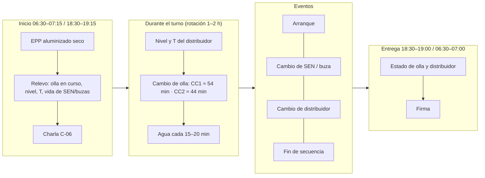
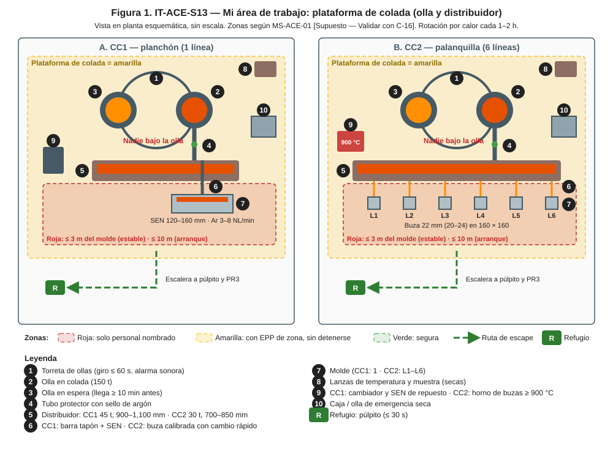
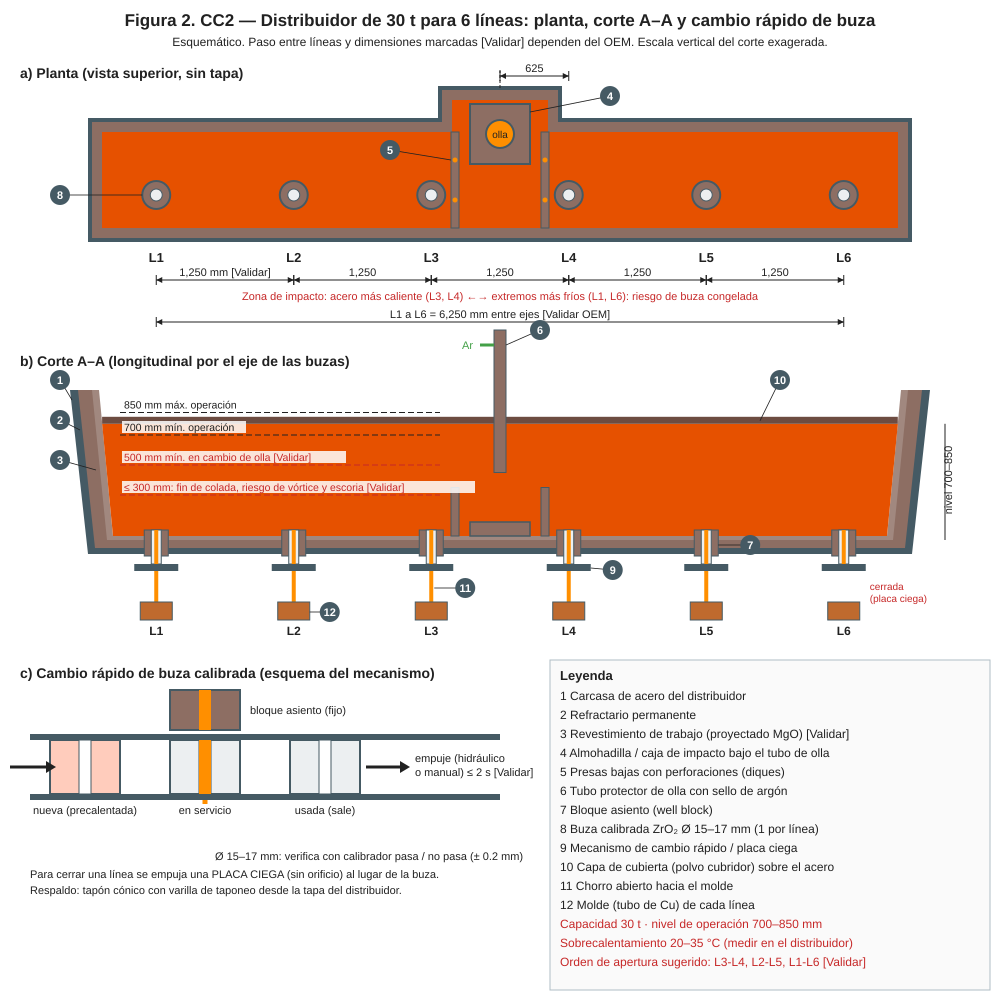
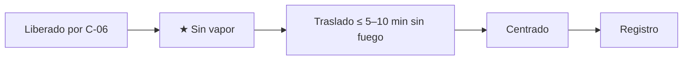
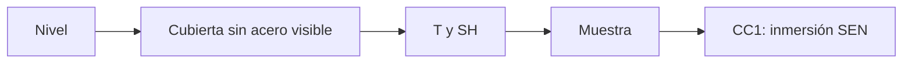
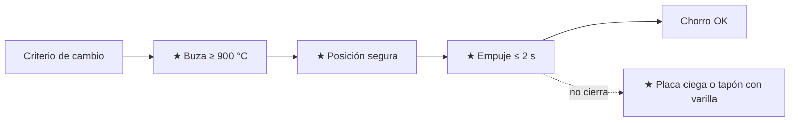
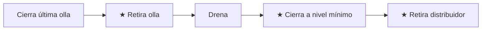
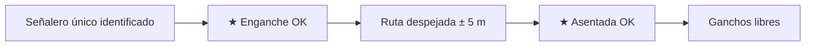

# IT-ACE-S13 — Instrucción de Trabajo: Operador de Plataforma de Colada (olla y distribuidor)

## 1. Encabezado de control
| Campo | Valor |
|---|---|
| Código | IT-ACE-S13 |
| Versión | 0.1 |
| Estado | Borrador para validación |
| Rol | S-13 Operador de Plataforma de Colada (sindicalizado, nivel N-6). Se certifica por máquina: CC1 y/o CC2 |
| Área | Plataforma de colada de CC1 (torreta, distribuidor 45 t, SEN) o de CC2 (torreta, distribuidor 30 t, buzas calibradas) |
| Turno | 4x4 de 12 h; relevo 07:00 / 19:00; rotación por calor cada 1–2 h [Supuesto, DP-ACE-S §2] · jornada según el CCT [CCT: pedir texto] |
| Reporta a | C-06 Supervisor de Colada Continua. Recibe la secuencia técnica del S-12, sin relación de mando (LFT art. 9) |
| Manuales de referencia | MO-CC1-01, -03 a -07; MO-CC2-01, -03 a -07; MO-OLL-02; MS-ACE-01, -03, -04, -07, -08, -09, -10; FT-ACE-001 v0.3 §4–§5 |
| Elaboró | experto-operativo-metalurgia (con criterio de diseño instruccional de C&D) |
| Revisión técnica | experto-operativo-metalurgia — visto bueno, 2026-09-25 |
| Revisión de seguridad | experto-seguridad-salud — visto bueno, 2026-09-26 |
| Revisión laboral | experto-relaciones-laborales — visto bueno (con observaciones), 2026-09-26 |
| Aprobó | Pendiente — Director de C&D |

> Esta IT **no reemplaza** a los manuales. Si hay duda, manda el manual. Valores de referencia de FT-ACE-001: validar con OEM / Ingeniería de Proceso antes de usarlos en planta.

## 2. Mi puesto en 30 segundos
Mantienes el acero fluyendo de la olla al molde. Abres y cambias ollas, cuidas el nivel y la temperatura del distribuidor y cambias SEN o buzas en caliente. Trabajas en la zona de más calor y metal líquido de la colada. Tu disciplina evita derrames, escoria en el molde y quemaduras. Sin funciones de mando (LFT art. 9): si algo no está bien, **avisas, detienes y escalas** a C-06.

> **★ Mis 3 reglas de oro**
> 1. ★ Nadie bajo la olla ni en el giro de la torreta; soy el **señalero único** de la grúa en la plataforma.
> 2. ★ Todo lo que toca el acero va **seco y precalentado**: lanzas, herramientas, SEN, buzas.
> 3. ★ Nunca dejo el distribuidor bajo su mínimo: CC1 400 mm (cierre) · CC2 250 mm (L3-L4).

## 3. Mi turno de 12 horas

> **Mi jornada (nota laboral).** Mi turno está pactado en el CCT [CCT: pedir texto]. El relevo y la entrega–recepción antes de las 07:00 / 19:00 son tiempo de trabajo (LFT art. 58). Se cuentan en la jornada o se pagan según el CCT. La jornada de 12 h y la reforma de 40 h están en revisión (arts. 59–61 y 66–68) — verificar con Jurídico Laboral.

## 4. Mi área de trabajo

## 5. Mi EPP
| Pictograma | EPP | Cuándo lo uso |
|---|---|---|
| [CASCO] | Casco con barbiquejo + careta de visor dorado | Siempre en la plataforma |
| [CAPUCHA] | Capucha aluminizada | Apertura de olla, lanceo, medición, cambios en caliente |
| [ALUMINIZADO] | Chaquetón, guantes y polainas aluminizados | Zona roja (≤ 3 m del molde; arranque ≤ 10 m) |
| [FR] | Ropa FR o 100% algodón | Todo el turno |
| [BOTAS] | Botas metatarsales de liberación rápida | Todo el turno |
| [CO/O₂] | Detector personal CO/O₂ | En la torreta |
| [OÍDO] | Protección auditiva | Toda la nave |
| [DOSÍMETRO] | Dosímetro personal (POE) | CC2, junto a los moldes |

## 6. Mis tareas paso a paso

### Tarea 1 — Recibir y centrar el distribuidor (MO-CC1-01 / MO-CC2-01)

| Paso | Qué hago | Cómo verifico (medición) | ★ |
|---|---|---|---|
| 1 | Revisa la liberación de C-06 | Hoja firmada; CC1 cara 1,100 ± 50 °C y SEN ≥ 1,000 °C · CC2 buzas ≥ 900 °C | |
| 2 | Verifica humedad | Cero vapor; sellos y SEN/buzas secos | ★ |
| 3 | Verifica el carro | CC2: tara de celdas ± 0.2 t, sin alarmas | |
| 4 | Traslada a posición | Tiempo sin fuego: CC1 ≤ 10 min · CC2 ≤ 5 min (> 10 min: recalienta 15 min) | 🔎 |
| 5 | Centra | CC1: SEN ± 5 mm en el molde · CC2: chorro ± 3 mm del centro de cada molde | ★ |
| 6 | Registra | Hora, T final, número de distribuidor | |

> **🛑 ALTO — detén y avisa si…**
> - Ves vapor o humedad, o la SEN/buza llegó fría.
> - El carro no centra (> ± 3 mm en CC2).
> - No hay firma de liberación.

### Tarea 2 — Abrir la olla y llenar el distribuidor en el arranque (MO-CC1-03 / MO-CC2-03)

| Paso | Qué hago | Cómo verifico (medición) | ★ |
|---|---|---|---|
| 1 | Ayuda a C-06 a cerrar la zona | Nadie a ≤ 10 m salvo S-12, S-13, S-14, C-06; sirena ≥ 30 s | ★ |
| 2 | Recibe la olla y gira la torreta | Nadie bajo la olla; alarma de giro | ★ |
| 3 | Coloca el tubo protector | Junta nueva y seca; argón de sello abierto | |
| 4 | Abre la olla al 100% | Si no abre libre: lancea de costado. CC1: máx. 2 intentos en ≤ 5 min · CC2: si en 3 min no abre, regresa la olla | ★ |
| 5 | Llena el distribuidor y cubre | CC1: ≥ 500 mm (≈ 18 t) en 2–4 min, flux 50–100 mm · CC2: ≥ 400 mm | |
| 6 | Mide la temperatura a los 3–5 min | CC1 1.ª colada: líquidus + 25 a + 35 °C · CC2 1.ª colada: SH 25–40 °C | 🔎 |
| 7 | CC1: abre el tapón con orden de C-06 | Llenado del molde en 40–60 s | ★ |
| 8 | CC2: abre líneas empujando la buza | L3-L4, luego L2-L5, luego L1-L6; 15–30 s entre líneas; chorro centrado | ★ |
| 9 | Sube el distribuidor a operación | CC1 1,000 mm (900–1,100) · CC2 700–850 mm | |

> **🛑 ALTO — detén y avisa si…**
> - Hay alguien en la zona roja.
> - Acero bajo el molde: cierra tapón o línea y aléjate.
> - CC1: < 400 mm en el distribuidor: no abras el tapón.

### Tarea 3 — Controlar el distribuidor en colada estable (MO-CC1-04 / MO-CC2-04)

| Paso | Qué hago | Cómo verifico (medición) | ★ |
|---|---|---|---|
| 1 | Mantén el nivel con la válvula de la olla | CC1 900–1,100 mm (> 1,250 cierra olla) · CC2 700–850 mm (< 600 alarma) | 🔎 |
| 2 | Mantén la cubierta | Sin "ojos" de acero visible | |
| 3 | Mide la temperatura | CC1: 5 min, mitad y 10 min antes del final; SH 20–30 °C · CC2: cada 15 min y a la mitad; SH 20–35 °C | 🔎 |
| 4 | Avisa SH fuera de rango | A S-12 y C-06 de inmediato | |
| 5 | Toma la muestra con S-11 | A mitad de colada (CC1); 1 por colada (CC2) | |
| 6 | CC1: sube argón si hay clogging | Pasos de 1 NL/min cada 5 min; máx. 8 NL/min | |
| 7 | CC1: varía la inmersión de la SEN | Cada 2 h ± 10 mm dentro de 120–160 mm | |

> **🛑 ALTO — detén y avisa si…**
> - Breakout, fuga de agua en el molde o rebose: aléjate de la plataforma.
> - CC2: nivel < 450 mm: cierra L1 y L6.

### Tarea 4 — Cambio de olla en secuencia (MO-CC1-05 / MO-CC2-05)

| Paso | Qué hago | Cómo verifico (medición) | ★ |
|---|---|---|---|
| 1 | Da señales a S-09 y confirma asiento | Nadie bajo la carga; "asentada OK" | ★ |
| 2 | Revisa la olla nueva | Válvula conectada; CC2: coraza sin puntos rojos | 🔎 |
| 3 | Sube el distribuidor antes del cierre | CC1 1,050–1,150 mm · CC2 820–870 mm | |
| 4 | Cierra la olla vieja | Al primer signo de escoria o residual CC1 ≤ 4 t · CC2 2–4 t | ★ |
| 5 | Retira el tubo y gira la torreta | Alarma; área despejada; giro ≤ 60 s | ★ |
| 6 | Tubo con junta nueva; abre la olla nueva | Cierre → apertura ≤ 2 min (máx. 3); si no abre, lancea | ★ |
| 7 | Vigila el mínimo | CC1 ≥ 700 mm (tabla de velocidad con S-12) · CC2 ≥ 500 mm | ★ |
| 8 | Mide T a los 5 min y registra | SH en rango; residual, tiempos, nivel mínimo | 🔎 |

> **🛑 ALTO — detén y avisa si…**
> - Punto rojo o fuga en la olla: evacúa a ≥ 25 m; olla a posición de emergencia sobre el pote seco; nunca agua.
> - Escoria en el distribuidor: cierra la olla y avisa.
> - La torreta no gira.

### Tarea 5 — Cambio de SEN o de distribuidor en caliente (MO-CC1-06, solo CC1)

| Paso | Qué hago | Cómo verifico (medición) | ★ |
|---|---|---|---|
| 1 | Revisa la SEN nueva | ≥ 1,000 °C; sin grietas; puertos libres | ★ |
| 2 | Pide zona despejada a C-06 | Solo S-13 y S-14 al frente; nadie bajo el molde | ★ |
| 3 | Cambia la SEN | Tapón cerrado, acciona el cambiador; sin flujo ≤ 10 s | ★ |
| 4 | Abre el tapón progresivo | Nivel a 0 mm; ± 3 mm en ≤ 60 s | |
| 5 | Cambio de distribuidor: cierra el tapón a 400 mm | Línea detenida; retira el viejo sin derrame | ★ |
| 6 | Coloca y centra el nuevo | SEN ± 5 mm; inmersión 120–160 mm; olla a 500 mm | |
| 7 | Abre el tapón sin rebose | Nivel a −60 mm | ★ |

> **🛑 ALTO — detén y avisa si…**
> - El cambiador no acciona: tapón cerrado máx. 15 s y reabre con la SEN vieja.
> - Detención > 5 min: cierre de secuencia.

### Tarea 6 — Cambio rápido de buza y cierre de línea (MO-CC2-06, solo CC2)

| Paso | Qué hago | Cómo verifico (medición) | ★ |
|---|---|---|---|
| 1 | Confirma el criterio | Velocidad < 2.3 o > 3.5 m/min; ± 0.4 contra el promedio; > 12 h | |
| 2 | Pide autorización por radio | "Cambio de buza línea X" a C-06 y S-12 | |
| 3 | Coloca la buza con S-14 | ≥ 900 °C; en ≤ 30 s desde el horno | ★ |
| 4 | Ponte del lado contrario a la expulsión | Nadie en la línea de expulsión | ★ |
| 5 | Empuja en un solo movimiento | Cambio ≤ 2 s; nivel ± 5 mm en ≤ 30 s | ★ |
| 6 | Cierre de línea: empuja la placa ciega | Chorro cortado en ≤ 10 s | ★ |
| 7 | Si no cierra: tapón cónico con varilla | Presión firme 30–60 s hasta congelar | ★ |
| 8 | Compensa y registra | Distribuidor 700–850 mm; línea, hora, Ø, causa | |

> **🛑 ALTO — detén y avisa si…**
> - El mecanismo se atora a medio camino: tapona desde arriba; no fuerces con las manos.
> - Taponamientos en varias líneas: avisa a C-06 (química del LF).

### Tarea 7 — Fin de colada y cierre de secuencia (MO-CC1-07 / MO-CC2-07)

| Paso | Qué hago | Cómo verifico (medición) | ★ |
|---|---|---|---|
| 1 | Cierra la última olla | Escoria o residual CC1 ≤ 4 t · CC2 2–4 t | ★ |
| 2 | Retira la olla con S-09 | Nadie bajo la carga | ★ |
| 3 | Mide la T final (CC1) | A ≈ 600 mm; SH ≥ 15 °C | 🔎 |
| 4 | CC1: cierra el tapón | A **400 mm**, no menos | ★ |
| 5 | CC2: cierra por pares | L1-L6 a 450 mm; L2-L5 a 350 mm; L3-L4 a 300 mm (nunca < 250) | ★ |
| 6 | Retira el distribuidor | Residual a caja de escoria **seca**; nadie en la zona | ★ |

> **🛑 ALTO — detén y avisa si…**
> - Escoria antes de cerrar las líneas centrales: cierra todas.
> - El tapón no cierra completo: cierre de emergencia del distribuidor.

### Tarea 8 — Señales a la grúa de colada (MO-OLL-02)

| Paso | Qué hago | Cómo verifico (medición) | ★ |
|---|---|---|---|
| 1 | Identifícate como señalero único | Chaleco o brazalete; radio de izaje (canal 5 [Supuesto]) | |
| 2 | Confirma el enganche de ambos muñones | "Enganche OK" desde posición segura | ★ |
| 3 | Guía la aproximación a la torreta | Marcha lenta; nadie bajo la ruta ± 5 m | |
| 4 | Confirma el asiento completo | "Asentada OK" antes de desenganchar | ★ |

> **🛑 ALTO:** cualquier persona bajo la carga o un gancho sin asentar = señal de PARO.

## 7. Mis controles críticos (★)
- ☐ EPP aluminizado seco e íntegro; careta con visor dorado.
- ☐ Lanzas, herramientas, SEN, buzas y juntas secas y precalentadas.
- ☐ Caja / olla de emergencia seca y en posición.
- ☐ Nadie bajo la olla; giro de torreta con alarma.
- ☐ Distribuidor sobre su mínimo (tabla del turno a la vista).
- ☐ CC2: no entro al haz de Cs-137; obturador lo opera solo el ESR.

## 8. Si algo sale mal
| Síntoma | Qué hago | A quién aviso |
|---|---|---|
| Olla no abre libre | Lancea con procedimiento; si falla, aborta o regresa la olla | C-06 (CC1 canal 3 / CC2 canal 4 [Supuesto]); S-08 |
| Punto rojo o perforación de olla | Evacúa ≥ 25 m; olla sobre pote seco | Canal 1 "EMERGENCIA ×3"; C-04 |
| Breakout | Aléjate de la plataforma de molde; evacúa bajo la máquina ≥ 20 m | Canal 1; C-06 |
| Tubo protector roto | Cámbialo; chorro libre solo con C-06 | C-06 |
| SH fuera de rango | Avisa; S-12 ajusta velocidad | S-12; C-06 |
| Síntomas de calor | Sal de la zona, agua, aviso | C-06; servicio médico ext. 4600 [Supuesto] |

## 9. Registros que lleno
| Registro | Cuándo | Dónde |
|---|---|---|
| Hoja de colada: T, residual, tiempos de cambio, nivel mínimo | Cada colada | Nivel 2 / MES |
| Registro de lanceo | Cada olla lanceada | MES |
| Registro de cambio de SEN (CC1) / de buzas por línea (CC2) | Cada cambio | MES |
| Reporte de cierre de línea (CC2) | Cada cierre | MES + papel a C-06 |

## 10. Mi certificación
| Concepto | Detalle |
|---|---|
| Nivel ILUO requerido | **U** (nivel 3) en su máquina; guía técnica a S-14 |
| Teoría | Ruta técnica 48 h (torreta, distribuidor, refractarios de flujo, cambios en caliente, emergencias) |
| OJT | ≥ 25 secuencias (300 h): CC1 20 cambios de olla, 6 de SEN, 4 de distribuidor · CC2 20 cambios de olla, 15 de buza, 3 cierres |
| Pasos ★ que me evalúan | MO-CC1-01 paso 13; -03 pasos 2, 9, 13; -05 pasos 2, 8, 11, 15; -06 B1, B2, B6, C1, C3, C5, C11, C13; -07 pasos 3, 6 · MO-CC2-01 paso 16; -03 pasos 2, 4, 6, 10, 15; -05 pasos 6, 8, 9, 11, 12; -06 pasos 5, 6, 7, 13, 14, 15; -07 pasos 3–6, 12 · MO-OLL-02 pasos 6, 10 |
| Vigencia | **12 meses:** alturas (NOM-009), grúas/izaje y señalero (MS-ACE-04, MO-OLL-02), fuentes radiactivas (MS-ACE-07, CC2). **24 meses:** demás TD-P07 |

> **Mi evaluación no es una sanción** (nota laboral — verificar con Jurídico Laboral)
> - La evaluación TD-P07 sirve para formarme, certificarme y acreditar mi aptitud. No se usa para sancionarme (DP-ACE-S §4).
> - Si aún no demuestro un paso ★, conservo mi categoría, mi salario y mi antigüedad. Recibo retroalimentación, OJT de refuerzo y otra oportunidad [Supuesto: 2 en ≤ 60 días, a validar con la CMCAP].
> - Si ya sé hacer el trabajo, puedo pedir el **examen de suficiencia** (LFT art. 153-U). Si lo apruebo, recibo mi DC-3 sin cursar toda la ruta.
> - La certificación prueba mi aptitud para ascender. Entre los aptos, asciende el de mayor antigüedad (LFT arts. 154–159 y CCT).
> - Si mi certificación se suspende tras un incidente grave, es una medida de seguridad, no una sanción. Paso a tarea no crítica sin perder salario ni antigüedad y me reevalúan en ≤ 15 días [Supuesto].
> - Mi capacitación y mis recertificaciones son en jornada y sin costo para mí. Si caen en mi descanso, se pagan según el CCT [CCT: pedir texto].

## 11. Glosario rápido
| Término | Qué es |
|---|---|
| Torreta | Soporte giratorio de 2 ollas |
| Tubo protector | Tubo entre olla y distribuidor que evita la reoxidación |
| SEN | Buza sumergida que lleva el acero al molde (CC1) |
| Buza calibrada | Buza de ZrO₂ que fija el caudal de cada línea (CC2) |
| Placa ciega | Placa que corta el chorro de una línea (CC2) |
| Lanceo | Abrir la olla con lanza de O₂ |
| Residual | Acero que queda en la olla al cerrarla |
| Vórtice | Remolino que arrastra escoria con nivel bajo |
| Pote de emergencia | Recipiente seco para acero en una emergencia |

## 12. Control de cambios
| Versión | Fecha | Cambio | Elaboró |
|---|---|---|---|
| 0.1 | 2026-09-25 | Emisión inicial desde DP-ACE-S v0.2, MO-CC1/CC2, MO-OLL-02 y FT-ACE-001 v0.3. Diámetro de buza CC2 tomado de FT-ACE-001 v0.3 (160 × 160: 20–24 mm; la DP cita 15–17 mm, que es solo para 130 × 130). Figura nueva `it-S13-puesto.svg` | experto-operativo-metalurgia |
