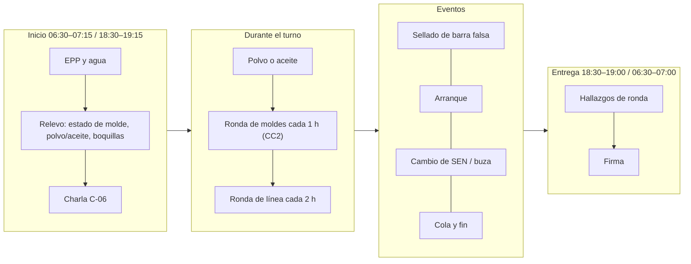
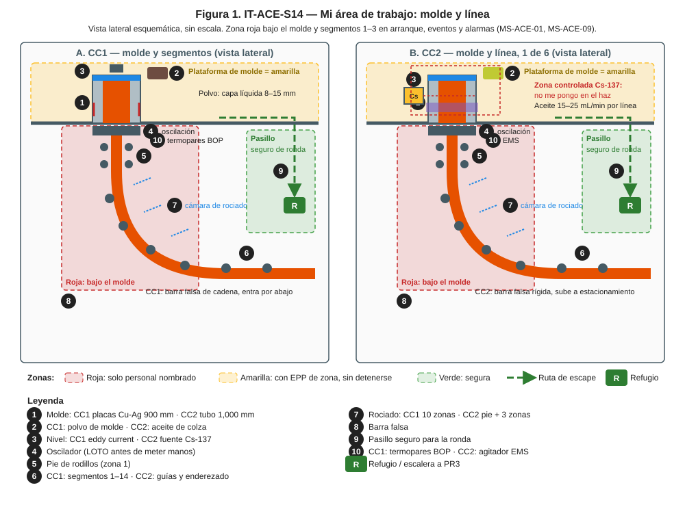
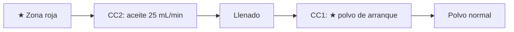
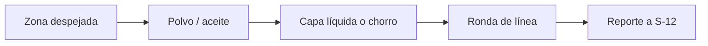
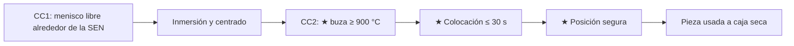
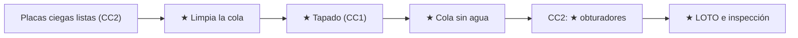

# IT-ACE-S14 — Instrucción de Trabajo: Ayudante de Colada (molde y línea)

## 1. Encabezado de control
| Campo | Valor |
|---|---|
| Código | IT-ACE-S14 |
| Versión | 0.1 |
| Estado | Borrador para validación |
| Rol | S-14 Ayudante de Colada (sindicalizado, nivel N-4). Se certifica por máquina: CC1 y/o CC2 |
| Área | Molde, línea, segmentos (CC1) o guías (CC2) y cámara de rociado |
| Turno | 4x4 de 12 h; relevo 07:00 / 19:00; rotación por calor cada 1–2 h [Supuesto] · jornada según el CCT [CCT: pedir texto] |
| Reporta a | C-06 Supervisor de Colada Continua. Recibe guía técnica de S-12 y S-13, sin relación de mando (LFT art. 9) |
| Manuales de referencia | MO-CC1-02, -03, -04, -06, -07; MO-CC2-02, -03, -04, -06, -07; MS-ACE-01, -02, -03, -07, -09, -10; FT-ACE-001 v0.3 §4–§5 |
| Elaboró | experto-operativo-metalurgia (con criterio de diseño instruccional de C&D) |
| Revisión técnica | experto-operativo-metalurgia — visto bueno, 2026-09-25 |
| Revisión de seguridad | experto-seguridad-salud — visto bueno, 2026-09-26 |
| Revisión laboral | experto-relaciones-laborales — visto bueno (con observaciones), 2026-09-26 |
| Aprobó | Pendiente — Director de C&D |

> Esta IT **no reemplaza** a los manuales. Valores de referencia de FT-ACE-001: validar con OEM / Ingeniería de Proceso antes de usarlos en planta.

## 2. Mi puesto en 30 segundos
Cuidas el molde y la línea. Sellas la barra falsa, alimentas polvo (CC1) o vigilas el aceite (CC2) y haces la ronda de rociado. Un molde húmedo o una cabeza mal sellada provocan explosiones o fugas al arrancar. Tus ojos en el molde avisan antes que cualquier alarma. Sin funciones de mando (LFT art. 9): si algo no está bien, **avisas, detienes y escalas** a C-06.

> **★ Mis 3 reglas de oro**
> 1. ★ Molde, cabeza y chatarra **secos, limpios y sin aceite** antes de arrancar.
> 2. ★ Manos o herramientas en el molde **solo con mi candado** (LOTO) y, en CC2, con el obturador de Cs-137 cerrado por el ESR.
> 3. ★ Con alarma de breakout **salgo** de bajo el molde y de la línea, sin esperar.

## 3. Mi turno de 12 horas

> **Mi jornada (nota laboral).** Mi turno está pactado en el CCT [CCT: pedir texto]. El relevo y la entrega–recepción antes de las 07:00 / 19:00 son tiempo de trabajo (LFT art. 58). Se cuentan en la jornada o se pagan según el CCT. La jornada de 12 h y la reforma de 40 h están en revisión (arts. 59–61 y 66–68) — verificar con Jurídico Laboral.

## 4. Mi área de trabajo

## 5. Mi EPP
| Pictograma | EPP | Cuándo lo uso |
|---|---|---|
| [CASCO] | Casco con barbiquejo + careta de visor dorado | Plataforma de molde |
| [ALUMINIZADO] | Chaquetón, guantes y polainas aluminizados | Junto al molde con acero (≤ 3 m) y en arranque |
| [FR] | Ropa FR o 100% algodón | Todo el turno |
| [BOTAS] | Botas metatarsales | Todo el turno |
| [RESPIRADOR] | Respirador P100 | Al manipular fibra cerámica |
| [ARNÉS] | Arnés y línea de vida | Fuera de barandales (NOM-009) |
| [OÍDO] | Protección auditiva | Toda la nave |
| [DOSÍMETRO] | Dosímetro personal (POE) | CC2, todo el turno |

## 6. Mis tareas paso a paso

### Tarea 1 — Insertar y sellar la barra falsa (MO-CC1-02 / MO-CC2-02)

| Paso | Qué hago | Cómo verifico (medición) | ★ |
|---|---|---|---|
| 1 | CC1: seca la línea | Aire 10–15 min; sin agua en molde ni segmentos 1–3 | ★ |
| 2 | Revisa fugas con agua a caudal pleno | 5 min con lámpara: cero gotas o humedad | ★ |
| 3 | CC2: pide al ESR cerrar el obturador | Lectura < 2 × fondo, firmada en el permiso | ★ |
| 4 | Aplica tu LOTO | CC1: barra falsa, segmentos, oscilación, ajuste de ancho · CC2: oscilador y extractores de la línea; prueba sin movimiento | ★ |
| 5 | Confirma la posición de la cabeza | CC1: ≈ 650 ± 10 mm bajo el borde · CC2: 700 ± 20 mm | ★ |
| 6 | Sella las holguras con fibra cerámica | CC1: holgura 2–5 mm, sin pasos · CC2: 2–4 mm por lado, uniforme | ★ |
| 7 | Coloca la chatarra de enfriamiento | CC1: 15–25 kg, capa 50–80 mm · CC2: 1.5–3 kg, capa 30–50 mm; seca y sin aceite | ★ |
| 8 | CC2: tapa el molde y ceba el aceite | Salida uniforme por todas las ranuras | |
| 9 | Cuenta personas y herramientas; retira tu candado | Nadie en moldes ni fosa | ★ |

> **🛑 ALTO — detén y avisa si…**
> - Hay una gota de agua en el molde: no se libera.
> - La chatarra está mojada, oxidada o con aceite.
> - CC2: el obturador no cierra o la dosis es ≥ 2 × fondo: aléjate ≥ 3 m.

### Tarea 2 — Apoyar el arranque (MO-CC1-03 / MO-CC2-03)

| Paso | Qué hago | Cómo verifico (medición) | ★ |
|---|---|---|---|
| 1 | Colócate en tu puesto de arranque | Solo S-12, S-13, S-14 y C-06 a ≤ 10 m; nadie bajo la máquina | ★ |
| 2 | CC2: arranca el aceite antes de abrir la línea | 25 mL/min; flujo en todas las ranuras | |
| 3 | CC2: apoya la apertura de la línea | Chorro centrado y compacto | ★ |
| 4 | Vigila el llenado | CC1 40–60 s · CC2 25–40 s | |
| 5 | CC1: agrega polvo de arranque | Cuando el acero cubre los puertos (≈ 50 mm arriba); menisco cubierto | ★ |
| 6 | CC1: cambia a polvo normal | Capa líquida 8–15 mm | 🔎 |

> **🛑 ALTO — detén y avisa si…**
> - Ves acero bajo el molde: aléjate y avisa.
> - CC2: no hay aceite: no se abre la línea.

### Tarea 3 — Cuidar el molde y la línea en colada estable (MO-CC1-04 / MO-CC2-04)

| Paso | Qué hago | Cómo verifico (medición) | ★ |
|---|---|---|---|
| 1 | Verifica la zona al inicio y tras cada evento | Nadie bajo el molde | ★ |
| 2 | CC1: agrega polvo "poco y seguido" | Superficie negra, sin zonas rojas; consumo 0.3–0.5 kg/t | |
| 3 | CC1: mide la capa líquida (alambres) | 8–15 mm; 1 por colada, a 1/4 del ancho | 🔎 |
| 4 | CC1: retira costras del menisco | Solo si el rim > 10 mm; herramienta seca | |
| 5 | CC2: ronda de moldes cada 1 h | Chorro compacto; aceite 15–25 mL/min; EMS en servicio | 🔎 |
| 6 | Ronda de línea desde el pasillo seguro | CC1 según la ronda asignada por C-06 [Supuesto] · CC2 cada 2 h: rociado uniforme, palanquilla recta | 🔎 |
| 7 | Reporta boquillas tapadas o marcas | A S-12 por radio | 🔎 |

> **🛑 ALTO — detén y avisa si…**
> - Vapor, "reventones" o gotas en el menisco (fuga de agua).
> - Cordón adherido o proyecciones en el molde.
> - CC2: sin aceite en una línea.

### Tarea 4 — Apoyar el cambio de SEN, de distribuidor o de buza (MO-CC1-06 / MO-CC2-06)

| Paso | Qué hago | Cómo verifico (medición) | ★ |
|---|---|---|---|
| 1 | CC1: retira el polvo alrededor de la SEN | Paso libre para el cambiador | |
| 2 | CC1: revisa inmersión y centrado | 120–160 mm; ± 5 mm | |
| 3 | CC1: cubre el menisco en el cambio de distribuidor | Menisco cubierto con polvo | |
| 4 | CC1: grapa de unión si la detención > 3 min | Grapa colocada según OEM | |
| 5 | CC2: verifica la buza de repuesto | Ø de etiqueta correcto; ≥ 900 °C | ★ |
| 6 | CC2: coloca la buza con tenazas | ≤ 30 s desde el horno | ★ |
| 7 | CC2: ponte del lado contrario a la expulsión | Nadie en la línea de expulsión | ★ |
| 8 | Retira la SEN o buza usada | A caja seca; nunca al piso mojado | |

> **🛑 ALTO:** mecanismo atorado = no fuerces con las manos; avisa a S-13 y C-06.

### Tarea 5 — Fin de colada y cierre (MO-CC1-07 / MO-CC2-07)

| Paso | Qué hago | Cómo verifico (medición) | ★ |
|---|---|---|---|
| 1 | CC2: prepara 6 placas ciegas calientes | En el horno | |
| 2 | CC1: limpia la superficie de la cola | Herramienta seca; sin romper la cáscara | ★ |
| 3 | CC1: tapa la cola | 3–5 min con la línea detenida; nunca agua sobre acero líquido | ★ |
| 4 | Apoya la salida de la cola | CC2: 0.5–1.0 m/min; no eches agua al molde | ★ |
| 5 | CC2: pide al ESR cerrar los 6 obturadores | < 2 × fondo; registro del ESR | ★ |
| 6 | Aplica LOTO a la máquina | Extractores, oscilador, carro | ★ |
| 7 | Inspecciona moldes y línea | Rayas, desgaste, restos de acero, boquillas | 🔎 |

> **🛑 ALTO — detén y avisa si…**
> - Breakout de cola: sal de bajo la máquina (≥ 20 m).
> - CC2: el obturador no cierra: nadie en el molde, acordona a ≥ 3 m.

## 7. Mis controles críticos (★)
- ☐ Molde seco: 5 min con lámpara y agua a caudal pleno, cero gotas.
- ☐ Mi candado puesto y prueba de arranque sin movimiento.
- ☐ CC2: obturador cerrado y lectura del ESR < 2 × fondo antes de meter manos.
- ☐ Chatarra, fibra, sellador y herramientas secos (almacén cubierto).
- ☐ Conozco mi ruta de escape y el refugio más cercano (≤ 30 s).
- ☐ Nunca en el haz ni junto al portafuente (CC2).

## 8. Si algo sale mal
| Síntoma | Qué hago | A quién aviso |
|---|---|---|
| Alarma de breakout o acero bajo el molde | Sal de bajo el molde y de la línea; ≥ 20 m | Canal 1 "EMERGENCIA ×3" (MS-ACE-09 [Supuesto]); S-12 |
| Fuga de agua en el molde | Aléjate; avisa para cerrar | S-12 y C-06 (CC1 canal 3 / CC2 canal 4 [Supuesto]) |
| Boquilla tapada o manguera rota | Reporta; no entres a la cámara sin LOTO | S-12; mantenimiento ext. 4401 [Supuesto] |
| Salpicadura sobre el portafuente (CC2) | No lo toques; aléjate | ESR (C-16) ext. 4501 [Supuesto]; C-06 |
| Palanquilla doblada o atorada (CC2) | Nadie entre rodillos; LOTO para liberar | C-06; S-19 |
| Síntomas de calor | Sal, agua, aviso | C-06; servicio médico ext. 4600 [Supuesto] |

## 9. Registros que lleno
| Registro | Cuándo | Dónde |
|---|---|---|
| Lista previa al arranque (mis puntos: secado, fugas, sellado, chatarra) | Cada preparación | Papel firmado + MES |
| Registro LOTO del sellado | Cada sellado | Registro LOTO |
| Capa líquida de polvo (CC1) | 1 por colada | Hoja de colada (nivel 2) |
| Hoja de rondas de moldes y línea (CC2) | Cada ronda | Hoja de rondas |
| Hallazgos de inspección de máquina | Fin de secuencia | Reporte a S-25 / mantenimiento |

## 10. Mi certificación
| Concepto | Detalle |
|---|---|
| Nivel ILUO requerido | **U** (nivel 3) en su máquina |
| Teoría | Ruta técnica 32 h (molde, polvo/aceite, barra falsa, protección radiológica básica) + 8 h POE en CC2 |
| OJT | 20 turnos (240 h): CC1 8 sellados y 8 arranques · CC2 12 sellados de línea, 10 arranques, 15 cambios de buza |
| Pasos ★ que me evalúan | MO-CC1-02 pasos 3, 8, 9, 11, 12; -03 pasos 2, 14; -04 paso 1 y capa líquida; -07 pasos 10, 11 · MO-CC2-02 pasos 3, 8, 9, 11, 12, 14, 15, 19; -03 pasos 10, 15; -04 pasos 8, 9, 13; -06 pasos 3, 5, 6, 13; -07 pasos 8, 15, 16 |
| Vigencia | **12 meses:** fuentes radiactivas (MS-ACE-07, NOM-012) y alturas (NOM-009). **24 meses:** demás TD-P07. Refresco anual 8 h (breakout y radiación) |

> **Mi evaluación no es una sanción** (nota laboral — verificar con Jurídico Laboral)
> - La evaluación TD-P07 sirve para formarme, certificarme y acreditar mi aptitud. No se usa para sancionarme (DP-ACE-S §4).
> - Si aún no demuestro un paso ★, conservo mi categoría, mi salario y mi antigüedad. Recibo retroalimentación, OJT de refuerzo y otra oportunidad [Supuesto: 2 en ≤ 60 días, a validar con la CMCAP].
> - Si ya sé hacer el trabajo, puedo pedir el **examen de suficiencia** (LFT art. 153-U). Si lo apruebo, recibo mi DC-3 sin cursar toda la ruta.
> - La certificación prueba mi aptitud para ascender. Entre los aptos, asciende el de mayor antigüedad (LFT arts. 154–159 y CCT).
> - Si mi certificación se suspende tras un incidente grave, es una medida de seguridad, no una sanción. Paso a tarea no crítica sin perder salario ni antigüedad y me reevalúan en ≤ 15 días [Supuesto].
> - Mi capacitación y mis recertificaciones son en jornada y sin costo para mí. Si caen en mi descanso, se pagan según el CCT [CCT: pedir texto].

## 11. Glosario rápido
| Término | Qué es |
|---|---|
| Barra falsa | Cadena (CC1) o barra rígida (CC2) que extrae el primer acero |
| Cabeza | Extremo de la barra falsa donde solidifica el primer acero |
| Chatarra de enfriamiento | Recortes secos que enfrían y anclan el primer acero |
| Capa líquida | Polvo fundido sobre el menisco que lubrica el molde (CC1) |
| Rim | Costra de polvo en la orilla del menisco |
| Colada abierta | Colada de CC2 con aceite, sin polvo |
| POE | Personal ocupacionalmente expuesto a radiación |
| ESR | Encargado de Seguridad Radiológica (C-16) |
| LOTO | Bloqueo con candado y tarjeta |

## 12. Control de cambios
| Versión | Fecha | Cambio | Elaboró |
|---|---|---|---|
| 0.1 | 2026-09-25 | Emisión inicial desde DP-ACE-S v0.2, MO-CC1/CC2 y FT-ACE-001 v0.3. Figura nueva `it-S14-puesto.svg` | experto-operativo-metalurgia |
