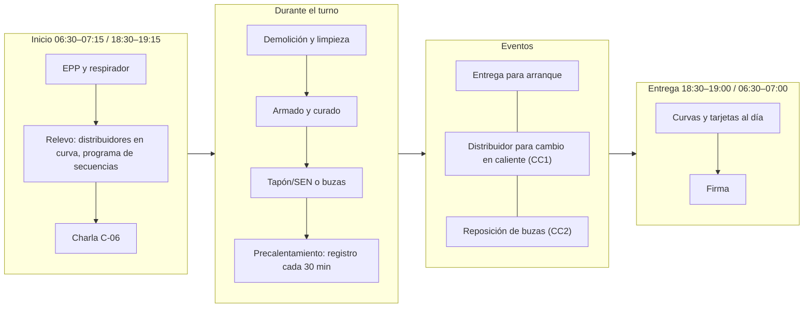
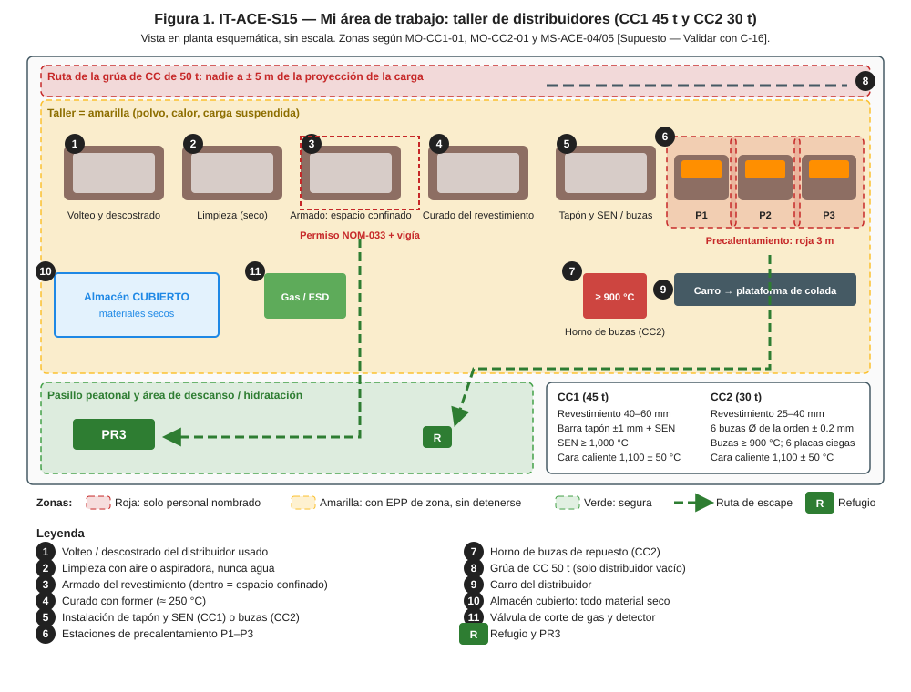
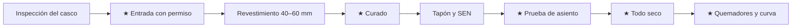

# IT-ACE-S15 — Instrucción de Trabajo: Preparador de Distribuidores

## 1. Encabezado de control
| Campo | Valor |
|---|---|
| Código | IT-ACE-S15 |
| Versión | 0.1 |
| Estado | Borrador para validación |
| Rol | S-15 Preparador de Distribuidores (nivel N-3, entrada) |
| Área | Taller de distribuidores compartido: CC1 (45 t) y CC2 (30 t) |
| Turno | 4x4 de 12 h (precalentamiento y entrega; relevo 07:00 / 19:00) y administrativo (revestimiento) |
| Reporta a | C-06 Supervisor de Colada Continua; línea técnica de C-15 Especialista de Refractarios |
| Manuales de referencia | MO-CC1-01, MO-CC2-01; MS-ACE-02, -03, -04, -05, -06, -08; FT-ACE-001 v0.3 §4–§5 |
| Elaboró | experto-operativo-metalurgia (con criterio de diseño instruccional de C&D) |
| Revisión técnica | experto-operativo-metalurgia — visto bueno, 2026-09-25 |
| Revisión de seguridad | Pendiente — experto-seguridad-salud |
| Revisión laboral | Pendiente — experto-relaciones-laborales |
| Aprobó | Pendiente — Director de C&D |

> Esta IT **no reemplaza** a los manuales. Valores de referencia de FT-ACE-001 y del proveedor de refractarios: validar con C-15 / OEM antes de usarlos en planta.

## 2. Mi puesto en 30 segundos
Entregas distribuidores limpios, **secos**, bien armados y precalentados a tiempo para cada secuencia. Un distribuidor húmedo puede **explotar** al recibir acero. Una buza del diámetro equivocado frena o desborda una línea de CC2. Tu firma en la hoja es la primera barrera del arranque.

> **★ Mis 3 reglas de oro**
> 1. ★ Si no está seco, no sale: sin tarjeta de secado completa, **no se usa**.
> 2. ★ Entro al distribuidor **solo** con permiso de espacio confinado, gases medidos, LOTO y vigía.
> 3. ★ Nadie bajo el distribuidor suspendido ni a ± 5 m de su proyección.

## 3. Mi turno de 12 horas

## 4. Mi área de trabajo

## 5. Mi EPP
| Pictograma | EPP | Cuándo lo uso |
|---|---|---|
| [CASCO] | Casco con barbiquejo y lentes | Todo el turno |
| [FR] | Ropa FR o 100% algodón | Todo el turno |
| [BOTAS] | Botas metatarsales | Todo el turno |
| [GUANTES] | Guantes de carnaza | Armado y manejo de piezas |
| [RESPIRADOR] | Respirador P100 | Masa seca de MgO, polvo, fibra cerámica, limpieza de pozos |
| [ALUMINIZADO] | Chamarra y polainas aluminizadas + careta IR | Junto al distribuidor caliente (1,100 °C) |
| [OÍDO] | Protección auditiva | Quemadores y demolición (≥ 85 dB(A)) |
| [MULTIGÁS] | Detector de O₂ / LEL / CO | Entrada al distribuidor y estación de quemadores |

## 6. Mis tareas paso a paso

### Tarea 1 — Preparar y precalentar el distribuidor de CC1, 45 t (MO-CC1-01)

| Paso | Qué hago | Cómo verifico (medición) | ★ |
|---|---|---|---|
| 1 | Recibe el distribuidor del volteo | Casco < 100 °C; orejas y casco sin grietas; desprendimiento ≤ 30 mm | |
| 2 | Limpia con aspiradora o aire, nunca agua | Superficie limpia y seca | |
| 3 | Entra solo con permiso (ver Tarea 4) | O₂ 19.5–23.5% → LEL < 10% → CO < 25 ppm; T ≤ 45 °C | ★ |
| 4 | Coloca pad, arma y vibra el revestimiento | Pad centrado ± 50 mm; espesor 40–60 mm en 8 puntos (< 35 mm rehace) | |
| 5 | Cura con el former | ≈ 250 °C según curva del proveedor; masa dura, sin zonas blandas | ★ |
| 6 | Instala presa y dique con mortero **seco** | Posición del plano de C-08 ± 20 mm | |
| 7 | Instala buza interior y barra tapón; prueba asiento | Centrado ± 1 mm; sin paso de luz ni fuga de aire | ★ |
| 8 | Prueba el argón del tapón e instala la SEN | Flujo libre 3–8 NL/min; SEN vertical ± 1 mm; puertos ± 2°; anota lote | 🔎 |
| 9 | Verifica que todo esté seco y firma | Mortero, sellos, pad y SEN secos | ★ |
| 10 | Enciende quemadores y sigue la curva | Purga + prueba de flama; 0–30 min hasta 300 °C; rampa ≤ 8 °C/min; sostén 1,100 ± 50 °C; SEN ≥ 1,000 °C; registra cada 30 min | ★ |

> **🛑 ALTO — detén y avisa si…**
> - Ves vapor o humedad: no liberes; regresa a la etapa 1 de la curva.
> - Falla la prueba de asiento o ves grieta en SEN o tapón.
> - Temperatura > 1,200 °C (baja el fuego) o > 6 h a temperatura (consulta a C-15).
> - Alarma de gas: 10% LEL sal; 20% LEL evacuación del sector.

### Tarea 2 — Preparar el distribuidor de CC2, 30 t, y las buzas calibradas (MO-CC2-01)

| Paso | Qué hago | Cómo verifico (medición) | ★ |
|---|---|---|---|
| 1 | Revisa la tarjeta del distribuidor | Número, fecha y **curva de secado completa y firmada** | ★ |
| 2 | Inspecciona el revestimiento | 25–40 mm en 6 puntos (< 20 mm rechaza); sin grietas > 3 mm | |
| 3 | Limpia los 6 pozos con aire seco | Sin escoria ni mortero; respirador P100 | |
| 4 | Confirma el diámetro de la orden con S-12 | Mismo Ø en orden, HMI y caja. 160 × 160: 20–24 mm (22 nominal) · 130 × 130: 15–17 mm | ★ |
| 5 | Verifica cada buza con calibrador pasa/no pasa | Pasa el nominal y no pasa +0.2 mm; sin grietas ni astillas | ★ |
| 6 | Asienta bloque y buza | Vertical ≤ 1 mm; sin juego | |
| 7 | Coloca placas ciegas en L1–L6 | 6 líneas cerradas; mecanismo sin juego | ★ |
| 8 | Carga el horno de buzas | ≥ 6 buzas del Ø de la orden + 2 placas ciegas; horno ≥ 900 °C | |
| 9 | Enciende quemadores y sigue la curva | Fuego bajo 30 min, luego 1,050–1,150 °C; ≥ 2 h a temperatura; total ≤ 6 h | ★ |
| 10 | Mide las buzas y pide la liberación | Pirómetro por abajo: ≥ 900 °C; hoja firmada por C-06 | 🔎 |

> **🛑 ALTO — detén y avisa si…**
> - La tarjeta de secado está incompleta o el revestimiento húmedo.
> - Una buza está fuera de calibre o astillada: sepárala con su lote.
> - El mecanismo de cambio rápido está duro o atorado.
> - No alcanza 1,000 °C en el tiempo.

**Diferencias CC1 / CC2 que no debo confundir**

| Punto | CC1 (45 t) | CC2 (30 t) |
|---|---|---|
| Control de flujo | Barra tapón + SEN | 6 buzas calibradas con cambio rápido |
| Revestimiento de trabajo | 40–60 mm | 25–40 mm |
| Temperatura mínima de la pieza de flujo | SEN ≥ 1,000 °C | Buza ≥ 900 °C |
| Tiempo sin fuego hasta abrir la olla | ≤ 10 min | ≤ 5 min (> 10 min: recalentar 15 min) |
| Prueba clave | Asiento del tapón y argón | Diámetro con calibrador ± 0.2 mm |

### Tarea 3 — Mover el distribuidor vacío con la grúa de CC de 50 t (MS-ACE-04; paso 14 de MO-CC1-01 y paso 10 de MO-CC2-01)

| Paso | Qué hago | Cómo verifico (medición) | ★ |
|---|---|---|---|
| 1 | Inspecciona grúa, balancín y orejas | Lista pre-uso sin pendientes; frenos y límites probados | ★ |
| 2 | Confirma que el distribuidor está **vacío** | Distribuidor vacío con refractario ≈ 30–40 t (CC1) ≤ 50 t | |
| 3 | Despeja la ruta | Nadie bajo la carga ni a ± 5 m de su proyección | ★ |
| 4 | Iza con un solo señalero | Señales NOM-006; cualquiera puede dar PARO | ★ |
| 5 | Asienta en la estación | Asentado y nivelado; ganchos libres | |

> **🛑 ALTO:** persona bajo la carga, accesorio dañado o grúa con falla = no se iza. Solo si estoy certificado como operador de grúa (rol S-27 pendiente de catálogo).

### Tarea 4 — Entrar al distribuidor como espacio confinado (MS-ACE-05, NOM-033)

| Paso | Qué hago | Cómo verifico (medición) | ★ |
|---|---|---|---|
| 1 | Pide el permiso a C-06 | Permiso de espacio confinado firmado | |
| 2 | Bloquea quemadores (aislamiento positivo del gas) y carro | Candados personales; prueba sin encendido ni movimiento | ★ |
| 3 | Mide en orden | O₂ 19.5–23.5% → LEL < 10% → CO < 25 ppm (trabajo en caliente: 0% LEL detectable) | ★ |
| 4 | Mide la temperatura interior | ≤ 45 °C | |
| 5 | Confirma vigía afuera y rescate listo | Vigía nombrado; equipo de rescate en sitio | ★ |
| 6 | Sal al final y cuenta personas y herramientas | Conteo completo; retira tu candado | |

> **🛑 ALTO:** el detector personal alarma, el vigía se retira o la temperatura sube: **sal de inmediato**.

## 7. Mis controles críticos (★)
- ☐ Tarjeta de secado / registro de curado completo y firmado.
- ☐ Todos los materiales del almacén cubierto: secos, sin intemperie.
- ☐ Permiso de espacio confinado, LOTO y gases medidos antes de entrar.
- ☐ Quemadores: purga, prueba de flama, detector de gas activo, válvula de corte probada.
- ☐ Nadie bajo el distribuidor suspendido ni a ± 5 m.
- ☐ CC2: Ø de buza = orden de colada, verificado con calibrador.

## 8. Si algo sale mal
| Síntoma | Qué hago | A quién aviso |
|---|---|---|
| Vapor o humedad en el distribuidor | No liberes; regresa al quemador | C-06 (canal del taller [Supuesto: canal 3 CC1 / 4 CC2]); C-15 |
| Pérdida de flama | Corte automático; purga antes de reencender | S-21; C-06 |
| Olor a gas o alarma de gas | Cierra la válvula o el ESD; 10% LEL sal; 20% LEL evacuación | Canal 1 "EMERGENCIA ×3" (MS-ACE-09 [Supuesto]); C-16 |
| Grieta en SEN o tapón tras precalentar | Cambia la pieza y precalienta de nuevo | C-06; C-15 |
| Retraso de la olla > 6 h | Mantén 1,050–1,100 °C; C-15 decide | C-06; C-15 |
| Apagón en la estación | Corte de gas automático; purga y reencendido; mide T antes de liberar | C-06 |

## 9. Registros que lleno
| Registro | Cuándo | Dónde |
|---|---|---|
| Lista / hoja de preparación del distribuidor (espesor, presas, tapón, SEN o Ø por línea, lotes) | Cada distribuidor | Papel firmado por C-06 + MES |
| Registro de curado y curva de precalentamiento (T cada 30 min) | Cada distribuidor | Registro de la estación |
| Permiso de espacio confinado y LOTO | Cada entrada | Permiso |
| Lista de encendido de quemadores y prueba del detector de gas | Cada encendido | Estación |
| Vida del distribuidor (coladas, horas) | Al regresar al taller | Registro para C-15 |

## 10. Mi certificación
| Concepto | Detalle |
|---|---|
| Nivel ILUO requerido | **U** (nivel 3) en preparación de distribuidores CC1 y CC2 |
| Teoría | Ruta técnica 32 h (distribuidor, refractarios, buzas, precalentamiento, espacios confinados) |
| OJT | 20 turnos (240 h): 10 distribuidores completos de CC1 y 10 de CC2 |
| Pasos ★ que me evalúan | MO-CC1-01 pasos 4, 7, 10, 13, 14, 15 · MO-CC2-01 pasos 1, 5, 6, 8, 10, 11 |
| Vigencia | **12 meses:** espacios confinados (MS-ACE-05, NOM-033), grúas/izaje (MS-ACE-04, NOM-006), alturas (NOM-009). **24 meses:** demás TD-P07. Refresco anual 8 h de espacios confinados |

## 11. Glosario rápido
| Término | Qué es |
|---|---|
| Revestimiento de trabajo | Capa de masa de MgO que toca el acero |
| Former | Molde metálico para vibrar y curar la masa |
| Pad de impacto | Pieza que recibe el chorro del tubo protector |
| Presa y dique | Piezas que guían el flujo para flotar inclusiones |
| Barra tapón | Pieza que abre y cierra el flujo al molde (CC1) |
| SEN | Buza sumergida (CC1) |
| Buza calibrada | Buza de ZrO₂ con diámetro fijo (CC2) |
| Calibrador pasa/no pasa | Galga que confirma el diámetro de la buza |
| LEL | Límite inferior de explosividad del gas |
| Vigía | Persona afuera que vigila al que entra y pide rescate |

## 12. Control de cambios
| Versión | Fecha | Cambio | Elaboró |
|---|---|---|---|
| 0.1 | 2026-09-25 | Emisión inicial desde DP-ACE-S v0.2, MO-CC1-01, MO-CC2-01 y FT-ACE-001 v0.3. Diámetro de buza tomado de FT-ACE-001 v0.3 (160 × 160: 20–24 mm); la DP cita 15–17 mm, válido solo para 130 × 130. Figura nueva `it-S15-puesto.svg` | experto-operativo-metalurgia |
