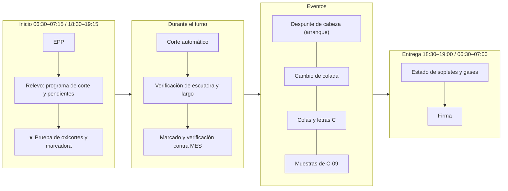
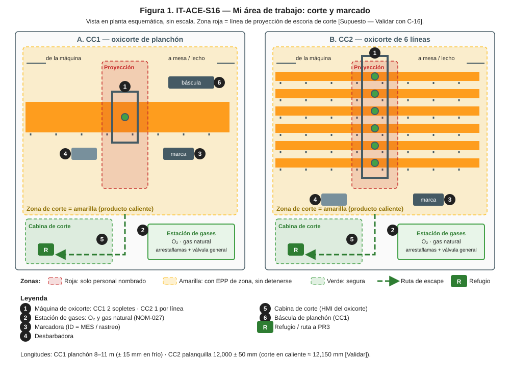
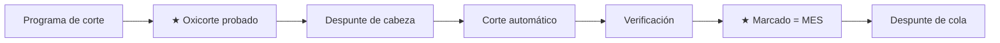
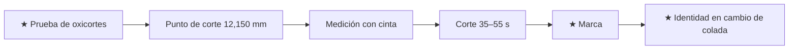
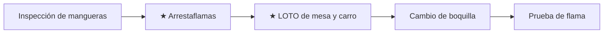

# IT-ACE-S16 — Instrucción de Trabajo: Operador de Corte y Marcado

## 1. Encabezado de control
| Campo | Valor |
|---|---|
| Código | IT-ACE-S16 |
| Versión | 0.1 |
| Estado | Borrador para validación |
| Rol | S-16 Operador de Corte y Marcado (sindicalizado, nivel N-4) |
| Área | Oxicorte y marcado de CC1 (planchón) y CC2 (palanquilla, 6 líneas); corte de reproceso |
| Turno | 4x4 de 12 h (relevo 07:00 / 19:00) y administrativo (reproceso) · jornada según el CCT [CCT: pedir texto] |
| Reporta a | C-06 Supervisor de Colada Continua |
| Manuales de referencia | MO-CC1-08, MO-CC2-08 (apoyo en MO-CC1-03/-07, MO-CC2-03/-06/-07); MS-ACE-01, -02, -03, -06, -08, -09; FT-ACE-001 v0.3 §4–§5 |
| Elaboró | experto-operativo-metalurgia (con criterio de diseño instruccional de C&D) |
| Revisión técnica | experto-operativo-metalurgia — visto bueno, 2026-09-25 |
| Revisión de seguridad | experto-seguridad-salud — visto bueno (con observaciones), 2026-09-26 |
| Revisión laboral | experto-relaciones-laborales — visto bueno (con observaciones), 2026-09-26 |
| Aprobó | Pendiente — Director de C&D |

> Esta IT **no reemplaza** a los manuales. Valores de referencia de FT-ACE-001: validar con OEM / Ingeniería de Proceso y Laminación antes de usarlos en planta.

## 2. Mi puesto en 30 segundos
Cortas el producto a la longitud pedida y lo marcas para que cada pieza se pueda rastrear. Trabajas con oxígeno y gas natural: una fuga o un retroceso de flama pueden causar incendio o explosión. Un marcado equivocado manda a Laminación una colada que no es. Tu trabajo es seguridad y trazabilidad al mismo tiempo. Sin funciones de mando (LFT art. 9): si algo no está bien, **avisas, detienes y escalas** a C-06.

> **★ Mis 3 reglas de oro**
> 1. ★ Al inicio del turno pruebo fugas, arrestaflamas y flama; con fuga **no corto**.
> 2. ★ Nadie en la línea de proyección de la escoria de corte.
> 3. ★ Marca = MES / rastreo, siempre. Si no coincide, **retengo** y aviso.

## 3. Mi turno de 12 horas

> **Mi jornada (nota laboral).** Mi turno está pactado en el CCT [CCT: pedir texto]. El relevo y la entrega–recepción antes de las 07:00 / 19:00 son tiempo de trabajo (LFT art. 58). Se cuentan en la jornada o se pagan según el CCT. La jornada de 12 h y la reforma de 40 h están en revisión (arts. 59–61 y 66–68) — verificar con Jurídico Laboral.

## 4. Mi área de trabajo

## 5. Mi EPP
| Pictograma | EPP | Cuándo lo uso |
|---|---|---|
| [CASCO] | Casco con barbiquejo | Fuera de la cabina |
| [CARETA] | Careta o gafas de corte (sombra según NOM-027) | Corte manual, despunte y revisión de flama |
| [FR] | Ropa FR o 100% algodón | Todo el turno |
| [GUANTES] | Guantes de carnaza | Cambio de boquillas y corte manual |
| [BOTAS] | Botas metatarsales | Todo el turno |
| [OÍDO] | Protección auditiva | Zona de corte |
| [MULTIGÁS] | Detector personal de gas (LEL, CO, O₂) | Zona de corte y cambio de boquillas: 10 % LEL sal; 20 % LEL evacúa (MS-ACE-06) |

## 6. Mis tareas paso a paso

### Tarea 1 — Cortar, marcar y registrar el planchón de CC1 (MO-CC1-08)

| Paso | Qué hago | Cómo verifico (medición) | ★ |
|---|---|---|---|
| 1 | Revisa el programa de corte | Longitud por orden 8–11 m; fuera de rango no cortes y consulta a C-06 | |
| 2 | Verifica el oxicorte | Presiones de O₂ y gas; arrestaflamas; prueba de flama; boquillas limpias | ★ |
| 3 | Prueba el marcado | Marca de prueba legible | |
| 4 | Despunta la cabeza al inicio de secuencia | 300–500 mm (objetivo 400); cabeza sana, sin restos de barra falsa | 🔎 |
| 5 | Vigila cada corte | Corte en caliente = longitud fría × ≈ 1.013; velocidad 250–350 mm/min | |
| 6 | Verifica el corte | Corte pasante, escuadra ≤ 5 mm, kerf 8–12 mm, sin puentes | 🔎 |
| 7 | Corta muestras si toca | Rebanada según plan de C-09, identificada | |
| 8 | Desbarba | Sin rebaba | |
| 9 | Marca el planchón | ID en la cara indicada; confirma contra MES; 100% legible | ★ |
| 10 | Despunta la cola al fin de secuencia | 500–1,000 mm hasta zona sana (sin rechupe) | 🔎 |

> **🛑 ALTO — detén y avisa si…**
> - Fuga de O₂ o gas, o retroceso de flama.
> - Corte incompleto (puente): detén la mesa antes de la transferencia.
> - La ID no coincide con el MES.
> - El planchón se atora en la mesa: LOTO antes de intervenir.

### Tarea 2 — Cortar y marcar la palanquilla de CC2, 6 líneas (MO-CC2-08)

| Paso | Qué hago | Cómo verifico (medición) | ★ |
|---|---|---|---|
| 1 | Prueba los 6 oxicortes | Prueba de fugas, antirretornos, flama de precalentamiento estable | ★ |
| 2 | Verifica el ajuste de longitud | Punto de corte en caliente 12,150 mm [Validar] para el grado y la sección | |
| 3 | Compara una palanquilla fría por línea | Cinta vs. encoder ± 10 mm; objetivo 12,000 ± 50 mm en frío | 🔎 |
| 4 | Vigila el corte | Completo en 35–55 s (> 60 s revisa boquilla y O₂); a escuadra ≤ 5 mm | |
| 5 | Desbarba | Rebaba ≤ 3 mm | |
| 6 | Marca con la marcadora automática | Legible; letras de condición A, T, B, E, C, R cuando apliquen | ★ |
| 7 | Verifica la identidad con S-12 | Primera y última palanquilla de cada colada por línea y zona de transición | ★ |
| 8 | Despunta la cabeza y corta las colas | Cabeza ≈ 1,000 mm (800–1,200) a chatarra; cola "C" (< 6 m a chatarra) | 🔎 |

> **🛑 ALTO — detén y avisa si…**
> - Retroceso de llama o fuga: cierra O₂ y gas en la válvula general y evacúa.
> - Corte incompleto y la palanquilla arrastra el carro: detén la línea de corte.
> - Marca ≠ rastreo: retén "R" todas las dudosas.

**Diferencias CC1 / CC2 que no debo confundir**

| Punto | CC1 planchón | CC2 palanquilla |
|---|---|---|
| Longitud en frío | 8–11 m según orden; ± 15 mm | 12,000 mm; ± 50 mm [Validar] |
| Corte | 2 sopletes, bordes → centro; 250–350 mm/min | 1 oxicorte por línea; 35–55 s por corte |
| Despunte de cabeza | 300–500 mm | ≈ 1,000 mm (800–1,200) |
| Cola | 500–1,000 mm hasta zona sana | Palanquilla "C"; < 6 m a chatarra |
| Identificación | ID de planchón = MES | Marca + letras de condición = rastreo |

### Tarea 3 — Gases de corte y cambio de boquillas (MS-ACE-06, MS-ACE-02)

| Paso | Qué hago | Cómo verifico (medición) | ★ |
|---|---|---|---|
| 1 | Revisa mangueras, reguladores y conexiones | Sin grietas ni fugas (agua jabonosa) | ★ |
| 2 | Revisa arrestaflamas y antirretornos | Instalados y en buen estado | ★ |
| 3 | Aplica LOTO a la mesa y al carro de corte | Candado personal; prueba sin movimiento | ★ |
| 4 | Cambia o limpia la boquilla | Boquilla sin daño; kerf esperado 8–12 mm (CC1) | |
| 5 | Retira tu candado y prueba la flama | Flama estable; sin alarma | |

> **🛑 ALTO:** olor a gas o detector en alarma: 10% LEL sal; 20% LEL evacuación del sector; sin chispas ni interruptores.

## 7. Mis controles críticos (★)
- ☐ Prueba de fugas, arrestaflamas y antirretornos al inicio del turno; sin grasa ni aceite en conexiones de O₂.
- ☐ Zona de corte delimitada; nadie en la línea de proyección.
- ☐ LOTO de mesa y carro antes de meter manos.
- ☐ Marca = MES / rastreo (primera y última de cada colada).
- ☐ Cabeza y cola despuntadas hasta zona sana.

## 8. Si algo sale mal
| Síntoma | Qué hago | A quién aviso |
|---|---|---|
| Retroceso de flama | Cierra O₂ y gas; no reencender sin revisión | C-06 (CC1 canal 3 / CC2 canal 4 [Supuesto]); S-21 |
| Fuga de O₂ o gas | Cierra válvulas; ventila; prohibida flama | Canal 1 "EMERGENCIA ×3" si hay alarma; C-16 ext. 4501 [Supuesto] |
| Longitud fuera de tolerancia | Recalibra encoder; retén desde el último control bueno | C-06; S-18 |
| Marca ilegible o marcadora fuera de servicio | Remarca con crayón de alta temperatura y verifica contra MES | C-06; S-18 |
| Falla del oxicorte con colada en curso | Avisa: S-12 baja velocidad; corte manual autorizado | C-06; S-12 |
| Planchón con grietas visibles en caliente | Retén y avisa | S-18; C-09 ext. 4302 [Supuesto] |

## 9. Registros que lleno
| Registro | Cuándo | Dónde |
|---|---|---|
| Programa y registro de corte (longitudes, despuntes, muestras) | Cada colada | Nivel 2 / MES |
| Registro de corte por línea (longitud medida, escuadra, rebaba) — CC2 | 1 por línea por turno | MES |
| Lista de verificación de oxicorte | Inicio de turno | Hoja de la cabina |
| Identidad y letras de condición | Cada pieza | MES / rastreo |

## 10. Mi certificación
| Concepto | Detalle |
|---|---|
| Nivel ILUO requerido | **U** (nivel 3) en CC1 y/o CC2 |
| Teoría | Ruta técnica 24 h (oxicorte, gases, NOM-027, trazabilidad) |
| OJT | 15 turnos (180 h); 80 h por máquina (CC2: 10 coladas) |
| Pasos ★ que me evalúan | MO-CC1-08 pasos 2, 10 · MO-CC2-08 pasos 1, 6, 7 |
| Vigencia | **24 meses** (TD-P07). No tiene certificaciones de 12 meses. Refresco anual 8 h (gases y corte) |

> **Mi evaluación no es una sanción** (nota laboral — verificar con Jurídico Laboral)
> - La evaluación TD-P07 sirve para formarme, certificarme y acreditar mi aptitud. No se usa para sancionarme (DP-ACE-S §4).
> - Si aún no demuestro un paso ★, conservo mi categoría, mi salario y mi antigüedad. Recibo retroalimentación, OJT de refuerzo y otra oportunidad [Supuesto: 2 en ≤ 60 días, a validar con la CMCAP].
> - Si ya sé hacer el trabajo, puedo pedir el **examen de suficiencia** (LFT art. 153-U). Si lo apruebo, recibo mi DC-3 sin cursar toda la ruta.
> - La certificación prueba mi aptitud para ascender. Entre los aptos, asciende el de mayor antigüedad (LFT arts. 154–159 y CCT).
> - Si mi certificación se suspende tras un incidente grave, es una medida de seguridad, no una sanción. Paso a tarea no crítica sin perder salario ni antigüedad y me reevalúan en ≤ 15 días [Supuesto].
> - Mi capacitación y mis recertificaciones son en jornada y sin costo para mí. Si caen en mi descanso, se pagan según el CCT [CCT: pedir texto].

## 11. Glosario rápido
| Término | Qué es |
|---|---|
| Oxicorte | Corte con oxígeno y gas natural |
| Kerf | Ancho del corte |
| Despunte | Recorte de cabeza o cola hasta zona sana |
| Rechupe | Hueco de contracción en la cola |
| Arrestaflamas | Dispositivo que detiene el retroceso de flama |
| Encoder | Sensor que mide la longitud a cortar |
| Letras de condición (CC2) | A arranque · T transición · B cambio de buza · E EMS apagado · C cola · R retenida |
| MES / rastreo | Sistema que identifica cada pieza |

## 12. Control de cambios
| Versión | Fecha | Cambio | Elaboró |
|---|---|---|---|
| 0.1 | 2026-09-25 | Emisión inicial desde DP-ACE-S v0.2, MO-CC1-08, MO-CC2-08 y FT-ACE-001 v0.3. Figura nueva `it-S16-puesto.svg` | experto-operativo-metalurgia |
