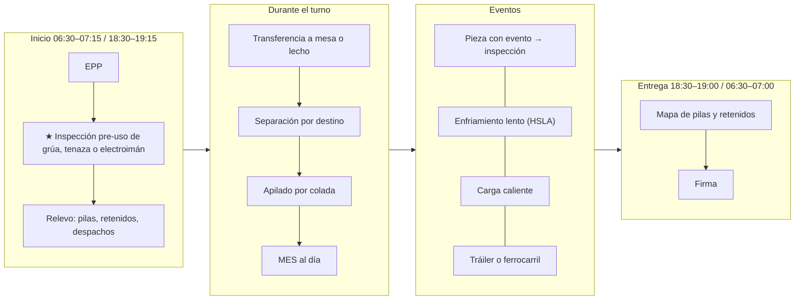
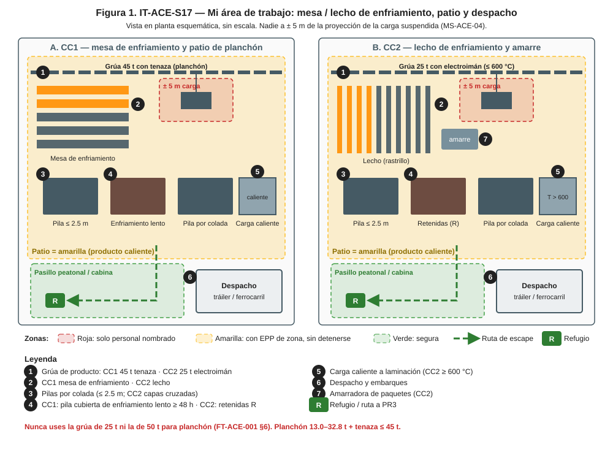
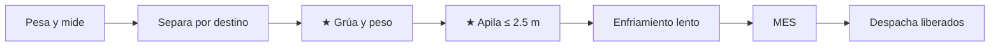
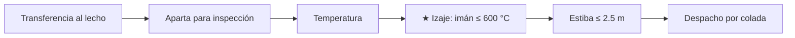

# IT-ACE-S17 — Instrucción de Trabajo: Operador de Mesa de Enfriamiento y Despacho

## 1. Encabezado de control
| Campo | Valor |
|---|---|
| Código | IT-ACE-S17 |
| Versión | 0.1 |
| Estado | Borrador para validación |
| Rol | S-17 Operador de Mesa de Enfriamiento y Despacho (sindicalizado, nivel N-3, entrada) |
| Área | CC1: mesa de enfriamiento y patio de planchón · CC2: lecho de enfriamiento y amarre · grúas de producto · despacho a Laminación |
| Turno | 4x4 de 12 h (relevo 07:00 / 19:00) y administrativo (despacho y embarques) · jornada según el CCT [CCT: pedir texto] |
| Reporta a | C-06 Supervisor de Colada Continua |
| Manuales de referencia | MO-CC1-08, MO-CC2-08; MS-ACE-04, -08, -09, -10; MM-GR-01 (criterio de inspección pre-uso); FT-ACE-001 v0.3 §6 |
| Elaboró | experto-operativo-metalurgia (con criterio de diseño instruccional de C&D) |
| Revisión técnica | experto-operativo-metalurgia — visto bueno, 2026-09-25 |
| Revisión de seguridad | experto-seguridad-salud — visto bueno, 2026-09-26 |
| Revisión laboral | experto-relaciones-laborales — visto bueno (con observaciones), 2026-09-26 |
| Aprobó | Pendiente — Director de C&D |

> Esta IT **no reemplaza** a los manuales. Valores de referencia de FT-ACE-001: validar con OEM, C-09 y C-16 antes de usarlos en planta.

## 2. Mi puesto en 30 segundos
Mueves, enfrías, apilas y despachas el semiterminado sin mezclar coladas. Trabajas con cargas de hasta 32.8 t a más de 600 °C: una caída mata. Solo despachas lo que Calidad liberó. Tu orden en el patio es la trazabilidad que recibe Laminación. Sin funciones de mando (LFT art. 9): si algo no está bien, **avisas, detienes y escalas** a C-06.

> **★ Mis 3 reglas de oro**
> 1. ★ Nadie bajo la carga ni entre pilas durante el izaje (± 5 m de la proyección).
> 2. ★ Grúa correcta: planchón **solo** con grúa de 45 t con tenaza; palanquilla con electroimán **solo** ≤ 600 °C.
> 3. ★ Despacho solo piezas **liberadas** por S-18, una colada por pila o lote.

## 3. Mi turno de 12 horas

> **Mi jornada (nota laboral).** Mi turno está pactado en el CCT [CCT: pedir texto]. El relevo y la entrega–recepción antes de las 07:00 / 19:00 son tiempo de trabajo (LFT art. 58). Se cuentan en la jornada o se pagan según el CCT. La jornada de 12 h y la reforma de 40 h están en revisión (arts. 59–61 y 66–68) — verificar con Jurídico Laboral.

## 4. Mi área de trabajo

## 5. Mi EPP
| Pictograma | EPP | Cuándo lo uso |
|---|---|---|
| [CASCO] | Casco con barbiquejo y lentes | Fuera de la cabina |
| [FR] | Ropa FR o 100% algodón | Todo el turno |
| [BOTAS] | Botas metatarsales | Todo el turno |
| [GUANTES] | Guantes de carnaza o aramida | Calzas, amarre y etiquetas cerca de producto caliente |
| [CHALECO] | Chaleco o brazalete de señalero | Cuando soy señalero |
| [OÍDO] | Protección auditiva | Patio y lecho |
| [ARNÉS] | Arnés y línea de vida | Acceso a grúa o pilas fuera de barandal (NOM-009) |

## 6. Mis tareas paso a paso

### Tarea 1 — Mesa de enfriamiento, apilado y despacho de planchón en CC1 (MO-CC1-08)

| Paso | Qué hago | Cómo verifico (medición) | ★ |
|---|---|---|---|
| 1 | Pesa cada planchón | Real vs. teórico (0.23 × ancho × largo × 7.85) ≤ 2% | 🔎 |
| 2 | Separa por destino | Con evento → inspección; sensible → enfriamiento lento; normal → pila o carga caliente | 🔎 |
| 3 | Verifica grúa y peso antes de izar | Planchón 13.0–32.8 t + tenaza ≤ 45 t; grúa de 45 t con tenaza | ★ |
| 4 | Apila | Calzas alineadas; pila ≤ 2.5 m; una colada por pila cuando se pueda; nadie bajo la carga | ★ |
| 5 | Cubre las pilas de enfriamiento lento | HSLA / peritécticos / con evento de grietas: ≥ 48 h cubiertas hasta < 300 °C; registra hora | |
| 6 | Actualiza el MES | Ubicación de pila y estado (liberado / retenido) | |
| 7 | Despacha | Solo planchones liberados por inspección (MO-CC1-09) | |

> **🛑 ALTO — detén y avisa si…**
> - Te asignan la grúa de 25 t o la de 50 t para planchón: **no izar**.
> - La pila está inestable o inclinada: detén los izajes cercanos.
> - Alguien pide enfriar con agua un planchón HSLA: prohibido.
> - Hay una persona en la zona de la carga.

### Tarea 2 — Lecho de enfriamiento, estiba y despacho de palanquilla en CC2 (MO-CC2-08)

| Paso | Qué hago | Cómo verifico (medición) | ★ |
|---|---|---|---|
| 1 | Transfiere al lecho | Separación uniforme; sin choques ni doblez | |
| 2 | Aparta las palanquillas para inspección | Las que pida S-18 y las marcadas A, T, B, E, C, R | 🔎 |
| 3 | Mide la temperatura al final del lecho | Pirómetro: ≥ 600 °C para carga caliente | |
| 4 | Despacha a carga caliente o patio | Lote de una sola colada; aviso a Laminación | |
| 5 | Iza con electroimán o tenaza | Electroimán solo ≤ 600 °C (objetivo ≤ 550 °C); si está más caliente, tenaza; nadie bajo la carga | ★ |
| 6 | Amarra los paquetes | Según OEM de la amarradora; etiqueta visible | |
| 7 | Estiba en patio | Capas cruzadas; ≤ 2.5 m (objetivo ≤ 2.0 m); etiqueta de estiba | |
| 8 | Registra | Palanquillas por colada (≈ 60–62 por colada de 150 t), destino, retenidas | |

> **🛑 ALTO — detén y avisa si…**
> - Una palanquilla cae del electroimán: acordona y no te acerques hasta que esté asentada.
> - Palanquilla doblada o atorada: detén la transferencia; LOTO; nadie entre rodillos.
> - Hay personas en la zona de izaje.

**Diferencias CC1 / CC2 que no debo confundir**

| Punto | CC1 planchón | CC2 palanquilla |
|---|---|---|
| Pieza | 230 mm × 900–1,650 mm × 8–11 m; 13.0–32.8 t | 160 × 160 mm × 12 m; ≈ 2.41 t |
| Grúa | 45 t **con tenaza** (nunca 25 t ni 50 t) | 25 t con electroimán (≤ 600 °C) o tenaza |
| Enfriamiento | Mesa; pilas cubiertas ≥ 48 h para grados sensibles | Lecho con rastrillo; carga caliente ≥ 600 °C |
| Pila | ≤ 2.5 m, calzas alineadas | Capas cruzadas ≤ 2.5 m (objetivo 2.0 m) |

### Tarea 3 — Inspección pre-uso e izaje con grúa de producto (MS-ACE-04)

| Paso | Qué hago | Cómo verifico (medición) | ★ |
|---|---|---|---|
| 1 | Prueba frenos y límites | Prueba sin carga; ambos límites superiores funcionan | ★ |
| 2 | Revisa tenaza o electroimán | Tenaza sin fisuras; prueba de retención del electroimán y respaldo de batería | ★ |
| 3 | Revisa cables, ganchos, bocina, luces y radio | Lista pre-uso sin pendientes | |
| 4 | Planea la maniobra | Peso (MES / báscula) ≤ capacidad neta; ruta y punto de depósito | |
| 5 | Despeja la ruta con bocina | Nadie a ± 5 m de la proyección de la carga | ★ |
| 6 | Deposita despacio | Últimos 500 mm lento; carga asentada y estable | |
| 7 | Suspende maniobras con viento en patio | ≥ 50 km/h (objetivo < 30 km/h) [Validar con OEM] | |

> **🛑 ALTO:** falla del electroimán, tenaza o freno, o una persona en el área = **no se iza**. Cualquiera puede dar la señal de PARO.

## 7. Mis controles críticos (★)
- ☐ Inspección pre-uso de grúa, tenaza o electroimán y batería de respaldo.
- ☐ Grúa correcta para la pieza (planchón = 45 t con tenaza).
- ☐ Electroimán solo con palanquilla ≤ 600 °C.
- ☐ Nadie bajo la carga ni entre pilas.
- ☐ Pila ≤ 2.5 m, estable, una colada, etiqueta visible.
- ☐ Solo despacho lo liberado en el MES.

## 8. Si algo sale mal
| Síntoma | Qué hago | A quién aviso |
|---|---|---|
| Carga cae o se balancea | Aléjate; acordona; no te acerques hasta que esté asentada | Canal 1 "EMERGENCIA ×3" si hay lesionado (MS-ACE-09 [Supuesto]); C-06 |
| Falla de freno o de electroimán | Baja la carga en zona segura si puedes; saca la grúa de servicio | C-06; mantenimiento de turno ext. 4401 [Supuesto] |
| Pila inestable | Detén izajes cercanos; reacomoda con la grúa correcta | C-06; C-16 ext. 4501 [Supuesto] |
| Pieza sin marca o con marca dudosa | Retén "R"; no despaches | S-18; C-06 |
| Peso real ≠ teórico > 2% | Revisa medición y báscula | S-16; C-06 |
| Síntomas de calor | Sal, agua, aviso | C-06; servicio médico ext. 4600 [Supuesto] |

## 9. Registros que lleno
| Registro | Cuándo | Dónde |
|---|---|---|
| Pesaje por planchón (CC1) | Cada pieza | MES |
| Ubicación de pila, estado y destino | Cada movimiento | MES |
| Registro de pilas de enfriamiento lento (entrada, salida, T) | Cada pila | Registro de pila |
| Registro de despacho (colada, piezas, destino, T) | Cada despacho | MES / hoja de embarque |
| Etiquetas de estiba (CC2) | Cada estiba | En la pila |
| Lista pre-uso de grúa | Inicio de turno | Cabina de la grúa |

## 10. Mi certificación
| Concepto | Detalle |
|---|---|
| Nivel ILUO requerido | **U** (nivel 3) en mesa/lecho y grúa de su máquina |
| Teoría | Ruta técnica 32 h (grúas de producto, electroimán y tenaza, apilado, despacho) + simulador de grúa 8 h; si opera grúa de producto en CC2: 40 h |
| OJT | 20 turnos (240 h); 80 h / 10 coladas por máquina |
| Pasos ★ que me evalúan | MO-CC1-08 pasos 12, 13 · MO-CC2-08 paso 12 · MS-ACE-04 pasos del operador de grúa de CC y producto (1, 2, 4, 5, 7, 8, 9) |
| Vigencia | **12 meses:** grúas/izaje (MS-ACE-04, NOM-006) y alturas (NOM-009). **24 meses:** demás TD-P07. Refresco anual 8 h de izaje |

> **Mi evaluación no es una sanción** (nota laboral — verificar con Jurídico Laboral)
> - La evaluación TD-P07 sirve para formarme, certificarme y acreditar mi aptitud. No se usa para sancionarme (DP-ACE-S §4).
> - Si aún no demuestro un paso ★, conservo mi categoría, mi salario y mi antigüedad. Recibo retroalimentación, OJT de refuerzo y otra oportunidad [Supuesto: 2 en ≤ 60 días, a validar con la CMCAP].
> - Si ya sé hacer el trabajo, puedo pedir el **examen de suficiencia** (LFT art. 153-U). Si lo apruebo, recibo mi DC-3 sin cursar toda la ruta.
> - La certificación prueba mi aptitud para ascender. Entre los aptos, asciende el de mayor antigüedad (LFT arts. 154–159 y CCT).
> - Si mi certificación se suspende tras un incidente grave, es una medida de seguridad, no una sanción. Paso a tarea no crítica sin perder salario ni antigüedad y me reevalúan en ≤ 15 días [Supuesto].
> - Mi capacitación y mis recertificaciones son en jornada y sin costo para mí. Si caen en mi descanso, se pagan según el CCT [CCT: pedir texto].

## 11. Glosario rápido
| Término | Qué es |
|---|---|
| Tenaza | Accesorio de la grúa que sujeta el planchón |
| Electroimán | Accesorio magnético para palanquilla (pierde fuerza en caliente) |
| Proyección de la carga | Área del piso bajo la carga y su ruta |
| Calzas | Soportes entre planchones de la pila |
| Enfriamiento lento | Pila cubierta ≥ 48 h para grados sensibles |
| Carga caliente | Envío directo a Laminación sin enfriar |
| Liberado / retenido | Estado de inspección en el MES |
| Estiba | Acomodo de palanquillas en el patio |

## 12. Control de cambios
| Versión | Fecha | Cambio | Elaboró |
|---|---|---|---|
| 0.1 | 2026-09-25 | Emisión inicial desde DP-ACE-S v0.2, MO-CC1-08, MO-CC2-08, MS-ACE-04 y FT-ACE-001 v0.3. Grúas según FT-ACE-001 v0.2–v0.3 §6 (planchón con 45 t y tenaza); la DP cita "2 × 50 t + 2 × 25 t". Figura nueva `it-S17-puesto.svg` | experto-operativo-metalurgia |
