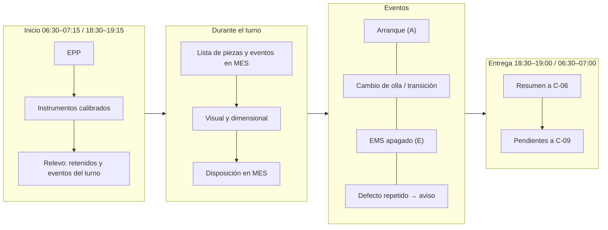
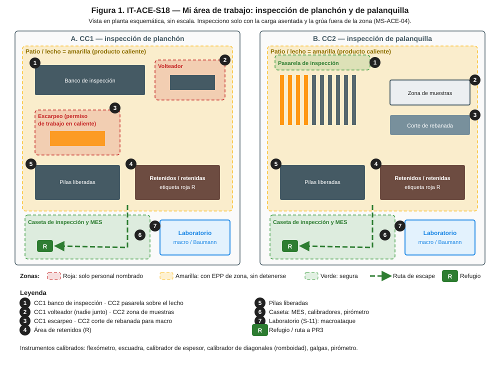
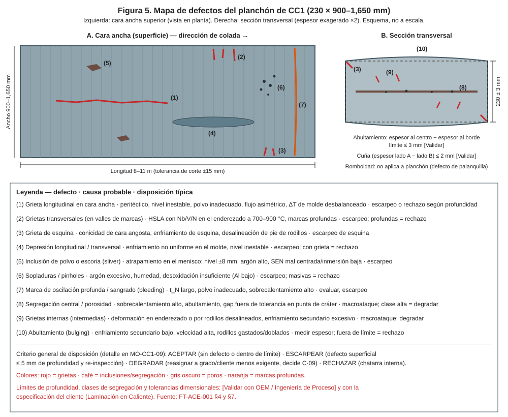
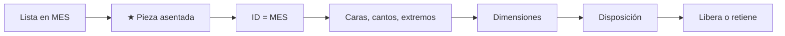
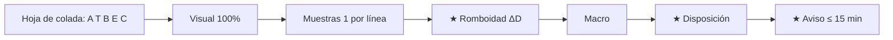
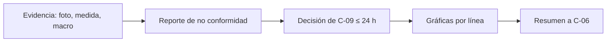

# IT-ACE-S18 — Instrucción de Trabajo: Inspector de Calidad de Semiterminado (planchón / palanquilla)

## 1. Encabezado de control
| Campo | Valor |
|---|---|
| Código | IT-ACE-S18 |
| Versión | 0.1 |
| Estado | Borrador para validación |
| Rol | S-18 Inspector de Calidad de Semiterminado (línea 5 Calidad, nivel N-5) |
| Área | Inspección en línea y en patio: planchón (CC1) y palanquilla (CC2) |
| Turno | 4x4 de 12 h (relevo 07:00 / 19:00) y administrativo (acondicionamiento en patio) |
| Reporta a | C-09 Metalurgista de Producto / Ingeniero de Calidad; coordina con C-06 en el turno |
| Manuales de referencia | MO-CC1-09, MO-CC2-09; MS-ACE-01, -04, -06, -08, -09; FT-ACE-001 v0.3 §4, §5, §7 |
| Elaboró | experto-operativo-metalurgia (con criterio de diseño instruccional de C&D) |
| Revisión técnica | experto-operativo-metalurgia — visto bueno, 2026-09-25 |
| Revisión de seguridad | Pendiente — experto-seguridad-salud |
| Revisión laboral | Pendiente — experto-relaciones-laborales |
| Aprobó | Pendiente — Director de C&D |

> Esta IT **no reemplaza** a los manuales ni al catálogo de defectos. Criterios de referencia: validar con C-09, OEM y Laminación antes de usarlos en planta.

## 2. Mi puesto en 30 segundos
Eres la última barrera antes de Laminación. Inspeccionas, mides, clasificas y dispones cada defecto: aceptar, acondicionar, degradar o rechazar. Si ves un defecto que se repite, avisas a la máquina para que corrija en línea. Inspeccionas cerca de producto caliente y de grúas: primero tu seguridad.

> **★ Mis 3 reglas de oro**
> 1. ★ Inspecciono solo con la pieza **asentada**, la grúa fuera y la pila estable; nunca entre pilas durante izajes.
> 2. ★ Lo que no está liberado en el MES **no se despacha**. Ante duda: retengo.
> 3. ★ Defecto grave o repetido: aviso a C-06 **de inmediato** (≤ 15 min).

## 3. Mi turno de 12 horas

## 4. Mi área de trabajo

## 5. Mi EPP
| Pictograma | EPP | Cuándo lo uso |
|---|---|---|
| [CASCO] | Casco con barbiquejo y lentes | Todo el turno en patio y lecho |
| [FR] | Ropa FR o 100% algodón | Todo el turno |
| [BOTAS] | Botas metatarsales | Todo el turno |
| [GUANTES] | Guantes de aramida | Mediciones sobre producto caliente |
| [CARETA] | Careta facial | Cerca de producto > 600 °C o escarpeo |
| [OÍDO] | Protección auditiva | Patio y lecho |
| [QUÍMICO] | Guantes y lentes para ácido | Si apoyo el macroataque en laboratorio |

## 6. Mis tareas paso a paso

### Tarea 1 — Inspeccionar y disponer el planchón de CC1 (MO-CC1-09)

| Paso | Qué hago | Cómo verifico (medición) | ★ |
|---|---|---|---|
| 1 | Revisa la lista de planchones | IDs, grado, eventos y retenciones en el MES | |
| 2 | Confirma condiciones seguras con S-17 | Planchón asentado, grúa fuera, pila estable | ★ |
| 3 | Verifica la ID | Marca legible = MES | 🔎 |
| 4 | Inspecciona cara superior, cantos y extremos | Grietas, depresiones, inclusiones, poros, marcas; marca con pintura | 🔎 |
| 5 | Pide el volteo para la cara inferior | 1 por colada (100% con evento o HSLA tubería); nadie junto al volteador | ★ |
| 6 | Mide dimensiones | Espesor 230 ± 3 mm; abultamiento ≤ 3; cuña ≤ 2; ancho −5/+15; largo ± 15; sable ≤ 15 mm en 10 m; escuadra ≤ 5 | 🔎 |
| 7 | Mide la profundidad del defecto | Galga o escarpeo de prueba | |
| 8 | Dispone según la tabla de abajo | Aceptar / escarpear / degradar / rechazar en MES | |
| 9 | Re-inspecciona tras el escarpeo | Sin defecto; espesor final ≥ 220 mm | 🔎 |
| 10 | Marca la disposición física y libera o retiene | Código de colores = MES | |

**Disposición rápida del planchón (MO-CC1-09 §5)**

| Defecto | Escarpear | Rechazar / degradar |
|---|---|---|
| Grieta longitudinal | ≤ 5 mm | > 10 mm o > 1 m; 5–10 mm solo con C-09 |
| Grietas transversales | ≤ 5 mm | > 5 mm; en HSLA tubería, cualquier grieta remanente |
| Grieta de esquina | ≤ 10 × 10 mm | Mayor |
| Depresión | > 3 mm sin grieta (≤ 3 mm se acepta) | Con grieta |
| Inclusión / sliver | ≤ 5 mm | Persiste tras 2 pasadas |
| Marcas de oscilación | > 1 mm | Con grieta en el valle |

> **🛑 ALTO — detén y avisa si…**
> - ≥ 2 planchones seguidos con grieta longitudinal: retén la colada y avisa a CC1.
> - Grietas transversales en HSLA (enderezado 700–900 °C).
> - ID ilegible o duplicada: retén hasta identificar.
> - La pila está inestable: aléjate.

### Tarea 2 — Inspeccionar y disponer la palanquilla de CC2 (MO-CC2-09)

| Paso | Qué hago | Cómo verifico (medición) | ★ |
|---|---|---|---|
| 1 | Revisa la hoja de colada | Palanquillas A, T, B, E, C; SH > 35 °C; cierres de línea | |
| 2 | Inspecciona visualmente desde la pasarela | 100% de las palanquillas en el lecho | 🔎 |
| 3 | Pide las muestras a S-17 | 1 por línea por colada más las marcadas | |
| 4 | Mide lados a 1 m de cada extremo | 160 ± 3 mm | 🔎 |
| 5 | Mide diagonales y calcula ΔD | ΔD ≤ 6 mm acepta; > 6 y ≤ 11 retén; > 11 rechaza | ★ |
| 6 | Mide rectitud, largo y marcas de oscilación | Flecha ≤ 5 mm/m y ≤ 40 mm; 12,000 ± 50 mm; marcas ≤ 0.6 mm | 🔎 |
| 7 | Corta rebanada y clasifica macro con S-11 | Grietas en diagonal ≤ 1; porosidad central ≤ 1.5; foto | 🔎 |
| 8 | Revisa química en LIMS | Grado y CE ≤ 0.55 (varilla) | |
| 9 | Dispone y separa | Aceptar / retener (etiqueta roja "R") / rechazar; retenidas en su área | ★ |
| 10 | Avisa a la operación | Romboidad > 6 mm, grietas o macro de rechazo: radio a C-06 | ★ |

> **🛑 ALTO — detén y avisa si…**
> - Romboidad > 6 mm en 2 coladas seguidas de la misma línea.
> - Macro con grietas en diagonal ≥ 3: retén toda la colada de esa línea.
> - Sopladuras abiertas o química fuera de grado: retén la colada.
> - Palanquilla sin marca o con marca dudosa.

**Diferencias CC1 / CC2 que no debo confundir**

| Punto | CC1 planchón | CC2 palanquilla |
|---|---|---|
| Defectos típicos | Grietas longitudinales y transversales, depresiones, slivers, abultamiento | Romboidad, grietas de esquina y en diagonal, pinholes, porosidad central |
| Medición clave | Espesor 230 ± 3 mm; ancho −5/+15 mm | Lado 160 ± 3 mm; ΔD ≤ 6 mm |
| Acondicionamiento | Escarpeo (permiso de trabajo en caliente) | Esmerilado de grietas ≤ 2 mm e inclusiones ≤ 3 mm |
| Muestra interna | Macro / Baumann 1 por secuencia y grado y en cada arranque | Macro 1 por línea al inicio de secuencia y 1 por colada; siempre A, E, B |

### Tarea 3 — Pedir la disposición y reportar tendencias (MO-CC1-09 / MO-CC2-09)

| Paso | Qué hago | Cómo verifico (medición) | ★ |
|---|---|---|---|
| 1 | Envía evidencia a C-09 | Foto, medida y macro con número de colada y pieza | |
| 2 | Pide la decisión de degradación | Disposición escrita ≤ 24 h | |
| 3 | Actualiza gráficas por línea (CC2) | Romboidad y grados de macro al día | |
| 4 | Entrega el resumen del turno a C-06 | Retenidos, causas y líneas afectadas | |

> **🛑 ALTO:** si falta la decisión de C-09, la pieza sigue **retenida**.

## 7. Mis controles críticos (★)
- ☐ Pieza asentada, grúa fuera y pila estable antes de acercarme.
- ☐ Nadie junto al volteador.
- ☐ Instrumentos con calibración vigente.
- ☐ ID = MES en cada pieza que dispongo.
- ☐ Retenidos separados y etiquetados; nada retenido en la lista de despacho.

## 8. Si algo sale mal
| Síntoma | Qué hago | A quién aviso |
|---|---|---|
| Defecto grave o repetido | Retén desde la última pieza buena | C-06 por radio (CC1 canal 3 / CC2 canal 4 [Supuesto]); C-09 ext. 4302 [Supuesto] |
| Espesor o ancho fuera de tolerancia (CC1) | Retén; pide revisar gap o caras angostas | C-06; C-08 |
| Porosidad o rechupe central ≥ 2.5 (CC2) | Retén; revisa SH y EMS en la hoja | C-08; C-09 |
| Pieza sin marca o duplicada | Retén "R"; identifica por colada y posición | C-06; C-09 |
| Retroceso de flama en escarpeo | Aléjate; el escarpador cierra válvulas | C-16 ext. 4501 [Supuesto] |
| Pila inestable o carga en movimiento cerca | Aléjate de inmediato | S-17; C-06 |

## 9. Registros que lleno
| Registro | Cuándo | Dónde |
|---|---|---|
| Inspección por pieza: defectos, ubicación, profundidad, dimensiones, disposición | Cada pieza inspeccionada | MES |
| Registro de escarpeo (CC1) y re-inspección | Cada escarpeo | MES |
| Registro de macro / Baumann con foto y grado | Según plan | MES / laboratorio |
| Reporte de no conformidad | Cada retención | MES → C-09 |
| Gráficas por línea (CC2) | Cada colada | Hoja / sistema de calidad |

## 10. Mi certificación
| Concepto | Detalle |
|---|---|
| Nivel ILUO requerido | **U** (nivel 3) en CC1 y/o CC2 |
| Teoría | Ruta técnica 40 h (defectos de colada, metrología, catálogo de defectos, disposición); en el manual: 32 h CC1 y 24 h CC2 |
| OJT | 25 turnos con inspector certificado (300 h): CC1 300 planchones verificados · CC2 20 coladas y 20 macros |
| Pasos ★ que me evalúan | MO-CC1-09 pasos 2, 6 y concordancia ≥ 90% con el catálogo · MO-CC2-09 pasos 5, 11, 12, 13 y 10 macros con ≥ 90% de acuerdo con C-09 |
| Vigencia | **24 meses** (TD-P07). No tiene certificaciones de 12 meses. Refresco anual 8 h de calibración de criterio con C-09 |

## 11. Glosario rápido
| Término | Qué es |
|---|---|
| Romboidad (ΔD) | Diferencia entre las dos diagonales de la palanquilla |
| Abultamiento | Espesor mayor al centro que en el borde del planchón |
| Escarpeo | Retiro superficial con flama de un defecto (CC1) |
| Sliver | Inclusión de polvo o escoria en la superficie |
| Pinhole | Poro pequeño cerca de la piel |
| Macroataque / Baumann | Ataque ácido o impresión de azufre de una rebanada |
| Segregación central | Concentración de elementos al centro del planchón |
| Retenido (R) | Pieza bloqueada hasta que C-09 decida |

## 12. Control de cambios
| Versión | Fecha | Cambio | Elaboró |
|---|---|---|---|
| 0.1 | 2026-09-25 | Emisión inicial desde DP-ACE-S v0.2, MO-CC1-09, MO-CC2-09 y FT-ACE-001 v0.3. Figura nueva `it-S18-puesto.svg` | experto-operativo-metalurgia |
