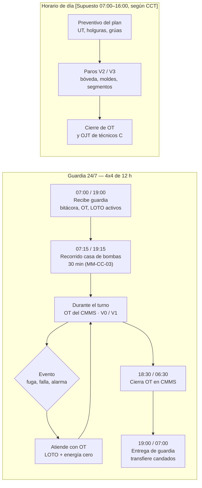
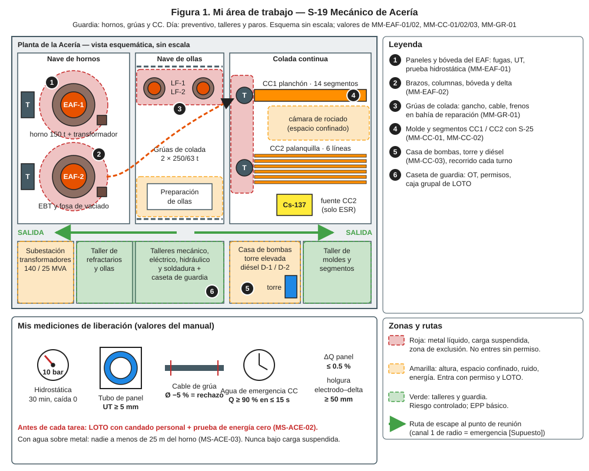
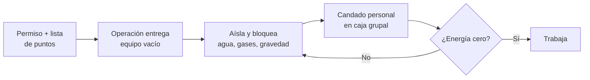
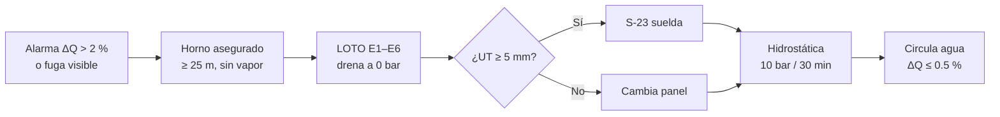
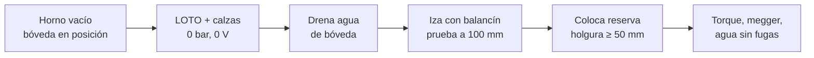
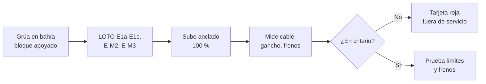
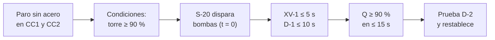
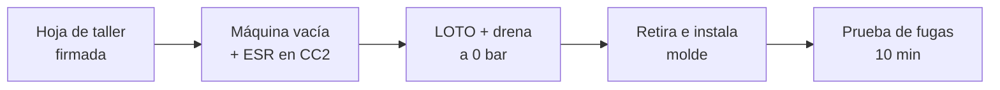
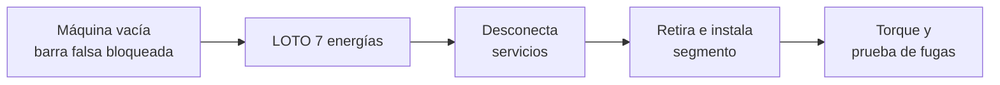

# IT-ACE-S19 — Instrucción de Trabajo: S-19 Mecánico de Acería

## 1. Encabezado de control

| Campo | Valor |
|---|---|
| Código | IT-ACE-S19 |
| Versión | 0.1 |
| Estado | Borrador para validación |
| Rol | S-19 Mecánico de Acería — Técnico C (N-5) / B (N-6) / A (N-7) |
| Área | Mantenimiento de Acería: EAF-1/2, LF, ollas, grúas de nave, CC1, CC2 y servicios de agua |
| Turno | Guardia 4x4 de 12 h (relevo 07:00 / 19:00) y horario de día (preventivo, talleres y paros) |
| Reporta a | C-11 Supervisor de Mantenimiento Mecánico |
| Manuales de referencia | MM-EAF-01, MM-EAF-02, MM-GR-01, MM-CC-01, MM-CC-02, MM-CC-03 · MS-ACE-02, -03, -04, -05, -09, -10 · DP-ACE-S (S-19) |
| Elaboró | gerente-personal-sindicalizado (Líder de la Academia de Mantenimiento y Confiabilidad) |
| Revisión técnica | experto-operativo-metalurgia (criterio aplicado por la Academia de Mantenimiento) — pendiente de firma del experto |
| Revisión de seguridad | Pendiente — experto-seguridad-salud |
| Revisión laboral | Pendiente — experto-relaciones-laborales |
| Aprobó | Pendiente — Director |
| Fecha | 2026-09-25 |

> Esta IT resume tu trabajo; **no reemplaza al manual**. Los valores salen tal cual de los manuales MM-/MS-. Lo marcado **[Validar con OEM]** o **[Supuesto]** no se usa en planta hasta validarse.

## 2. Mi puesto en 30 segundos
Mantengo el equipo mecánico de la Acería seguro y disponible. Mi prioridad son los equipos que pueden causar agua sobre metal, caída de olla o breakout. Localizo y reparo fugas del EAF, cambio bóveda y delta, inspecciono grúas de colada y pruebo el agua de emergencia de CC. Con S-25 cambio moldes y segmentos.

> ★ **Mis 3 reglas de oro**
> 1. ★ **Sin LOTO y energía cero, no meto el cuerpo.** Mi candado, mi llave, mi prueba.
> 2. ★ **Agua y metal no se juntan.** Con agua en el horno: no bascular y nadie a menos de 25 m.
> 3. ★ **Nunca bajo carga suspendida.** Si algo no pasa el criterio, el equipo "no apto" no se libera.

## 3. Mi turno de 12 horas

- **Cambio de turno con LOTO activo:** el entrante pone su candado **antes** de que el saliente quite el suyo. C-04 lo registra (MS-ACE-02 §6.3).
- **Ventanas:** V0 en operación · V1 entre coladas o secuencias · V2 paro semanal · V3 mensual · V4 anual [Supuesto, validar con C-10 y C-13].

## 4. Mi área de trabajo

## 5. Mi EPP

| Pictograma | EPP | Cuándo lo uso |
|---|---|---|
| [CASCO] | Casco con barbiquejo, lentes | Siempre en nave |
| [BOTA] | Botas metatarsales, ropa FR, guantes de carnaza (nitrilo con fluido hidráulico) | Siempre en nave |
| [OÍDO] | Protección auditiva | Casa de bombas y diésel (> 85 dB(A)), talleres |
| [CARETA] | Careta facial | Esmerilado, corte, drenado de agua caliente |
| [ALUMINIZADO] | Ropa y guantes aluminizados | Frente a horno u olla caliente (MS-ACE-01) |
| [ARNÉS] | Arnés de cuerpo completo con línea de vida | Paredes y bóveda del EAF, grúas, torre (≥ 1.8 m) |
| [GAS] | Detector de 4 gases | Entrada al casco del horno, cámara de rociado, tanques |

## 6. Mis tareas paso a paso

### Tarea 1 — LOTO y prueba de energía cero (MS-ACE-02)

| Paso | Qué hago | Cómo verifico (medición) | ★ |
|---|---|---|---|
| 1 | Revisa el permiso y la lista de puntos del equipo (Figura 2). | Todas las energías listadas: eléctrica, hidráulica, agua, gases, gravedad, térmica. | ★ |
| 2 | Confirma que operación entregó el equipo. | EAF vacío y a nivel; CC sin acero; firma de C-05 / C-06. | ★ |
| 3 | Cierra agua (V1/V2) y gases con doble bloqueo; abre dren y venteo. | Manómetro 0 bar; sin flujo en el dren. | ★ |
| 4 | Pon calzas, pasador de basculamiento o pasador de barra falsa. | Calzas y pasadores pintados en rojo, visibles. | ★ |
| 5 | Pon **tu** candado personal en la caja grupal. | Un candado por persona; nunca prestado. | ★ |
| 6 | Prueba energía cero con púlpito y S-20. | Arranque rechazado; 0 V (S-20); 0 bar; gases O₂ 19.5–23.5 %, CO < 25 ppm, < 10 % LEL. | ★ |
| 7 | Al terminar: saca herramientas, cuenta al personal, quita tu candado. | Orden de reenergización: agua → hidráulica → eléctrica. | ★ |

> 🛑 **ALTO — detén y avisa si…**
> - El equipo se mueve o energiza en la prueba de arranque.
> - La presión no baja a 0 bar o sigue saliendo agua por el dren.
> - Te piden cerrar el agua de molde con acero en la máquina. **Prohibido.**

### Tarea 2 — Fuga en paneles y bóveda del EAF (MM-EAF-01) · lidero la ejecución (A)

| Paso | Qué hago | Cómo verifico (medición) | ★ |
|---|---|---|---|
| 1 | Espera que el horno esté asegurado por S-01 y C-05. | Con agua sobre el baño: nadie a menos de 25 m; sin vapor ≥ 30 min. | ★ |
| 2 | Aplica LOTO E1–E6 con tu candado (Tarea 1). | Todos los candados; LEL ≤ 1 % de lectura antes de soldar u oxicortar. | ★ |
| 3 | Drena y ventea el circuito. | Manómetro local 0 bar, sin flujo. | ★ |
| 4 | Localiza la fuga. Si no se ve, presuriza con aire. | Aire a 2 bar y agua jabonosa [Validar]. | |
| 5 | Mide espesores alrededor con UT. | Malla 50 × 50 mm, 300 mm alrededor. ≥ 5 mm: repara; < 5 mm: cambia panel. | 🔎 |
| 6 | Si cambias panel: iza con S-04 y aprieta bridas en cruz. | Torque típ. M20 8.8: 350–400 N·m [Validar OEM]; nadie bajo la carga. | ★ |
| 7 | Haz la prueba hidrostática. | 10 bar, sostén 30 min: caída 0 bar y sin goteo. | ★ |
| 8 | Retira LOTO, circula agua 10 min con S-21. | ΔQ ≤ 0.5 %; T salida estable (≤ 50 °C); P 4–6 bar. | ★ |
| 9 | Firma el checklist de liberación con C-11 y C-05. | Checklist completo, con valores. | ★ |

> 🛑 **ALTO — detén y avisa si…**
> - ΔQ > 4 % o ves agua sobre el baño: arco fuera, **no bascular**, sal a ≥ 25 m.
> - El detector marca CO ≥ 25 ppm, ≥ 10 % LEL u O₂ fuera de 19.5–23.5 %.
> - La prueba hidrostática cae o gotea: no liberes; repite la reparación.

### Tarea 3 — Cambio de bóveda o delta y revisión de brazos (MM-EAF-02) · A

| Paso | Qué hago | Cómo verifico (medición) | ★ |
|---|---|---|---|
| 1 | Aplica LOTO E1–E6 y calzas bajo cada columna. | Acumuladores 0 bar; intento de movimiento sin respuesta. | ★ |
| 2 | Drena el agua de bóveda y tapa conexiones. | Manómetro 0 bar; sin agua. | ★ |
| 3 | Engancha el balancín en las 4 orejas; pide a S-04 levantar 100 mm. | Espera 1 min; carga estable; nadie en ± 5 m de la carga. | ★ |
| 4 | Asienta la bóveda de reserva y centra con marcas. | Asiento uniforme, holgura ≤ 10 mm [Validar]. | ★ |
| 5 | Mide holgura electrodo–delta en los 3 agujeros. | ≥ 50 mm por lado. | 🔎 |
| 6 | Revisa zapatas y mordazas; mide guías con lainas. | Cráteres ≤ 2 mm; mordaza abre y cierra 3 veces; guías 0.5–1.0 mm. | 🔎 |
| 7 | Aprieta uniones en cruz con torquímetro calibrado; marca con pintura. | Valor OEM (ej. M36 10.9 ≈ 2,500 N·m [Validar]). | ★ |
| 8 | Conecta agua y presuriza a presión de operación 10 min. | Sin fugas; ΔQ ≤ 0.5 %. S-20 confirma megger ≥ 1 MΩ. | ★ |

> 🛑 **ALTO — detén y avisa si…**
> - Una columna deriva o "cae" con la HPU parada: calza y no trabajes debajo.
> - Megger < 1 MΩ: no se energiza.
> - La bóveda no asienta o se atora: no la fuerces.

### Tarea 4 — Inspección semanal y prueba de frenos de grúa de colada (MM-GR-01) · A

| Paso | Qué hago | Cómo verifico (medición) | ★ |
|---|---|---|---|
| 1 | Pide a S-09 apoyar bloque y balancín en su base. | Cables sin tensión; carga cero. | ★ |
| 2 | Bloquea con S-20: rieles, interruptor, radio, frenos y calzas; grúa vecina bloqueada. | Detector en colectores: 0 V; movimiento rechazado. | ★ |
| 3 | Sube con línea de vida y anclaje certificado. | Siempre conectado; anclaje ≥ 22.2 kN (MS-ACE-10). | ★ |
| 4 | Mide el Ø del cable en 3 puntos y 2 direcciones. | Rechazo: reducción ≥ 5 %; 6 alambres rotos en un paso; daño por calor. | 🔎 ★ |
| 5 | Mide apertura del gancho entre punzonados (mensual). | Rechazo: > +5 % de la medida de origen; torsión > 10°. | 🔎 ★ |
| 6 | Revisa balatas, entrehierro y tambor. | Balatas ≥ 50 %; entrehierro 0.5–1.0 mm [Validar]; surco ≤ 0.5 mm. | ★ |
| 7 | Retira LOTO con personal fuera; prueba límites con S-20. | Límite 1.º y 2.º cortan (puenteo solo bajo control de C-11). | ★ |
| 8 | Prueba cada freno por separado (mensual): F1, F2 y F3. | Cada freno sostiene sin deslizar (≥ 125 % par nominal). | ★ |

> 🛑 **ALTO — detén y avisa si…**
> - La carga "resbala" al detener o un límite no corta.
> - Encuentras alambres rotos, daño por calor o una grieta: grúa fuera de servicio para colada.

### Tarea 5 — Prueba mensual de agua de emergencia de CC (MM-CC-03) · A

| Paso | Qué hago | Cómo verifico (medición) | ★ |
|---|---|---|---|
| 1 | Confirma la ventana de paro con C-06: sin acero en CC1 y CC2. | Autorización registrada. | ★ |
| 2 | Verifica condiciones iniciales con S-21. | Torre ≥ 90 %; diésel ≥ 75 %; baterías ≥ 25.5 V; XV-1 cerrada. | |
| 3 | Colócate como observador en XV-1 y en el diésel, fuera de acoplamientos. | Nadie cerca de acoplamientos ni del escape. | ★ |
| 4 | Toma el tiempo de apertura de XV-1 y de arranque de D-1. | XV-1 ≤ 5 s [Validar]; D-1 a presión ≤ 10 s. | 🔎 |
| 5 | Sostén 10 min; vigila torre y temperatura del diésel. | Estable. | |
| 6 | Repite con D-1 bloqueado para probar D-2. | D-2 ≤ 10 s. | ★ |
| 7 | Restablece: bombas, XV-1 cerrada, diésel en automático, repone torre. | Torre ≥ 90 %; selectores en automático, verificado por 2 personas. | ★ |

> 🛑 **ALTO — detén y avisa si…**
> - El cambio a emergencia pasa de 15 s: **no se cuela** hasta corregir y repetir.
> - Un diésel no arranca y el otro no está disponible: avisa a C-03 y C-12.

### Tarea 6 — Cambio de molde en máquina (MM-CC-01) · ejecuto con S-25 (R)

| Paso | Qué hago | Cómo verifico (medición) | ★ |
|---|---|---|---|
| 1 | Revisa la hoja de liberación del molde de taller. | Prueba de presión, conicidad, TC y torques firmados. | ★ |
| 2 | Confirma máquina vacía y, en CC2, obturador cerrado por el ESR. | Firma de C-06; radiámetro < 2 × fondo en el permiso. | ★ |
| 3 | Aplica LOTO E-W, E-H, E1, E-S y prueba energía cero. | Oscilación rechazada; 0 bar; 0 V. | ★ |
| 4 | Drena el agua del molde y desconecta mangueras. | 0 bar; sin agua. | ★ |
| 5 | Retira el molde con aparejo certificado. | Levante de prueba a 100 mm; nadie bajo la carga. | ★ |
| 6 | Limpia asientos, instala el molde y aprieta anclajes. | Asentado en pernos de centrado; torque OEM. | ★ |
| 7 | Conecta agua y presuriza a presión de operación 10 min. | Sin fugas. Luego S-25 alinea (±0.3 mm). | ★ |

> 🛑 **ALTO — detén y avisa si…**
> - Radiámetro ≥ 2 × fondo con obturador "cerrado": aléjate ≥ 3 m.
> - La hoja de taller está incompleta o sin firma.

### Tarea 7 — Cambio de segmento de CC1 (MM-CC-02) · ejecuto con S-25 (R)

| Paso | Qué hago | Cómo verifico (medición) | ★ |
|---|---|---|---|
| 1 | Aplica LOTO: E1, E-H, E-S, E-W, E-A, E-L, E-M. | Arranque de rodillos y barra falsa rechazado; 0 bar. | ★ |
| 2 | Desconecta agua, aire, hidráulica y cables; tapa conexiones. | Conexiones identificadas; sin fugas. | |
| 3 | Retira el segmento con viga o carro OEM. | Levante de prueba 100 mm; nadie bajo la carga. | ★ |
| 4 | Limpia asientos y bases de escoria y cascarilla. | Asientos limpios. | |
| 5 | Instala el segmento y aprieta anclajes en secuencia. | Torque OEM registrado. | ★ |
| 6 | Conecta servicios y prueba. | Sin fugas de agua e hidráulica. | |
| 7 | Retira LOTO en orden inverso; apoya la prueba de boquillas. | Boquillas tapadas ≤ 2 % por zona. | ★ |

> 🛑 **ALTO — detén y avisa si…**
> - Alguien está en la cámara de rociado cuando se mueve la barra falsa.
> - Un rodillo de los segmentos 0–3 no gira: no se cuela.

## 7. Mis controles críticos (★)
Úsalos antes de cada tarea crítica:
- ☐ Tengo OT, permiso y análisis de riesgo firmados.
- ☐ Mi certificación TD-P07 está vigente (el sistema no emite permiso sin ella).
- ☐ Mi candado personal está en la caja grupal.
- ☐ Probé energía cero: arranque rechazado, 0 V, 0 bar, gases en rango.
- ☐ Calzas, pasadores y acumuladores a 0 bar antes de abrir líneas.
- ☐ Nadie bajo carga suspendida ni en ± 5 m de su proyección.
- ☐ Con agua sobre metal: todos a ≥ 25 m del horno.
- ☐ Anclado al 100 % en altura (≥ 1.8 m).
- ☐ Liberación firmada por Mantenimiento y Operación antes de devolver.

## 8. Si algo sale mal

| Síntoma | Qué hago | A quién aviso |
|---|---|---|
| ΔQ > 4 % o agua sobre el baño | Sal a ≥ 25 m; no bascular; no te acerques. | C-05, C-04, C-11 · radio canal 1 (emergencia) [Supuesto] |
| Explosión o proyección de metal | Emergencia MS-ACE-09; no reingreses sin autorización. | C-04 (Comandante del Incidente), brigada · canal 1 [Supuesto] |
| Columna o bóveda se mueve con LOTO | 🛑 Detén todo; sal del punto de atrapamiento. | C-11, C-16 · canal de mantenimiento [Supuesto] |
| Carga resbala en la grúa | Bajar la olla a su base si es seguro; grúa fuera de servicio. | C-04, C-11 |
| Caudal de molde < 90 % | Operación reduce velocidad; arranca bomba de reserva. | C-06, C-12 |
| Nivel de torre baja sin uso | Revisa XV-1 y tuberías. | C-12 |
| Fuga de fluido a alta presión | 🛑 Detén la HPU; no toques el chorro. | C-11, servicio médico |
| Detector de gases en alarma | Sal; ventila; revisa aislamiento de gases. | C-11, C-16 |

## 9. Registros que lleno

| Registro | Cuándo | Dónde |
|---|---|---|
| OT con causa, acción, refacciones y torques | Cada intervención | CMMS |
| Permiso de trabajo y lecturas de energía cero | Cada LOTO | Permiso (papel) y bitácora de caja grupal |
| Mapa de espesores UT por panel | Semanal / mensual | CMMS |
| Prueba hidrostática (presión, tiempo, manómetro) | Cada reparación de panel | CMMS |
| Inspección semanal de grúa (Ø de cable, gancho, frenos) | Semanal / mensual | Expediente NOM-006 de la grúa, CMMS |
| Prueba de agua de emergencia (tiempos, caudales) | Mensual | Registro de pruebas MM-CC-03 |
| Checklist de liberación firmado | Cada liberación | Carpeta de liberaciones / CMMS |

## 10. Mi certificación

| Concepto | Detalle |
|---|---|
| Nivel ILUO requerido | **L** Técnico C (ejecuta con un B o A) · **U** Técnico B (ejecuta solo) · **O** Técnico A (lidera la ejecución, da el liberado, puede ser evaluador) |
| Teoría | Ruta técnica 80 h; por proceso: MM-EAF-01 16 h, MM-EAF-02 16 h, MM-GR-01 24 h, MM-CC-01 16 h, MM-CC-02 16 h, MM-CC-03 16 h |
| OJT | C → B: 150 OT (480 h). Por proceso: 3 reparaciones de panel, 2 cambios de bóveda, 4 inspecciones de grúa + 1 anual, 3 cambios de molde, 3 de segmento, 3 pruebas de emergencia |
| Pasos ★ que me evalúan | MM-EAF-01: 6, 7, 8, 11b, 12, 14, 15 · MM-EAF-02: 3–7, 12, 14, 15 · MM-GR-01: 2–8, 10, 12 · MM-CC-01: 4–7, 9, 10, 14 · MM-CC-02: 3, 4, 6, 8, 11 · MM-CC-03: 5, 6, 9, 10 |
| Vigencia | **12 meses:** alturas (MS-ACE-10), espacios confinados (MS-ACE-05), grúas e izaje (MS-ACE-04, MM-GR-01). **24 meses:** demás TD-P07 |
| DC-3 / NOM | NOM-004, NOM-006, NOM-009, NOM-033, NOM-020, NOM-017, NOM-027 — verificar con Jurídico Laboral / SSO |

## 11. Glosario rápido
- **LOTO:** bloqueo y etiquetado de energías con candado personal.
- **Energía cero:** prueba de que nada se mueve ni tiene presión, tensión o gas.
- **ΔQ:** diferencia de caudal entre entrada y salida de un panel; indica fuga.
- **UT:** medición de espesor por ultrasonido.
- **Prueba hidrostática:** prueba de presión con agua para confirmar que no hay fuga.
- **Delta:** pieza refractaria central de la bóveda por donde pasan los electrodos.
- **Balancín:** viga que une los ganchos de la grúa de colada con la olla.
- **F1 / F2 / F3:** frenos de servicio y freno de emergencia de la grúa.
- **XV-1:** válvula que abre sin energía y conecta la torre de agua de emergencia.
- **ESR:** Encargado de Seguridad Radiológica (C-16); único que opera la fuente de Cs-137.

## 12. Control de cambios

| Versión | Fecha | Cambio | Autor |
|---|---|---|---|
| 0.1 | 2026-09-25 | Emisión inicial para validación, a partir de DP-ACE-S (S-19), MM-EAF-01/02, MM-GR-01, MM-CC-01/02/03 y MS-ACE-02 | gerente-personal-sindicalizado (Academia de Mantenimiento y Confiabilidad) |
