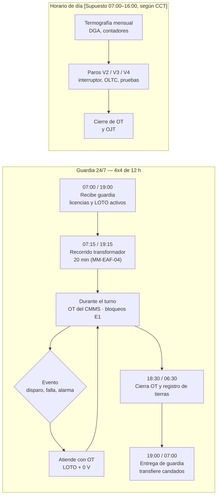
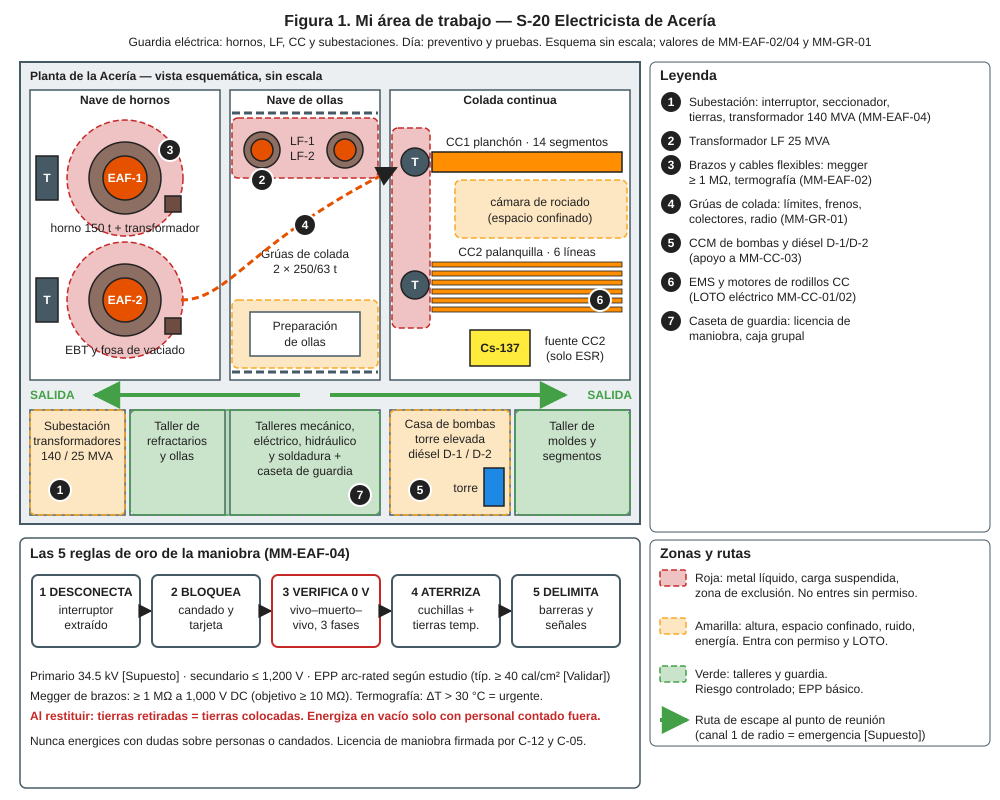
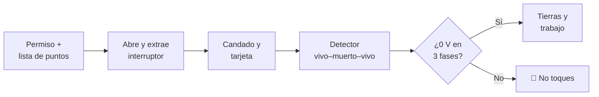
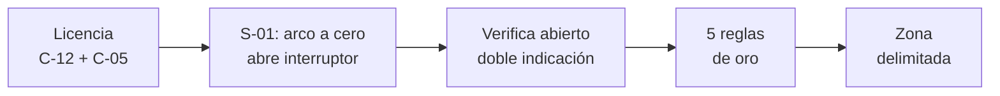
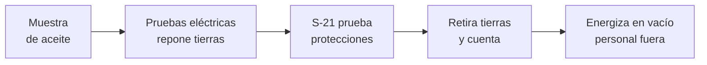
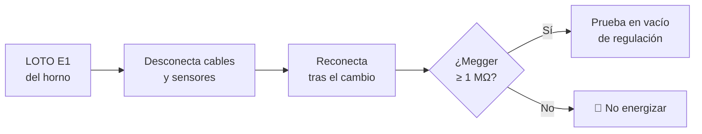
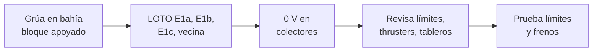

# IT-ACE-S20 — Instrucción de Trabajo: S-20 Electricista de Acería

## 1. Encabezado de control

| Campo | Valor |
|---|---|
| Código | IT-ACE-S20 |
| Versión | 0.1 |
| Estado | Borrador para validación |
| Rol | S-20 Electricista de Acería — Técnico C (N-6) / B (N-7) / A (N-8) |
| Área | Mantenimiento de Acería: transformadores del EAF (140 MVA) y del LF (25 MVA), subestaciones, motores, grúas y CC |
| Turno | Guardia 4x4 de 12 h (relevo 07:00 / 19:00) y horario de día (preventivo, pruebas y paros) |
| Reporta a | C-12 Supervisor de Mantenimiento Eléctrico e Instrumentación |
| Manuales de referencia | MM-EAF-04, MM-EAF-02, MM-GR-01 · apoyo en MM-EAF-01, MM-CC-01, MM-CC-02, MM-CC-03 · MS-ACE-02, -04, -05, -10 · DP-ACE-S (S-20) |
| Elaboró | gerente-personal-sindicalizado (Líder de la Academia de Mantenimiento y Confiabilidad) |
| Revisión técnica | experto-operativo-metalurgia — visto bueno (con observaciones), 2026-09-26 |
| Revisión de seguridad | Pendiente — experto-seguridad-salud |
| Revisión laboral | Pendiente — experto-relaciones-laborales |
| Aprobó | Pendiente — Director |
| Fecha | 2026-09-25 |

> Esta IT resume tu trabajo; **no reemplaza al manual**. Los valores salen tal cual de los manuales. El primario de 34.5 kV es **[Supuesto]** y los límites de prueba son **[Validar con OEM]**: no se usan en planta hasta validarse.

## 2. Mi puesto en 30 segundos
Mantengo el sistema eléctrico de la Acería disponible y seguro. Soy el único que opera interruptores y seccionadores de media y alta tensión y aplica tierras. Ejecuto las maniobras del horno con licencia, cuido el transformador y mantengo motores, frenos y límites de las grúas. Mi meta es cero contactos eléctricos.

> ★ **Mis 3 reglas de oro**
> 1. ★ **Sin licencia de maniobra firmada, no toco la media tensión.**
> 2. ★ **Vivo–muerto–vivo:** pruebo el detector antes y después; 0 V en las 3 fases o no trabajo.
> 3. ★ **Tierras colocadas = tierras retiradas.** Nunca energizo con dudas sobre personas o candados.

## 3. Mi turno de 12 horas

- **Cada semana** lee los contadores del OLTC y del interruptor y revisa el monitor de DGA en línea.
- **Cambio de turno con LOTO activo:** el entrante pone su candado antes de que el saliente quite el suyo (MS-ACE-02 §6.3).

## 4. Mi área de trabajo

## 5. Mi EPP

| Pictograma | EPP | Cuándo lo uso |
|---|---|---|
| [CASCO-E] | Casco clase E con barbiquejo, lentes | Siempre en nave y subestación |
| [ARCO] | Ropa y careta/capucha arc-rated de la categoría de la celda | Maniobras y trabajo en celdas (típ. ≥ 40 cal/cm² [Validar]) |
| [GUANTE-D] | Guantes dieléctricos clase según voltaje, con protector de cuero | Maniobras y detector de tensión; probados cada 6 meses |
| [BOTA-D] | Botas dieléctricas | Subestación y tableros |
| [PÉRTIGA] | Pértiga y detector de tensión certificados | Verificar ausencia de tensión en MT |
| [ARNÉS] | Arnés con línea de vida | Grúas, boquillas del transformador (≥ 1.8 m) |
| [ALUMINIZADO] | Ropa aluminizada | Termografía de brazos en operación, a distancia segura |
| [OÍDO] | Protección auditiva | Nave, casa de bombas y diésel |

## 6. Mis tareas paso a paso

### Tarea 1 — LOTO eléctrico y prueba de ausencia de tensión (MS-ACE-02)
Aplica también cuando bloqueas para otros: E1 del EAF (MM-EAF-01), EMS y sensores (MM-CC-01), motores de rodillos (MM-CC-02) y CCM de bombas y diésel (MM-CC-03).

| Paso | Qué hago | Cómo verifico (medición) | ★ |
|---|---|---|---|
| 1 | Revisa el permiso y la lista de puntos eléctricos del equipo. | Cada punto de la figura tiene su número en campo. | ★ |
| 2 | En AT: abre y extrae el interruptor, abre el seccionador. En BT: abre el interruptor del CCM. | Posición visible de "abierto". | ★ |
| 3 | Pon candado de equipo, tarjeta y **tu** candado personal. | Un candado por persona. | ★ |
| 4 | Prueba el detector en fuente conocida, mide las 3 fases y vuelve a probar. | 0 V en las 3 fases. | ★ |
| 5 | En AT: cierra cuchillas de tierra y coloca tierras temporales. | Tierras visibles; anótalas en el registro. | ★ |
| 6 | Pide a púlpito un intento de arranque o cierre. | Mando rechazado; regresa los mandos a "apagado". | ★ |

> 🛑 **ALTO — detén y avisa si…**
> - El detector marca tensión o no pasa la prueba en fuente conocida.
> - Aparece tensión inducida: aplica tierras en ambos lados del trabajo.
> - Falta un candado o una tarjeta de la lista.

### Tarea 2 — Maniobra de alta tensión del transformador del horno (MM-EAF-04) · lidero la ejecución (A)

| Paso | Qué hago | Cómo verifico (medición) | ★ |
|---|---|---|---|
| 1 | Revisa la licencia de maniobra con el unifilar actualizado. | Licencia firmada por C-12 y C-05. | ★ |
| 2 | Haz la charla previa: pasos, EPP, distancias y rescate. | Todos entienden su papel. | |
| 3 | Pide a S-01 subir electrodos y abrir el interruptor desde el púlpito. | Indicación "abierto". | ★ |
| 4 | Verifica abierto en el interruptor. | Indicador eléctrico y mecánico: ambos "abierto". | ★ |
| 5 | Extrae el interruptor o abre el seccionador con EPP arc-rated. | Aislamiento visible. | ★ |
| 6 | Bloquea interruptor, seccionador y CCM de auxiliares. | Candados y tarjetas personales puestos. | ★ |
| 7 | Verifica ausencia de tensión con el detector MT. | Fuente conocida → 3 fases → fuente conocida: 0 V. | ★ |
| 8 | Cierra cuchillas de tierra; tierras temporales en primario y secundario. | Tierras colocadas y visibles; registro. | ★ |
| 9 | Coloca barreras y señales. | Zona delimitada (límite de aproximación de NOM-029). | ★ |

> 🛑 **ALTO — detén y avisa si…**
> - No hay licencia firmada o el unifilar no coincide con campo.
> - El indicador eléctrico y el mecánico no coinciden.
> - El enclavamiento seccionador–interruptor no funciona.

### Tarea 3 — Pruebas del transformador y restitución (MM-EAF-04) · A

| Paso | Qué hago | Cómo verifico (medición) | ★ |
|---|---|---|---|
| 1 | Toma la muestra de aceite con jeringa de vidrio, sin burbujas. | Muestra etiquetada y válida. | 🔎 |
| 2 | Retira tierras solo del devanado bajo prueba y regístralo. | Megger 5 kV ≥ 1,000 MΩ [Validar]; PI ≥ 1.5 (objetivo ≥ 2.0). | ★ 🔎 |
| 3 | Haz Tan δ, TTR y resistencia; descarga y **repón las tierras**. | Tan δ ≤ 0.5 %; TTR ±0.5 %; resistencia ±2 % entre fases. | ★ 🔎 |
| 4 | Mantén interruptor u OLTC según OEM y contador. | Resistencia de contactos ≤ 1.2 × valor de fábrica. | |
| 5 | Espera la prueba de protecciones de S-21 (87T, 50/51, 51N, Buchholz). | Disparo correcto; si no dispara, no se energiza. | ★ |
| 6 | Retira tierras temporales y cuéntalas; abre cuchillas; retira candados. | Tierras retiradas = tierras colocadas. | ★ |
| 7 | Con personal contado fuera y barreras repuestas, cierra en vacío. | Sin alarmas; ruido y corriente de magnetización normales. | ★ |
| 8 | Firma el checklist de liberación con C-12 y C-05. | PI ≥ 1.5; protecciones en servicio; OLTC recorre todas las derivaciones. | ★ |

> 🛑 **ALTO — detén y avisa si…**
> - Disparo por Buchholz o 87T: **no re-energices**; DGA urgente.
> - PI < 1.25: no energices; secado.
> - El conteo de tierras no cuadra con el registro.

### Tarea 4 — Brazos: desconexión, megger y prueba de regulación tras cambio de bóveda (MM-EAF-02) · R

| Paso | Qué hago | Cómo verifico (medición) | ★ |
|---|---|---|---|
| 1 | Aplica E1 (Tarea 1) con candado en la caja grupal del horno. | 0 V con detector; candado puesto. | ★ |
| 2 | Desconecta cables secundarios, sensores y control de regulación; identifica cada uno. | Etiquetas en cada conexión. | |
| 3 | Reconecta después del cambio de bóveda o delta. | Conexiones según etiqueta; torque de zapata registrado por S-19. | |
| 4 | Mide aislamiento brazo–columna y mordaza–brazo. | Megger 1,000 V DC, 1 min: ≥ 1 MΩ (objetivo ≥ 10 MΩ). | ★ |
| 5 | Tras retirar LOTO, prueba en vacío la regulación con S-21 y S-22. | Movimientos dentro del tiempo OEM. | 🔎 |
| 6 | Termografía mensual en operación de brazos, zapatas y cables. | ΔT ≤ 10 °C; 10–30 °C investiga; > 30 °C urgente. | 🔎 |

> 🛑 **ALTO — detén y avisa si…**
> - Megger < 1 MΩ: limpia o cambia aisladores antes de energizar.
> - Hay arco entre brazo y bóveda o columna.

### Tarea 5 — Grúas de colada: límites, frenos y colectores (MM-GR-01) · R

| Paso | Qué hago | Cómo verifico (medición) | ★ |
|---|---|---|---|
| 1 | Abre seccionador de rieles (E1a) e interruptor de la grúa (E1b); apaga radio y retira llave (E1c). | Candados puestos; grúa vecina bloqueada. | ★ |
| 2 | Prueba energía cero en colectores. | Detector de tensión: 0 V en 3 fases; movimiento rechazado. | ★ |
| 3 | Sube anclado; revisa límites, cableado, thrusters y pantallas. | Siempre conectado; thruster sin fuga. | ★ |
| 4 | Retira LOTO con el personal fuera de la grúa. | Candados retirados; conteo de personal. | ★ |
| 5 | Prueba límites a baja velocidad con S-09. | 1.º corta; 2.º corta (1.º puenteado solo bajo control de C-11). | ★ |
| 6 | Prueba frenos uno por uno con S-19 (mensual). | F1, F2 y F3 sostienen sin deslizar; nadie bajo la carga. | ★ |
| 7 | Calibra el limitador de carga (semestral). | Disparo al 110 % ±5 %. | 🔎 |

> 🛑 **ALTO — detén y avisa si…**
> - Un límite no corta o F3 no actúa: grúa fuera de servicio.
> - Falla eléctrica con olla suspendida: los frenos sostienen; despeja debajo.

## 7. Mis controles críticos (★)
- ☐ Licencia de maniobra firmada por C-12 y C-05 (para MT).
- ☐ Mi certificación NOM-029 y la autorización escrita del patrón están vigentes.
- ☐ EPP arc-rated de la categoría de la celda puesto.
- ☐ Detector probado vivo–muerto–vivo; 0 V en las 3 fases.
- ☐ Tierras colocadas en ambos lados y anotadas.
- ☐ Mi candado personal en cada punto o en la caja grupal.
- ☐ Antes de energizar: tierras contadas, personal contado fuera, protecciones probadas.
- ☐ Anclado al 100 % en grúas y boquillas.

## 8. Si algo sale mal

| Síntoma | Qué hago | A quién aviso |
|---|---|---|
| Contacto eléctrico o arco con lesionado | No toques a la persona sin cortar la energía; emergencia MS-ACE-09. | C-04 · radio canal 1 (emergencia) [Supuesto] |
| Disparo por Buchholz o 87T | 🛑 No re-energices; toma muestra de gas y aceite. | C-12, C-10, C-05 · canal de mantenimiento [Supuesto] |
| C₂H₂ creciente en el tanque | Avisa para evaluar sacar de servicio con OEM. | C-12, C-14 |
| Alarma de fuga aceite–agua | Aísla el intercambiador; revisa humedad del aceite. | C-12 |
| Aceite > 85 °C | Pide a S-01 reducir potencia; revisa bombas y agua. | S-01, C-12 |
| OLTC no cambia | Bloquea el OLTC en derivación segura. | C-12, C-07 |
| Punto caliente > 30 °C ΔT | Programa paro para reapriete. | C-12 |
| Límite de grúa no corta | 🛑 Grúa fuera de servicio para colada. | C-11, C-04 |

## 9. Registros que lleno

| Registro | Cuándo | Dónde |
|---|---|---|
| Licencia de maniobra y registro de tierras (colocadas / retiradas) | Cada maniobra | Libro de maniobras de la subestación |
| Recorrido diario del transformador | Cada turno | CMMS |
| Contadores del OLTC e interruptor | Semanal | CMMS |
| DGA, fisicoquímicos y pruebas eléctricas con corrección de temperatura | Mensual / anual | CMMS y reporte de laboratorio |
| Megger de brazos y termografías | Trimestral / mensual | CMMS |
| Pruebas de límites, frenos y limitador de grúa | Semanal / mensual / semestral | Expediente NOM-006 de la grúa |
| Checklist de liberación firmado | Cada liberación | CMMS |

## 10. Mi certificación

| Concepto | Detalle |
|---|---|
| Nivel ILUO requerido | **L** Técnico C (baja tensión, con guía) · **U** Técnico B (MM-GR-01 y MM-EAF-02 solo) · **O** Técnico A (maniobra de alta tensión con licencia interna, da el liberado, evaluador) |
| Teoría | Ruta técnica 80 h · NOM-029 16 h + maniobras MT 16 h + arco eléctrico 8 h · pruebas a transformadores 24 h · grúas 16 h |
| OJT | C → B: 150 OT (480 h) · B → A: 20 maniobras de AT supervisadas · MM-EAF-04: 5 maniobras supervisadas |
| Pasos ★ que me evalúan | MM-EAF-04: 3–9, 11, 14, 15 · MM-EAF-02: 3, 4, 13 · MM-GR-01: 3, 4, 9, 11, 12 · MS-ACE-02: 4, 9 (vivo–muerto–vivo) |
| Vigencia | **12 meses:** eléctrico (NOM-029, MM-EAF-04), grúas e izaje (MM-GR-01), alturas, espacios confinados. **24 meses:** demás TD-P07 |
| DC-3 / NOM | NOM-029 (BT en C; AT en A), NOM-009, NOM-017, NOM-022; autorización escrita del patrón — verificar con Jurídico Laboral / SSO |

## 11. Glosario rápido
- **MT / AT:** media y alta tensión.
- **Licencia de maniobra:** permiso escrito de C-12 con los pasos de la maniobra.
- **Vivo–muerto–vivo:** probar el detector en fuente viva, medir, y volver a probarlo.
- **Tierras temporales:** cables que ponen a tierra el punto de trabajo.
- **OLTC:** cambiador de derivaciones bajo carga del transformador.
- **DGA:** análisis de gases disueltos en el aceite.
- **Buchholz:** relé que detecta gas o falla dentro del transformador.
- **Megger / PI:** prueba de aislamiento / índice de polarización.
- **Arc flash:** arco eléctrico que quema; el EPP se elige por estudio.
- **Thruster:** actuador que abre el freno de la grúa.

## 12. Control de cambios

| Versión | Fecha | Cambio | Autor |
|---|---|---|---|
| 0.1 | 2026-09-25 | Emisión inicial para validación, a partir de DP-ACE-S (S-20), MM-EAF-04, MM-EAF-02, MM-GR-01 y MS-ACE-02 | gerente-personal-sindicalizado (Academia de Mantenimiento y Confiabilidad) |
