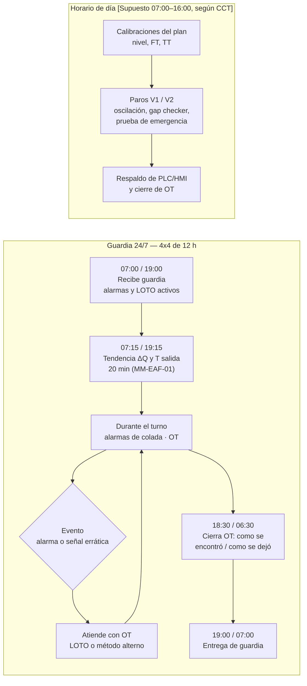
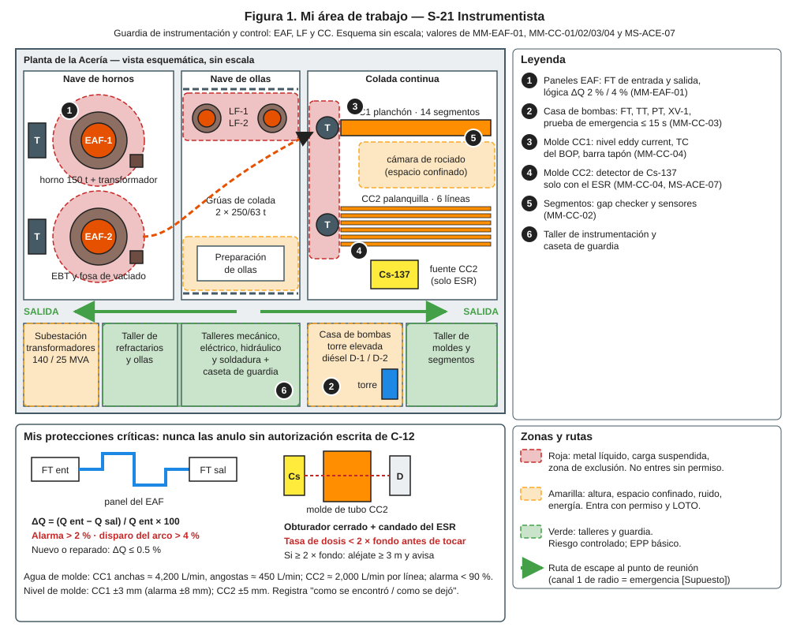
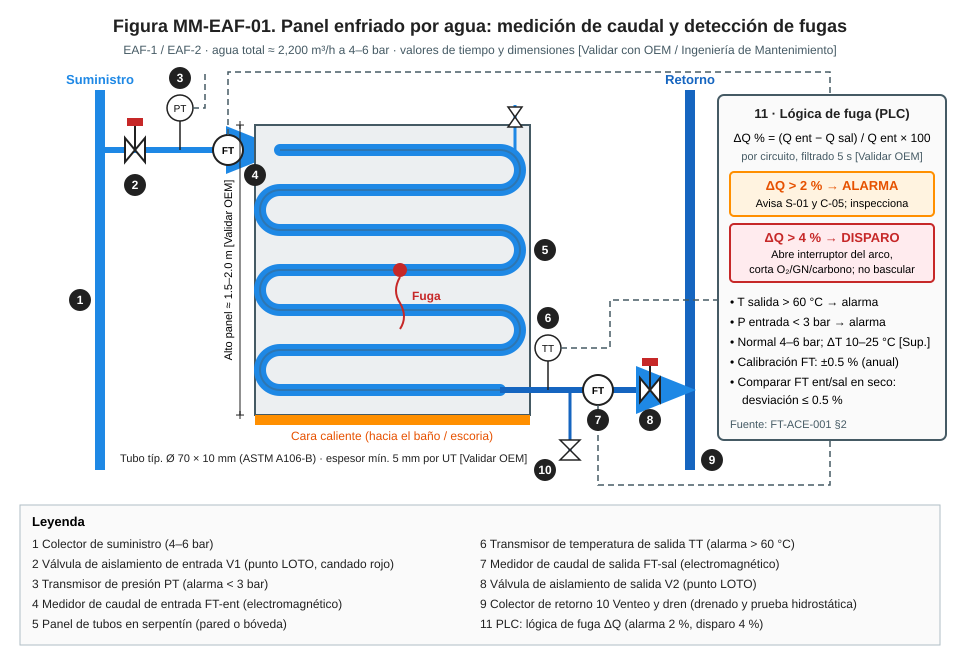
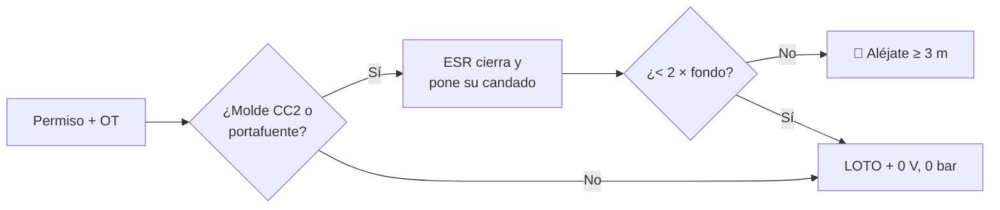
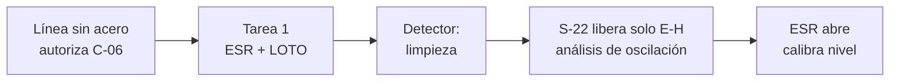
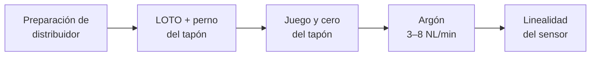
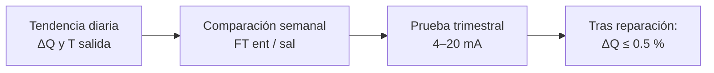
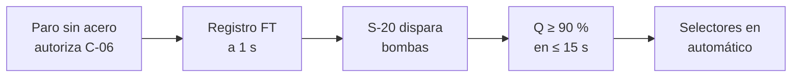
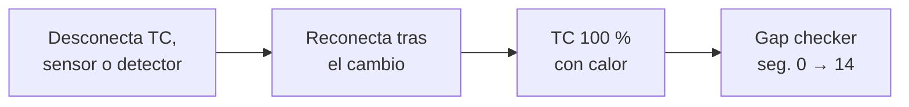

# IT-ACE-S21 — Instrucción de Trabajo: S-21 Instrumentista

## 1. Encabezado de control

| Campo | Valor |
|---|---|
| Código | IT-ACE-S21 |
| Versión | 0.1 |
| Estado | Borrador para validación |
| Rol | S-21 Instrumentista · sindicalizado — Técnico C (N-6) / B (N-7) / A (N-8); POE designado para la fuente de Cs-137 |
| Área | Mantenimiento de Acería: instrumentación y control de EAF, LF y CC (agua, fugas, nivel de molde, BOP, oscilación) |
| Turno | Guardia 4x4 de 12 h (relevo 07:00 / 19:00) y horario de día (calibraciones, pruebas y paros) · jornada según el CCT [CCT: pedir texto] |
| Reporta a | C-12 Supervisor de Mantenimiento Eléctrico e Instrumentación |
| Manuales de referencia | MM-CC-04, MM-EAF-01, MM-CC-03, MM-CC-01, MM-CC-02 · MS-ACE-02, -03, -07 · DP-ACE-S (S-21) |
| Elaboró | gerente-personal-sindicalizado (Líder de la Academia de Mantenimiento y Confiabilidad) |
| Revisión técnica | experto-operativo-metalurgia — visto bueno (con observaciones), 2026-09-26 |
| Revisión de seguridad | experto-seguridad-salud — visto bueno, 2026-09-26 |
| Revisión laboral | experto-relaciones-laborales — visto bueno (con observaciones), 2026-09-26 |
| Aprobó | Pendiente — Director |
| Fecha | 2026-09-25 |

> Esta IT resume tu trabajo; **no reemplaza al manual**. Valores tal cual de los manuales. Los límites de radiación son **[Validar con ESR]** según la licencia CNSNS.

## 2. Mi puesto en 30 segundos
Aseguro que las mediciones y protecciones de la Acería sean exactas y funcionen cuando se necesitan. Cuido la detección de fugas del EAF y el agua de molde con su emergencia. También el nivel de molde, el BOP y la oscilación. En CC2 trabajo con la fuente de Cs-137 solo con el ESR. Si un instrumento no es confiable, lo declaro y pido operar en modo seguro. Sin funciones de mando (LFT art. 9): si algo no está bien, **aviso, detengo y escalo** a C-12.

> ★ **Mis 3 reglas de oro**
> 1. ★ **Nunca anulo una alarma o un disparo** sin autorización escrita de C-12 y medida compensatoria.
> 2. ★ **La fuente de Cs-137 la opera solo el ESR.** Mido < 2 × fondo antes de tocar.
> 3. ★ **Después de intervenir, pruebo:** alarma a 2 % y disparo a 4 % en el EAF; emergencia de CC ≤ 15 s.

## 3. Mi turno de 12 horas

- **Cada día:** conductividad y nivel de torre (MM-CC-03). **Cada semana:** compara FT de entrada y salida del EAF con agua y sin arco.

> **Mi jornada (nota laboral).** Mi turno está pactado en el CCT [CCT: pedir texto]. El relevo y la entrega–recepción antes de las 07:00 / 19:00 son tiempo de trabajo (LFT art. 58). Se cuentan en la jornada o se pagan según el CCT. La jornada de 12 h y la reforma de 40 h están en revisión (arts. 59–61 y 66–68) — verificar con Jurídico Laboral.

## 4. Mi área de trabajo

## 5. Mi EPP

| Pictograma | EPP | Cuándo lo uso |
|---|---|---|
| [CASCO] | Casco, lentes, botas metatarsales, ropa FR | Siempre en nave |
| [DOSÍMETRO] | Dosímetro personal | Siempre como POE; zona controlada de la fuente (CC2) |
| [RADIÁMETRO] | Radiámetro con el ESR | Antes de tocar el molde o el detector de CC2 |
| [ELÉCTRICO] | EPP eléctrico según categoría del tablero | Tableros, relés y lazos energizados (NOM-029) |
| [ARNÉS] | Arnés con línea de vida | Torre de agua, plataformas (≥ 1.8 m) |
| [ALUMINIZADO] | Ropa aluminizada | Cerca de horno, olla o molde con acero (MS-ACE-01) |
| [OÍDO] | Protección auditiva | Casa de bombas y diésel |

## 6. Mis tareas paso a paso

### Tarea 1 — LOTO y fuente de Cs-137 cerrada antes de intervenir (MS-ACE-02, MS-ACE-07)

| Paso | Qué hago | Cómo verifico (medición) | ★ |
|---|---|---|---|
| 1 | Revisa OT y permiso; en CC2, el permiso de fuente lo emite el ESR. | Permisos firmados. | ★ |
| 2 | Pide al ESR (C-16) cerrar el obturador y poner su candado. Tú no lo operas. | Indicador "cerrado" y candado del ESR. | ★ |
| 3 | El ESR mide en el punto de trabajo y a 1 m del detector. | < 2 × fondo (fondo ≈ 0.1–0.3 µSv/h), anotado en el permiso. | ★ |
| 4 | Pon tu candado personal en E1 (tableros) y los puntos que toquen. | Un candado por persona. | ★ |
| 5 | Prueba energía cero. | 0 V con detector; mando rechazado; 0 bar. | ★ |

> 🛑 **ALTO — detén y avisa si…**
> - Radiámetro ≥ 2 × fondo con obturador "cerrado", o el indicador no coincide.
> - Te piden trabajar energizado sin método alterno aprobado por C-16 y C-12.

### Tarea 2 — Análisis de oscilación y calibración de nivel en CC2 (MM-CC-04) · lidero la ejecución (A)

| Paso | Qué hago | Cómo verifico (medición) | ★ |
|---|---|---|---|
| 1 | Confirma línea sin acero y autorización de C-06. | Distribuidor retirado o línea tapada. | ★ |
| 2 | Aplica la Tarea 1 con E-H, E1, E-Ar y E-M. | Candados; < 2 × fondo; energía cero. | ★ |
| 3 | Mantén el detector: limpieza, conexiones y enfriamiento. | Sin daño; con dosímetro. | ★ |
| 4 | Con personal fuera de la mesa, S-22 retira solo E-H. Coloca acelerómetros triaxiales. | Oscila a 3 frecuencias del rango. | |
| 5 | Mide y registra la oscilación. | Frecuencia ±1 cpm; carrera ±0.1 mm; lateral ≤ 0.15 mm (rechazo > 0.20). | 🔎 |
| 6 | El ESR abre el obturador; solo el POE con dosímetro queda en zona. | Indicador "abierto"; cuentas estables. | ★ |
| 7 | Calibra el nivel en 2 puntos con el ESR presente. | ±2 % (fuera > ±5 %: recalibra). | ★ 🔎 |
| 8 | Retira el LOTO restante; firma con C-12, ESR y C-06. | Señal de nivel ±5 mm con el púlpito. | ★ |

> 🛑 **ALTO — detén y avisa si…**
> - El portafuente está golpeado, expuesto a metal o a fuego: evacúa; el ESR activa su plan.
> - El análisis marca lateral > 0.20 mm: no liberes; cambio de resortes o guías.

### Tarea 3 — Barra tapón y nivel de CC1 (MM-CC-04) · A

| Paso | Qué hago | Cómo verifico (medición) | ★ |
|---|---|---|---|
| 1 | Aplica LOTO E-H, E1, E-Ar y el perno mecánico del tapón. | Perno puesto; 0 bar; 0 V. | ★ |
| 2 | Mide el juego del mecanismo con indicador de carátula (con S-19). | ≤ 0.5 mm (objetivo ≤ 0.3); > 1.0 mm cambia bujes. | 🔎 |
| 3 | Calibra el cero del tapón (cerrado). | ±0.5 mm; > ±1 mm recalibra. | 🔎 |
| 4 | Revisa la línea de argón al tapón. | 3–8 NL/min estable, sin fugas. | 🔎 |
| 5 | Calibra el sensor eddy current con placa patrón (cada molde o quincenal). | Linealidad ±1 mm; > ±2 mm cambia sensor. | 🔎 |

> 🛑 **ALTO — detén y avisa si…**
> - El nivel oscila ("hunting") en colada: revisa juego y argón con C-06.
> - El perno del tapón no entra o falta.

### Tarea 4 — Lógica de fuga ΔQ del EAF (MM-EAF-01) · R

| Paso | Qué hago | Cómo verifico (medición) | ★ |
|---|---|---|---|
| 1 | Revisa la tendencia de ΔQ y T de salida por circuito. | ΔQ ≤ 0.5 % normal; alarma > 2 %; disparo > 4 %; T salida > 60 °C alarma. | 🔎 |
| 2 | Compara FT de entrada y salida con agua circulando y arco apagado. | Diferencia dentro de ±0.5 % (FT electromagnéticos). | 🔎 |
| 3 | Con C-12 y LOTO del horno, simula señal 4–20 mA. | Alarma a 2 % y disparo a 4 % (±0.2 %). | ★ |
| 4 | Tras cambiar o tocar un FT, repite la prueba de lógica. | Registro con firma de C-12. | ★ |
| 5 | Tras una reparación, circula agua 10 min con S-19. | ΔQ ≤ 0.5 %; T estable; P 4–6 bar. | ★ |

> 🛑 **ALTO — detén y avisa si…**
> - La lógica no dispara en la prueba: **no se opera el horno** hasta corregir.
> - ΔQ oscila sin fuga visible: ventea y limpia electrodos del FT; avisa a C-05.

### Tarea 5 — Prueba mensual de cambio a emergencia de CC (MM-CC-03) · R

| Paso | Qué hago | Cómo verifico (medición) | ★ |
|---|---|---|---|
| 1 | Confirma la ventana de paro sin acero en CC1 y CC2. | Autorización de C-06. | ★ |
| 2 | Verifica condiciones iniciales con S-19. | Torre ≥ 90 %; diésel ≥ 75 %; baterías ≥ 25.5 V; XV-1 cerrada. | |
| 3 | Activa la tendencia de FT de moldes a 1 s. | Registro activo. | 🔎 |
| 4 | Tras el disparo, verifica caudal en todas las caras y líneas con S-12. | ≥ 90 % en ≤ 15 s. | ★ |
| 5 | Restablece bombas, XV-1 y torre con S-19. | Torre ≥ 90 %. | ★ |
| 6 | Verifica selectores en automático con S-12. | Doble verificación; ningún candado de prueba olvidado. | ★ |

> 🛑 **ALTO — detén y avisa si…**
> - El cambio tarda > 15 s o el caudal queda < 90 %: **no se cuela**.

### Tarea 6 — Termopares BOP, nivel y gap checker en cambios de molde y segmento (MM-CC-01, MM-CC-02) · R

| Paso | Qué hago | Cómo verifico (medición) | ★ |
|---|---|---|---|
| 1 | Desconecta termopares, sensor de nivel y, en CC2, el detector con fuente bloqueada (Tarea 1). | Conexiones identificadas. | ★ |
| 2 | Reconecta y prueba cada TC con pistola de calor. | Todos leen; ±3 °C entre vecinos. | 🔎 |
| 3 | Calibra el gap checker en bloque patrón. | Error ≤ ±0.05 mm [Validar]. | 🔎 |
| 4 | Acopla a la barra falsa con LOTO parcial bajo control del púlpito. | Acople seguro; nadie en cámara de rociado ni plataformas. | ★ |
| 5 | Corre del segmento 0 al 14 y compara con la tabla de C-08. | Gap ±0.5 mm; 100 % de rodillos giran. | 🔎 |

> 🛑 **ALTO — detén y avisa si…**
> - Un TC queda abierto o sin respuesta: cámbialo antes de liberar.
> - El gap checker no pasa: no se arranca la colada.

## 7. Mis controles críticos (★)
- ☐ Permiso y OT firmados; en CC2, permiso de fuente del ESR.
- ☐ Obturador cerrado con candado del ESR y < 2 × fondo medido.
- ☐ Mi dosímetro puesto (POE).
- ☐ Mi candado personal en tableros y puntos intervenidos.
- ☐ Ninguna alarma o disparo anulado sin autorización escrita de C-12.
- ☐ Patrón o calibrador con certificado vigente.
- ☐ Prueba funcional hecha antes de liberar (lógica, emergencia, nivel).

## 8. Si algo sale mal

| Síntoma | Qué hago | A quién aviso |
|---|---|---|
| Radiámetro ≥ 2 × fondo con obturador cerrado | 🛑 Aléjate ≥ 3 m y delimita. | ESR (C-16), C-06 · radio canal 1 (emergencia) [Supuesto] |
| Señal radiométrica errática | Operación pasa a nivel manual; revisa con el ESR. | C-06, ESR |
| ΔQ entre 2 y 4 % | Revisión visual con arco apagado; compara FT. | C-05 · canal de mantenimiento [Supuesto] |
| ΔT de molde > 11 °C (CC1) / > 12 °C (CC2) con caudal normal | Operación reduce velocidad; verifica TT. | C-08, C-06 |
| Alarma BOP repetitiva | Operación reduce velocidad; revisa TC al paro. | C-08 |
| Alarma de oscilación | Operación reduce velocidad o termina colada. | C-06, S-22 |
| Apagón con acero en máquina | Emergencia automática; apoya a operación (MS-ACE-09). | C-04, C-12 |

## 9. Registros que lleno

| Registro | Cuándo | Dónde |
|---|---|---|
| Calibración "como se encontró / como se dejó" con patrón | Cada calibración | CMMS |
| Prueba de lógica ΔQ | Trimestral y tras cambio de FT | CMMS |
| Prueba de cambio a emergencia (tiempos, caudales, firmas) | Mensual | Registro MM-CC-03 |
| Análisis de oscilación y calibración de nivel y tapón | Mensual / cada distribuidor | CMMS |
| Reporte del gap checker | Cada paro programado | CMMS |
| Constancia del ESR y dosimetría | Cada intervención / mensual | Bitácora del ESR |
| Autorización de alarma fuera de servicio | Cada caso | Permiso firmado por C-12 |

## 10. Mi certificación

| Concepto | Detalle |
|---|---|
| Nivel ILUO requerido | **L** Técnico C · **U** Técnico B (MM-EAF-01, MM-CC-01/02/03 solo) · **O** Técnico A (coordina técnicamente MM-CC-04, da el liberado técnico, evaluador en pareja; sin mando) |
| Teoría | Ruta técnica 80 h · MM-CC-04 24 h + protección radiológica POE (NOM-012) · MM-CC-03 24 h · MM-EAF-01 12 h · MM-CC-01 8 h · MM-CC-02 8 h |
| OJT | 150 OT (480 h) · 10 calibraciones de nivel supervisadas · 3 calibraciones con ESR · 2 pruebas de lógica · 3 pruebas de emergencia · 3 corridas de gap checker |
| Pasos ★ que me evalúan | MM-CC-04: 4, 7, 9, 11 · MM-EAF-01: 1, 15 + prueba de lógica · MM-CC-03: 1, 7, 10, 11 · MM-CC-01: 13 · MM-CC-02: 12; 8.1 pasos 2, 3 |
| Vigencia | **12 meses:** fuentes radiactivas (MS-ACE-07, NOM-012), eléctrico (NOM-029), alturas, espacios confinados, izaje. **24 meses:** demás TD-P07 |
| DC-3 / NOM | NOM-012 (POE), NOM-029, NOM-009, NOM-017; examen médico de POE y dosimetría — verificar con Jurídico Laboral / SSO |

> **Mi evaluación no es una sanción** (nota laboral — verificar con Jurídico Laboral)
> - La evaluación TD-P07 sirve para formarme, certificarme y acreditar mi aptitud. No se usa para sancionarme (DP-ACE-S §4).
> - Si aún no demuestro un paso ★, conservo mi categoría, mi salario y mi antigüedad. Recibo retroalimentación, OJT de refuerzo y otra oportunidad [Supuesto: 2 en ≤ 60 días, a validar con la CMCAP].
> - Si ya sé hacer el trabajo, puedo pedir el **examen de suficiencia** (LFT art. 153-U). Si lo apruebo, recibo mi DC-3 sin cursar toda la ruta.
> - La certificación prueba mi aptitud para ascender. Entre los aptos, asciende el de mayor antigüedad (LFT arts. 154–159 y CCT).
> - Si mi certificación se suspende tras un incidente grave, es una medida de seguridad, no una sanción. Paso a tarea no crítica sin perder salario ni antigüedad y me reevalúan en ≤ 15 días [Supuesto].
> - Mi capacitación y mis recertificaciones son en jornada y sin costo para mí. Si caen en mi descanso, se pagan según el CCT [CCT: pedir texto].

## 11. Glosario rápido
- **FT / TT / PT / LT:** transmisores de caudal, temperatura, presión y nivel.
- **ΔQ:** diferencia de caudal entrada–salida de un panel del EAF.
- **BOP:** predicción de breakout con termopares del molde.
- **Eddy current:** sensor de nivel por corrientes parásitas (CC1).
- **Cs-137:** fuente radiactiva sellada del nivel de CC2.
- **ESR:** Encargado de Seguridad Radiológica (C-16).
- **POE:** personal ocupacionalmente expuesto; lleva dosímetro.
- **Fondo:** radiación natural del lugar (≈ 0.1–0.3 µSv/h).
- **XV-1:** válvula que abre sin energía y conecta la torre.
- **Gap checker:** equipo que mide la separación entre rodillos.

## 12. Control de cambios

| Versión | Fecha | Cambio | Autor |
|---|---|---|---|
| 0.1 | 2026-09-25 | Emisión inicial para validación, a partir de DP-ACE-S (S-21), MM-CC-04, MM-EAF-01, MM-CC-01/02/03, MS-ACE-02 y MS-ACE-07 | gerente-personal-sindicalizado (Academia de Mantenimiento y Confiabilidad) |
