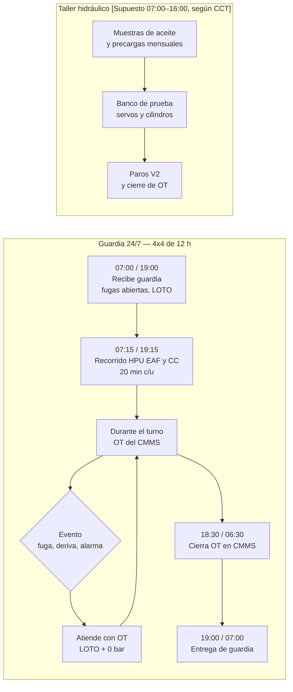
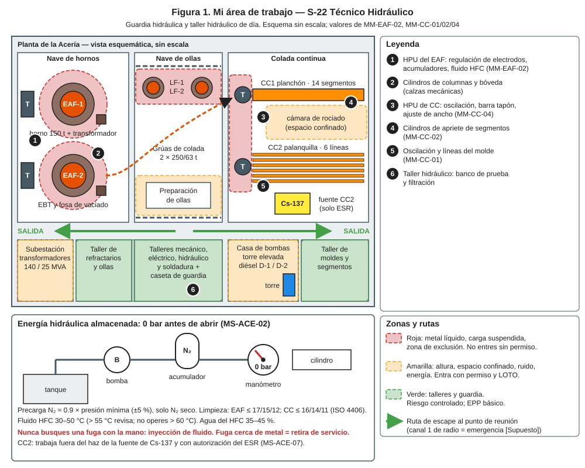
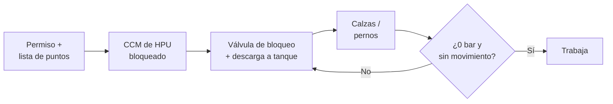
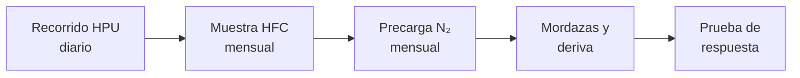
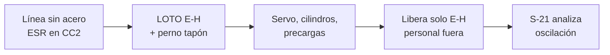
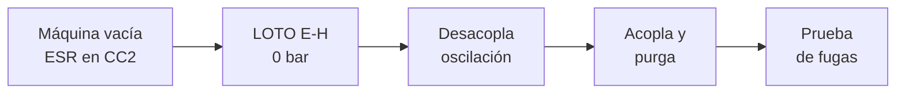
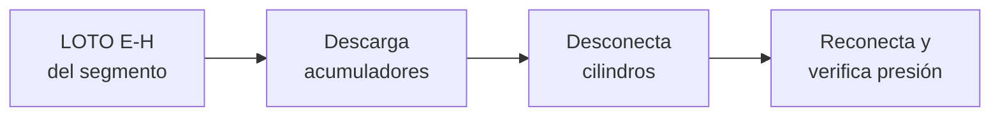

# IT-ACE-S22 — Instrucción de Trabajo: S-22 Técnico Hidráulico

## 1. Encabezado de control

| Campo | Valor |
|---|---|
| Código | IT-ACE-S22 |
| Versión | 0.1 |
| Estado | Borrador para validación |
| Rol | S-22 Técnico Hidráulico — Técnico C (N-5) / B (N-6) / A (N-7) |
| Área | Mantenimiento de Acería: regulación de electrodos (EAF/LF), oscilación, barra tapón, torreta, cilindros de segmentos, válvulas deslizantes y unidades hidráulicas |
| Turno | Guardia 4x4 de 12 h (relevo 07:00 / 19:00) y taller hidráulico en horario de día |
| Reporta a | C-11 Supervisor de Mantenimiento Mecánico (línea técnica de C-12 en MM-CC-04) |
| Manuales de referencia | MM-EAF-02, MM-CC-04, MM-CC-01, MM-CC-02 · MS-ACE-02, -04, -07 · DP-ACE-S (S-22) |
| Elaboró | gerente-personal-sindicalizado (Líder de la Academia de Mantenimiento y Confiabilidad) |
| Revisión técnica | experto-operativo-metalurgia (criterio aplicado por la Academia de Mantenimiento) — pendiente de firma del experto |
| Revisión de seguridad | Pendiente — experto-seguridad-salud |
| Revisión laboral | Pendiente — experto-relaciones-laborales |
| Aprobó | Pendiente — Director |
| Fecha | 2026-09-25 |

> Esta IT resume tu trabajo; **no reemplaza al manual**. Valores tal cual de los manuales. Presiones y precargas son del OEM **[Validar con OEM]**.

## 2. Mi puesto en 30 segundos
Mantengo los sistemas hidráulicos que regulan el arco del horno y controlan la colada. Cuido HPU, servoválvulas, cilindros y acumuladores. Descargo la energía almacenada antes de abrir cualquier circuito. No dejo fugas cerca del metal líquido porque el fluido a presión puede incendiarse o inyectarse en la piel.

> ★ **Mis 3 reglas de oro**
> 1. ★ **Acumuladores a 0 bar y calzas puestas** antes de abrir una línea.
> 2. ★ **Nunca busco fugas con la mano.** El chorro fino inyecta fluido en el cuerpo.
> 3. ★ **Fuga cerca del metal = sistema fuera de servicio.** Aviso y no libero.

## 3. Mi turno de 12 horas

- **Meta:** ninguna fuga hidráulica cerca de zonas calientes abierta > 24 h (DP-ACE-S).

## 4. Mi área de trabajo

## 5. Mi EPP

| Pictograma | EPP | Cuándo lo uso |
|---|---|---|
| [CASCO] | Casco, lentes, botas metatarsales, ropa FR | Siempre en nave |
| [CARETA] | Careta facial | Al abrir líneas o purgar |
| [NITRILO] | Guantes de nitrilo (y carnaza) | Contacto con fluido HFC o aceite |
| [ARNÉS] | Arnés con línea de vida | Columnas y bóveda del EAF, plataformas (≥ 1.8 m) |
| [DOSÍMETRO] | Dosímetro, si trabajas en la zona controlada | Molde de CC2, con autorización del ESR |
| [OÍDO] | Protección auditiva | HPU y talleres |
| [DERRAME] | Kit antiderrame | Todo trabajo con fluido |

## 6. Mis tareas paso a paso

### Tarea 1 — LOTO hidráulico y descarga de energía almacenada (MS-ACE-02)

| Paso | Qué hago | Cómo verifico (medición) | ★ |
|---|---|---|---|
| 1 | Revisa el permiso y los puntos hidráulicos (E2 en EAF; E-H en CC). | Lista firmada por C-11 / C-12. | ★ |
| 2 | Pide a S-20 bloquear el CCM de la HPU; pon tu candado. | Candado personal en la caja grupal. | ★ |
| 3 | Cierra la válvula de bloqueo de acumuladores y descarga a tanque. | Manómetro de acumulador 0 bar. | ★ |
| 4 | Verifica calzas bajo columnas, perno del tapón o de basculamiento. | Calzas y pernos rojos, visibles. | ★ |
| 5 | Pide un intento de movimiento desde HMI y mando local. | Sin movimiento; manómetros de sistema 0 bar. | ★ |
| 6 | Abre la línea solo con 0 bar confirmado; usa careta y kit antiderrame. | Sin salida de fluido a presión. | ★ |

> 🛑 **ALTO — detén y avisa si…**
> - La presión no baja de 0 bar: válvula con paso o acumulador sin descargar.
> - Una columna o la mesa se mueve con la HPU parada.

### Tarea 2 — Regulación hidráulica de electrodos y acumuladores del EAF (MM-EAF-02) · R

| Paso | Qué hago | Cómo verifico (medición) | ★ |
|---|---|---|---|
| 1 | Recorre la HPU: nivel, temperatura, ΔP de filtros, fugas. | HFC 30–50 °C (> 55 °C revisa; no operar > 60 °C); presión OEM (típ. 140 bar) ±5 %. | 🔎 |
| 2 | Toma la muestra de fluido HFC. | Agua 35–45 %; ISO 4406 ≤ 17/15/12 (objetivo 16/14/11). | 🔎 |
| 3 | Con Tarea 1 aplicada, mide la precarga de acumuladores. | 0.9 × presión mínima ±5 %; < 80 % recarga **solo con N₂ seco**. | ★ |
| 4 | En el cambio de bóveda, prueba apertura y cierre de mordazas 3 veces. | Mordaza abre y cierra; sin fuga. | 🔎 |
| 5 | Mide la deriva del cilindro con la válvula cerrada. | ≤ 5 mm en 10 min; > 10 mm revisa sellos y válvula. | 🔎 |
| 6 | Tras retirar LOTO, prueba la respuesta con S-21: escalón de 100 mm por columna. | Tiempo OEM ±10 %; sobreimpulso ≤ 20 %. | 🔎 |

> 🛑 **ALTO — detén y avisa si…**
> - Una columna deriva o "cae" con la HPU parada: calza y no trabajes debajo.
> - Hay fuga a alta presión: detén la HPU; no toques el chorro.

### Tarea 3 — Oscilación y barra tapón de CC (MM-CC-04) · R

| Paso | Qué hago | Cómo verifico (medición) | ★ |
|---|---|---|---|
| 1 | En CC2 espera que el ESR cierre el obturador y mida. | < 2 × fondo, anotado en el permiso; trabaja fuera del haz. | ★ |
| 2 | Aplica E-H (CCM, válvula de bloqueo, descarga) y el perno del tapón. | 0 bar; intento de oscilar rechazado. | ★ |
| 3 | Mantén servoválvulas, cilindros y acumuladores. | Precarga OEM ±5 %; aceite 40–50 °C. | ★ |
| 4 | Toma la muestra de aceite. | ISO 4406 ≤ 16/14/11 (objetivo 15/13/10); agua ≤ 500 ppm. | 🔎 |
| 5 | Con el personal fuera de la mesa, retira solo tu LOTO E-H. | Nadie en la mesa de oscilación. | ★ |
| 6 | Apoya el análisis de S-21 y ajusta el servo si hace falta. | Error de seguimiento ≤ 2 %; carrera ±0.1 mm. | 🔎 |

> 🛑 **ALTO — detén y avisa si…**
> - Aceite > 60 °C o fuga cerca del molde.
> - El indicador del obturador no coincide: aléjate ≥ 3 m.

### Tarea 4 — Oscilación y líneas hidráulicas en el cambio de molde (MM-CC-01) · R

| Paso | Qué hago | Cómo verifico (medición) | ★ |
|---|---|---|---|
| 1 | Aplica E-H de oscilación y ajuste de ancho; descarga acumuladores. | 0 bar; intento de oscilar rechazado. | ★ |
| 2 | Desacopla la oscilación y las líneas del molde; tapa las conexiones. | Conexiones limpias y tapadas. | |
| 3 | Tras instalar el molde nuevo, acopla y purga. | Purga según OEM [Validar OEM]. | |
| 4 | Presuriza y revisa fugas antes de liberar. | Sin fugas; presión OEM. | ★ |

> 🛑 **ALTO — detén y avisa si…**
> - Radiámetro ≥ 2 × fondo en CC2, o falta la firma de máquina vacía de C-06.

### Tarea 5 — Cilindros de apriete de segmentos (MM-CC-02) · R

| Paso | Qué hago | Cómo verifico (medición) | ★ |
|---|---|---|---|
| 1 | Cierra la válvula de bloqueo del segmento y descarga acumuladores. | Manómetros 0 bar; calzas puestas. | ★ |
| 2 | Desconecta los cilindros de apriete; identifica y tapa conexiones. | Sin fluido a presión. | ★ |
| 3 | Tras instalar el segmento, reconecta y presuriza. | Presión de apriete OEM ±5 %; sin fugas. | 🔎 |
| 4 | Revisa la presión de apriete cada semana. | Alarma OEM; baja presión puede abrir el gap. | 🔎 |

> 🛑 **ALTO — detén y avisa si…**
> - La presión de apriete cae: fuga en cilindro o acumulador; avisa a C-11.

## 7. Mis controles críticos (★)
- ☐ Permiso y OT firmados; certificación TD-P07 vigente.
- ☐ Mi candado personal en la caja grupal.
- ☐ Acumuladores descargados: manómetro en 0 bar.
- ☐ Calzas y pernos mecánicos puestos antes de abrir líneas.
- ☐ Intento de movimiento rechazado.
- ☐ Precarga solo con N₂ seco (NOM-020).
- ☐ En CC2: obturador cerrado por el ESR y < 2 × fondo.
- ☐ Nunca busco fugas con la mano.

## 8. Si algo sale mal

| Síntoma | Qué hago | A quién aviso |
|---|---|---|
| Fuga de fluido a alta presión | 🛑 Detén la HPU; no toques el chorro; si hay inyección, atención médica inmediata. | C-11, servicio médico · radio canal 1 (emergencia) [Supuesto] |
| Fuego en hidráulica | Aísla la HPU por el púlpito; emergencia MS-ACE-09. | C-04, brigada · canal 1 [Supuesto] |
| Columna cae o deriva | No trabajes debajo; calza. | C-11 · canal de mantenimiento [Supuesto] |
| Oscilación de corriente sin causa de proceso | Prueba de respuesta y muestra de aceite. | C-07, S-21 |
| HFC > 55 °C | Revisa enfriador y válvula de alivio. | C-11 |
| Alarma de oscilación en colada | Operación reduce velocidad o termina colada. | C-06, S-21 |
| Presión de apriete baja | Revisa cilindro y acumulador. | C-11, C-06 |

## 9. Registros que lleno

| Registro | Cuándo | Dónde |
|---|---|---|
| Recorrido de HPU (nivel, T, ΔP, fugas) | Cada turno | CMMS |
| Análisis de fluido (ISO 4406, % agua) | Mensual | CMMS / laboratorio de aceite |
| Precargas de acumuladores | Mensual | CMMS y expediente NOM-020 |
| Prueba de respuesta de regulación | Trimestral | Reporte de prueba |
| Reparación de servos y cilindros en banco | Cada reparación | Hoja de taller hidráulico |
| Permiso y lecturas de energía cero | Cada LOTO | Permiso de trabajo |

## 10. Mi certificación

| Concepto | Detalle |
|---|---|
| Nivel ILUO requerido | **L** Técnico C · **U** Técnico B (MM-EAF-02, MM-CC-01/02/04 como R) · **O** Técnico A (diagnóstico de fallas complejas, evaluador) |
| Teoría | Ruta técnica 64 h · MM-EAF-02 24 h · MM-CC-04 32 h · MM-CC-01 8 h · MM-CC-02 16 h |
| OJT | 100 OT (360 h) · 40 h en MM-EAF-02 · 40 h en MM-CC-04 · 3 bloqueos en MM-CC-01 · 2 intervenciones en MM-CC-02 |
| Pasos ★ que me evalúan | MM-EAF-02: 3, 4, 10, 16 · MM-CC-04: 4, 5, 8 · MM-CC-01: 4, 5 · MM-CC-02: 3, 4 |
| Vigencia | **12 meses:** alturas, espacios confinados, grúas e izaje. **24 meses:** demás TD-P07 |
| DC-3 / NOM | NOM-020 (acumuladores), NOM-004, NOM-009, NOM-017 — verificar con Jurídico Laboral / SSO |

## 11. Glosario rápido
- **HPU:** unidad hidráulica (tanque, bombas, filtros).
- **Acumulador:** recipiente con N₂ que guarda energía hidráulica.
- **Precarga:** presión de N₂ del acumulador sin fluido.
- **HFC:** fluido resistente al fuego de agua-glicol.
- **ISO 4406:** código de limpieza del aceite (partículas).
- **Servoválvula:** válvula de control fino de posición.
- **Deriva:** bajada lenta del cilindro con la válvula cerrada.
- **Calza:** bloqueo mecánico contra la gravedad.
- **Inyección de fluido:** fluido a presión que entra a la piel; es emergencia médica.

## 12. Control de cambios

| Versión | Fecha | Cambio | Autor |
|---|---|---|---|
| 0.1 | 2026-09-25 | Emisión inicial para validación, a partir de DP-ACE-S (S-22), MM-EAF-02, MM-CC-01/02/04 y MS-ACE-02 | gerente-personal-sindicalizado (Academia de Mantenimiento y Confiabilidad) |
