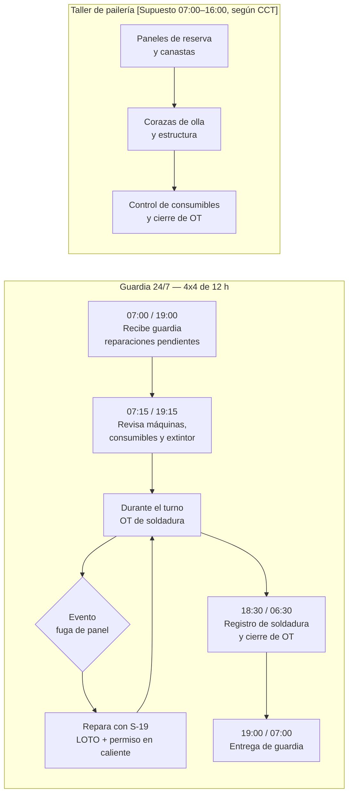
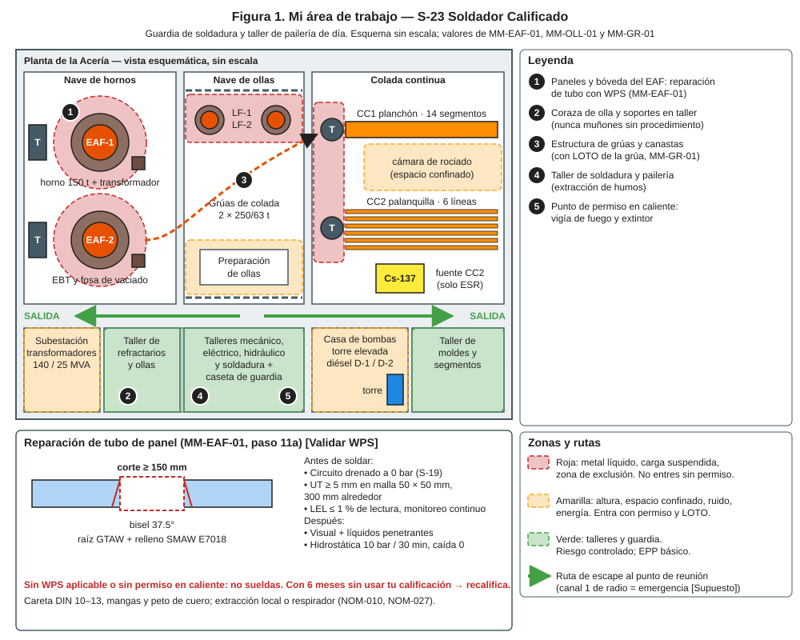
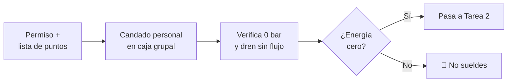
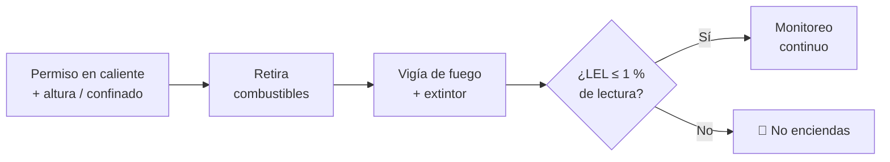
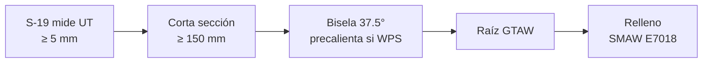
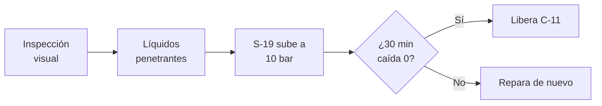
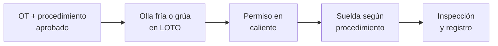

# IT-ACE-S23 — Instrucción de Trabajo: S-23 Soldador Calificado

## 1. Encabezado de control

| Campo | Valor |
|---|---|
| Código | IT-ACE-S23 |
| Versión | 0.1 |
| Estado | Borrador para validación |
| Rol | S-23 Soldador Calificado — Técnico C (N-5) / B (N-6) / A (N-7) |
| Área | Mantenimiento de Acería: paneles y bóveda enfriados por agua, estructura, canastas, corazas de olla y pailería |
| Turno | Guardia 4x4 de 12 h (relevo 07:00 / 19:00) y taller de soldadura y pailería en horario de día |
| Reporta a | C-11 Supervisor de Mantenimiento Mecánico |
| Manuales de referencia | MM-EAF-01 · apoyo en MM-OLL-01 y MM-GR-01 · MS-ACE-02, -03, -05, -06, -10 · DP-ACE-S (S-23) |
| Elaboró | gerente-personal-sindicalizado (Líder de la Academia de Mantenimiento y Confiabilidad) |
| Revisión técnica | experto-operativo-metalurgia (criterio aplicado por la Academia de Mantenimiento) — pendiente de firma del experto |
| Revisión de seguridad | Pendiente — experto-seguridad-salud |
| Revisión laboral | Pendiente — experto-relaciones-laborales |
| Aprobó | Pendiente — Director |
| Fecha | 2026-09-25 |

> Esta IT resume tu trabajo; **no reemplaza al manual ni al WPS**. Los parámetros de soldadura del manual son **[Validar WPS]**: manda siempre el WPS calificado vigente.

## 2. Mi puesto en 30 segundos
Reparo por soldadura, con procedimiento calificado (WPS), los componentes cuya falla puede echar agua sobre metal líquido o romper una estructura. Mi trabajo principal son los tubos de paneles y bóveda del EAF. También reparo canastas, corazas de olla y estructura, y fabrico en el taller de pailería. Una soldadura mal hecha en un panel es una fuga repetida sobre el horno.

> ★ **Mis 3 reglas de oro**
> 1. ★ **Sin WPS aplicable y sin permiso en caliente, no sueldo.**
> 2. ★ **Solo sueldo un circuito drenado, aislado y a 0 bar,** con LEL ≤ 1 % de lectura.
> 3. ★ **Toda reparación de panel pasa prueba hidrostática** de 10 bar por 30 min antes de liberar.

## 3. Mi turno de 12 horas

- **Cada panel reparado o nuevo** de reserva pasa prueba hidrostática antes de almacenarse (MM-EAF-01 §5.1).

## 4. Mi área de trabajo

## 5. Mi EPP

| Pictograma | EPP | Cuándo lo uso |
|---|---|---|
| [CASCO] | Casco, lentes, botas metatarsales, ropa FR | Siempre en nave |
| [CARETA-DIN] | Careta de soldar con filtro DIN 10–13 | Al soldar (NOM-027) |
| [CUERO] | Mangas, peto y guantes de cuero | Soldadura y oxicorte |
| [RESPIRADOR] | Extracción local o respirador | Humos metálicos (NOM-010) |
| [GAS] | Detector de 4 gases | Trabajo en caliente en el horno o espacios confinados |
| [ARNÉS] | Arnés con línea de vida | Paredes y bóveda del EAF, grúas (≥ 1.8 m) |
| [ALUMINIZADO] | Ropa aluminizada | Zona de horno caliente |
| [OÍDO] | Protección auditiva | Esmerilado y pailería |

## 6. Mis tareas paso a paso

### Tarea 1 — LOTO y energía cero antes de soldar (MS-ACE-02)

| Paso | Qué hago | Cómo verifico (medición) | ★ |
|---|---|---|---|
| 1 | Revisa que el permiso cubra LOTO E1–E6 del EAF. | Lista de puntos firmada por C-11. | ★ |
| 2 | Pon tu candado personal en la caja grupal. | Un candado por persona; nunca prestado. | ★ |
| 3 | Verifica con S-19 el circuito drenado y venteado. | Manómetro local 0 bar; sin flujo en el dren. | ★ |
| 4 | Verifica la prueba de energía cero anotada en el permiso. | Arco rechazado; 0 V (S-20); gases O₂/GN a 0 bar. | ★ |

> 🛑 **ALTO — detén y avisa si…**
> - El circuito sigue con presión o sale agua por el dren.
> - Falta un candado de la lista o la prueba de energía cero.

### Tarea 2 — Permiso en caliente y atmósfera (NOM-027, MS-ACE-05, MS-ACE-06)

| Paso | Qué hago | Cómo verifico (medición) | ★ |
|---|---|---|---|
| 1 | Revisa el permiso en caliente y, si aplica, altura y espacio confinado. | Permisos firmados y vigentes. | ★ |
| 2 | Retira combustibles del área y protege lo que no se puede mover. | Área libre de combustibles. | ★ |
| 3 | Confirma vigía de fuego y extintor en sitio. | Vigía designado; extintor cargado. | ★ |
| 4 | Mide la atmósfera antes de encender. | 0 % LEL detectable (≤ 1 % de lectura); O₂ 19.5–23.5 %; CO < 25 ppm. | ★ |
| 5 | Mantén el monitoreo continuo mientras sueldas. | LEL ≤ 1 % de lectura todo el tiempo. | ★ |
| 6 | Arranca la extracción local o ponte el respirador. | Humo alejado de tu zona de respiración. | |

> 🛑 **ALTO — detén y avisa si…**
> - LEL > 1 % durante la soldadura: apaga, sal y ventila.
> - CO ≥ 25 ppm, ≥ 10 % LEL u O₂ fuera de 19.5–23.5 %: sal.
> - CO ≥ 200 ppm o ≥ 20 % LEL: evacúa el sector.

### Tarea 3 — Reparación de tubo de panel o bóveda por soldadura (MM-EAF-01, paso 11a) · R

| Paso | Qué hago | Cómo verifico (medición) | ★ |
|---|---|---|---|
| 1 | Confirma con S-19 los espesores alrededor de la fuga. | UT en malla 50 × 50 mm, 300 mm alrededor: todo ≥ 5 mm. Si no, se cambia el panel. | 🔎 |
| 2 | Revisa el WPS aplicable y tu calificación vigente. | WPS del material y posición; calificación usada en los últimos 6 meses. | ★ |
| 3 | Corta la sección dañada. | Longitud mínima 150 mm. | ★ |
| 4 | Bisela los extremos y limpia. | Bisel 37.5° [Validar WPS]; sin óxido ni agua. | ★ |
| 5 | Precalienta si el WPS lo pide. | Temperatura del WPS. | ★ |
| 6 | Aplica la raíz GTAW y el relleno SMAW E7018. | Según WPS [Validar WPS]; sin porosidad ni socavado visible. | ★ |
| 7 | Registra WPS, soldador y consumible. | Registro de soldadura completo. | 🔎 |

> 🛑 **ALTO — detén y avisa si…**
> - No hay WPS aplicable o tu calificación no está vigente.
> - Algún punto de UT sale < 5 mm: no repares; se cambia el panel.
> - Aparece agua o vapor en la junta durante la soldadura.

### Tarea 4 — Inspección de la soldadura y prueba hidrostática (MM-EAF-01, pasos 12–13)

| Paso | Qué hago | Cómo verifico (medición) | ★ |
|---|---|---|---|
| 1 | Inspecciona visualmente cada unión reparada. | Sin porosidad, grietas ni socavado. | 🔎 |
| 2 | Aplica líquidos penetrantes (o pide a Calidad). | Sin indicaciones. | 🔎 |
| 3 | Con S-19: llena, ventea y sube a 10 bar; aísla la bomba. | Manómetro clase 0.5 calibrado. | ★ |
| 4 | Sostén 30 min y revisa tus uniones. | Caída 0 bar y sin goteo. | ★ |
| 5 | Si hay caída o goteo, marca y repara de nuevo. | Nueva prueba completa. | ★ |

> 🛑 **ALTO — detén y avisa si…**
> - La presión cae o hay goteo: el panel **no se libera**.
> - Es la segunda fuga del mismo panel en 30 días: avisa para el análisis de C-14.

### Tarea 5 — Soldadura estructural en coraza de olla, canasta o grúa (MM-OLL-01, MM-GR-01; apoyo por asignación de C-11)

| Paso | Qué hago | Cómo verifico (medición) | ★ |
|---|---|---|---|
| 1 | Confirma que la reparación tiene procedimiento aprobado. | **Nunca** en muñones de olla sin procedimiento aprobado. | ★ |
| 2 | En olla: olla en su base o en volteador con perno; GN y argón bloqueados. | Perno colocado; energía cero probada. | ★ |
| 3 | En grúa: grúa en bahía, bloque apoyado, LOTO E1a–E1c y grúa vecina bloqueada. | 0 V en colectores; anclado al 100 %. | ★ |
| 4 | Aplica la Tarea 2 (permiso en caliente y atmósfera). | LEL ≤ 1 % de lectura. | ★ |
| 5 | Suelda según el procedimiento y registra. | Registro de soldador y consumible. | 🔎 |

> 🛑 **ALTO — detén y avisa si…**
> - Encuentras una grieta en muñón, gancho o balancín: es 🛑 retiro del componente, no se suelda.
> - La olla no está enfriada o la grúa no está bloqueada.

## 7. Mis controles críticos (★)
- ☐ OT, WPS aplicable y mi calificación vigente.
- ☐ Mi candado personal en la caja grupal.
- ☐ Circuito drenado y a 0 bar.
- ☐ Permiso en caliente, vigía de fuego y extintor.
- ☐ LEL ≤ 1 % de lectura con monitoreo continuo.
- ☐ Extracción local o respirador funcionando.
- ☐ Anclado al 100 % en altura.
- ☐ Prueba hidrostática de 10 bar / 30 min aprobada antes de liberar.

## 8. Si algo sale mal

| Síntoma | Qué hago | A quién aviso |
|---|---|---|
| Fuego por chispa | Usa el extintor si es seguro; si no, sal y da la alarma. | C-04, brigada · radio canal 1 (emergencia) [Supuesto] |
| Detector en alarma durante la soldadura | Apaga, sal, ventila; revisa aislamiento de gases (E3). | C-11, C-16 · canal de mantenimiento [Supuesto] |
| Agua o vapor en el horno cercano | Sal a ≥ 25 m; no regreses sin autorización. | C-05, C-11 |
| Prueba hidrostática cae | No liberes; repara y repite. | C-11 |
| Grieta en muñón o gancho | No soldar; componente fuera de servicio. | C-11, C-10 |
| Quemadura o golpe de calor | Atención médica; aplica MS-ACE-08. | C-04, servicio médico |

## 9. Registros que lleno

| Registro | Cuándo | Dónde |
|---|---|---|
| Registro de soldadura (WPS, soldador, consumible) | Cada reparación | CMMS / registro de calidad |
| Inspección visual y líquidos penetrantes | Cada reparación de panel | Registro de calidad |
| Prueba hidrostática (presión, tiempo, manómetro) | Cada reparación de panel | CMMS |
| Permiso en caliente y lecturas de gases | Cada trabajo en caliente | Permiso de trabajo |
| Control de consumibles | Cada turno | Bitácora del taller |
| Vigencia de la calificación de soldador (WPQ) | Continuo | Registro de calificaciones |

## 10. Mi certificación

| Concepto | Detalle |
|---|---|
| Nivel ILUO requerido | **L** Técnico C (suelda con guía de B o A) · **U** Técnico B (MM-EAF-01 paso 11a solo) · **O** Técnico A (soldador líder; inspector con certificación externa) |
| Teoría | Ruta técnica 64 h (tubo de paneles, WPS, metalurgia básica) · MM-EAF-01 8 h + calificación ASME IX / AWS |
| OJT | 60 reparaciones (360 h) · 3 reparaciones de panel supervisadas |
| Pasos ★ que me evalúan | MM-EAF-01 paso 11a + prueba de doblez vigente · MS-ACE-02 pasos 5–9, 11 |
| Vigencia | Calificación: 6 meses sin uso → recalificar. TD-P07: 24 meses. **12 meses:** alturas, espacios confinados, grúas e izaje |
| DC-3 / NOM | NOM-027, NOM-010, NOM-033, NOM-009, NOM-017; WPQ AWS D1.1 / ASME IX — verificar con Jurídico Laboral / SSO |

## 11. Glosario rápido
- **WPS:** procedimiento de soldadura calificado; dice cómo soldar.
- **WPQ:** calificación del soldador para ese procedimiento.
- **GTAW / SMAW:** soldadura TIG / con electrodo revestido.
- **E7018:** electrodo de bajo hidrógeno usado en el relleno.
- **Bisel:** corte en ángulo del borde a soldar.
- **Líquidos penetrantes:** prueba que muestra grietas finas.
- **LEL:** límite inferior de explosividad de un gas.
- **Vigía de fuego:** persona que vigila chispas durante y después del trabajo.
- **Prueba hidrostática:** prueba con agua a presión para confirmar que no hay fuga.

## 12. Control de cambios

| Versión | Fecha | Cambio | Autor |
|---|---|---|---|
| 0.1 | 2026-09-25 | Emisión inicial para validación, a partir de DP-ACE-S (S-23), MM-EAF-01, MM-OLL-01, MM-GR-01 y MS-ACE-02/05 | gerente-personal-sindicalizado (Academia de Mantenimiento y Confiabilidad) |
