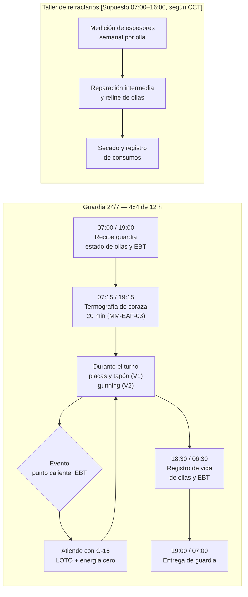
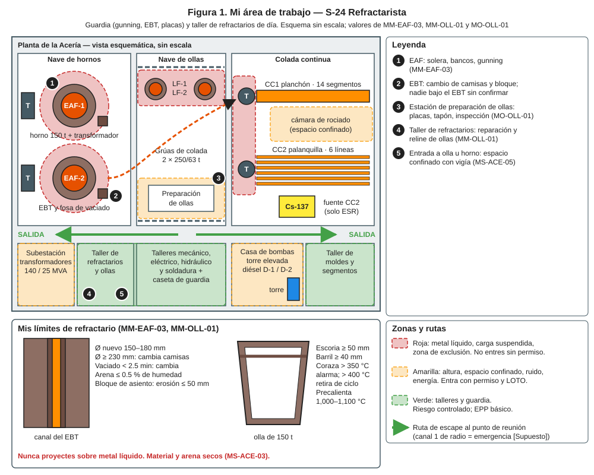
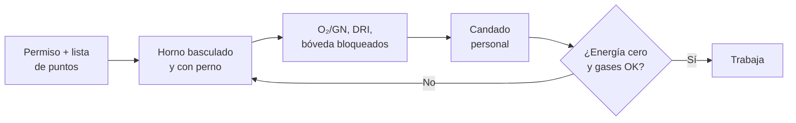
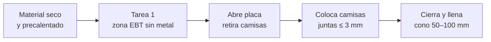
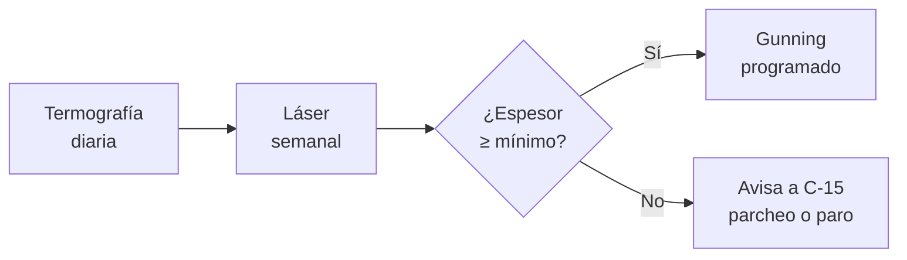
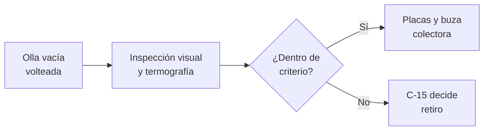
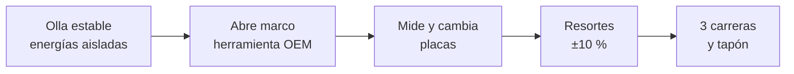
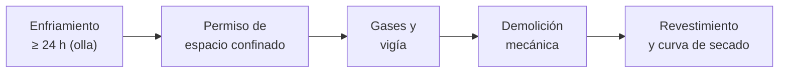

# IT-ACE-S24 — Instrucción de Trabajo: S-24 Refractarista

## 1. Encabezado de control

| Campo | Valor |
|---|---|
| Código | IT-ACE-S24 |
| Versión | 0.1 |
| Estado | Borrador para validación |
| Rol | S-24 Refractarista · sindicalizado — Técnico C (N-4) / B (N-5) / A (N-6) |
| Área | Mantenimiento de Acería / Ollas: refractario del EAF (solera, bancos, EBT, gunning), ollas (revestimiento, placas, tapón) y apoyo a distribuidores |
| Turno | Guardia 4x4 de 12 h (gunning, EBT, placas; relevo 07:00 / 19:00) y taller de refractarios en horario de día · jornada según el CCT [CCT: pedir texto] |
| Reporta a | C-11 Supervisor de Mantenimiento Mecánico (administrativo) y C-15 Especialista de Refractarios (técnico y programa) |
| Manuales de referencia | MM-EAF-03, MM-OLL-01, MO-OLL-01 · MS-ACE-01, -02, -03, -05, -08 · DP-ACE-S (S-24) |
| Elaboró | gerente-personal-sindicalizado (Líder de la Academia de Mantenimiento y Confiabilidad) |
| Revisión técnica | experto-operativo-metalurgia — visto bueno (con observaciones), 2026-09-26 |
| Revisión de seguridad | Pendiente — experto-seguridad-salud |
| Revisión laboral | experto-relaciones-laborales — visto bueno (con observaciones), 2026-09-26 |
| Aprobó | Pendiente — Director |
| Fecha | 2026-09-25 |

> Esta IT resume tu trabajo; **no reemplaza al manual**. Espesores, vidas y materiales dependen del proveedor: **[Validar con OEM / C-15]**. Lo marcado [Supuesto] no se usa en planta hasta validarse.

## 2. Mi puesto en 30 segundos
Mantengo el refractario del horno y de las ollas para evitar perforaciones y fugas de metal. Proyecto (gunning) y reparo el horno y cambio las camisas del EBT. En las ollas cambio placas y tapón y reviso si siguen en ciclo. En el taller revisto ollas. Nunca libero un refractario húmedo: humedad con metal es explosión. Sin funciones de mando (LFT art. 9): si algo no está bien, **aviso, detengo y escalo** a C-11 o C-15.

> ★ **Mis 3 reglas de oro**
> 1. ★ **Todo seco:** arena ≤ 0.5 % de humedad, curva de secado completa, nunca proyecto sobre metal líquido.
> 2. ★ **Nadie bajo el EBT** hasta confirmar horno basculado, bloqueado y sin metal en esa zona.
> 3. ★ **Si no cumple el límite, no apto:** coraza > 400 °C, escoria < 50 mm o barril < 40 mm = olla fuera de ciclo.

## 3. Mi turno de 12 horas

- **Cada colada:** el termoescáner revisa la coraza de la olla. **Cada semana:** láser del EAF y Ø del canal EBT.

> **Mi jornada (nota laboral).** Mi turno está pactado en el CCT [CCT: pedir texto]. El relevo y la entrega–recepción antes de las 07:00 / 19:00 son tiempo de trabajo (LFT art. 58). Se cuentan en la jornada o se pagan según el CCT. La jornada de 12 h y la reforma de 40 h están en revisión (arts. 59–61 y 66–68) — verificar con Jurídico Laboral.

## 4. Mi área de trabajo

## 5. Mi EPP

| Pictograma | EPP | Cuándo lo uso |
|---|---|---|
| [ALUMINIZADO] | Ropa aluminizada, guantes largos aluminizados | Frente al horno o a la olla caliente |
| [CARETA-ORO] | Careta con visor dorado, casco con cubrenuca | Horno, EBT y olla caliente |
| [BOTA] | Botas metatarsales con polainas | Siempre en nave |
| [RESPIRADOR] | Respirador P100 | Demolición, arena, polvo de MgO y sílice (NOM-010) |
| [OÍDO] | Protección auditiva | Demolición y taller |
| [RESCATE] | Arnés con línea de rescate | Entrada al horno o a la olla (espacio confinado) |
| [GAS] | Detector de 4 gases | Entrada al horno o a la olla |

## 6. Mis tareas paso a paso

### Tarea 1 — LOTO del horno o de la olla y energía cero (MS-ACE-02)

| Paso | Qué hago | Cómo verifico (medición) | ★ |
|---|---|---|---|
| 1 | Revisa el permiso: EAF E1, E2 con perno, E3, E4, E6. Olla: GN, argón, cilindro, volteador. | Lista firmada. Agua de paneles sigue **en servicio**. | ★ |
| 2 | Confirma horno basculado hacia la puerta y bloqueado, o olla estable. | Perno de basculamiento o del volteador colocado. | ★ |
| 3 | Pon tu candado personal en la caja grupal. | Un candado por persona. | ★ |
| 4 | Verifica intento de arco, basculamiento o encendido rechazados. | Sin respuesta; gases a 0 bar. | ★ |
| 5 | Mide gases antes de trabajar. | O₂ 19.5–23.5 %, CO < 25 ppm, < 10 % LEL; oxicorte: ≤ 1 % de lectura. | ★ |

> 🛑 **ALTO — detén y avisa si…**
> - El horno bascula o hay metal o escoria líquida en la zona del EBT.
> - El detector marca CO ≥ 25 ppm o ≥ 10 % LEL: sal y ventila.

### Tarea 2 — Cambio de camisas del EBT en caliente (MM-EAF-03) · lidero la ejecución (A)

| Paso | Qué hago | Cómo verifico (medición) | ★ |
|---|---|---|---|
| 1 | Prepara camisas, bloque, mortero y arena. | Todo seco y precalentado; arena ≤ 0.5 % de humedad. | ★ |
| 2 | Aplica la Tarea 1 con zona EBT sin metal. | Talón lejos del EBT; firma de C-05. | ★ |
| 3 | Abre la placa de cierre desde el mando local. | Zona despejada; sin salida de metal. | ★ |
| 4 | Retira camisas y bloque de salida con el extractor OEM. | Canal limpio; asiento sin escalón > 10 mm. | |
| 5 | Pide a C-15 medir el bloque de asiento. | Erosión ≤ 50 mm; si no, programa cambio. | 🔎 |
| 6 | Coloca camisas nuevas con mortero y masa apisonada sin huecos. | Juntas ≤ 3 mm; desalineación ≤ 5 mm. | ★ |
| 7 | Coloca el bloque de salida con S-19 y prueba la placa. | Cierre plano, sin luz visible. | ★ |
| 8 | Mide el Ø nuevo en 3 alturas. | 150–180 mm. | 🔎 |
| 9 | S-03 cierra la placa y llena con arena seca. | Cono visible de 50–100 mm. | ★ |

> 🛑 **ALTO — detén y avisa si…**
> - La arena o el material están húmedos: no los uses.
> - La placa no cierra plana: no llenes; S-19 repara.

### Tarea 3 — Medición y gunning del EAF (MM-EAF-03) · A

| Paso | Qué hago | Cómo verifico (medición) | ★ |
|---|---|---|---|
| 1 | Toma la termografía de coraza y fondo. | ≤ 250 °C objetivo; > 300 °C investiga; > 400 °C 🛑. | 🔎 |
| 2 | Apoya a C-15 en el escaneo láser. | Bancos ≥ 150 mm (< 100 🛑); solera ≥ 300 mm (< 200 🛑). | 🔎 |
| 3 | Revisa la máquina de gunning. | Aire 4–6 bar; agua 10–15 % [Validar]; boquilla sin tapón. | |
| 4 | Proyecta con el horno caliente, sin metal líquido debajo. | Cara ≥ 800 °C; distancia 0.8–1.5 m; capas ≤ 50 mm; sin charcos. | ★ |
| 5 | Revisa el rebote y el secado. | Rebote ≤ 15 %; sin vapor visible (≈ 5–10 min). | 🔎 |
| 6 | Registra el consumo de gunning. | Meta 1.5–2.5 kg/t [Validar]; > 3.5 kg/t avisa a C-15. | 🔎 |

> 🛑 **ALTO — detén y avisa si…**
> - Coraza > 400 °C: no se carga; avisa a C-05 y C-15.
> - Hay metal líquido donde vas a proyectar.

### Tarea 4 — Inspección del refractario de la olla y decisión (MO-OLL-01) · R

| Paso | Qué hago | Cómo verifico (medición) | ★ |
|---|---|---|---|
| 1 | Inspecciona línea de escoria, barril, fondo, zona de impacto y asientos. | Escoria ≥ 50 mm; barril ≥ 40 mm [Supuesto]. | 🔎 |
| 2 | Revisa la termografía del ciclo anterior. | Coraza ≤ 300 °C [Supuesto]; > 350 °C alarma; > 400 °C retiro. | 🔎 |
| 3 | Revisa el conteo de coladas del refractario. | Vida 60–80 coladas. | 🔎 |
| 4 | Si un criterio falla, avisa a C-15 para retirar la olla. | Decisión registrada por C-15. | ★ |
| 5 | Con hidráulica desconectada, revisa o cambia placas y colectora. | Placas vigentes; colectora sin erosión > 5 mm. | ★ |

> 🛑 **ALTO — detén y avisa si…**
> - Coraza > 400 °C o espesor bajo límite: olla fuera de ciclo.

### Tarea 5 — Cambio de placas de válvula deslizante y tapón poroso (MM-OLL-01) · A

| Paso | Qué hago | Cómo verifico (medición) | ★ |
|---|---|---|---|
| 1 | Aísla argón, cilindro y precalentador con tu candado. | Encendido y movimiento rechazados. | ★ |
| 2 | Abre el marco liberando resortes con la herramienta OEM. | Nunca a golpes; resortes descargados. | ★ |
| 3 | Mide las placas retiradas. | Rechazo: barreno > +10 mm; surco > 3 mm; sello < 35 mm [Validar]; grieta pasante. | 🔎 |
| 4 | Coloca placas nuevas del lote correcto. | Planitud visual; mortero ≤ 1 mm; orientación correcta. | ★ |
| 5 | Cierra el marco y verifica fuerza de resortes. | Fuerza OEM ±10 %. | ★ |
| 6 | S-08 prueba 3 carreras. | Carrera completa; presión ≤ 1.2 × normal. | ★ |
| 7 | Si cambias el tapón, colócalo con mortero y prueba caudal. | 100–200 NL/min; sin fuga en el asiento. | ★ |
| 8 | Firma la tarjeta de olla con S-08 y C-15. | Placas, tapón, espesor y temperatura anotados. | ★ |

> 🛑 **ALTO — detén y avisa si…**
> - La válvula traba o la carrera es incompleta: **no se libera**.
> - Hay grieta en el muñón: olla fuera de servicio (C-10, C-11).

### Tarea 6 — Reparación intermedia y reline con entrada a la olla u horno (MM-OLL-01, MS-ACE-05) · A

| Paso | Qué hago | Cómo verifico (medición) | ★ |
|---|---|---|---|
| 1 | Espera el enfriamiento forzado de la olla. | ≥ 24 h; temperatura del aire ≤ 45 °C [Validar]. | ★ |
| 2 | Verifica el permiso de espacio confinado y el vigía. | Permiso firmado; vigía fuera, con rescate listo. | ★ |
| 3 | Desconecta el argón y bloquea el GN del precalentador. | Aislamiento positivo; candado. | ★ |
| 4 | Mide gases abajo, en medio y arriba antes de entrar. | O₂ 19.5–23.5 %; CO < 25 ppm; < 10 % LEL. | ★ |
| 5 | Demuele de forma mecánica antes de entrar. | Sin ladrillo suelto sobre ti. | ★ |
| 6 | Reviste fondo, barril y línea de escoria según plano. | Juntas ≤ 1.5 mm [Validar]; material del lote correcto. | 🔎 |
| 7 | Aplica la curva de secado y el precalentamiento. | Curva del proveedor completa; 1,000–1,100 °C antes del primer acero. | ★ |

> 🛑 **ALTO — detén y avisa si…**
> - O₂ fuera de 19.5–23.5 %, CO ≥ 25 ppm o ≥ 10 % LEL: sal de inmediato.
> - Falta el vigía o el equipo de rescate.

## 7. Mis controles críticos (★)
- ☐ Permiso de trabajo y, si entro, permiso de espacio confinado con vigía.
- ☐ Mi candado personal en la caja grupal.
- ☐ Horno basculado y con perno, u olla estable con perno.
- ☐ Gases medidos: O₂ 19.5–23.5 %, CO < 25 ppm, < 10 % LEL.
- ☐ Material, arena y herramientas secos (arena ≤ 0.5 %).
- ☐ Nadie bajo el EBT ni bajo la olla izada.
- ☐ Curva de secado completa antes del primer acero.
- ☐ Tarjeta de olla o checklist de liberación firmado.

## 8. Si algo sale mal

| Síntoma | Qué hago | A quién aviso |
|---|---|---|
| Metal o escoria saliendo por la coraza | Sal a ≥ 25 m; nunca agua sobre el metal; MS-ACE-09. | C-04, brigada · radio canal 1 (emergencia) [Supuesto] |
| Perforación de olla | Evacúa a ≥ 25 m; metal a fosa seca; sin agua. | C-04, C-16, C-15 · canal 1 [Supuesto] |
| Coraza > 400 °C | 🛑 Olla u horno fuera de ciclo. | C-05 / C-04, C-15 |
| EBT no abre | Solo personal autorizado lancea con O₂ y EPP. | C-05, C-15 |
| Tapón sin paso de argón | Lanceo o cambio de tapón. | C-07, C-15 |
| Gunning se desprende | Ajusta agua y temperatura. | C-15 |
| Olla no llega a 1,000 °C | No la envíes; revisa precalentador. | S-19, C-04 |
| Golpe de calor | Sal al área fresca; hidrátate; MS-ACE-08. | C-04, servicio médico |

## 9. Registros que lleno

| Registro | Cuándo | Dónde |
|---|---|---|
| Tarjeta de vida de la olla (coladas, placas, tapones, espesores) | Cada intervención | Tarjeta de olla y CMMS |
| Registro del EBT (coladas, Ø, tiempo de vaciado) | Cada cambio y semanal | CMMS |
| Mapa termográfico y perfil láser | Diario / semanal | Registro de refractarios |
| Humedad de arena por lote | Cada lote | Registro de materiales |
| Consumo de gunning | Semanal | Registro de consumos |
| Curva de secado y precalentamiento | Cada reparación | Registro del precalentador |
| Permisos, lecturas de gases y checklist de liberación | Cada trabajo | Permiso / CMMS |

## 10. Mi certificación

| Concepto | Detalle |
|---|---|
| Nivel ILUO requerido | **L** Técnico C · **U** Técnico B (MO-OLL-01, MM-EAF-03, MM-OLL-01 solo) · **O** Técnico A (coordina técnicamente y da el liberado técnico con C-15, evaluador en pareja; sin mando) |
| Teoría | Ruta técnica 48 h · MM-EAF-03 24 h · MM-OLL-01 24 h · NOM-033 8 h + NOM-015 |
| OJT | 360 h: 10 revestimientos de olla y 20 reparaciones del EAF · 3 cambios de EBT · 10 cambios de placas + 1 reline · simulacro de rescate |
| Pasos ★ que me evalúan | MM-EAF-03: 1–5, 8, 9, 11, 12, 13 · MM-OLL-01: 2, 3, 6, 7, 10, 12 |
| Vigencia | **12 meses:** espacios confinados (MS-ACE-05), alturas, grúas e izaje. **24 meses:** demás TD-P07 |
| DC-3 / NOM | NOM-033, NOM-010, NOM-006 (enganche), NOM-009, NOM-015, NOM-017 — verificar con Jurídico Laboral / SSO |

> **Mi evaluación no es una sanción** (nota laboral — verificar con Jurídico Laboral)
> - La evaluación TD-P07 sirve para formarme, certificarme y acreditar mi aptitud. No se usa para sancionarme (DP-ACE-S §4).
> - Si aún no demuestro un paso ★, conservo mi categoría, mi salario y mi antigüedad. Recibo retroalimentación, OJT de refuerzo y otra oportunidad [Supuesto: 2 en ≤ 60 días, a validar con la CMCAP].
> - Si ya sé hacer el trabajo, puedo pedir el **examen de suficiencia** (LFT art. 153-U). Si lo apruebo, recibo mi DC-3 sin cursar toda la ruta.
> - La certificación prueba mi aptitud para ascender. Entre los aptos, asciende el de mayor antigüedad (LFT arts. 154–159 y CCT).
> - Si mi certificación se suspende tras un incidente grave, es una medida de seguridad, no una sanción. Paso a tarea no crítica sin perder salario ni antigüedad y me reevalúan en ≤ 15 días [Supuesto].
> - Mi capacitación y mis recertificaciones son en jornada y sin costo para mí. Si caen en mi descanso, se pagan según el CCT [CCT: pedir texto].

## 11. Glosario rápido
- **EBT:** agujero de vaciado excéntrico del fondo del horno.
- **Camisas:** piezas refractarias que forman el canal del EBT.
- **Gunning:** proyección de masa refractaria sobre la pared caliente.
- **Solera:** fondo refractario del horno.
- **Línea de escoria:** zona de la olla que toca la escoria; ladrillo MgO-C.
- **Placas:** piezas de la válvula deslizante que abren y cierran el chorro.
- **Tapón poroso:** pieza del fondo por donde entra el argón.
- **Reline:** revestimiento completo de la olla o del horno.
- **Curva de secado:** calentamiento lento que saca la humedad del refractario.
- **Termoescáner:** cámara que detecta zonas calientes en la coraza.

## 12. Control de cambios

| Versión | Fecha | Cambio | Autor |
|---|---|---|---|
| 0.1 | 2026-09-25 | Emisión inicial para validación, a partir de DP-ACE-S (S-24), MM-EAF-03, MM-OLL-01, MO-OLL-01 y MS-ACE-02/05 | gerente-personal-sindicalizado (Academia de Mantenimiento y Confiabilidad) |
